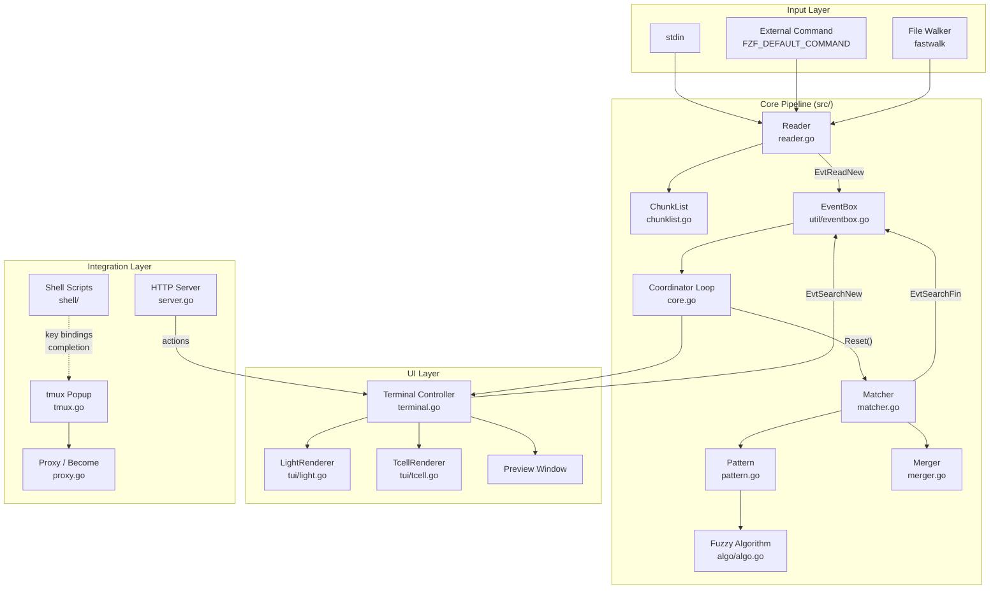
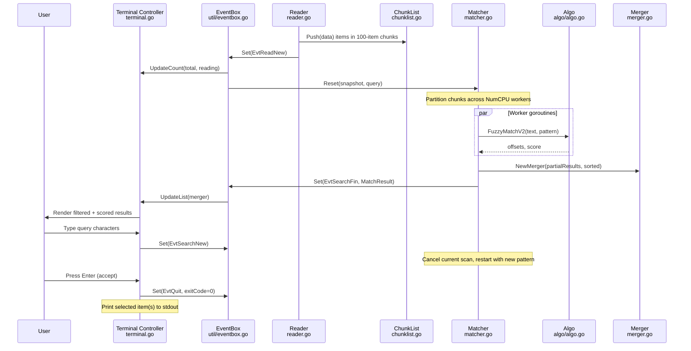
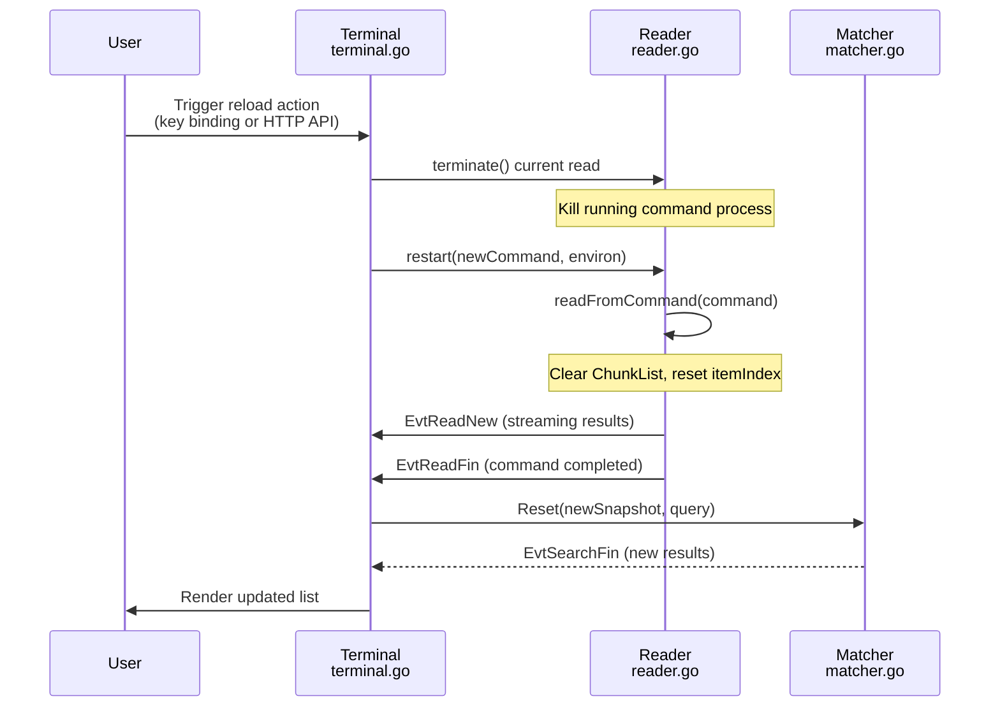
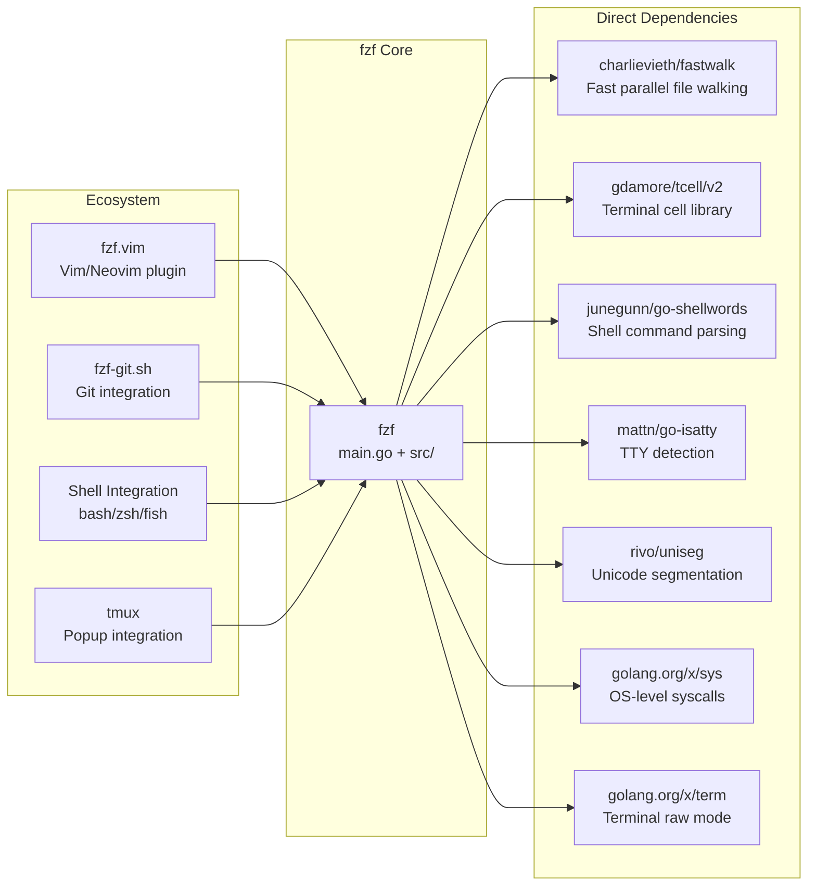

# fzf

> A general-purpose command-line fuzzy finder written in Go

| Metadata | |
|---|---|
| Repository | https://github.com/junegunn/fzf |
| License | MIT License |
| Primary Language | Go |
| Analyzed Release | `v0.67.0` (2025-11-16) |
| Stars (approx.) | 77,600+ |
| Generated by | Claude Opus 4.6 (Anthropic) |
| Generated on | 2026-02-08 |

## Overview

fzf is an interactive Unix filter program for any kind of list data. It implements a fuzzy matching algorithm that lets users quickly narrow down results by typing patterns with omitted characters. The tool reads input from stdin, a file walker, or an external command, presents an interactive terminal UI for filtering, and outputs the selected item(s) to stdout.

Problems it solves:

- Interactively searching and selecting items from arbitrarily large lists (files, command history, processes, git branches, etc.)
- Providing a universal, composable filter primitive that integrates with any Unix pipeline
- Enabling fast, typo-tolerant matching without requiring exact query strings

Positioning:

fzf occupies a unique position as the de facto standard for interactive command-line filtering. Unlike alternatives such as `peco`, `fzy`, or `skim` (a Rust reimplementation), fzf stands out with its comprehensive feature set (preview windows, multi-select, action bindings, tmux integration, server mode), cross-platform support, and massive ecosystem of shell integrations and Vim/Neovim plugins. Originally written in Ruby, it was rewritten in Go for performance, and now handles millions of items with sub-second response times.

## Architecture Overview

fzf follows an event-driven, concurrent pipeline architecture. The system is orchestrated by a central coordinator loop in `core.go` that connects four major subsystems via an EventBox message bus: Reader (input), Matcher (search), Terminal (UI), and the Options parser (configuration). Each subsystem runs in its own goroutine(s), communicating asynchronously through typed events.

## Core Components

### Reader (`src/reader.go`)

- Responsibility: Asynchronous input ingestion from multiple sources
- Key files: `src/reader.go`
- Design patterns: Producer-Consumer, Polling with backoff

The Reader is responsible for feeding data into the processing pipeline. It supports three input modes: reading from stdin, executing an external command (via `FZF_DEFAULT_COMMAND` or `--bind 'start:reload(...)'`), and walking the filesystem using the `fastwalk` library. Input is read in a slab-based buffering scheme (128KB slabs, 64KB read buffers) to minimize allocations and GC pressure. The Reader uses atomic operations to signal new data availability (`EvtReadNew`) with an adaptive polling interval (10ms to 50ms) to balance responsiveness against CPU usage. It supports NUL-delimited input (`--read0`), graceful termination, and dynamic restart for the `reload` action.

### ChunkList (`src/chunklist.go`)

- Responsibility: Thread-safe, chunked storage of input items
- Key files: `src/chunklist.go`, `src/item.go`, `src/cache.go`
- Design patterns: Chunked buffer, Copy-on-write snapshots

ChunkList stores all input items in fixed-size chunks of 100 items each. This design enables lock-free reading through immutable snapshots while the Reader continues to push new items. Each `Item` struct is carefully sized at 56 bytes, containing the text content as `util.Chars`, optional ANSI color offsets, and an ordinal index. The `Snapshot()` method creates a copy of the chunk slice pointers, duplicating only the first and last chunks (which may be partially filled), allowing the Matcher to scan items without holding the mutex. The `--tail` option is supported by trimming older chunks during snapshot creation.

### Matcher (`src/matcher.go`)

- Responsibility: Parallel fuzzy matching across all input items
- Key files: `src/matcher.go`, `src/pattern.go`, `src/algo/algo.go`, `src/result.go`, `src/merger.go`
- Design patterns: Fan-out/Fan-in parallelism, Worker pool, Result caching

The Matcher is the computational heart of fzf. It partitions the chunk list into up to `8 * NumCPU` slices (maximum 32) and dispatches matching work to goroutine workers, each with its own pre-allocated memory slab to avoid contention. Each worker applies the Pattern's matching criteria to its assigned chunks, producing sorted partial results. These are consolidated by the Merger using a k-way merge. The Matcher maintains a merger cache keyed by the pattern string to avoid redundant computation when the input hasn't changed. It communicates progress (`EvtSearchProgress`) for large datasets and can be interrupted mid-scan when a new query arrives (`reqReset`).

### Pattern and Fuzzy Algorithm (`src/pattern.go`, `src/algo/algo.go`)

- Responsibility: Query parsing and scoring-based fuzzy matching
- Key files: `src/pattern.go`, `src/algo/algo.go`, `src/algo/normalize.go`
- Design patterns: Strategy pattern (V1 vs V2 algorithms), Extended search grammar

The Pattern module parses user queries into term sets supporting extended search syntax: fuzzy match (default), exact match (`'`), prefix (`^`), suffix (`$`), and inverse (`!`) operators, combined with OR logic (space-separated within a group) and AND logic (pipe-separated between groups). Two fuzzy algorithms are available: V1 performs a linear O(n) forward scan followed by a backward scan to find the shortest match; V2 implements a modified Smith-Waterman algorithm in O(nm) time to find the optimal highest-scoring match. The scoring system awards bonuses for matches at word boundaries, camelCase transitions, and after path separators, with gap penalties that cancel bonuses after 8 characters of gap, carefully balancing acronym matching against substring matching.

### Terminal Controller (`src/terminal.go`)

- Responsibility: UI rendering, user input handling, action execution
- Key files: `src/terminal.go`, `src/terminal_unix.go`, `src/terminal_windows.go`
- Design patterns: Event loop, Command pattern (action system)

The Terminal is the largest component (9000+ lines) and serves as the central hub of the interactive mode. It manages the prompt, the item list display, the info line, header, preview window, and all user interactions. The action system supports over 80 bindable actions including `execute`, `reload`, `become`, `transform`, `preview`, and `change-query`. Actions can be composed and chained with `+`, and bound to arbitrary key combinations or events (`start`, `focus`, `change`, `result`). The preview window runs commands asynchronously with cancellation support, throttling (500ms delay), and scroll tracking. Terminal supports two rendering backends: the default LightRenderer (direct ANSI escape sequences via `/dev/tty`) and TcellRenderer (using the `tcell` library for broader terminal compatibility).

### TUI Abstraction Layer (`src/tui/`)

- Responsibility: Terminal rendering abstraction with two backend implementations
- Key files: `src/tui/tui.go`, `src/tui/light.go`, `src/tui/tcell.go`
- Design patterns: Strategy pattern, Interface-based polymorphism

The `tui` package defines the `Renderer` interface that abstracts terminal operations (init, resize, input reading, window management). The LightRenderer (`light.go`) communicates directly with the terminal via ANSI escape sequences and raw TTY I/O, providing the fastest rendering path. The TcellRenderer (`tcell.go`) uses the third-party `tcell` library as an alternative for terminals where direct escape sequences are unreliable, and is the default on Windows. Both renderers support windowing, color management (256-color and 24-bit true color), border drawing, mouse input, and Unicode/grapheme cluster handling via the `uniseg` library.

### HTTP Server (`src/server.go`)

- Responsibility: Remote control interface for programmatic interaction
- Key files: `src/server.go`
- Design patterns: Embedded HTTP server, API key authentication

The embedded HTTP server (enabled via `--listen`) exposes a REST-like interface for controlling fzf from external processes. It accepts POST requests with action strings (the same syntax as `--bind`) and GET requests that return current item lists in JSON format with pagination support (`limit`, `offset` parameters). Authentication is enforced via an API key passed in the `x-api-key` header, using constant-time comparison to prevent timing attacks. This enables advanced workflows like dynamic reloading, query manipulation, and multi-step filtering from external scripts.

## Data Flow

### Interactive Fuzzy Search Session

### Reload Action Flow

## Key Design Decisions

### 1. Event-Driven Coordinator Pattern

- Choice: A central event loop in `core.go` coordinates all subsystems through an EventBox message bus rather than direct function calls
- Rationale: Decouples the Reader, Matcher, and Terminal, allowing each to run at its own pace. The Reader can stream data while the Matcher processes previous batches and the Terminal renders intermediate results. This architecture naturally handles the asynchronous nature of user input, data streaming, and background search
- Trade-offs: Event-based coordination adds complexity in debugging and reasoning about state transitions. The coordinator must carefully manage revision numbers to avoid stale results from superseded queries

### 2. Dual Fuzzy Matching Algorithms (V1/V2)

- Choice: Two fuzzy matching algorithms selectable via `--algo=v1|v2` with V2 as the default
- Rationale: V1 (O(n) greedy first-match) is fast but may miss the optimal match position. V2 (O(nm) modified Smith-Waterman) finds the globally optimal match with the highest score. For most interactive use cases, V2's overhead is negligible because high-selectivity queries prune early, but V1 remains available for extreme-scale datasets
- Trade-offs: Maintaining two algorithms increases code complexity. V2 requires pre-allocated scoring matrices (slab memory) per worker goroutine, consuming more memory (~13MB total across 32 partitions)

### 3. Chunked Item Storage with Snapshot Isolation

- Choice: Items are stored in fixed-size chunks (100 items) with copy-on-write snapshot semantics
- Rationale: Fixed-size chunks avoid dynamic resizing and provide predictable memory allocation. The snapshot mechanism (copying only the slice of pointers and duplicating boundary chunks) enables the Matcher to read items without holding locks while the Reader continues to push new data. This is critical for maintaining UI responsiveness during large input streams
- Trade-offs: The 100-item chunk size is a compromise; smaller chunks would reduce snapshot copying but increase per-chunk overhead. Chunk-based caching can become stale when the chunk count changes, requiring cache invalidation

### 4. Slab-Based Memory Pre-allocation

- Choice: Pre-allocate reusable memory slabs for the matching algorithm (100KB uint16 + 2KB uint32 per partition)
- Rationale: The fuzzy matching algorithm requires temporary scoring matrices for each match operation. Allocating these on every match would generate enormous GC pressure when processing millions of items. By pre-allocating slabs per worker goroutine, the system avoids heap allocations during the hot matching loop entirely
- Trade-offs: Fixed memory overhead (~13MB) regardless of actual usage. Slabs are sized for the maximum expected pattern length (1000 characters), which may be wasteful for short queries

### 5. Direct TTY I/O as Default Renderer

- Choice: The default LightRenderer writes ANSI escape sequences directly to `/dev/tty` instead of using a terminal UI library
- Rationale: Direct TTY I/O avoids the overhead of a full terminal abstraction layer, provides the fastest rendering path, and enables fzf to run within pipelines (stdin/stdout for data, `/dev/tty` for UI). This separation of data flow from UI rendering is fundamental to fzf's composability in Unix pipelines
- Trade-offs: Requires handling terminal quirks (escape sequence parsing, UTF-8/grapheme clusters, mouse protocols) manually. The alternative tcell renderer exists for environments where direct escape sequences are unreliable

## Dependencies

## Testing Strategy

fzf employs a multi-layered testing approach combining Go unit tests with Ruby-based integration tests.

Unit tests: Go unit tests cover the core algorithmic components including fuzzy matching (`src/algo/algo_test.go`), ANSI color parsing (`src/ansi_test.go`), chunk list operations (`src/chunklist_test.go`), pattern parsing (`src/options_test.go`), result merging (`src/merger_test.go`), tokenization (`src/tokenizer_test.go`), item ranking (`src/item_test.go`, `src/result_test.go`), and TUI rendering (`src/tui/tui_test.go`, `src/tui/light_test.go`, `src/tui/tcell_test.go`). Tests use pre-allocated slabs to mirror production memory behavior.

Integration tests: Comprehensive Ruby test suites (`test/test_core.rb`, `test/test_filter.rb`, `test/test_preview.rb`, `test/test_layout.rb`, `test/test_server.rb`, `test/test_shell_integration.rb`, `test/test_exec.rb`) exercise fzf as a black-box process, verifying end-to-end behavior including keyboard interactions, preview window rendering, HTTP server API, shell completions, and tmux popup integration. These tests spawn actual fzf processes and simulate terminal input/output.

CI/CD: GitHub Actions workflows run tests on Linux (`linux.yml`) and macOS (`macos.yml`) with additional workflows for CodeQL static analysis (`codeql-analysis.yml`), dependency review (`depsreview.yaml`), typo checking (`typos.yml`), and Windows packaging (`winget.yml`). The project uses GoReleaser (`.goreleaser.yml`) for automated cross-platform binary releases.

## Key Takeaways

1. Event-driven concurrency for interactive tools: fzf demonstrates that an event-bus architecture (EventBox) with independent goroutines for I/O, computation, and rendering provides excellent responsiveness even with millions of items. The coordinator loop in `core.go` is remarkably compact (~250 lines) yet orchestrates the entire application lifecycle, proving that explicit event coordination can be simpler than complex channel topologies.

2. Algorithm selection as a user-facing knob: Rather than committing to a single matching algorithm, fzf exposes V1 (fast, greedy) and V2 (optimal, slower) as a runtime choice. This respects the reality that no single algorithm is optimal for all use cases. The detailed scoring documentation in `algo.go` (bonuses for word boundaries, camelCase, path separators, gap penalties) shows the depth of thought required for "fuzzy" to feel intuitive.

3. Separation of data plane and control plane in CLI tools: By reading input from stdin and rendering UI on `/dev/tty`, fzf cleanly separates the data pipeline from the interactive interface. This architectural decision is what makes fzf universally composable with Unix pipes, and is a pattern that any interactive CLI tool should consider adopting.

4. Memory-conscious design at scale: The combination of chunked storage (100-item fixed arrays), slab-based pre-allocation (avoiding per-match allocations), adaptive polling intervals (10-50ms backoff), and snapshot isolation demonstrates how careful memory management enables Go programs to handle millions of items without GC-induced latency spikes. Each design constant in `constants.go` represents a deliberate tuning decision.

5. Extensibility through action composition: The 80+ bindable actions with chaining (`+`), the `reload`/`become`/`transform` primitives, and the HTTP server API turn fzf from a simple filter into a programmable interactive selector. This extensibility model, where complex behavior emerges from composing simple actions rather than adding flags, keeps the core architecture clean while supporting sophisticated use cases.

## References

- [fzf Official Documentation](https://junegunn.github.io/fzf/)
- [fzf GitHub Repository](https://github.com/junegunn/fzf)
- [fzf Advanced Usage (ADVANCED.md)](https://github.com/junegunn/fzf/blob/master/ADVANCED.md)
- [fzf DeepWiki Architecture Analysis](https://deepwiki.com/junegunn/fzf)
- [fzf Fuzzy Algorithm Source (algo.go)](https://github.com/junegunn/fzf/blob/master/src/algo/algo.go)
- [fzf Go Package Documentation](https://pkg.go.dev/github.com/junegunn/fzf/src)
- [fzf Changelog](https://github.com/junegunn/fzf/blob/master/CHANGELOG.md)
