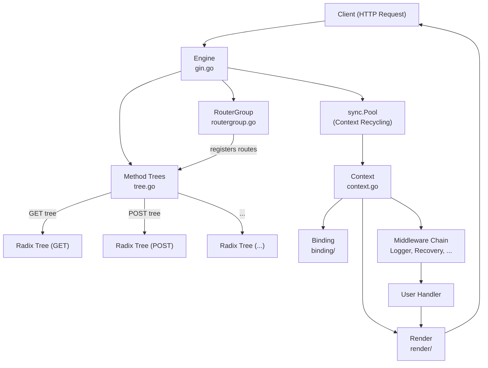
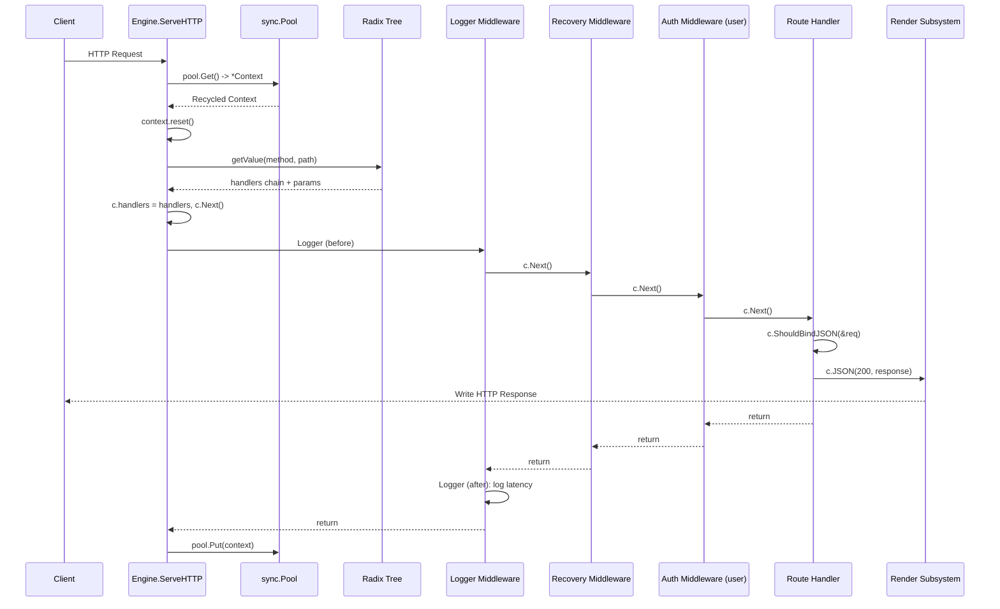
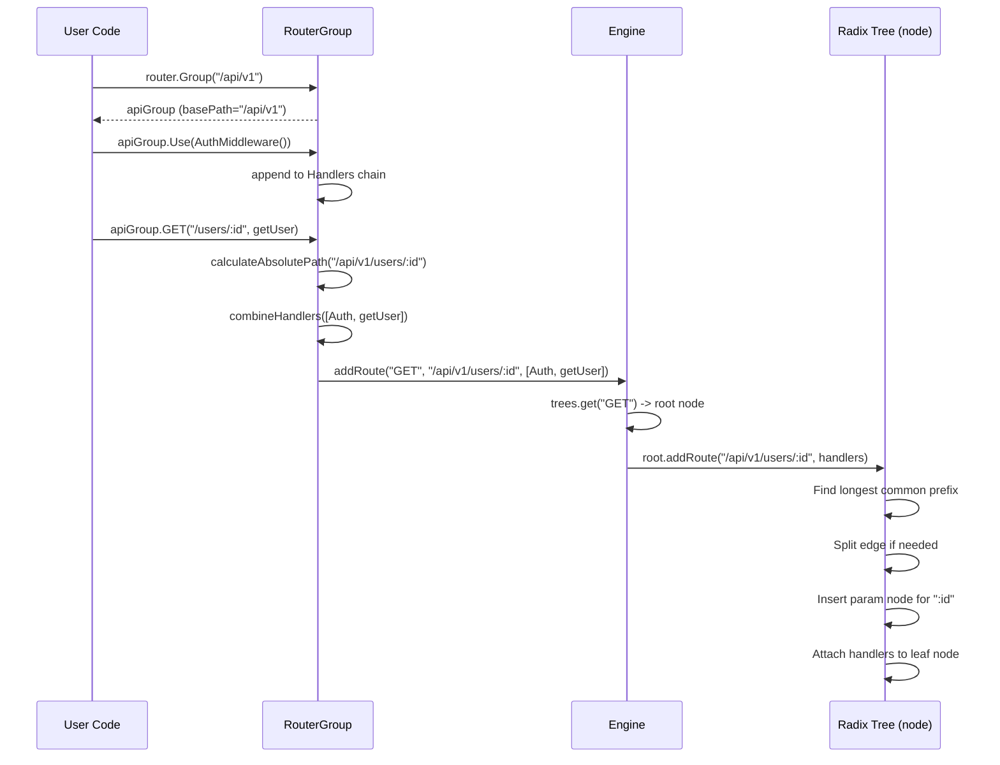
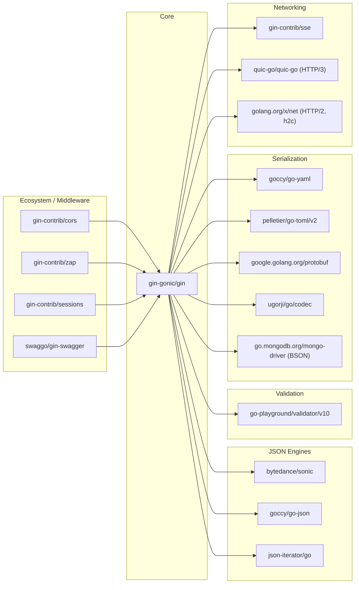

# Gin

> A high-performance HTTP web framework for Go, featuring a Martini-like API with up to 40x better performance thanks to a radix tree based router.

| Metadata | |
|---|---|
| Repository | https://github.com/gin-gonic/gin |
| License | MIT License |
| Primary Language | Go |
| Analyzed Release | `v1.11.0` (2025-09-20) |
| Stars (approx.) | ~87,900 |
| Generated by | Claude Opus 4.6 (Anthropic) |
| Generated on | 2026-02-08 |

## Overview

Gin is a web framework written in Go that provides an expressive, Martini-like API while delivering performance comparable to raw `net/http` handlers. It achieves this by using a compressed radix tree (Patricia trie) for route matching, a sync.Pool-based Context recycling strategy, and a middleware chain architecture that avoids heap allocations in the hot path.

Problems it solves:

- Go's standard library `net/http` provides only a basic `ServeMux` with no support for parameterized routes, middleware chaining, or content negotiation
- Building REST APIs requires repetitive boilerplate for request binding, response rendering, input validation, and error handling
- Many Go web frameworks sacrifice performance for developer ergonomics, forcing a trade-off between productivity and throughput
- Organizing routes, applying shared middleware, and managing route groups requires manual plumbing without a framework

Positioning:

Gin is the most widely adopted Go web framework by GitHub stars (~87,900). Compared to Echo (another high-performance framework), Gin has a larger ecosystem and community. Compared to Chi, Gin provides more built-in features (binding, rendering, validation) but is more opinionated. Compared to the standard library's `http.ServeMux` (improved in Go 1.22), Gin still offers richer middleware management, content negotiation, and a more ergonomic API. Fiber offers similar performance with an Express.js-like API but depends on fasthttp rather than `net/http`, which limits compatibility with the Go ecosystem.

## Architecture Overview

Gin's architecture centers on three core abstractions: the Engine (HTTP server and router), the Context (per-request state carrier), and the RouterGroup (hierarchical route organizer). Incoming requests flow through the Engine's `ServeHTTP` method, which obtains a pooled Context, matches the request path against a per-method radix tree, assembles the middleware+handler chain, and executes them sequentially via `Context.Next()`.

## Core Components

### Engine (`gin.go`)

- Responsibility: Central orchestrator that implements `http.Handler`, manages the radix tree forest, handles Context pooling, and provides server lifecycle methods (Run, RunTLS, RunQUIC, RunUnix)
- Key files: `gin.go`, `mode.go`, `debug.go`
- Design patterns: Facade, Object Pool (sync.Pool), Functional Options (OptionFunc)

The Engine struct embeds a root RouterGroup, making the engine itself a route registrar. It maintains a `methodTrees` slice where each entry holds an HTTP method string and the root node of its corresponding radix tree. The `New()` constructor initializes sensible defaults (trailing slash redirect, forwarded IP headers, trusted proxies), while `Default()` layers on Logger and Recovery middleware. The `ServeHTTP` method is the entry point for every request: it pulls a Context from the sync.Pool, resets it, delegates to `handleHTTPRequest`, and returns the Context to the pool. The `handleHTTPRequest` method iterates over the method trees to find a matching method, calls `root.getValue()` to traverse the radix tree, and upon finding a match, assigns the handler chain to the Context and calls `c.Next()` to begin execution. If no match is found, it handles 404/405 responses with optional trailing-slash redirect and case-insensitive path correction.

### Radix Tree Router (`tree.go`)

- Responsibility: High-performance route storage and lookup using a compressed radix tree (Patricia trie) with support for parameterized (`:param`) and catch-all (`*param`) segments
- Key files: `tree.go`, `path.go`
- Design patterns: Trie/Patricia Trie, Priority-based child ordering

Each node in the radix tree stores a path segment, an indices string (first bytes of child paths for fast branching), a handlers chain, child pointers, and metadata about wildcard children. The `addRoute` method inserts new routes by finding the longest common prefix with existing paths and splitting edges when needed. The `getValue` method performs the lookup: it walks the tree by matching path prefixes, follows the appropriate child based on the indices string, and extracts parameter values from wildcard segments. Nodes are ordered by priority (number of registered handlers in subtrees) so that the most frequently matched branches are checked first. The tree supports backtracking via a `skippedNodes` slice to handle cases where a static path match fails and a wildcard alternative exists. Four node types exist: `static`, `root`, `param`, and `catchAll`.

### Context (`context.go`)

- Responsibility: Per-request carrier that provides the full API surface for reading requests, writing responses, managing middleware flow, storing request-scoped data, and handling errors
- Key files: `context.go`, `context_appengine.go`
- Design patterns: Chain of Responsibility (middleware chain via `Next()`/`Abort()`), Object Pool participant, Context pattern

The Context struct holds a reference to the Request, a custom ResponseWriter, the matched Params, the handler chain, the current chain index, and request-scoped key-value storage (Keys map). The `Next()` method increments the index and calls each handler in sequence, enabling middleware to wrap subsequent handlers. `Abort()` sets the index to `abortIndex` (63), stopping further handler execution. The Context provides rich API categories: input binding (`Bind`, `ShouldBind`, `ShouldBindJSON`, `ShouldBindQuery`, etc.), response rendering (`JSON`, `XML`, `HTML`, `String`, `ProtoBuf`, etc.), parameter access (`Param`, `Query`, `PostForm`, `DefaultQuery`), cookie management, file upload handling, content negotiation, and error collection. The `Copy()` method creates a safe snapshot for use in goroutines, as the original Context is recycled after the request completes.

### RouterGroup (`routergroup.go`)

- Responsibility: Hierarchical route organization with path prefix inheritance and middleware scoping
- Key files: `routergroup.go`
- Design patterns: Composite, Builder

RouterGroup provides the user-facing API for registering routes: `GET()`, `POST()`, `PUT()`, `DELETE()`, `PATCH()`, `OPTIONS()`, `HEAD()`, `Any()`, and `Handle()`. Each method delegates to the internal `handle()` function, which computes the absolute path by combining the group's base path with the relative path, merges the group's middleware chain with the handler-specific handlers via `combineHandlers()`, and calls `engine.addRoute()` to insert the combined chain into the radix tree. The `Group()` method creates a new RouterGroup with an extended base path and a copy of the parent's handler chain, enabling nested middleware scoping. The Engine struct embeds a root RouterGroup (with basePath "/"), so top-level route registration calls flow through the same mechanism. The `Use()` method appends middleware to the group's handler chain, which all subsequently registered routes inherit. Two interfaces (`IRouter` and `IRoutes`) define the public contract, enabling mock implementations for testing.

### Binding Subsystem (`binding/`)

- Responsibility: Deserializing request data (JSON, XML, YAML, TOML, Protobuf, MsgPack, BSON, form data, query parameters, URI parameters, headers) into Go structs with automatic validation
- Key files: `binding/binding.go`, `binding/json.go`, `binding/form.go`, `binding/form_mapping.go`, `binding/default_validator.go`
- Design patterns: Strategy, Interface-based polymorphism

The Binding interface requires `Name()` and `Bind(*http.Request, any) error` methods. Concrete implementations exist for each content type (JSON, XML, YAML, Form, Query, URI, Header, ProtoBuf, MsgPack, TOML, BSON, Plain). The `Default()` function selects the appropriate binding based on the HTTP method and Content-Type header: GET requests default to Form binding, while POST/PUT/PATCH select based on the content type. After binding, the `StructValidator` interface (backed by `go-playground/validator` v10) performs struct-level validation. The `ShouldBind` family of Context methods return errors to the caller, while the `Bind` family aborts with a 400 status on failure.

### Render Subsystem (`render/`)

- Responsibility: Serializing response data into various output formats (JSON, XML, HTML, YAML, TOML, ProtoBuf, MsgPack, plain text, binary data, SSE, redirects) with appropriate Content-Type headers
- Key files: `render/render.go`, `render/json.go`, `render/html.go`, `render/xml.go`
- Design patterns: Strategy, Interface-based polymorphism

The Render interface requires `Render(http.ResponseWriter) error` and `WriteContentType(http.ResponseWriter)` methods. Implementations include JSON (with variants: IndentedJSON, SecureJSON, JsonpJSON, AsciiJSON, PureJSON), XML, HTML (with template support), String, Data, Reader, YAML, TOML, ProtoBuf, and Redirect. The Context exposes convenience methods (`c.JSON()`, `c.XML()`, `c.HTML()`, etc.) that create the appropriate Render implementation and call `c.Render()`, which sets the status code, invokes WriteContentType, and writes the serialized body. HTML rendering supports Go templates with configurable delimiters and function maps, with a debug mode that reloads templates on every request.

## Data Flow

### HTTP Request Processing Pipeline

### Route Registration Flow

## Key Design Decisions

### 1. Compressed Radix Tree per HTTP Method

- Choice: Each HTTP method (GET, POST, PUT, etc.) gets its own radix tree, stored in a flat slice (`methodTrees`) rather than a map
- Rationale: A radix tree provides O(k) lookup where k is the length of the path, independent of the number of registered routes. Separating trees by method avoids an extra branching step during lookup. Using a slice instead of a map avoids hash computation overhead since the number of HTTP methods is small (typically 2-5 trees)
- Trade-offs: Memory is duplicated for path segments shared across methods. Route registration is not concurrency-safe (must be done at startup). The tree implementation is complex (~885 lines) and difficult to extend with new matching semantics

### 2. sync.Pool for Context Recycling

- Choice: Contexts are allocated once and recycled via `sync.Pool`, with a `reset()` method that clears per-request state
- Rationale: In a high-throughput server, allocating and garbage-collecting a Context per request creates significant GC pressure. The pool approach achieves near-zero allocation per request in the hot path, which is critical for Gin's performance claims
- Trade-offs: Contexts must not be retained after the handler returns (a common source of bugs). The `Copy()` method exists as a workaround but creates a full allocation. The pool may grow unboundedly under burst traffic, though Go's GC eventually reclaims idle pool entries

### 3. Middleware as Handler Chain (Chain of Responsibility)

- Choice: Middleware and the final handler share the same `HandlerFunc` signature (`func(*Context)`) and are stored as a flat slice (`HandlersChain`). Execution is driven by `Context.Next()` which increments an index
- Rationale: This design unifies middleware and handlers into a single concept, simplifying the mental model. The index-based iteration avoids recursive function calls and makes abort semantics trivial (set index to abortIndex). Handler chains are computed at route registration time and stored directly in tree nodes, so no chain assembly happens at request time
- Trade-offs: The maximum chain length is 63 (limited by int8 index). Middleware cannot easily return values to callers, they must use the Context's Keys map or Errors slice for inter-middleware communication. The `c.Next()` call is optional in middleware, which can cause subtle ordering issues

### 4. Interface-based Binding and Render Strategy

- Choice: Both request binding and response rendering are defined as interfaces (`Binding`, `Render`) with multiple concrete implementations selected at runtime based on Content-Type
- Rationale: This allows Gin to support many data formats (JSON, XML, YAML, TOML, Protobuf, MsgPack, BSON, form data) without bloating the core. Users can implement custom binders and renderers. The `Default()` function provides automatic content-type negotiation
- Trade-offs: The binding subsystem pulls in many dependencies (sonic, go-json, go-yaml, go-toml, protobuf, msgpack, mongo-driver for BSON). Applications that only use JSON still pay the compile-time cost of all binders. Build tags (`nomsgpack`) provide partial mitigation

### 5. Engine Embedding RouterGroup

- Choice: The Engine struct embeds a RouterGroup as its first field, making the engine itself a valid route registrar
- Rationale: This allows users to call `router.GET()`, `router.POST()`, etc. directly on the engine without explicit group creation. The root group has basePath "/" and serves as the ancestor for all nested groups. Global middleware applied via `engine.Use()` is inherited by all routes
- Trade-offs: The dual identity (Engine is both a server and a route group) can be confusing. The RouterGroup holds a back-pointer to the engine, creating a circular reference that is necessary but adds coupling

## Dependencies

## Testing Strategy

Gin has a comprehensive test suite with high coverage, organized as `_test.go` files alongside source files. The repository includes benchmark tests specifically for routing performance.

Unit tests: Each source file has a corresponding test file (e.g., `gin_test.go`, `context_test.go`, `tree_test.go`, `routergroup_test.go`). Tests use the `testify` assertion library and Go's `net/http/httptest` package to create test servers and record responses. Context tests cover binding, rendering, parameter extraction, abort/next semantics, and error handling. Tree tests verify route insertion, lookup, parameter extraction, trailing-slash handling, and conflict detection.

Integration tests: `gin_integration_test.go` tests the full request lifecycle including server startup, route matching, middleware execution, and response writing. `githubapi_test.go` registers the entire GitHub API surface (~200 routes) as a benchmark for real-world routing performance.

CI/CD: The project uses GitHub Actions with a matrix build across multiple Go versions. Code coverage is tracked via Codecov (`codecov.yml`). Linting is enforced via golangci-lint (`.golangci.yml`). The `Makefile` provides targets for testing, linting, and benchmarking.

## Key Takeaways

1. Radix tree routing eliminates route-count dependency: By using a compressed radix tree instead of a linear route list or hash map, Gin achieves O(k) lookup time proportional to the URL path length, not the number of registered routes. This is a critical architectural choice for any system that needs to handle hundreds or thousands of route patterns without degradation. The per-method tree separation further reduces the search space.

2. Object pooling for hot-path allocations: The sync.Pool-based Context recycling pattern is applicable to any high-throughput system where a per-request object is needed. The key discipline is ensuring the object is fully reset before reuse and never retained beyond its lifecycle. This pattern is more effective than custom free-lists because sync.Pool integrates with Go's GC.

3. Unified handler/middleware signature simplifies composition: By making middleware and handlers share the same function signature (`func(*Context)`), Gin avoids the complexity of separate middleware interfaces or wrapper types. The flat slice with index-based iteration is both simpler and more performant than recursive wrapping. This pattern can be applied to any pipeline-based processing system.

4. Pre-computed handler chains at registration time: Gin merges group middleware and route handlers into a single chain at route registration, storing the complete chain in the radix tree node. This means zero allocation and zero computation during request handling for chain assembly. This "pay at startup, not at runtime" principle is broadly applicable to performance-sensitive systems.

5. Strategy pattern for extensible I/O: The Binding and Render interfaces allow Gin to support diverse data formats while keeping the core framework lean. Each format is a self-contained implementation behind a common interface. This pattern enables users to add custom formats without modifying framework code, and build tags allow excluding unused implementations to reduce binary size.

## References

- [Gin Official Documentation](https://gin-gonic.com/en/docs/)
- [Gin GitHub Repository](https://github.com/gin-gonic/gin)
- [gin-gonic/gin | DeepWiki](https://deepwiki.com/gin-gonic/gin)
- [A Deep Dive into Gin: Golang's Leading Framework - DEV Community](https://dev.to/leapcell/a-deep-dive-into-gin-golangs-leading-framework-5e39)
- [A Deep Dive into Gin: Golang's Leading Framework - Leapcell](https://leapcell.io/blog/golang-leading-framework-gin-deep-dive)
- [RouterGroup and Routing | DeepWiki](https://deepwiki.com/gin-gonic/gin/2.3-routergroup-and-routing)
- [The Context | DeepWiki](https://deepwiki.com/gin-gonic/gin/2.2-the-context)
- [httprouter - Julien Schmidt](https://github.com/julienschmidt/httprouter)
