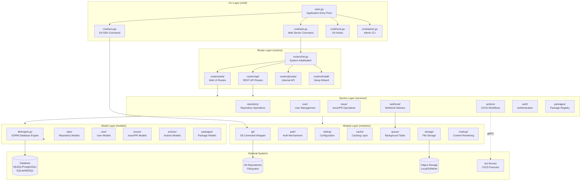
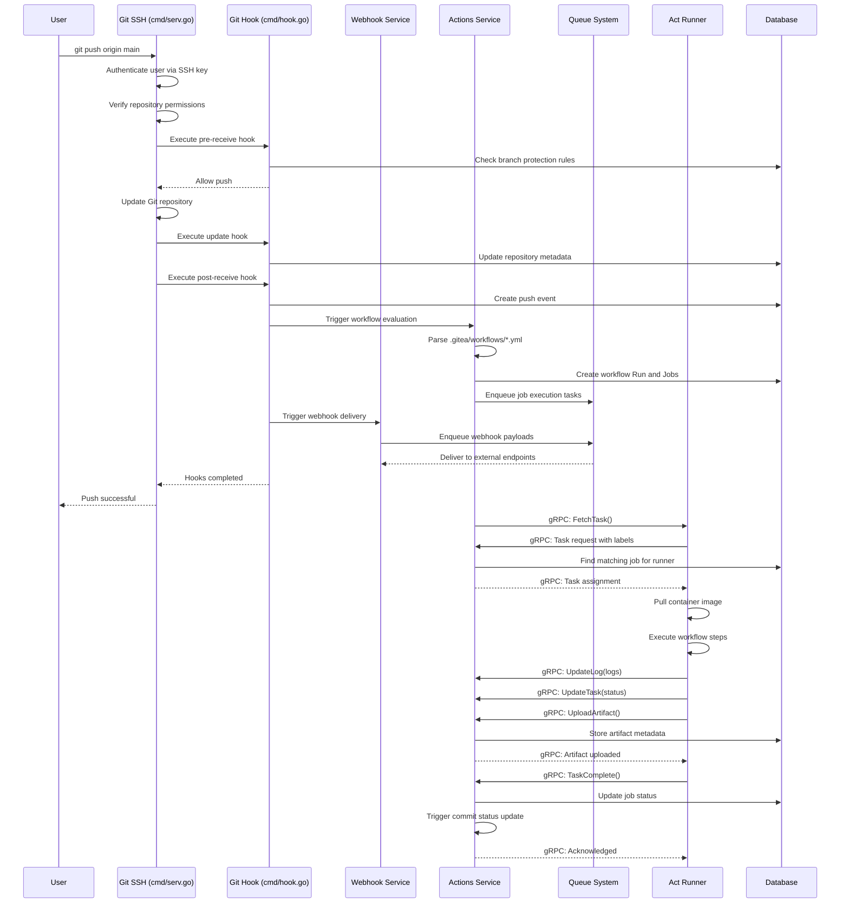
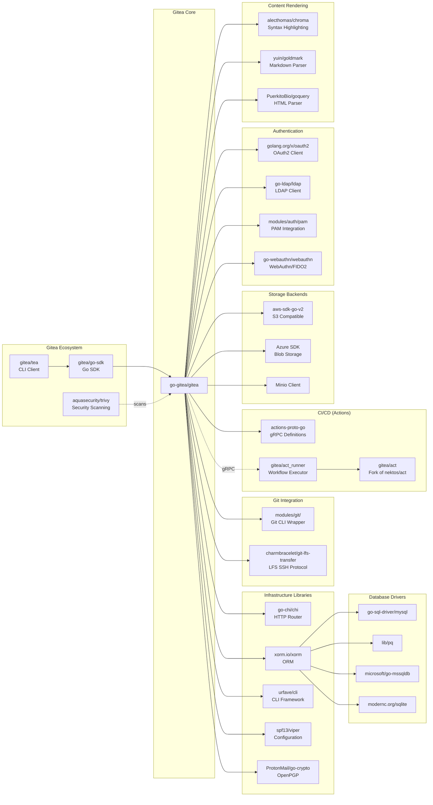

# Gitea

> Painless self-hosted all-in-one software development service, including Git hosting, code review, team collaboration, package registry and CI/CD

| Metadata | |
|---|---|
| Repository | https://github.com/go-gitea/gitea |
| License | MIT License |
| Primary Language | Go |
| Category | Developer Tool |
| Analyzed Release | `v1.25.4` (2026-01-22) |
| Stars (approx.) | 53,600+ |
| Generated by | Claude Opus 4.6 (Anthropic) |
| Generated on | 2026-02-08 |

## Overview

Gitea is a lightweight, self-hosted Git service written in Go, forked from Gogs in November 2016. It provides a complete software development platform including Git repository hosting, code review, issue tracking, package registry, and CI/CD capabilities through Gitea Actions. As a single binary with minimal dependencies, Gitea can run on all platforms supported by Go, including Linux, macOS, and Windows on x86, amd64, ARM, and PowerPC architectures.

Problems it solves:

- Eliminating the need for complex infrastructure and expensive licensing for self-hosted Git services
- Providing a lightweight alternative to heavier platforms like GitLab and GitHub Enterprise, especially for resource-constrained environments
- Offering GitHub-like features and API compatibility for teams wanting to migrate from GitHub while maintaining familiar workflows
- Enabling seamless deployment across diverse platforms and architectures with a single static binary

Positioning:

Gitea positions itself as the easiest and fastest way to set up a self-hosted Git service. Compared to GitLab (comprehensive but resource-intensive) and Forgejo (a hard fork of Gitea focused on federation), Gitea strikes a balance between functionality and simplicity. With GitHub Actions compatibility through Gitea Actions and a growing ecosystem of integrations, it serves as an ideal choice for small to medium teams, educational institutions, and organizations prioritizing operational simplicity.

## Architecture Overview

Gitea employs a layered monolithic architecture with clear separation of concerns. The system is organized into distinct layers: CLI commands (cmd), HTTP routing (routers), business logic (services), data access (models), and utility functions (modules). All components communicate through well-defined interfaces, with strict dependency rules preventing circular imports. The application uses XORM as the ORM layer supporting multiple databases, Chi router for HTTP routing, and Go templates for server-side HTML rendering.

## Core Components

### CLI Layer (`cmd/`)

- Responsibility: Command-line interface and application lifecycle management
- Key files: `cmd/main.go`, `cmd/web.go`, `cmd/serv.go`, `cmd/hook.go`
- Design patterns: Command pattern (urfave/cli/v3), Graceful shutdown pattern

The CLI layer uses the urfave/cli library to implement a comprehensive command-line interface. The main.go entry point initializes the application and delegates to subcommands. The web command (cmd/web.go) starts the HTTP server with graceful shutdown support, handling SIGTERM and SIGINT signals. The serv command handles Git operations over SSH, invoked by the SSH server when authenticated users perform Git operations. Git hooks (pre-receive, update, post-receive) are implemented in cmd/hook.go and execute during Git operations to enforce permissions, trigger webhooks, and update repository metadata.

### Router Layer (`routers/`)

- Responsibility: HTTP request routing, middleware chain, and request/response handling
- Key files: `routers/init.go`, `routers/web/web.go`, `routers/api/v1/api.go`
- Design patterns: Middleware chain pattern, Router group pattern, Dependency injection

Gitea uses Chi router for HTTP routing with a sophisticated middleware chain. The routers/init.go orchestrates system initialization including database setup, cache initialization, authentication providers, cron jobs, queue systems, and service initialization. The web router (routers/web/) handles HTML responses with session-based authentication, CSRF protection, and template rendering. The API router (routers/api/v1/) provides RESTful endpoints with GitHub API compatibility, supporting multiple authentication methods (OAuth2, Basic Auth, Token Auth). Private routers (routers/private/) expose internal APIs for communication between Gitea components and Git hooks.

### Service Layer (`services/`)

- Responsibility: Business logic implementation and orchestration between models and routers
- Key files: `services/repository/`, `services/user/`, `services/issue/`, `services/actions/`
- Design patterns: Service pattern, Transaction script pattern, Observer pattern (notifiers)

The service layer encapsulates all business logic, preventing routers from directly manipulating models. Repository services handle repository creation, forking, migration, deletion, and collaboration. User services manage registration, authentication, profile updates, and organization membership. Issue services coordinate issues, pull requests, code reviews, and merge operations. Actions services implement CI/CD workflow execution, runner registration, job scheduling, and artifact management. Webhook services queue and deliver webhook payloads to external systems. Each service uses database transactions to ensure data consistency and implements a notifier pattern to trigger side effects like notifications and webhooks.

### Model Layer (`models/`)

- Responsibility: Data structures, database schema, and data access logic
- Key files: `models/db/engine.go`, `models/repo/`, `models/user/`, `models/issues/`, `models/actions/`
- Design patterns: Active Record pattern (via XORM), Repository pattern

The model layer uses XORM ORM to map Go structs to database tables. The models/db/engine.go manages the database connection pool and provides a unified Engine interface supporting transactions. Models are organized into domain-specific packages (repo, user, issues, actions, packages). Each model struct defines the database schema through XORM tags and includes query methods for data access. The RegisterModel function registers models for automatic schema synchronization during startup. XORM supports multiple database backends (MySQL, PostgreSQL, SQLite, MSSQL, TiDB) through driver abstraction, with database-specific optimizations in query generation.

### Module Layer (`modules/`)

- Responsibility: Reusable utility functions and low-level infrastructure
- Key files: `modules/git/`, `modules/setting/`, `modules/cache/`, `modules/queue/`, `modules/storage/`
- Design patterns: Adapter pattern (Git wrapper), Strategy pattern (storage backends), Queue pattern

The module layer provides foundational utilities used across all layers. The git module wraps Git command-line operations and provides a Go-friendly interface for repository manipulation. The setting module parses configuration from files, environment variables, and command-line flags using the Viper library. The cache module provides an abstraction over caching backends (memory, Redis, Memcache). The queue module implements background task processing with multiple queue backends (channel, levelqueue, Redis). The storage module abstracts file storage with pluggable backends (local filesystem, S3, Azure Blob, Minio). The markup module renders content in various formats (Markdown, AsciiDoc, Org-mode, CSV) with syntax highlighting via Chroma.

### Gitea Actions (`services/actions/`, `models/actions/`)

- Responsibility: CI/CD workflow execution compatible with GitHub Actions
- Key files: `services/actions/run.go`, `services/actions/job_emitter.go`, `models/actions/run.go`
- Design patterns: gRPC protocol, Job scheduler pattern, Runner registration pattern

Gitea Actions implements a GitHub Actions-compatible CI/CD system. Workflows are defined in .gitea/workflows/ using YAML syntax. When a workflow is triggered by events (push, pull request, schedule), the system creates a Run and schedules Jobs. The job_emitter dispatches jobs to registered act runners via gRPC over HTTP. Act runners are external programs (based on nektos/act) that execute workflow jobs in containers. Runners register with Gitea using tokens and report their labels (supported platforms/architectures). The actions service tracks job status, collects logs, and manages artifacts. The system supports matrix builds, job dependencies, and conditional execution, closely mimicking GitHub Actions behavior.

## Data Flow

### Repository Push with CI/CD Workflow Execution

## Key Design Decisions

### 1. XORM as the Database Abstraction Layer

- Choice: Using XORM ORM for database operations with support for multiple database backends
- Rationale: XORM provides a lightweight ORM with strong support for MySQL, PostgreSQL, SQLite, and MSSQL. It uses struct tags for schema definition, enabling automatic schema synchronization. XORM's session-based API allows explicit transaction management without heavy abstraction overhead
- Trade-offs: XORM is less feature-rich than GORM but offers better performance and simpler semantics. Complex queries sometimes require raw SQL. Schema migrations are handled through auto-sync rather than migration files, which can be risky in production. The Active Record pattern couples data structures with database access, making testing more challenging without proper interfaces

### 2. Chi Router with Middleware Chain Architecture

- Choice: Using go-chi/chi router with a layered middleware chain for authentication, authorization, and request processing
- Rationale: Chi provides a lightweight, idiomatic router that composes well with standard net/http. The middleware chain pattern enables progressive request enhancement (authentication, context enrichment, CSRF protection) and separation of cross-cutting concerns. Chi's compatibility with http.Handler makes it easy to integrate third-party middleware
- Trade-offs: Manual route registration can be verbose compared to annotation-based routing. Middleware ordering is critical and errors can be subtle. The lack of built-in dependency injection requires careful manual wiring or use of context values, which can reduce type safety

### 3. Git Operations via Command-Line Wrapper

- Choice: Wrapping Git command-line operations rather than using libgit2 or go-git
- Rationale: Command-line Git is the canonical implementation and receives rapid updates. Complex operations (rebase, merge, submodules) have reliable behavior. Performance is adequate for most operations, and subprocess isolation prevents library bugs from crashing the main process
- Trade-offs: Subprocess overhead for each Git operation impacts performance. Requires Git binary to be installed on the system. Error handling is more complex, requiring output parsing. Platform-specific issues with process management (Windows vs. Unix). More difficult to implement fine-grained progress reporting

### 4. Gitea Actions with External Act Runners

- Choice: Implementing GitHub Actions-compatible CI/CD with job execution delegated to external act runner processes
- Rationale: External runners enable horizontal scaling and isolation of untrusted code execution. Based on nektos/act, the runners provide high GitHub Actions compatibility. gRPC over HTTP reuses the existing HTTP port and infrastructure. Runner registration with labels enables flexible job routing to appropriate execution environments
- Trade-offs: Requires separate runner deployment and management. Network communication overhead between Gitea and runners. More complex failure scenarios (runner crashes, network partitions). Log streaming latency compared to integrated execution. Artifact transfer requires additional network round-trips

### 5. Monolithic Binary with Optional Features via Build Tags

- Choice: Distributing Gitea as a single statically-linked binary with optional features controlled by build tags
- Rationale: Single binary deployment drastically simplifies installation, updates, and containerization. Build tags (bindata, sqlite, pam) enable customization without requiring separate distributions. Static linking eliminates runtime library dependencies. Cross-compilation to multiple platforms is straightforward with Go's toolchain
- Trade-offs: Binary size grows with embedded assets (templates, static files). Security updates require full binary replacement rather than updating shared libraries. Build-time feature selection prevents runtime plugin installation. Memory usage can be higher than shared libraries. Build process is more complex with asset generation steps

### 6. Template-Based Server-Side Rendering

- Choice: Using Go's html/template package for server-side HTML generation with minimal JavaScript
- Rationale: Server-side rendering provides better SEO, faster initial page loads, and progressive enhancement. Templates are compiled at startup, providing type checking and XSS protection. Minimal JavaScript reduces client-side complexity and improves compatibility with older browsers. Templates are easy to customize and localize
- Trade-offs: Full page reloads are slower than SPA interactions. Limited interactivity compared to React/Vue-based applications. Template debugging can be challenging. Maintaining consistent state across requests requires careful session management. Some features (live updates, real-time collaboration) are harder to implement

## Dependencies

## Testing Strategy

Gitea employs a multi-layered testing approach with emphasis on integration testing.

Unit tests: Each package includes _test.go files with unit tests for isolated functions and methods. The testing.T framework is used with testify/assert for assertions. Test fixtures are stored in testdata/ directories. Database-dependent tests use SQLite in-memory databases for speed. Mock interfaces (like models/db/Engine) enable testing of database operations without a real database.

Integration tests: End-to-end tests in tests/integration/ exercise complete user workflows by starting a real Gitea instance with a test database. These tests use the API client to perform operations (create repository, push code, create PR, run actions) and verify expected outcomes. Git operations are tested against real Git repositories. Actions workflows are tested with actual runner execution.

Performance tests: Benchmark tests measure critical operations like repository indexing, search queries, and Git operations. Load testing is performed manually for major releases to identify bottlenecks in concurrent user scenarios.

CI/CD: GitHub Actions workflows (.github/workflows/) run on every pull request. Database tests (pull-db-tests.yml) run against MySQL, PostgreSQL, MSSQL, and SQLite. Code quality checks include go vet, golangci-lint, and revive. Frontend tests validate JavaScript and CSS. Docker images are built and tested. Nightly builds run extended test suites.

Testing challenges: Git operations are inherently stateful and can be slow. Actions testing requires runner coordination. Database compatibility testing multiplies test execution time. Large-scale concurrency issues are difficult to reproduce in CI.

## Key Takeaways

1. Layered monolith with strict dependency rules: Gitea demonstrates that monolithic architectures can be well-organized through strict layering (cmd → routers → services → models → modules) and prohibition of circular dependencies. This prevents the "big ball of mud" anti-pattern while maintaining deployment simplicity. The pattern is applicable to any Go application requiring clear architectural boundaries without microservice complexity.

2. CLI wrapping for legacy integration: Rather than using native libraries (libgit2, go-git), Gitea wraps command-line Git with a typed Go interface. This pattern trades some performance for reliability, compatibility, and simplicity. It's broadly applicable when integrating with mature command-line tools (ffmpeg, imagemagick, git) where the canonical implementation is more reliable than language-specific libraries.

3. External runners for untrusted code execution: The act runner architecture demonstrates a clean separation between trusted (Gitea server) and untrusted (user workflow) code execution. gRPC over HTTP enables bidirectional communication without additional network infrastructure. This pattern applies to any system executing user-provided code (CI/CD, serverless functions, code playgrounds).

4. Build tags for feature customization: Using Go build tags to conditionally compile features (SQLite support, PAM authentication, embedded assets) enables a single codebase to support diverse deployment scenarios. This is more maintainable than separate distributions but requires careful interface design to prevent feature flag sprawl.

5. Database abstraction with XORM: XORM's struct-tag-based schema definition provides a middle ground between raw SQL and heavyweight ORMs like GORM. The Engine interface enables transaction management and testing with mocks. This pattern suits applications requiring multi-database support without complex ORM features.

6. Middleware chain for progressive enhancement: Chi router's middleware chain progressively enriches requests with authentication, context, permissions, and repository information. Each middleware is independently testable and composable. This pattern enables clean separation of cross-cutting concerns in HTTP applications.

## References

- [Gitea Official Documentation](https://docs.gitea.com/)
- [Guidelines for Backend Development](https://docs.gitea.com/contributing/guidelines-backend)
- [Design of Gitea Actions](https://docs.gitea.com/usage/actions/design)
- [Authentication and Middleware | go-gitea/gitea | DeepWiki](https://deepwiki.com/go-gitea/gitea/3.1-authentication-and-middleware)
- [Web and API Routing System | go-gitea/gitea | DeepWiki](https://deepwiki.com/go-gitea/gitea/3-api-system)
- [Code walkthrough: Gitea data structures | Gitea Forum](https://forum.gitea.com/t/code-walkthrough-gitea-data-structures-for-repositories-issues/4343)
- [Gitea Actions Feature Preview | Gitea Blog](https://blog.gitea.com/feature-preview-gitea-actions/)
- [Git LFS setup | Gitea Documentation](https://docs.gitea.com/administration/git-lfs-setup)
- [Package Registry Overview | Gitea Documentation](https://docs.gitea.com/usage/packages/overview)
- [Gitea Configuration Cheat Sheet](https://docs.gitea.com/administration/config-cheat-sheet)
