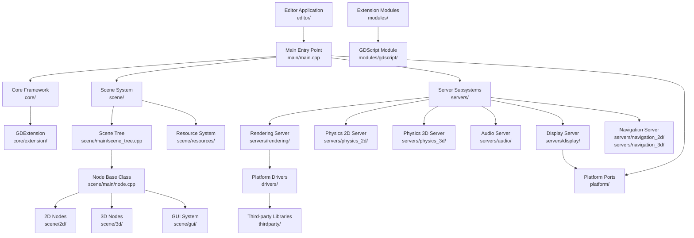
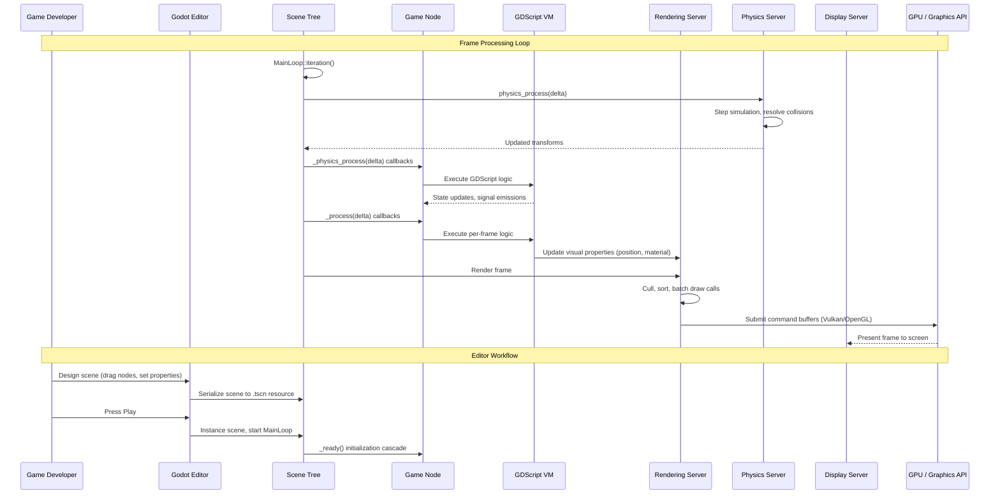
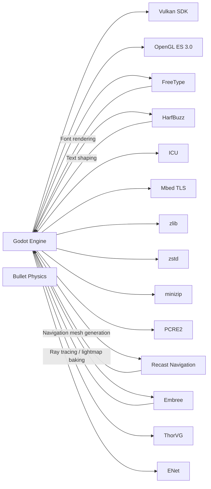

# Godot

> Multi-platform 2D and 3D game engine with an integrated development environment and its own scripting language

| Metadata | |
|---|---|
| Repository | https://github.com/godotengine/godot |
| License | MIT License |
| Primary Language | C++ |
| Category | Game Engine |
| Analyzed Release | `4.6-stable` (2026-01-26) |
| Stars (approx.) | 106,000+ |
| Generated by | Claude Opus 4.6 (Anthropic) |
| Generated on | 2026-02-09 |

---

## Overview

### Problem Domain

Game development requires a comprehensive engine that handles rendering, physics, audio, input, networking, and scripting while remaining accessible to both indie developers and larger teams. Commercial engines like Unity and Unreal impose licensing costs, vendor lock-in, and opaque source code that limit developer autonomy.

### Project Positioning

Godot is a fully open-source, community-driven game engine that provides a complete development environment for 2D and 3D games. It features its own scripting language (GDScript), a visual editor, a scene/node architecture, and export support for desktop, mobile, web, and console platforms. The engine uses a unique scene-tree paradigm where every game element is a node, and nodes are composed into scenes that can be nested and reused. Godot is built entirely in C++ with a modular architecture that allows extending functionality through modules and GDExtension plugins.

---

## Architecture Overview

---

## Core Components

### 1. Core Framework (core/)

Responsibility: Foundational types, memory management, object system, variant types, I/O abstractions, input handling, cryptography, and the extension interface.

Key files:
- `core/object/object.cpp` / `core/object/object.h` - Base Object class with signal/slot system
- `core/variant/variant.cpp` - Dynamic type system used by scripting
- `core/io/` - File system, networking, serialization
- `core/input/input.cpp` - Input event processing and mapping
- `core/config/project_settings.cpp` - Global project configuration
- `core/extension/gdextension.cpp` - Plugin extension interface

Design patterns:
- Object system with ClassDB reflection enabling runtime type introspection
- Variant type providing a type-safe union for all engine types
- Signal-slot mechanism for decoupled inter-object communication
- Reference counting via Ref<T> smart pointers for resource management

The core framework establishes the foundation upon which all other engine subsystems are built. The Object class hierarchy provides signals, properties, method binding, and serialization. The Variant type acts as a universal container that bridges C++ internals with GDScript and GDExtension. ClassDB maintains a global registry of all engine classes, their methods, properties, and signals, enabling the editor to provide autocompletion and the scripting layer to call native code.

### 2. Scene System (scene/)

Responsibility: Node and scene tree architecture, 2D and 3D game objects, GUI widgets, animation, resource management, and the visual composition model.

Key files:
- `scene/main/scene_tree.cpp` - Tree that manages the active node hierarchy
- `scene/main/node.cpp` - Base class for all scene objects
- `scene/2d/` - Sprite2D, TileMap, Camera2D, physics bodies
- `scene/3d/` - MeshInstance3D, Camera3D, lights, physics bodies
- `scene/gui/` - Control, Button, Label, TextEdit, and layout containers
- `scene/resources/` - Materials, textures, meshes, fonts

Design patterns:
- Composite pattern: Nodes form a tree where each node can contain children
- Scene instancing: Scenes are reusable, nestable prefabs
- Process callbacks: _process() and _physics_process() for frame-driven logic
- Group system for broadcasting to tagged node sets

The Scene System implements Godot's distinctive scene-tree paradigm. Every game element, from a character to a UI button to a particle effect, is a Node. Nodes are composed into scenes (saved as .tscn files) that can be instanced and nested. The SceneTree manages the active hierarchy, propagating input events downward, calling process functions each frame, and handling scene transitions. This composition-over-inheritance approach gives developers flexibility in structuring game logic.

### 3. Server Subsystems (servers/)

Responsibility: Backend implementations for rendering, physics simulation, audio mixing, display management, navigation pathfinding, and camera handling.

Key files:
- `servers/rendering/` - Forward clustered and mobile rendering pipelines
- `servers/rendering/renderer_rd/` - RenderingDevice-based renderer (Vulkan/Metal/D3D12)
- `servers/physics_2d/` - 2D physics simulation with GodotPhysics
- `servers/physics_3d/` - 3D physics simulation
- `servers/audio/` - Audio mixing, effects processing, spatial audio
- `servers/display/` - Window management, screen handling

Design patterns:
- Server-client architecture: Servers run on dedicated threads, accessed via thread-safe RIDs
- RID (Resource ID) pattern for opaque handles to server-side resources
- Command queue pattern for deferring operations to the server thread
- Strategy pattern: Swappable rendering backends (Vulkan, Metal, OpenGL, dummy)

Godot separates high-level scene nodes from low-level implementation through a "server" abstraction. The RenderingServer handles all draw calls, material management, and frame composition. Physics servers simulate rigid bodies, collision detection, and constraint solving. Each server runs in its own thread and communicates with the scene layer through RID handles and command queues. This separation allows swapping backends (e.g., Vulkan vs OpenGL) without affecting game code.

### 4. Editor (editor/)

Responsibility: Integrated development environment including the visual scene editor, inspector, script editor, asset library, animation editor, debugger, and export pipeline.

Key files:
- `editor/editor_node.cpp` - Main editor singleton
- `editor/plugins/` - Node-specific editor plugins (tilemap, animation, shader)
- `editor/inspector/` - Property inspector for node configuration
- `editor/scene/` - 2D and 3D viewport rendering in the editor
- `editor/export/` - Platform export templates and build pipeline
- `editor/debugger/` - Remote debugging and profiling

Design patterns:
- Plugin architecture: Each editor tool is an EditorPlugin
- MVC pattern: Inspector view reflects node model state
- Dock system for customizable workspace layout

The editor is itself a Godot application built using the engine's own GUI framework. This "self-hosting" approach means that improvements to the engine's UI system automatically improve the editor. Editor plugins can be written in GDScript or C++, allowing community extensions.

### 5. Platform Layer (platform/, drivers/)

Responsibility: OS-specific implementations for windowing, input, file systems, and graphics API integration across desktop, mobile, web, and console targets.

Key files:
- `platform/linuxbsd/` - Linux and BSD display, input, audio drivers
- `platform/windows/` - Win32 API integration
- `platform/macos/` - macOS/Cocoa integration
- `platform/android/` - Android NDK integration
- `platform/ios/` - iOS UIKit integration
- `platform/web/` - Emscripten/WebAssembly target
- `drivers/vulkan/` - Vulkan rendering driver
- `drivers/gles3/` - OpenGL ES 3.0 rendering driver

Design patterns:
- Abstract factory for platform-specific server implementations
- Adapter pattern wrapping OS APIs behind unified interfaces
- Compile-time platform selection via SCons build system

---

## Data Flow

---

## Key Design Decisions

### 1. Scene-Tree Node Architecture Over Entity-Component-System

Choice: Use a tree of typed nodes composed into scenes rather than an ECS (Entity-Component-System) model.

Rationale: The scene-tree model is intuitive for artists and designers who think in terms of objects with behaviors rather than abstract data tables. Nodes naturally map to visible game objects, and scene instancing provides a prefab-like reuse mechanism. The tree structure enables deterministic processing order and simple parent-child relationships.

Trade-offs: Less cache-friendly than ECS for large numbers of identical entities. Processing thousands of nodes can be slower than iterating flat component arrays. Godot mitigates this through servers that batch operations internally.

### 2. Custom Scripting Language (GDScript) Over Embedding an Existing Language

Choice: Develop GDScript, a Python-like language tightly integrated with the engine, rather than embedding Lua, JavaScript, or Python.

Rationale: GDScript is designed specifically for game development with first-class support for Godot types (Vector2, Transform3D, NodePath), signals, and the scene tree. Tight integration enables features like live reloading, in-editor autocompletion, and type inference that would be difficult with a generic embedded language.

Trade-offs: Smaller ecosystem compared to established languages. Learning curve for developers not familiar with GDScript. Mitigated by also supporting C#, C++ (GDExtension), and community-maintained bindings.

### 3. Server-Client Threading Model for Subsystems

Choice: Run rendering, physics, and audio on dedicated threads, communicating via command queues and RID handles.

Rationale: Decouples frame rate from physics rate and prevents expensive rendering operations from blocking game logic. The RID indirection allows servers to manage their own memory layouts optimized for their specific workloads.

Trade-offs: Adds latency (one frame of lag between game state and rendered output). Makes debugging harder since state is split across threads. Requires careful synchronization at frame boundaries.

### 4. SCons Build System with Module Architecture

Choice: Use SCons (Python-based build system) with a modular compile-time plugin system rather than CMake or Meson.

Rationale: SCons provides flexible Python scripting for complex build logic. The module system (each module has a `config.py` and `SCsub`) allows features to be compiled in or out, reducing binary size for specific platforms. Third-party libraries are vendored in `thirdparty/` for reproducible builds.

Trade-offs: SCons is slower than Ninja-backed systems for incremental builds. Less familiar to developers accustomed to CMake. The vendored approach increases repository size.

### 5. Multiple Rendering Backends (Vulkan, OpenGL, Metal)

Choice: Support both Vulkan/Metal (Forward+ and Mobile renderers) and OpenGL ES 3.0 (Compatibility renderer).

Rationale: Vulkan provides modern GPU features (compute shaders, bindless resources) needed for high-end 3D rendering. OpenGL ES 3.0 ensures compatibility with older hardware and WebGL. Metal support is required for Apple platforms.

Trade-offs: Maintaining multiple backends increases code complexity significantly. Feature parity between backends is difficult; some effects are only available in the Vulkan renderer.

---

## Dependencies

---

## Testing Strategy

Godot uses multiple layers of testing to ensure engine stability:

- Unit Tests: The `tests/` directory contains C++ unit tests using the doctest framework. Tests cover core types (Variant, String, Vector), math operations, scene nodes, and server functionality. Tests are compiled into the engine binary and run via command-line flags.

- Integration Tests: GDScript-based test scenes validate end-to-end behavior of engine features, including rendering output, physics simulation, and animation playback.

- Regression Tests: The project maintains a collection of minimal reproduction projects for reported bugs, ensuring fixes do not regress.

- CI Pipeline: GitHub Actions runs builds and tests across multiple platforms (Linux, Windows, macOS) and configurations (debug, release, with/without modules).

- Editor Tests: The editor includes built-in testing tools for validating UI behavior and plugin functionality.

---

## Key Takeaways

1. Scene-tree composition creates an intuitive development model: Godot's node-based scene architecture provides a natural mapping between visual game objects and code structure. The ability to nest scenes as reusable prefabs and attach scripts to any node creates a flexible composition system that scales from simple prototypes to complex games.

2. Server abstraction enables parallel execution and backend flexibility: By separating high-level nodes from low-level implementations through server interfaces, Godot achieves multi-threaded processing while allowing rendering backends (Vulkan, OpenGL, Metal) to be swapped without affecting game code.

3. Self-hosted editor validates the engine's own capabilities: Building the editor as a Godot application using the engine's GUI framework means that every UI improvement benefits both the editor and end-user applications. This approach also ensures the GUI system is battle-tested.

4. Module system enables customizable engine builds: The compile-time module architecture allows developers to strip unnecessary features for specific platforms, producing smaller binaries for mobile and web targets while maintaining full functionality for desktop development.

5. Community-driven development sustains rapid iteration: With over 2,000 contributors and a transparent RFC process, Godot's architecture evolves based on real-world game development needs rather than corporate roadmaps, resulting in pragmatic design decisions.

---

## References

- Godot GitHub Repository: https://github.com/godotengine/godot
- Godot Architecture Overview: https://docs.godotengine.org/en/stable/engine_details/architecture/godot_architecture_diagram.html
- Internal Rendering Architecture: https://docs.godotengine.org/en/stable/engine_details/architecture/internal_rendering_architecture.html
- Godot Design Philosophy: https://docs.godotengine.org/en/stable/getting_started/introduction/godot_design_philosophy.html
- Engine Architecture Documentation: https://docs.godotengine.org/en/stable/engine_details/architecture/index.html
