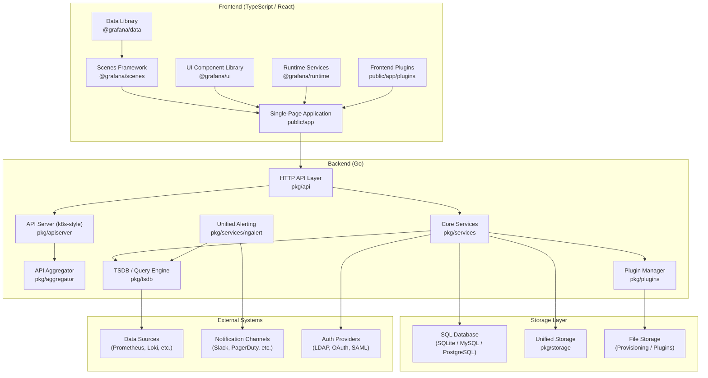
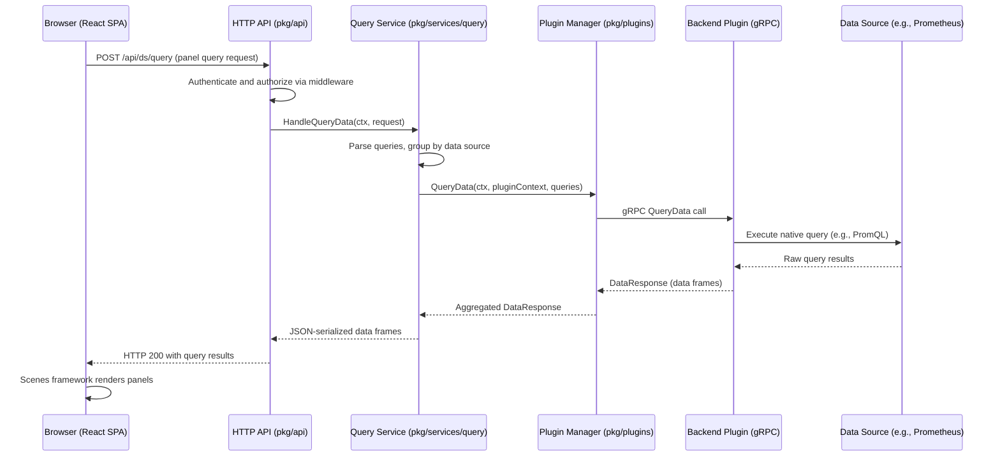
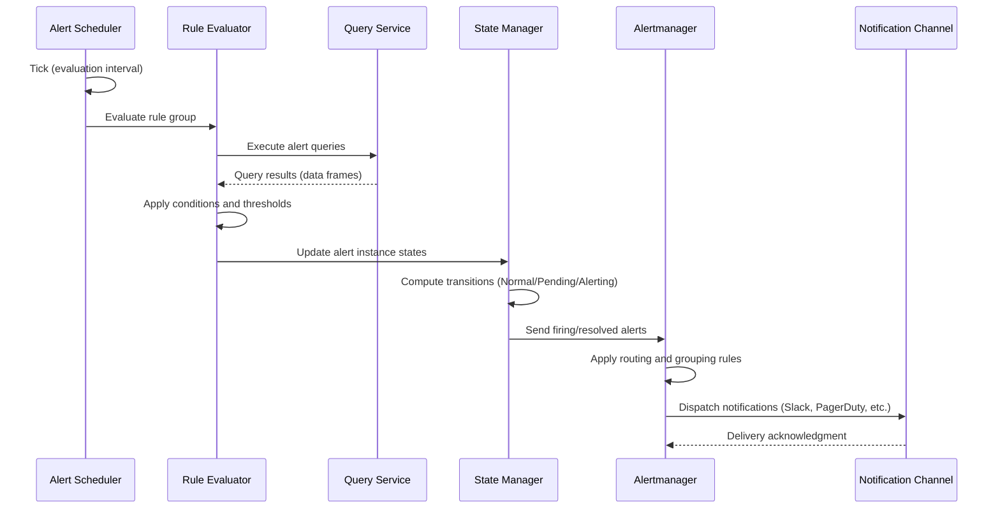
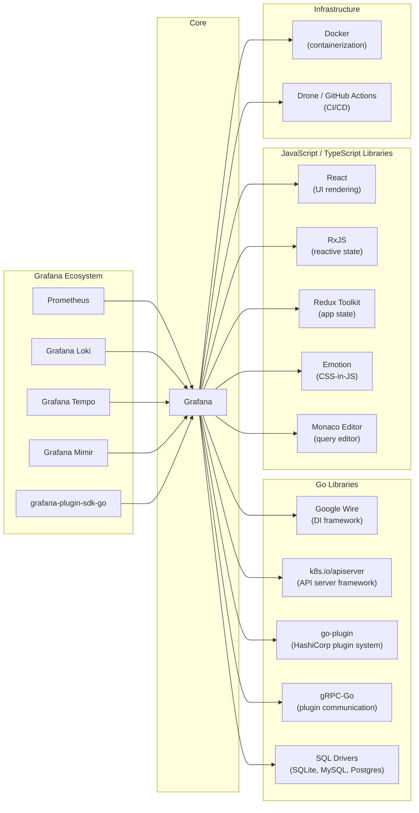

# Grafana

> The open and composable observability and data visualization platform for metrics, logs, and traces from multiple sources.

| Metadata | |
|---|---|
| Repository | https://github.com/grafana/grafana |
| License | GNU Affero General Public License v3.0 (AGPL-3.0) |
| Primary Language | TypeScript / Go |
| Analyzed Release | `v12.3.2` (2026-01-27) |
| Stars (approx.) | 72,000+ |
| Generated by | Claude Opus 4.6 (Anthropic) |
| Generated on | 2026-02-08 |

## Overview

Grafana is a full-stack observability platform that enables users to query, visualize, alert on, and understand metrics, logs, and traces regardless of where they are stored. It provides a rich, interactive dashboard experience built on a React frontend and a Go backend, with an extensible plugin architecture that supports dozens of data sources out of the box and thousands of community-contributed plugins.

Problems it solves:

- Fragmented observability tooling: Unifies visualization across heterogeneous data sources (Prometheus, Loki, Elasticsearch, InfluxDB, PostgreSQL, and many more) into a single pane of glass
- Complex alerting across data silos: Provides a unified alerting system that can evaluate rules across multiple data sources and route notifications through various channels
- Lack of extensibility in monitoring platforms: Offers a robust plugin system allowing custom data sources, panel visualizations, and full application extensions without forking the core
- Dashboard collaboration and sharing: Enables teams to collaboratively build, share, and provision dashboards through code-based provisioning and public dashboard features

Positioning:

Grafana competes with Datadog, New Relic, and Splunk in the commercial observability space, but distinguishes itself as the leading open-source alternative. It is the de facto visualization layer in the Prometheus/CNCF monitoring ecosystem and serves as the frontend for Grafana Labs' own managed offerings (Grafana Cloud, Mimir, Loki, Tempo). Unlike monolithic SaaS platforms, Grafana's composable architecture lets users choose their own storage backends while maintaining a unified query and visualization experience.

## Architecture Overview

Grafana follows a client-server architecture with a clear separation between a TypeScript/React single-page application (SPA) frontend and a Go backend. The backend is built as a modular monolith using Google Wire for dependency injection, with services organized around domain concerns (dashboards, alerting, data sources, plugins). The system is transitioning toward a Kubernetes-style API server model with unified resource storage, while the frontend has adopted the Scenes framework for reactive, tree-based dashboard rendering.

## Core Components

### HTTP API Layer (`pkg/api`)

- Responsibility: Serves as the primary interface between the frontend SPA and the backend, handling REST API routing, authentication middleware, and request dispatching
- Key files: `pkg/api/api.go` (route registration), `pkg/api/dashboard.go` (dashboard CRUD), `pkg/api/ds_query.go` (data source query proxying), `pkg/api/dataproxy.go` (data source proxy)
- Design patterns: Middleware chain (authentication, authorization, rate limiting), Handler-based routing, DTO pattern for request/response serialization (`pkg/api/dtos`)

The API layer registers all HTTP routes and applies middleware for cross-cutting concerns like authentication via the context handler (`pkg/services/contexthandler`), RBAC-based access control (`pkg/services/accesscontrol`), and request instrumentation. Each route handler delegates to the appropriate service layer, maintaining a thin controller pattern. The API also handles data source proxying, where queries to external data sources are routed through Grafana's backend to enforce authentication and CORS policies.

### Core Services (`pkg/services`)

- Responsibility: Implements all business logic organized by domain, including dashboards, data sources, users, organizations, folders, annotations, and provisioning
- Key files: `pkg/services/dashboards/` (dashboard service), `pkg/services/datasources/` (data source management), `pkg/services/query/` (query service), `pkg/services/provisioning/` (file-based provisioning), `pkg/services/sqlstore/` (SQL data access layer)
- Design patterns: Service-oriented architecture, Repository pattern for data access, Dependency injection via Google Wire, ProvideService factory pattern

Each service follows a consistent pattern: a Go struct encapsulating dependencies (logger, configuration, database), a `ProvideService` factory function registered with Wire for dependency injection, and public methods accepting `context.Context` as the first parameter. The dependency graph is defined in `pkg/server/wire.go` and `pkg/cmd/grafana-server/wire.go`, ensuring services are instantiated in the correct order. The `WIRE_TAGS` environment variable enables conditional compilation of feature-specific code paths via `pkg/cmd/grafana-server/wireexts_oss.go`.

### Plugin System (`pkg/plugins`, `public/app/plugins`)

- Responsibility: Manages the lifecycle of all plugins (data sources, panels, app plugins) including discovery, loading, initialization, health checking, and resource proxying
- Key files: `pkg/plugins/manager/` (plugin lifecycle management), `pkg/plugins/backendplugin/` (gRPC communication with backend plugins), `pkg/plugins/storage/` (plugin file management), `public/app/plugins/` (built-in frontend plugins)
- Design patterns: Plugin architecture (frontend via module federation, backend via gRPC), Strategy pattern for plugin types, Process management for plugin binaries

The plugin system operates across two parallel tracks. Frontend plugins are TypeScript/React modules loaded at runtime by the Grafana SPA. Backend plugins are standalone Go binaries communicating with the Grafana server over gRPC using the `grafana-plugin-sdk-go`. This dual architecture allows plugins to execute server-side logic (e.g., queries requiring authentication, alerting evaluations) while providing rich client-side visualizations. Core plugins ship bundled with Grafana in `public/app/plugins/`, while external plugins are installed to `data/plugins/` and follow the same loading mechanism.

### Unified Alerting Engine (`pkg/services/ngalert`)

- Responsibility: Evaluates alert rules across data sources, manages alert state transitions, and routes notifications through configured channels
- Key files: `pkg/services/ngalert/ngalert.go` (service entry point), `pkg/services/ngalert/schedule/` (rule evaluation scheduler), `pkg/services/ngalert/state/` (alert state manager), `pkg/services/ngalert/notifier/` (Alertmanager integration)
- Design patterns: Scheduler pattern with per-rule-group goroutines, State machine for alert instance transitions, Multi-tenant Alertmanager with organization isolation

The alerting engine (ngalert) replaced the legacy dashboard-based alerting in Grafana 8. It operates as a background service with a scheduler that assigns each rule group to a dedicated goroutine. Rules within a group are evaluated sequentially, and state transitions (Normal, Pending, Alerting, Resolved) are tracked by the state manager. Alert instances are persisted to the `alert_instance` table in either compressed Protobuf or legacy JSON format. The notification pipeline integrates with an embedded Alertmanager that supports remote modes (remote-only, remote-primary, remote-secondary) for high availability.

### Scenes Framework and Frontend Application (`public/app`, `packages/grafana-*`)

- Responsibility: Provides the reactive dashboard rendering engine, UI component library, and runtime services for the single-page application
- Key files: `public/app/features/dashboard-scene/` (Scenes-powered dashboards), `public/app/core/` (core frontend services), `packages/grafana-ui/` (UI component library), `packages/grafana-data/` (data models and transformations), `packages/grafana-runtime/` (runtime services and plugin loading)
- Design patterns: Reactive state management with RxJS, Scene graph (tree-based rendering), Component library pattern, Module federation for plugin loading

The Scenes framework, adopted as the dashboard rendering engine starting with Grafana 10, models dashboards as a tree of scene objects. Each node (visualizations, data queries, variables, time ranges) manages its own state via RxJS observables, and React components subscribe to these state changes for efficient re-rendering. This architecture decouples state from the React component lifecycle, preserving query results when panels are unmounted and avoiding unnecessary re-fetches. The frontend is organized into feature modules under `public/app/features/` covering domains like `dashboard-scene`, `explore`, `alerting`, `plugins`, `datasources`, `variables`, and more.

### API Server and Unified Storage (`pkg/apiserver`, `pkg/aggregator`, `pkg/storage`)

- Responsibility: Exposes a Kubernetes-style API for resource management and provides a unified storage abstraction layer for the transition from SQL-only to resource-based storage
- Key files: `pkg/apiserver/` (Kubernetes-style API server built on `k8s.io/apiserver`), `pkg/aggregator/` (API aggregation and routing), `pkg/storage/` (unified storage backends), `pkg/apis/` (resource type definitions)
- Design patterns: Kubernetes API server pattern, Custom Resource Definitions, Dual-write migration pattern with feature toggles, API aggregation layer

Grafana is progressively adopting Kubernetes API conventions for resource management. The API server (`pkg/apiserver`) implements standard Kubernetes REST semantics (CRUD, watch, list) for Grafana resources such as dashboards, folders, and alert rules. The aggregator (`pkg/aggregator`) composes multiple resource APIs into a unified surface, handling API discovery, delegated authentication, and OpenAPI schema aggregation. During the migration from legacy SQL storage, the system employs a dual-write pattern controlled by feature toggles, ensuring backward compatibility while enabling the new storage backend.

## Data Flow

### Dashboard Query Execution

### Alert Rule Evaluation

## Key Design Decisions

### 1. Google Wire for Dependency Injection

- Choice: Adopted Google Wire as the compile-time dependency injection framework, replacing the earlier Facebook Inject (runtime reflection-based) approach
- Rationale: Wire generates code at compile time, making dependencies explicit and type-safe. The ProvideService pattern ensures all service dependencies are declared as function parameters rather than injected into struct fields, enabling the Go compiler to catch wiring errors before runtime
- Trade-offs: Requires code generation step (`wire_gen.go` files must be regenerated when the dependency graph changes). The monolithic wire graph in `pkg/server/wire.go` can become complex as the number of services grows, though `WIRE_TAGS` helps manage conditional bindings

### 2. Parallel Frontend/Backend Plugin Architecture via gRPC

- Choice: Plugins operate as separate OS processes communicating with Grafana through HashiCorp's go-plugin framework over gRPC, with a parallel frontend plugin system using dynamic module loading
- Rationale: Process isolation ensures that a crashing or misbehaving plugin cannot bring down the Grafana server. The gRPC interface provides language-agnostic extensibility (though the SDK targets Go), clear API boundaries, and enables plugins to manage their own dependencies independently
- Trade-offs: Higher latency compared to in-process calls due to IPC overhead. Plugin developers must manage two codebases (Go backend + TypeScript frontend) for full-featured plugins. The plugin SDK versioning must be carefully managed to maintain compatibility across Grafana versions

### 3. Scenes Framework for Dashboard Rendering

- Choice: Replaced the legacy Angular-based and Redux-based dashboard rendering with the Scenes framework, a reactive tree-based rendering engine using RxJS for state management
- Rationale: Decoupling state from React component lifecycle prevents data loss during panel re-renders and eliminates unnecessary query re-execution. The tree structure naturally models dashboard hierarchy (dashboard > rows > panels > queries) and enables features like variable cascading and time range inheritance
- Trade-offs: Introduces a custom reactive framework that new contributors must learn. Migration from the legacy dashboard system required maintaining two parallel code paths (`public/app/features/dashboard` and `public/app/features/dashboard-scene`) during the transition period

### 4. Kubernetes-Style API Server Adoption

- Choice: Progressively migrating resource management to a Kubernetes-style API server built on `k8s.io/apiserver`, with API aggregation and unified storage
- Rationale: Kubernetes API conventions provide well-understood patterns for CRUD operations, watch semantics, RBAC, and API versioning. This enables Grafana to support declarative configuration, GitOps workflows, and eventual integration with the broader Kubernetes ecosystem
- Trade-offs: Significant complexity increase from embedding a Kubernetes API server. The dual-write migration pattern (writing to both legacy SQL and new unified storage) adds operational overhead. The transition requires careful feature toggle management to avoid breaking existing deployments

### 5. Multi-Tenant Unified Alerting with Embedded Alertmanager

- Choice: Built a multi-tenant alerting system (ngalert) with an embedded Prometheus Alertmanager, supporting per-organization isolation and remote Alertmanager modes
- Rationale: Unifying alerting across all data sources eliminates the fragmentation of the legacy per-datasource alerting model. Embedding Alertmanager provides a familiar, battle-tested notification pipeline while organization-level isolation supports multi-tenant deployments
- Trade-offs: The embedded Alertmanager must be kept in sync with upstream Prometheus Alertmanager changes. Multi-tenant isolation adds complexity to state management and notification routing. Large-scale deployments may need to use remote Alertmanager modes, adding operational complexity

## Dependencies

## Testing Strategy

Grafana employs a multi-layered testing strategy spanning unit tests, integration tests, and end-to-end tests across both the Go backend and TypeScript frontend.

Unit tests: Backend unit tests are written using Go's standard `testing` package with testify for assertions. Frontend unit tests use Jest and React Testing Library. Both test suites are designed to run fast and cover individual service logic, utility functions, and component rendering without external dependencies.

Integration tests: Backend integration tests in `pkg/tests/` spin up a test server with a real database (typically SQLite) to verify service interactions, API endpoints, and data persistence. Frontend integration tests verify complex user workflows within individual feature modules.

End-to-end tests: Grafana has migrated from Cypress to Playwright with the `@grafana/plugin-e2e` framework (since Grafana 11.0). E2E tests simulate real user workflows against a running Grafana instance (typically in Docker), covering dashboard creation, data source configuration, alerting flows, and plugin interactions. The `@grafana/plugin-e2e` package provides specialized fixtures and page object models for plugin testing.

CI/CD: The CI pipeline runs on GitHub Actions (historically Drone CI). It includes linting (golangci-lint for Go, ESLint/Prettier for TypeScript), type checking, unit tests, integration tests, and E2E tests. Build artifacts are produced for multiple platforms (Linux, macOS, Windows, Docker images). The pipeline uses `WIRE_TAGS` to control feature-specific builds and runs separate pipelines for enterprise extensions.

## Key Takeaways

1. Compile-time dependency injection scales for large Go monoliths: Grafana's adoption of Google Wire demonstrates that compile-time DI, while requiring a code generation step, provides far better safety guarantees than runtime reflection-based DI in large codebases with hundreds of services. The consistent `ProvideService` factory pattern creates a predictable, discoverable service registration model that new contributors can follow mechanically.

2. Process-isolated plugins provide safety at the cost of complexity: By running backend plugins as separate OS processes communicating over gRPC, Grafana achieves strong isolation guarantees -- a misbehaving plugin cannot crash the host. This pattern, borrowed from HashiCorp's go-plugin framework, is worth adopting in any system where third-party extensions are a core feature. The trade-off is increased operational complexity and IPC overhead, which Grafana mitigates through connection pooling and health checking.

3. Reactive state trees decouple data lifecycle from UI lifecycle: The Scenes framework's approach of modeling dashboards as a tree of stateful objects with RxJS subscriptions solves a fundamental problem in complex UIs: data being lost or re-fetched when components unmount. This architectural pattern -- separating state ownership from rendering -- is broadly applicable to any application with complex, hierarchical, data-driven views.

4. Kubernetes API patterns work outside Kubernetes: Grafana's progressive adoption of `k8s.io/apiserver` for resource management demonstrates that Kubernetes API conventions (typed resources, REST semantics, watch, RBAC, API versioning) provide a mature framework for building resource management APIs, even in applications that do not run on Kubernetes. The dual-write migration pattern shows a pragmatic approach to incremental adoption.

5. Unified alerting across heterogeneous data sources requires a dedicated evaluation engine: Rather than delegating alerting to individual data sources, Grafana built a centralized evaluation engine (ngalert) that can query any data source, apply conditions, and manage state transitions uniformly. This design choice eliminates alerting fragmentation and provides a consistent user experience, serving as a model for any platform that aggregates multiple backend systems.

## References

- [Grafana Official Documentation](https://grafana.com/docs/grafana/latest/)
- [Grafana GitHub Repository](https://github.com/grafana/grafana)
- [DeepWiki: Grafana Architecture](https://deepwiki.com/grafana/grafana/2-architecture)
- [DeepWiki: Grafana Plugin System](https://deepwiki.com/grafana/grafana/11-plugin-system)
- [DeepWiki: Grafana Unified Alerting](https://deepwiki.com/grafana/grafana/7-unified-alerting-system)
- [Grafana Scenes Framework](https://grafana.com/developers/scenes/)
- [Grafana Dashboards Powered by Scenes Blog Post](https://grafana.com/blog/grafana-dashboards-are-now-powered-by-scenes-big-changes-same-ui/)
- [How React Powers Grafana's Frontend](https://grafana.com/blog/an-inside-look-at-how-react-powers-grafanas-frontend/)
- [Grafana Plugin Development Tools](https://grafana.com/developers/plugin-tools/)
- [Grafana Architecture Overview (kozhuhds.com)](https://www.kozhuhds.com/blog/an-easy-look-at-grafana-architecture/)
- [Grafana Architecture Explained (dev.to)](https://dev.to/favxlaw/grafana-architecture-explained-how-the-backend-and-data-flow-work-49d0)
