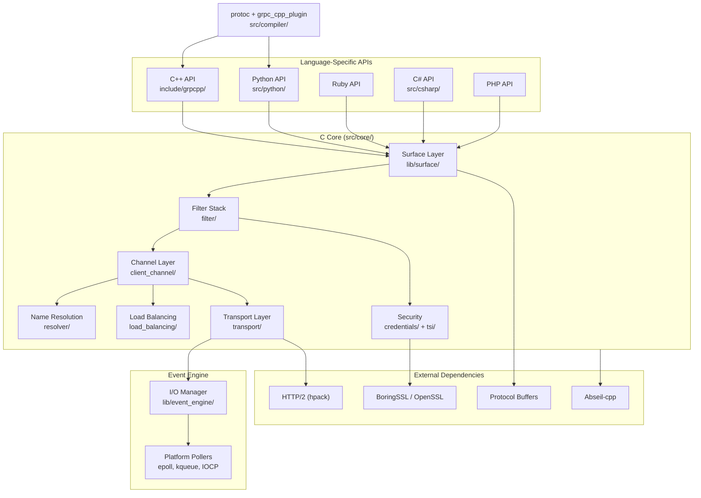
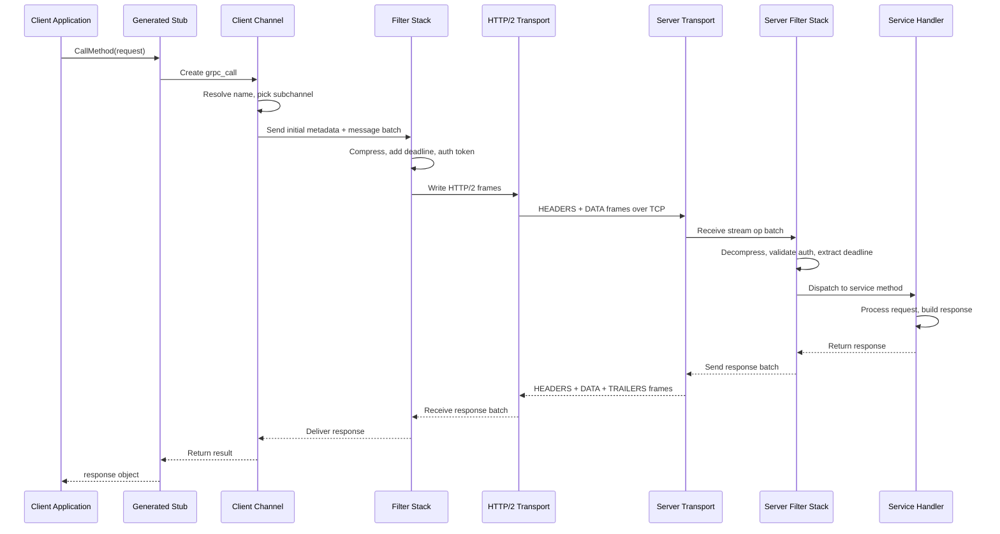
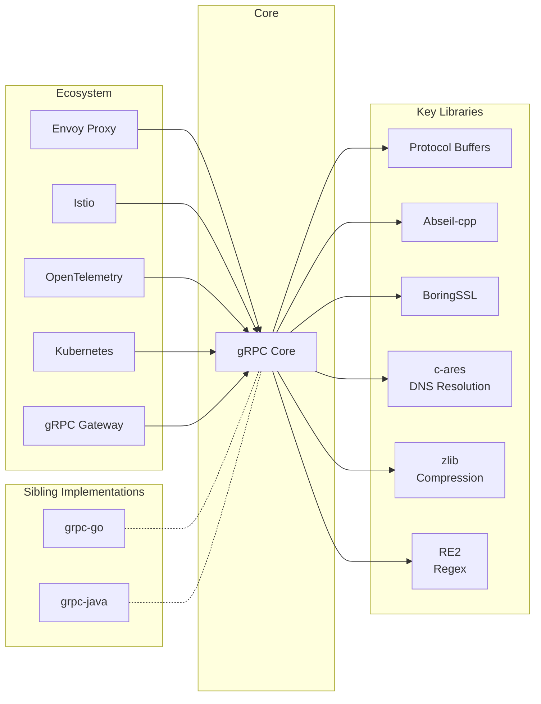

# gRPC

> High-performance, open-source universal RPC framework built on HTTP/2 and Protocol Buffers

| Metadata | |
|---|---|
| Repository | https://github.com/grpc/grpc |
| License | Apache-2.0 |
| Primary Language | C++ |
| Category | Networking |
| Analyzed Release | `v1.78.0` (2026-02-04) |
| Stars (approx.) | 44,000+ |
| Generated by | Claude Opus 4.6 (Anthropic) |
| Generated on | 2026-02-09 |

## Overview

gRPC is a high-performance, language-neutral remote procedure call (RPC) framework originally developed by Google. It uses HTTP/2 as its transport protocol and Protocol Buffers as its interface definition language and serialization format. The framework provides features like bidirectional streaming, flow control, header compression, and multiplexing over a single TCP connection.

Problems it solves:

- Inefficient inter-service communication in microservice architectures where REST/JSON introduces serialization overhead and lacks streaming support
- Lack of strongly-typed service contracts that can generate client and server code across multiple programming languages
- Difficulty implementing bidirectional streaming, flow control, and connection multiplexing with traditional HTTP/1.1 APIs
- Manual effort required to maintain client libraries across different languages for the same service interface
- Performance bottlenecks from text-based serialization formats (JSON/XML) in latency-sensitive systems

Positioning:

gRPC is the dominant RPC framework for cloud-native microservices, widely adopted by companies like Google, Netflix, Square, and Lyft. Compared to REST APIs, gRPC offers significantly better performance through binary serialization and HTTP/2 multiplexing. Unlike Apache Thrift or Cap'n Proto, gRPC benefits from deep integration with the Cloud Native Computing Foundation (CNCF) ecosystem, including Kubernetes, Envoy, and Istio. The project serves as the foundation for Google Cloud APIs and is the standard for inter-service communication in many large-scale distributed systems.

## Architecture Overview

gRPC is built as a layered architecture with a shared C core (C-core) that implements the fundamental RPC machinery, upon which language-specific bindings (C++, Python, Ruby, C#, PHP, Objective-C) are built. The C-core handles HTTP/2 transport, connection management, and the filter stack, while language wrappers provide idiomatic APIs. A separate Go implementation (grpc-go) and Java implementation (grpc-java) exist as independent codebases optimized for their respective runtimes.

## Core Components

### C Core Transport Layer (`src/core/transport/`)

- Responsibility: Managing HTTP/2 connections, stream multiplexing, flow control, and frame-level I/O
- Key files: `src/core/transport/chttp2/`, `src/core/ext/transport/chttp2/transport/chttp2_transport.cc`, `src/core/lib/transport/transport.h`
- Design patterns: Abstract transport interface, State machine for HTTP/2 stream lifecycle, Batch operation pattern

The transport layer implements the HTTP/2 protocol that underlies all gRPC communication. The chttp2 transport handles frame parsing, HPACK header compression, stream multiplexing, and flow control windows. A fundamental abstraction is grpc_transport_stream_op_batch, which represents a collection of stream operations (send initial metadata, send message, receive message, etc.) sent to the transport as an atomic unit. The transport layer supports both inprocess transports (for same-process communication) and network transports. Each transport manages the lifecycle of HTTP/2 streams, mapping gRPC calls to HTTP/2 request/response pairs with trailers carrying status information.

### Channel and Client Channel (`src/core/client_channel/`)

- Responsibility: Managing connections to servers, name resolution, load balancing, and retry logic
- Key files: `src/core/client_channel/client_channel.cc`, `src/core/resolver/dns/c_ares_dns_resolver.cc`, `src/core/load_balancing/pick_first/pick_first.cc`, `src/core/load_balancing/round_robin/round_robin.cc`
- Design patterns: Builder pattern for channel construction, Strategy pattern for load balancing, Observer pattern for connectivity state

The channel is the central abstraction for client-side communication. When a client creates a channel to a target URI, the client channel orchestrates name resolution (DNS, xDS), subchannel management, load balancing (pick_first, round_robin, grpclb, xDS), and connection establishment with retries and exponential backoff. Channels track connectivity state (IDLE, CONNECTING, READY, TRANSIENT_FAILURE, SHUTDOWN) and notify watchers of transitions. Subchannels represent individual connections to backend servers, and the load balancer selects among ready subchannels for each RPC.

### Filter Stack (`src/core/filter/`)

- Responsibility: Implementing a middleware pipeline for intercepting and transforming RPC operations
- Key files: `src/core/filter/`, `src/core/lib/channel/channel_stack.h`, `src/core/lib/surface/call.cc`
- Design patterns: Interceptor/Filter chain pattern, Decorator pattern for adding cross-cutting concerns

The filter stack is the backbone of gRPC's extensibility. Each channel has a stack of filters through which every RPC operation passes. Filters handle cross-cutting concerns like compression, deadline propagation, census (stats), retry logic, and authentication. When a call is initiated, the surface layer creates a grpc_call object and sends operation batches down through the filter stack. Each filter can intercept, modify, or short-circuit operations. The server side has its own filter stack that mirrors the client side, handling decompression, authentication validation, and server-side census collection.

### Code Generation (`src/compiler/`)

- Responsibility: Generating language-specific client stubs and server skeletons from Protocol Buffer service definitions
- Key files: `src/compiler/cpp_generator.cc`, `src/compiler/python_generator.cc`, `src/compiler/ruby_generator.cc`, `src/compiler/csharp_generator.cc`
- Design patterns: Code generation via protoc plugin architecture, Visitor pattern for traversing proto descriptors

The gRPC code generator operates as a plugin to the Protocol Buffers compiler (protoc). For each .proto file containing service definitions, the plugin generates: client stubs that provide type-safe methods for making RPCs, server base classes that developers implement to provide service logic, and serialization helpers. The generated code handles the boilerplate of marshaling arguments, managing streams, and translating between language-native types and protobuf wire format. Each language has its own generator that produces idiomatic code following the conventions of that language.

### xDS and Service Mesh Integration (`src/core/xds/`)

- Responsibility: Implementing the xDS protocol for dynamic configuration, enabling integration with service mesh control planes
- Key files: `src/core/xds/grpc/xds_client_grpc.cc`, `src/core/xds/xds_client/xds_client.cc`
- Design patterns: Discovery service pattern, Eventually consistent configuration model, Watch-based subscription

The xDS subsystem allows gRPC clients and servers to receive dynamic configuration from a control plane (like Istio or Envoy). It implements the Listener Discovery Service (LDS), Route Discovery Service (RDS), Cluster Discovery Service (CDS), and Endpoint Discovery Service (EDS). This enables features like traffic splitting, fault injection, and weighted routing without application changes. The xDS client maintains long-lived streaming connections to the control plane and processes configuration updates asynchronously, making gRPC a first-class participant in service mesh architectures.

## Data Flow

### Unary RPC Call Flow

## Key Design Decisions

### 1. HTTP/2 as Transport Protocol

- Choice: Use HTTP/2 instead of a custom binary protocol
- Rationale: HTTP/2 provides multiplexing, header compression, flow control, and server push out of the box. It works with existing infrastructure (proxies, load balancers, firewalls) that understands HTTP semantics. It enables bidirectional streaming natively
- Trade-offs: Higher overhead than a minimal custom protocol. HTTP/2 framing adds bytes per message. The protocol's complexity increases implementation and debugging difficulty. Connection-level head-of-line blocking in TCP remains (addressed by HTTP/3)

### 2. Shared C Core with Language Wrappers

- Choice: Implement core RPC machinery once in C and wrap it for multiple languages, rather than independent implementations per language
- Rationale: Ensures consistent behavior across languages. Reduces duplication of complex protocol logic. Bug fixes and performance improvements benefit all wrapped languages simultaneously
- Trade-offs: C FFI boundaries add complexity and debugging difficulty. Language-specific optimizations may be harder to implement. Go and Java opted for independent implementations due to runtime integration needs. Memory management across the C/language boundary requires careful handling

### 3. Protocol Buffers as Default Serialization

- Choice: Use Protocol Buffers as the primary IDL and serialization format rather than JSON, Thrift, or FlatBuffers
- Rationale: Protobuf provides compact binary encoding (3-10x smaller than JSON), backward-compatible schema evolution, and mature code generation across 10+ languages. Google's internal experience with protobuf at scale validated its reliability
- Trade-offs: Binary format is not human-readable, complicating debugging without tools like grpcurl. Requires a compilation step (protoc) in the build pipeline. Schema-first approach is less flexible than schema-on-read formats. Protobuf message size limits (default 4MB) can surprise users

### 4. Filter Stack for Extensibility

- Choice: Implement a composable filter/interceptor stack through which all RPCs pass
- Rationale: Allows modular addition of features (compression, auth, retry, observability) without modifying core transport code. Each filter is independently testable and replaceable
- Trade-offs: Deep filter stacks add latency per call. Filter ordering dependencies can be subtle and error-prone. The asynchronous callback-based filter API in C-core is complex to implement correctly

### 5. Streaming as First-class Primitive

- Choice: Support four RPC types: unary, server streaming, client streaming, and bidirectional streaming
- Rationale: Many real-world use cases (log streaming, chat, real-time updates) require streaming. Building streaming into the core protocol avoids bolting it on as an afterthought
- Trade-offs: Streaming adds complexity to the API surface and code generation. Error handling in streams is more nuanced than in unary calls. Resource management (backpressure, cancellation) requires careful attention from both framework and application developers

## Dependencies

## Testing Strategy

gRPC has an extensive testing infrastructure to ensure cross-language compatibility and performance.

Unit tests: Each language binding has its own unit test suite. The C-core tests are in `test/core/` covering transport, channel, filter, and security components. Tests use the gRPC test infrastructure which provides test-specific transports and mock endpoints.

Integration tests: Cross-language interoperability tests in `test/cpp/interop/` verify that clients and servers in different languages can communicate correctly. These tests cover unary, streaming, error handling, metadata passing, and various authentication scenarios. The interop test matrix covers C++, Python, Ruby, C#, PHP, and other languages.

CI/CD: gRPC uses Kokoro (Google's CI system) and GitHub Actions. The CI runs tests across Linux, macOS, Windows, and multiple compiler versions. Performance benchmarks run as part of CI to detect regressions. The test suite includes stress tests, memory leak detection (ASAN/MSAN/TSAN), and fuzzing targets. Release builds are validated against the full interop test matrix.

## Key Takeaways

1. Shared core reduces cross-language maintenance: By implementing the complex HTTP/2 and RPC machinery once in C, gRPC achieves consistent behavior across 7+ language bindings while keeping maintenance costs manageable. However, Go and Java demonstrate that languages with strong runtime requirements may benefit from native implementations.

2. Protocol choice shapes the ecosystem: Choosing HTTP/2 rather than a custom protocol was a strategic decision that enabled gRPC to work with existing infrastructure (proxies, load balancers) and paved the way for service mesh integration. This demonstrates how transport-level decisions have far-reaching ecosystem effects.

3. Code generation bridges the type-safety gap: The protoc plugin architecture for code generation shows how IDL-based systems can provide type-safe, idiomatic APIs across languages while maintaining a single source of truth for service contracts. This pattern is applicable to any system requiring cross-language interoperability.

4. Filter stacks enable modular middleware: The composable filter chain pattern provides a clean separation of concerns for cross-cutting features. This architecture has been adopted widely, influencing HTTP middleware patterns in frameworks across many languages.

## References

- [gRPC Official Documentation](https://grpc.io/docs/)
- [gRPC Core Concepts and Architecture](https://grpc.io/docs/what-is-grpc/core-concepts/)
- [gRPC Transport Explainer](https://grpc.github.io/grpc/core/md_doc_core_transport_explainer.html)
- [gRPC C++ API Reference](https://grpc.github.io/grpc/cpp/)
- [gRPC GitHub Repository](https://github.com/grpc/grpc)
- [Internals of gRPC Architecture - Medium](https://ssudan16.medium.com/internals-of-grpc-architecture-afae7450ff5b)
- [gRPC DeepWiki](https://deepwiki.com/grpc/grpc)
