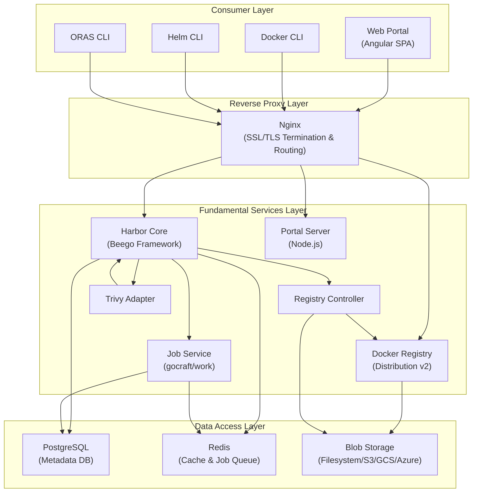
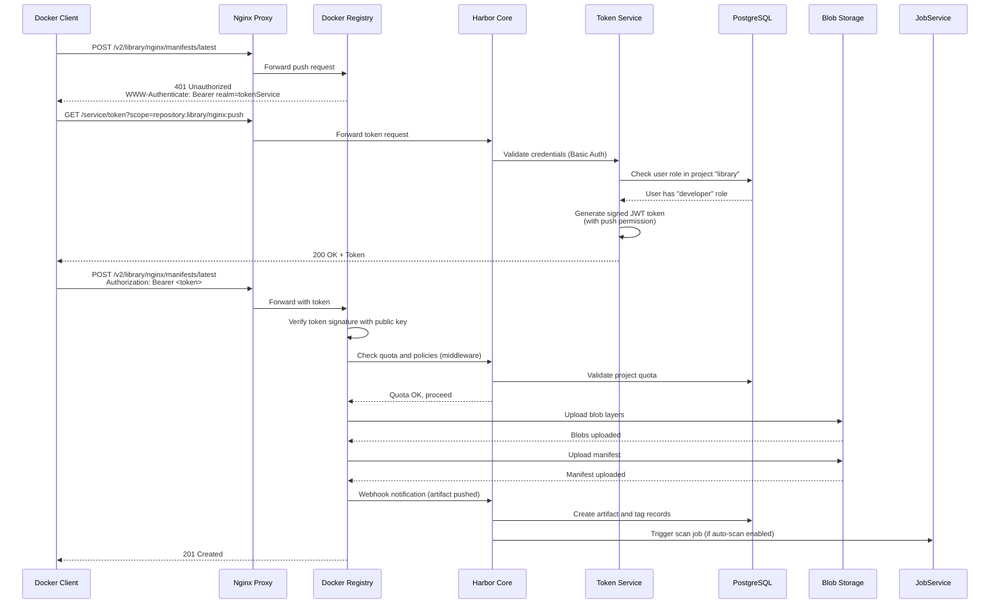
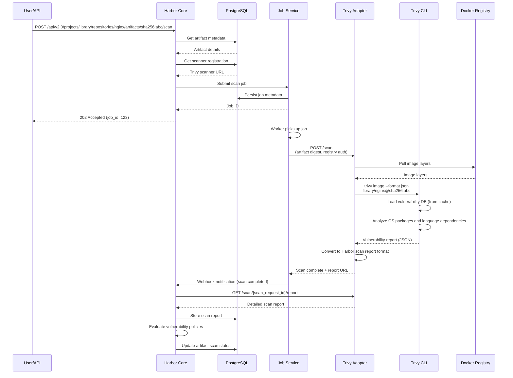
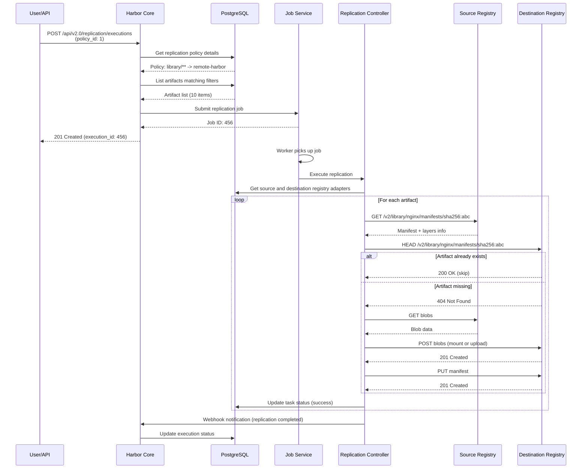
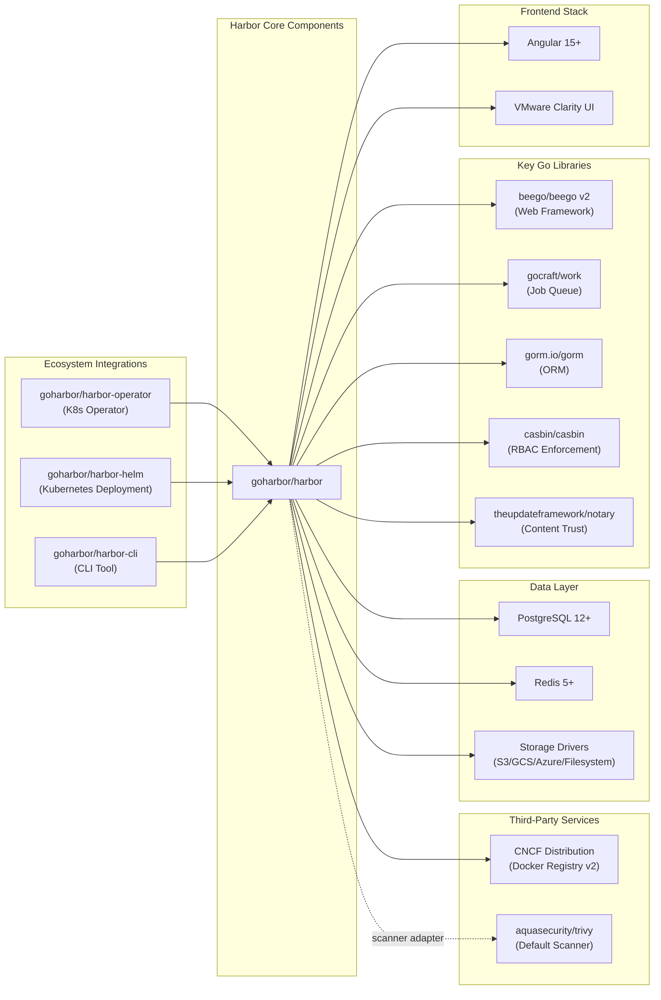

# Harbor

> An open source trusted cloud native registry project that stores, signs, and scans content

| Metadata | |
|---|---|
| Repository | https://github.com/goharbor/harbor |
| License | Apache-2.0 |
| Primary Language | Go |
| Category | Security |
| Analyzed Release | `v2.13.4` (2026-01-15) |
| Stars (approx.) | 27,500+ |
| Generated by | Claude Sonnet 4.5 (Anthropic) |
| Generated on | 2026-02-08 |

## Overview

Harbor is an open source cloud-native registry project that extends Docker Distribution by adding enterprise-grade features such as security, identity, access control, and management. It serves as a central hub for storing, signing, and scanning container images, Helm charts, and other OCI-compliant artifacts.

Problems it solves:

- Securing container images and cloud-native artifacts with role-based access control, vulnerability scanning, and content trust
- Managing container registries in air-gapped and hybrid cloud environments with policy-based replication
- Integrating with enterprise identity systems (LDAP/AD, OIDC) while maintaining fine-grained permissions
- Automating security policies with image retention, quota management, and vulnerability severity thresholds

Positioning:

Graduated CNCF project, positioned as an enterprise-grade alternative to Docker Hub and other managed registries. Widely adopted by organizations requiring on-premises registry infrastructure with advanced security features. Integrates seamlessly with Kubernetes, CI/CD pipelines, and includes Trivy as the default vulnerability scanner.

## Architecture Overview

Harbor follows a microservices architecture with three distinct layers: data access layer (PostgreSQL, Redis, storage backends), fundamental services layer (core API, job service, registry, portal), and consumer layer (web UI, Docker CLI, Helm CLI). All HTTP traffic flows through an Nginx reverse proxy that provides SSL termination and request routing to backend services.

## Core Components

### Harbor Core (`src/core/main.go`)

- Responsibility: Central API server providing REST APIs, authentication, authorization, project management, and business logic coordination
- Key files: `src/core/main.go`, `src/server/route.go`, `src/controller/artifact/controller.go`
- Design patterns: MVC pattern via Beego framework, controller-manager pattern for business logic

The Harbor Core component serves as the control plane of the entire system. Built on the Beego web framework, it exposes RESTful APIs for all administrative operations. The core initializes multiple subsystems during startup including database migration, token service, authentication backends (DB, LDAP, OIDC, UAA), and configuration management. Key controllers include:

- Artifact Controller: Manages the lifecycle of OCI artifacts with support for images, Helm charts, CNAB, WASM, and SBOM
- Project Controller: Handles project-based multi-tenancy and RBAC permissions
- Replication Controller: Orchestrates artifact replication between registries using adapter pattern for different registry types (Docker Hub, ECR, GCR, ACR, Quay, GitLab, Artifactory)
- Scan Manager: Coordinates vulnerability scanning by integrating with scanner adapters
- Retention Manager: Enforces tag retention policies with configurable rules
- Quota Manager: Tracks and enforces storage quotas at project level

The authentication flow uses token-based authentication compatible with the Docker Registry Token Authentication specification. When a Docker client attempts to pull/push, the Registry redirects to the Core's token service, which validates credentials against configured backends and issues a signed JWT token.

### Job Service (`src/jobservice/main.go`)

- Responsibility: Asynchronous task execution queue for background jobs such as replication, garbage collection, scanning, and retention
- Key files: `src/jobservice/main.go`, `src/jobservice/runtime/`, `src/jobservice/job/`
- Design patterns: Worker pool pattern, job interface abstraction, Redis-backed queue

Job Service is built on the gocraft/work framework and provides a distributed job execution platform. It supports three job types:

- Generic jobs: Execute immediately when workers are available
- Scheduled jobs: Execute after a specified delay
- Periodic jobs: Execute repeatedly on a cron-like schedule

The architecture consists of a REST API server, controller, job launcher, scheduler, logger, stats manager, and pool driver interfacing with Redis. Jobs implement a standard interface defining MaxFails(), MaxCurrency(), ShouldRetry(), Validate(), and Run() methods. The worker pool can scale horizontally by deploying multiple job service instances sharing the same Redis backend.

Key job types include:
- Replication jobs: Copy artifacts between registries
- Garbage collection: Clean up unreferenced blobs
- Scan jobs: Trigger vulnerability scanning
- Retention execution: Delete artifacts based on retention policies
- System artifact cleanup: Remove outdated system resources

### Docker Registry (`make/photon/registry/Dockerfile`)

- Responsibility: Storing and serving container images and OCI artifacts using the Docker Distribution project
- Key files: Distribution is a third-party component; Harbor wraps it with custom storage drivers
- Design patterns: Storage driver abstraction supporting filesystem, S3, GCS, Azure Blob, Swift, OSS, Aliyun OSS

The Registry component is based on the CNCF Distribution project (formerly Docker Distribution). Harbor does not modify the Distribution code directly but configures it for token-based authentication. All push/pull operations are validated through tokens issued by the Harbor Core.

The Registry is configured to use various storage backends through drivers, enabling flexible deployment options. For production deployments, object storage (S3, GCS, Azure) is recommended for scalability and durability.

### Registry Controller (`src/registryctl/main.go`)

- Responsibility: Providing administrative control over the Registry, including garbage collection triggering and configuration management
- Key files: `src/registryctl/main.go`, `src/registryctl/handlers/`
- Design patterns: RESTful API wrapper around Registry operations

The Registry Controller acts as a sidecar to the Registry, exposing HTTP APIs that the Harbor Core uses to trigger administrative operations. It directly manipulates Registry storage and configuration files. The primary use case is triggering garbage collection, which requires stopping the Registry, running GC, and restarting it.

### Web Portal (`src/portal/`)

- Responsibility: Browser-based graphical user interface for managing Harbor resources
- Key files: `src/portal/src/app/`, `src/portal/angular.json`
- Design patterns: Angular SPA, component-based architecture, reactive forms

The Portal is an Angular single-page application providing a user-friendly interface for administrators and developers. It communicates with the Harbor Core REST API to perform operations such as:

- Managing projects, users, and robot accounts
- Browsing repositories and artifacts
- Configuring replication rules and retention policies
- Viewing vulnerability scan reports
- Managing registries and scanners
- System administration and monitoring

The Portal is served by a Node.js server in production, while Nginx handles routing `/api/` requests to the Core and static asset requests to the Portal server.

### Trivy Adapter (`make/photon/trivy-adapter/Dockerfile`)

- Responsibility: Adapting the Trivy scanner to Harbor's scanner plugin interface
- Key files: Implemented in a separate repository (github.com/goharbor/harbor-scanner-trivy)
- Design patterns: Adapter pattern, RESTful scanner plugin API

The Trivy Adapter implements Harbor's scanner API specification, allowing Harbor to invoke Trivy for vulnerability scanning. When an artifact is scanned, the adapter:

1. Receives scan request from Harbor Core with artifact details
2. Invokes Trivy CLI to scan the image
3. Converts Trivy output to Harbor's standard scan report format
4. Returns the report to Harbor Core for storage and display

Harbor supports multiple scanner adapters including Trivy (default), Anchore Engine, Clair, and custom scanners implementing the plugin API.

### PostgreSQL Database (`make/photon/db/Dockerfile`)

- Responsibility: Persisting Harbor metadata including users, projects, repositories, artifacts, tags, policies, and audit logs
- Key files: `src/migration/` contains database schema migrations
- Design patterns: ORM pattern using GORM library

The database schema is managed through versioned migrations located in `src/migration/`. Core tables include:

- harbor_user: User accounts and credentials
- project: Project definitions and metadata
- repository: Repository information
- artifact: OCI artifact metadata
- tag: Tag references to artifacts
- replication_policy: Replication rules
- retention_policy: Tag retention rules
- scanner_registration: Registered vulnerability scanners
- audit_log: Audit trail of operations

### Redis Cache (`make/photon/redis/Dockerfile`)

- Responsibility: Providing session storage, caching, and job queue persistence
- Key files: Redis is used by Core (sessions), Job Service (queue), and optionally for artifact metadata caching
- Design patterns: Cache-aside pattern, pub/sub for distributed notifications

Redis serves multiple purposes in Harbor:

- Session storage: Beego session data for web portal users
- Job queue: gocraft/work job metadata and scheduling
- Artifact cache: Optional caching layer for project/repository/artifact metadata to improve performance under high concurrent load
- Quota updates: Optional Redis-based quota tracking to reduce database connection spikes

Different Redis database indexes are used to isolate data:
- DB 0: Core sessions
- DB 1: Registry metadata
- DB 2: Job service queue
- DB 5: Trivy cache
- DB 6: Harbor business cache (optional)
- DB 7: Cache layer (optional)

## Data Flow

### Docker Image Push Flow

### Vulnerability Scanning Flow

### Replication Flow

## Key Design Decisions

### 1. Token-Based Authentication Compatible with Docker Registry Spec

- Choice: Implementing Docker Registry Token Authentication specification (RFC 7519 JWT tokens) instead of basic authentication
- Rationale: Enables fine-grained access control per repository and operation (push/pull) while remaining compatible with standard Docker clients. The token service can encode user roles and permissions into the token, allowing the Registry to make authorization decisions without calling back to Harbor Core on every request
- Trade-offs: More complex authentication flow requiring coordination between Registry, Core, and Token Service. Tokens have expiration times requiring renewal. Public-private key pair management for token signing and verification adds operational complexity

### 2. Microservices Architecture with Shared Database

- Choice: Decomposing Harbor into multiple services (Core, Job Service, Registry, Portal) while sharing a single PostgreSQL database
- Rationale: Allows independent scaling and deployment of components. For example, Job Service workers can scale horizontally to handle more concurrent jobs without scaling the Core API. Shared database simplifies transaction management and data consistency across components
- Trade-offs: Database becomes a single point of contention and potential bottleneck. Schema changes require coordinated deployment of all services. Cannot easily distribute services across different database instances. Partial microservices architecture (shared DB) rather than full service independence

### 3. Redis-Based Job Queue with gocraft/work

- Choice: Using Redis-backed job queue (gocraft/work) instead of dedicated message brokers like RabbitMQ or Kafka
- Rationale: Simplifies deployment by reusing Redis infrastructure already required for session storage. gocraft/work provides job persistence, retry logic, scheduled jobs, and periodic jobs out of the box. Redis-based queue enables horizontal scaling of workers with minimal configuration
- Trade-offs: Limited to Redis' reliability guarantees (persistence configured via RDB/AOF). Less sophisticated dead-letter queue and monitoring compared to enterprise message brokers. Job queue and cache compete for Redis resources

### 4. Plugin-Based Scanner Architecture

- Choice: Defining a standard scanner plugin API allowing third-party scanners to integrate with Harbor
- Rationale: Decouples Harbor from specific vulnerability scanners, allowing users to choose scanners based on their requirements (Trivy, Clair, Anchore, commercial scanners). Scanner implementations can evolve independently. Supports multiple scanners simultaneously with per-project scanner selection
- Trade-offs: Requires maintaining a stable plugin API contract. Scanner adapter authors must implement the complete API specification. Differences in scanner capabilities (SBOM, secrets, licenses) may not map cleanly to a unified interface

### 5. Nginx as Unified Reverse Proxy

- Choice: Routing all external traffic through Nginx which proxies requests to Core, Registry, or Portal based on URL paths
- Rationale: Provides a single external endpoint simplifying SSL/TLS termination, certificate management, and load balancing. Nginx handles static file serving efficiently for Portal assets. URL-based routing (`/api/*` -> Core, `/v2/*` -> Registry, `/*` -> Portal) keeps client configuration simple
- Trade-offs: Nginx becomes a critical path component and potential single point of failure. Configuration complexity increases with internal TLS. Request routing rules must be carefully maintained as APIs evolve

### 6. Project-Based Multi-Tenancy

- Choice: Organizing artifacts into projects which serve as the unit of access control, quota management, and policy application
- Rationale: Aligns with organizational structures where teams or applications require isolated namespaces. RBAC roles (project admin, developer, guest, maintainer) are scoped to projects, enabling delegation of permissions without granting system-wide access. Policies like replication, retention, and scanning are configured per project
- Trade-offs: Does not support hierarchical or nested projects. Cross-project operations (like image copy) require permissions in both projects. Quota enforcement at project level may not match billing or organizational boundaries

## Dependencies

## Testing Strategy

Harbor employs a comprehensive multi-layer testing approach combining unit tests, integration tests, API tests, and end-to-end tests.

Unit tests: Each Go package contains `_test.go` files with table-driven tests. Controllers, managers, and DAO layers have extensive unit test coverage. Mockery framework is used to generate mocks from interfaces for dependency injection. Tests are executed via `make test` which runs all Go unit tests.

Integration tests: The `tests/` directory contains integration tests that spin up Harbor components using Docker Compose. These tests cover workflows like image push/pull, replication, scanning, and retention. Robot framework is used for test automation with keyword-driven test cases.

API tests: Swagger-generated API clients are used to test RESTful endpoints. Tests verify authentication, authorization, input validation, and response formats. Both v1.0 (legacy) and v2.0 API versions are tested for backward compatibility.

E2E tests: Portal UI tests using Cypress framework validate browser interactions, form submissions, and data visualization. Tests run in headless mode in CI pipelines.

CI/CD: GitHub Actions workflows run on every pull request and commit to main branch. Workflows include:
- Unit test execution with coverage reporting to Codecov
- Integration test suite across multiple configurations
- Linting (golangci-lint for Go, ESLint for TypeScript)
- Vulnerability scanning with Trivy
- Build verification for all Docker images
- Release automation with Cosign signature generation

The project maintains CII Best Practices badge with automated security scanning, FOSSA license compliance checks, and OpenSSF Scorecard monitoring.

## Key Takeaways

1. Token service abstraction: Harbor's token service design demonstrates how to implement fine-grained authorization for container registries while maintaining Docker client compatibility. The pattern of encoding permissions in JWT claims allows stateless authorization at the Registry layer, applicable to any multi-tenant artifact storage system

2. Shared database with service decomposition: Harbor shows a pragmatic middle ground between monolith and full microservices. Services are independently deployable and scalable, but share a database for transactional consistency. This pattern works well when ACID guarantees across service boundaries are critical and the database can be vertically scaled

3. Job queue pattern for async operations: Using a Redis-backed job queue (gocraft/work) to offload time-consuming tasks (scanning, replication, GC) from synchronous API handlers is a widely applicable pattern. The job interface abstraction with MaxFails/ShouldRetry/Validate provides a clean programming model for defining background tasks

4. Plugin architecture for extensibility: The scanner plugin API demonstrates how to design extension points in a system. By defining a REST API contract and providing adapter implementations, Harbor achieves vendor neutrality while maintaining a consistent user experience. Applicable to any system requiring integration with multiple third-party tools

5. Project-based multi-tenancy: Harbor's project model provides a blueprint for building multi-tenant systems where isolation, quotas, and policies are scoped to logical units. The combination of project-level RBAC with system-level admin roles addresses both delegation and central governance requirements

6. Nginx as API gateway: Using Nginx for request routing, SSL termination, and static file serving is a battle-tested pattern for deploying multi-component web applications. The configuration-driven approach keeps routing logic separate from application code

## References

- [Harbor Official Documentation](https://goharbor.io/docs/)
- [Architecture Overview of Harbor - GitHub Wiki](https://github.com/goharbor/harbor/wiki/Architecture-Overview-of-Harbor)
- [Harbor Container Registry Design - Broadcom](https://techdocs.broadcom.com/us/en/vmware-sde/telco-cloud/vmware-telco-cloud-platform/5-1/telco-cloud-planning-and-design-guide/telco-cloud-solution-design/telco-cloud-platform-tier-1/telco-cloud-automation-design/telco-cloud-automation-container-registry-design.html)
- [Architecture of Harbor: An Open Source Enterprise-class Registry Server](https://www.think-foundry.com/architecture-of-harbor-an-open-source-enterprise-class-registry-server/)
- [Harbor: Enterprise-grade container registry for modern private cloud - CNCF](https://www.cncf.io/blog/2025/12/08/harbor-enterprise-grade-container-registry-for-modern-private-cloud/)
- [Harbor Registry Overview - OpenLogic](https://www.openlogic.com/blog/harbor-registry-overview)
- [Deploying Harbor on Kubernetes using Helm - CNCF](https://www.cncf.io/blog/2026/01/05/deploying-harbor-on-kubernetes-using-helm/)
- [Harbor Container Security - VMware Blog](https://blogs.vmware.com/cloud-foundation/2026/01/30/securing-your-software-supply-chain-with-harbor/)
