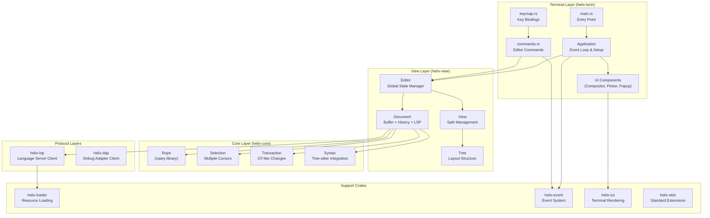
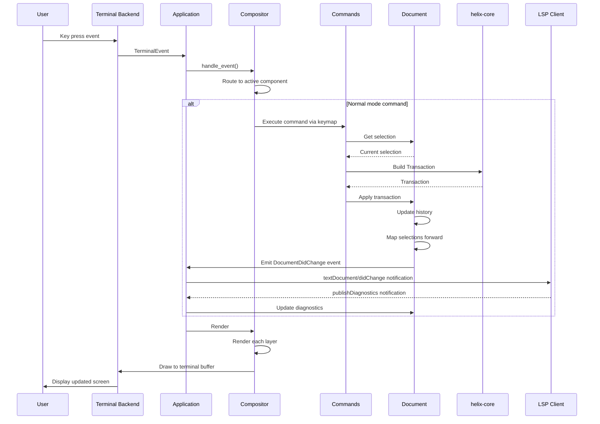
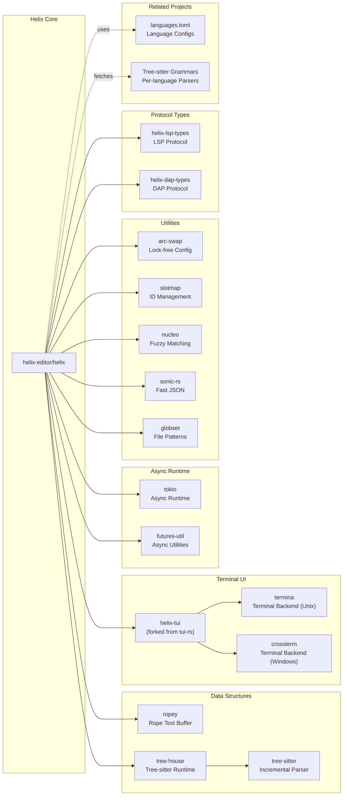

# Helix

> A post-modern modal text editor

| Metadata | |
|---|---|
| Repository | https://github.com/helix-editor/helix |
| License | Mozilla Public License 2.0 |
| Primary Language | Rust |
| Category | Editor / Terminal |
| Analyzed Release | `25.07.1` (2025-07-18) |
| Stars (approx.) | 42,800+ |
| Generated by | Claude Opus 4.6 (Anthropic) |
| Generated on | 2026-02-08 |

## Overview

Helix is a post-modern modal text editor written in Rust, heavily inspired by Kakoune and Neovim. It brings a fresh perspective to terminal-based text editing with built-in language server support and tree-sitter powered syntax highlighting.

Problems it solves:

- Complexity of configuring modern editor features (LSP, syntax highlighting) in traditional Vim/Neovim setups requiring extensive plugin ecosystems
- Slow startup times and performance issues in heavily configured editors with multiple plugins
- Lack of first-class multiple selection support in Vim-style editors
- Inconsistent syntax highlighting and code intelligence across different languages

Positioning:

Helix positions itself as a batteries-included alternative to Neovim, offering modern features out-of-the-box without requiring plugin configuration. It adopts Kakoune's selection-first editing model while providing Tree-sitter and LSP integration as core features. Unlike Vim/Neovim's action-first model (verb + motion), Helix follows Kakoune's selection-first model (selection + action), providing a more intuitive workflow for multiple cursor operations.

## Architecture Overview

Helix employs a layered architecture built on functional primitives inspired by CodeMirror 6. The core layer provides immutable text manipulation using ropes and operational transforms, while the view layer manages editor state and UI concerns. The terminal layer handles rendering and event processing through a compositor-based system.

## Core Components

### Core Layer (`helix-core`)

- Responsibility: Functional text manipulation primitives and editor operations
- Key files: `helix-core/src/lib.rs`, `selection.rs`, `transaction.rs`, `syntax.rs`
- Design patterns: Functional programming, immutability, operational transformation

The core layer provides the foundational building blocks for text editing, heavily inspired by CodeMirror 6. It operates on immutable data structures, with operations returning new copies rather than modifying in place. The main text representation is a Rope (via the ropey library), which allows efficient cloning and snapshotting of text state. Multiple selections are a core primitive, with each Selection containing one or more Ranges. Each Range has a moving head and an immovable anchor, enabling sophisticated multi-cursor operations. Text modifications are expressed as Transactions, which represent coherent changes that can be applied to ropes, inverted for undo, and used to map selections forward through edits. The Syntax component wraps tree-sitter for syntax highlighting, indentation, and textobject queries.

### Document (`helix-view/src/document.rs`)

- Responsibility: Comprehensive representation of an open file
- Key files: `helix-view/src/document.rs`
- Design patterns: Aggregate pattern, observer pattern (via events)

Document ties together the rope text buffer, per-view selections, syntax highlighting state, undo history, language server interactions, and file metadata into a single cohesive structure. Each document maintains a HashMap of selections indexed by ViewId, allowing multiple views to display the same document with independent cursors. Documents track their save state, encoding, line endings, and whether they've been modified. They also maintain language server diagnostics, inlay hints, and snippet state. Documents emit events like DocumentDidChange and DocumentDidOpen that drive the event system. The document owns its History for undo/redo operations and maintains a SavePoint for tracking uncommitted changes.

### Editor (`helix-view/src/editor.rs`)

- Responsibility: Global state management and coordination across documents and views
- Key files: `helix-view/src/editor.rs`
- Design patterns: Singleton pattern, registry pattern, facade pattern

The Editor holds all global editor state: a collection of all open documents, a tree representation of view splits, configuration, theme, language server registry, debug adapter registry, clipboard provider, and file system watcher. It provides the main API for opening/closing files, managing splits, and coordinating between components. The Editor uses a Tree structure to manage view layouts, allowing arbitrary horizontal and vertical splits. Language servers are registered per-language and shared across documents of the same type. The Editor also manages the Handlers system for async operations like autosave, LSP updates, and diagnostics rendering. Configuration is held in an ArcSwap for lock-free concurrent access.

### Application (`helix-term/src/application.rs`)

- Responsibility: Event loop orchestration and terminal UI lifecycle
- Key files: `helix-term/src/application.rs`, `main.rs`
- Design patterns: Event loop pattern, MVC (Model-View-Controller)

The Application struct owns the terminal backend, compositor (for layering UI components), editor state, and jobs queue for background tasks. It runs the main event loop using Tokio's async runtime, processing terminal input events, LSP notifications, file system events, and timed jobs. The event loop handles rendering by calling the compositor, which manages a stack of UI components (layers). The application coordinates between user input (handled by Commands), background LSP operations, and UI rendering. It also manages signal handling for Unix systems and graceful shutdown. The Application is initialized in main.rs with parsed command-line arguments, loaded configuration, and a syntax loader for tree-sitter grammars.

### Commands (`helix-term/src/commands.rs`)

- Responsibility: Implementation of all user-facing editor operations
- Key files: `helix-term/src/commands.rs`, `commands/typed.rs`, `commands/lsp.rs`
- Design patterns: Command pattern, strategy pattern

The commands module contains over 200 editor commands bound to key sequences. Each command is a function taking a Context parameter that provides access to the editor, current document, view, and jobs queue. Commands operate on selections and use the transaction API to modify documents. The module is organized into submodules: typed commands (colon commands like :quit, :write), LSP commands (goto-definition, hover, etc.), DAP commands (debugger operations), and syntax commands (textobject selection). Commands can push UI components onto the compositor stack (for pickers, popups, etc.) and register callbacks for multi-key sequences. The Context struct allows commands to chain operations via on_next_key callbacks.

### Compositor (`helix-term/src/compositor.rs`)

- Responsibility: Managing and rendering layered UI components
- Key files: `helix-term/src/compositor.rs`, `ui/` directory
- Design patterns: Composite pattern, layer pattern

The Compositor maintains a Vec of Component trait objects that form rendering layers. Components include the main editor view, popups (for documentation, completion), pickers (file picker, symbol picker), prompts (search, command palette), and overlays. On each render cycle, the compositor calls each component's render method in order, allowing components to draw over previous layers. The Compositor manages focus, keyboard input routing, and component lifecycle. Components can be dynamically pushed and popped, enabling modal interactions like file picking and command completion. The Component trait defines methods for event handling, rendering to a Surface (terminal buffer), and cursor positioning.

## Data Flow

### Typical Editing Flow

## Key Design Decisions

### 1. Kakoune-inspired Selection-First Model

- Choice: Adopt Kakoune's selection → action model instead of Vim's action → motion model
- Rationale: Multiple selections become a first-class feature when selections are established before actions. This makes multi-cursor operations more intuitive and composable. Users select what they want to modify first, then apply operations to all selections simultaneously. This inversion provides clearer mental model and visual feedback
- Trade-offs: Steeper learning curve for Vim users accustomed to the verb-object model. Different muscle memory required. However, many users find it more intuitive once learned, especially for complex multi-selection scenarios

### 2. Built-in Tree-sitter Integration

- Choice: Integrate tree-sitter as a core dependency for all syntax highlighting and code intelligence
- Rationale: Tree-sitter provides error-tolerant, incremental parsing with consistent syntax trees across languages. By making it a core feature rather than a plugin, Helix ensures consistent behavior and eliminates configuration complexity. Tree-sitter enables robust syntax highlighting, accurate indentation calculation, and textobject queries (functions, parameters, classes) out-of-the-box
- Trade-offs: Requires compiling and distributing tree-sitter grammars for each language. Grammar updates are tied to Helix releases unless users manually fetch and build grammars. Increased binary size and compilation complexity. However, the consistent experience and zero-configuration nature outweigh these costs

### 3. Batteries-Included Philosophy

- Choice: Ship with LSP client, DAP client, tree-sitter, and fuzzy finder built-in with no plugin system
- Rationale: Eliminates configuration burden and plugin compatibility issues. Users get a fully-functional modern editor immediately. Reduces maintenance burden by controlling the entire stack. Enables better integration between components since they're developed together
- Trade-offs: Less flexibility for users wanting custom extensions. Cannot leverage community plugins. Features must be upstreamed to the main repository. Slower iteration for experimental features. The trade-off favors consistency and ease-of-use over extensibility

### 4. Functional Core with Immutable Operations

- Choice: Design helix-core around immutable data structures and pure functions, inspired by CodeMirror 6
- Rationale: Immutability enables easy undo/redo through history stacks, safe concurrent access, and simple snapshotting for features like multiple views of the same document. Transactions provide a clean abstraction for complex edits that can be composed, inverted, and mapped over. The functional approach makes reasoning about editor state changes simpler
- Trade-offs: Performance overhead from copying data structures. Increased memory usage for maintaining history. However, efficient persistent data structures (like ropes) and careful optimization mitigate these costs while preserving simplicity

### 5. Workspace Architecture with Cargo Workspace

- Choice: Organize codebase as a Cargo workspace with distinct crates (helix-core, helix-view, helix-term, helix-lsp, etc.)
- Rationale: Clear separation of concerns with defined dependency boundaries. helix-core has zero UI dependencies and could theoretically be reused in other editors. Enables independent testing and compilation of layers. Makes the architecture explicit through crate boundaries. Facilitates incremental compilation
- Trade-offs: More complex build setup. Potential for over-abstraction. Requires careful API design at crate boundaries. Internal refactoring may require changes across multiple crates. The benefits of modularity and testability justify this complexity

### 6. Async Runtime with Tokio

- Choice: Use Tokio async runtime for LSP communication, file operations, and background jobs
- Rationale: LSP and DAP protocols are inherently asynchronous. Tokio provides mature async I/O primitives, timers, and task spawning. Allows non-blocking background operations like autosave, diagnostics updates, and file watching without freezing the UI
- Trade-offs: Complexity of async Rust with lifetimes and Send bounds. Requires careful synchronization between async tasks and the main event loop. Tokio dependency increases binary size. However, async is essential for responsive LSP integration

## Dependencies

## Testing Strategy

Helix employs a multi-layered testing approach covering unit tests, integration tests, and continuous integration.

Unit tests: Each crate contains extensive unit tests in inline test modules and separate test files. The core layer (helix-core) has thorough tests for rope operations, transactions, selections, and syntax. Tests use fixtures in testdata/ directories. The functional nature of the core makes unit testing straightforward with pure functions and no side effects.

Integration tests: The helix-term crate includes integration tests in tests/test/ that simulate real editing sessions. These tests use a TestBackend to drive the editor programmatically without a real terminal. Integration tests verify end-to-end command execution, LSP interactions, and UI rendering. The HELIX_LOG_LEVEL environment variable controls logging verbosity during tests. A helpers.rs module provides utilities for test setup and assertions.

Build system: Uses standard Cargo for building and testing. An xtask crate provides custom build tasks like documentation generation (cargo xtask docgen) for auto-generating parts of the book from code. The mdbook tool generates the official documentation from markdown files. Tree-sitter grammars are fetched and built via hx --grammar fetch and hx --grammar build commands.

CI/CD: GitHub Actions workflows in .github/workflows/ handle continuous integration. The build.yml workflow tests on Linux, macOS, and Windows with the MSRV (Minimum Supported Rust Version). Helix follows Firefox's MSRV policy, updating when Firefox does while ensuring popular distributions package the new version. Release builds use LTO (Link-Time Optimization) and are published to GitHub releases, package repositories, and distribution channels.

## Key Takeaways

1. Selection-first editing model: Inverting the traditional action-motion order to selection-action makes multiple cursors more powerful and intuitive. This design choice influences the entire command system and demonstrates that different mental models can be equally valid and sometimes superior for certain workflows

2. Batteries-included without plugins: Helix proves that a plugin-free architecture can provide excellent extensibility through well-chosen built-in features. By integrating LSP, tree-sitter, and fuzzy finding as core components, it delivers a complete experience without configuration. This approach trades flexibility for consistency and simplicity

3. Functional core architecture: Separating a pure functional core (helix-core) from imperative shell layers (helix-view, helix-term) provides clear boundaries and testability. Immutable operations with transactions enable sophisticated features like multi-document undo/redo and concurrent editing with minimal complexity

4. Tree-sitter as first-class citizen: Making incremental parsing a core dependency rather than an optional feature enables consistent syntax-aware operations across all languages. The tree-sitter query system for textobjects and indentation demonstrates the power of declarative language definitions

5. Crate-based modularity: Using Cargo workspace crates to enforce architectural layers prevents accidental coupling and makes the design explicit. The dependency graph (core → view → term) is enforced at compile time, preventing circular dependencies and encouraging clean abstractions

6. Async-first protocol integration: Building on Tokio from the start enables responsive LSP and DAP integration without blocking the UI. The challenge of bridging async protocol clients with synchronous editor state teaches valuable lessons about managing async boundaries in interactive applications

## References

- [Helix Official Documentation](https://docs.helix-editor.com/)
- [helix/docs/architecture.md](https://github.com/helix-editor/helix/blob/master/docs/architecture.md)
- [CodeMirror 6 Architecture](https://codemirror.net/6/docs/)
- [Kakoune Editor](https://kakoune.org/)
- [Tree-sitter Documentation](https://tree-sitter.github.io/tree-sitter/)
- [Language Server Protocol](https://microsoft.github.io/language-server-protocol/)
- [ropey: A Rope Library for Rust](https://github.com/cessen/ropey)
- [Helix Editor Release Highlights](https://helix-editor.com/news/release-25-07-highlights/)

