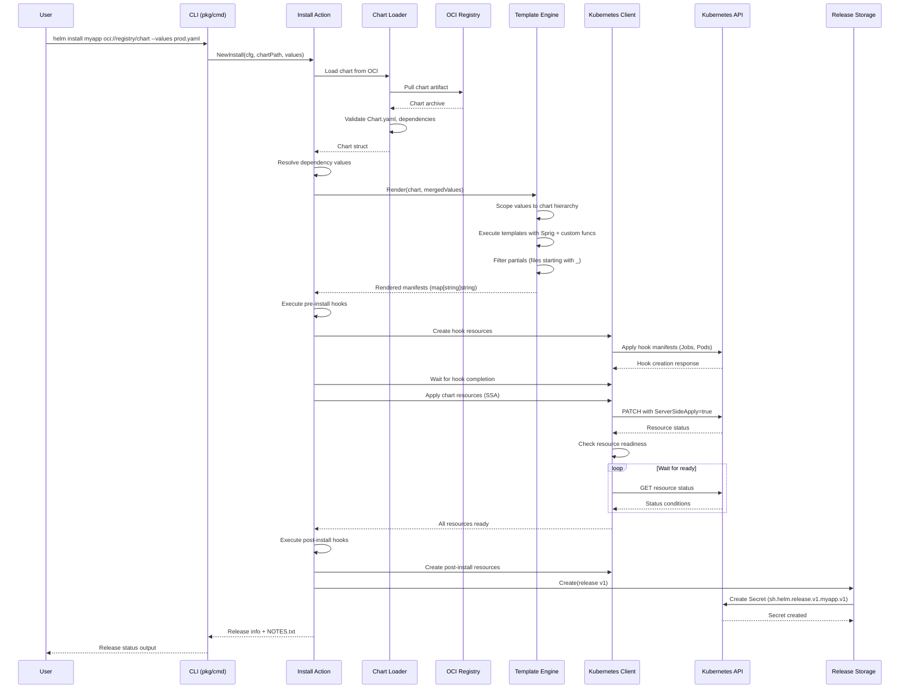
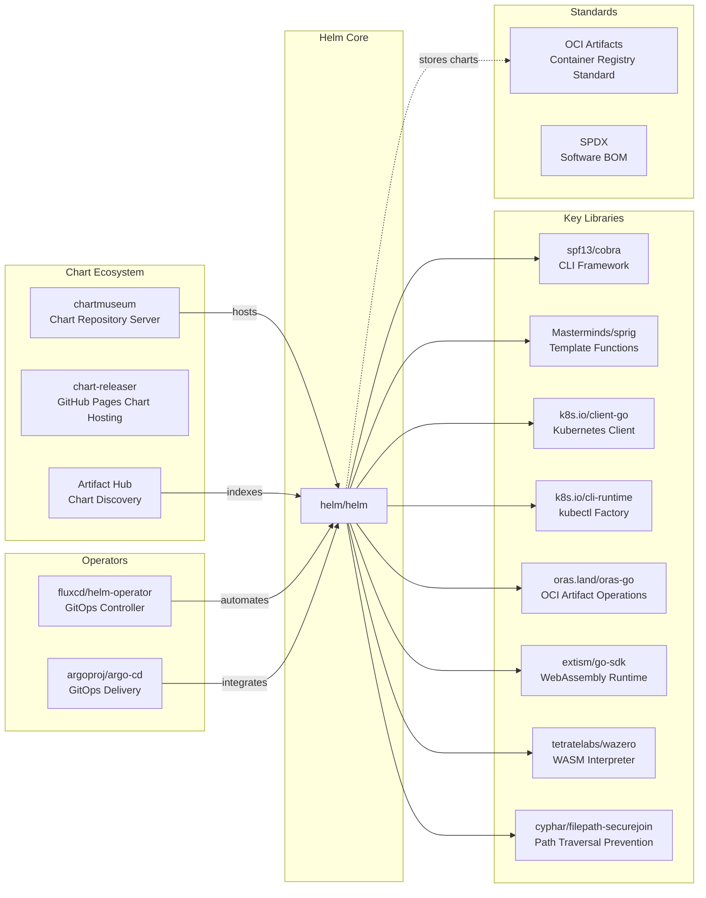

# Helm

> The Kubernetes Package Manager

| Metadata | |
|---|---|
| Repository | https://github.com/helm/helm |
| License | Apache-2.0 |
| Primary Language | Go |
| Category | Container Orchestration |
| Analyzed Release | `v3.20.0` (2026-01-21) |
| Stars (approx.) | 29,000+ |
| Generated by | Claude Opus 4.6 (Anthropic) |
| Generated on | 2026-02-08 |

## Overview

Helm is the de facto package manager for Kubernetes, providing a standardized way to define, install, and upgrade even the most complex Kubernetes applications. Helm uses a packaging format called charts, which are collections of files that describe a related set of Kubernetes resources. A single chart can deploy simple pods or complex multi-tier applications with dependencies.

Problems it solves:

- Complexity management: Simplifies deployment of complex Kubernetes applications by bundling manifests, configurations, and dependencies into reusable packages (charts)
- Version control and rollback: Tracks release history with versioning, enabling easy upgrades and rollbacks to previous application states
- Configuration management: Separates configuration from manifests using templating, allowing the same chart to be deployed across multiple environments with different values
- Dependency resolution: Automatically manages chart dependencies, ensuring all required components are installed in the correct order

Positioning:

Helm is the official Kubernetes package manager, graduated from CNCF (Cloud Native Computing Foundation) and widely adopted across the industry. It is the primary tool for distributing Kubernetes applications, with Artifact Hub serving as the central repository for discovering and sharing charts. Helm v4, released in 2025 after 6 years of development, introduced significant architectural improvements including Server-Side Apply (SSA) and WebAssembly-based plugins, solidifying its position as the standard for Kubernetes application lifecycle management.

## Architecture Overview

Helm follows a client-side architecture with direct Kubernetes API integration. Since Helm v3, the server-side Tiller component was removed, transitioning to a purely client-based model that interacts directly with the Kubernetes API server. Helm v4 further modernized this architecture by adopting Server-Side Apply as the default resource management strategy.

```mermaid
graph TB
    subgraph CLI["CLI Layer (pkg/cmd)"]
        Root["root.go<br/>Cobra Root Command"]
        Install["install command"]
        Upgrade["upgrade command"]
        Rollback["rollback command"]
        Uninstall["uninstall command"]
        List["list command"]
        Repo["repo commands"]
        Plugin["plugin commands"]
    end

    subgraph Action["Action Layer (pkg/action)"]
        Config["Configuration<br/>(RESTClientGetter, Storage, KubeClient)"]
        InstallAction["Install Action"]
        UpgradeAction["Upgrade Action"]
        RollbackAction["Rollback Action"]
        UninstallAction["Uninstall Action"]
    end

    subgraph Chart["Chart Layer (pkg/chart)"]
        Loader["Chart Loader"]
        ChartV2["Chart v2 Format"]
        ChartV3["Chart v3 Format"]
        Dependency["Dependency Manager"]
        Lint["Chart Linter"]
    end

    subgraph Engine["Template Engine (pkg/engine)"]
        TemplateEngine["Engine<br/>(Go text/template)"]
        Sprig["Sprig Functions"]
        CustomFuncs["Custom Template Functions<br/>(include, tpl, required, lookup)"]
    end

    subgraph Kube["Kubernetes Client (pkg/kube)"]
        KubeClient["Client<br/>(kubectl Factory wrapper)"]
        SSA["Server-Side Apply"]
        Waiter["Resource Waiter"]
        ReadinessCheck["Readiness Checker"]
    end

    subgraph Storage["Storage Layer (pkg/storage)"]
        StorageDriver["Storage Interface"]
        Secrets["Secrets Driver<br/>(default)"]
        ConfigMaps["ConfigMaps Driver"]
        SQL["SQL Driver"]
        Memory["Memory Driver"]
    end

    subgraph Registry["Registry Layer (pkg/registry)"]
        OCI["OCI Client"]
        ChartPusher["Chart Pusher"]
        ChartPuller["Chart Puller"]
        Auth["Registry Authentication"]
    end

    subgraph Release["Release Management (pkg/release)"]
        ReleaseV1["Release v1 Format"]
        Hook["Lifecycle Hooks"]
        History["Release History"]
    end

    Root --> Install & Upgrade & Rollback & Uninstall & List & Repo & Plugin
    Install & Upgrade & Rollback & Uninstall --> Config
    Config --> InstallAction & UpgradeAction & RollbackAction & UninstallAction

    InstallAction & UpgradeAction --> Loader
    Loader --> ChartV2 & ChartV3
    Loader --> Dependency

    InstallAction & UpgradeAction --> TemplateEngine
    TemplateEngine --> Sprig & CustomFuncs

    TemplateEngine --> KubeClient
    KubeClient --> SSA
    KubeClient --> Waiter & ReadinessCheck

    InstallAction & UpgradeAction & RollbackAction & UninstallAction --> StorageDriver
    StorageDriver --> Secrets & ConfigMaps & SQL & Memory

    Loader --> OCI
    OCI --> ChartPusher & ChartPuller & Auth

    StorageDriver --> ReleaseV1
    ReleaseV1 --> Hook & History
```

## Core Components

### Action Layer (`pkg/action`)

- Responsibility: Orchestrates all Helm operations by coordinating chart loading, template rendering, Kubernetes interaction, and release storage
- Key files: `pkg/action/action.go`, `pkg/action/install.go`, `pkg/action/upgrade.go`, `pkg/action/rollback.go`
- Design patterns: Command pattern, Dependency Injection, Configuration object

The Action layer serves as the central orchestrator for all Helm operations. Each action (Install, Upgrade, Rollback, Uninstall, etc.) is implemented as a separate struct with its own configuration options. The `Configuration` struct provides shared dependencies including the RESTClientGetter (for Kubernetes API access), Storage (for release persistence), and KubeClient (for resource management).

The Install action (`pkg/action/install.go`) demonstrates the typical workflow: It loads the chart using the Chart Loader, resolves dependencies, renders templates via the Engine, applies resources to Kubernetes using Server-Side Apply (in v4), creates lifecycle hooks, and persists the release to storage. The action supports extensive configuration including dry-run strategies, timeout settings, namespace creation, and post-rendering hooks.

### Template Engine (`pkg/engine`)

- Responsibility: Renders Go templates in Helm charts into Kubernetes manifests with values substitution
- Key files: `pkg/engine/engine.go`, `pkg/engine/files.go`
- Design patterns: Template Method pattern, Function injection

The Engine implements Helm's template rendering system, built on Go's `text/template` package. It extends the standard Go templating with the Sprig function library (providing 70+ utility functions like `default`, `toYaml`, `b64enc`) and Helm-specific functions (`include`, `tpl`, `required`, `lookup`).

The rendering process follows a scoped approach: Values are scoped to each chart and its subcharts hierarchically. If chart "foo" includes chart "bar", the engine looks for a "bar" section in the values passed to "foo" and passes only that subset to the bar chart. This prevents configuration leakage between charts.

The Engine struct provides configuration options including Strict mode (fail on undefined values), LintMode (tolerate missing required values during linting), and EnableDNS (allow DNS lookups during rendering). The `Render` function collects all templates from the chart, sorts them by path (reverse length, then alphabetically), filters out partials (files starting with underscore), and executes each template with the scoped values.

### Kubernetes Client (`pkg/kube`)

- Responsibility: Abstracts Kubernetes API interactions, resource lifecycle management, and readiness checking
- Key files: `pkg/kube/client.go`, `pkg/kube/wait.go`, `pkg/kube/ready.go`
- Design patterns: Facade pattern, Strategy pattern (for wait strategies)

The Kube package wraps kubectl's Factory interface to provide Kubernetes API access. In Helm v4, the most significant change is the adoption of Server-Side Apply (SSA) as the default resource management strategy, replacing the three-way merge patch used in Helm v3.

The Client struct provides methods for creating, updating, deleting, and watching Kubernetes resources. The Waiter interface implements resource readiness checking with configurable strategies (WaitStrategy). The ready checker monitors various resource types (Deployments, StatefulSets, DaemonSets, Jobs, Pods) and determines when they have reached a stable state based on their status conditions.

SSA integration allows Helm to declare field ownership at the field level rather than the object level, enabling better collaboration between multiple controllers and operators. Conflicts are now detected and reported explicitly rather than silently overwritten.

### Storage Layer (`pkg/storage`)

- Responsibility: Persists release metadata and history with pluggable backend drivers
- Key files: `pkg/storage/storage.go`, `pkg/storage/driver/secrets.go`, `pkg/storage/driver/sql.go`
- Design patterns: Repository pattern, Driver pattern, Strategy pattern

The Storage layer abstracts release persistence behind a Driver interface, supporting multiple backend implementations: Secrets (default), ConfigMaps, SQL databases (via `pkg/storage/driver/sql.go`), and in-memory storage (for testing).

Release data is stored with a standardized key format: `sh.helm.release.v1.{name}.v{version}`. The storage system maintains release history with configurable limits via `MaxHistory`. When set, the system automatically prunes old releases during Create operations while ensuring the currently deployed release is never deleted.

The Secrets driver stores each release version as a separate Kubernetes Secret in the release's namespace. This provides RBAC integration (users need Secret read/write permissions) and encryption-at-rest support (if configured on the cluster). The SQL driver enables centralized release management across clusters by storing releases in a relational database.

### Chart Loader (`pkg/chart/loader`)

- Responsibility: Loads, validates, and parses Helm charts from various sources (filesystem, archives, OCI registries)
- Key files: `pkg/chart/loader/load.go`, `pkg/chart/loader/archive/archive.go`
- Design patterns: Builder pattern, Factory pattern

The Chart Loader handles chart parsing from multiple sources: local directories, tar.gz archives, and OCI artifacts. It validates the chart structure, ensuring required files (Chart.yaml) exist and conform to the schema. The loader supports both v2 and v3 chart formats, automatically detecting the version from Chart.yaml's `apiVersion` field.

The loading process includes dependency resolution: If a chart declares dependencies in Chart.yaml, the loader checks for bundled dependencies in the `charts/` directory or downloads them from repositories. The `.helmignore` file is processed using gitignore-style pattern matching to exclude files from the packaged chart.

Chart validation includes JSON schema validation against values.schema.json (if present), metadata validation (ensuring name, version, and apiVersion are valid), and template syntax pre-checks during linting.

### Registry Client (`pkg/registry`)

- Responsibility: Manages chart distribution via OCI (Open Container Initiative) registries
- Key files: `pkg/registry/client.go`, `pkg/registry/chart.go`
- Design patterns: Adapter pattern, Client pattern

The Registry package implements OCI artifact support for Helm charts, treating charts as OCI artifacts rather than traditional Helm repositories. Charts are stored with media type `application/vnd.cncf.helm.chart.content.v1.tar+gzip`, and provenance files use `application/vnd.cncf.helm.chart.provenance.v1.prov`.

The OCI client uses the ORAS (OCI Registry as Storage) library from the CNCF for artifact operations. Authentication credentials are stored in `$HELM_REGISTRY_CONFIG` (default: `~/.config/helm/registry/config.json`) with fallback to Docker's credential helpers.

Chart references in OCI registries use the `oci://` scheme, and version tags transform `+` to `_` to comply with OCI reference specifications. The pusher and puller handle chart serialization/deserialization and layer management, ensuring deterministic manifest generation by sorting layers by digest.

### Plugin System (`pkg/cmd/load_plugins.go`)

- Responsibility: Extends Helm functionality through external plugins
- Key files: `pkg/cmd/load_plugins.go`, `pkg/cmd/plugin.go`
- Design patterns: Plugin pattern, Subprocess pattern (v3), WebAssembly sandbox (v4)

Helm's plugin system allows extending the CLI with custom commands written in any language. In Helm v3, plugins executed as subprocesses with access to the same environment variables as Helm. Helm v4 introduced a WebAssembly-based plugin runtime, providing sandboxed execution and cross-platform compatibility.

Each plugin resides in `$HELM_PLUGINS/` with a `plugin.yaml` manifest describing the plugin name, version, command, and metadata. Plugins integrate seamlessly into `helm help` and can access the Kubernetes API via environment variables (`HELM_KUBECONTEXT`, `HELM_NAMESPACE`, `KUBECONFIG`).

The plugin manifest specifies the runtime type: subprocess (traditional shell scripts or binaries) or wasm (WebAssembly modules). WASM plugins can be distributed via OCI registries, enabling versioned plugin management with the same infrastructure as charts.

## Data Flow

### Helm Install Flow

## Key Design Decisions

### 1. Removal of Tiller (Helm v3)

- Choice: Eliminate the server-side Tiller component and communicate directly with the Kubernetes API
- Rationale: Tiller posed significant security risks due to its cluster-wide privileges and single point of failure. By removing it, Helm v3 leverages Kubernetes RBAC directly, scoping permissions to the user's credentials. This also simplified deployment and reduced operational overhead
- Trade-offs: Eliminated cluster-wide deployment tracking (each user now sees only their own releases within their namespace scope). Increased client-side complexity for operations like release discovery across namespaces

### 2. Server-Side Apply as Default (Helm v4)

- Choice: Adopt Kubernetes Server-Side Apply (SSA) as the default resource management strategy, replacing three-way merge
- Rationale: Three-way merge required Helm to store and compute patches client-side, leading to conflicts when multiple controllers modified resources. SSA offloads merge logic to the Kubernetes API server and uses field-level ownership tracking, enabling better multi-controller collaboration
- Trade-offs: Requires Kubernetes 1.18+ (released in 2020). Conflicts are now explicit errors rather than silent overwrites, potentially requiring user intervention. Increased dependency on Kubernetes API server behavior

### 3. OCI Registry Support for Charts

- Choice: Support distributing charts as OCI artifacts in container registries alongside traditional chart repositories
- Rationale: Reuses existing container registry infrastructure (authentication, mirroring, access control). Enables unified artifact management (both images and charts in the same registry). OCI artifacts provide standardized versioning and content addressing
- Trade-offs: Requires OCI-compatible registries. Chart references use a different scheme (`oci://`) than traditional repositories. Version tag transformations (`+` to `_`) can cause confusion. Not backward-compatible with Helm v2 chart repositories

### 4. Go Template Engine with Sprig

- Choice: Use Go's `text/template` as the core templating language, extended with the Sprig function library
- Rationale: Go templates provide a familiar syntax for Go developers and offer sufficient power for complex transformations without the complexity of a full scripting language. Sprig adds essential utilities (string manipulation, date formatting, cryptographic functions) without creating a turing-complete language
- Trade-offs: Template syntax can become complex for advanced use cases. Debugging template errors is challenging due to lack of line numbers in error messages. The `lookup` function creates cluster dependencies, making charts less portable

### 5. Pluggable Storage Drivers

- Choice: Abstract release storage behind a Driver interface with multiple backend implementations (Secrets, ConfigMaps, SQL)
- Rationale: Secrets provide native Kubernetes integration with RBAC and encryption-at-rest. ConfigMaps enable storage for clusters with Secret size limits. SQL drivers allow centralized multi-cluster release management and enable external tools to query release data
- Trade-offs: Each driver has different operational characteristics (Secrets have size limits, SQL requires external database management). Migration between drivers requires manual intervention. The default Secrets driver creates storage overhead in etcd

### 6. WebAssembly Plugin Runtime (Helm v4)

- Choice: Introduce WebAssembly-based plugin execution alongside traditional subprocess plugins
- Rationale: WASM provides platform-independent plugin distribution (one binary runs everywhere). Sandboxed execution improves security by limiting plugin access to filesystem and network. Enables distributing plugins via OCI registries with versioning
- Trade-offs: WASM runtime overhead compared to native binaries. Limited access to system resources requires explicit capability grants. Requires plugin authors to compile to WASM (not all languages have mature WASM support)

## Dependencies

## Testing Strategy

Helm employs a comprehensive multi-layered testing approach covering unit, integration, and end-to-end scenarios.

Unit tests: Each package includes extensive test coverage with `_test.go` files. The codebase uses table-driven tests for parametrized scenarios. Mock implementations (e.g., `pkg/kube/fake/failing_kube_client.go`) enable testing without real Kubernetes clusters. The testing approach includes golden file patterns in `testdata/` directories for template output verification.

Integration tests: End-to-end chart installation tests use kind (Kubernetes in Docker) for ephemeral cluster creation. Tests verify complete workflows including chart dependency resolution, template rendering with various value combinations, hook execution, and rollback scenarios. The test suite covers OCI registry interactions using a local Docker registry.

Linting and validation: The `pkg/chart/lint` package implements chart validation rules checking Chart.yaml structure, template syntax, CRD format, dependency declarations, and values schema compliance. The linter integrates into CI pipelines to catch errors before chart publication.

CI/CD: GitHub Actions workflows automate testing across multiple Kubernetes versions (1.25 through 1.32). The build matrix tests against different Go versions. Additional workflows include CodeQL security scanning, govulncheck for Go vulnerability detection, and golangci-lint for code quality. Release builds use GoReleaser for multi-platform binary compilation and GitHub Release creation with provenance attestation.

Build system: The Makefile provides targets for common development tasks (build, test, lint, install). Cross-compilation supports multiple architectures (linux/amd64, linux/arm64, darwin/amd64, darwin/arm64, windows/amd64). The build process embeds version information via `-ldflags` for `helm version` output.

## Key Takeaways

1. Client-side architecture with direct API integration: By removing the Tiller server component in v3, Helm achieved significant security and operational improvements. This design pattern of pushing complexity to the client while leveraging platform capabilities (Kubernetes RBAC, API server) is applicable to other Kubernetes tooling. The transition to Server-Side Apply in v4 further demonstrates the value of delegating complex merge logic to the platform.

2. Scoped templating prevents configuration leakage: The template engine's hierarchical value scoping ensures subcharts only access their designated configuration section. This pattern prevents accidental configuration leakage and enables safe composition of third-party charts. The approach is broadly applicable to any system requiring nested configuration management with isolation boundaries.

3. Pluggable storage abstraction enables operational flexibility: The Driver interface allows organizations to choose storage backends based on their operational requirements (RBAC integration via Secrets, centralized management via SQL, size limits via ConfigMaps). This pattern of abstracting persistence behind an interface while providing sensible defaults is valuable for tools requiring configurable data storage.

4. OCI artifact reuse reduces infrastructure complexity: Treating charts as OCI artifacts allows reusing container registry infrastructure for chart distribution, reducing the number of systems to operate. The same authentication, access control, and replication mechanisms apply to both images and charts. This pattern of representing non-container artifacts as OCI artifacts is increasingly common (Cosign signatures, SBOM attestations, Terraform modules).

5. WebAssembly for portable, sandboxed plugins: The v4 plugin system's adoption of WebAssembly demonstrates a modern approach to extensibility. WASM provides platform independence (write once, run everywhere), security through sandboxing, and distribution via existing artifact infrastructure. This pattern is applicable to any tool requiring user-provided code execution.

6. Template function library balance: The combination of Go templates (minimal syntax, no turing-completeness) with Sprig functions (rich utility library) strikes a balance between power and complexity. The `lookup` function's ability to query the cluster enables dynamic configuration but creates environment dependencies. This tension between portability and dynamic behavior is a key consideration in configuration templating systems.

## References

- [Helm Official Documentation](https://helm.sh/docs/)
- [Helm Architecture | Helm](https://helm.sh/docs/topics/architecture/)
- [Helm 4 Released | Helm](https://helm.sh/blog/helm-4-released/)
- [Use OCI-based registries | Helm](https://helm.sh/docs/topics/registries/)
- [Template Engine | helm/helm | DeepWiki](https://deepwiki.com/helm/helm/2.3-template-engine)
- [Storage System | helm/helm | DeepWiki](https://deepwiki.com/helm/helm/2.4-storage-system)
- [The Helm Plugins Guide | Helm](https://helm.sh/docs/topics/plugins/)
- [Helm 4: new features, Server Side Apply and improvements for Kubernetes](https://enix.io/en/blog/helm-4/)
- [Helm Improves Kubernetes Package Management with Biggest Release in 6 Years - InfoQ](https://www.infoq.com/news/2025/11/helm-4/)
- [GitHub - helm/helm: The Kubernetes Package Manager](https://github.com/helm/helm)
