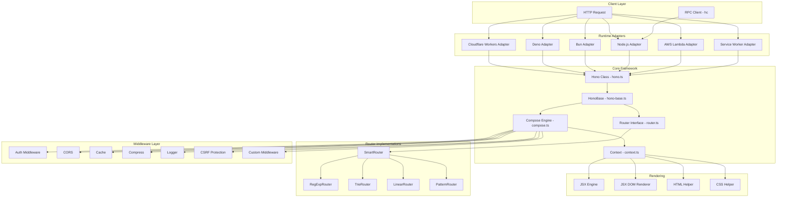
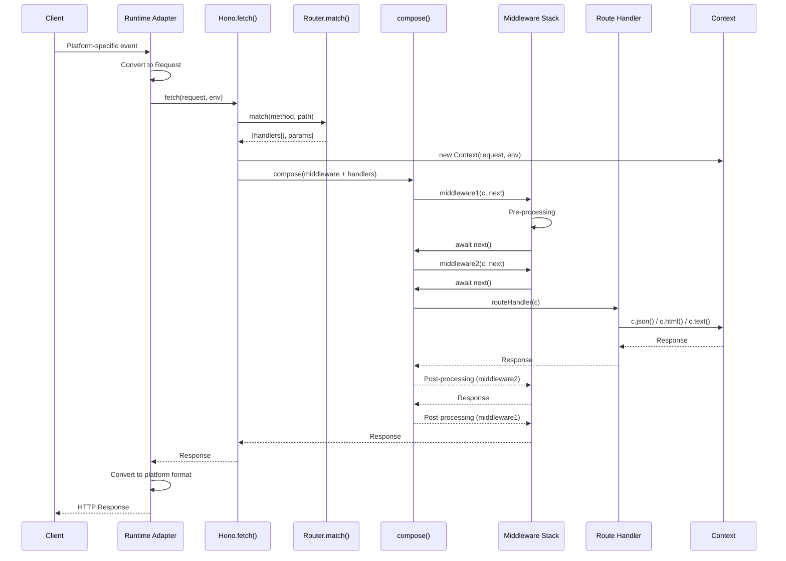
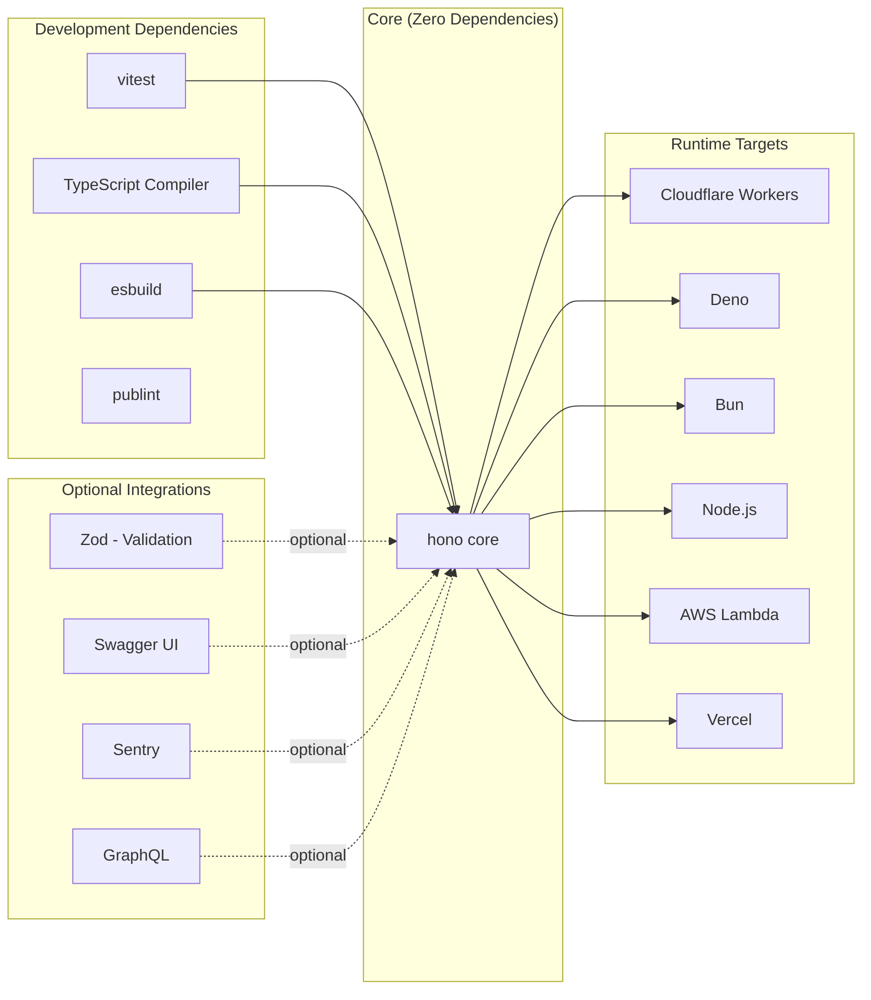

# Hono

> Ultrafast, lightweight web framework built on Web Standards APIs for any JavaScript runtime

| Metadata | |
|---|---|
| Repository | https://github.com/honojs/hono |
| License | MIT |
| Primary Language | TypeScript |
| Category | Web Framework |
| Analyzed Release | `v4.11.9` (2026-02-08) |
| Stars (approx.) | 28,000+ |
| Generated by | Claude Opus 4.6 (Anthropic) |
| Generated on | 2026-02-08 |

## Overview

Hono (meaning "flame" in Japanese) is an ultrafast, lightweight web framework built entirely on Web Standards APIs. It was created to solve a fundamental challenge in the modern JavaScript ecosystem: building portable HTTP applications that run on any JavaScript runtime -- from Cloudflare Workers and Deno Deploy to Bun, Node.js, AWS Lambda, and Service Workers -- without requiring any code changes.

The framework positions itself at the intersection of performance and developer experience. Unlike Node.js-centric frameworks like Express or Fastify that rely on platform-specific APIs, Hono uses only the Fetch API standard (Request/Response/Headers) as its foundation. This architectural decision makes Hono truly runtime-agnostic while keeping the core bundle under 14KB.

Hono fills the gap for developers who need:
- A framework that deploys to edge runtimes without vendor lock-in
- Express-like DX with TypeScript-first design and type-safe routes
- Minimal overhead and fast cold starts for serverless/edge functions
- Built-in middleware ecosystem without heavy dependencies

---

## Architecture Overview

---

## Core Components

### 1. HonoBase and Hono Class

Responsibility: Central application class that wires together routing, middleware composition, and request handling.

Key files:
- `src/hono-base.ts` -- Abstract base class with routing registration (get, post, put, delete, etc.) and the fetch handler
- `src/hono.ts` -- Concrete Hono class that selects the default SmartRouter
- `src/index.ts` -- Main entry point re-exporting the Hono class

Design patterns:
- Template Method pattern: HonoBase defines the skeleton of request handling; subclasses configure routers
- Builder pattern: Method chaining for route and middleware registration (app.get().post().use())
- Facade pattern: Single entry point abstracts away router selection, middleware composition, and context creation

The Hono class accepts generic type parameters for environment bindings (Env), enabling full type inference for Cloudflare bindings, Deno permissions, or custom context variables.

### 2. Router System

Responsibility: URL pattern matching and route resolution. Hono provides multiple router implementations optimized for different use cases.

Key files:
- `src/router.ts` -- Router interface definition
- `src/router/reg-exp-router/router.ts` -- RegExpRouter, the fastest router using compiled regular expressions
- `src/router/reg-exp-router/trie.ts` -- Trie data structure for route compilation
- `src/router/reg-exp-router/matcher.ts` -- Compiled matcher for O(1) route lookups
- `src/router/smart-router/router.ts` -- SmartRouter that auto-selects the best router
- `src/router/trie-router/router.ts` -- TrieRouter for prefix-tree based matching
- `src/router/linear-router/router.ts` -- LinearRouter for fastest registration (linear scan)
- `src/router/pattern-router/router.ts` -- PatternRouter, simplest implementation

Design patterns:
- Strategy pattern: All routers implement the same Router interface; SmartRouter delegates to the optimal one
- Composite pattern: SmartRouter wraps multiple router candidates and picks the first that can handle all routes
- Flyweight pattern: RegExpRouter compiles all routes into a single RegExp for minimal memory and fast matching

The RegExpRouter compiles route patterns into a single large regular expression at dispatch time, achieving O(1) matching regardless of the number of registered routes. This is the key innovation behind Hono's benchmark-leading performance.

### 3. Compose Engine and Context

Responsibility: Middleware execution pipeline using the "onion" model, and per-request context management.

Key files:
- `src/compose.ts` -- The compose() function implementing onion-style middleware chaining
- `src/context.ts` -- Context class providing request access and response builders
- `src/http-exception.ts` -- HTTP exception handling

Design patterns:
- Chain of Responsibility: Middleware handlers call next() to pass control down the chain
- Decorator pattern: Each middleware wraps the next, allowing pre/post processing
- Context Object pattern: The Context (c) bundles request, response helpers, env bindings, and execution state

The compose function creates a recursive dispatch chain. Each middleware receives (c, next) where calling `await next()` executes downstream middleware. Returning before calling next() short-circuits the chain. This is identical in concept to Koa's middleware model but implemented with zero dependencies.

### 4. Runtime Adapters

Responsibility: Bridge between runtime-specific APIs and Hono's Web Standard interface.

Key files:
- `src/adapter/cloudflare-workers/index.ts` -- Cloudflare Workers adapter
- `src/adapter/bun/server.ts` -- Bun native server adapter with WebSocket support
- `src/adapter/deno/index.ts` -- Deno adapter
- `src/adapter/aws-lambda/handler.ts` -- AWS Lambda event-to-Request converter
- `src/adapter/vercel/handler.ts` -- Vercel serverless adapter
- `src/adapter/netlify/handler.ts` -- Netlify adapter
- `src/adapter/service-worker/handler.ts` -- Service Worker fetch event adapter

Design patterns:
- Adapter pattern: Converts platform-specific event formats (Lambda events, Cloudflare fetch events) to standard Request objects
- Inversion of Control: The adapter controls the lifecycle; Hono's core remains unaware of the runtime

Each adapter translates the runtime's incoming event into a Web Standard Request, passes it to app.fetch(), and converts the standard Response back to the runtime's expected format.

### 5. JSX Engine and Rendering

Responsibility: Server-side rendering with a built-in JSX implementation that requires no external framework.

Key files:
- `src/jsx/base.ts` -- Core JSX factory (createElement, Fragment)
- `src/jsx/dom/render.ts` -- DOM-based JSX renderer for client-side usage
- `src/jsx/components.ts` -- Suspense, ErrorBoundary, and utility components
- `src/jsx/hooks/index.ts` -- React-compatible hooks (useState, useEffect, etc.)
- `src/jsx/dom/css.ts` -- CSS-in-JS support
- `src/helper/html/index.ts` -- Tagged template literal HTML helper

Design patterns:
- Factory pattern: createElement() produces virtual DOM nodes
- Observer pattern: Hooks (useState) trigger re-renders on state changes
- Strategy pattern: Server renderer and DOM renderer share the same JSX interface

---

## Data Flow

---

## Key Design Decisions

### 1. Web Standards Only -- No Platform-Specific APIs in Core

Choice: Build the entire core on Fetch API standard (Request, Response, Headers, URL) with zero platform-specific imports.

Rationale: By depending only on Web Standards, Hono achieves true runtime portability. The same application code runs on Cloudflare Workers, Deno, Bun, Node.js, and AWS Lambda without modification. This eliminates vendor lock-in and future-proofs the framework as Web Standards converge.

Trade-offs: Some platform-specific optimizations are impossible in core code (e.g., Bun's native HTTP server features). The adapter layer adds a thin abstraction cost. Developers must understand Web Standards rather than being able to rely on Node.js-specific patterns they may already know.

### 2. Multiple Router Implementations with Smart Selection

Choice: Provide five distinct router implementations (RegExpRouter, TrieRouter, LinearRouter, PatternRouter) wrapped by SmartRouter that auto-selects the best fit.

Rationale: Different routing algorithms excel in different scenarios. RegExpRouter compiles all routes into a single regex for O(1) dispatch, making it ideal for production with many routes. LinearRouter has the fastest registration time, beneficial for serverless cold starts with few routes.

Trade-offs: Increased codebase complexity. Users must understand which router to pick for optimal performance, though SmartRouter handles this automatically. The RegExp compilation step adds startup overhead that is amortized over many requests.

### 3. TypeScript-First with End-to-End Type Safety

Choice: Written in TypeScript with deep generic types that flow from route definitions through middleware to the RPC client.

Rationale: The RPC client (hc) can infer API types directly from route definitions, providing type-safe client-server communication without code generation. This follows the trend set by tRPC but works over standard HTTP.

Trade-offs: Complex TypeScript generics can slow down IDE type-checking. The type system is harder to contribute to. JavaScript-only users lose much of the developer experience advantage.

### 4. Granular Export Paths for Tree-Shaking

Choice: Over 100 separate export paths (e.g., `hono/middleware/cors`, `hono/adapter/cloudflare-workers`, `hono/jsx`) instead of a single monolithic export.

Rationale: Edge and serverless environments are extremely bundle-size sensitive. Granular exports enable dead code elimination so applications only ship the code they use. The core Hono class alone is under 14KB.

Trade-offs: More complex import statements. Package.json exports map is large and must be maintained carefully. Breaking changes to export paths require semver major bumps.

### 5. Onion Middleware Model Without Dependencies

Choice: Implement Koa-style onion middleware from scratch in a single compose.ts file rather than depending on existing middleware libraries.

Rationale: Zero dependencies means zero supply chain risk and consistent behavior across all runtimes. The compose function is around 50 lines of code, making it auditable and maintainable.

Trade-offs: Cannot leverage existing Express/Connect middleware ecosystem directly (though compatibility helpers exist). Middleware authors must follow Hono's conventions rather than reusing middleware from other frameworks.

---

## Dependencies

Hono takes a strict zero-dependency approach for its core package. All runtime adapters are included in the main package but tree-shaken away when unused. Development tooling relies on Vitest for testing and TypeScript for compilation.

---

## Testing Strategy

Hono employs a comprehensive testing approach using Vitest:

- Unit tests co-located with source files (e.g., `src/compose.test.ts`, `src/context.test.ts`)
- Router-specific tests for each implementation (`src/router/reg-exp-router/router.test.ts`)
- Adapter tests that mock platform-specific events (`src/adapter/aws-lambda/handler.test.ts`)
- Client RPC tests validating end-to-end type inference (`src/client/client.test.ts`)
- Middleware tests for each built-in middleware module
- WebSocket tests for Bun, Deno, and Cloudflare adapters

The test suite runs across multiple runtimes to ensure compatibility. Benchmarks are maintained separately to track router performance regressions.

---

## Key Takeaways

1. Web Standards as the universal abstraction layer -- By building on Request/Response rather than Node.js-specific APIs, Hono demonstrates that runtime portability is achievable without sacrificing performance. This approach is increasingly validated as Deno, Bun, and Cloudflare converge on Web Standards.

2. Router architecture as a performance lever -- The multi-router strategy with SmartRouter auto-selection shows that routing algorithm choice has significant performance implications. RegExpRouter's approach of compiling all routes into a single regular expression achieves O(1) dispatch time, a technique applicable to any high-performance HTTP framework.

3. Minimal core, maximal extensibility -- At under 14KB for the core, Hono proves that a modern web framework does not need to be heavy. The granular export system and onion middleware model allow developers to compose exactly the functionality they need without carrying unused code to production.

4. TypeScript generics for API contracts -- The RPC client (hc) that infers types from route definitions demonstrates how TypeScript's type system can replace code generation tools. This pattern of "types as contracts" enables end-to-end type safety across client-server boundaries.

5. Adapter pattern for multi-runtime support -- Hono's adapter architecture is a textbook example of the Adapter pattern applied at the platform level. Each adapter is a thin translation layer, keeping the core framework pure and platform-agnostic while supporting eight different runtimes.

---

## References

- [Hono Official Documentation](https://hono.dev/)
- [GitHub Repository - honojs/hono](https://github.com/honojs/hono)
- [The story of web framework Hono, from the creator of Hono (Cloudflare Blog)](https://blog.cloudflare.com/the-story-of-web-framework-hono-from-the-creator-of-hono/)
- [Hono DeepWiki](https://deepwiki.com/honojs/hono)
- [Hono.js: The Next-Gen Node.js Framework (Medium)](https://leapcell.medium.com/hono-js-the-next-gen-node-js-framework-a7e8896b2c76)
