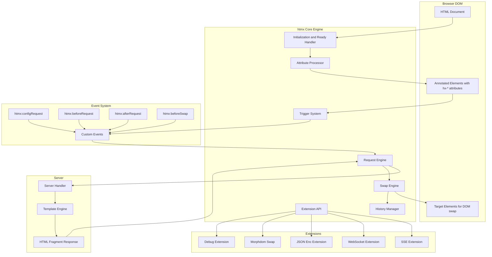
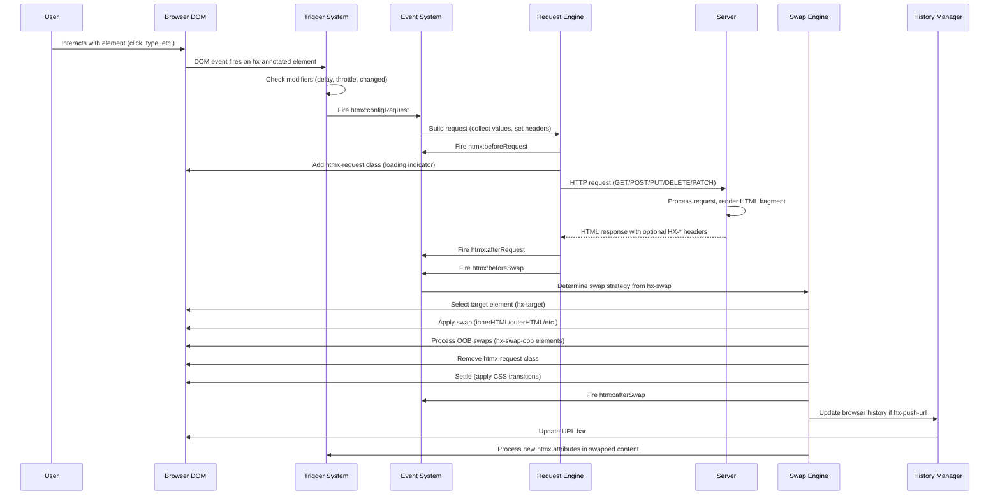
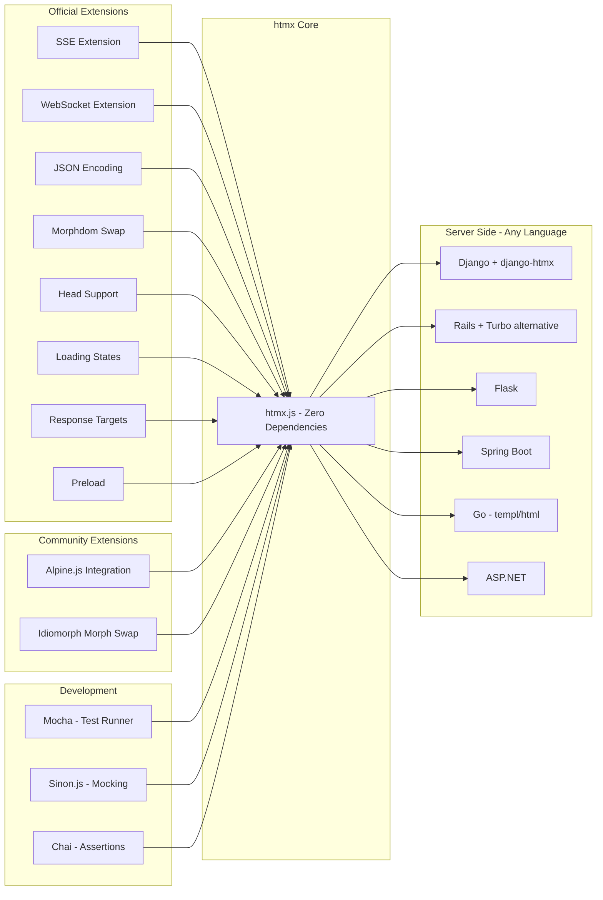

# htmx

> A JavaScript library extending HTML with AJAX capabilities through declarative attributes

| Metadata | |
|---|---|
| Repository | https://github.com/bigskysoftware/htmx |
| License | BSD Zero Clause (0BSD) |
| Primary Language | JavaScript |
| Category | Web Framework |
| Analyzed Release | `v2.0.7` (2025-09-11) |
| Stars (approx.) | 47,000+ |
| Generated by | Claude Opus 4.6 (Anthropic) |
| Generated on | 2026-02-08 |

## Overview

htmx is a JavaScript library that extends HTML's native capabilities by allowing any element to issue HTTP requests and update any part of the DOM -- all through declarative HTML attributes. It was created by Carson Gross as the successor to intercooler.js, motivated by a fundamental thesis: HTML as a hypermedia should be able to do more than just navigate via anchor tags and submit forms.

The core problem htmx addresses is the over-engineering of web applications. Modern single-page application (SPA) frameworks require developers to write complex JavaScript, manage client-side state, and essentially build two applications (a JSON API backend and a JavaScript frontend). htmx argues that for the vast majority of web applications, the server should remain the authoritative source of application state, and HTML should remain the transfer format.

htmx positions itself as a return to the Hypermedia-Driven Application (HDA) architecture, where:
- The server returns HTML fragments (not JSON)
- HATEOAS (Hypermedia As The Engine Of Application State) drives navigation
- Client-side JavaScript is minimized to declarative attribute annotations
- Any backend language/framework can be used since the contract is plain HTML

At approximately 14KB minified and gzipped, htmx is a single-file library with zero dependencies that can be added to any HTML page with a script tag.

---

## Architecture Overview

---

## Core Components

### 1. Attribute Processor and Initialization

Responsibility: Scan the DOM for hx-* attributes and set up event listeners and request handlers for annotated elements.

Key files:
- `src/htmx.js` -- The entire library is a single file (~4,000 lines of well-structured JavaScript)

Relevant internal functions:
- `htmx.process()` -- Processes an element and its children for htmx attributes
- `processNode()` -- Initializes a single node by scanning for hx-get, hx-post, hx-put, hx-delete, hx-patch
- `getAttributeValue()` -- Resolves attribute values with inheritance support
- `initNode()` -- Sets up triggers, request handlers, and extension bindings for a node

Design patterns:
- Observer pattern: MutationObserver watches for DOM changes and automatically processes new elements
- Declarative configuration: All behavior is defined through HTML attributes rather than imperative JavaScript
- Convention over configuration: Default triggers (click for buttons, submit for forms, change for inputs) reduce boilerplate

When htmx loads, it registers a DOMContentLoaded handler that processes the entire document body. A MutationObserver then monitors for dynamically added elements, ensuring htmx attributes work even with content injected after initial page load.

### 2. Trigger System

Responsibility: Parse trigger specifications and bind event listeners that initiate HTTP requests.

Key internal functions:
- `getTriggerSpecs()` -- Parses the hx-trigger attribute value into structured trigger specifications
- `addTriggerHandler()` -- Binds the actual event listener based on parsed trigger specs
- `maybeFilterEvent()` -- Applies trigger filters (e.g., `keyup[key=='Enter']`)
- Throttle and debounce logic for trigger modifiers

Design patterns:
- Interpreter pattern: The hx-trigger attribute uses a mini-DSL (e.g., `click, keyup[key=='Enter'] changed delay:500ms throttle:1s from:document`)
- Decorator pattern: Trigger modifiers (delay, throttle, changed, once) wrap the base trigger behavior
- Event delegation: Events can be captured from other elements via the `from:` modifier

The trigger system supports:
- Standard DOM events (click, submit, change, keyup, etc.)
- Custom events
- Polling (`every 2s`)
- Intersection Observer integration (`revealed`, `intersect`)
- SSE/WebSocket message triggers
- Filter expressions using JavaScript in square brackets

### 3. Request Engine

Responsibility: Build and issue AJAX requests to the server, manage request lifecycle, and handle responses.

Key internal functions:
- `issueAjaxRequest()` -- Main request orchestration function
- `getInputValues()` -- Collects form values from the element and its hx-include targets
- `getHeaders()` -- Sets htmx-specific headers (HX-Request, HX-Trigger, HX-Target, HX-Current-URL)
- `makeRequestConfig()` -- Builds the fetch/XMLHttpRequest configuration
- `handleAjaxResponse()` -- Processes the server response

Design patterns:
- Pipeline pattern: Request goes through configRequest -> beforeRequest -> request -> afterRequest -> beforeSwap -> swap -> afterSwap
- Strategy pattern: The request implementation can be replaced via extensions (e.g., custom fetch)
- Observer pattern: Events are fired at each pipeline stage, allowing interception

htmx sends special headers with every request:
- `HX-Request: true` -- Identifies the request as htmx-initiated
- `HX-Trigger` -- The id of the triggering element
- `HX-Target` -- The id of the target element
- `HX-Current-URL` -- The current browser URL

These headers allow the server to differentiate between full page loads and partial htmx requests, enabling progressive enhancement.

### 4. Swap Engine

Responsibility: Take the HTML response from the server and insert it into the DOM according to the specified swap strategy.

Key internal functions:
- `swapInnerHTML()` -- Default swap: replace inner content of target
- `swapOuterHTML()` -- Replace the entire target element
- `swapAfterBegin()`, `swapBeforeBegin()`, `swapAfterEnd()`, `swapBeforeEnd()` -- Positional swaps
- `swapDelete()` -- Remove the target element
- `oobSwap()` -- Out-of-Band swap for elements with hx-swap-oob attribute
- `selectAndSwap()` -- Applies hx-select to pick specific elements from the response
- `handleTitle()` -- Updates document title from response
- `settleImmediately()` / `settle()` -- Handles CSS transitions during swaps

Design patterns:
- Strategy pattern: Multiple swap strategies selected via hx-swap attribute value
- Composite pattern: Out-of-Band (OOB) swaps allow updating multiple DOM locations from a single response
- Template Method: The swap pipeline follows a fixed sequence (select -> removeOldContent -> insertNewContent -> settle -> afterSettle)

Swap strategies include: innerHTML (default), outerHTML, beforebegin, afterbegin, beforeend, afterend, delete, and none. Each can be combined with modifiers like `swap:500ms` (delay before swap), `settle:500ms` (delay for CSS transitions), `scroll:top`, and `show:top`.

### 5. Extension System

Responsibility: Provide a plugin architecture that allows extending or overriding htmx's core behavior.

Key internal functions:
- `htmx.defineExtension()` -- Registers a named extension
- `getExtensions()` -- Retrieves extensions applicable to an element (respects hx-ext attribute)
- Extension lifecycle hooks: onEvent, transformResponse, isInlineSwap, handleSwap, encodeParameters

Key extension files:
- `dist/ext/sse.js` -- Server-Sent Events integration
- `dist/ext/ws.js` -- WebSocket integration
- `dist/ext/json-enc.js` -- JSON request body encoding
- `dist/ext/morphdom-swap.js` -- Morphdom-based DOM morphing swap
- `dist/ext/head-support.js` -- HEAD tag management
- `dist/ext/loading-states.js` -- Loading indicator support
- `dist/ext/response-targets.js` -- Different targets for different response codes

Design patterns:
- Plugin pattern: Extensions register hooks that are called at specific points in htmx's lifecycle
- Chain of Responsibility: Multiple extensions on an element are called in order
- Open/Closed principle: Core htmx is closed for modification but open for extension

---

## Data Flow

---

## Key Design Decisions

### 1. Single-File Library with No Dependencies

Choice: Ship the entire library as a single `htmx.js` file (~14KB gzipped) with zero external dependencies.

Rationale: This mirrors the simplicity ethos of the project. Adding htmx to any project requires only a single `<script>` tag. There is no build step, no npm install, no bundler configuration. This dramatically lowers the barrier to adoption and eliminates supply chain risk.

Trade-offs: Code organization is limited to IIFE module patterns within the single file. Contributors must work within a monolithic file rather than a modular codebase. Advanced features like tree-shaking are not applicable since everything ships as one unit.

### 2. HTML Attributes as the Programming Interface

Choice: Use declarative HTML attributes (hx-get, hx-post, hx-target, hx-swap, hx-trigger) rather than a JavaScript API for defining behavior.

Rationale: This keeps the interface in HTML where the document structure lives, enabling a "locality of behavior" principle. Developers can look at an HTML element and immediately understand what it does. No context-switching to JavaScript files is needed. It also enables progressive enhancement -- elements work as standard HTML if htmx fails to load.

Trade-offs: Complex interactions can lead to long attribute strings that are hard to read. Debugging declarative behavior is less straightforward than imperative code. Some dynamic behaviors require combining multiple attributes in non-obvious ways.

### 3. Server Returns HTML, Not JSON

Choice: Expect servers to return HTML fragments that are swapped directly into the DOM, rather than JSON that requires client-side rendering.

Rationale: This is the foundational architectural decision. By keeping HTML as the transfer format, the server remains the single source of truth for both data and presentation. Any server-side language/framework can be used. There is no need for client-side templating, state management, or component frameworks. The approach aligns with REST/HATEOAS principles.

Trade-offs: Responses are larger than equivalent JSON (HTML includes markup). Mobile/native clients cannot easily consume the same API. Complex client-side interactions (drag-and-drop, real-time collaboration) are harder to implement. Sharing rendering logic between server and client is not possible.

### 4. Event-Driven Architecture with Interception Points

Choice: Fire custom events at every stage of the request/swap lifecycle, allowing external JavaScript to intercept and modify behavior.

Rationale: While htmx aims to minimize JavaScript, complex applications inevitably need some custom behavior. The event system provides escape hatches without polluting the core library. Events like htmx:configRequest, htmx:beforeSwap, and htmx:afterSettle give developers fine-grained control.

Trade-offs: Heavy use of event listeners can lead to implicit, hard-to-trace behavior. The event-driven approach requires understanding htmx's internal lifecycle to use effectively.

### 5. Progressive Enhancement as Core Philosophy

Choice: Design htmx so that it enhances standard HTML elements rather than replacing them. Forms still submit, links still navigate -- htmx adds AJAX behavior on top.

Rationale: Applications work (with full page reloads) even if JavaScript is disabled or htmx fails to load. This improves accessibility, SEO, and reliability. The server already handles full page rendering, so htmx just optimizes the user experience by making interactions partial.

Trade-offs: Developers must design their server to handle both full page requests and partial htmx requests. This dual-mode requirement adds server-side complexity. The progressive enhancement approach limits the types of interactions that feel natural.

---

## Dependencies

htmx has zero runtime dependencies. The core library is entirely self-contained. Extensions are separate JavaScript files that register with htmx's extension API. The library works with any backend that can return HTML.

---

## Testing Strategy

htmx uses a traditional browser-based testing approach:

- Test file: `src/htmx.test.ts` (compiled to JavaScript)
- Test runner: Mocha running in a browser environment
- Mocking: Sinon.js for HTTP request mocking
- Assertions: Chai assertion library
- Server simulation: Mock server responses that return HTML fragments

The test suite covers:
- Attribute parsing and trigger specification
- All swap strategies (innerHTML, outerHTML, positional swaps)
- Out-of-Band swap behavior
- History management and URL updates
- Extension lifecycle hooks
- Event firing and cancellation
- Form value collection
- CSS transition handling
- Error handling and timeout behavior

Tests run in a real browser DOM environment (not JSDOM), ensuring accurate behavior for DOM manipulation, CSS transitions, and event handling.

---

## Key Takeaways

1. Simplicity as architecture -- htmx demonstrates that a powerful web framework can be a single ~4,000-line file with zero dependencies. By constraining scope to "make HTML do more AJAX," the library avoids the complexity explosion that plagues SPA frameworks. The entire codebase is auditable by a single developer in an afternoon.

2. Hypermedia as the engine of application state -- htmx's most radical contribution is re-legitimizing server-rendered HTML as a modern web architecture. By returning HTML fragments instead of JSON, applications maintain a single source of truth on the server, eliminate client-side state management, and work with any backend language. This HATEOAS approach simplifies the full-stack architecture significantly.

3. Declarative behavior through HTML attributes -- The hx-* attribute system proves that complex AJAX interactions can be expressed declaratively in HTML without writing JavaScript. This "locality of behavior" pattern makes it immediately clear what an element does by looking at its markup, improving readability and maintainability.

4. Extension points preserve core simplicity -- The extension API allows htmx to remain minimal while supporting advanced use cases (SSE, WebSockets, morphdom swaps). This demonstrates the Open/Closed Principle applied at the library level: the core is closed for modification but open for extension through well-defined hooks.

5. Backend-agnostic by design -- Because htmx's contract is "send HTTP request, receive HTML," it works equally well with Django, Rails, Spring Boot, Go, ASP.NET, or any server that renders HTML. This backend independence is a strategic advantage that has driven adoption across diverse language communities.

---

## References

- [htmx Official Documentation](https://htmx.org/docs/)
- [GitHub Repository - bigskysoftware/htmx](https://github.com/bigskysoftware/htmx)
- [Hypermedia Systems (Book by Carson Gross)](https://hypermedia.systems/)
- [htmx DeepWiki](https://deepwiki.com/bigskysoftware/htmx)
- [htmx Essays - The Fetchening](https://htmx.org/essays/the-fetchening/)
- [What is HTMX? - JetBrains Guide](https://www.jetbrains.com/guide/dotnet/tutorials/htmx-aspnetcore/what-is-htmx/)
