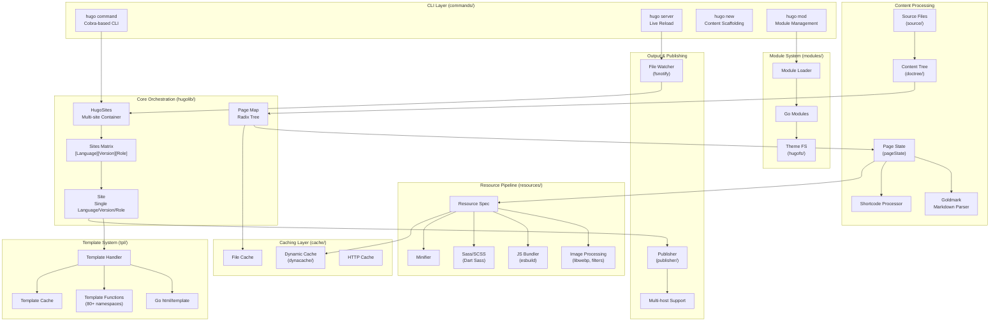
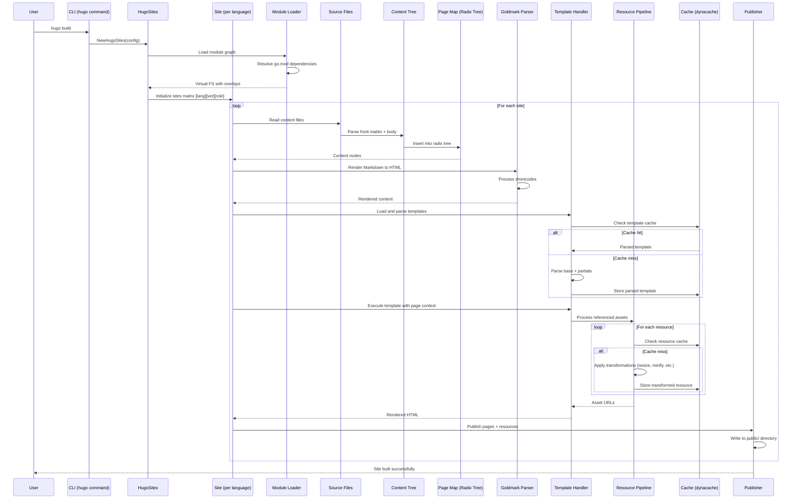
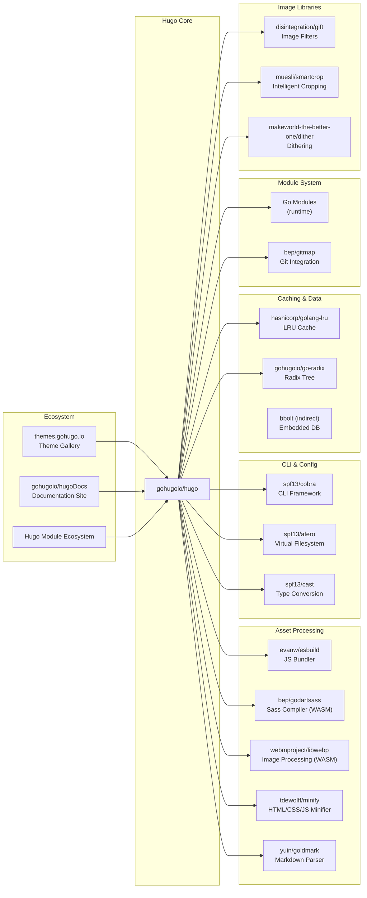

# Hugo

> The world's fastest framework for building websites

| Metadata | |
|---|---|
| Repository | https://github.com/gohugoio/hugo |
| License | Apache-2.0 |
| Primary Language | Go |
| Analyzed Release | `v0.155.2` (2026-02-02) |
| Stars (approx.) | 86,000+ |
| Generated by | Claude Opus 4.6 (Anthropic) |
| Generated on | 2026-02-08 |

## Overview

Hugo is a static site generator written in Go, optimized for speed and designed for flexibility. With its advanced templating system and fast asset pipelines, Hugo renders a complete site in seconds, often less. It is widely recognized as one of the fastest static site generators available, leveraging Go's concurrency model and efficient compilation to deliver exceptional build performance.

Problems it solves:

- Slow build times for large static sites with thousands of pages (Hugo can build most sites in under a second)
- Complex multilingual content management and internationalization workflows
- Fragmented asset processing pipelines requiring multiple tools for images, JavaScript, and CSS
- Theme and module dependency management across projects

Positioning:

Hugo is positioned as the fastest static site generator in the ecosystem, competing with Jekyll, Next.js (static export), Gatsby, and Eleventy. It is particularly popular for documentation sites, corporate websites, blogs, and large content-driven projects. Unlike JavaScript-based generators, Hugo is distributed as a single binary with no runtime dependencies, making deployment and CI/CD integration straightforward.

## Architecture Overview

Hugo employs a sophisticated multi-dimensional rendering architecture built around the concept of a Sites Matrix. Each site is defined by three axes: language, version, and role. Content flows through a pipeline consisting of source loading, content tree construction, template application, resource processing, and finally publication to output directories.

## Core Components

### HugoSites Container (`hugolib/hugo_sites.go`)

- Responsibility: Orchestrates multiple Site instances across languages, versions, and roles
- Key files: `hugolib/hugo_sites.go`, `hugolib/sitesmatrix/sitesmatrix.go`
- Design patterns: Container pattern, Multi-dimensional matrix indexing

HugoSites is the top-level container managing all Site instances. It maintains a three-dimensional matrix indexed by `[language][version][role]`, allowing Hugo to generate multiple variations of the same content (e.g., different languages, staging vs. production versions). The `sitesVersionsRolesMap` provides O(1) lookup by vector coordinates. HugoSites also manages shared resources like the page cache (`cachePages`), content source cache (`cacheContentSource`), and git/codeowner information.

The orchestration layer uses worker pools (`para.Workers`) to parallelize site building across languages. The `buildCounter` tracks incremental rebuilds, enabling efficient live reload during development.

### Site (`hugolib/site.go`)

- Responsibility: Represents a single site instance for a specific language, version, and role
- Key files: `hugolib/site.go`, `hugolib/page.go`
- Design patterns: Dependency injection, Lazy initialization

Each Site holds its own `pageMap` (a radix tree for efficient content lookup), template handler, publisher, and configuration (`allconfig.Config`). The `siteLanguageVersionRole` struct embeds version and role metadata, determining which content and templates are active.

Sites maintain a `pageState` for each content file, which encapsulates front matter, body content, output formats, and rendering state. The `pageOutputs` slice holds rendered versions for each output format (HTML, JSON, RSS, etc.), and Hugo can reuse content across formats if template variations permit.

### Content Tree & Page Map (`hugolib/doctree/`, `hugolib/pageMap.go`)

- Responsibility: Hierarchical content organization and fast lookups
- Key files: `hugolib/doctree/doctree.go`, `hugolib/pagemap.go`
- Design patterns: Radix tree (prefix tree), Lazy loading

Hugo uses a radix tree (via `github.com/gohugoio/go-radix`) to store and query content efficiently. The `pageMap` indexes pages by path, enabling fast ancestor/descendant queries and section lookups. Content is organized into `doctree` structures representing taxonomies, sections, and terms.

The `contentNode` interface abstracts different content types (pages, sections, taxonomies). Lazy initialization (`siteInit`) defers heavy computation (e.g., page collections, menus) until first access, improving cold start performance.

### Template System (`tpl/tplimpl/`)

- Responsibility: Template parsing, caching, and execution with Hugo-specific extensions
- Key files: `tpl/tplimpl/template.go`, `tpl/tplimpl/template_funcs.go`
- Design patterns: Adapter pattern (wrapping Go's html/template), Template method pattern

Hugo wraps Go's `html/template` and `text/template` packages, adding 80+ function namespaces (e.g., `strings`, `collections`, `images`, `urls`). The `templateHandler` caches parsed templates and manages base templates, partials, and shortcodes.

Template execution receives a `tpl.RenderingContext` identifying the current site, output format, and page. Hugo supports deferred template execution for partial caching and dependency tracking, allowing fine-grained cache invalidation during rebuilds.

The template system also handles shortcodes (reusable content snippets with parameters), which are parsed from Markdown and executed within the rendering pipeline.

### Resource Pipeline (`resources/`)

- Responsibility: Asset processing (images, JS, CSS) with chaining and caching
- Key files: `resources/resource.go`, `resources/images/image.go`, `resources/resource_transformers/js/build.go`
- Design patterns: Chain of responsibility (transformations), Resource pooling

Hugo Pipes provides a fluent API for asset transformations. Resources are described by `ResourceSourceDescriptor` and processed through transformation chains. Image processing leverages libwebp (bundled as WASM), supporting resize, crop, filter, and format conversion operations.

JavaScript bundling integrates esbuild (`github.com/evanw/esbuild`), enabling TypeScript transpilation, JSX support, tree shaking, and minification. Sass/SCSS processing uses Dart Sass compiled to WASM (`github.com/bep/godartsass`).

Transformations are cached in `dynacache` partitions, keyed by input hash and transformation parameters. Hugo supports lazy publishing (`LazyPublish`) to defer file writes until resources are actually referenced in templates.

### Module System (`modules/`)

- Responsibility: Dependency management, theme composition, and content merging
- Key files: `modules/client.go`, `modules/config.go`
- Design patterns: Go Modules integration, Virtual filesystem overlay

Hugo Modules builds on Go Modules (`go.mod`, `go.sum`) to manage themes, components, and shared content. Modules can mount directories into the Hugo virtual filesystem (`hugofs`), allowing theme composition and content inheritance.

The `modules.Client` resolves module graphs, handles vendoring (`hugo mod vendor`), and applies module mounts to the layered filesystem. Multiple modules can contribute to the same mount point, with later modules taking precedence (overlay pattern).

Modules support content, data, i18n, archetypes, assets, and layouts, enabling large-scale content reuse across projects.

### Caching System (`cache/`)

- Responsibility: Multi-tier caching for files, computed values, and HTTP responses
- Key files: `cache/filecache/filecache.go`, `cache/dynacache/dynacache.go`
- Design patterns: Partition-based cache, Stale-while-revalidate

Hugo uses a sophisticated caching strategy with three layers:

1. File Cache (`filecache`): Persists downloaded resources, processed images, and module downloads to disk
2. Dynamic Cache (`dynacache`): In-memory LRU cache for computed values (page collections, resource transformations)
3. HTTP Cache (`httpcache`): Stores remote HTTP responses with RFC 7234 compliance

Caches are partitioned by type and invalidated based on content hashes and dependency tracking. The `StaleValue` wrapper supports background revalidation, keeping the UI responsive during rebuilds.

## Data Flow

### Typical Site Build Flow

## Key Design Decisions

### 1. Sites Matrix: Multi-dimensional Content Organization

- Choice: Organizing sites in a three-dimensional matrix indexed by language, version, and role
- Rationale: Allows Hugo to generate multiple variations of the same content (multilingual sites, staging/production versions, different roles like "main" vs "search") with shared content processing but different rendering contexts. The matrix structure enables O(1) lookups and efficient memory sharing across dimensions
- Trade-offs: Increased complexity in site initialization and routing. Developers must understand the vector-based addressing model. Memory overhead grows with dimension count, though lazy initialization mitigates this

### 2. Radix Tree for Content Indexing

- Choice: Using a radix tree (prefix tree) for the page map instead of flat maps or nested trees
- Rationale: Radix trees provide O(k) lookup where k is the path length, enabling fast ancestor/descendant queries essential for section pages, breadcrumbs, and navigation. The prefix-based structure naturally models filesystem hierarchies
- Trade-offs: Higher implementation complexity compared to hash maps. Radix trees require careful handling of Unicode normalization and path separators. Insertion order affects tree balance (mitigated by path sorting)

### 3. Go html/template with Custom Extensions

- Choice: Wrapping Go's standard `html/template` and `text/template` packages rather than implementing a custom template language
- Rationale: Leverages Go's battle-tested, security-focused template engine with automatic HTML escaping. Provides familiar syntax for Go developers. The extension mechanism (template functions) allows Hugo-specific features without forking the template engine
- Trade-offs: Limited to Go template syntax constraints (no inline complex logic, no arbitrary method calls). Template errors can be cryptic. Performance is bound by Go's template execution speed (though caching compensates)

### 4. Asset Processing via esbuild and Dart Sass Integration

- Choice: Embedding esbuild (pure Go port) and Dart Sass (compiled to WASM) rather than shelling out to Node.js tools
- Rationale: Maintains Hugo's zero-dependency philosophy. Enables cross-platform single-binary distribution. esbuild integration provides near-native performance for JavaScript bundling. WASM-based Dart Sass ensures consistent Sass compilation across platforms
- Trade-offs: Limited to esbuild and Dart Sass feature sets (cannot use arbitrary Webpack plugins or PostCSS transformations). WASM execution has overhead compared to native binaries. Updates to esbuild and Dart Sass require Hugo releases

### 5. Hugo Modules Built on Go Modules

- Choice: Reusing Go's module system (`go.mod`, `go.sum`) for theme and component management
- Rationale: Avoids reinventing dependency resolution, versioning, and vendoring. Go modules provide semantic versioning, checksum verification, and proxy support. Developers familiar with Go modules can immediately use Hugo modules
- Trade-offs: Requires Go toolchain installation for module operations. Non-Go users may find `go.mod` syntax unfamiliar. Modules are Git-centric, making non-Git distribution harder

### 6. Incremental Rebuilds with Dependency Tracking

- Choice: Implementing fine-grained dependency tracking via `identity.Manager` to enable fast incremental rebuilds
- Rationale: For large sites with thousands of pages, full rebuilds are too slow for live reload workflows. Dependency tracking identifies which pages and resources are affected by a file change, allowing surgical rebuilds
- Trade-offs: Complexity in dependency graph management. Risk of stale content if dependencies are incorrectly tracked. Increased memory usage to store dependency relationships

## Dependencies

## Testing Strategy

Hugo employs a comprehensive multi-layered testing strategy to ensure reliability and correctness across its complex codebase.

Unit tests: Each package contains extensive unit tests (`*_test.go` files) following Go conventions. The `hugolib` package includes integration-style tests that build entire sites. Hugo uses table-driven tests extensively, with test data in `testdata/` directories.

Integration tests: The `*_integration_test.go` files build real Hugo sites with content, templates, and configuration, asserting on output files. The `testscripts/` directory contains txtar-based tests (text archive format) that define multi-file scenarios compactly.

Golden file testing: Many tests use the golden file pattern, comparing rendered output against reference files. The `frankban/quicktest` package provides concise assertion helpers.

CI/CD: GitHub Actions runs tests on Linux, macOS, and Windows across multiple Go versions. The test suite includes linting (golangci-lint), race detection (`go test -race`), and coverage reporting. Releases are automated with cross-compilation for 10+ platforms, producing binaries for standard, extended, and extended/deploy editions.

Benchmarking: Hugo includes micro-benchmarks (`*_bench_test.go`) and macro-benchmarks (full site builds) to track performance regressions. The `hugolib` benchmarks simulate real-world sites with thousands of pages.

## Key Takeaways

1. Multi-dimensional site organization: The Sites Matrix architecture demonstrates how to model complex content variations (language, version, role) in a single unified system. The vector-based indexing enables shared processing with dimension-specific rendering, applicable to any multi-tenant or multi-variant content system.

2. Radix trees for hierarchical content: Using radix trees for content indexing provides logarithmic lookups while naturally modeling filesystem hierarchies. This pattern is broadly applicable to CMS systems, documentation generators, and any tool operating on tree-structured data.

3. Template caching with dependency tracking: Hugo's approach to template caching and invalidation via dependency tracking enables sub-second incremental rebuilds for large sites. The `identity.Manager` pattern can be adapted to any system requiring fine-grained change propagation.

4. Zero-dependency distribution via Go and WASM: Embedding complex tools (esbuild, Dart Sass, libwebp) as pure Go or WASM modules allows single-binary distribution without sacrificing functionality. This strategy is increasingly viable as WebAssembly toolchains mature.

5. Modular virtual filesystem: Hugo's layered filesystem (via `afero` and module mounts) demonstrates how to compose content from multiple sources (local files, modules, themes) with overlay semantics. This pattern enables theme inheritance and content reuse without file copying.

6. Incremental builds through selective invalidation: By tracking dependencies between pages, templates, and resources, Hugo rebuilds only what changed. This architectural pattern is essential for developer experience in large projects and applicable to build systems beyond static sites.

7. Asset pipeline as a fluent API: The resource transformation API (`.Resize`, `.Minify`, `.ToCSS`) provides a chainable interface for asset processing, integrating naturally with templates. This design simplifies complex pipelines while maintaining type safety.

## References

- [Hugo Official Documentation](https://gohugo.io/documentation/)
- [GitHub - gohugoio/hugo](https://github.com/gohugoio/hugo)
- [DeepWiki - Template Architecture and Context](https://deepwiki.com/gohugoio/hugo/4.1-template-architecture-and-context)
- [DeepWiki - Template System](https://deepwiki.com/gohugoio/hugo/4-template-system)
- [Hugo Modules Documentation](https://gohugo.io/hugo-modules/)
- [Configure Markup (Goldmark)](https://gohugo.io/configuration/markup/)
- [Hugo Pipes Documentation](https://gohugo.io/hugo-pipes/)
- [Hugo's Fastest Framework Article - Best AI Tools](https://best-ai-tools.org/ai-news/hugo-the-definitive-guide-to-static-site-generation-mastery)
- [Master Hugo Modules - Nick Gracilla](https://www.nickgracilla.com/posts/master-hugo-modules-managing-themes-as-modules/)
