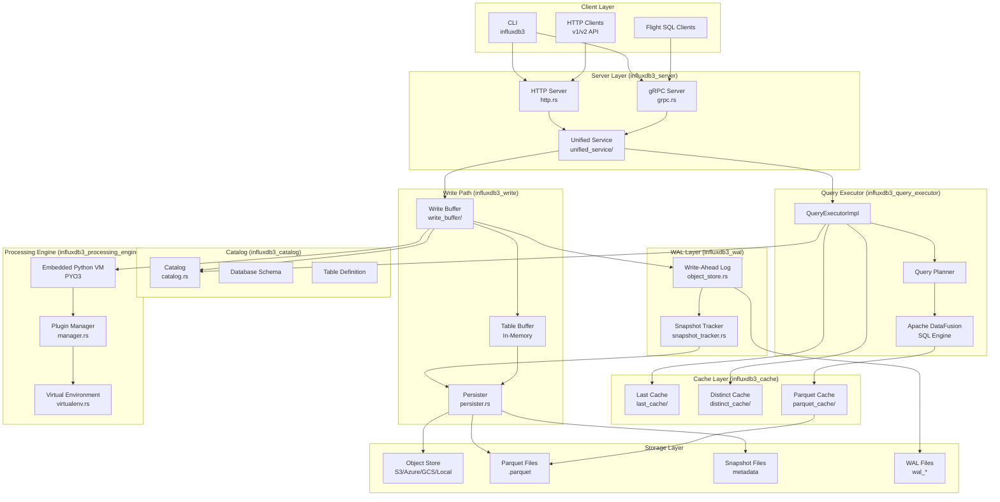
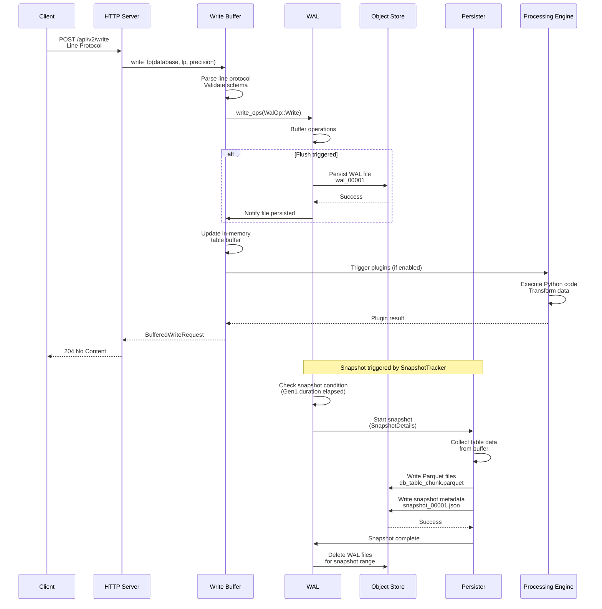
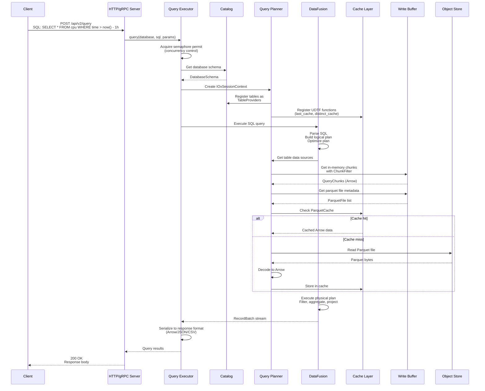
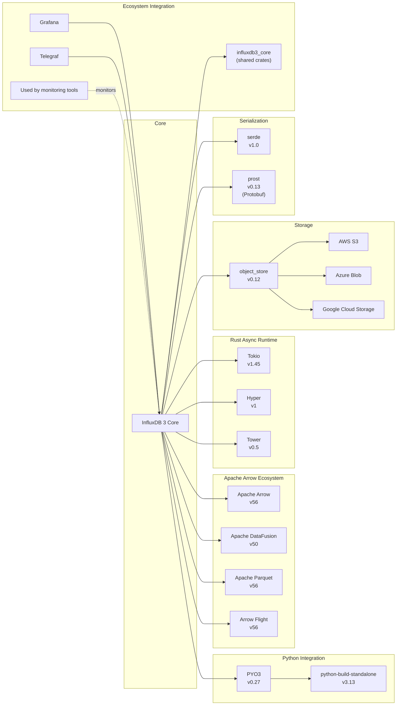

# InfluxDB

> Scalable datastore for metrics, events, and real-time analytics

| Metadata | |
|---|---|
| Repository | https://github.com/influxdata/influxdb |
| License | Apache-2.0 / MIT |
| Primary Language | Rust |
| Analyzed Release | `v2.8.0` (2025-12-12) |
| Stars (approx.) | 31,207 |
| Generated by | Claude Sonnet 4.5 (Anthropic) |
| Generated on | 2026-02-08 |

## Overview

InfluxDB 3 Core is a cloud-native, real-time columnar database built to collect, process, transform, and store event and time series data. It is ideal for use cases that require real-time ingest and fast query response times to build user interfaces, monitoring, and automation solutions. InfluxDB 3 represents a complete architectural rewrite, built in Rust using the FDAP stack (Apache Flight, DataFusion, Arrow, and Parquet).

Problems it solves:

- High cardinality time series data storage and querying with unlimited tag cardinality
- Real-time data monitoring with fast query response times (under 10ms for last-value queries)
- Cost-effective storage using compressed Parquet files in object storage with 10x greater data compression
- Seamless integration with SQL and InfluxQL query languages for flexible data analysis

Positioning:

InfluxDB is one of the most widely adopted open-source time series databases, competing with TimescaleDB, QuestDB, and Prometheus. InfluxDB 3 differentiates itself through its diskless architecture, embedded Python processing engine, and leveraging the Apache Arrow ecosystem for high-performance analytics. It reached general availability in April 2025, marking a significant milestone in the evolution of purpose-built time series databases.

## Architecture Overview

InfluxDB 3 employs a layered architecture centered around the FDAP stack. Data flows from ingestion through a Write-Ahead Log (WAL), into an in-memory buffer, and periodically snapshots to Parquet files in object storage. Query execution leverages Apache DataFusion for SQL processing over Arrow-formatted data, with specialized caching layers for last-value and distinct value queries.

## Core Components

### CLI Layer (`influxdb3/src/lib.rs`)

- Responsibility: Command-line interface for server control and client operations
- Key files: `influxdb3/src/lib.rs`, `influxdb3/src/commands/`
- Design patterns: Command pattern with Clap framework

The CLI provides subcommands for server management (`serve`), data manipulation (`write`, `query`), resource management (`create`, `delete`, `show`), and processing engine operations (`install`, `test`). Configuration is resolved through a three-layer priority: CLI flags > environment variables > config file. The `serve` command initializes the entire server stack including HTTP/gRPC servers, write buffer, query executor, and optional processing engine.

### Server Layer (`influxdb3_server/src/`)

- Responsibility: HTTP and gRPC API endpoints for data ingestion and querying
- Key files: `influxdb3_server/src/http.rs`, `influxdb3_server/src/grpc.rs`, `influxdb3_server/src/lib.rs`
- Design patterns: Unified service pattern, Tower middleware layers

The server implements dual protocols: HTTP REST API (compatible with InfluxDB v1/v2 write and query APIs) and Apache Arrow Flight SQL over gRPC. The `UnifiedService` pattern routes requests to either HTTP or gRPC handlers based on protocol detection. Middleware layers handle tracing, metrics, authentication, and graceful shutdown. TLS support is optional with configurable minimum protocol versions.

### Write Buffer (`influxdb3_write/src/`)

- Responsibility: Buffering incoming writes in memory and coordinating persistence
- Key files: `influxdb3_write/src/lib.rs`, `influxdb3_write/src/write_buffer/`, `influxdb3_write/src/persister.rs`
- Design patterns: Write-Ahead Log pattern, Snapshot isolation

The write buffer parses line protocol, validates data, writes to the WAL for durability, and buffers in a queryable in-memory format. The `Bufferer` trait defines write operations with configurable precision and partial accept behavior. The `Persister` component periodically snapshots buffered data to Parquet files, triggered by the WAL's snapshot tracker. The `TableIndex` and `TableIndexCache` structures maintain metadata for efficient query planning.

### WAL Layer (`influxdb3_wal/src/`)

- Responsibility: Durable write-ahead log persisted to object storage
- Key files: `influxdb3_wal/src/lib.rs`, `influxdb3_wal/src/object_store.rs`, `influxdb3_wal/src/snapshot_tracker.rs`
- Design patterns: Write-Ahead Log pattern, Sequence number tracking

The WAL buffers write operations and persists them as individual files in object storage (S3, Azure Blob, GCS, or local filesystem). The `SnapshotTracker` monitors WAL file accumulation and triggers snapshots at configurable intervals (Gen1 durations: 1m, 5m, 10m). WAL files are removed after successful snapshot completion. The WAL supports both confirmed and unconfirmed writes, with confirmed writes waiting for persistence acknowledgment.

### Catalog (`influxdb3_catalog/src/`)

- Responsibility: In-memory metadata repository for databases, tables, and schemas
- Key files: `influxdb3_catalog/src/catalog.rs`, `influxdb3_catalog/src/catalog/versions/v2/`
- Design patterns: Repository pattern, Versioned schema evolution

The catalog maintains the complete schema hierarchy: databases, tables, columns, and their types. It uses a `Repository<I, R>` generic structure with bi-directional ID-to-name mapping. Catalog updates are coordinated through a global `CatalogWritePermit` mutex ensuring linearizable sequence numbers. The catalog supports soft and hard deletion with configurable retention periods. The internal `_internal` database stores system metrics with a default 7-day retention.

### Query Executor (`influxdb3_query_executor/src/`)

- Responsibility: SQL and InfluxQL query execution using Apache DataFusion
- Key files: `influxdb3_query_executor/src/lib.rs`, `influxdb3_query_executor/src/query_planner.rs`
- Design patterns: Query executor pattern, Semaphore-based concurrency control

The query executor integrates Apache DataFusion for SQL processing and custom InfluxQL query rewriting. The `QueryExecutorImpl` maintains references to the catalog, write buffer, and DataFusion executor. Query execution is rate-limited using an instrumented semaphore. The `Planner` component builds DataFusion logical plans from table definitions, integrating parquet files, in-memory chunks, and cache providers. System tables and user-defined table functions (UDTFs) for last cache and distinct cache are registered as DataFusion table providers.

### Cache Layer (`influxdb3_cache/src/`)

- Responsibility: Specialized caches for common query patterns
- Key files: `influxdb3_cache/src/last_cache/`, `influxdb3_cache/src/distinct_cache/`, `influxdb3_cache/src/parquet_cache/`
- Design patterns: Cache-aside pattern, User-Defined Table Functions (UDTF)

Three specialized caches optimize frequent query patterns: LastCache maintains the most recent value per series for sub-10ms last-value queries; DistinctCache stores unique tag value combinations for fast metadata queries; ParquetCache caches decoded Parquet file contents in Arrow format. Both LastCache and DistinctCache are exposed as DataFusion UDTFs, allowing SQL queries like `SELECT * FROM last_cache('cpu')`.

### Processing Engine (`influxdb3_processing_engine/src/`)

- Responsibility: Embedded Python VM for data transformation and triggers
- Key files: `influxdb3_processing_engine/src/lib.rs`, `influxdb3_processing_engine/src/plugins.rs`, `influxdb3_processing_engine/src/manager.rs`
- Design patterns: Plugin architecture, Virtual environment isolation

The processing engine embeds a Python interpreter (via PYO3) dynamically linked to python-build-standalone. Plugins are Python scripts that can run as triggers on write events or scheduled executions. The `ProcessingEngineManagerImpl` manages plugin lifecycle, virtual environment creation, and package installation. Virtual environments are automatically created or reused, with requirements tracked in `requirements.txt`. Plugins receive data as pandas DataFrames and can return transformed data or trigger side effects.

## Data Flow

### Write Path

### Query Path

## Key Design Decisions

### 1. FDAP Stack (Flight, DataFusion, Arrow, Parquet)

- Choice: Complete rewrite using Apache Arrow ecosystem instead of custom storage engine
- Rationale: Leverage proven, high-performance columnar data structures and query engine; benefit from the Apache Arrow community's optimizations; enable interoperability with the broader Arrow ecosystem; reduce maintenance burden by relying on well-maintained upstream projects
- Trade-offs: Dependency on external project roadmaps; initial migration complexity from InfluxDB 2.x; limited control over low-level storage format decisions; requires Rust expertise for contributions

### 2. Diskless Architecture with Object Storage

- Choice: Persist data exclusively to object storage (S3, Azure Blob, GCS) as Parquet files, with no local disk requirement
- Rationale: Enable horizontal scaling without complex distributed consensus protocols; support instant failover and high availability; leverage cheap object storage for long-term retention; simplify operational model (stateless servers)
- Trade-offs: Higher latency for storage operations compared to local SSDs; dependency on object storage availability; potential cost implications for high-frequency small writes; requires careful WAL batching strategy

### 3. Embedded Python Processing Engine

- Choice: Embed a Python interpreter (python-build-standalone via PYO3) for user-defined data transformations
- Rationale: Provide familiar, powerful scripting language for data processing; enable complex transformations without recompiling database; support rich ecosystem of Python libraries (pandas, numpy, scikit-learn); competitive feature against cloud time series databases
- Trade-offs: Significant binary size increase; dynamic linking complexity across platforms; potential security concerns with arbitrary code execution; performance overhead compared to native Rust code; maintenance burden for Python version updates

### 4. Dual Query Language Support (SQL + InfluxQL)

- Choice: Support both standard SQL (via DataFusion) and InfluxQL (legacy InfluxDB query language)
- Rationale: Enable migration path for existing InfluxDB 1.x users; provide familiar SQL interface for new users; leverage DataFusion's advanced query optimization; maintain backward compatibility with existing integrations
- Trade-offs: Increased complexity in query parsing and planning; need to maintain InfluxQL-to-SQL rewriting logic; potential inconsistencies between query language semantics; testing overhead for dual query paths

### 5. Catalog Versioning and Migration Strategy

- Choice: Implement versioned catalog schema with explicit migration paths (v1 → v2)
- Rationale: Support non-breaking schema evolution; enable rollback capabilities; maintain compatibility across upgrades; allow for gradual feature rollout
- Trade-offs: Additional code complexity for version handling; migration logic maintenance burden; potential for migration bugs; testing complexity across versions

### 6. Write-Ahead Log in Object Storage

- Choice: Persist WAL directly to object storage rather than local disk
- Rationale: Consistent with diskless architecture; eliminate local storage dependencies; simplify backup and replication; enable shared-nothing scale-out
- Trade-offs: Higher write latency compared to local disk; object storage PUT costs for small operations; requires careful batching to maintain throughput; potential for increased write amplification

## Dependencies

## Testing Strategy

InfluxDB 3 employs a comprehensive testing strategy across multiple layers, balancing unit tests, integration tests, and benchmarking.

Unit tests: Each crate contains focused unit tests for core logic, with heavy use of the `rstest` crate for parameterized testing. Mock implementations (via `mockall`) are used to isolate components. The catalog, WAL, and write buffer modules have extensive unit test coverage. Tests leverage `tempfile` for temporary storage during test execution.

Integration tests: End-to-end tests exercise the complete stack from HTTP/gRPC API through query execution and persistence. The `influxdb3_load_generator` crate provides tooling for performance testing under realistic workloads. Integration tests validate write-query consistency, snapshot recovery, and WAL replay scenarios. Docker-based testing environments simulate object storage backends.

Benchmark tests: The `criterion` crate provides statistical benchmarking for performance-critical paths. Benchmarks focus on line protocol parsing, query execution, and Parquet encoding/decoding. The `PROFILING.md` document describes profiling workflows using `perf`, `flamegraph`, and `cargo-instruments`.

CI/CD: CircleCI configuration (`.circleci/config.yaml`) orchestrates multi-platform builds (Linux amd64/arm64, macOS arm64, Windows amd64), cross-compilation with `osxcross`, and automated Docker image publishing. Release artifacts include Debian packages, RPM packages, and tarballs with bundled python-build-standalone. Nightly builds from the `main` branch produce snapshot releases with `-nightly` version suffix.

## Key Takeaways

1. Apache Arrow Ecosystem Integration: InfluxDB 3's complete adoption of the FDAP stack demonstrates the viability of building specialized databases on top of general-purpose columnar frameworks. By leveraging DataFusion's query engine and Arrow's memory format, the project achieves high performance without reinventing core infrastructure. This approach reduces maintenance burden while enabling interoperability with the broader data ecosystem. Future time series databases may follow this pattern of specialization on top of Arrow.

2. Diskless Architecture for Cloud-Native Operation: The decision to persist exclusively to object storage, with no local disk requirements, represents a significant architectural shift for time series databases. This enables truly stateless server instances, instant failover, and simplified operational models. The trade-off of higher storage latency is mitigated through aggressive in-memory buffering and WAL batching. This pattern is increasingly relevant for cloud-native applications prioritizing operational simplicity over raw write throughput.

3. Embedded Language Runtimes for User Extensions: Embedding a Python interpreter for user-defined transformations blurs the line between database and application platform. While increasing complexity, this approach provides powerful extensibility without requiring database recompilation. The use of python-build-standalone and PYO3 demonstrates a practical path for embedding dynamic language runtimes in Rust applications. Future systems may adopt similar patterns for user-programmable data pipelines.

4. Versioned Catalog with Migration Paths: The explicit catalog versioning strategy (v1, v2) with defined migration logic provides a template for schema evolution in long-lived systems. By encapsulating version-specific logic in separate modules (`catalog/versions/v2/`), the codebase maintains clear separation of concerns while supporting backward compatibility. This pattern is applicable to any system requiring non-breaking schema evolution over multi-year lifecycles.

5. Specialized Caching for Query Patterns: The three-tier caching strategy (LastCache, DistinctCache, ParquetCache) demonstrates the value of optimizing for common access patterns in time series workloads. Exposing caches as DataFusion UDTFs provides a clean interface for query integration. This pattern of pattern-specific caching layers can be adapted to other domain-specific databases with predictable query patterns.

## References

- [InfluxDB Official Documentation](https://docs.influxdata.com/influxdb3/core/)
- [Flight, DataFusion, Arrow, and Parquet: Using the FDAP Architecture to build InfluxDB 3.0](https://www.influxdata.com/blog/flight-datafusion-arrow-parquet-fdap-architecture-influxdb/)
- [Engineering a Time Series Database Using Open Source: Rebuilding InfluxDB 3 in Apache Arrow and Rust](https://www.infoq.com/articles/timeseries-db-rust/)
- [InfluxDB 3 storage engine architecture](https://docs.influxdata.com/influxdb3/clustered/reference/internals/storage-engine/)
- [Welcome to InfluxDB IOx: InfluxData's New Storage Engine](https://www.influxdata.com/blog/influxdb-engine/)
- [InfluxDB 3 Core & Enterprise GA release announcement](https://www.influxdata.com/blog/influxdb-3-oss-ga/)
- [How InfluxDB 3 Brings Processing Directly Into the Database](https://thenewstack.io/how-influxdb-3-brings-processing-directly-into-the-database/)
- [GitHub Repository: influxdata/influxdb](https://github.com/influxdata/influxdb)
