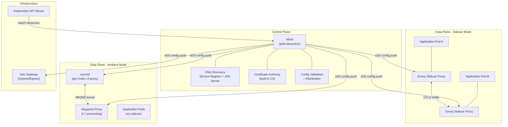
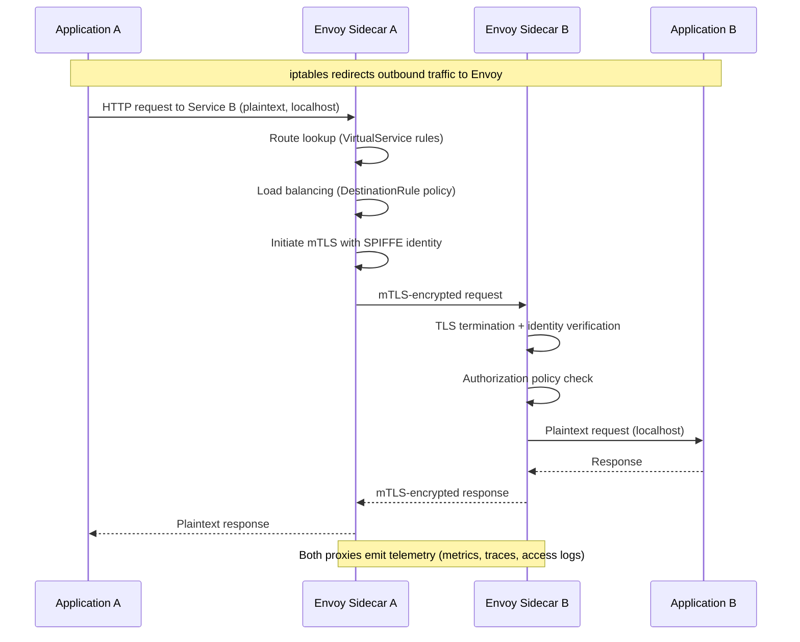
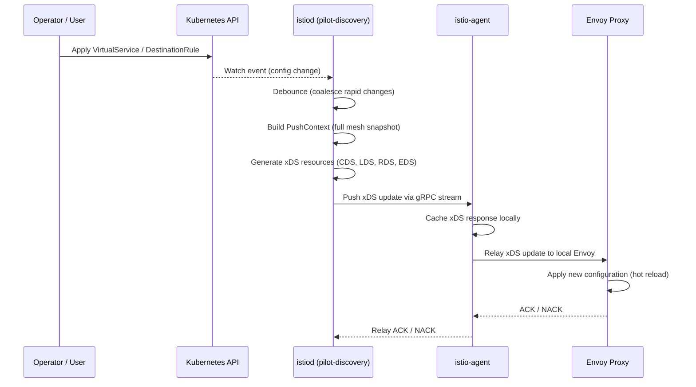
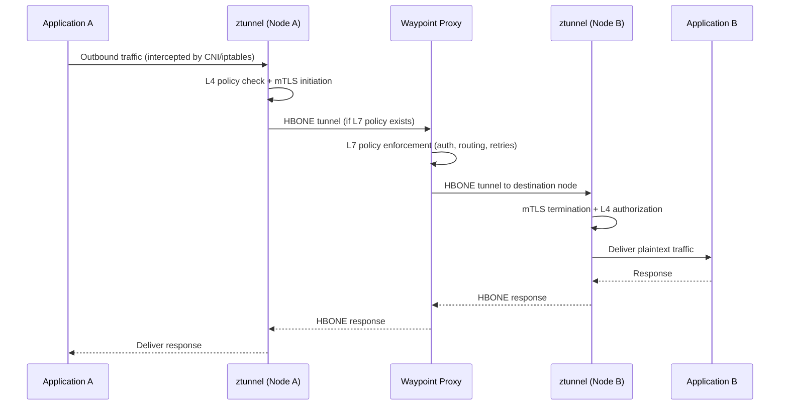
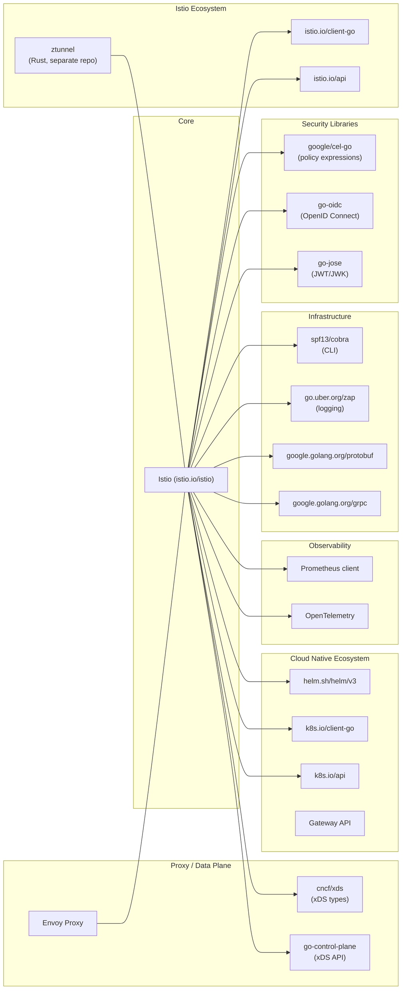

# Istio

> Connect, secure, control, and observe services.

| Metadata | |
|---|---|
| Repository | https://github.com/istio/istio |
| License | Apache License 2.0 |
| Primary Language | Go |
| Category | Networking |
| Analyzed Release | `1.28.3` (2026-01-20) |
| Stars (approx.) | 37,900 |
| Generated by | Claude Opus 4.6 (Anthropic) |
| Generated on | 2026-02-08 |

## Overview

Istio is an open-source service mesh platform that provides a uniform way to connect, secure, control, and observe microservices. It works by deploying proxy infrastructure alongside application workloads, intercepting all network traffic and applying policies transparently without requiring changes to application code. The project is a CNCF graduated project and the most widely adopted service mesh in the Kubernetes ecosystem.

Problems it solves:

- Service-to-service communication complexity in microservice architectures, including traffic routing, load balancing, retries, and circuit breaking
- Zero-trust security between services through automatic mutual TLS (mTLS), identity-based authentication, and fine-grained authorization policies
- Lack of observability into distributed systems, providing metrics, distributed tracing, and access logging for all mesh traffic
- Consistent policy enforcement across heterogeneous service fleets without modifying application code

Positioning:

Istio is the dominant service mesh in the cloud-native ecosystem, competing primarily with Linkerd (lighter weight, Rust-based proxy) and Cilium Service Mesh (eBPF-based). Compared to Linkerd, Istio offers richer feature sets including advanced traffic management, multi-cluster support, and extensibility through Envoy filters and WASM plugins. Istio differentiates itself by building on the battle-tested Envoy proxy and now offering two data plane modes: the traditional sidecar model and the newer ambient mesh mode (using ztunnel and waypoint proxies) that eliminates the per-pod sidecar overhead. Istio is backed by Google, IBM, Red Hat, and Solo.io, and is integrated into major cloud providers' managed Kubernetes offerings.

## Architecture Overview

Istio follows a clean separation between a control plane and a data plane. The control plane (istiod) is a single consolidated binary that handles service discovery, configuration management, certificate issuance, and xDS configuration distribution. The data plane consists of network proxies (Envoy sidecars or ztunnel/waypoint proxies in ambient mode) that intercept and manage all network traffic between services.

## Core Components

### Pilot Discovery / xDS Server (`pilot/pkg/xds/`)

- Responsibility: Core of the istiod control plane; implements the Envoy xDS (discovery service) protocol to generate and distribute configuration to all proxies in the mesh
- Key files: `pilot/pkg/xds/discovery.go` (DiscoveryServer struct), `pilot/pkg/xds/ads.go` (ADS stream handler), `pilot/pkg/xds/eds.go` (Endpoint Discovery), `pilot/pkg/xds/cds.go` (Cluster Discovery), `pilot/pkg/xds/lds.go` (Listener Discovery), `pilot/pkg/xds/delta.go` (Delta/incremental xDS)
- Design patterns: Observer pattern for push notifications, debouncing for configuration change coalescing, generator pattern for per-resource-type config generation

The DiscoveryServer is the central hub of istiod. It maintains connections to all proxies in the mesh via gRPC streams and pushes configuration updates when the mesh state changes. The server implements both State-of-the-World (SotW) and Delta (incremental) xDS protocols. Configuration generation is delegated to type-specific generators (CDS, LDS, RDS, EDS, SDS, NDS, ECDS) that produce Envoy-compatible configuration from Istio's internal model. The debounce mechanism in discovery.go coalesces rapid configuration changes (e.g., during deployments) to avoid overwhelming proxies with excessive updates. Each connected proxy is represented by a Connection object that tracks what configuration has been sent, enabling efficient incremental updates.

### Service Registry and Model (`pilot/pkg/serviceregistry/`, `pilot/pkg/model/`)

- Responsibility: Abstracts service discovery sources and maintains the authoritative model of the mesh's services, endpoints, and configuration
- Key files: `pilot/pkg/serviceregistry/kube/` (Kubernetes service registry), `pilot/pkg/serviceregistry/aggregate/` (multi-registry aggregation), `pilot/pkg/serviceregistry/serviceentry/` (external service registration), `pilot/pkg/model/config.go`, `pilot/pkg/model/endpointshards.go`
- Design patterns: Aggregate/Composite pattern for multi-source service discovery, Controller pattern for watching Kubernetes resources, Sharding for endpoint management

The service registry layer provides a platform-agnostic abstraction over service discovery backends. The primary implementation is the Kubernetes registry (`serviceregistry/kube/`) which watches Kubernetes Services, Endpoints, and Pods. The aggregate registry combines multiple sources into a unified view, enabling multi-cluster and hybrid deployments. ServiceEntry resources allow operators to register external services (databases, third-party APIs) into the mesh. The model package defines core domain types like Service, ServiceInstance, Proxy, and PushContext that represent the current mesh state. EndpointShards in `endpointshards.go` efficiently tracks endpoints across multiple clusters and registries with lock-free read paths for high-performance config generation.

### Networking Core / Config Generation (`pilot/pkg/networking/core/`)

- Responsibility: Translates Istio's high-level traffic management APIs (VirtualService, DestinationRule, Gateway) into concrete Envoy proxy configuration
- Key files: `pilot/pkg/networking/core/` (route, cluster, listener, and filter chain builders), `pilot/pkg/networking/plugin/` (plugin chain for extensibility), `pilot/pkg/networking/grpcgen/` (gRPC native config generation)
- Design patterns: Builder pattern for constructing complex Envoy configurations, Plugin/Chain-of-Responsibility pattern for layered policy application, Strategy pattern for protocol-specific handling

This is the translation engine that bridges the gap between Istio's user-facing API and Envoy's native configuration format. When the xDS server needs to push configuration, it delegates to these builders which read the current PushContext (containing all mesh configuration) and produce Envoy resources. Listener builders construct filter chains with the appropriate HTTP/TCP filters, routing rules, and TLS contexts. Cluster builders handle load balancing policies, outlier detection, and circuit breaker settings. The EnvoyFilter mechanism allows users to patch the generated configuration at any stage, providing an escape hatch for advanced use cases.

### Istio Agent / Sidecar Proxy (`pkg/istio-agent/`)

- Responsibility: Runs alongside each Envoy sidecar proxy to bootstrap the proxy, manage certificates, and provide a local xDS proxy that caches and optimizes control plane communication
- Key files: `pkg/istio-agent/agent.go` (agent lifecycle), `pkg/istio-agent/xds_proxy.go` (local xDS proxy), `pkg/istio-agent/xds_proxy_delta.go` (delta xDS proxy), `pkg/istio-agent/health/` (health checking), `pkg/istio-agent/grpcxds/` (gRPC xDS bootstrap)
- Design patterns: Proxy pattern (local xDS proxy caches and relays control plane updates), Sidecar pattern (runs alongside the application and Envoy), Certificate rotation with SDS

The istio-agent (pilot-agent) is the companion process that runs in each sidecar container. It performs several critical functions: (1) bootstraps the Envoy proxy with initial configuration, (2) acts as a local SDS (Secret Discovery Service) server to provide TLS certificates to Envoy without writing them to disk, (3) runs a local xDS proxy that maintains a persistent connection to istiod and fans out configuration to the local Envoy, providing resilience against control plane failures, (4) performs application health checking on behalf of Kubernetes, and (5) handles certificate signing requests (CSRs) and automatic certificate rotation via the CA in istiod.

### CNI Plugin (`cni/`)

- Responsibility: Configures pod networking to transparently redirect traffic through the Istio proxy without requiring init containers with elevated privileges
- Key files: `cni/pkg/nodeagent/` (per-node agent), `cni/pkg/install/` (CNI plugin installation), `cni/pkg/iptables/` (iptables rule management), `cni/pkg/nftables/` (nftables rule management), `cni/pkg/plugin/` (CNI plugin binary), `cni/pkg/repair/` (pod repair logic)
- Design patterns: Plugin pattern (implements Kubernetes CNI interface), Observer pattern (watches pod lifecycle events), Strategy pattern (iptables vs nftables backend)

The Istio CNI plugin eliminates the need for the privileged istio-init container by installing iptables/nftables rules at the CNI level when pods are created. The node agent component runs as a DaemonSet and is responsible for configuring traffic redirection for both sidecar mode and ambient mode. In ambient mode, the CNI node agent works closely with ztunnel to set up network namespaces and HBONE tunneling. The repair controller detects and fixes pods that may have been misconfigured during races between CNI installation and pod creation.

### Security / Certificate Authority (`security/pkg/`)

- Responsibility: Issues and manages X.509 certificates for workload identity, implementing the SPIFFE identity framework for mutual TLS authentication
- Key files: `security/pkg/pki/` (PKI and CA implementation), `security/pkg/server/` (CA gRPC server), `security/pkg/nodeagent/` (SDS implementation), `security/pkg/k8s/` (Kubernetes secret and token management), `security/pkg/credentialfetcher/` (credential retrieval)
- Design patterns: Certificate Authority pattern with pluggable backends, SPIFFE identity model, Token-based attestation for workload identity verification

The security subsystem (historically called Citadel) is now integrated into istiod. It provides an internal CA that issues short-lived X.509 certificates to workloads based on their Kubernetes service account identity. Certificates are delivered to Envoy proxies via SDS (Secret Discovery Service) through the istio-agent, ensuring private keys never touch disk. The CA supports both self-signed root certificates and integration with external CAs (e.g., Vault, cert-manager). Workload identity follows the SPIFFE standard, with identities encoded as URIs in the format `spiffe://<trust-domain>/ns/<namespace>/sa/<service-account>`. Authorization policies reference these identities for fine-grained access control.

### Istioctl CLI (`istioctl/`)

- Responsibility: Provides the command-line interface for installing, configuring, diagnosing, and debugging Istio deployments
- Key files: `istioctl/cmd/` (command definitions), `istioctl/pkg/` (command implementations), `operator/cmd/` (operator entrypoint), `operator/pkg/` (Helm-based installation logic)
- Design patterns: Command pattern (cobra CLI framework), Analyzer pattern for configuration validation and diagnostics

Istioctl serves as the primary user interface for Istio operations. It includes commands for installation (`istioctl install`), configuration analysis (`istioctl analyze`), proxy debugging (`istioctl proxy-config`, `istioctl proxy-status`), and traffic management. The analyze command runs a suite of analyzers that detect common misconfigurations such as conflicting VirtualServices or missing DestinationRules. The proxy-config commands connect directly to individual Envoy instances to inspect their running configuration, making it a powerful debugging tool. The operator package handles Istio installation via Helm charts stored in the `manifests/` directory.

## Data Flow

### Sidecar Mode: Service-to-Service Request

### Control Plane Configuration Distribution

### Ambient Mode: Traffic Flow with Waypoint Proxy

## Key Design Decisions

### 1. Consolidation into istiod (Monolithic Control Plane)

- Choice: Merged previously separate components (Pilot, Citadel, Galley, Mixer) into a single binary called istiod
- Rationale: The original microservices architecture for the control plane introduced significant operational complexity including inter-component communication failures, version skew issues, and difficult debugging. A single binary dramatically simplifies deployment, reduces resource consumption, and eliminates internal API versioning concerns.
- Trade-offs: Loses independent scaling of individual control plane functions. However, in practice the xDS serving component dominates resource usage, and horizontal scaling of istiod replicas addresses scaling needs effectively. The internal code remains modular despite the single binary.

### 2. Envoy as the Universal Data Plane Proxy

- Choice: Built the entire data plane on Envoy Proxy rather than developing a custom proxy
- Rationale: Envoy is a battle-tested, high-performance, extensible L7 proxy with native support for xDS dynamic configuration. It provides a rich feature set (HTTP/2, gRPC, circuit breaking, advanced load balancing) and an active community. Using a standard proxy enables ecosystem interoperability and reduces development burden.
- Trade-offs: Envoy is written in C++ while Istio's control plane is Go, creating a language boundary. Envoy's memory footprint per sidecar (typically 50-100MB) is significant at scale. The complexity of Envoy's configuration model requires a sophisticated translation layer in the control plane. Istio addresses the memory concern through ambient mode's shared proxy architecture.

### 3. Ambient Mesh as an Alternative to Sidecars

- Choice: Introduced ambient mode with per-node ztunnel (Rust, L4) and optional per-namespace waypoint proxies (Envoy, L7) as an alternative to the per-pod sidecar model
- Rationale: Sidecars impose resource overhead per pod, complicate application lifecycle (injection, restarts, upgrades), and create operational friction. Ambient mode separates L4 (always-on, per-node) from L7 (opt-in, shared) concerns, reducing resource usage and operational complexity while maintaining zero-trust security.
- Trade-offs: Ambient mode introduces new infrastructure components (ztunnel, waypoint proxies) and a different operational model. The HBONE tunneling protocol adds a hop for L7 traffic. Feature parity between sidecar and ambient modes is still evolving, and some advanced features (e.g., certain EnvoyFilter configurations) may only be available in sidecar mode.

### 4. xDS Protocol with Debounce-Based Push Model

- Choice: Uses a push-based model over Envoy's xDS/gRPC streaming protocol with aggressive debouncing and incremental (Delta) xDS support
- Rationale: Push-based configuration distribution ensures proxies receive updates quickly without polling. Debouncing prevents update storms during large-scale changes (e.g., rolling deployments). Delta xDS (enabled by default since Istio 1.22) sends only changed resources, dramatically reducing bandwidth and CPU usage at scale.
- Trade-offs: Push-based distribution requires the control plane to maintain a persistent gRPC connection per proxy, consuming memory proportional to the fleet size. The debounce window introduces a small delay (typically 100ms-10s) between a configuration change and its propagation. Connection state management and reconnection logic add complexity.

### 5. SPIFFE-Based Workload Identity

- Choice: Adopted the SPIFFE (Secure Production Identity Framework for Everyone) standard for workload identity, with identities encoded in X.509 certificates
- Rationale: SPIFFE provides a vendor-neutral, platform-agnostic identity framework. Encoding identity in X.509 certificates enables transparent mTLS without application modification. Short-lived certificates (24 hours by default) with automatic rotation reduce the blast radius of key compromise.
- Trade-offs: Requires a CA infrastructure that can handle high certificate issuance rates at scale. The SPIFFE identity model ties workload identity to Kubernetes service accounts, which may not align with all organizational identity models. Certificate rotation, while automatic, adds complexity to the security infrastructure.

## Dependencies

## Testing Strategy

Istio employs a comprehensive multi-tier testing strategy organized under `tests/` and co-located with source packages.

Unit tests: Extensive Go unit tests are co-located with source files throughout the codebase (files ending in `_test.go`). The xDS package alone has dedicated test files for every resource type (`cds_test.go`, `lds_test.go`, `eds_test.go`, `ads_test.go`). The `pilot/pkg/simulation/` package provides a simulation testing framework that validates Envoy configuration output against expected traffic behavior without running an actual Envoy instance. Fuzz testing is supported via `go-fuzz-headers` and files like `fuzz_test.go` across multiple packages.

Integration tests: Located in `tests/integration/`, organized by feature area (pilot, security, telemetry, ambient). These tests use the Istio test framework (`istio.io/istio/pkg/test/framework`) which can deploy a real Istio control plane and data plane in a Kubernetes cluster. Tests validate end-to-end behavior including traffic routing, mTLS, authorization policies, and telemetry collection. The framework abstracts platform details, allowing tests to run against different Kubernetes environments.

CI/CD: Istio uses Prow (Kubernetes-based CI/CD, configured in `prow/`) for automated testing on every pull request and merge. The pipeline includes unit tests, integration tests on real GKE clusters, release qualification tests, and benchmark tests (`pilot/pkg/xds/bench_test.go`). Build artifacts are produced using Makefiles (`Makefile.core.mk`) and Docker images are defined in `pilot/docker/`, `cni/docker/`, and other component directories.

## Key Takeaways

1. Consolidate for operational simplicity, modularize for code quality: Istio's evolution from separate microservices (Pilot, Citadel, Galley, Mixer) to the unified istiod binary demonstrates that operational simplicity often outweighs architectural purity. The key insight is that internal code modularity and external deployment topology are independent concerns. You can have a well-structured monolithic binary with clean internal package boundaries. This applies broadly to any platform project where operational complexity is a significant adoption barrier.

2. Layered proxy architecture separates concerns at the right boundaries: The ambient mesh architecture splits L4 concerns (mTLS, identity, basic authorization) from L7 concerns (HTTP routing, retries, advanced policies) into separate infrastructure components (ztunnel vs waypoint). This is a powerful pattern for systems where not all workloads need the same level of functionality. By making the heavier L7 processing opt-in and shared rather than mandatory and per-workload, Istio dramatically reduces baseline resource consumption while maintaining security guarantees. This layered approach is applicable to any system where different tiers of functionality have different resource profiles.

3. Push-based configuration with intelligent debouncing scales distributed systems: Istio's xDS distribution model shows how to efficiently manage configuration across thousands of connected clients. The combination of push-based updates (for low latency), debouncing (to coalesce bursts), Delta xDS (to minimize payload size), and per-connection state tracking (to send only relevant changes) creates a system that scales from tens to tens of thousands of proxies. This pattern of event-driven configuration distribution with backpressure and deduplication is applicable to any distributed control plane.

4. Transparent interception via platform-native hooks enables zero-application-change adoption: Istio's use of iptables/nftables rules (installed via CNI plugin or init containers) to transparently redirect traffic is fundamental to its adoption model. Applications do not need any code changes to participate in the mesh. This design philosophy of hooking into platform primitives (network stack, container lifecycle) rather than requiring application integration is a powerful pattern for infrastructure tools that need broad adoption across heterogeneous workloads.

5. Identity-first security with short-lived credentials reduces operational risk: The SPIFFE-based identity model with automatically rotated short-lived certificates demonstrates that strong security does not need to be operationally burdensome. By making mTLS the default and automating the entire certificate lifecycle, Istio achieves zero-trust networking transparently. This approach of building security into the platform layer with sensible defaults and automation is more effective than requiring each application team to implement their own security measures.

## References

- [Istio Official Documentation - Architecture](https://istio.io/latest/docs/ops/deployment/architecture/)
- [Istio Data Plane Modes: Sidecar or Ambient](https://istio.io/latest/docs/overview/dataplane-modes/)
- [Istio Ambient Mesh Overview](https://istio.io/latest/docs/ambient/overview/)
- [Istio Ambient Data Plane Architecture](https://istio.io/latest/docs/ambient/architecture/data-plane/)
- [Introducing istiod: Simplifying the Control Plane](https://istio.io/latest/blog/2020/istiod/)
- [Introducing Rust-Based Ztunnel for Istio Ambient Service Mesh](https://istio.io/latest/blog/2023/rust-based-ztunnel/)
- [Istio Roadmap for 2025-2026](https://istio.io/latest/blog/2025/roadmap/)
- [Istio Architecture Guide - Solo.io](https://www.solo.io/topics/istio/istio-architecture)
- [Istio Delta xDS - Tetrate](https://tetrate.io/blog/istio-service-mesh-delta-xds)
- [Istio Integration Test Architecture](https://github.com/istio/istio/blob/master/architecture/tests/integration.md)
- [pilot-discovery Reference](https://istio.io/latest/docs/reference/commands/pilot-discovery/)
- [Envoy xDS and Configuration Distribution in Istio](https://jimmysong.io/blog/istio-delta-xds-for-envoy/)
