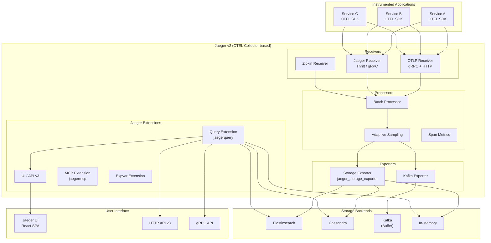
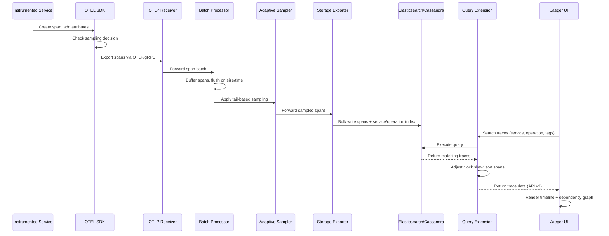
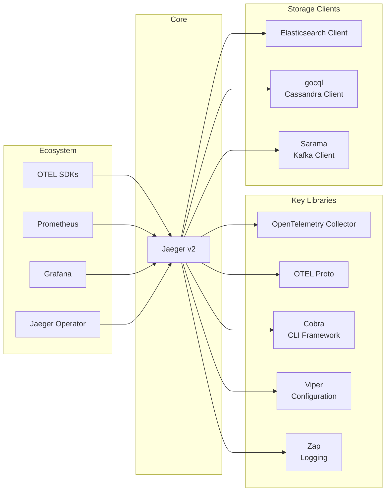

# Jaeger

> CNCF distributed tracing platform for monitoring and troubleshooting microservice architectures

| Metadata | |
|---|---|
| Repository | https://github.com/jaegertracing/jaeger |
| License | Apache-2.0 |
| Primary Language | Go |
| Category | Monitoring |
| Analyzed Release | `v2.15.1` (2026-02-09) |
| Stars (approx.) | 22,000+ |
| Generated by | Claude Opus 4.6 (Anthropic) |
| Generated on | 2026-02-09 |

## Overview

Jaeger is a distributed tracing system originally developed by Uber Technologies and now a graduated project in the Cloud Native Computing Foundation (CNCF). It is used for monitoring and troubleshooting microservice-based distributed systems, providing capabilities for distributed context propagation, distributed transaction monitoring, root cause analysis, service dependency analysis, and performance/latency optimization. Jaeger v2, the current major version, is built on top of the OpenTelemetry Collector framework, representing a significant architectural shift toward unified observability.

Problems it solves:

- Difficulty understanding request flow across dozens or hundreds of microservices in production
- Inability to identify performance bottlenecks and latency sources in distributed call chains
- Lack of visibility into service dependencies and their runtime behavior
- Complex debugging of intermittent failures that span multiple services
- Need for adaptive sampling to control tracing overhead in high-throughput production systems

Positioning:

Jaeger is one of the most widely adopted open-source distributed tracing backends, alongside Zipkin and Tempo. Compared to Zipkin, Jaeger offers more sophisticated adaptive sampling, a richer UI, and native integration with the OpenTelemetry ecosystem. Unlike Grafana Tempo (which relies on object storage for a schemaless backend), Jaeger supports multiple storage backends including Elasticsearch, Cassandra, and Kafka. Jaeger v2's alignment with OpenTelemetry positions it as the reference tracing backend for the OTEL ecosystem, leveraging the collector's pipeline model for extensibility.

## Architecture Overview

Jaeger v2 is built as a set of extensions and exporters on top of the OpenTelemetry Collector framework. The architecture follows a pipeline model where trace data flows through receivers, processors, and exporters. The main binary (cmd/jaeger) compiles the OpenTelemetry Collector with Jaeger-specific extensions for query/UI, storage, and sampling. This design replaces the previous multi-binary architecture (agent, collector, query, ingester) with a single configurable binary that can operate in different modes.

## Core Components

### Jaeger Main Binary (`cmd/jaeger/`)

- Responsibility: Assembling the OpenTelemetry Collector with Jaeger-specific components and providing the unified entry point
- Key files: `cmd/jaeger/main.go`, `cmd/jaeger/internal/extension/`, `cmd/jaeger/internal/exporters/storageexporter/`
- Design patterns: Composition over inheritance (assembling OTEL Collector components), Factory pattern for component creation, Configuration-driven behavior

The main Jaeger binary is built by composing OpenTelemetry Collector components with Jaeger-specific extensions and exporters. It registers Jaeger's custom factories (query extension, storage exporter, sampling processor) with the OTEL Collector builder, then delegates startup and lifecycle management to the collector framework. This approach enables Jaeger to leverage the collector's mature pipeline processing, configuration management, and health checking while adding tracing-specific functionality. The binary can operate in all-in-one mode (for development) or be configured for production with specific receiver/exporter combinations.

### Query Extension and API (`cmd/jaeger/internal/extension/jaegerquery/`)

- Responsibility: Serving the Jaeger UI, providing HTTP and gRPC APIs for trace retrieval, and computing service dependencies
- Key files: `cmd/jaeger/internal/extension/jaegerquery/`, `cmd/jaeger/internal/extension/jaegerquery/internal/apiv3/`, `cmd/jaeger/internal/extension/jaegerquery/internal/adjuster/`, `cmd/jaeger/internal/extension/jaegerquery/internal/ddg/`
- Design patterns: Extension interface from OTEL Collector, RESTful API with gRPC gateway, Adjuster chain for trace post-processing

The query extension implements Jaeger's read path. It exposes HTTP and gRPC endpoints for searching traces by service name, operation, tags, and duration. The API v3 provides a modern gRPC-first interface with HTTP/JSON mapping. Retrieved traces pass through an adjuster pipeline that normalizes clock skew, sorts spans, and computes derived data. The dependency graph (DDG) module analyzes stored traces to compute service-to-service dependency maps. The extension also serves the Jaeger UI, a React single-page application that visualizes trace timelines, service graphs, and comparison views.

### Storage Abstraction (`internal/storage/`)

- Responsibility: Providing a pluggable storage interface for writing and reading trace data across multiple backends
- Key files: `internal/storage/v2/`, `internal/storage/v1/`, `internal/storage/elasticsearch/`, `internal/storage/cassandra/`
- Design patterns: Repository pattern, Factory pattern for storage backend creation, Interface-based abstraction for backend independence

The storage layer defines interfaces for SpanWriter and SpanReader that all storage backends must implement. Jaeger v2 introduces a storage v2 interface aligned with OTEL data models, while maintaining backward compatibility with v1 interfaces through adapters in internal/storage/v1/. Elasticsearch storage uses bulk indexing for writes and JSON queries for reads, with configurable index strategies (daily, custom). Cassandra storage uses partition keys based on service name and operation for efficient querying. The storage abstraction also supports archive storage for moving old traces to cheaper storage tiers.

### Sampling (`internal/sampling/`)

- Responsibility: Implementing adaptive sampling strategies to control trace volume while maintaining representative coverage
- Key files: `internal/sampling/`, `cmd/jaeger/internal/extension/`
- Design patterns: Strategy pattern for sampling algorithms, Feedback loop for adaptive rate adjustment

Jaeger's sampling system supports multiple strategies: const (always/never sample), probabilistic (percentage-based), rate-limiting (traces per second), and remote (centrally configured). The adaptive sampling strategy dynamically adjusts sampling rates per service and operation to meet target throughput goals. When a service generates high traffic, the sampling rate decreases; when traffic is low, more traces are captured. The sampling configuration can be served remotely, allowing centralized control over sampling policies across all instrumented services without redeployment.

### Trace Processing Pipeline (`internal/converter/`, `internal/jptrace/`)

- Responsibility: Converting between trace data formats, adjusting trace data, and computing derived metrics
- Key files: `internal/converter/`, `internal/jptrace/`, `internal/uimodel/`
- Design patterns: Adapter pattern for format conversion, Pipeline pattern for trace transformations

The processing layer handles the diverse data formats in the tracing ecosystem. Converters translate between Jaeger's internal model, OpenTelemetry's proto format, and the legacy Thrift model. The jptrace module provides utilities for working with OTLP trace data in Jaeger-specific ways. The UI model translates internal representations into the JSON format consumed by the Jaeger UI. This layered conversion architecture allows Jaeger to accept traces from OTEL SDKs, legacy Jaeger clients, and Zipkin clients while maintaining a consistent internal representation.

## Data Flow

### Trace Collection and Query Flow

## Key Design Decisions

### 1. Rebuilding on OpenTelemetry Collector in v2

- Choice: Rewrite Jaeger v2 as extensions and exporters on top of the OpenTelemetry Collector framework, replacing the custom multi-binary architecture
- Rationale: Leverages the OTEL Collector's mature pipeline model, configuration system, and health monitoring. Eliminates the need to maintain a custom agent binary. Aligns Jaeger with the emerging standard for observability data collection. Reduces code duplication between Jaeger and the collector
- Trade-offs: Tight coupling to the OTEL Collector's API evolution. Users must learn OTEL Collector configuration patterns. Some Jaeger-specific optimizations may be harder to implement within the collector's abstractions. Migration from v1 requires configuration changes

### 2. Multiple Storage Backend Support

- Choice: Support pluggable storage backends (Elasticsearch, Cassandra, Kafka, memory) rather than mandating a single storage system
- Rationale: Different organizations have different infrastructure preferences and operational expertise. Elasticsearch offers powerful full-text search on trace attributes. Cassandra provides linear scalability. Kafka enables buffering and stream processing. In-memory serves development and testing
- Trade-offs: Each backend requires separate testing, maintenance, and performance optimization. Feature parity across backends is not always achievable. Users must make an informed choice among backends, adding operational complexity

### 3. Adaptive Sampling

- Choice: Implement an adaptive sampling algorithm that dynamically adjusts per-service, per-operation sampling rates
- Rationale: Uniform sampling either over-samples low-traffic operations or under-samples high-traffic ones. Adaptive sampling ensures representative coverage across all services while keeping total trace volume manageable in production
- Trade-offs: Adds complexity to the sampling configuration and decision pipeline. Adaptive rates may take time to converge after traffic pattern changes. Centralized sampling configuration requires an additional communication channel between the collector and instrumented services

### 4. Single Binary Deployment Model (v2)

- Choice: Consolidate agent, collector, query, and ingester into a single configurable binary
- Rationale: Simplifies deployment, especially for smaller installations. Reduces the number of binaries to build, distribute, and manage. Users can still scale components independently by running multiple instances with different configurations
- Trade-offs: Single binary is larger than individual specialized binaries. Configuration complexity increases as all options are in one place. Resource allocation for different components within a single process requires careful tuning

### 5. gRPC-first API Design

- Choice: Design the v3 API as gRPC with HTTP/JSON transcoding rather than REST-first
- Rationale: gRPC provides strongly-typed contracts via protobuf, efficient binary serialization, and bidirectional streaming for real-time trace tailing. HTTP/JSON transcoding ensures backward compatibility and browser accessibility
- Trade-offs: gRPC tooling is less familiar to some users compared to REST. Protobuf schema changes require regeneration of client code. Browser-based clients cannot use gRPC directly without a proxy (grpc-web)

## Dependencies

## Testing Strategy

Jaeger employs a thorough testing strategy covering unit, integration, and end-to-end scenarios.

Unit tests: Go unit tests colocated with source files throughout the codebase. The project follows Go conventions with _test.go files. Mock-based testing is used extensively for storage interfaces, HTTP handlers, and gRPC services. The `internal/metricstest/` package provides utilities for testing metric emissions.

Integration tests: Storage integration tests in `internal/storage/integration/` verify read/write operations against real Elasticsearch and Cassandra instances. These tests run against containerized databases using Docker. Cross-component integration tests verify the full pipeline from receiver through storage to query.

CI/CD: GitHub Actions runs the full test suite including linting (golangci-lint), unit tests, integration tests with multiple storage backends, and Docker image builds. The CI matrix covers multiple Go versions and operating systems. End-to-end tests verify the complete trace lifecycle from instrumentation through visualization. The project uses Crossdock for cross-language integration testing.

## Key Takeaways

1. Building on existing frameworks accelerates development: Jaeger v2's decision to build on the OpenTelemetry Collector framework demonstrates how leveraging mature infrastructure can dramatically reduce maintenance burden. Rather than maintaining a custom pipeline, Jaeger inherits the collector's configuration, health checking, and pipeline management while focusing on tracing-specific logic.

2. Adaptive sampling is essential at scale: Fixed-rate sampling produces biased trace data in heterogeneous microservice environments. Jaeger's adaptive sampling algorithm provides a practical solution to the tension between trace completeness and resource consumption, a pattern relevant to any high-volume data collection system.

3. Storage abstraction enables deployment flexibility: The pluggable storage backend pattern allows organizations to use their existing infrastructure investment. This design has proven its value across the project's lifetime as storage technologies have evolved and user preferences have shifted.

4. Single binary simplifies operations without sacrificing scalability: The consolidated binary approach in v2 shows that deployment simplicity and horizontal scalability are not mutually exclusive. By making component selection configuration-driven rather than binary-driven, users can start simple and scale individually as needed.

## References

- [Jaeger Official Documentation](https://www.jaegertracing.io/docs/)
- [Jaeger Architecture - Red Hat](https://docs.redhat.com/en/documentation/openshift_container_platform/4.5/html/jaeger/jaeger-architecture-1)
- [Understanding Jaeger - Uptrace](https://uptrace.dev/glossary/what-is-jaeger)
- [Jaeger GitHub Repository](https://github.com/jaegertracing/jaeger)
- [OpenTelemetry Collector Documentation](https://opentelemetry.io/docs/collector/)
- [Jaeger Guide - Better Stack](https://betterstack.com/community/guides/observability/jaeger-guide/)
