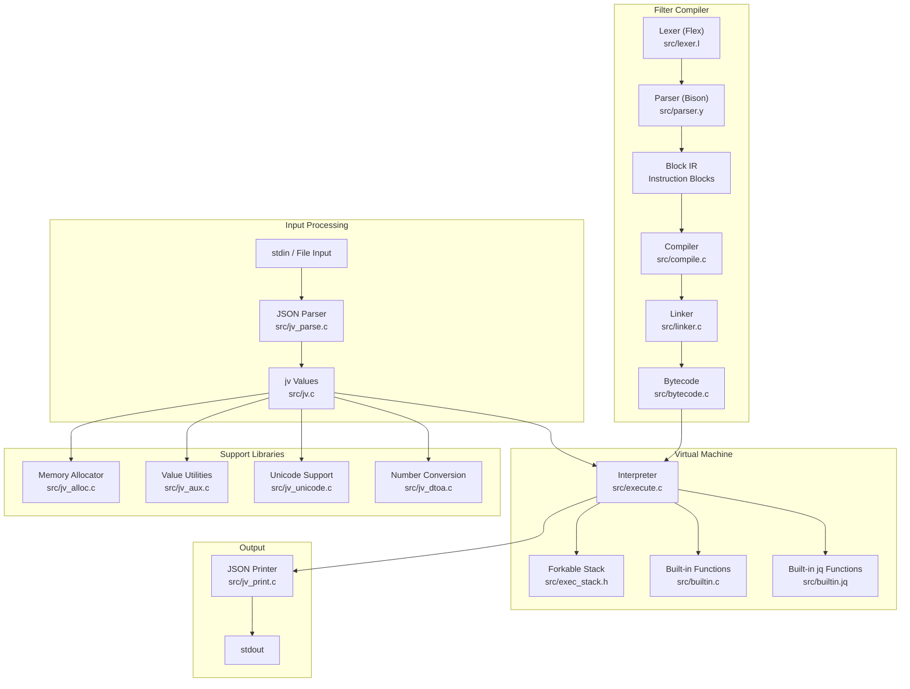
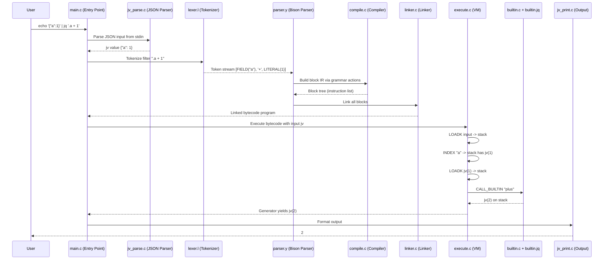
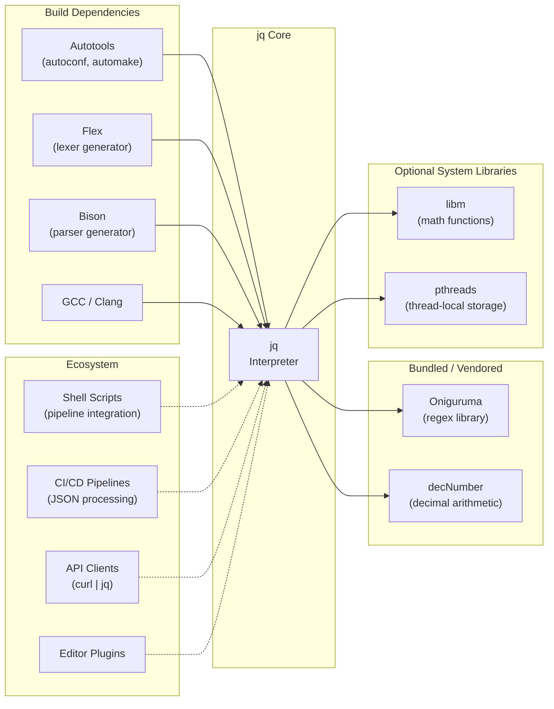

# jq

> Command-line JSON processor

| Metadata | |
|---|---|
| Repository | https://github.com/jqlang/jq |
| License | MIT (with CC-BY-3.0 for docs) |
| Primary Language | C |
| Category | CLI Tool |
| Analyzed Release | `jq-1.8.1` (2025-07-01) |
| Stars (approx.) | 33,000+ |
| Generated by | Claude Opus 4.6 (Anthropic) |
| Generated on | 2026-02-09 |

## Overview

jq is a lightweight command-line JSON processor, often described as "sed for JSON." It provides a powerful functional query language for filtering, transforming, and restructuring JSON data. jq reads JSON input from stdin or files, applies a user-specified filter expression, and outputs the result as formatted JSON. The filter language supports path expressions, array operations, conditionals, string interpolation, user-defined functions, and a module system, making it a complete functional programming language optimized for JSON manipulation.

Problems it solves:

- Extracting specific fields from JSON API responses or log files requires either writing scripts in a general-purpose language or manually parsing text, both of which are disproportionately complex for simple queries
- Shell pipelines that process structured data lose type information when using traditional text processing tools (grep, sed, awk), leading to fragile scripts
- JSON data often needs to be restructured (renamed keys, nested-to-flat transformation, array aggregation) as part of data engineering pipelines or DevOps automation
- Pretty-printing, validating, and exploring large JSON documents from the command line has no native tool in most operating systems

Positioning:

jq is the de facto standard for command-line JSON processing, installed by default or easily available on virtually every Unix-like system. Alternatives include `jaq` (Rust reimplementation focused on correctness and performance), `gojq` (Go reimplementation with YAML support), `fx` (interactive JSON viewer), and `yq` (YAML/XML/JSON processor). jq's advantages are its maturity, widespread availability, comprehensive filter language, and extensive documentation. While `jaq` and `gojq` aim for compatibility with jq's language, jq remains the reference implementation that defines the language semantics.

## Architecture Overview

jq follows a classic interpreter pipeline: input text is parsed into an internal JSON value representation (jv), filter expressions are tokenized (flex), parsed (bison) into an AST, compiled into bytecode, and executed by a stack-based virtual machine with backtracking support. The jv (JSON value) type system is the foundation, providing reference-counted immutable values for null, booleans, numbers, strings, arrays, and objects. The compiler translates filter expressions through an intermediate block representation before emitting bytecode. The VM uses a forkable stack to support jq's generator semantics, where filters can produce zero, one, or many outputs for each input.

## Core Components

### JSON Value System (`src/jv.c`, `src/jv.h`)

- Responsibility: Provides the core immutable, reference-counted JSON value type used throughout jq for all data representation
- Key files: `src/jv.c`, `src/jv.h`, `src/jv_private.h`, `src/jv_aux.c`, `src/jv_alloc.c`
- Design patterns: Copy-on-write (shared immutable values with refcounting), Tagged union (jv type encodes kind + value), Arena allocation

The `jv` type is the fundamental data structure in jq. It represents all JSON values (null, boolean, number, string, array, object) using a compact tagged representation. Small values like null, booleans, and small integers are stored inline (no heap allocation). Strings, arrays, and objects are reference-counted and use copy-on-write semantics: when a modification is requested, the value is copied only if its reference count is greater than one, otherwise it is mutated in place. This provides efficient value semantics for the functional language while avoiding excessive copying. Arrays use a dynamic buffer with amortized O(1) append. Objects use a hash table with sorted key order for deterministic output. The `jv_aux.c` file provides higher-level operations like path access (`jv_getpath`), recursive descent, and set operations.

### Compiler (`src/compile.c`, `src/linker.c`)

- Responsibility: Transforms parsed filter expressions into executable bytecode through an intermediate block representation
- Key files: `src/compile.c`, `src/linker.c`, `src/compile.h`, `src/opcode_list.h`
- Design patterns: Multi-pass compilation, Block-based IR (intermediate representation), Tree-structured linking

The compiler operates in two stages. First, the parser (generated by Bison from `src/parser.y`) calls functions in `compile.c` to build a block-based intermediate representation. Blocks are lists of instructions that can contain sub-blocks for nested expressions and function definitions. Each instruction has an opcode (defined in `src/opcode_list.h`) and operands. The block representation allows optimizations and transformations before bytecode emission. Second, the linker (`src/linker.c`) resolves function references, handles module imports, and links all block trees into a flat instruction sequence. Finally, the blocks are compiled into a linear bytecode array of 16-bit values. The bytecode format includes opcodes like LOADK (load constant), DUP, POP, CALL_BUILTIN, SUBEXP_BEGIN/END, FORK, JUMP, and BACKTRACK.

### Virtual Machine / Interpreter (`src/execute.c`)

- Responsibility: Executes compiled bytecode against JSON input values, implementing jq's generator semantics through a forkable stack
- Key files: `src/execute.c`, `src/exec_stack.h`, `src/bytecode.c`, `src/bytecode.h`
- Design patterns: Stack-based VM, Backtracking via forkable stack, Generator pattern (multiple outputs per input)

The interpreter in `execute.c` is a stack-based virtual machine that processes bytecodes sequentially. The most distinctive feature is its forkable stack (`exec_stack.h`), which implements jq's generator semantics. In jq, every filter is a generator that can produce zero, one, or many outputs. For example, `.[]` iterates over an array and produces each element as a separate output. The forkable stack enables this by allowing the VM to save its state (stack fork) before a potentially multi-valued operation, produce one output, and then restore the state to produce the next output. This is essentially backtracking: when the consumer requests the next value, the VM backtracks to the saved fork point and continues execution from there. The FORK and BACKTRACK opcodes manage this mechanism. Built-in functions (both C-implemented in `src/builtin.c` and jq-implemented in `src/builtin.jq`) are invoked through the CALL_BUILTIN opcode.

### Parser (`src/parser.y`, `src/lexer.l`)

- Responsibility: Tokenizes and parses jq filter expressions into the internal block representation
- Key files: `src/parser.y`, `src/lexer.l`, `src/parser.c` (generated), `src/lexer.c` (generated), `src/jq_parser.h`
- Design patterns: Flex/Bison parser generator, LALR(1) grammar, Syntax-directed translation

The parser uses the traditional Unix toolchain of Flex (lexer generator) and Bison (parser generator). The lexer (`src/lexer.l`) tokenizes the input filter string into tokens like IDENT, LITERAL, FIELD, and operators. The parser (`src/parser.y`) defines the grammar for jq expressions using Bison's LALR(1) parsing algorithm. Rather than building an explicit AST, the parser uses syntax-directed translation: each grammar rule directly calls `compile.c` functions to build the block IR as the expression is parsed. This means parsing and IR construction happen in a single pass. The grammar handles operator precedence, pipe expressions (`|`), try-catch, if-then-else, reduce, foreach, label-break, function definitions, string interpolation, and the full jq expression syntax.

### Built-in Functions (`src/builtin.c`, `src/builtin.jq`)

- Responsibility: Implements the standard library of functions available in jq expressions
- Key files: `src/builtin.c`, `src/builtin.h`, `src/builtin.jq`
- Design patterns: Function table (C function pointers), Self-hosting (jq functions defined in jq)

jq's built-in functions are split between C implementations and jq implementations. Performance-critical and system-level functions are implemented in C (`src/builtin.c`): arithmetic operations, string manipulation (split, join, test, match, capture), type checking (type, length, keys, values, has), array operations (sort, group_by, unique, flatten, range), I/O operations (input, debug, stderr), and path operations (path, getpath, setpath, delpaths). Higher-level utility functions that can be expressed in jq itself are defined in `src/builtin.jq`: these include `map`, `select`, `empty`, `recurse`, `env`, `transpose`, `limit`, `until`, `while`, `repeat`, and many more. The `src/builtin.jq` file is compiled into the jq binary and loaded at startup, forming the standard prelude.

## Data Flow

### Processing a JSON Filter Expression

## Key Design Decisions

### 1. Generator Semantics with Backtracking

- Choice: Every jq filter is a generator that can produce zero, one, or many outputs, implemented via a forkable execution stack
- Rationale: Generator semantics provide a natural way to express iteration, filtering, and branching in a streaming fashion. The expression `.[] | select(. > 2)` naturally iterates over an array, filters elements, and produces each result one at a time without materializing intermediate arrays. This composability is central to jq's power.
- Trade-offs: The forkable stack is complex to implement and debug. Backtracking can lead to exponential blowup in pathological cases (deeply nested alternations). The execution model is harder to understand than simple function calls, making error messages and debugging challenging.

### 2. Reference-Counted Immutable Values

- Choice: Use reference-counted, copy-on-write values rather than mutable data structures or a tracing garbage collector
- Rationale: Reference counting provides deterministic memory management in a C codebase without requiring a GC pause. Copy-on-write avoids the overhead of deep copying on every operation while maintaining value semantics for the functional language. When a value's refcount is 1, mutations can be performed in place, avoiding copies in the common case.
- Trade-offs: Reference cycles would cause memory leaks, but jq's value model (JSON) does not support cyclic references, so this is not an issue in practice. The refcount increment/decrement overhead adds cost to every value operation. Manual refcount management in C is error-prone and has been a source of bugs.

### 3. Flex/Bison for Parsing

- Choice: Use the traditional Flex lexer generator and Bison parser generator for the filter language
- Rationale: Flex and Bison are mature, well-understood tools with decades of optimization. They produce efficient parsers with excellent error recovery. The LALR(1) grammar formalism provides clear operator precedence handling. Syntax-directed translation (building IR directly in grammar actions) eliminates the need for a separate AST.
- Trade-offs: Requires Flex and Bison as build dependencies (though generated files are checked into the repository). The grammar file (`parser.y`) mixes syntax and compilation logic, making it harder to modify the language syntax independently of the compilation strategy. Error messages from Bison-generated parsers can be cryptic.

### 4. Bytecode VM Rather Than AST Interpretation

- Choice: Compile filter expressions to bytecode and execute them on a virtual machine rather than walking an AST
- Rationale: Bytecode interpretation is faster than AST walking due to better cache locality (compact instruction stream vs. scattered tree nodes). The bytecode format enables the forkable stack mechanism cleanly (fork and backtrack are simple opcode operations). Bytecode is also easier to serialize for potential future caching.
- Trade-offs: Adds the complexity of a compiler and bytecode format. Debugging is harder because the executing code is not directly visible in the source filter expression. The instruction set must be carefully designed to support all language features including generators and closures.

### 5. Single-Pass Syntax-Directed Translation

- Choice: Build the compiler IR directly during parsing rather than constructing an explicit AST first
- Rationale: Eliminates an entire compilation phase (AST construction and traversal). Reduces memory usage since no AST needs to be retained. The jq language is simple enough that a single pass suffices for compilation.
- Trade-offs: Makes it harder to implement whole-program optimizations that require seeing the complete program before generating code. Error messages must be generated during parsing, limiting the quality of diagnostics. Adding new language features may require restructuring both the grammar and the IR construction simultaneously.

## Dependencies

## Testing Strategy

jq has a comprehensive test suite focused on correctness of the filter language and edge cases in JSON handling.

Unit tests: The `src/jq_test.c` file provides a C-level test harness that runs filter expressions against known inputs and compares outputs. The primary test file `tests/jq.test` contains hundreds of test cases in a simple format: each test is a filter expression, an input, and the expected output(s), separated by newlines. This format makes it easy to add regression tests. Additional test files cover specific features: `tests/optional.test` for optional features, `tests/onig.test` for regex operations using Oniguruma, `tests/base64.test` for base64 encoding/decoding, and `tests/uri.test` for URI encoding.

Integration tests: Shell-based integration tests (`tests/shtest`, `tests/jqtest`, `tests/mantest`) verify the CLI behavior, including argument parsing, file input, raw output modes, and error handling. The `tests/modules/` directory contains test cases for the module system, with sample `.jq` module files that test import resolution, function scoping, and data imports. Fuzz testing files (`tests/jq_fuzz_*.c/cpp`) provide fuzz targets for testing the parser and executor with random inputs.

CI/CD: jq uses GitHub Actions (`.github/`) for CI, building and testing on Linux, macOS, and Windows. The CI pipeline builds with both GCC and Clang, runs the full test suite, and verifies that the generated parser/lexer files are up to date. The build uses Autotools (`configure.ac`, `Makefile.am`) as its primary build system, with CMake support also available. Cross-compilation is tested for multiple architectures.

## Key Takeaways

1. Generator semantics enable composable data transformations: jq's decision to make every filter a generator that can produce multiple outputs is what makes the pipe operator (`|`) so powerful. Each filter composes with the next through the stream of values, enabling complex transformations to be expressed as simple pipelines. This pattern is applicable to any data processing DSL where operations may produce zero, one, or many results.

2. Forkable stacks for backtracking execution: The forkable stack mechanism in jq's VM is an elegant solution for implementing generator/backtracking semantics in a stack-based interpreter. Rather than using coroutines or continuations, the stack itself can be forked and restored, keeping the implementation in pure C without platform-specific features. This technique is useful for any interpreter that needs to support non-deterministic execution.

3. Self-hosting standard library functions: jq's approach of implementing higher-level standard library functions (map, select, recurse) in jq itself (`src/builtin.jq`) while keeping performance-critical operations in C is an effective stratification strategy. It makes the standard library more maintainable, serves as documentation for the language, and ensures that user-defined functions have the same expressive power as built-ins.

4. Simple test format enables rapid test development: jq's test file format (filter, input, expected output on consecutive lines) has near-zero overhead for adding new test cases. This low-friction testing approach has resulted in hundreds of tests covering edge cases and regressions. Any project with a clear input-output relationship can benefit from this kind of table-driven test format.

## References

- [jq Official Website](https://jqlang.org/)
- [jq 1.8 Manual](https://jqlang.org/manual/)
- [jq GitHub Repository](https://github.com/jqlang/jq)
- [Internals: the compiler - jq Wiki](https://github.com/jqlang/jq/wiki/Internals:-the-compiler)
- [Internals: introduction - jq Wiki](https://github.com/jqlang/jq/wiki/Internals:-introduction)
- [jq DeepWiki](https://deepwiki.com/jqlang/jq)
- [jq Cookbook](https://github.com/stedolan/jq/wiki/Cookbook)
