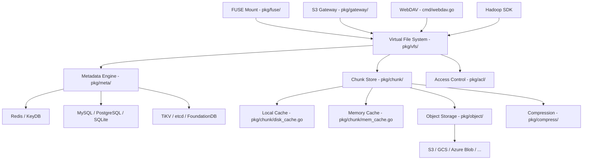
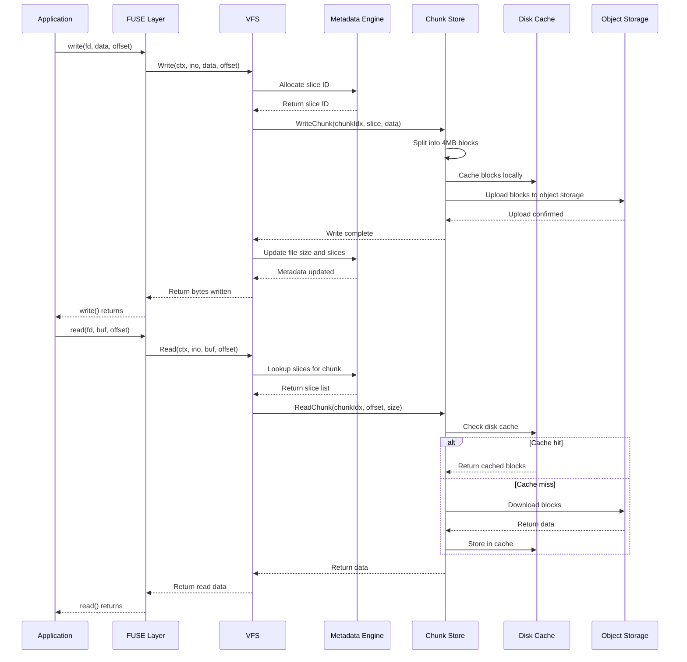
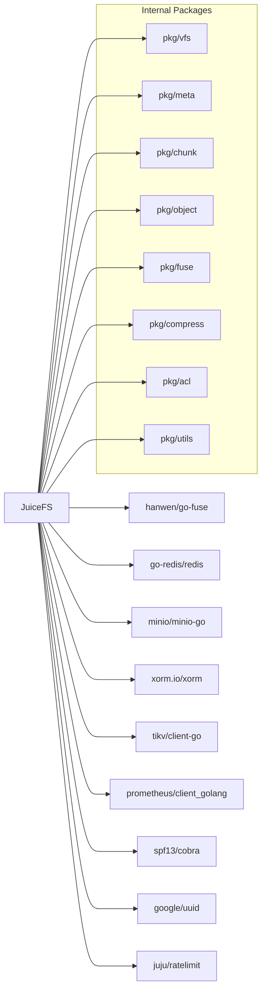

# JuiceFS Architecture Report

- Generated by: Claude Opus 4.6 (Anthropic)
- Generated on: 2026-02-08
- Category: Database
- Repository: [juicedata/juicefs](https://github.com/juicedata/juicefs)

---

## Overview

JuiceFS is a high-performance, POSIX-compatible distributed filesystem built on top of object storage and a metadata engine. It decouples metadata from data, storing metadata in engines like Redis, MySQL, SQLite, TiKV, or etcd, while persisting file data in any S3-compatible object storage, HDFS, or local disk.

| Attribute         | Value                                      |
|-------------------|--------------------------------------------|
| Language          | Go                                         |
| License           | Apache License 2.0                         |
| Stars             | 13,187                                     |
| Latest Release    | v1.3.1 (2025-12-02)                        |
| Description       | Distributed POSIX file system built on top of Redis and S3 |

JuiceFS has passed all 8,813 compatibility tests in pjdfstest, demonstrating full POSIX compliance. It supports symbolic links, mmap, fallocate, file locking, and extended attributes, making it a drop-in replacement for traditional filesystems in cloud-native environments.

---

## Architecture Overview

---

## Core Components

### 1. Virtual File System Layer (pkg/vfs/vfs.go)

The VFS layer is the central abstraction that translates filesystem operations into metadata and data operations. Key types from `pkg/vfs/vfs.go`:

- `Ino = meta.Ino`: Inode number type alias
- `Attr = meta.Attr`: File attribute type alias
- `rootID = 1`: Root inode constant
- `maxName = meta.MaxName` (255): Maximum filename length
- `maxSymlink = meta.MaxSymlink` (4096): Maximum symlink target length
- `maxFileSize = meta.ChunkSize << 31`: Maximum file size (~128 PB)

The VFS supports multiple access interfaces:
- `FuseOptions` struct: Configures FUSE mount behavior including `AllowOther`, `MaxBackground`, `MaxWrite`, `MaxReadAhead`, `EnableLocks`, `EnableAcl`, `EnableWriteback`, and many other options
- `Port` struct: Exposes Prometheus, debug, Consul, and Pyroscope agents for observability

### 2. Metadata Engine (pkg/meta/)

The metadata engine is a pluggable abstraction supporting multiple backends:

- `interface.go`: Defines the core `Meta` interface and constants
  - `ChunkBits = 26`, `ChunkSize = 1 << 26` (64 MB): Fundamental chunk size
  - Inode types: `TypeFile=1`, `TypeDirectory=2`, `TypeSymlink=3`, `TypeFIFO=4`, `TypeBlockDev=5`, `TypeCharDev=6`, `TypeSocket=7`
  - Operation codes: `DeleteSlice=1000`, `CompactChunk=1001`, `Rmr=1002`, `FillCache=1004`, `Clone=1006`
  - `RootInode Ino = 1`, `TrashInode Ino = 0x7FFFFFFF10000000`
- `base.go`: Common metadata logic including the `engine` interface for backend implementations
  - Internal constants: `inodeBatch = 1024`, `sliceIdBatch = 4096`, `nlocks = 1024`
  - `DirBatchNum`: Backend-specific directory batch sizes (redis: 4096, kv: 4096, db: 40960)
- `redis.go`, `redis_lock.go`, `redis_csc.go`: Redis backend with client-side caching
- `sql.go`, `sql_mysql.go`, `sql_pg.go`, `sql_sqlite.go`: SQL backend implementations
- `tkv.go`, `tkv_badger.go`, `tkv_etcd.go`, `tkv_fdb.go`: Transactional KV backends (TiKV, BadgerDB, etcd, FoundationDB)
- `config.go`: Filesystem configuration stored in metadata
- `quota.go`: Directory and filesystem quota management
- `slice.go`: Slice allocation and management

### 3. Chunk Store (pkg/chunk/)

The chunk store manages the data path, splitting files into chunks and blocks:

- `cached_store.go`: Central data store implementation
  - `chunkSize = 1 << 26` (64 MB): Matches metadata chunk size
  - `pageSize = 1 << 16` (64 KB): Internal page size
  - `SlowRequest = 10 seconds`: Threshold for slow request logging
  - `rSlice` struct: Represents a slice for reading, with `blockSize(indx int)`, `key(indx int)`, and `keys()` methods
  - Key format: `chunks/{id/1000000}/{id/1000}/{id}_{indx}_{size}` (or hash-prefixed variant)
- `disk_cache.go`, `disk_cache_state.go`: Persistent local disk cache for frequently accessed data
- `mem_cache.go`: In-memory cache for hot blocks
- `prefetch.go`: Predictive prefetching of upcoming blocks
- `singleflight.go`: Deduplication of concurrent requests for the same block
- `page.go`: Page-level memory management
- `metrics.go`: Prometheus metrics for cache hit rates, latencies, and throughput
- `cache_eviction.go`: Cache eviction policies

### 4. Object Storage Abstraction (pkg/object/)

The object storage layer provides a unified interface over 30+ storage backends:

- `interface.go` and `object_storage.go`: Core `ObjectStorage` interface with `Get`, `Put`, `Delete`, `List` operations
- Cloud providers: `cos.go` (Tencent COS), `gs.go` (Google Cloud Storage), `azure.go` (Azure Blob), `obs.go` (Huawei OBS), `bos.go` (Baidu BOS), `ibmcos.go` (IBM COS), `ks3.go` (Kingsoft KS3), `oos.go` (CTYun OOS), `eos.go` (EOS)
- S3-compatible: `minio.go` (MinIO/generic S3)
- Distributed storage: `ceph.go` (Ceph RADOS), `gluster.go` (GlusterFS), `hdfs.go` (HDFS)
- Network storage: `nfs.go`, `cifs.go` (SMB/CIFS)
- Specialized: `b2.go` (Backblaze B2), `bunny.go` (Bunny CDN), `dragonfly.go` (Dragonfly P2P), `etcd.go` (etcd for small deployments)
- Local: `file.go` with platform-specific variants (`file_darwin.go`, `file_linux.go`, `file_windows.go`)
- Security: `encrypt.go` (client-side encryption), `checksum.go` (data integrity)
- `mem.go`: In-memory backend for testing

### 5. FUSE and Access Interfaces (pkg/fuse/, cmd/)

- `pkg/fuse/fuse.go`: Core FUSE integration using go-fuse (low-level API, same as kernel VFS)
- `pkg/fuse/fuse_linux.go`, `pkg/fuse/fuse_darwin.go`: Platform-specific FUSE implementations
- `pkg/fuse/gidcache.go`: Group ID caching for permission checks
- `pkg/fuse/context.go`: Request context management
- `pkg/gateway/gateway.go`: S3-compatible gateway interface
- `cmd/mount.go`, `cmd/mount_unix.go`, `cmd/mount_windows.go`: Mount command with platform handling
- `cmd/gateway.go`: S3 gateway command
- `cmd/webdav.go`: WebDAV access interface
- `cmd/sync.go`: Data synchronization between storage systems
- `cmd/warmup.go`: Cache warming utility

---

## Data Flow

---

## Key Design Decisions

### 1. Metadata-Data Separation

The fundamental design decision is decoupling metadata from data. Metadata (directory structure, file attributes, chunk mappings) is stored in a fast transactional database (Redis, MySQL, TiKV, etc.), while file data is stored in cheap, scalable object storage (S3, etc.). This enables independent scaling of metadata throughput and data capacity. Metadata operations (ls, stat, mkdir) hit the fast metadata engine, while large sequential reads and writes go to object storage.

### 2. Hierarchical Data Chunking

Files are organized in a three-level hierarchy:
- Chunks: 64 MB maximum, aligned to file offsets (`ChunkSize = 1 << 26`)
- Slices: Variable-length, representing individual write operations within a chunk
- Blocks: Fixed 4 MB default, the unit of object storage upload/download

This design allows efficient handling of both sequential and random I/O. Slices enable copy-on-write semantics for writes, while the fixed block size optimizes object storage operations. The `CompactChunk` operation (code 1001) merges small slices into larger ones to reduce metadata overhead.

### 3. Pluggable Metadata Backends

Rather than mandating a single metadata store, JuiceFS supports multiple backends via the `engine` interface in `pkg/meta/base.go`. Each backend has different performance characteristics:
- Redis: Lowest latency, suitable for metadata-intensive workloads
- SQL (MySQL/PostgreSQL): Better durability and familiarity for operations teams
- TiKV/FoundationDB: Horizontal scalability for very large namespaces
- SQLite: Single-node embedded mode for testing and small deployments
- BadgerDB: Embedded Go KV store for self-contained deployments

### 4. Multi-Layer Caching

JuiceFS implements aggressive caching at multiple levels:
- Memory cache (`mem_cache.go`): Hot blocks in RAM
- Disk cache (`disk_cache.go`): Persistent local SSD cache with eviction policies
- Prefetching (`prefetch.go`): Predictive read-ahead for sequential access patterns
- Singleflight (`singleflight.go`): Deduplication of concurrent reads for the same block
- Client-side caching in metadata (`redis_csc.go`): Reduces metadata round-trips

This multi-layer approach is essential because object storage typically has 10-100ms latency, which is unacceptable for POSIX filesystem operations.

### 5. FUSE Low-Level API

JuiceFS uses the FUSE low-level API (via go-fuse) rather than the high-level API. The low-level API maps directly to kernel VFS operations, providing control over inode management, capability handling, and memory management. This enables features like writeback caching (`EnableWriteback`), kernel-level read caching (`ExplicitDataCacheControl`), and inode caching (`RememberInodes`) that are not available through the high-level API.

---

## Dependencies

Notable external dependencies:
- `hanwen/go-fuse`: Low-level FUSE bindings for Go, providing direct kernel VFS interaction
- `go-redis/redis`: Redis client for the Redis metadata backend
- `minio/minio-go`: S3-compatible client used as the foundation for most object storage backends
- `xorm.io/xorm`: ORM for SQL metadata backends (MySQL, PostgreSQL, SQLite)
- `tikv/client-go`: TiKV distributed KV client
- `juju/ratelimit`: Token bucket rate limiting for upload/download bandwidth control
- `prometheus/client_golang`: Metrics exposition for monitoring
- `google/uuid`: UUID generation for session and request tracking

---

## Testing Strategy

JuiceFS employs a thorough testing approach:

- POSIX Compliance Tests: Full pjdfstest suite (8,813 tests) verifying POSIX filesystem semantics including edge cases around permissions, timestamps, hard links, and special files
- Unit Tests: Each package contains `_test.go` files for component-level testing
- Integration Tests: Multi-backend testing against Redis, MySQL, PostgreSQL, SQLite, TiKV, and various object storage providers
- Benchmark Suite: `cmd/bench.go` provides filesystem benchmarking, `cmd/objbench.go` benchmarks object storage throughput, and `cmd/mdtest.go` tests metadata performance
- Fsck Utility: `cmd/fsck.go` performs filesystem consistency checks, validating that metadata and data are in sync
- Debug Tools: `cmd/debug.go` and `cmd/info.go` provide runtime inspection capabilities
- Load Testing: `cmd/load.go` and `cmd/clone.go` test data migration and replication
- Cross-Platform Testing: Platform-specific files (`_darwin.go`, `_linux.go`, `_windows.go`) ensure compatibility across operating systems

---

## Key Takeaways

1. JuiceFS demonstrates that a fully POSIX-compliant distributed filesystem can be built by composing existing cloud services (object storage + metadata database). The metadata-data separation architecture enables independent scaling and allows users to choose the best metadata engine for their workload characteristics.

2. The multi-layer caching strategy (memory -> disk -> prefetch -> singleflight) is essential for bridging the latency gap between POSIX filesystem expectations (microseconds) and object storage reality (milliseconds). The cache architecture contributes more to perceived performance than the underlying storage speed.

3. Supporting 30+ object storage backends through a single `ObjectStorage` interface in `pkg/object/` makes JuiceFS deployable across virtually any cloud or on-premises environment. This breadth of backend support is a significant competitive advantage over more specialized distributed filesystems.

4. The three-level data hierarchy (chunk -> slice -> block) is well-designed for cloud-native workloads: chunks provide logical alignment, slices enable efficient copy-on-write, and blocks match the optimal I/O size for object storage APIs (typically 1-8 MB PUT/GET operations).

5. JuiceFS's approach of using the FUSE low-level API (rather than the high-level API or a kernel module) balances performance with portability. While it cannot match kernel-native filesystem performance, it avoids the maintenance burden of kernel modules and works across Linux, macOS, and Windows with platform-specific optimizations.

---

## References

- [GitHub Repository](https://github.com/juicedata/juicefs)
- [JuiceFS Architecture Documentation](https://juicefs.com/docs/community/architecture/)
- [JuiceFS Internals](https://juicefs.com/docs/community/internals/)
- [JuiceFS Official Website](https://juicefs.com/en/)
- [Architecture Markdown on GitHub](https://github.com/juicedata/juicefs/blob/main/docs/en/introduction/architecture.md)
- [DFS Architecture Comparison - InfoQ](https://www.infoq.com/articles/dfs-architecture-comparison/)
- [POSIX Compliance Battle of Cloud File Systems](https://s.juicefs.com/en/blog/engineering/cloud-file-system-posix-compliant)
- [JuiceFS for Kubernetes Deployments](https://medium.com/@lipton.bjit/juicefs-a-superior-file-system-for-robust-kubernetes-deployments-compared-to-alternatives-59a13568582b)
