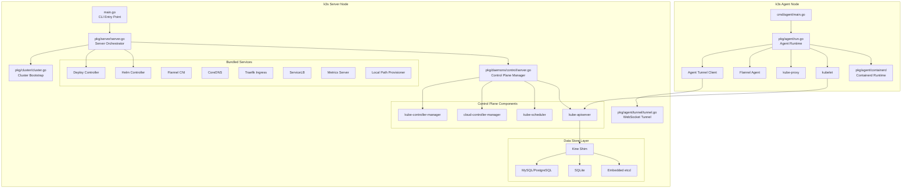
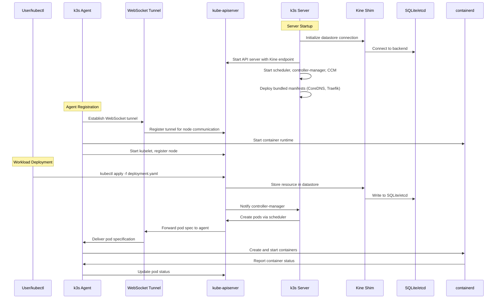
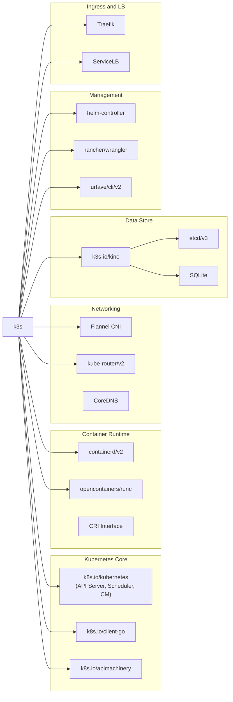

# k3s

> Lightweight, fully conformant Kubernetes distribution for resource-constrained environments

| Metadata | |
|---|---|
| Repository | https://github.com/k3s-io/k3s |
| License | Apache License 2.0 |
| Primary Language | Go |
| Category | Container Orchestration |
| Analyzed Release | `v1.32.11+k3s3` (2026-02-03) |
| Stars (approx.) | 32,000+ |
| Generated by | Claude Opus 4.6 (Anthropic) |
| Generated on | 2026-02-08 |

## Overview

k3s is a lightweight, fully conformant Kubernetes distribution designed for resource-constrained environments including edge computing, IoT devices, CI/CD pipelines, and ARM-based systems. Created by Rancher Labs (now part of SUSE), k3s packages the entire Kubernetes control plane into a single binary under 100MB. It replaces etcd with an embedded SQLite database by default (with optional etcd, MySQL, and PostgreSQL support via Kine), bundles containerd as the default container runtime, and integrates essential components like CoreDNS, Flannel, Traefik, and a local-path storage provisioner. The project consolidates what are normally separate Kubernetes processes into a unified server or agent binary, dramatically reducing memory footprint and operational complexity.

---

## Architecture Overview

---

## Core Components

### 1. Server Orchestrator (pkg/server/server.go)

The server orchestrator is the central coordination point for the k3s control plane. It implements the PrepareServer() and StartServer() functions that manage the lifecycle of all server-side components. PrepareServer() sets up data directories, configures proxy settings, prepares TLS certificates, and initializes HTTP request handlers. StartServer() launches the Kubernetes control plane components, runs startup hooks, starts controllers, and writes the admin kubeconfig. The server also manages the startup order: it waits for the API server to become ready before launching controllers like the Helm controller and deploy controller via the startOnAPIServerReady() function. The server uses wrangler for leader election, ensuring that only one server instance runs active controllers in HA configurations.

Key functions:
- PrepareServer() - Initializes directories, certificates, and HTTP handlers
- StartServer() - Starts control plane, hooks, and controllers
- runControllers() - Creates server context and starts all k3s-specific controllers
- stageFiles() - Deploys bundled manifests (CoreDNS, Traefik, metrics-server)

### 2. Control Plane Manager (pkg/daemons/control/server.go)

The control plane manager is responsible for starting and configuring the individual Kubernetes control plane components within the single k3s process. The Server() function orchestrates the startup of the API server, scheduler, controller manager, and cloud controller manager, with each component being independently disableable via configuration flags (DisableAPIServer, DisableScheduler, DisableControllerManager). Each component is started through the executor interface, which allows the components to run either embedded (in-process) or external. The Prepare() function handles bootstrap data loading from the datastore, sets up the WebSocket tunnel server for agent communication, and configures the stub authenticator with password file and client CA support.

Key functions:
- Prepare() - Loads bootstrap data, configures tunnel, sets up authentication
- Server() - Starts API server, scheduler, controller manager, and CCM
- apiServer() - Configures and launches kube-apiserver with k3s-specific defaults
- controllerManager() - Configures kube-controller-manager with cluster CIDR settings

### 3. Cluster Bootstrap System (pkg/cluster/cluster.go)

The cluster bootstrap system manages the cluster datastore lifecycle and initial cluster formation. The Cluster struct encapsulates the managed database driver, client access information, and configuration. The Start() method handles the critical decision of which datastore backend to use: it can start embedded etcd, configure Kine for SQLite/MySQL/PostgreSQL access, or connect to an external etcd cluster. The ListenAndServe() method creates a dynamic TLS listener and registers HTTP request handlers for the supervisor API. The system supports both initial cluster bootstrap (writing configuration to the datastore) and join operations (reading existing configuration from the datastore), with the saveBootstrap flag controlling whether bootstrap data needs to be persisted.

Key functions:
- Start() - Initializes managed datastore and etcd configuration
- ListenAndServe() - Creates TLS listener and HTTP handlers for supervisor API
- startStorage() - Configures Kine or etcd endpoint settings
- Save() - Persists bootstrap data to the datastore

### 4. Agent Runtime (pkg/agent/run.go)

The agent runtime manages all node-level components that run on both server and agent nodes. The run() function is the primary entry point, which retrieves node configuration, validates network settings (including dual-stack support), and starts the container runtime, kubelet, kube-proxy, and flannel networking. The agent communicates with the server through a WebSocket tunnel (pkg/agent/tunnel/tunnel.go) that provides bidirectional connectivity, allowing the server to reach agent nodes even behind NAT. The agent also manages the containerd runtime lifecycle (pkg/agent/containerd/containerd.go), configuring it with appropriate snapshotter, runtime, and registry settings.

Key functions:
- run() - Main agent lifecycle: configuration, validation, component startup
- setupTunnel() - Establishes WebSocket tunnel to the server
- containerd.Run() - Starts and configures the containerd runtime
- startKubelet() - Launches kubelet with node-specific configuration

### 5. Kine Datastore Abstraction (github.com/k3s-io/kine)

Kine is k3s's database abstraction layer that translates etcd API calls into operations on relational databases. This allows k3s to use SQLite (default for single-node), MySQL, PostgreSQL, or NATS as the datastore backend while maintaining full compatibility with Kubernetes components that expect an etcd API. Kine implements the etcd Watch API for change notification, making it transparent to the API server. The use of SQLite as default eliminates the need to run a separate etcd cluster for small deployments, significantly reducing operational complexity and resource consumption.

---

## Data Flow

---

## Key Design Decisions

### 1. Single Binary Architecture

k3s packages the entire Kubernetes distribution (server, agent, kubectl, crictl, containerd, and ctr) into a single binary. The main.go entry point uses the urfave/cli library to define subcommands for server, agent, kubectl, crictl, etcd-snapshot, secrets-encrypt, cert, and completion. This approach eliminates complex deployment procedures: a single binary can be downloaded and executed to start either a server or agent node. The pkg/executor/embed package is imported to enable in-process execution of all control plane components, avoiding inter-process communication overhead.

### 2. Kine Database Abstraction

Rather than requiring operators to manage a separate etcd cluster, k3s uses the Kine library (github.com/k3s-io/kine) to translate the etcd API into SQL operations. This means k3s can use SQLite for single-node deployments (zero additional infrastructure), or MySQL/PostgreSQL for HA setups. The Cluster struct in pkg/cluster/cluster.go manages the datastore lifecycle, with the managedDB field holding the driver interface. The startStorage() function configures the Kine endpoint based on the datastore type, and the executor.ETCD() function handles the etcd ready channel for both real etcd and Kine-backed setups.

### 3. WebSocket Tunnel for Agent Communication

k3s uses a WebSocket-based tunnel (pkg/agent/tunnel/tunnel.go) to establish bidirectional communication between agents and the server. This design allows agents behind NAT or firewalls to maintain connectivity without requiring inbound port access. The tunnel is set up during the Prepare() phase via setupTunnel(), and agents connect to it during startup. The server uses the tunnel to forward API requests to kubelets and to reach node-level services, making k3s suitable for edge deployments where network topology is complex.

### 4. Bundled Component Management

k3s bundles essential Kubernetes addons (CoreDNS, Flannel, Traefik, metrics-server, local-path-provisioner) as YAML manifests in the manifests/ directory. The deploy controller (pkg/deploy) watches for manifest files and applies them to the cluster. The Helm controller (github.com/k3s-io/helm-controller) manages HelmChart custom resources for addon deployment. Components can be disabled individually via --disable flags, allowing operators to swap in alternatives while keeping the zero-configuration default experience.

### 5. Fork-and-Patch Dependency Strategy

k3s maintains forked versions of numerous upstream dependencies (visible in the extensive replace directives in go.mod), including containerd, etcd, cadvisor, and kube-router. This allows k3s to apply patches specific to its single-binary architecture without waiting for upstream acceptance. For example, github.com/k3s-io/containerd/v2 includes modifications for the embedded execution model, and github.com/k3s-io/etcd includes patches for the k3s-specific etcd lifecycle management.

---

## Dependencies

---

## Testing Strategy

k3s employs a multi-layered testing strategy reflected in its CI workflows:

- Unit Tests: Package-level unit tests exist throughout pkg/ (e.g., pkg/agent/config/config_internal_test.go, pkg/agent/containerd/config_test.go, pkg/agent/loadbalancer/loadbalancer_test.go, pkg/authenticator/hash/scrypt_test.go). The unitcoverage.yaml workflow runs these tests and reports coverage.

- Integration Tests: The integration.yaml workflow runs integration tests that verify component interactions within a running k3s instance. These tests cover scenarios like node joining, service deployment, and networking.

- End-to-End Tests: The e2e.yaml workflow runs full cluster lifecycle tests including cluster creation, workload deployment, and upgrade scenarios. These tests use real k3s binaries and verify actual Kubernetes behavior.

- Install Tests: The install.yaml and nightly-install.yaml workflows test the install.sh script across different operating systems and configurations, ensuring the single-binary distribution works correctly.

- Air-Gap Tests: The airgap.yaml workflow tests k3s deployment in environments without internet access, verifying that the bundled images and binaries are sufficient.

- Validation: The validate.yaml workflow runs linting (golangci-lint), format checking, and code quality tools. Security scanning is handled by trivy-scan.yml and codeql.yml.

- Vagrant-based OS Tests: Several workflows use Vagrant to test k3s on different operating systems and kernel versions.

---

## Key Takeaways

1. Single-process consolidation is the defining architectural choice of k3s. By embedding the API server, scheduler, controller manager, etcd/Kine, and kubelet into one or two processes (server and agent), k3s achieves dramatically lower resource consumption than a standard Kubernetes distribution. This is enabled by the executor interface (pkg/daemons/executor) that abstracts component lifecycle management.

2. The Kine abstraction layer is critical to k3s's simplicity story. By translating the etcd API into SQL operations, it eliminates the need for a separate etcd cluster in simple deployments while preserving the option to use etcd for high availability. The SQLite default means a single k3s server needs zero external dependencies.

3. The WebSocket tunnel architecture makes k3s uniquely suited for edge computing. Unlike standard Kubernetes which requires bidirectional network connectivity between control plane and nodes, k3s agents initiate outbound connections that establish tunnels for server-to-agent communication. This works through NAT and firewalls without special network configuration.

4. k3s maintains a heavy fork-and-patch strategy (over 20 replace directives in go.mod) to keep upstream components compatible with the single-binary model. This is both a strength (enabling the compact distribution) and a maintenance burden (requiring ongoing rebase work for each Kubernetes release).

5. The bundled addon approach (CoreDNS, Flannel, Traefik, metrics-server) via the deploy controller and Helm controller provides a complete, production-ready Kubernetes cluster from a single binary with zero configuration, while still allowing each component to be disabled and replaced.

---

## References

- [k3s Official Documentation](https://docs.k3s.io/)
- [k3s Architecture Documentation](https://docs.k3s.io/architecture)
- [k3s GitHub Repository](https://github.com/k3s-io/k3s)
- [Kine - Kubernetes on Non-etcd](https://github.com/k3s-io/kine)
- [k3s ADR Documents](https://github.com/k3s-io/k3s/tree/master/docs/adrs)
- [Understanding K3s: A Lightweight Kubernetes Distribution](https://lab53.uk/understanding-k3s-architecture-and-its-advantages/)
- [K3s: Lightweight Kubernetes for Edge, IoT and DevOps](https://nextglobalscope.com/k3s-lightweight-kubernetes-for-edge-iot-devops-in-2025/)
