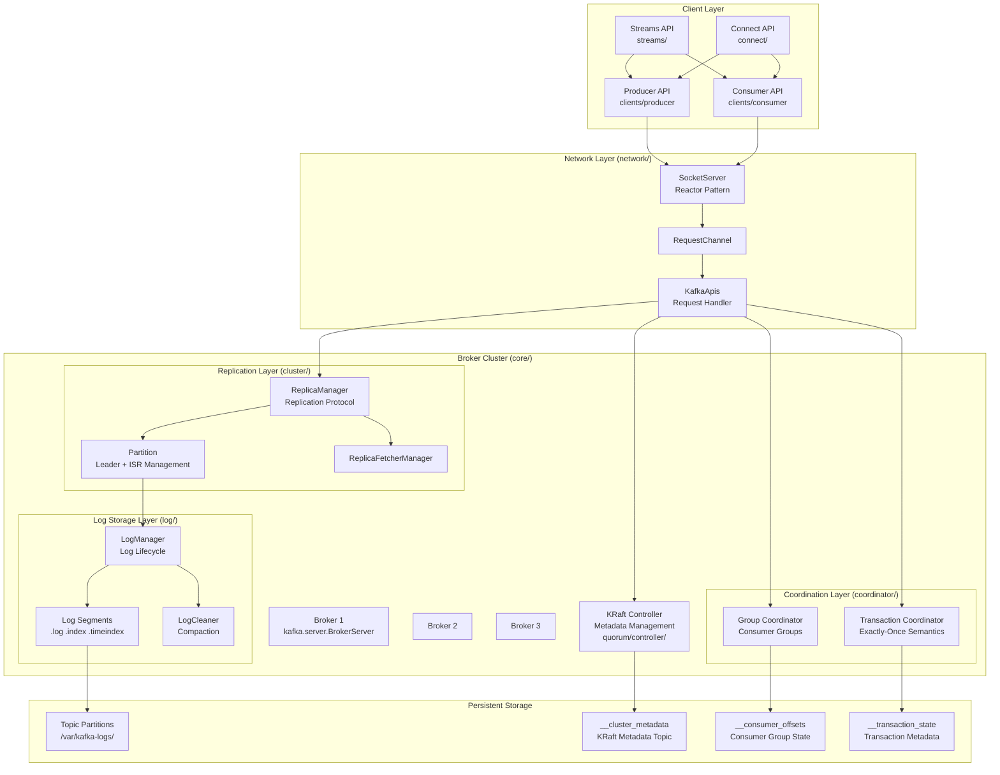
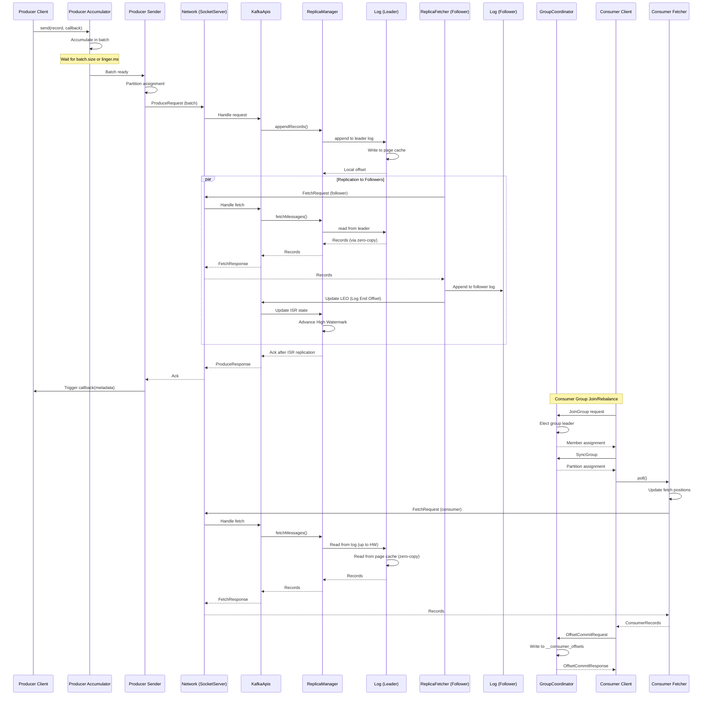
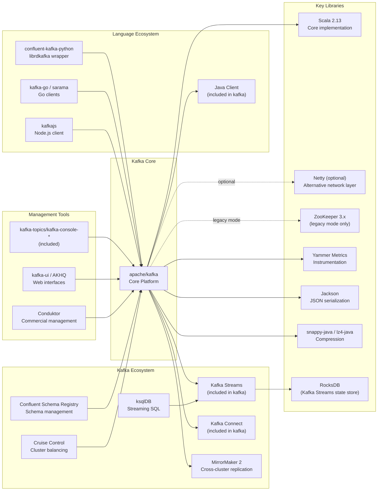

# Apache Kafka

> A distributed event streaming platform for high-throughput, fault-tolerant data pipelines and real-time analytics

| Metadata | |
|---|---|
| Repository | https://github.com/apache/kafka |
| License | Apache-2.0 |
| Primary Language | Java |
| Analyzed Release | `3.x` series (latest stable) |
| Stars (approx.) | 31,857 |
| Generated by | Claude Opus 4.6 (Anthropic) |
| Generated on | 2026-02-08 |

## Overview

Apache Kafka is an open-source distributed event streaming platform originally developed at LinkedIn and later donated to the Apache Software Foundation. It serves as a high-performance, horizontally scalable message broker designed to handle trillions of events per day across thousands of companies.

Problems it solves:

- Real-time data pipeline construction connecting hundreds of data sources to multiple downstream systems with guaranteed ordering and fault tolerance
- Building event-driven microservices architectures with publish-subscribe messaging, event sourcing, and CQRS patterns
- Stream processing for real-time analytics, data transformation, and complex event processing at massive scale (millions of messages per second with sub-10ms latency)

Positioning:

Kafka has become the de facto standard for event streaming, competing with traditional message queues (RabbitMQ, ActiveMQ) and cloud-native services (AWS Kinesis, Google Pub/Sub). Its unique combination of high throughput, fault tolerance, and stream processing capabilities has established it as foundational infrastructure in modern data architectures. The project has evolved from a simple message broker to a complete event streaming platform with Kafka Streams, Kafka Connect, and the recent KRaft mode eliminating ZooKeeper dependency.

## Architecture Overview

Kafka employs a distributed log-based architecture with clear separation between storage (brokers managing partitioned logs) and compute (producers, consumers, stream processors). The system is built around an immutable, append-only commit log that serves as the single source of truth for all events.

## Core Components

### Broker Server (`core/src/main/scala/kafka/server/`)

- Responsibility: Core broker process managing network I/O, request handling, and orchestrating all subsystems
- Key files: `kafka/server/BrokerServer.scala`, `kafka/server/KafkaApis.scala`, `kafka/network/SocketServer.scala`
- Design patterns: Reactor pattern for network I/O, Request-Response pattern, Dependency Injection via builders

The `BrokerServer` (introduced in KRaft mode) and legacy `KafkaServer` serve as the main entry point, initializing all subsystems including the log manager, replica manager, coordinators, and network server. The `SocketServer` implements a multi-threaded Reactor pattern with Acceptor threads handling new connections and Processor threads (one per core) managing non-blocking I/O using Java NIO Selector. Incoming requests are placed in a `RequestChannel` queue and processed by KafkaRequestHandler threads that delegate to `KafkaApis` for business logic execution.

Configuration is managed through `KafkaConfig` with over 200+ parameters. The broker lifecycle follows a state machine pattern (Starting -> RecoveringFromUncleanShutdown -> RunningAsBroker -> PendingControlledShutdown -> ShuttingDown).

### Log Storage Layer (`core/src/main/scala/kafka/log/`)

- Responsibility: Append-only log abstraction providing durable, ordered message storage with efficient disk I/O
- Key files: `kafka/log/LogManager.scala`, `kafka/log/Log.scala`, `kafka/log/LogSegment.scala`, `kafka/log/LogCleaner.scala`
- Design patterns: Segmented Log pattern, Memory-Mapped Files, Copy-on-Write for index updates

Each topic partition is implemented as a `Log`, which consists of multiple `LogSegment` files (default 1GB each). A segment contains three files: `.log` (message data), `.index` (offset to file position mapping), and `.timeindex` (timestamp to offset mapping). The index files use memory-mapped I/O for fast random access.

The `LogManager` handles log lifecycle operations including creation, deletion, and retention policy enforcement. Retention can be time-based (`log.retention.hours`) or size-based (`log.retention.bytes`). The `LogCleaner` implements log compaction for topics with `cleanup.policy=compact`, retaining only the latest value for each key - essential for changelog topics in Kafka Streams and consumer offset storage.

Kafka achieves high throughput by leveraging OS page cache - writes go to page cache and are flushed asynchronously, while reads are served from cache for "hot" data. The zero-copy optimization using `FileChannel.transferTo()` (Linux sendfile syscall) transfers data directly from page cache to network socket without copying to user space.

### Replication Layer (`core/src/main/scala/kafka/cluster/`)

- Responsibility: Fault-tolerant replication ensuring data durability and availability
- Key files: `kafka/cluster/Partition.scala`, `kafka/server/ReplicaManager.scala`, `kafka/server/ReplicaFetcherManager.scala`
- Design patterns: Leader-Follower pattern, In-Sync Replica (ISR) set, Write-Ahead Log replication

Each partition has one leader replica and N-1 follower replicas (configurable via `replication.factor`). All producer writes and consumer reads go through the leader. Followers continuously fetch from the leader using `ReplicaFetcherThread` instances.

The ISR (In-Sync Replica) set is the critical innovation - only replicas that are "caught up" (within `replica.lag.time.max.ms`) are included. A message is considered committed only after all ISR replicas acknowledge it. This provides configurable durability guarantees via the producer `acks` parameter: `acks=0` (no ack), `acks=1` (leader ack), `acks=all` (all ISR replicas ack).

The `Partition` class implements leader election. When the leader fails, the controller selects a new leader from the ISR. The high watermark (HW) tracks the highest offset replicated to all ISR members - consumers can only read up to the HW, ensuring read-after-write consistency.

### KRaft Controller (`metadata/src/main/java/org/apache/kafka/controller/`)

- Responsibility: Cluster metadata management using Raft consensus, replacing ZooKeeper dependency
- Key files: `metadata/src/main/java/org/apache/kafka/controller/QuorumController.java`, `raft/src/main/java/org/apache/kafka/raft/KafkaRaftClient.java`
- Design patterns: Raft consensus algorithm, Event Sourcing (metadata as log), Leader election

KRaft (Kafka Raft) mode, production-ready since Kafka 3.3 and mandatory in 4.0, eliminates ZooKeeper by implementing Raft consensus for metadata management. A quorum of controller nodes (typically 3 or 5) elect a leader that manages all cluster metadata: topic configurations, partition assignments, broker registrations, and ACLs.

All metadata changes are written to the `__cluster_metadata` topic as events, forming an event-sourced metadata log replicated across controllers using Raft. The active controller processes metadata RPCs and writes to this log, while standby controllers replicate the log and maintain an in-memory metadata cache for fast failover.

This design eliminates the ZooKeeper bottleneck that limited partitions per broker, improves controller failover time from seconds to milliseconds, and simplifies operations by removing an external dependency.

### Group Coordinator (`core/src/main/scala/kafka/coordinator/group/`)

- Responsibility: Managing consumer group membership, partition assignment, and offset storage
- Key files: `kafka/coordinator/group/GroupCoordinator.scala`, `kafka/coordinator/group/GroupMetadataManager.scala`
- Design patterns: Coordinator pattern, Heartbeat-based failure detection, Pluggable partition assignment strategies

Each consumer group is managed by one group coordinator (a broker). The coordinator is selected by hashing the group ID to a partition of the `__consumer_offsets` topic - the leader of that partition becomes the coordinator.

When consumers join a group, they send JoinGroup requests to the coordinator. The first consumer becomes the group leader and performs partition assignment using a pluggable strategy (RangeAssignor, RoundRobinAssignor, StickyAssignor, or CooperativeStickyAssignor). The coordinator distributes assignments via SyncGroup responses.

Consumers send periodic heartbeats to the coordinator (`heartbeat.interval.ms`). If a heartbeat is missed for `session.timeout.ms`, the consumer is considered dead and rebalance is triggered. The coordinator stores committed offsets in the `__consumer_offsets` topic with log compaction enabled, ensuring only the latest offset per partition is retained.

### Transaction Coordinator (`core/src/main/scala/kafka/coordinator/transaction/`)

- Responsibility: Implementing exactly-once semantics (EOS) for producers and transactional reads for consumers
- Key files: `kafka/coordinator/transaction/TransactionCoordinator.scala`, `kafka/coordinator/transaction/TransactionStateManager.scala`
- Design patterns: Two-phase commit, Transaction log, Idempotent producer

Kafka's exactly-once semantics requires coordination between multiple components. Producers initialize a transaction with a `transactional.id`, which maps to a transaction coordinator (similar to group coordinator pattern). The coordinator assigns a Producer ID (PID) and epoch, enabling idempotent writes (duplicate detection via sequence numbers).

When a producer begins a transaction (`beginTransaction()`), the coordinator tracks which partitions are involved. On `commitTransaction()`, the coordinator writes transaction markers (COMMIT or ABORT) to all affected partitions using a two-phase commit protocol. The transaction state is persisted in the `__transaction_state` topic.

Consumers reading with `isolation.level=read_committed` will skip messages from aborted transactions by reading the transaction markers. This provides end-to-end exactly-once processing when combined with Kafka Streams or consumer offsets committed within the same transaction.

### Producer Client (`clients/src/main/java/org/apache/kafka/clients/producer/`)

- Responsibility: Client library for publishing messages to Kafka topics with batching, compression, and retry logic
- Key files: `clients/producer/KafkaProducer.java`, `clients/producer/internals/Sender.java`, `clients/producer/internals/RecordAccumulator.java`
- Design patterns: Asynchronous I/O with callbacks, Record batching, Pluggable partitioner

`KafkaProducer` is thread-safe and designed for high throughput via batching. The `send()` method is asynchronous - records are accumulated in the `RecordAccumulator` until `batch.size` or `linger.ms` is reached. A background `Sender` thread drains batches and sends them to brokers.

The `Partitioner` interface determines which partition receives each message. The default partitioner uses a hash of the key (if present) or sticky partitioning (batching to the same partition until batch is full). Custom partitioners can implement domain-specific routing logic.

Producers handle network failures with configurable retries (`retries`, `retry.backoff.ms`) and guarantee idempotency with `enable.idempotence=true` (using sequence numbers to detect duplicates). Compression (`compression.type`) is applied per-batch, supporting gzip, snappy, lz4, and zstd.

### Consumer Client (`clients/src/main/java/org/apache/kafka/clients/consumer/`)

- Responsibility: Client library for subscribing to topics and consuming messages with offset management
- Key files: `clients/consumer/KafkaConsumer.java`, `clients/consumer/internals/ConsumerCoordinator.java`, `clients/consumer/internals/Fetcher.java`
- Design patterns: Pull-based consumption, Offset checkpoint, Consumer group protocol

`KafkaConsumer` is NOT thread-safe. Consumers can subscribe to topics with `subscribe()` (automatic partition assignment via consumer group) or use `assign()` for manual partition assignment. The `poll()` method fetches records with configurable batch sizes (`max.poll.records`, `fetch.min.bytes`, `fetch.max.wait.ms`).

The pull-based model (vs push) gives consumers control over consumption rate, enables efficient batching, and simplifies backpressure handling. Consumers can seek to specific offsets (`seek()`, `seekToBeginning()`, `seekToEnd()`) or timestamps (`offsetsForTimes()`).

Offset management can be automatic (`enable.auto.commit=true` with `auto.commit.interval.ms`) or manual via `commitSync()` / `commitAsync()`. The consumer tracks two positions: the "current position" (next offset to fetch) and the "committed position" (last checkpoint for failure recovery).

### Kafka Streams (`streams/src/main/java/org/apache/kafka/streams/`)

- Responsibility: Stream processing library built on Kafka producer and consumer APIs, providing high-level DSL and low-level Processor API
- Key files: `streams/KafkaStreams.java`, `streams/kstream/KStream.java`, `streams/kstream/KTable.java`, `streams/processor/internals/StreamThread.java`
- Design patterns: Dataflow programming (DSL), Topology pattern, State store abstraction, Punctuator for time-based operations

Kafka Streams enables stateful stream processing without external dependencies. Applications define a processing topology using either the high-level DSL (`KStream` for event streams, `KTable` for changelog streams, `GlobalKTable` for replicated tables) or the low-level Processor API.

Each Streams application instance runs multiple `StreamThread` instances (default: number of CPU cores), with each thread processing a subset of input partitions. State stores (default: RocksDB) provide local, fault-tolerant storage for aggregations and joins. Every state store has a changelog topic backing it - updates are sent to the changelog, enabling recovery by replaying the topic.

The framework automatically handles consumer group management, partition assignment, state store recovery, and exactly-once processing (via transactions). Windowing operations support tumbling, hopping, sliding, and session windows. Join operations (stream-stream, stream-table, table-table) leverage co-partitioning and local state stores for efficient distributed joins.

## Data Flow

### Message Production and Consumption Flow

## Key Design Decisions

### 1. Log-Centric Architecture with OS Page Cache

- Choice: Building on an append-only log abstraction and relying on OS page cache instead of in-process caching
- Rationale: Sequential disk I/O is faster than random memory access on modern hardware. The OS page cache already provides sophisticated caching with zero-copy transfer. This simplifies the Kafka code (no cache management logic), avoids GC pressure in the JVM, and survives process restarts (warm cache)
- Trade-offs: Less control over caching policy compared to application-managed cache. Performance depends on OS tuning and available memory. Cold start performance when page cache is empty

### 2. Pull-Based Consumer Model

- Choice: Consumers pull messages from brokers rather than brokers pushing to consumers
- Rationale: Consumers control their consumption rate, avoiding overwhelming slow consumers. Enables efficient batching (consumer can buffer and process in larger batches). Simplifies broker implementation and backpressure handling. Supports different consumption patterns (real-time vs batch processing)
- Trade-offs: Additional latency when no data is available (mitigated by long polling with `fetch.min.bytes` and `fetch.max.wait.ms`). Consumers must actively poll to detect new data

### 3. ISR (In-Sync Replica) Set Instead of Quorum

- Choice: Using a dynamic ISR set rather than traditional quorum-based replication (e.g., Paxos/Raft)
- Rationale: Provides better availability - as long as one ISR replica survives, data is not lost and the partition remains available. Supports configurable durability via `acks` parameter. The ISR can shrink during follower failures and expand when replicas catch up, providing flexibility
- Trade-offs: Complexity in managing ISR membership and handling edge cases (unclean leader election when ISR is empty). Potential data loss if `min.insync.replicas` is not properly configured. Does not guarantee committed data survives F failures in all scenarios (depends on ISR size at commit time)

### 4. Migration from ZooKeeper to KRaft

- Choice: Implementing Raft consensus for metadata management, removing ZooKeeper dependency
- Rationale: ZooKeeper became a scalability bottleneck limiting the number of partitions per cluster (tested up to ~4M partitions in KRaft vs ~200K in ZooKeeper mode). Faster controller failover (milliseconds vs seconds). Simpler operations (one less system to manage). Better metadata consistency model via event-sourced log
- Trade-offs: Required multi-year migration effort and complex upgrade path. Some ZooKeeper-dependent features had to be redesigned. Adoption requires users to learn Raft concepts

### 5. Zero-Copy Data Transfer with sendfile

- Choice: Using `FileChannel.transferTo()` (Linux sendfile syscall) for data transfer from disk to network
- Rationale: Eliminates copying data from kernel space to user space and back, reducing CPU usage and memory pressure. Achieves near wire-speed transfer rates. Critical for high-throughput use cases
- Trade-offs: Not available when SSL/TLS encryption is enabled (data must be encrypted in user space). Limited to platforms supporting sendfile (most modern Unix/Linux systems). Less control over data transformation pipeline

### 6. Consumer Group Protocol with Pluggable Assignment Strategies

- Choice: Implementing consumer group coordination in Kafka itself with pluggable partition assignment
- Rationale: Enables horizontal scaling of consumers without application-level coordination. Supports diverse consumption patterns (range, round-robin, sticky, cooperative). The coordinator pattern distributes load across brokers
- Trade-offs: Rebalancing causes stop-the-world pauses during partition reassignment (mitigated by cooperative rebalancing in newer protocols). Complex state management for group membership and offset commits

### 7. Exactly-Once Semantics via Idempotent Producer and Transactions

- Choice: Implementing EOS through producer idempotence (PID + sequence numbers) and transactions (two-phase commit)
- Rationale: Enables building correct streaming applications without duplicate processing. Critical for financial and mission-critical use cases. Works end-to-end when combined with transactional offset commits
- Trade-offs: Performance overhead (additional metadata, transaction markers, coordinator interaction). Increased complexity in failure scenarios. Requires careful configuration (`enable.idempotence`, `transactional.id`, `isolation.level`)

## Dependencies

## Testing Strategy

Kafka employs a multi-layered testing strategy reflecting its distributed systems complexity.

Unit tests: Each module (core, clients, streams, connect) contains extensive unit tests using JUnit 5. The core module uses Scala tests with ScalaTest. Tests are located in `src/test/java` and `src/test/scala` directories. Mock objects and test doubles are used to isolate components. The build uses Gradle with parallel test execution (`maxParallelForks`) for faster runs.

Integration tests: Integration tests spin up embedded Kafka clusters using `KafkaClusterTestKit` (for KRaft mode) or `EmbeddedKafkaCluster` (for legacy mode). These tests verify inter-component interactions including replication, consumer groups, transactions, and controller operations. The `clients-integration-tests` module contains client-side integration tests. Dedicated test classes verify compatibility with different configurations (SSL, SASL, compression codecs).

System tests: The `tests/` directory contains a comprehensive system test framework using Python and Docker. These tests run multi-node clusters with failure injection (killing brokers, network partitions) to verify fault tolerance. Test scenarios include rolling upgrades, controller failover, partition reassignment, and performance benchmarks. The framework uses ducktape for test orchestration.

Benchmarking: The `jmh-benchmarks/` module uses Java Microbenchmark Harness (JMH) for performance regression testing. Trogdor (`trogdor/`) is Kafka's fault injection and benchmarking framework for large-scale testing, supporting workload generation, failure injection, and distributed coordination.

CI/CD: GitHub Actions runs tests on every pull request with multiple configurations (Java 17/25, different Scala versions). The workflow includes checkstyle (code style), spotbugs (static analysis), and test coverage reporting. Automated flaky test detection re-runs failed tests to identify non-deterministic failures. Release builds generate signed artifacts with reproducible builds.

## Key Takeaways

1. Log as the Central Abstraction: Building on an immutable, append-only log provides a simple yet powerful foundation for distributed systems. The log serves multiple purposes simultaneously - message queue, storage, replication source, state synchronization, and event source. This unifying abstraction simplifies reasoning about the system and enables composition of higher-level abstractions like KTable and exactly-once processing.

2. Leveraging OS Primitives Over Reinvention: Kafka's decision to rely on OS page cache, sequential I/O, and zero-copy transfer (sendfile) rather than building application-level caching demonstrates the value of understanding and leveraging platform capabilities. This "boring technology" approach reduces complexity, improves performance, and benefits from decades of OS optimization work.

3. Dynamic Membership for Availability: The ISR model's dynamic membership (replicas can leave and rejoin) prioritizes availability over strict consistency. This differs from fixed quorum approaches (Raft, Paxos) and shows how domain-specific requirements (message streaming favors availability) can drive different consensus mechanisms. The configurable `acks` parameter lets users choose their availability-durability tradeoff point.

4. Separation of Control and Data Planes: The clear separation between metadata management (controller) and data handling (brokers serving partitions) enables independent scaling and evolution. The KRaft migration demonstrates this principle - replacing ZooKeeper with Raft-based controllers changed the control plane while preserving the data plane contract.

5. Pull-Based Consumption as an Inversion of Control: Moving flow control from producers (push) to consumers (pull) gives consumers autonomy over their consumption rate and processing model. This inversion simplifies the broker (no per-consumer state), enables heterogeneous consumer patterns (real-time and batch), and naturally handles backpressure. Applicable to any producer-consumer system design.

6. State Store Co-location for Stream Processing: Kafka Streams' decision to co-locate state stores with processing tasks (rather than external state management) minimizes network latency and simplifies operational deployment. The changelog topic pattern provides fault tolerance without distributed consensus. This architecture demonstrates how careful partitioning and co-location can eliminate the need for distributed transactions in stream processing.

7. Progressive API Layering: The architecture provides multiple abstraction levels - from low-level producer/consumer APIs to high-level Streams DSL. Each layer builds on the one below while hiding complexity. This allows users to choose the right level for their use case and drop down to lower levels when needed. Applicable to any platform design balancing simplicity and flexibility.

8. Explicit Trade-off Configuration: Kafka exposes key trade-offs as configuration parameters rather than making opinionated choices. Examples include `acks` (latency vs durability), `replication.factor` (availability vs resource cost), `min.insync.replicas` (consistency vs availability). This transparency empowers users to optimize for their specific requirements while understanding the implications.

## References

- [Apache Kafka Official Documentation](https://kafka.apache.org/documentation/)
- [Apache Kafka Internal Architecture - Confluent](https://developer.confluent.io/courses/architecture/get-started/)
- [Kafka Architecture and Internals by Jun Rao](https://www.confluent.io/blog/apache-kafka-architecture-and-internals-by-jun-rao/)
- [The Engineering Guide to Apache Kafka: Architecture & Internals Deep Dive](https://siddiky.medium.com/the-engineering-guide-to-apache-kafka-architecture-internals-deep-dive-6f874de4413b)
- [Kafka Replication Design - Confluent Documentation](https://docs.confluent.io/kafka/design/replication.html)
- [Understanding In-Sync Replicas (ISR) in Apache Kafka](https://www.geeksforgeeks.org/apache-kafka/understanding-in-sync-replicas-isr-in-apache-kafka/)
- [Kafka's Shift from ZooKeeper to KRaft](https://www.baeldung.com/kafka-shift-from-zookeeper-to-kraft)
- [The Evolution of Kafka Architecture: From ZooKeeper to KRaft](https://romanglushach.medium.com/the-evolution-of-kafka-architecture-from-zookeeper-to-kraft-f42d511ba242)
- [Kafka Consumer Design - Confluent Documentation](https://docs.confluent.io/kafka/design/consumer-design.html)
- [Kafka Consumer Groups & Offsets - Conduktor](https://learn.conduktor.io/kafka/kafka-consumer-groups-and-consumer-offsets/)
- [The Zero Copy Optimization in Apache Kafka](https://blog.2minutestreaming.com/p/apache-kafka-zero-copy-operating-system-optimization)
- [Kafka's Zero-Copy: The Architecture Behind Lightning-Fast Message Delivery](https://krishnakonar12.medium.com/kafkas-zero-copy-the-architecture-behind-lightning-fast-message-delivery-7ffde4aadb7e)
- [Performance Tuning RocksDB for Kafka Streams' State Stores](https://www.confluent.io/blog/how-to-tune-rocksdb-kafka-streams-state-stores-performance/)
- [Kafka Streams Internal Data Management](https://cwiki.apache.org/confluence/display/KAFKA/Kafka+Streams+Internal+Data+Management)
- [Kafka Design - Efficient Design - Confluent Documentation](https://docs.confluent.io/kafka/design/efficient-design.html)
