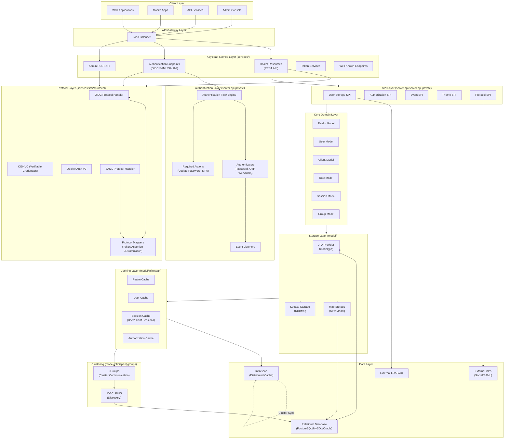
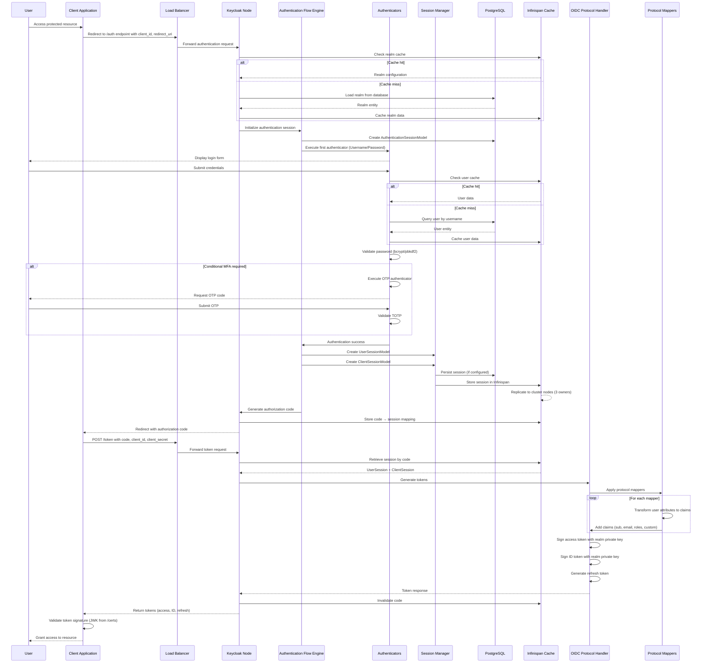
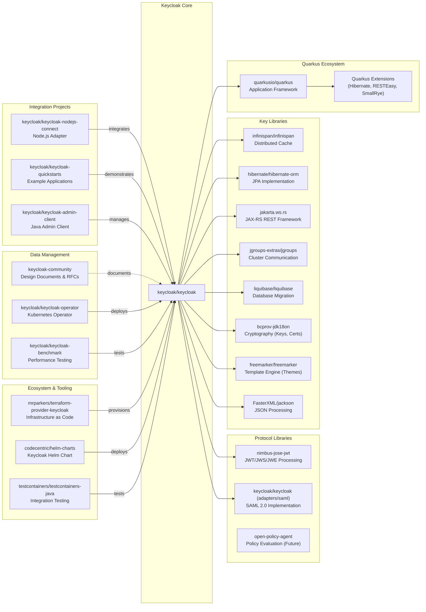

# Keycloak

> Open Source Identity and Access Management For Modern Applications and Services

| Metadata | |
|---|---|
| Repository | https://github.com/keycloak/keycloak |
| License | Apache-2.0 |
| Primary Language | Java |
| Analyzed Release | `26.5.2` (2026-01-23) |
| Stars (approx.) | 32,700+ |
| Generated by | Claude Opus 4.6 (Anthropic) |
| Generated on | 2026-02-08 |

## Overview

Keycloak is a comprehensive open-source Identity and Access Management (IAM) solution developed by Red Hat and now a CNCF incubating project. It provides enterprise-grade authentication and authorization capabilities with minimal code, supporting modern protocols like OpenID Connect (OIDC), OAuth 2.0, and SAML 2.0.

Problems it solves:

- Eliminates the need for applications to implement custom authentication and user management systems, reducing development time and security risks
- Provides centralized identity management across multiple applications through Single Sign-On (SSO), avoiding password fatigue and improving user experience
- Enables fine-grained authorization and permission management through UMA 2.0 and policy-based access control
- Facilitates user federation from existing LDAP/Active Directory systems and social identity providers without data migration
- Supports multi-tenancy through realm isolation, allowing organizations to manage separate user bases with different configurations

Positioning:

Keycloak is positioned as the leading open-source alternative to commercial IAM solutions like Auth0, Okta, and AWS Cognito. Unlike cloud-based SaaS offerings, Keycloak provides full control through self-hosting while offering comparable features. It is widely adopted in enterprises requiring on-premises deployment, customization flexibility, and cost optimization. Red Hat offers commercial support through Red Hat build of Keycloak (formerly Red Hat SSO), bridging the gap between open-source and enterprise needs. The recent migration from WildFly to Quarkus (Keycloak.X) has positioned it as a cloud-native IAM solution optimized for containerized environments.

## Architecture Overview

Keycloak employs a layered, SPI-driven architecture built on Quarkus. The system is organized around realms (tenant isolation units) and follows a provider pattern where nearly all functionality is pluggable through Service Provider Interfaces (SPIs). The core architecture consists of REST services, protocol endpoints, a domain model layer, storage providers, and distributed caching via Infinispan.

## Core Components

### Service Layer (`services/`)

- Responsibility: Exposes REST APIs for authentication, administration, and protocol endpoints
- Key files: `services/src/main/java/org/keycloak/services/resources/RealmsResource.java`, `services/src/main/java/org/keycloak/protocol/`
- Design patterns: JAX-RS resource pattern, factory pattern for protocol handlers

The service layer provides all HTTP endpoints consumed by clients and administrators. RealmsResource serves as the entry point for realm-specific operations, delegating to protocol-specific endpoints. Protocol handlers (OIDC, SAML, Docker Auth) implement the ProtocolFactory interface and are dynamically loaded through SPI. Each protocol defines its own token/assertion generation logic through protocol mappers, which transform user attributes into claims. The service layer is stateless and relies on KeycloakSession (request-scoped context) for accessing models and providers.

### SPI Framework (`server-spi/`, `server-spi-private/`)

- Responsibility: Defines extension points for customizing and extending Keycloak functionality
- Key files: `server-spi/src/main/java/org/keycloak/provider/`, `server-spi-private/src/main/java/org/keycloak/authentication/`
- Design patterns: Service Provider Interface (SPI), factory pattern, provider pattern

Keycloak's extensibility is built on a dual-interface SPI architecture: every provider implements both Provider (per-request lifecycle) and ProviderFactory (application-scoped singleton). The ProviderFactory creates Provider instances for each KeycloakSession. Key SPIs include UserStorageSPI (federation), AuthenticatorSPI (authentication steps), ProtocolMapperSPI (token customization), EventListenerSPI (audit logging), and ThemeSPI (UI customization). Providers are discovered via Java ServiceLoader from META-INF/services and deployed to the providers/ directory. The SPI layer enables runtime hot-swapping of implementations without code changes through Quarkus re-augmentation.

### Domain Model Layer (`model/`)

- Responsibility: Defines core abstractions for realms, users, clients, roles, groups, and sessions
- Key files: `server-spi/src/main/java/org/keycloak/models/RealmModel.java`, `server-spi/src/main/java/org/keycloak/models/UserModel.java`
- Design patterns: Domain model pattern, adapter pattern, session pattern

The domain model provides a storage-agnostic abstraction layer over persistent entities. RealmModel represents tenant isolation boundaries containing clients, roles, users, and configuration. UserModel supports federation through UserStorageProvider, allowing seamless integration with LDAP/AD without data import. ClientModel represents OAuth2/OIDC clients or SAML service providers with protocol-specific settings. RoleModel supports both realm-level and client-level roles with composite role hierarchies. All models are accessed through KeycloakSession, which encapsulates transaction boundaries and provider lifecycle management. The model layer supports multiple storage backends through the storage SPI.

### Storage Providers (`model/jpa/`, `model/map/`)

- Responsibility: Persists domain models to relational databases or alternative storage backends
- Key files: `model/jpa/src/main/java/org/keycloak/models/jpa/`, `model/map/`
- Design patterns: Repository pattern, JPA/Hibernate ORM, entity-model separation

Keycloak supports two storage architectures: legacy JPA-based storage and the newer map storage model. The JPA provider uses Hibernate ORM with database-per-realm schema isolation and maps entities to models through adapter classes. Entities use single-table inheritance for polymorphic types (e.g., RoleEntity for realm and client roles). The map storage is a next-generation architecture designed for better performance and alternative backends (e.g., CockroachDB, Cassandra). Database migrations are managed through Liquibase changesets. The storage layer implements optimistic locking for concurrent updates and supports database-specific optimizations for PostgreSQL, MySQL, Oracle, and MSSQL.

### Caching and Clustering (`model/infinispan/`)

- Responsibility: Provides distributed caching and session replication across cluster nodes
- Key files: `model/infinispan/src/main/java/org/keycloak/models/cache/infinispan/`, `model/infinispan/src/main/java/org/keycloak/connections/infinispan/`
- Design patterns: Cache-aside pattern, invalidation-based caching, distributed data grid

Keycloak uses Infinispan for two purposes: local caching of realm/user/client data and distributed storage of user sessions. The cache layer implements invalidation-based caching where updates trigger cluster-wide cache invalidation events. Four primary caches exist: realms (realm metadata), users (user entities), authorization (policies/permissions), and sessions (user/client sessions). In multi-cluster deployments, sessions are stored in external Infinispan clusters with ownership set to 3 replicas for fault tolerance. JGroups handles cluster membership discovery through JDBC_PING (database-based discovery) or DNS_PING (Kubernetes). The UpdateCounter mechanism prevents race conditions during cache updates through versioning.

### Authentication and Authorization (`server-spi-private/src/main/java/org/keycloak/authentication/`, `server-spi-private/src/main/java/org/keycloak/authorization/`)

- Responsibility: Implements authentication flows, credential validation, and fine-grained authorization policies
- Key files: `server-spi-private/src/main/java/org/keycloak/authentication/AuthenticationFlowContext.java`, `server-spi-private/src/main/java/org/keycloak/authorization/policy/`
- Design patterns: Chain of responsibility (authentication flow), policy pattern (authorization), strategy pattern (authenticators)

Authentication flows are configurable execution chains where each step is an Authenticator with execution requirements (REQUIRED, ALTERNATIVE, DISABLED, CONDITIONAL). The AuthenticationFlowContext provides state management across authenticators and supports forking flows for conditional logic. Built-in authenticators include username/password, OTP, WebAuthn, Kerberos, and X.509 client certificates. RequiredActions enforce post-login tasks like password updates or MFA enrollment. The authorization subsystem implements UMA 2.0 with resource servers, resources, scopes, permissions, and policies. Policy evaluation supports JavaScript, Drools rules, time-based, user/role/group/client-based, and aggregated policies. The DefaultPolicyEvaluator uses a decision collector pattern to combine multiple policy results.

### Protocol Handlers (`services/src/main/java/org/keycloak/protocol/`)

- Responsibility: Implements OpenID Connect, SAML 2.0, OAuth 2.0, and other authentication protocols
- Key files: `services/src/main/java/org/keycloak/protocol/oidc/`, `services/src/main/java/org/keycloak/protocol/saml/`
- Design patterns: Strategy pattern (protocol selection), builder pattern (token/assertion generation), template pattern (protocol flows)

Each protocol is a LoginProtocol implementation with endpoints for initiation, callback handling, and metadata publication. The OIDC implementation handles authorization code, implicit, hybrid, client credentials, and device flows. Token generation uses AccessTokenResponseBuilder with protocol mappers injecting claims. SAML implementation supports POST/Redirect bindings, assertion encryption/signing, and artifact resolution. Protocol mappers are composable transformations applied during token/assertion generation, including hardcoded values, user attributes, role mappings, group memberships, and JavaScript transformations. The protocol layer integrates with the authentication flow engine and session management.

## Data Flow

### User Authentication Flow (OIDC Authorization Code)

## Key Design Decisions

### 1. SPI-Based Pluggable Architecture

- Choice: Nearly all functionality exposed through Service Provider Interfaces with dual Provider/ProviderFactory contracts
- Rationale: Enterprises require extensive customization for user federation, authentication flows, token transformation, and event handling. The SPI architecture enables third-party extensions without forking the codebase. The Provider (request-scoped) and ProviderFactory (application-scoped) separation ensures proper lifecycle management while supporting stateless scaling
- Trade-offs: SPI abstraction adds complexity and indirection compared to direct implementations. Provider discovery through Java ServiceLoader is less flexible than runtime plugin systems. Maintaining backward compatibility across SPI versions constrains internal refactoring. Hot reloading requires Quarkus re-augmentation rather than true dynamic loading

### 2. Migration from WildFly to Quarkus (Keycloak.X)

- Choice: Replaced WildFly application server with Quarkus framework starting in version 17
- Rationale: WildFly's dynamic deployment model conflicts with cloud-native containerization where immutability is preferred. Quarkus provides faster startup (critical for Kubernetes horizontal scaling), lower memory footprint through ahead-of-time compilation, and better integration with cloud-native tooling. The build-time augmentation model allows pre-configuring database drivers and providers, reducing runtime initialization
- Trade-offs: Breaking change requiring deployment process updates. Two-phase configuration (build vs runtime) adds conceptual complexity. Extension deployment changed from hot-deploy to build-time inclusion. Some WildFly-specific extensions became incompatible. The transition period maintained dual distribution support, increasing maintenance burden

### 3. Realm-Based Multi-Tenancy

- Choice: Isolate users, clients, roles, and configuration into separate realms with independent namespaces
- Rationale: Organizations need to manage multiple user populations (employees, customers, partners) with different authentication requirements, branding, and security policies. Realms provide strong isolation without requiring separate Keycloak deployments. Each realm can federate different LDAP directories, configure unique session timeouts, and apply distinct password policies
- Trade-offs: Realm isolation prevents cross-realm SSO (users cannot authenticate to applications in different realms with a single session). Realm proliferation increases memory consumption as each realm caches metadata. Managing hundreds of realms requires external automation (Keycloak operator, Terraform providers). Realm deletion is irreversible and can lead to data loss

### 4. Infinispan for Caching and Session Storage

- Choice: Use Infinispan as both a local cache (realms, users, clients) and distributed session store
- Rationale: Local caching dramatically reduces database load for frequently accessed metadata. Distributed session caching enables stateless Keycloak nodes where any instance can serve requests for any session (required for load-balanced deployments). Infinispan's invalidation-based caching ensures consistency across cluster nodes through event propagation. The three-owner replication strategy provides fault tolerance
- Trade-offs: Infinispan adds operational complexity (JGroups configuration, cluster discovery tuning). Cache invalidation storms can occur during bulk updates (e.g., importing many users). In multi-datacenter deployments, Infinispan cross-site replication has latency constraints. The local cache can become stale if invalidation events are lost due to network partitions. Memory consumption scales with session count (configurable limits: 10,000 sessions per cache by default)

### 5. JPA with Database-Agnostic Model Layer

- Choice: Implement storage abstraction allowing multiple backends while defaulting to JPA/Hibernate with relational databases
- Rationale: Enterprises have existing database infrastructure (PostgreSQL, MySQL, Oracle, MSSQL) and compliance requirements for data residency. The abstraction layer enables future storage backends (the map storage initiative targets cloud-native databases like CockroachDB). JPA provides mature transaction management, migration tooling (Liquibase), and connection pooling. Database-per-realm schema isolation was considered but rejected in favor of single-schema multi-tenancy for operational simplicity
- Trade-offs: JPA abstraction prevents using database-specific features (e.g., PostgreSQL JSONB indexing). The generic model must accommodate diverse database capabilities, leading to lowest-common-denominator design. Hibernate entity caching conflicts with Infinispan application caching, requiring careful coordination. Schema migrations (Liquibase) can be slow for large databases, requiring maintenance windows

### 6. Protocol Mapper Extensibility

- Choice: Allow customization of token/assertion generation through configurable protocol mappers applied at client or client-scope level
- Rationale: Applications require different claims in tokens based on their authorization model. Protocol mappers enable transforming user attributes, group memberships, and custom data into OIDC claims or SAML attributes without code changes. Client scopes provide reusable mapper configurations shared across clients. JavaScript mappers support complex transformations (e.g., aggregating data from multiple sources)
- Trade-offs: Mapper configuration is stored in the database, making version control difficult (solutions: realm export/import, Terraform). JavaScript mappers introduce security risks if administrators paste untrusted code (executed in a sandboxed environment but subject to Denial-of-Service). Mapper execution order is non-obvious when combining client-level and scope-level mappers. Debugging mapper issues requires examining token contents rather than code

### 7. Authentication Flow as Composable Execution Chain

- Choice: Model authentication as configurable flows containing nested subflows and authenticators with execution requirements (REQUIRED, ALTERNATIVE, CONDITIONAL)
- Rationale: Organizations have diverse authentication requirements: MFA for admins, passwordless for consumers, Kerberos for internal apps. Flows enable visual configuration through the Admin Console without coding. Conditional executions support context-dependent logic (e.g., require MFA only for high-risk logins). The same flow engine handles browser login, direct grants, client authentication, and registration
- Trade-offs: Flow configuration is complex for non-technical administrators (graphical UI helps but still has a learning curve). Debugging flow execution requires understanding the entire chain and requirement semantics. Nested flows introduce performance overhead from context switching. Flow state must be persisted across redirects through AuthenticationSessionModel, increasing storage requirements. Custom authenticators must carefully implement all context methods to avoid breaking the flow

## Dependencies

## Testing Strategy

Keycloak employs a comprehensive multi-layered testing approach covering unit, integration, and end-to-end scenarios.

Unit tests: Each module contains standard JUnit tests for individual components. The testsuite structure separates model tests, integration-arquillian tests, and performance tests. Unit tests use H2 in-memory database by default for fast execution without external dependencies.

Integration tests: The testsuite/integration-arquillian module contains over 2,000 integration tests using Arquillian for container lifecycle management. Tests run against embedded Keycloak servers with configurable browsers (HtmlUnit for CI, Chrome/Firefox for local debugging via Selenium WebDriver). Database testing supports PostgreSQL, MySQL, MariaDB, Oracle, and MSSQL through Docker containers. LDAP and Kerberos tests use embedded ApacheDS servers. Tests verify complete workflows including authentication flows, token generation, protocol compliance (OIDC, SAML), admin API operations, and user federation.

OIDC conformance: Keycloak runs the OpenID Conformance Test Suite to validate protocol compliance. Results are published demonstrating certification for basic, implicit, hybrid, and config flows. The testsuite includes specific test profiles for FIPS compliance validation.

Performance testing: The keycloak-benchmark project provides Gatling-based load testing scenarios for login/logout, token refresh, and authorization flows. Kubernetes-native deployment allows testing at scale with configurable user counts, session durations, and cluster sizes. Performance baselines track metrics like requests per second, P95 latency, and database IOPS requirements.

Build system: Maven-based build with Maven Wrapper for version consistency. GitHub Actions CI runs tests on every pull request with matrix builds across multiple JDK versions (17, 21) and databases. Quarkus build optimization is tested through the kc.sh build command. The project supports incremental builds via Apache Maven Build Cache Extension for faster developer iteration.

CI/CD: Automated builds produce container images pushed to quay.io/keycloak/keycloak. Release process includes Git tagging, changelog generation, and artifact signing. Nightly builds enable testing of unreleased features. The operator repository has separate CI for Kubernetes deployment validation.

## Key Takeaways

1. SPI-driven extensibility architecture: The dual Provider/ProviderFactory pattern enables enterprise customization without forking while maintaining request-scoped resource management. This design is applicable to any system requiring extensive third-party extensions with controlled lifecycle management. The separation of public SPIs (stable API) and private SPIs (internal flexibility) balances extensibility with maintainability.

2. Realm-based multi-tenancy isolation: Realms provide strong tenant boundaries within a single deployment, balancing operational simplicity (one cluster) with isolation requirements (separate configurations, themes, and user bases). This pattern is applicable to B2B SaaS platforms, managed service providers, and enterprise IT managing multiple business units. The realm concept demonstrates how logical partitioning can defer physical separation until scale demands it.

3. Quarkus migration for cloud-native optimization: The transition from traditional application servers to build-time optimized frameworks reflects broader industry trends. Quarkus's augmentation model (build vs runtime configuration) reduces startup time and memory footprint at the cost of deployment flexibility. This trade-off favors immutable containerized deployments over dynamic application servers. Organizations migrating monoliths to microservices face similar decisions about runtime flexibility versus optimization.

4. Protocol abstraction with mapper-based customization: Separating protocol implementation (OIDC, SAML) from claim/assertion customization (protocol mappers) enables non-developers to configure token contents through UI. This layered approach—core protocol logic in code, customization in configuration—balances flexibility with maintainability. Applicable to any integration platform where message transformation is a primary use case.

5. Infinispan dual-purpose architecture: Using the same distributed cache infrastructure for both performance optimization (local caching) and stateful session replication demonstrates infrastructure reuse. The invalidation-based caching with three-owner replication balances consistency, availability, and fault tolerance. However, this tight coupling between caching and clustering increases operational complexity. Systems with similar requirements might consider separating concerns (e.g., Redis for sessions, application-level caching for metadata).

6. Authentication flow as configuration-driven engine: Modeling authentication as composable, configurable execution chains enables supporting diverse authentication requirements without code proliferation. The flow engine with execution requirements (REQUIRED, ALTERNATIVE, CONDITIONAL) provides a DSL for authentication logic. This pattern is applicable to workflow engines, business process automation, and rule-based systems where non-developers must configure complex logic.

7. Storage abstraction for database portability: The model layer abstraction over JPA enables supporting multiple databases while isolating protocol and business logic from storage concerns. However, the lowest-common-denominator approach limits leverage of database-specific features. The map storage initiative recognizes this limitation and pursues alternative backends. Systems requiring database portability must carefully balance abstraction benefits against performance costs.

## References

- [Keycloak Official Documentation](https://www.keycloak.org/documentation.html)
- [Server Developer Guide - Keycloak](https://www.keycloak.org/docs/latest/server_development/)
- [High Availability Guide - Keycloak](https://www.keycloak.org/high-availability/introduction)
- [Keycloak Architecture Design Documents - keycloak-community](https://github.com/keycloak/keycloak-community/tree/main/design)
- [Service Provider Interfaces (SPI) - Keycloak Documentation](https://wjw465150.gitbooks.io/keycloak-documentation/content/server_development/topics/providers.html)
- [Migrating to Quarkus Distribution - Keycloak](https://www.keycloak.org/migration/migrating-to-quarkus)
- [Keycloak: Core Concepts - Red Hat Developer](https://developers.redhat.com/blog/2019/12/11/keycloak-core-concepts-of-open-source-identity-and-access-management)
- [Storage Architecture Design - keycloak-community](https://github.com/keycloak/keycloak-community/blob/main/design/keycloak.x/storage-architecture.md)
- [Keycloak vs Auth0 vs Okta Comparison](https://ritza.co/articles/gen-articles/keycloak-vs-okta-vs-auth0-vs-authelia-vs-cognito-vs-authentik/)
- [Mapping Claims and Assertions in Keycloak](https://blog.elest.io/mapping-claims-and-assertions-in-keycloak/)
- [Understanding Realms, Clients, and Roles in Keycloak](https://mi-do.medium.com/understanding-realms-clients-and-roles-in-keycloak-c88a6e57d74f)
- [Implementing Keycloak Event Listener SPI](https://medium.com/@jawadrashid/implementing-keycloak-event-listener-spi-service-provider-interfaces-1f01ae819e8d)
- [Keycloak Benchmark - Architecture](https://www.keycloak.org/keycloak-benchmark/kubernetes-guide/latest/architecture)
- [Keycloak on AWS - Architecture Overview](https://aws-samples.github.io/keycloak-on-aws/en/implementation-guide/architecture/)
- [DeepWiki - keycloak/keycloak](https://deepwiki.com/keycloak/keycloak/)
