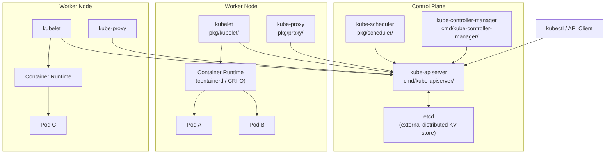
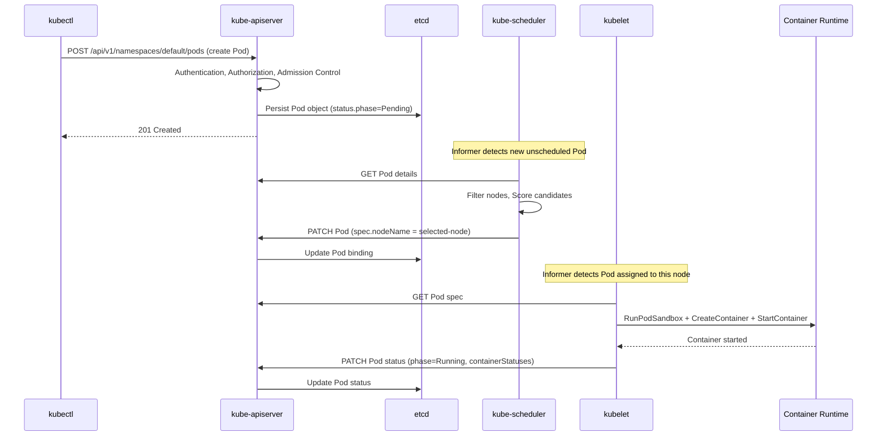
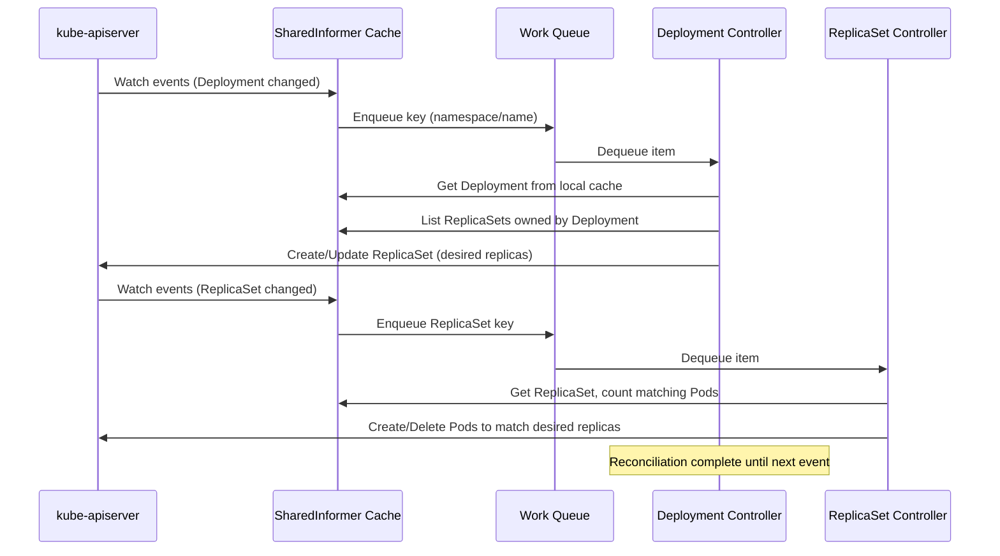
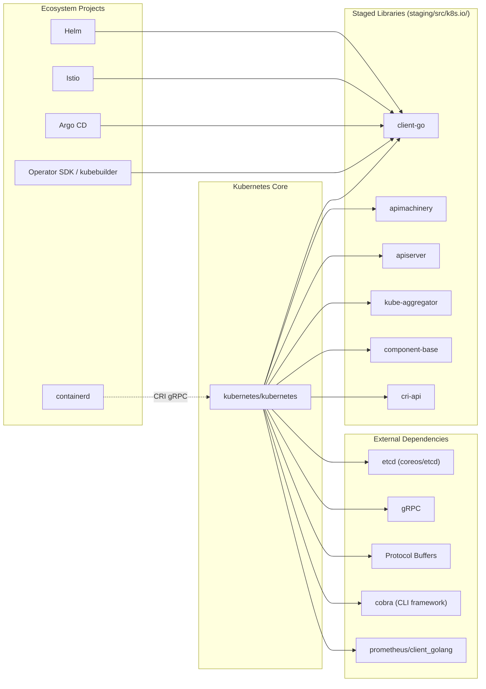

# Kubernetes

> Production-grade container scheduling and management system for automating deployment, scaling, and operations of application containers across clusters of hosts.

| Metadata | |
|---|---|
| Repository | https://github.com/kubernetes/kubernetes |
| License | Apache License 2.0 |
| Primary Language | Go |
| Analyzed Release | `v1.36.0-alpha.1` (2026-02-06) |
| Stars (approx.) | 120,351 |
| Generated by | Claude Opus 4.6 (Anthropic) |
| Generated on | 2026-02-08 |

## Overview

Kubernetes (often abbreviated as K8s) is an open-source container orchestration platform originally designed by Google and now maintained by the Cloud Native Computing Foundation (CNCF). It provides a framework for running distributed systems resiliently, handling scaling and failover for applications, providing deployment patterns, and more. The project is one of the largest open-source Go codebases in existence, with a deeply modular architecture organized around a declarative desired-state model.

Problems it solves:

- Manual container deployment and scaling across heterogeneous infrastructure is error-prone, time-consuming, and does not scale
- Applications need self-healing capabilities such as automatic restart, replication, and rescheduling when nodes fail
- Service discovery, load balancing, configuration management, and secret distribution require a unified abstraction layer
- Rolling updates, canary deployments, and rollbacks need to be automated to achieve zero-downtime releases

Positioning:

Kubernetes has become the de facto standard for container orchestration, largely displacing earlier tools like Docker Swarm and Apache Mesos. It sits at the foundation of the cloud-native ecosystem, with projects like Istio (service mesh), Helm (package management), Argo (GitOps/workflows), and Prometheus (monitoring) building on top of its API primitives. Major cloud providers offer managed Kubernetes services (GKE, EKS, AKS), and distributions like OpenShift and Rancher extend it for enterprise use cases. Its extensibility via Custom Resource Definitions (CRDs) and the Operator pattern has made it a universal platform for running not just stateless web applications but also databases, machine learning workloads, and edge computing.

## Architecture Overview

Kubernetes follows a hub-and-spoke architecture with a centralized control plane and distributed worker nodes. The control plane manages the desired state of the cluster through a declarative API, while worker nodes run the actual container workloads. All cluster state is persisted in etcd, and every component communicates exclusively through the API server, creating a single source of truth for the entire system.

## Core Components

### kube-apiserver (`cmd/kube-apiserver/`)

- Responsibility: Serves as the central hub of the entire Kubernetes system, exposing the RESTful Kubernetes API and acting as the sole gateway for all cluster state mutations
- Key files: `cmd/kube-apiserver/apiserver.go`, `cmd/kube-apiserver/app/server.go`, `cmd/kube-apiserver/app/aggregator.go`, `staging/src/k8s.io/apiserver/pkg/server/`, `staging/src/k8s.io/apiserver/pkg/storage/`
- Design patterns: Aggregation pattern (API aggregation layer), Chain of Responsibility (admission controllers), Strategy pattern (storage backends)

The API server is the only component that communicates directly with etcd. It validates and processes REST requests, transforms them through a chain of admission controllers, and persists the resulting objects to storage. The server is built on the generic apiserver library (`staging/src/k8s.io/apiserver/`) which handles authentication, authorization, admission control, API discovery, and OpenAPI schema generation. The API aggregation layer (`cmd/kube-apiserver/app/aggregator.go`) allows extending the API surface by proxying requests to external API servers registered via `APIService` objects. The storage layer (`staging/src/k8s.io/apiserver/pkg/storage/`) abstracts etcd access and implements watch semantics that enable the event-driven architecture underlying all controllers.

### kube-scheduler (`pkg/scheduler/`)

- Responsibility: Watches for newly created Pods that have no assigned node and selects the optimal node for each Pod to run on
- Key files: `pkg/scheduler/scheduler.go`, `pkg/scheduler/schedule_one.go`, `pkg/scheduler/framework/interface.go`, `pkg/scheduler/framework/plugins/`, `pkg/scheduler/framework/runtime/`
- Design patterns: Plugin/extension point framework, Filtering and Scoring pipeline, Strategy pattern

The scheduler operates as a two-phase pipeline: filtering and scoring. In the filtering phase, it eliminates nodes that cannot run the Pod (e.g., insufficient resources, node affinity mismatches). In the scoring phase, it ranks the remaining nodes using weighted scoring functions. The Scheduling Framework (`pkg/scheduler/framework/interface.go`) defines a rich set of extension points -- QueueSort, PreFilter, Filter, PostFilter, PreScore, Score, Reserve, Permit, PreBind, Bind, and PostBind -- allowing plugins to hook into any phase of the scheduling cycle. The core scheduling logic in `schedule_one.go` processes one Pod at a time from the scheduling queue, runs it through the framework pipeline, and binds the Pod to the selected node via the API server. Preemption logic handles the case where no node can accommodate a high-priority Pod by evicting lower-priority Pods.

### kube-controller-manager (`pkg/controller/`)

- Responsibility: Runs the core control loops that regulate the state of the cluster, continuously reconciling the actual state toward the desired state declared in the API
- Key files: `cmd/kube-controller-manager/app/`, `pkg/controller/deployment/`, `pkg/controller/replicaset/`, `pkg/controller/job/`, `pkg/controller/garbagecollector/`, `pkg/controller/namespace/`
- Design patterns: Reconciliation loop (level-triggered control loop), Informer/SharedInformer caching pattern, Work queue with rate-limited retry

The controller manager bundles approximately 30+ individual controllers into a single binary. Each controller follows the same fundamental pattern: watch resources via shared informers, detect drift between desired and actual state, and take corrective action through the API server. For example, the Deployment controller (`pkg/controller/deployment/`) watches Deployment objects and manages ReplicaSets, the ReplicaSet controller (`pkg/controller/replicaset/`) ensures the correct number of Pod replicas exist, and the Job controller (`pkg/controller/job/`) manages batch workloads to completion. The garbage collector (`pkg/controller/garbagecollector/`) handles cascading deletion of dependent objects using owner references. All controllers use the SharedInformer mechanism from client-go to maintain a local cache of API objects, reducing load on the API server and providing efficient event notification.

### kubelet (`pkg/kubelet/`)

- Responsibility: Acts as the node agent on each worker node, ensuring that containers described in PodSpecs are running and healthy
- Key files: `pkg/kubelet/kubelet.go`, `pkg/kubelet/kubelet_pods.go`, `pkg/kubelet/kubelet_node_status.go`, `pkg/kubelet/cm/` (container manager), `pkg/kubelet/eviction/`, `staging/src/k8s.io/cri-api/`
- Design patterns: Plugin architecture (CRI, CNI, CSI), PLEG (Pod Lifecycle Event Generator), Manager pattern for subsystems

The kubelet registers the node with the API server and continuously reconciles the set of running Pods on its node with the desired Pods from the API server. It communicates with the container runtime through the Container Runtime Interface (CRI) defined in `staging/src/k8s.io/cri-api/`, which allows pluggable runtimes like containerd and CRI-O. The Pod Lifecycle Event Generator (PLEG) efficiently detects container state changes without constant polling. The container manager (`pkg/kubelet/cm/`) handles cgroups, resource allocation, and device plugin management. The eviction manager (`pkg/kubelet/eviction/`) monitors node resource pressure (memory, disk, PIDs) and evicts Pods when thresholds are exceeded. Health checking is managed through liveness, readiness, and startup probes defined in the Pod spec.

### client-go (`staging/src/k8s.io/client-go/`)

- Responsibility: Provides the canonical Go client library for interacting with the Kubernetes API, including typed clients, dynamic clients, informers, listers, and work queues
- Key files: `staging/src/k8s.io/client-go/informers/`, `staging/src/k8s.io/client-go/kubernetes/`, `staging/src/k8s.io/client-go/rest/`, `staging/src/k8s.io/client-go/dynamic/`
- Design patterns: Informer/Reflector pattern (List-Watch), SharedIndexInformer with local cache, Rate-limited work queue

client-go is arguably the most important library in the Kubernetes ecosystem. The Informer mechanism combines List and Watch operations: it initially lists all objects of a given type, then opens a long-lived watch connection to receive incremental updates. The Reflector component (`pkg/watch`) feeds events into a DeltaFIFO queue, which deduplicates and coalesces events before dispatching them to event handlers and updating the local Indexer cache. The SharedIndexInformer ensures that multiple consumers watching the same resource type share a single API server connection. The work queue implementation provides fair ordering, deduplication via stable keys (namespace/name), rate-limited retry with exponential backoff, and throttling to prevent controller overload during event storms.

### kube-proxy (`pkg/proxy/`)

- Responsibility: Maintains network rules on each node that implement the Kubernetes Service abstraction, enabling virtual IP-based load balancing to backend Pods
- Key files: `pkg/proxy/iptables/`, `pkg/proxy/ipvs/`, `pkg/proxy/nftables/`, `pkg/proxy/endpointslicecache.go`
- Design patterns: Strategy pattern (multiple proxy modes), Observer pattern (watches Service and EndpointSlice objects)

kube-proxy runs on every node and watches Service and EndpointSlice objects from the API server. When services or endpoints change, it updates the node-level networking rules to route traffic correctly. It supports multiple backend implementations: iptables mode (the long-standing default), IPVS mode (for clusters needing higher throughput and more load balancing algorithms), and nftables mode (the newer approach using the nftables framework). The EndpointSlice cache (`pkg/proxy/endpointslicecache.go`) provides an efficient local representation of service endpoints, and the proxy translates these into the appropriate low-level networking rules for the chosen backend.

## Data Flow

### Pod Creation Lifecycle

### Controller Reconciliation Loop

## Key Design Decisions

### 1. Declarative Desired-State Model over Imperative Commands

- Choice: All Kubernetes resources are defined declaratively -- users specify _what_ they want (desired state), not _how_ to get there
- Rationale: A declarative model enables idempotent operations, self-healing behavior, and GitOps workflows. The system continuously reconciles actual state toward desired state, which naturally handles node failures, network partitions, and partial updates without requiring explicit recovery procedures
- Trade-offs: Debugging can be more difficult because the system is constantly mutating state behind the scenes. The gap between "apply" and "actual running state" requires understanding the reconciliation model. Simple imperative operations (like "restart this pod") require workarounds within the declarative paradigm

### 2. Single Source of Truth via etcd and the API Server Gateway

- Choice: All cluster state is persisted in etcd, and the API server is the exclusive gateway -- no component reads from or writes to etcd directly except the API server
- Rationale: This ensures consistency, simplifies access control (all authorization happens at the API server), and decouples internal storage from the rest of the system. It also allows optimistic concurrency control via resource versions and enables a reliable watch mechanism for event-driven architecture
- Trade-offs: The API server becomes a potential bottleneck at very large scale (thousands of nodes, hundreds of thousands of Pods). etcd has practical limits on object size (1.5MB default) and total database size. The indirection adds latency compared to direct database access

### 3. Plugin-Based Extensibility at Every Layer

- Choice: Kubernetes defines extension points throughout the system -- CRI for container runtimes, CNI for networking, CSI for storage, the Scheduler Framework for scheduling plugins, admission webhooks, API aggregation, and CRDs with the Operator pattern
- Rationale: No single solution can address the diversity of infrastructure environments (cloud, on-premises, edge, hybrid). Standardized interfaces allow the core to remain lean while enabling third-party innovation. CRDs and Operators effectively allow Kubernetes to be a platform for building platforms
- Trade-offs: The number of extension points creates a steep learning curve. Debugging issues that span multiple plugins (e.g., a Pod failing due to a combination of CNI, CSI, and scheduling plugin behavior) is challenging. Webhook-based extensions (admission, authentication) add latency and failure modes to the critical path

### 4. Level-Triggered Reconciliation over Edge-Triggered Events

- Choice: Controllers are designed to be level-triggered -- they reconcile toward the desired state based on current observation rather than reacting to specific events
- Rationale: Level-triggered logic is inherently more robust. If an event is missed (due to a restart or network issue), the controller will still converge to the correct state on its next reconciliation. This eliminates an entire class of bugs related to event ordering, duplication, and loss
- Trade-offs: Controllers may do redundant work by re-evaluating state that has not changed. The Informer/SharedInformer pattern mitigates this with local caching and delta-based notification, but the fundamental design prioritizes correctness over efficiency

### 5. Staging Repository Model for Component Libraries

- Choice: Core libraries like client-go, apimachinery, and apiserver are developed in a monorepo (`staging/src/k8s.io/`) but published as independent Go modules
- Rationale: This allows external projects to depend on specific Kubernetes libraries (e.g., client-go for building controllers) without importing the entire kubernetes/kubernetes repository. It maintains development velocity by keeping everything in one place while providing clean dependency boundaries for consumers
- Trade-offs: The staging-to-publishing pipeline adds complexity to the build and release process. Version synchronization between staging modules must be carefully managed. External consumers must use matching versions of staging libraries to avoid compatibility issues

## Dependencies

## Testing Strategy

Kubernetes employs a multi-layered testing strategy commensurate with the scale and criticality of the project. The testing infrastructure is managed by the kubernetes/test-infra repository and runs on Prow, a Kubernetes-native CI/CD system.

Unit tests: Each package contains `_test.go` files co-located with the source code. Unit tests focus on individual functions and methods in isolation. For example, scheduler plugin logic in `pkg/scheduler/framework/plugins/` has extensive unit tests validating filtering and scoring behavior. Tests use the standard Go `testing` package and table-driven test patterns.

Integration tests: Located in `test/integration/`, these tests spin up real API server and etcd instances (typically using the `envtest` pattern) but do not require full cluster infrastructure. Integration tests validate the interaction between components -- for example, testing that the controller manager correctly reconciles a Deployment through the API server and etcd. They cover admission controller chains, RBAC policy evaluation, and storage behavior.

End-to-end tests: Located in `test/e2e/`, these tests run against real Kubernetes clusters provisioned by kubetest2. They validate complete user-facing scenarios such as Pod deployment, service networking, rolling updates, persistent volume provisioning, and node failure recovery. The E2E framework is built on Ginkgo v2 and Gomega, with structured logging and detailed failure reporting. Specialized E2E suites exist for node-level testing (`test/e2e_node/`) and kubeadm (`test/e2e_kubeadm/`).

CI/CD: Prow manages the CI pipeline, running presubmit checks on every pull request and periodic jobs on the main branch. Jobs include linting, type checking (`test/typecheck/`), conformance tests, and cloud-provider-specific E2E suites. The conformance test suite defines the set of behaviors that any certified Kubernetes distribution must support. Tide automates merge gating by requiring that all required Prow jobs pass before a PR can be merged.

## Key Takeaways

1. Declarative reconciliation as a universal pattern: Kubernetes demonstrates that the "declare desired state, reconcile continuously" pattern scales from managing individual Pods to managing entire distributed systems. This pattern can be applied to any domain where the gap between intended and actual state must be closed automatically -- infrastructure provisioning, configuration management, even business process automation. The key insight is that level-triggered reconciliation is simpler and more robust than edge-triggered event handling for long-running systems.

2. API-first design enables ecosystem growth: By making the API server the single point of entry for all state mutations and exposing a self-describing, versioned API with built-in extensibility (CRDs, API aggregation, admission webhooks), Kubernetes created a platform that thousands of projects could build upon. The lesson is that investing heavily in API design, versioning, and extensibility upfront pays enormous dividends as the ecosystem matures. The staged library model (client-go, apimachinery) further demonstrates how a monorepo can serve both internal development velocity and external consumption needs.

3. Plugin interfaces decouple core from environment: The CRI, CNI, CSI, and Scheduler Framework interfaces show that defining clean, narrow contracts between the core system and its environment enables the system to run across radically different infrastructures without code changes. This is a powerful architectural pattern for any system that must adapt to diverse deployment contexts. The trade-off is increased complexity in debugging and integration testing, but the benefit in portability and third-party innovation far outweighs the cost.

4. Informer-based caching reduces distributed system complexity: The SharedInformer pattern -- combining List, Watch, local caching, and work queue deduplication -- is a reusable architectural pattern for any system where many consumers need to react to state changes from a central data store. It reduces API server load, provides consistent local views, and handles network disruptions gracefully. This pattern has been adopted far beyond Kubernetes itself, appearing in tools like Argo, Flux, and virtually every Kubernetes operator.

## References

- [Kubernetes Official Documentation](https://kubernetes.io/docs/)
- [Kubernetes Components Overview](https://kubernetes.io/docs/concepts/overview/components/)
- [Kubernetes API Aggregation Layer](https://kubernetes.io/docs/concepts/extend-kubernetes/api-extension/apiserver-aggregation/)
- [Kubernetes Architecture Explained (DevOpsCube)](https://devopscube.com/kubernetes-architecture-explained/)
- [Kubernetes Design Proposals Archive](https://github.com/kubernetes/design-proposals-archive)
- [Kubernetes Test Infrastructure](https://github.com/kubernetes/test-infra)
- [Kubernetes Community and Contributor Guide](https://www.kubernetes.dev/)
- [client-go Documentation](https://github.com/kubernetes/client-go)
