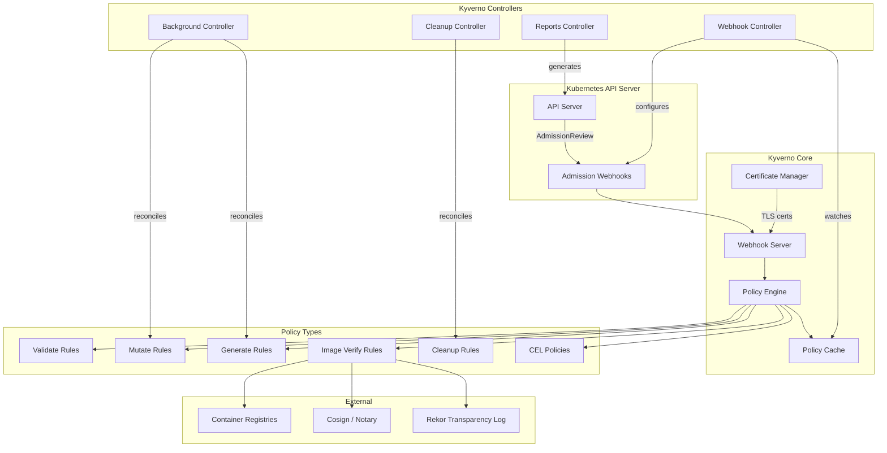
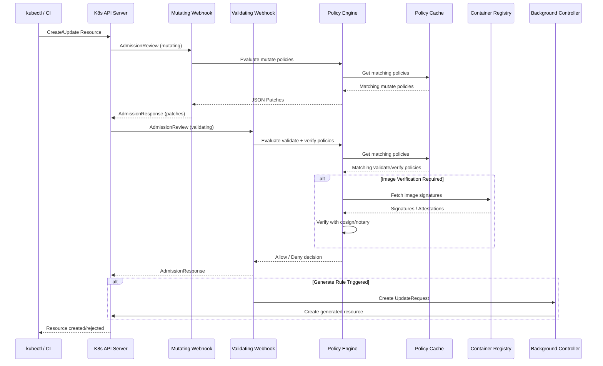
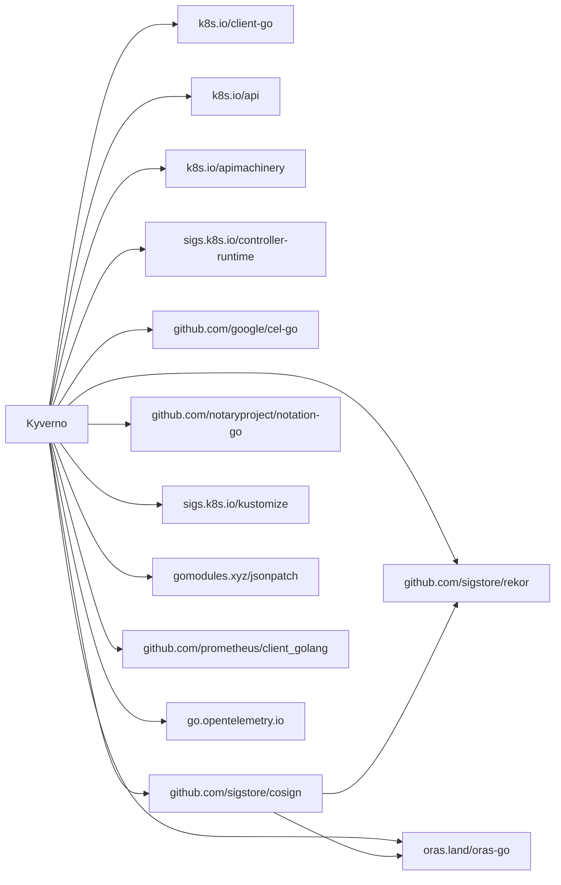

# Kyverno

> Kubernetes-native policy management for security, compliance, and operational best practices

| Metadata | |
|---|---|
| Repository | https://github.com/kyverno/kyverno |
| License | Apache License 2.0 |
| Primary Language | Go |
| Category | Security |
| Analyzed Release | `v1.17.0` (2026-02-02) |
| Stars (approx.) | 7,000+ |
| Generated by | Claude Opus 4.6 (Anthropic) |
| Generated on | 2026-02-08 |

## Overview

Kyverno solves the problem of policy management in Kubernetes environments where administrators need to
enforce security, compliance, and operational best practices without writing custom webhook code.
Unlike general-purpose policy engines that require learning a new language, Kyverno uses Kubernetes-native
constructs -- policies are defined as Kubernetes Custom Resources and can be managed with standard
Kubernetes tooling (kubectl, GitOps, Helm).

Kyverno positions itself as a Kubernetes-native alternative to OPA/Gatekeeper. While OPA requires
learning Rego, Kyverno policies are written in YAML with familiar Kubernetes patterns. The project
is a CNCF Incubating project and supports validation, mutation, generation, cleanup, and image
verification rules.

### Problems Solved

- Complex policy languages (Rego) present a barrier to adoption for Kubernetes operators
- No native way to mutate resources at admission time based on organizational policies
- Image verification and supply chain security require custom webhook implementations
- Background policy enforcement (for existing resources) requires separate tooling
- Dynamic webhook configuration is error-prone when managed manually

---

## Architecture Overview

---

## Core Components

### 1. Webhook Server

Responsibility: Handle incoming AdmissionReview requests from the Kubernetes API server, routing
them to the policy engine for evaluation, and returning admit/deny decisions with optional patches.

Key Files:
- `pkg/webhooks/server.go` -- Main webhook server implementation, HTTP handler setup
- `pkg/webhooks/types.go` -- Webhook-related type definitions
- `pkg/webhooks/handlers/` -- Individual admission request handlers
- `pkg/webhooks/resource/` -- Resource-level webhook handling (validate, mutate, generate)
- `pkg/webhooks/policy/` -- Policy-level webhook handling (policy validation on create/update)
- `pkg/webhooks/exception/` -- Policy exception handling
- `pkg/webhooks/celexception/` -- CEL-based exception handling
- `pkg/webhooks/globalcontext/` -- Global context entry webhook handling
- `pkg/webhooks/updaterequest/` -- Update request handling for background operations
- `pkg/webhooks/utils/` -- Shared webhook utilities

Design Patterns:
- Chain of Responsibility: Admission requests pass through a chain of handlers
- Strategy Pattern: Different handling strategies for validate, mutate, generate, and verify operations
- Adapter Pattern: Converts Kubernetes AdmissionReview to internal engine context

### 2. Policy Engine

Responsibility: Evaluate Kubernetes resources against compiled policies, executing validation,
mutation, generation, and image verification rules. The engine is the computational core of Kyverno.

Key Files:
- `pkg/engine/engine.go` -- Main engine orchestration, entry point for policy evaluation
- `pkg/engine/validation.go` -- Validation rule execution
- `pkg/engine/mutation.go` -- Mutation rule execution and JSON patch generation
- `pkg/engine/generation.go` -- Resource generation rule execution
- `pkg/engine/image_verify.go` -- Image verification (cosign, notary) rule execution
- `pkg/engine/background.go` -- Background policy processing for existing resources
- `pkg/engine/exceptions.go` -- Policy exception evaluation
- `pkg/engine/forceMutate.go` -- Force-mutation for testing and dry-run
- `pkg/engine/policy_context.go` -- Context object carrying request state through evaluation
- `pkg/engine/handlers/` -- Rule-type-specific evaluation handlers
- `pkg/engine/context/` -- Evaluation context management (variables, API call results)
- `pkg/engine/api/` -- Engine API interface definitions
- `pkg/engine/apicall/` -- External API call execution during evaluation
- `pkg/engine/anchor/` -- Anchor pattern matching (conditional, global, negation anchors)
- `pkg/engine/factories/` -- Factory methods for engine component creation

Design Patterns:
- Strategy Pattern: Different handlers for each rule type (validate, mutate, generate, verify)
- Context Object Pattern: `PolicyContext` carries all evaluation state through the pipeline
- Factory Pattern: Engine components are created via factories for testability
- Template Method Pattern: Common evaluation flow with rule-type-specific steps

### 3. Controller System

Responsibility: Manage the lifecycle of Kyverno's operational components including dynamic webhook
configuration, background policy processing, cleanup operations, and policy report generation.

Key Files:
- `cmd/kyverno/` -- Main admission controller binary
- `cmd/background-controller/` -- Background processing controller binary
- `cmd/cleanup-controller/` -- Cleanup policy controller binary
- `cmd/reports-controller/` -- Policy report controller binary
- `pkg/controllers/controller.go` -- Base controller utilities
- `pkg/controllers/webhook/` -- Dynamic webhook configuration controller
- `pkg/controllers/policycache/` -- Policy cache controller
- `pkg/controllers/report/` -- Policy report generation controller
- `pkg/controllers/cleanup/` -- Cleanup policy controller
- `pkg/controllers/certmanager/` -- TLS certificate management controller
- `pkg/controllers/exceptions/` -- Policy exception controller
- `pkg/controllers/globalcontext/` -- Global context entry controller
- `pkg/controllers/generic/` -- Generic controller utilities

Design Patterns:
- Controller Pattern: Standard Kubernetes controller-runtime reconciliation loops
- Separation of Concerns: Each controller handles a specific domain (webhooks, reports, cleanup)
- Leader Election: Controllers use leader election for high availability

### 4. CEL Policy Engine

Responsibility: Provide an alternative policy evaluation path using the Common Expression Language
(CEL), aligning with Kubernetes ValidatingAdmissionPolicy (VAP) and offering a more familiar
expression syntax for simple policies.

Key Files:
- `pkg/cel/engine/` -- CEL-based policy evaluation engine
- `pkg/cel/compiler/` -- CEL expression compilation
- `pkg/cel/libs/` -- Custom CEL libraries and functions
- `pkg/cel/matching/` -- Resource matching for CEL policies
- `pkg/cel/policies/` -- CEL policy definitions and processing
- `pkg/cel/autogen/` -- Auto-generation of CEL policies for pod controllers
- `pkg/cel/resource/` -- CEL resource evaluation
- `pkg/cel/utils/` -- CEL utility functions

Design Patterns:
- Interpreter Pattern: CEL expressions are compiled and evaluated against resource data
- Adapter Pattern: Bridges Kubernetes VAP semantics with Kyverno's policy model

### 5. Image Verification System

Responsibility: Verify container image signatures and attestations using cosign and notary,
ensuring supply chain security as part of admission control.

Key Files:
- `pkg/imageverification/` -- Image verification orchestration
- `pkg/imageverifycache/` -- Caching layer for verification results
- `pkg/cosign/` -- Cosign integration for signature verification
- `pkg/notary/` -- Notary integration for signature verification
- `pkg/registryclient/` -- OCI registry client for pulling image metadata
- `pkg/images/` -- Image reference parsing and manipulation
- `pkg/engine/image_verify.go` -- Engine-level image verification handler

Design Patterns:
- Strategy Pattern: Cosign and Notary are interchangeable verification strategies
- Cache-Aside Pattern: Verification results are cached to avoid redundant registry calls
- Decorator Pattern: Caching wraps the underlying verification logic

---

## Data Flow

---

## Key Design Decisions

### 1. Kubernetes-Native Policy Definition (CRDs over Custom Language)

Choice: Define policies as Kubernetes Custom Resources (ClusterPolicy, Policy) using YAML
rather than a custom policy language like Rego.

Rationale: Kubernetes operators already understand YAML and Kubernetes resource semantics. By
expressing policies as CRDs, Kyverno integrates naturally with existing Kubernetes tooling --
kubectl, Helm, ArgoCD, kustomize -- without requiring any new language or toolchain.

Trade-offs:
- Pro: Zero learning curve for Kubernetes-experienced operators
- Pro: Native integration with GitOps workflows and Kubernetes RBAC
- Pro: Policies are validated by the Kubernetes API server like any other resource
- Con: YAML-based rules are less expressive than a dedicated policy language
- Con: Complex logic requires deeply nested YAML structures
- Con: Debugging YAML-based policies can be harder than a proper language with stack traces

### 2. Split Controller Architecture

Choice: Decompose Kyverno into multiple independent controller binaries (admission, background,
cleanup, reports) rather than a single monolithic binary.

Rationale: Separation allows independent scaling, failure isolation, and resource allocation.
The admission webhook is latency-sensitive and should not be impacted by background processing.
Cleanup and reporting have different scaling characteristics.

Trade-offs:
- Pro: Independent scaling and resource allocation per concern
- Pro: Failure in background processing does not affect admission
- Pro: Clearer operational boundaries and monitoring
- Con: More complex deployment (multiple deployments, services)
- Con: Inter-controller communication adds complexity

### 3. Dynamic Webhook Configuration

Choice: Automatically configure MutatingWebhookConfiguration and ValidatingWebhookConfiguration
based on installed policies, rather than registering for all resources.

Rationale: Static webhook configurations that intercept all resources create unnecessary load
on both the API server and Kyverno. Dynamic configuration ensures Kyverno only receives
admission requests for resource types that have matching policies.

Trade-offs:
- Pro: Minimal API server overhead -- only relevant resources trigger webhooks
- Pro: Adding/removing policies automatically updates webhook scope
- Con: Webhook reconfiguration introduces brief windows of inconsistency
- Con: Complex controller logic to keep webhooks synchronized with policies

### 4. Integrated Image Verification

Choice: Build image verification (cosign, notary) directly into the admission control pipeline
rather than relying on a separate verification service.

Rationale: Image verification at admission time is a natural enforcement point. By integrating
it into the policy engine, Kyverno provides a unified policy experience where both
resource validation and image verification are expressed in the same policy format.

Trade-offs:
- Pro: Unified policy model for both resource and image policies
- Pro: No additional services to deploy for image verification
- Pro: Verification results can influence mutation and generation rules
- Con: Registry latency directly impacts admission latency
- Con: Kyverno must maintain compatibility with cosign and notary APIs

### 5. CEL Integration alongside Custom Engine

Choice: Support CEL (Common Expression Language) policies in addition to the custom YAML-based
engine, aligning with Kubernetes ValidatingAdmissionPolicy.

Rationale: Kubernetes 1.26+ introduced ValidatingAdmissionPolicy using CEL. By supporting
CEL, Kyverno can serve as an enhanced VAP implementation with additional features (mutation,
generation, image verification) while providing a migration path for CEL users.

Trade-offs:
- Pro: Alignment with Kubernetes-native ValidatingAdmissionPolicy direction
- Pro: CEL is more concise than YAML for complex boolean logic
- Pro: Enables gradual migration from/to Kubernetes native VAP
- Con: Two evaluation engines to maintain and document
- Con: Users must choose between YAML and CEL for each policy

---

## Dependencies

---

## Testing Strategy

Kyverno employs a multi-layered testing approach:

- Unit Tests: Core packages have comprehensive unit tests. The engine package includes
  `pkg/engine/background_test.go`, `pkg/engine/forceMutate_test.go`, `pkg/engine/exception_test.go`,
  and `pkg/engine/engine_exception_error_test.go`.

- Fuzz Testing: `pkg/engine/fuzz_test.go` provides fuzz testing for the engine to discover
  edge cases in policy evaluation.

- Controller Tests: `pkg/background/update_request_controller_test.go` and
  `pkg/background/reconcile_ur_status_test.go` test background controller reconciliation.

- Webhook Tests: The `pkg/webhooks/` directory contains handler-level tests.

- E2E Tests: The `config/e2e/` directory contains end-to-end test configurations that exercise
  the full admission control pipeline in a real Kubernetes cluster.

- CLI Tests: `cmd/cli/` provides CLI-level testing for policy validation and testing workflows.

- Image Verification Tests: `pkg/engine/attestation_test.go` tests image attestation verification.

- Integration Tests: Tests that exercise the interaction between multiple components, including
  webhook configuration, policy caching, and engine evaluation.

---

## Key Takeaways

1. Kyverno proves that Kubernetes-native design is a powerful strategy for adoption. By expressing
   policies as CRDs and using familiar YAML syntax, Kyverno eliminates the learning curve barrier
   that prevents many organizations from adopting policy-as-code. The trade-off is reduced
   expressiveness compared to a dedicated language like Rego.

2. The split controller architecture (admission, background, cleanup, reports) is an excellent
   example of separating latency-sensitive operations from batch processing. The admission webhook
   must respond within seconds, while background generation and report computation can take much
   longer -- and they should not compete for resources.

3. Dynamic webhook configuration is a key differentiator. By only intercepting resources that
   have matching policies, Kyverno minimizes its impact on the Kubernetes API server. This is
   a critical operational concern in large clusters where unnecessary webhook calls can cause
   significant latency.

4. Integrated image verification within the admission pipeline demonstrates the power of a
   unified policy model. Rather than deploying separate tools for resource validation and
   image verification, Kyverno provides a single point of enforcement for both concerns.

5. The CEL integration strategy shows pragmatic adaptation to Kubernetes platform evolution.
   Rather than viewing Kubernetes ValidatingAdmissionPolicy as a competitor, Kyverno embraces
   CEL as a complementary evaluation engine, positioning itself as an enhanced VAP implementation
   with additional capabilities.

---

## References

- [GitHub Repository: kyverno/kyverno](https://github.com/kyverno/kyverno)
- [Kyverno Documentation: How Kyverno Works](https://kyverno.io/docs/introduction/how-kyverno-works/)
- [Kyverno Introduction](https://kyverno.io/docs/introduction/)
- [Inside Kyverno: Admission Webhook Internals](https://medium.com/@rajrohan88293/inside-kyverno-a-deep-dive-into-admission-webhook-internals-f86d3be75d6b)
- [Komodor: Kyverno Features and Architecture](https://komodor.com/learn/kyverno-features-architecture-and-a-quick-tutorial/)
- [Kyverno Configuration Guide](https://kyverno.io/docs/installation/customization/)
