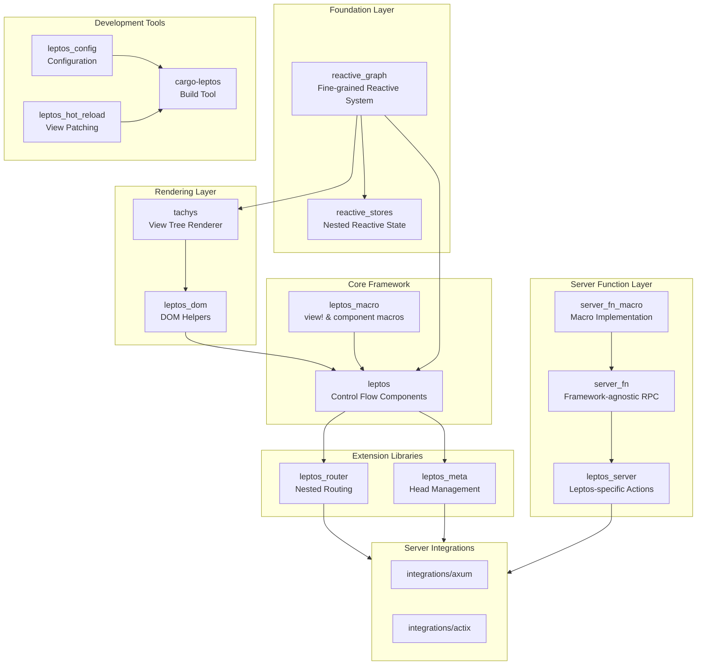
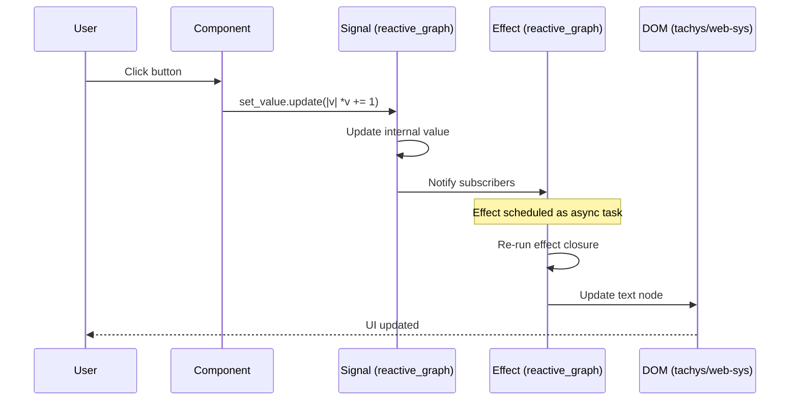
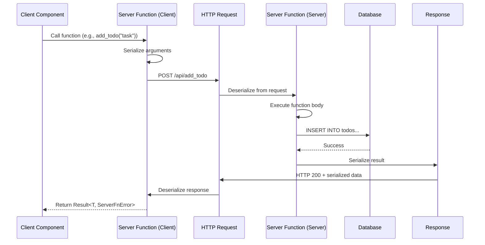
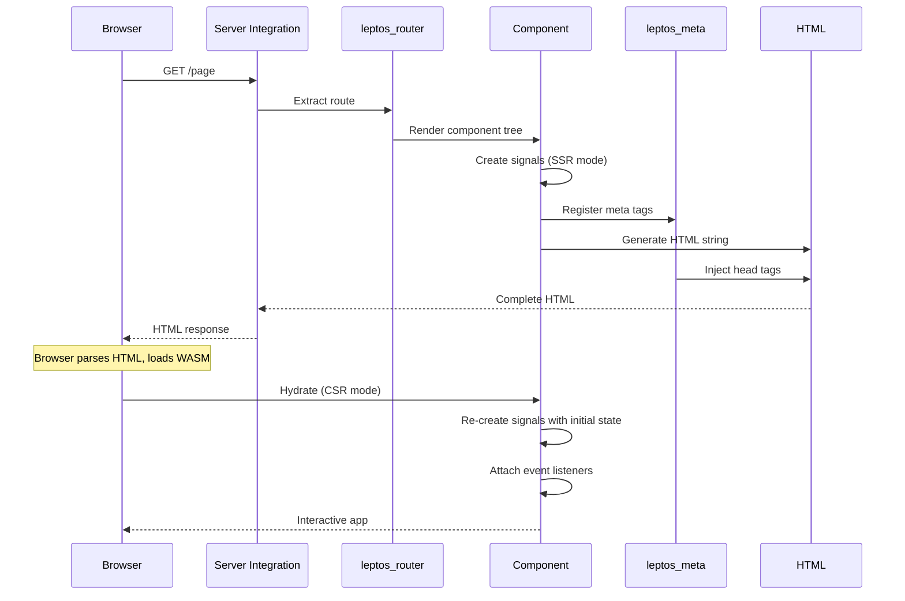
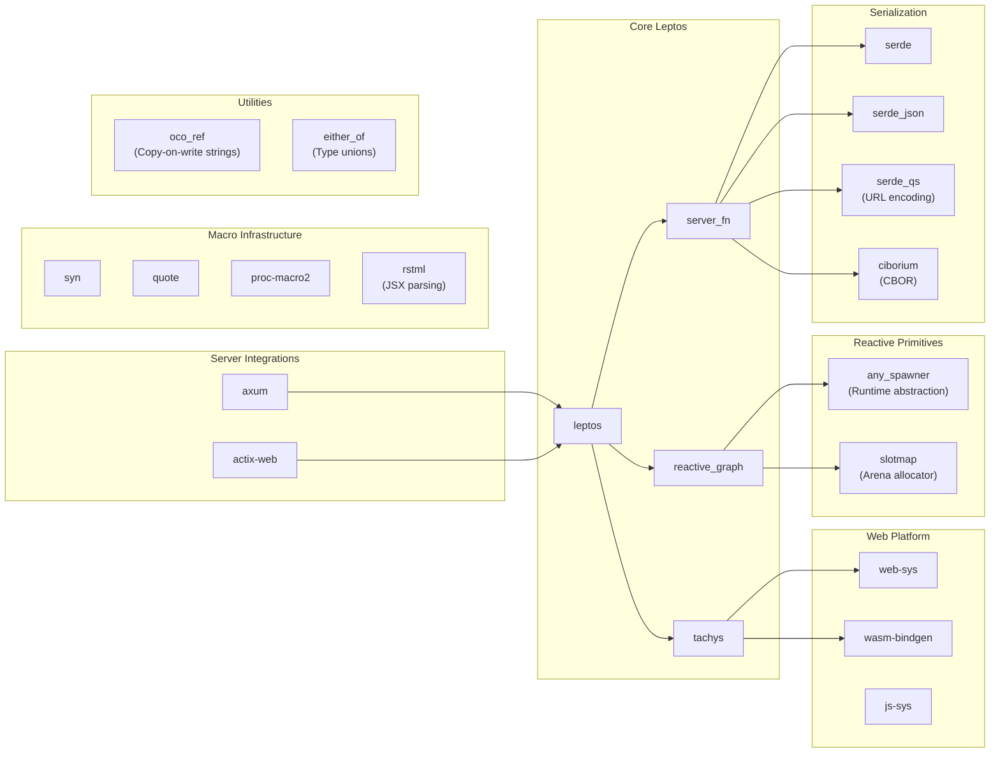

# Leptos

> Build fast web applications with Rust

| Metadata | |
|---|---|
| Repository | https://github.com/leptos-rs/leptos |
| License | MIT License |
| Primary Language | Rust |
| Category | Web Framework |
| Analyzed Release | `v0.8.15` (2025-12-19) |
| Stars (approx.) | 19,931 |
| Generated by | Claude Sonnet 4.5 (Anthropic) |
| Generated on | 2026-02-08 |

## Overview

Leptos is a full-stack, isomorphic Rust web framework that leverages fine-grained reactivity to build declarative user interfaces. It enables developers to create web applications that run in the browser (CSR), on the server (SSR), or hybrid mode with server-side rendering and client-side hydration, all while maintaining performance comparable to native JavaScript frameworks.

Problems it solves:

- Eliminating the virtual DOM overhead by using fine-grained reactive updates that only modify affected DOM nodes
- Providing a unified programming model for client and server code through isomorphic server functions
- Enabling type-safe full-stack development without maintaining separate REST or GraphQL API contracts
- Achieving exceptional performance in both SSR HTML generation and client-side rendering through compile-time optimizations

Positioning:

Leptos positions itself as a direct competitor to JavaScript frameworks like SolidJS and React, but with Rust's type safety and performance characteristics. Unlike Yew (which uses virtual DOM) and Dioxus (which prioritizes desktop apps), Leptos focuses on fine-grained reactivity and holistic web performance with features like streaming HTML rendering and optimized WASM binary sizes.

## Architecture Overview

Leptos employs a layered architecture where each layer can be used independently. At the foundation is the reactive graph system, which drives DOM updates through fine-grained dependency tracking. Above this sits the rendering layer (tachys), followed by framework primitives, and finally server integrations that connect everything together.

## Core Components

### Reactive Graph System (`reactive_graph/`)

- Responsibility: Fine-grained reactive dependency tracking and effect scheduling
- Key files: `reactive_graph/src/signal.rs`, `reactive_graph/src/computed.rs`, `reactive_graph/src/effect.rs`
- Design patterns: Observer pattern, Arena-based memory management, Async runtime agnostic scheduling

The reactive graph is implemented as a single runtime data structure using slotmap arenas. When creating a signal, ownership is transferred to the reactive system, and a Copy + 'static identifier is returned. This enables excellent ergonomics for sharing state without lifetime issues. The system tracks dependencies automatically at runtime, allowing dynamic dependency tracking where subscribers only react to currently active dependencies.

Signals are source nodes that can be directly mutated. Computations (memos) are derived values that automatically update when their dependencies change. Effects are side effects that synchronize the reactive system with the external world (like DOM updates). The algorithm is based on Reactively, implementing a push-pull evaluation strategy that minimizes unnecessary effect execution.

Effects are spawned as asynchronous tasks, making the system async runtime agnostic. Updates to signals happen synchronously, but effect execution is deferred to the next tick, allowing batching of updates and avoiding glitches.

### View Rendering Engine (`tachys/`)

- Responsibility: Statically-typed view tree rendering with backend abstraction
- Key files: `tachys/src/view/`, `tachys/src/html/`, `tachys/src/renderer/`
- Design patterns: Builder pattern, Type-state pattern, Renderer abstraction

Tachys provides a generic rendering system agnostic about reactivity and change detection. It defines traits like Render, RenderHtml, and Mountable that describe how views behave in different contexts. The builder syntax allows creating DOM elements imperatively, with the convention that static content is passed as T while dynamic content is passed as Fn() -> T.

The renderer is abstracted through the Renderer trait, allowing different backends. The primary implementation is Dom (for web-sys based rendering), but the architecture supports alternative renderers. The view tree is statically typed, enabling compile-time optimizations and zero-cost abstractions.

### DOM Integration (`leptos_dom/`)

- Responsibility: Bridging reactive system and DOM manipulation
- Key files: `leptos_dom/src/helpers.rs`, `leptos_dom/src/macro_helpers.rs`
- Design patterns: Helper pattern, SSR dual-mode rendering

This lightweight package provides utilities for mounting components and logging. It serves as the integration point between the reactive graph and tachys rendering, coordinating how reactive updates trigger DOM changes. The package maintains separate code paths for client-side rendering and server-side rendering, though the view macro generates optimized code for both modes.

### View Macro System (`leptos_macro/`)

- Responsibility: JSX-like syntax transformation and compile-time optimizations
- Key files: `leptos_macro/src/view/`, `leptos_macro/src/component.rs`
- Design patterns: Procedural macro, Static string optimization, Template compilation

The view! macro transforms JSX-like syntax into builder pattern calls. Unlike earlier versions that emitted different code paths, the current macro uses the builder syntax internally, making it more robust. However, it maintains separate optimizations for SSR that compile static portions of views into single &'static str literals at compile time, resulting in 3-4x faster HTML rendering compared to similar Rust frameworks.

The component macro is optional and can be replaced with plain functions. It provides convenience features like prop validation and simplified component definitions. The Params derive macro enables typed route parameters and query strings in the router.

### Server Functions (`server_fn/`, `server_fn_macro/`, `leptos_server/`)

- Responsibility: Isomorphic RPC enabling co-located client and server code
- Key files: `server_fn/src/lib.rs`, `server_fn_macro/src/lib.rs`, `leptos_server/src/lib.rs`
- Design patterns: RPC abstraction, Encoding strategy pattern, Protocol trait

Server functions provide a revolutionary development experience by allowing developers to write server-only code inline with client code. The #[server] macro generates two versions: on the server, it runs the function body directly; on the client, it serializes arguments and makes an HTTP request to an auto-generated endpoint.

The architecture is framework-agnostic, with server_fn and server_fn_macro designed to work with any Rust web framework. The system supports multiple encoding strategies through the codec module, including URL encoding, JSON, CBOR, and others. The Protocol trait abstracts HTTP and WebSocket protocols.

Leptos-specific functionality in leptos_server includes Actions, which are reactive wrappers around server functions that integrate with the reactive graph, enabling patterns like optimistic UI updates and loading states.

### Router (`router/`)

- Responsibility: Nested routing with SSR and client-side navigation
- Key files: `router/src/lib.rs`, `router/src/matching.rs`
- Design patterns: Nested routing pattern, Route matching algorithm

The router is directly ported from solid-router, using the same terminology and route-matching logic. It implements nested routing, where a single page is divided into independently-rendered parts. Routes can have nested child routes, with each level rendering its own content and outlet for children.

The router works isomorphically, handling both server-side rendering and client-side navigation. It uses Web fundamentals like links and forms rather than trying to replace them. Route parameters and queries are type-safe through the Params derive macro. The router coordinates with server integrations to extract routing data during SSR.

### Metadata Management (`meta/`)

- Responsibility: Managing head elements from within components
- Key files: `meta/src/lib.rs`
- Design patterns: Context provider pattern, SSR injection

Leptos_meta allows components to declaratively manage tags normally found in the head element (title, meta, link, etc.). During SSR, the server integrations collect these metadata declarations and inject them into the appropriate location in the HTML output. On the client side, the same components manipulate the document head directly.

This is implemented as a separate package following the principle that "what can be implemented in userland, should be," keeping the core framework minimal.

### Control Flow Components (`leptos/src/`)

- Responsibility: Reactive control flow primitives
- Key files: `leptos/src/show.rs`, `leptos/src/for.rs`, `leptos/src/suspense.rs`
- Design patterns: Conditional rendering, Keyed reconciliation, Async boundary pattern

Leptos provides components like Show (conditional rendering), For (efficient list rendering with keyed reconciliation), ErrorBoundary (error handling), Suspense (async resource loading), and Transition (managing async state transitions). These are implemented using public APIs from the other packages, demonstrating how the layered architecture enables composition.

The For component uses keyed diffing to efficiently update lists, only adding, removing, or moving DOM nodes when necessary. Suspense enables streaming SSR, where components can render their fallback state immediately and stream in actual content when async resources resolve.

### Server Integrations (`integrations/axum/`, `integrations/actix/`)

- Responsibility: Connecting framework to web servers
- Key files: `integrations/axum/src/lib.rs`, `integrations/actix/src/lib.rs`
- Design patterns: Adapter pattern, Middleware integration

Server integrations provide the glue between Leptos and web server frameworks. They handle routing extraction from leptos_router, metadata injection from leptos_meta, and server function endpoint registration. They also provide utilities for SSR rendering with different streaming strategies (in-order, out-of-order).

These packages eliminate boilerplate that applications would otherwise need, providing helpers that correctly wire together the various layers. They demonstrate the modular nature of the architecture, where different integrations can be created for different server frameworks.

## Data Flow

### Client-Side Reactivity Flow

### Server Function Call Flow

### SSR with Hydration Flow

## Key Design Decisions

### 1. Fine-Grained Reactivity Over Virtual DOM

- Choice: Implement a fine-grained reactive system that tracks dependencies at the signal level rather than using virtual DOM diffing
- Rationale: Virtual DOM requires running component functions on every state change and diffing entire trees, which is computationally expensive. Fine-grained reactivity only updates the specific DOM nodes affected by a signal change, eliminating diffing overhead entirely. This approach is inspired by SolidJS and Reactively, proven to be faster in benchmarks.
- Trade-offs: Requires more sophisticated dependency tracking and runtime infrastructure (the reactive graph arena). Debugging can be more challenging since the relationship between signals and effects is dynamic rather than explicit in component render functions. However, the performance benefits and elimination of rules like React's useCallback/useMemo make it worthwhile.

### 2. Copy + 'static Signals Through Arena Allocation

- Choice: Store reactive values in a slotmap arena and return Copy + 'static handles to users
- Rationale: Rust's ownership system makes it difficult to share mutable state across closures and async boundaries. By storing signals in a global arena and returning opaque indices, signals become trivially copyable and movable into any closure without lifetime issues. This is Leptos's key ergonomic innovation.
- Trade-offs: Values are not dropped based on lexical scope but on reactive scope (tied to UI lifetime). This is a form of manual memory management, though deterministic. Users must understand that signals are owned by the reactive system. The approach works well for UI applications where data lifetime matches UI lifetime but may be unintuitive for other use cases.

### 3. Framework-Agnostic Server Functions

- Choice: Implement server functions in separate packages (server_fn, server_fn_macro) that don't depend on Leptos
- Rationale: Server functions are a generally useful pattern for any Rust web framework. By making the core implementation framework-agnostic, it can be adopted by other projects (indeed, Dioxus uses Leptos server functions). This also follows the principle of keeping the core framework minimal.
- Trade-offs: Adds architectural complexity with multiple packages. Integration with Leptos's reactive system requires the additional leptos_server package. However, the separation maintains clean boundaries and enables reuse.

### 4. View Macro Compiles to Builder Syntax

- Choice: Have the view! macro expand to builder pattern calls rather than emitting optimized code directly
- Rationale: Early versions of Leptos used heavily optimized macro-generated code that was brittle and difficult to maintain. Moving to a builder-based approach makes the macro simpler and more robust. Static optimizations are still applied (especially for SSR), but the core architecture is more maintainable.
- Trade-offs: Slightly less opportunity for compile-time optimization compared to a fully custom macro expansion. However, the builder syntax can still be optimized effectively, and users can write builder code directly when needed, maintaining a clear mental model.

### 5. Layered, Independently Usable Architecture

- Choice: Structure the framework as layers where each can be used without the ones above it
- Rationale: Enables flexibility and prevents the framework from being monolithic. Users can use just the reactive system, or reactive system + rendering, or the full framework. This also makes testing easier and allows alternative implementations of higher layers (like custom routers or meta libraries).
- Trade-offs: More packages to maintain and understand. Dependency management becomes more complex. However, the clear separation of concerns makes the codebase more maintainable and allows experimentation with alternative approaches.

### 6. Async Runtime Agnostic Design

- Choice: Make the reactive system work with any async runtime (tokio, wasm-bindgen-futures, glib, etc.)
- Rationale: Different deployment targets require different runtimes (browser uses wasm-bindgen-futures, server might use tokio, GTK apps use glib). By scheduling effects as async tasks without depending on a specific runtime, Leptos works everywhere.
- Trade-offs: Cannot use runtime-specific features. Effect scheduling is always async, which means synchronous updates aren't immediately reflected in effects (though signal values update synchronously). This is generally acceptable for UI applications where async is already pervasive.

## Dependencies

## Testing Strategy

Leptos employs a multi-layered testing approach aligned with its modular architecture. Each layer is tested independently before integration testing validates the complete system.

Unit tests: Each package contains unit tests for its core functionality. The reactive_graph package includes tests for signal propagation, effect scheduling, and memory cleanup. The view macro has extensive tests using trybuild for compile-time error validation. Server functions test serialization/deserialization with various codecs.

Integration tests: The examples directory serves as integration tests, with examples like counter_without_macros demonstrating that the builder syntax works correctly. The hackernews examples test full-stack scenarios with SSR, hydration, and server functions. The js-framework-benchmark example validates performance claims.

CI/CD: GitHub Actions run tests on every PR across multiple Rust versions (MSRV is 1.88). Tests run for both wasm32-unknown-unknown (client) and native (server) targets. The workspace structure allows testing all packages together or individually. Cargo features are tested in combinations to ensure optional features work correctly.

## Key Takeaways

1. Fine-grained reactivity with arena-based ownership enables Rust web frameworks to achieve JavaScript-like ergonomics: By storing reactive values in an arena and returning Copy + 'static handles, Leptos solves the fundamental tension between Rust's ownership system and the needs of UI frameworks (shared mutable state across closures). This pattern could be applied to other Rust UI frameworks or game engines.

2. Layered architecture with minimal cores enables flexibility and experimentation: Leptos's decision to make each layer independently usable (reactive system, rendering, framework, integrations) means users can adopt incrementally or swap implementations. This approach to framework design, where "what can be implemented in userland, should be," keeps the core small and maintainable while enabling a rich ecosystem.

3. Isomorphic server functions eliminate boilerplate and maintain type safety across boundaries: The server function pattern demonstrated by Leptos (and adopted by other frameworks) shows how RPC can be made type-safe and ergonomic without sacrificing the Web's fundamentals. By generating both client and server code from a single function definition, it maintains the benefits of REST/GraphQL without the maintenance burden of separate API contracts.

## References

- [Leptos Official Website](https://leptos.dev/)
- [Leptos GitHub Repository](https://github.com/leptos-rs/leptos)
- [Leptos Book (Documentation)](https://leptos-rs.github.io/leptos/)
- [Leptos API Documentation](https://docs.rs/leptos/latest/leptos/)
- [ARCHITECTURE.md (Framework Design)](https://github.com/leptos-rs/leptos/blob/main/ARCHITECTURE.md)
- [Reactively: Super-charging fine-grained reactive performance](https://dev.to/modderme123/super-charging-fine-grained-reactive-performance-47ph)
- [Using Rust and Leptos to build beautiful, declarative UIs - LogRocket Blog](https://blog.logrocket.com/using-rust-leptos-build-beautiful-declarative-uis/)
- [cargo-leptos Build Tool](https://github.com/leptos-rs/cargo-leptos)
- [Awesome Leptos - Community Resources](https://github.com/leptos-rs/awesome-leptos)

Sources:
- [GitHub - leptos-rs/leptos: Build fast web applications with Rust.](https://github.com/leptos-rs/leptos)
- [leptos - Rust](https://docs.rs/leptos/latest/leptos/)
- [Home - Leptos](https://leptos.dev/)
- [leptos/ARCHITECTURE.md at main · leptos-rs/leptos](https://github.com/leptos-rs/leptos/blob/main/ARCHITECTURE.md)
