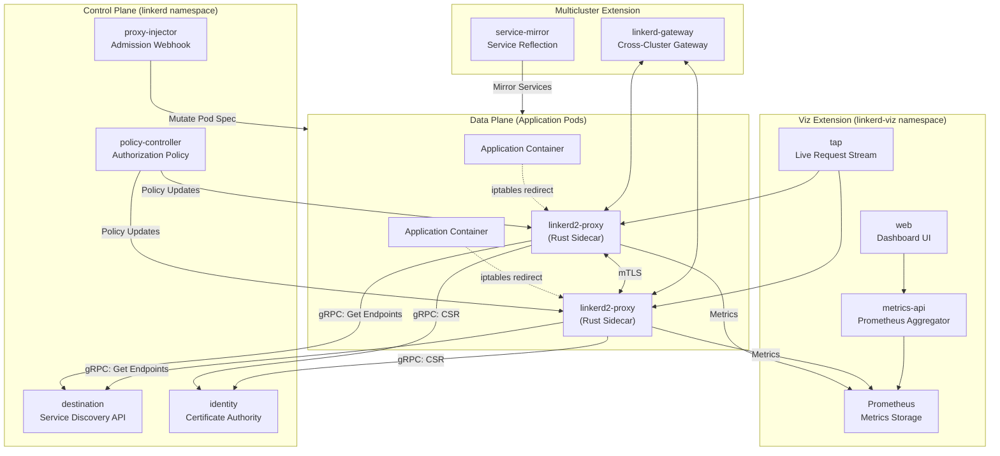
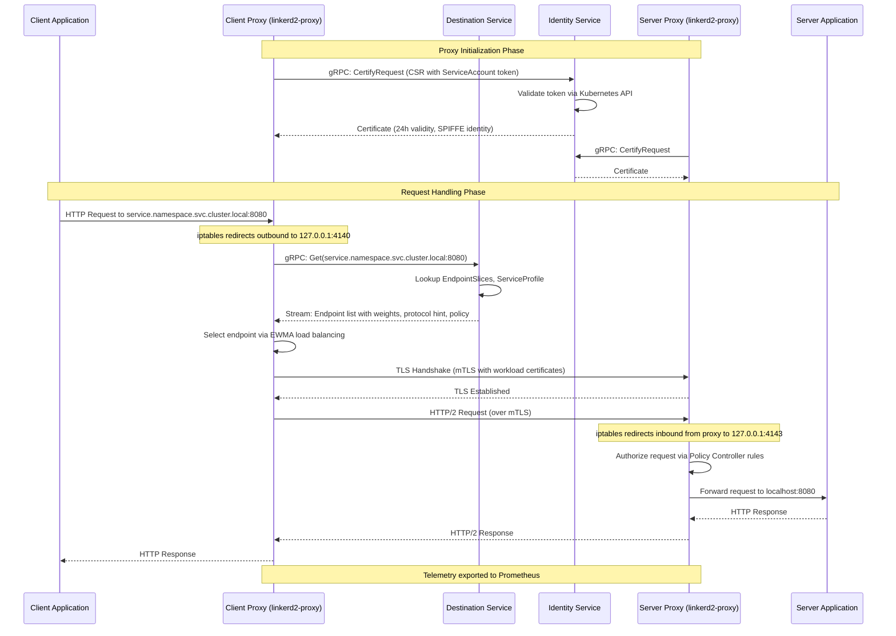
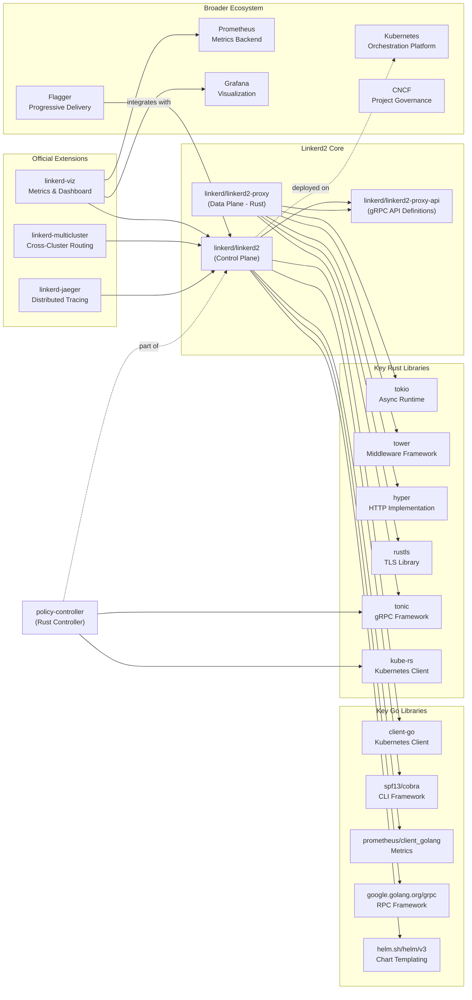

# Linkerd2

> Ultralight, security-first service mesh for Kubernetes

| Metadata | |
|---|---|
| Repository | https://github.com/linkerd/linkerd2 |
| License | Apache-2.0 |
| Primary Language | Go |
| Analyzed Release | `edge-26.1.4` (2026-01-29) |
| Stars (approx.) | 11,000+ |
| Generated by | Claude Opus 4.6 (Anthropic) |
| Generated on | 2026-02-08 |

## Overview

Linkerd2 is an ultralight, security-first service mesh for Kubernetes developed under the Cloud Native Computing Foundation (CNCF). It adds critical security, observability, and reliability features to Kubernetes workloads with zero application code changes required.

Problems it solves:

- Securing service-to-service communication with automatic mutual TLS (mTLS) without application-level configuration
- Providing real-time visibility into service traffic with golden metrics (success rate, request rate, latency) and live request taps
- Improving reliability through automatic layer-7 load balancing, retries, timeouts, and circuit breaking
- Enabling zero-trust security models by providing cryptographic workload identity based on Kubernetes ServiceAccounts

Positioning:

Linkerd2 distinguishes itself from other service meshes (Istio, Consul) by prioritizing simplicity and performance. It features the lightest-weight data plane proxy in the ecosystem (written in Rust), minimal resource overhead, and operational simplicity with a focus on "just works" defaults. Linkerd is widely adopted as the production-ready service mesh for organizations prioritizing reliability and minimal complexity.

## Architecture Overview

Linkerd2 follows a classic service mesh architecture with a clear separation between the control plane (written in Go) and the data plane (written in Rust). The control plane provides centralized policy, telemetry aggregation, and service discovery, while ultra-lightweight sidecar proxies handle all network traffic transparently.

## Core Components

### Data Plane Proxy (`linkerd2-proxy`)

- Responsibility: Transparent network proxy handling all inbound and outbound traffic for meshed pods
- Key files: `linkerd2-proxy` (separate repository), `linkerd/app/inbound`, `linkerd/app/outbound`
- Design patterns: Tower middleware stack, async runtime (Tokio), zero-copy I/O

The linkerd2-proxy is a purpose-built Rust proxy designed specifically for service mesh use cases. It operates transparently using iptables rules configured by the `linkerd-init` container to redirect all TCP traffic through the proxy. The proxy is fully asynchronous, built on the Tokio runtime and Tower middleware framework, providing modular request processing layers for features like load balancing, retries, timeouts, and telemetry.

Key characteristics include minimal memory footprint (typically under 10MB per proxy), sub-millisecond p99 latency overhead, and automatic protocol detection for HTTP/1.1, HTTP/2, gRPC, and arbitrary TCP. The proxy maintains long-lived, multiplexed connections between proxies to amortize TLS handshake costs and implements latency-aware load balancing using exponentially weighted moving averages (EWMA).

### Destination Service (`controller/api/destination`)

- Responsibility: Serving real-time service discovery information to data plane proxies
- Key files: `controller/cmd/destination/main.go`, `controller/api/destination/server.go`, `controller/api/destination/watcher/endpoints_watcher.go`
- Design patterns: gRPC streaming API, Kubernetes Informer pattern, watch-based caching

The Destination service is the primary control plane component that proxies interact with. It exposes a gRPC streaming API defined in `linkerd2-proxy-api` that proxies query to resolve service endpoints. When a proxy needs to send traffic to a Kubernetes Service, it opens a long-lived gRPC stream to Destination requesting endpoint information.

The service watches Kubernetes EndpointSlice (or Endpoints) resources using client-go Informers and translates them into proxy-consumable endpoint updates. It also handles ServiceProfile resources to provide per-route configuration like retries, timeouts, and traffic splits for canary deployments. The Destination service supports weighted endpoints for zone-aware routing and integrates with the multicluster extension to serve endpoints from remote clusters.

### Identity Service (`controller/cmd/identity`)

- Responsibility: Acting as a Certificate Authority (CA) to issue workload identity certificates
- Key files: `controller/cmd/identity/main.go`, `controller/identity/identity.go`, `pkg/tls/creds_watcher.go`
- Design patterns: gRPC certificate signing, file system credential watching, event-driven certificate rotation

The Identity service implements a lightweight Certificate Authority that issues short-lived TLS certificates to proxies for establishing mTLS connections. Each proxy receives a unique identity derived from its Kubernetes ServiceAccount in the form of a SPIFFE-compatible certificate.

On startup, each proxy generates a private key and sends a Certificate Signing Request (CSR) to the Identity service. The service validates the request against Kubernetes TokenReview and ServiceAccount APIs, then signs a certificate valid for 24 hours (configurable). The proxy automatically rotates certificates before expiration.

The Identity service watches its issuer credentials from the filesystem (typically mounted from a Kubernetes Secret) and automatically reloads them when updated, supporting online certificate rotation for the CA itself. Trust anchors are distributed to proxies via a ConfigMap mounted into each pod.

### Proxy Injector (`controller/proxy-injector`)

- Responsibility: Automatically injecting the Linkerd proxy sidecar into pods via Kubernetes admission webhook
- Key files: `controller/cmd/proxy-injector/main.go`, `controller/proxy-injector/webhook.go`
- Design patterns: Kubernetes Mutating Admission Webhook, annotation-based configuration

The Proxy Injector is a Kubernetes admission controller that intercepts pod creation requests. When a pod is created in a namespace with the `linkerd.io/inject: enabled` annotation, the injector mutates the pod specification to add two containers: `linkerd-init` (an init container that configures iptables rules) and `linkerd-proxy` (the sidecar proxy).

The injector intelligently configures the proxy based on pod annotations, namespace defaults, and cluster-wide configuration. It sets resource limits, environment variables for proxy configuration, volume mounts for identity certificates and trust anchors, and network policy ports. The injector also supports opt-out via `linkerd.io/inject: disabled` annotation.

### Policy Controller (`policy-controller`)

- Responsibility: Translating Kubernetes authorization policies into proxy-consumable policy updates
- Key files: `policy-controller/k8s/api/src`, `policy-controller/grpc`
- Design patterns: Custom Resource Definitions (CRDs), gRPC policy streaming, Rust controller runtime

The Policy Controller is a Rust-based Kubernetes controller that implements Linkerd's fine-grained authorization policies. It watches policy-related CRDs like Server, ServerAuthorization, AuthorizationPolicy, MeshTLSAuthentication, and NetworkAuthentication, translating them into policy decisions streamed to proxies via gRPC.

The controller uses the Kubernetes Rust client (kube-rs) and maintains indexed representations of policy resources. When proxies connect, they establish gRPC streams requesting policy information for specific workloads. The Policy Controller computes the effective policy based on namespace defaults, explicit policies, and cluster-wide settings, then streams updates whenever policies change.

This design allows for dynamic policy updates without proxy restarts and supports both default-deny and default-allow postures. The Policy Controller also handles authentication rules for both mTLS identities (based on ServiceAccount) and network-based authentication.

### Metrics API (`viz/metrics-api`)

- Responsibility: Aggregating and serving metrics from proxies via Prometheus queries
- Key files: `viz/metrics-api/api.go`, `viz/metrics-api/client/prometheus_client.go`
- Design patterns: Prometheus PromQL adapter, REST API, metrics aggregation

The Metrics API is part of the Viz extension and serves as an abstraction layer over Prometheus. It provides a higher-level API for retrieving service metrics without requiring clients to understand PromQL. The CLI (`linkerd stat`, `linkerd top`) and web dashboard query the Metrics API instead of Prometheus directly.

The API translates resource-oriented queries (e.g., "show me metrics for deployment/webapp") into PromQL queries, executes them against Prometheus, and formats results into structured responses. It supports aggregation across various Kubernetes resource types (Deployments, Pods, Services, Namespaces) and time windows.

### Tap Service (`viz/tap`)

- Responsibility: Providing real-time streaming of live requests passing through proxies
- Key files: `viz/tap/api/server.go`, `viz/tap/injector/webhook.go`
- Design patterns: gRPC streaming, event-driven architecture, opt-in tap injection

The Tap service allows operators to introspect live traffic in real-time, similar to `tcpdump` but at the application layer. When a user runs `linkerd tap`, the CLI establishes a gRPC stream to the Tap service, which in turn establishes tap streams with matching proxies.

Proxies expose a Tap API on their admin port (not exposed externally). The Tap service authenticates with proxies and requests matching traffic based on filters (source, destination, path, method). Proxies then stream request/response metadata (but not bodies) for matching requests. This provides powerful debugging capabilities without persistent storage overhead.

To enable tap functionality, the tap-injector admission webhook injects additional metadata into pods, including a skip-port annotation to prevent the proxy from interfering with tap traffic.

### Web Dashboard (`web`)

- Responsibility: Providing a browser-based UI for visualizing service mesh metrics and topology
- Key files: `web/app`, `web/srv/server.go`
- Design patterns: React SPA, REST API backend (Go), real-time metrics polling

The web dashboard is a React application served by a Go backend. It provides visual representations of service topology, golden metrics (success rate, request rate, latency), and live tap streams. The UI polls the Metrics API for metrics data and uses WebSocket connections for real-time tap streams.

The dashboard supports resource-level drilldown (cluster → namespace → workload → pod) and displays service dependencies inferred from observed traffic. It also provides access to Grafana dashboards for detailed metrics exploration.

## Data Flow

### Service-to-Service Request with mTLS

## Key Design Decisions

### 1. Rust-based Data Plane Proxy

- Choice: Implementing the sidecar proxy in Rust instead of C/C++ (like Envoy) or Go
- Rationale: Rust provides memory safety without garbage collection, eliminating both memory corruption vulnerabilities and GC-induced latency spikes. The Tokio async runtime and Tower middleware ecosystem enable building high-performance, modular network applications. Rust's zero-cost abstractions allow proxy features to be implemented as composable middleware layers without runtime overhead
- Trade-offs: Smaller developer pool compared to Go or C++. Longer compile times during development. Initial learning curve for contributors. However, the memory safety guarantees significantly reduce production security risks, and Rust's ecosystem has matured substantially since Linkerd2's inception in 2017

### 2. Transparent Proxying via iptables

- Choice: Using iptables rules to transparently intercept all pod traffic instead of requiring application-level proxy awareness
- Rationale: Enables zero-code-change integration with existing applications. Applications continue using standard network APIs (connect, bind, accept) while the proxy intercepts traffic at the network layer. This approach works with any protocol and any programming language, making Linkerd universally applicable across polyglot environments
- Trade-offs: Requires `NET_ADMIN` capability for the init container to configure iptables rules, which some security-conscious environments restrict. Alternative approaches (CNI plugin, Istio's ambient mesh) avoid this requirement but add operational complexity. Linkerd provides a CNI plugin option for environments that prohibit init containers with elevated privileges

### 3. Modular Control Plane with Discrete Services

- Choice: Decomposing the control plane into separate deployments (destination, identity, proxy-injector, policy-controller) instead of a monolithic control plane
- Rationale: Each service has a distinct responsibility and failure domain. The Destination service handles high-volume streaming requests from all proxies, while Identity handles infrequent certificate requests. Separating them allows independent scaling and resource allocation. The webhook-based components (proxy-injector, tap-injector) have different availability requirements than API services
- Trade-offs: Increased operational complexity with more components to monitor and upgrade. More Kubernetes resources (Deployments, Services, ConfigMaps). However, this design provides better fault isolation—a bug in proxy injection doesn't impact service discovery or certificate issuance

### 4. Streaming Service Discovery via gRPC

- Choice: Implementing Destination as a long-lived gRPC streaming API instead of poll-based REST or DNS-based discovery
- Rationale: Streaming enables real-time endpoint updates without polling overhead or DNS TTL delays. When an EndpointSlice changes, the Destination service immediately pushes updates to all relevant proxies. This provides sub-second endpoint convergence, critical for fast autoscaling and rolling updates. gRPC's efficient binary protocol and HTTP/2 multiplexing minimize overhead compared to JSON/REST polling
- Trade-offs: Increased control plane resource usage due to maintaining streams for every proxy. Network interruptions require stream re-establishment. However, the trade-off favors correctness and latency over resource efficiency—stale endpoint information leads to failed requests, while streaming ensures proxies always have current data

### 5. Automatic mTLS with ServiceAccount-based Identity

- Choice: Deriving workload identity from Kubernetes ServiceAccounts and enabling mTLS by default without user configuration
- Rationale: ServiceAccounts provide Kubernetes-native identity with built-in RBAC integration. Every pod has a ServiceAccount, eliminating the need for external identity systems. By making mTLS the default, Linkerd enforces zero-trust security without requiring users to understand certificate management, rotation, or PKI concepts. The "secure by default" approach prevents misconfiguration
- Trade-offs: Ties identity model to Kubernetes primitives, making Linkerd less suitable for non-Kubernetes environments. ServiceAccount granularity may be coarser than desired for some use cases (though this is mitigated by policy-based authorization). Automatic certificate rotation every 24 hours generates control plane load, but the trade-off favors security (short-lived certificates) over efficiency

### 6. Extension-based Architecture for Optional Features

- Choice: Implementing observability (Viz), multicluster, and Jaeger integration as optional extensions rather than core components
- Rationale: Maintains a minimal core installation footprint, allowing users to install only needed features. Organizations with existing Prometheus/Grafana deployments may not need Viz's bundled components. Multicluster is irrelevant for single-cluster deployments. Extensions are distributed as separate Helm charts, reducing the size and complexity of the base installation
- Trade-offs: Fragmented installation experience requiring multiple `linkerd install` commands. Version compatibility between core and extensions must be managed. Extension upgrades are decoupled from core upgrades. However, the modular approach respects the principle of least surprise and avoids forcing unnecessary components on users

## Dependencies

## Testing Strategy

Linkerd2 employs a comprehensive, multi-layered testing strategy covering unit, integration, and end-to-end tests across Go, Rust, and JavaScript components.

Unit tests: The Go codebase includes 128 test files following Go's convention of `*_test.go` files colocated with source code. The Rust proxy uses Cargo's built-in test framework with extensive unit tests for each crate. Tests use table-driven patterns in Go and property-based testing in Rust where applicable. Mock implementations of Kubernetes clients enable testing control plane logic without cluster dependencies.

Integration tests: The `test/` directory contains integration test suites that deploy Linkerd to real Kubernetes clusters (typically KinD - Kubernetes in Docker). Tests validate end-to-end scenarios like proxy injection, mTLS establishment, policy enforcement, and multicluster communication. The `linkerd/app/integration` crate in the proxy repo tests proxy behavior with mock control plane servers.

CI/CD: GitHub Actions workflows automate testing across multiple dimensions. Separate workflows test Go code (`go.yml`), Rust proxy builds (`rust.yml`), JavaScript dashboard code (`js.yml`), CLI builds (`cli-build.yml`), and integration tests (`integration.yml`). The `actions.yml` workflow orchestrates the full test suite on pull requests. Code coverage is tracked via Codecov (`codecov.yml`), and security scanning runs via CodeQL (`codeql.yml`).

Release process: The `release.yml` workflow automates release builds, generating multi-architecture container images for amd64 and arm64. Images are signed using cosign for supply chain security. Releases include checksum verification and SBOMs (Software Bill of Materials). The project publishes edge releases continuously from the main branch and stable releases on a regular cadence.

Testing philosophy: Linkerd emphasizes production-grade reliability through extensive integration testing in realistic environments. The project maintains a demo application (emojivoto) used for both user demos and integration test scenarios. Performance benchmarks track proxy latency and resource overhead across releases.

## Key Takeaways

1. Purpose-built components over general-purpose solutions: Linkerd's Rust proxy is specifically designed for service mesh sidecar use, achieving 10x lower memory footprint and latency compared to general-purpose proxies like Envoy. This demonstrates the value of domain-specific optimization when performance and resource efficiency are critical. The proxy excludes features irrelevant to sidecar scenarios (e.g., edge gateway capabilities) in favor of minimalism.

2. Streaming APIs for real-time convergence: The Destination service's gRPC streaming API provides a blueprint for building responsive distributed systems. Rather than relying on polling or eventual consistency, streaming updates enable sub-second propagation of configuration changes. This pattern is applicable to any system requiring real-time data synchronization across many clients.

3. Transparent integration via infrastructure-level interception: Using iptables for transparent proxying eliminates application-level integration requirements, enabling universal adoption across heterogeneous technology stacks. This approach contrasts with library-based solutions (Netflix Hystrix, AWS X-Ray SDK) that require per-language implementation and code changes. The lesson applies broadly: infrastructure-level abstractions scale better across polyglot environments than application-level libraries.

4. Security by default through safe defaults: Linkerd's automatic mTLS with zero configuration demonstrates the power of secure-by-default design. Rather than making security opt-in (which leads to insecure deployments), making it the default path ensures widespread adoption. This principle extends beyond service meshes—any system handling sensitive operations should make the secure path the easy path.

5. Extension-based modularity for operational flexibility: Separating optional features (Viz, multicluster) into extensions balances comprehensiveness with minimal footprint. Users pay the operational cost only for features they use. This design pattern applies to any platform product—a minimal core with optional extensions supports diverse use cases without imposing unnecessary complexity.

6. Control plane and data plane separation: The clear architectural boundary between control plane (policy, configuration) and data plane (request forwarding) enables independent scaling, failure isolation, and technology choices. The control plane can be slow and resource-intensive (Go with reflection, Kubernetes watches) while the data plane must be fast and efficient (Rust with zero-copy I/O). This separation of concerns is foundational to distributed system design.

7. Kubernetes-native identity and policy: Anchoring identity on ServiceAccounts and policy on Kubernetes RBAC primitives provides seamless integration without external dependencies. This demonstrates the value of leveraging platform primitives rather than building parallel identity systems. The trade-off is platform coupling, but for Kubernetes-specific tools, this alignment simplifies operations and cognitive load.

## References

- [Linkerd Official Documentation](https://linkerd.io/2-edge/overview/)
- [Architecture Reference](https://linkerd.io/2.10/reference/architecture/)
- [Linkerd Architecture: Components and Design Principles - Solo.io](https://www.solo.io/topics/linkerd/linkerd-architecture)
- [Under the hood of Linkerd's Rust proxy](https://linkerd.io/2020/07/23/under-the-hood-of-linkerds-state-of-the-art-rust-proxy-linkerd2-proxy/)
- [Workshop recap: A deep dive into Kubernetes mTLS with Linkerd](https://linkerd.io/2023/01/30/mtls-and-linkerd/)
- [Linkerd v2: Production Adoption and Rewrite - InfoQ](https://www.infoq.com/articles/linkerd-v2-production-adoption/)
- [GitHub - linkerd/linkerd2](https://github.com/linkerd/linkerd2)
- [GitHub - linkerd/linkerd2-proxy](https://github.com/linkerd/linkerd2-proxy)
- [GitHub - linkerd/linkerd2-proxy-api](https://github.com/linkerd/linkerd2-proxy-api)
