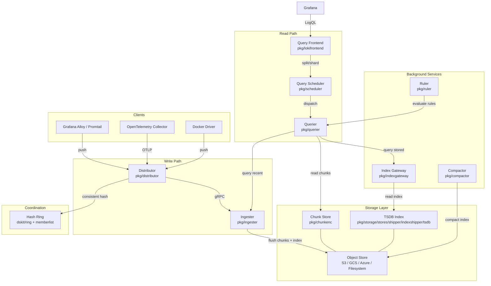
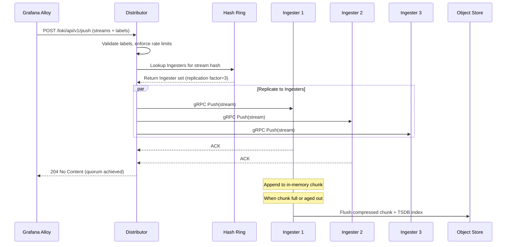
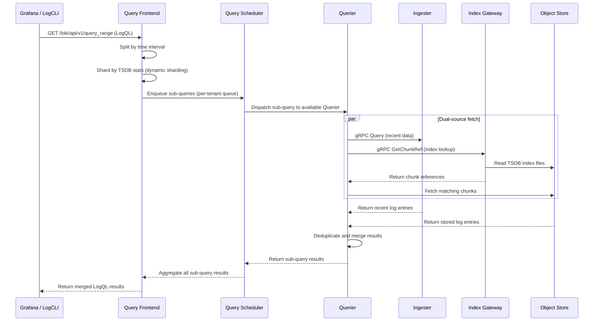
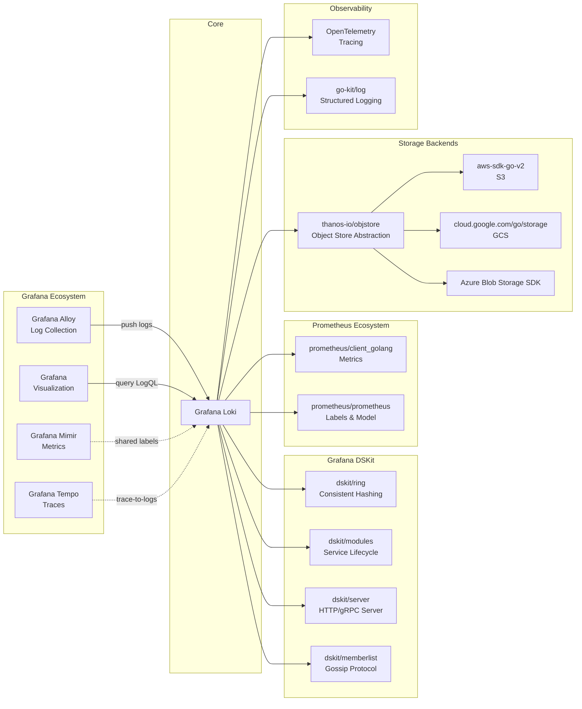

# Grafana Loki

> Like Prometheus, but for logs -- a horizontally-scalable, highly-available, multi-tenant log aggregation system

| Metadata | |
|---|---|
| Repository | https://github.com/grafana/loki |
| License | AGPL-3.0 |
| Primary Language | Go |
| Category | Monitoring |
| Analyzed Release | `v3.6.5` (2026-02-06) |
| Stars (approx.) | 27,500+ |
| Generated by | Claude Opus 4.6 (Anthropic) |
| Generated on | 2026-02-08 |

## Overview

Grafana Loki is an open-source log aggregation system designed to store and query logs from applications and infrastructure. Unlike traditional log aggregation systems (e.g., Elasticsearch), Loki does not perform full-text indexing on log contents. Instead, it indexes only a set of labels per log stream, compresses the raw log data, and stores both in object storage. This design makes Loki significantly cheaper to operate and simpler to manage, especially at scale.

Problems it solves:

- High cost and operational complexity of full-text indexing log systems at scale
- Lack of correlation between logs and metrics: Loki reuses Prometheus labels, enabling seamless switching between metrics and logs in Grafana
- Difficulty in operating distributed log systems: Loki runs as a single binary with a modular architecture, supporting monolithic, simple-scalable, and full microservices deployment modes
- Kubernetes-native log collection where Pod labels are automatically scraped and indexed

Positioning:

Loki positions itself as a "Prometheus for logs" within the Grafana observability stack (Grafana, Prometheus/Mimir, Tempo, Loki). Compared to Elasticsearch/OpenSearch-based solutions (ELK/EFK stacks), Loki trades query-time flexibility (no arbitrary full-text search) for dramatically lower storage costs and operational simplicity. Loki is often deployed alongside Grafana Alloy (the log collection agent) and Grafana for visualization, forming the "ALL" stack. Its label-based indexing approach makes it an especially good fit for cloud-native environments where metadata (namespace, pod, container) is already structured.

## Architecture Overview

Loki employs a modular microservices architecture where all components are compiled into a single binary and activated via the `-target` flag. The system separates concerns into a write path (Distributor, Ingester), a read path (Query Frontend, Query Scheduler, Querier), a storage layer (object store for chunks + TSDB index), and background maintenance (Compactor, Index Gateway). Components coordinate via a consistent hash ring (using memberlist for gossip-based peer discovery) and communicate over gRPC. The system supports three deployment modes: monolithic (all-in-one), simple-scalable (read/write/backend targets), and microservices (each component independently).

## Core Components

### Distributor (`pkg/distributor`)

- Responsibility: First component in the write path; validates, preprocesses, and routes incoming log data to the appropriate Ingesters
- Key files: `pkg/distributor/distributor.go`, `pkg/distributor/shardstreams/`, `pkg/distributor/clientpool/`
- Design patterns: Consistent Hashing via Ring, Replication, Rate Limiting

The Distributor receives HTTP push requests (POST /loki/api/v1/push) from agents such as Grafana Alloy. It validates incoming log streams (label validation, rate limiting, stream limits per tenant), hashes each stream's label set to determine the target Ingester(s) using the consistent hash ring, then replicates the data to `n` Ingesters in parallel (where `n` is the replication factor, typically 3). The Distributor is stateless and can be horizontally scaled behind a load balancer. It also supports writing to Kafka as an alternative to direct Ingester push, enabling the "ingest storage" architecture. Key functions include `Push()` which handles the complete write pipeline from validation through routing.

### Ingester (`pkg/ingester`)

- Responsibility: Buffers incoming log data in memory, builds compressed chunks, and flushes them to long-term object storage
- Key files: `pkg/ingester/ingester.go`, `pkg/ingester/instance.go`, `pkg/ingester/streams_map.go`, `pkg/chunkenc/memchunk.go`
- Design patterns: Write-Ahead Log (WAL), Ring-based lifecycle management, Chunk-based compression

The Ingester is the stateful write component that receives log entries from the Distributor via gRPC. Internally, it organizes data per-tenant using `instance` structs, each maintaining a map of active streams. Each stream accumulates log entries into in-memory chunks (`memchunk.go` in `pkg/chunkenc`). When a chunk reaches its target size or age threshold, it is compressed (supporting gzip, snappy, lz4, zstd, and flate), flushed to object storage, and the corresponding TSDB index entries are written. The Ingester uses a WAL (Write-Ahead Log) for crash recovery. It participates in the hash ring via a lifecycler, handling graceful handoffs during scaling. The Ingester also serves recent (un-flushed) data for read queries, making it part of both write and read paths.

### Query Frontend (`pkg/lokifrontend`)

- Responsibility: Receives LogQL queries from users, splits/shards them for parallel execution, and merges results
- Key files: `pkg/lokifrontend/frontend/`, `pkg/querier/queryrange/`, `pkg/querier/queryrange/roundtrip.go`
- Design patterns: Middleware chain (Tripperware), Query splitting, Dynamic sharding

The Query Frontend is an optional but recommended component that sits in front of the Querier. It accepts LogQL queries and applies a chain of middleware (called Tripperware) that performs query splitting by time interval, dynamic sharding based on TSDB index statistics (splitting into parallel sub-queries targeting ~300-600MB of data each), results caching, and retry logic. The split queries are dispatched to the Query Scheduler's internal queue. The Tripperware pipeline is defined in `pkg/querier/queryrange/roundtrip.go` and includes middlewares for: `SplitByInterval`, `ShardedQueries`, `CacheResults`, `Limits`, and `StatsCollector`. This design enables parallelism and prevents any single large query from monopolizing resources.

### Querier (`pkg/querier`)

- Responsibility: Executes LogQL queries by fetching data from both Ingesters (recent data) and long-term storage
- Key files: `pkg/querier/querier.go`, `pkg/logql/engine.go`, `pkg/logql/evaluator.go`
- Design patterns: Fan-out merge, Dual-source querying, Iterator-based streaming

The Querier is the actual query execution engine. It receives (possibly sharded) queries from the Query Scheduler and executes them using the LogQL engine (`pkg/logql/engine.go`). For each query, it fans out to both Ingesters (for recent, un-flushed data) and long-term storage via the Index Gateway (for historical data). It deduplicates overlapping results from both sources and merges them using an iterator-based streaming approach (`pkg/iter`). The LogQL engine supports log queries (returning log lines), metric queries (returning time-series from log data via aggregations like `rate()`, `count_over_time()`), and filter expressions. The Querier connects to the Query Scheduler as a worker, pulling queries from the per-tenant fair queue.

### Compactor (`pkg/compactor`)

- Responsibility: Compacts and optimizes index files in object storage; applies retention policies and processes delete requests
- Key files: `pkg/compactor/compactor.go`, `pkg/compactor/retention/`, `pkg/compactor/deletion/`
- Design patterns: Leader election via Ring, Background job processing, Table-based compaction

The Compactor runs as a background service that periodically merges small TSDB index files (produced by Ingesters) into larger, more efficient files. It uses ring-based leader election to ensure only one Compactor instance runs compaction at a time (though horizontal scaling modes are available for large deployments). Beyond index compaction, it enforces retention policies by deleting expired chunks and index entries, and processes log deletion requests submitted via the API. The generic compaction flow is: discover index files per table period, download and merge them using the registered `IndexCompactor`, apply retention if enabled, upload the compacted result, and clean up old files.

### Index Gateway (`pkg/indexgateway`)

- Responsibility: Serves index lookups to Queriers, abstracting direct access to the TSDB index in object storage
- Key files: `pkg/indexgateway/gateway.go`, `pkg/storage/stores/shipper/indexshipper/`
- Design patterns: Caching proxy, Ring-based sharding, gRPC service

The Index Gateway acts as a shared index query service. Rather than having each Querier download and cache TSDB index files locally, the Index Gateway centralizes this responsibility. It downloads index files from object storage, caches them locally, and serves metadata queries over gRPC. In sharded mode, Index Gateways participate in a ring to divide index ownership across instances, preventing redundant downloads. This dramatically reduces memory and disk usage on Querier instances.

## Data Flow

### Log Ingestion (Write Path)

### Log Query (Read Path)

## Key Design Decisions

### 1. Label-Only Indexing (No Full-Text Indexing)

- Choice: Index only metadata labels (key-value pairs) per log stream, not the contents of log lines
- Rationale: Full-text indexing is the primary cost driver in traditional log systems (Elasticsearch). By indexing only labels, Loki drastically reduces storage costs and operational complexity. Log contents are stored as compressed blobs and parsed at query time using LogQL filter expressions
- Trade-offs: Queries that grep through log contents are slower than pre-indexed searches. Users must rely on well-structured labels to narrow down log streams before filtering content. This makes label cardinality management critical

### 2. Single Binary with Modular Architecture

- Choice: All microservice components (Distributor, Ingester, Querier, etc.) compiled into one Go binary, activated via the `-target` flag
- Rationale: Simplifies deployment and development. Users can start with a single binary (`-target=all`) and later decompose into microservices as scale demands grow. The `dskit/modules` framework manages service dependencies and startup ordering
- Trade-offs: The binary is larger than it would be if split into separate services. All components share the same release cycle. Custom scaling of individual components requires running multiple instances with different `-target` flags

### 3. TSDB as Primary Index Store

- Choice: Adopted a Prometheus TSDB-inspired index format (replacing BoltDB-shipper) as the recommended index store since Loki 2.8
- Rationale: TSDB provides dynamic query sharding by storing per-chunk size metadata, enables more efficient index lookups, and avoids the operational burden of running a separate database. Index files are stored alongside chunks in object storage
- Trade-offs: Migration from older index formats (BoltDB) requires a transition period. TSDB does not benefit from index caching in the same way BoltDB did, requiring different tuning approaches

### 4. Consistent Hash Ring for Coordination

- Choice: Uses a consistent hash ring (via `grafana/dskit/ring`) with memberlist gossip protocol for service discovery and work distribution
- Rationale: Enables horizontal scaling without external coordination services. Ingesters, Index Gateways, Compactors, and Query Schedulers all use rings for distributing ownership of streams, index files, or leader election. Memberlist provides decentralized peer discovery without requiring Consul or etcd
- Trade-offs: Ring convergence takes time during scaling events. Memberlist gossip can be sensitive to network partitions. Token-based distribution may cause temporary imbalances during member changes

### 5. Multi-Tenancy as a First-Class Concern

- Choice: Built-in multi-tenancy with per-tenant isolation for ingestion limits, query limits, retention policies, and storage paths
- Rationale: Loki was designed for cloud-hosted operation at Grafana Labs. The `X-Scope-OrgID` header identifies tenants, and per-tenant configurations are enforced at every layer (Distributor rate limits, Ingester stream limits, Querier concurrency, Compactor retention)
- Trade-offs: Even single-tenant deployments carry the overhead of tenant-aware code paths. Configuration complexity increases with multi-tenant setups. Cross-tenant queries require explicit opt-in

## Dependencies

## Testing Strategy

Loki uses a multi-layered testing approach covering unit, integration, and end-to-end tests, with comprehensive CI running on GitHub Actions.

Unit tests: Each package contains `_test.go` files colocated with source code. Key packages like `pkg/logql`, `pkg/chunkenc`, `pkg/ingester`, and `pkg/querier` have extensive unit test suites. The `pkg/chunkenc/memchunk_test.go` tests cover chunk encoding/decoding, compression variants, and edge cases. LogQL parsing and evaluation are thoroughly tested via `pkg/logql/engine_test.go` and `pkg/logql/log/` test files.

Integration tests: The `integration/` top-level directory contains end-to-end tests that spin up Loki components (often in single-process mode) and exercise the full write/read path. Tests validate multi-tenant isolation, retention, and cross-component interactions. The `loki-canary` tool (`cmd/loki-canary`) serves as a continuous integration testing tool that writes known log entries and verifies they can be read back, detecting missing or delayed logs.

CI/CD: GitHub Actions workflows (`.github/workflows/check.yml` and others) run linting, unit tests, and build verification on every PR. The project uses `make` targets for build, test, and lint operations. OSS-Fuzz is integrated for continuous fuzzing of parsing and encoding components.

## Key Takeaways

1. Label-centric indexing as a cost optimization strategy: Loki demonstrates that by indexing only metadata (labels) rather than log content, a log system can achieve order-of-magnitude cost reductions in storage and operations. This trade-off works particularly well in cloud-native environments where structured metadata (Kubernetes labels) is abundant and queries can be narrowed by labels before scanning content. Other data-intensive systems can apply this principle: index the access pattern, not the data.

2. Single-binary modular architecture for deployment flexibility: The pattern of compiling all microservice components into a single binary (activated by target flags) is a powerful approach for infrastructure software. It allows users to start simple and decompose as they scale. The `grafana/dskit/modules` framework manages inter-service dependencies and lifecycle. This pattern, shared with Grafana Mimir and Tempo, provides a development model where engineers work on one codebase but deploy as many services.

3. Ring-based coordination eliminates external dependencies: By using consistent hash rings with gossip-based memberlist for peer discovery, Loki avoids hard dependencies on external coordination services (ZooKeeper, etcd, Consul). This significantly simplifies deployment and improves resilience. The same ring abstraction is reused across multiple subsystems (Ingester, Index Gateway, Compactor, Query Scheduler), providing a consistent pattern for distributed coordination.

4. Tripperware middleware chain for query optimization: The Query Frontend's Tripperware pattern -- a composable chain of HTTP round-trip middlewares -- is an elegant way to layer query optimizations (splitting, sharding, caching, retries) without coupling them. Each middleware is independently testable and can be enabled/disabled via configuration. This pattern is broadly applicable to any system that needs to transform, optimize, or cache upstream requests.

5. Ecosystem-driven design amplifies value: Loki's tight integration with the Grafana ecosystem (shared Prometheus labels, native Grafana data source, correlated traces via Tempo) creates a virtuous cycle where using one tool makes the others more valuable. For OSS projects, designing with ecosystem integration in mind -- rather than as an isolated tool -- dramatically increases adoption and stickiness.

## References

- [Grafana Loki Official Documentation](https://grafana.com/docs/loki/latest/)
- [Loki Architecture Overview](https://grafana.com/docs/loki/latest/get-started/architecture/)
- [Loki Components Reference](https://grafana.com/docs/loki/latest/get-started/components/)
- [Loki Deployment Modes](https://grafana.com/docs/loki/latest/get-started/deployment-modes/)
- [TSDB Index Storage](https://grafana.com/docs/loki/latest/operations/storage/tsdb/)
- [How We Designed Loki to Work Easily Both as Microservices and as Monoliths](https://grafana.com/blog/2019/04/15/how-we-designed-loki-to-work-easily-both-as-microservices-and-as-monoliths/)
- [Loki Design Document (original)](https://docs.google.com/document/d/11tjK_lvp1-SVsFZjgOTr1vV3-q6vBAsZYIQ5ZeYBkyM/view)
- [DeepWiki - Loki System Architecture](https://deepwiki.com/grafana/loki/2-system-architecture)
- [GitHub Repository](https://github.com/grafana/loki)
