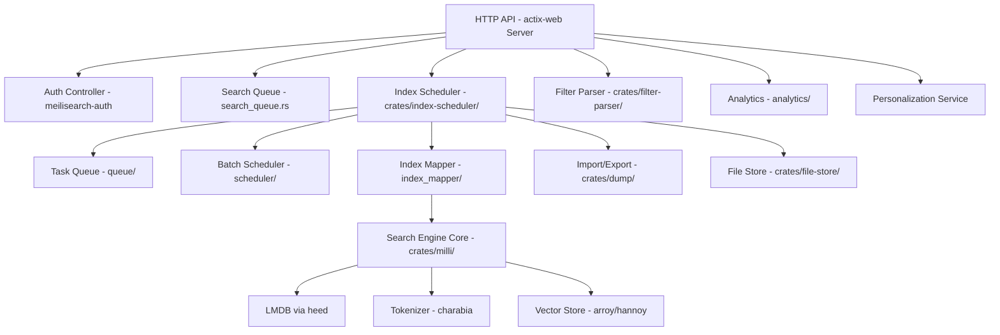
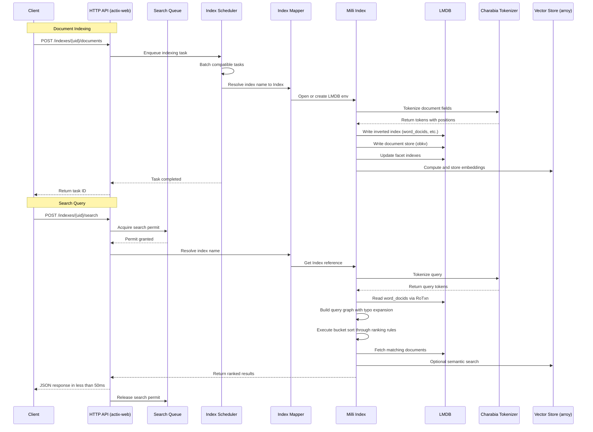
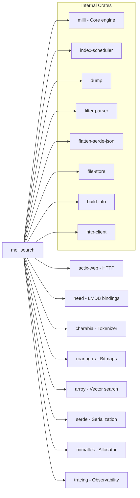

# Meilisearch

> Lightning-fast, typo-tolerant search engine providing full-text, semantic, and hybrid search via RESTful API

| Metadata | |
|---|---|
| Repository | https://github.com/meilisearch/meilisearch |
| License | MIT (dual-licensed) |
| Primary Language | Rust |
| Category | Search Engine |
| Analyzed Release | `v1.35.0` (2026-02-02) |
| Stars (approx.) | 55,000+ |
| Generated by | Claude Opus 4.6 (Anthropic) |
| Generated on | 2026-02-08 |

## Overview

Meilisearch is a lightning-fast, typo-tolerant search engine written in Rust that provides full-text, semantic, and hybrid search capabilities through a RESTful HTTP API. It is designed for end-user-facing search experiences where sub-50ms response times and search-as-you-type functionality are critical.

Meilisearch uses LMDB (Lightning Memory-Mapped Database) as its storage backend, combining the performance of memory-mapped I/O with ACID transaction guarantees. The engine supports a maximum index size of 80 TiB on Linux, though optimal performance is achieved under 2 TiB.

---

## Architecture Overview

---

## Core Components

### 1. Index Scheduler (crates/index-scheduler/src/lib.rs)

The index scheduler is the central orchestration component responsible for:
1. Mapping user-defined index names to internal milli `Index` instances
2. Scheduling and executing tasks (indexing, search, settings changes) in batches

Key architecture from `lib.rs`:
- Runs a dedicated background thread that processes tasks in a loop, waking on: initial launch, new task registration, or batch completion
- `IndexSchedulerOptions` struct configures paths for: `version_file_path`, `auth_path`, `tasks_path`, `update_file_path`, `indexes_path`, `snapshots_path`, `dumps_path`
- Uses `heed` (Rust LMDB bindings) for persistent task storage with databases: `CHAT_SETTINGS`, `PERSISTED`, `WEBHOOKS`
- `TASK_SCHEDULER_SIZE_THRESHOLD_PERCENT_INT = 40`: Tasks exceeding 40% of available space trigger scheduling changes

Sub-modules:
- `queue/mod.rs`, `queue/tasks.rs`, `queue/batches.rs`: Task queue management with batching
- `scheduler/`: Batch formation and execution logic
- `index_mapper/mod.rs`, `index_mapper/index_map.rs`: Maps string index names to LMDB environments
- `processing.rs`: Tracks currently-processing tasks via `ProcessingTasks`
- `lru.rs`: LRU cache for recently-accessed indexes
- `features.rs`: Feature flag management (`RoFeatures`)
- `versioning.rs`: Schema version tracking for upgrades
- `dump.rs`: Dump creation and loading
- `uuid_codec.rs`: UUID serialization for LMDB

### 2. Milli - Search Engine Core (crates/milli/src/)

Milli is the core search engine library, implementing indexing and search:

- `lib.rs`: Root module exporting core types:
  - `DocumentId = u32`: Internal document identifier
  - `FieldId = u16`: Field identifier within a document
  - `Position = u32`: Token position within a field
  - `Weight = u16`: Field weight for relevance scoring
  - Uses `mimalloc` as the global allocator for performance
  - `FxHasher32` / `FxHasher64`: Fast hash maps for internal use
  - `GeoPoint`: R-tree point type for geographic search

- `index.rs`: The `Index` struct wrapping an LMDB environment with 20+ named databases:
  - `MAIN`: General metadata (criteria, fields map, stop words, synonyms, settings)
  - `WORD_DOCIDS`, `EXACT_WORD_DOCIDS`: Word-to-document-set mappings
  - `WORD_PREFIX_DOCIDS`, `EXACT_WORD_PREFIX_DOCIDS`: Prefix-to-document-set mappings
  - `WORD_PAIR_PROXIMITY_DOCIDS`: Proximity-based relevance data
  - `WORD_POSITION_DOCIDS`, `WORD_FIELD_ID_DOCIDS`: Positional and field-level indexes
  - `FACET_ID_F64_DOCIDS`, `FACET_ID_STRING_DOCIDS`: Faceted search indexes
  - `FIELD_ID_DOCID_FACET_F64S`, `FIELD_ID_DOCID_FACET_STRINGS`: Facet value storage
  - `EXTERNAL_DOCUMENTS_IDS`: Maps external string IDs to internal u32 IDs
  - `VECTOR_STORE` (arroy): Vector embeddings for semantic search
  - `CELLULITE`: Additional vector storage

- LMDB codec modules in `heed_codec/`:
  - `RoaringBitmapCodec`, `CboRoaringBitmapCodec`, `BoRoaringBitmapCodec`: Compressed bitmap encoding for document ID sets
  - `FstSetCodec`: Finite State Transducer encoding for word dictionaries
  - `ObkvCodec`: Obkv format for document field storage
  - `FieldIdWordCountCodec`: Compound key encoding

### 3. Search Engine (crates/milli/src/search/)

The search subsystem implements ranking and relevance:

- `search/new/mod.rs`: Core search execution with `SearchContext` struct holding:
  - `index: &Index`, `txn: &RoTxn`: LMDB transaction context
  - `db_cache: DatabaseCache`: Caches database reads during a single search
  - `word_interner`, `phrase_interner`, `term_interner`: String interning for memory efficiency
  - `phrase_docids: PhraseDocIdsCache`: Cache for phrase query results
  - `synonym_cache: SynonymCache`: Avoids repeated synonym lookups

- Ranking rules (graph-based):
  - `Words`: Initial word matching
  - `Typo`: Typo tolerance via edit distance
  - `Proximity`: Word proximity scoring
  - `Fid`: Field ID weighting
  - `Position`: Word position within fields
  - `Exactness`: Exact match boosting
  - `ExactAttribute`: Full attribute exact match
  - `Sort`: Custom sort criteria
  - `GeoSort`: Geographic distance sorting
  - `VectorSort`: Semantic similarity sorting

- `bucket_sort.rs`: Core ranking algorithm that processes documents through ranking rule pipelines
- `query_graph.rs`, `query_term.rs`: Query parsing and expansion (typos, prefixes, synonyms)
- `graph_based_ranking_rule.rs`: Graph-based ranking rule framework
- `resolve_query_graph.rs`: Resolution of query graphs to document ID sets

- `search/hybrid.rs`: Hybrid search combining keyword and semantic results
- `search/facet/`: Faceted search and filtering
  - `filter.rs`, `filter_vector.rs`: Filter evaluation
  - `facet_distribution.rs`: Facet value distribution computation
  - `facet_range_search.rs`: Numeric range queries
  - `search.rs`: Facet value search (search within facets)

### 4. HTTP API Layer (crates/meilisearch/src/)

- `main.rs`: Application entry point using `actix-web` HTTP framework
  - Configures `mimalloc` as global allocator
  - Sets up tracing with `tracing-subscriber` (supports human and JSON log modes)
  - Initializes `IndexScheduler`, `AuthController`, `SearchQueue`, `PersonalizationService`, and `Analytics`
  - Runs on `actix-web::HttpServer` with configurable `KeepAlive`

- `search_queue.rs`: Rate-limits concurrent search operations to prevent resource exhaustion
- `analytics/`: Usage analytics collection
- `option.rs`: CLI option parsing via the `Opt` struct

### 5. Tokenization and Text Processing (charabia, crates/filter-parser/)

- `charabia`: External crate for multilingual tokenization supporting:
  - Language detection and language-specific tokenization
  - Unicode normalization (`CompatibilityDecompositionNormalizer`)
  - Script-aware segmentation (CJK, Latin, etc.)

- `crates/filter-parser/`: Custom filter expression parser
  - `lib.rs`: Filter grammar definition
  - `condition.rs`: Filter condition types (comparison, containment)
  - `value.rs`: Filter value parsing
  - `error.rs`: User-friendly parse error messages

---

## Data Flow

---

## Key Design Decisions

### 1. LMDB as Storage Backend

Meilisearch uses LMDB (via the `heed` Rust crate) rather than building a custom storage engine. LMDB provides:
- Memory-mapped I/O for zero-copy reads, enabling searches without data copying
- MVCC (Multi-Version Concurrency Control) for concurrent read transactions without locks
- ACID compliance with crash-safe writes
- Single-writer, multiple-reader model that aligns well with Meilisearch's architecture (one indexing thread, many search threads)

The tradeoff is that LMDB requires all data to fit within the mmap address space (limited to 80 TiB on 64-bit Linux) and does not compact freed space automatically.

### 2. Roaring Bitmaps for Document Sets

All document ID sets are stored as Roaring Bitmaps (via `RoaringBitmapCodec`, `CboRoaringBitmapCodec`). Roaring Bitmaps provide:
- Compressed storage that adapts to data density (array, bitmap, or run containers)
- O(1) set operations (union, intersection, difference) that are critical for combining query results
- Efficient serialization/deserialization for LMDB storage

The `CboRoaringBitmapCodec` (compressed byte-order) variant uses even more compact encoding for small sets. This is central to Meilisearch's search speed: ranking rules operate on bitmap intersections rather than scanning individual documents.

### 3. Graph-Based Ranking Rules

Rather than a simple scoring function, Meilisearch uses a pipeline of graph-based ranking rules that progressively refine results:
1. Words -> Typo -> Proximity -> Attribute -> Position -> Exactness
2. Each rule operates on a `RankingRuleOutput` containing a bitmap of candidate documents
3. The `bucket_sort` algorithm processes rules lazily, only expanding lower-priority rules when the higher-priority rule produces ties

This design enables Meilisearch to return results quickly even for large indexes, because it can stop processing once enough top results are found.

### 4. Charabia for Multilingual Tokenization

Rather than building tokenization in-house, Meilisearch uses the `charabia` crate (which they maintain) for language-aware text processing. Charabia handles:
- Script detection and segmentation (critical for CJK languages without whitespace)
- Unicode normalization using `CompatibilityDecompositionNormalizer`
- Language-specific stop words and stemming
- Localized attribute rules (`LocalizedAttributesRule`) for per-field language configuration

### 5. Task-Based Asynchronous Indexing

All write operations (document addition, settings changes, index creation) are asynchronous tasks managed by the `IndexScheduler`. Tasks are:
- Persisted to LMDB for crash recovery
- Batched when possible (multiple document additions to the same index)
- Processed by a single dedicated thread to avoid write contention
- Observable via task status API endpoints

This design ensures that search performance is never degraded by indexing operations, as the single-writer LMDB model means reads proceed without contention.

---

## Dependencies

Notable external dependencies:
- `actix-web`: High-performance async HTTP framework, providing the REST API
- `heed`: Safe Rust bindings to LMDB, the primary storage layer
- `charabia`: Multilingual tokenizer maintained by the Meilisearch team
- `roaring`: Compressed bitmap library for efficient document set operations
- `arroy` / `hannoy`: Approximate nearest neighbor search for vector/semantic search
- `mimalloc`: Microsoft's memory allocator, replacing the system allocator for better throughput
- `serde` / `serde_json`: Serialization framework for JSON API handling
- `tracing` / `tracing-subscriber`: Structured logging and distributed tracing
- `flate2`: Gzip compression for dump files
- `uuid`: UUID generation for task and index identification
- `rstar`: R-tree for geographic search
- `rhai`: Embedded scripting language for custom ranking

---

## Testing Strategy

Meilisearch employs a comprehensive Rust-native testing approach:

- Snapshot Testing: The `insta_snapshot.rs` module and `snapshots/` directories use the `insta` crate for snapshot-based testing, ensuring search results and task states match expected output
- Unit Tests: Each crate contains `#[cfg(test)]` modules. The `snapshot_tests` module in milli provides macro-based test utilities
- Integration Tests: The index-scheduler tests (`queue/batches_test.rs`, `queue/tasks_test.rs`) validate task scheduling, batching, and execution
- Benchmarks: The `crates/benchmarks/` directory contains Criterion-based benchmarks:
  - `indexing.rs`: Document indexing throughput
  - `search_songs.rs`, `search_wiki.rs`: Search latency on different dataset types
  - `search_geo.rs`: Geographic search performance
  - `filter_starts_with.rs`: Filter evaluation benchmarks
  - `sort.rs`: Sort performance
- Fuzz Testing: `crates/fuzzers/` and `crates/filter-parser/fuzz/` contain fuzzing harnesses for indexing and filter parsing
- Dump Compatibility: The `crates/dump/src/reader/` contains readers for all historical dump formats (v1 through v6) with compatibility conversion layers (`compat/v1_to_v2.rs` through `compat/v5_to_v6.rs`), ensuring upgrade paths are always tested
- Test Utilities: `crates/index-scheduler/src/test_utils.rs` provides mock environments for scheduler testing

---

## Key Takeaways

1. Meilisearch demonstrates that choosing the right storage primitive (LMDB + Roaring Bitmaps) can yield remarkable search performance. By operating on compressed bitmaps via set operations rather than scanning documents, search queries consistently complete in under 50ms even on large indexes.

2. The graph-based ranking rule pipeline is an elegant approach to relevance scoring. Rather than computing a single score per document, the pipeline progressively refines candidate sets through increasingly fine-grained criteria (Words -> Typo -> Proximity -> Attribute -> Position -> Exactness), with lazy evaluation ensuring efficiency.

3. The task-based asynchronous architecture cleanly separates the read path (search) from the write path (indexing). The search queue rate limiter ensures that concurrent searches cannot exhaust resources, while the single-writer indexing thread eliminates write contention on LMDB.

4. Meilisearch's investment in multilingual support (via charabia) and hybrid search (keyword + vector via arroy) positions it well for the evolving search landscape where AI-powered retrieval is becoming standard. The integration of vector search alongside traditional inverted index search in a single engine reduces deployment complexity.

5. The Rust monorepo structure with well-defined crate boundaries (milli, index-scheduler, dump, filter-parser, etc.) enables strong compile-time guarantees while maintaining clean separation of concerns. The use of mimalloc as the global allocator and fxhash for internal hash maps shows attention to performance at every level.

---

## References

- [GitHub Repository](https://github.com/meilisearch/meilisearch)
- [DeepWiki - Meilisearch Architecture](https://deepwiki.com/meilisearch/meilisearch)
- [Rust in Production: MeiliSearch - Serokell](https://serokell.io/blog/rust-in-production-meilisearch)
- [Meilisearch - How It Compares to Algolia and Typesense](https://www.meilisearch.com/blog/algolia-vs-typesense)
- [Searching for the Edge - Felicis on Meilisearch](https://www.felicis.com/insight/meili)
- [Meilisearch 1.0 Discussion - Hacker News](https://news.ycombinator.com/item?id=34707727)
- [Code Fibers - Hands-on with Meilisearch](https://codefibershq.com/blog/hands-on-meilisearch-a-next-generation-search-engine-for-modern-web)
