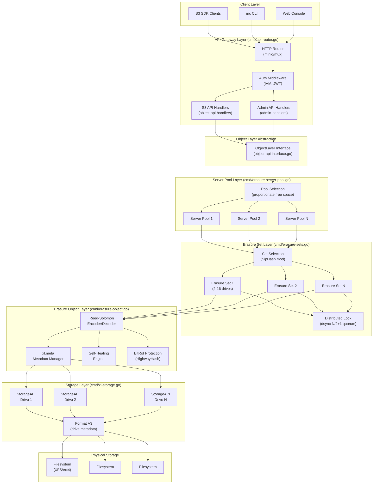
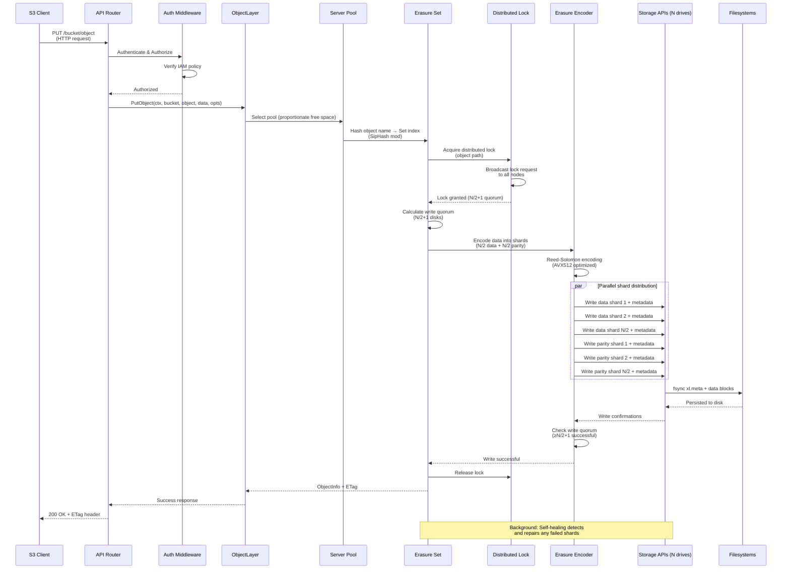
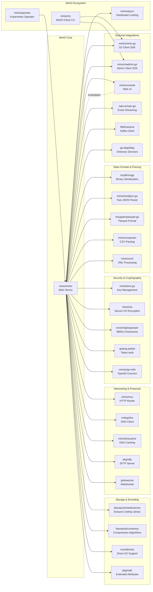

# MinIO

> A high-performance, S3-compatible object storage solution for AI/ML, analytics, and data-intensive workloads

| Metadata | |
|---|---|
| Repository | https://github.com/minio/minio |
| License | GNU Affero General Public License v3.0 (AGPLv3) |
| Primary Language | Go |
| Analyzed Release | `RELEASE.2025-10-15T17-29-55Z` (2025-10-16) |
| Stars (approx.) | 60,000+ |
| Generated by | Claude Opus 4.6 (Anthropic) |
| Generated on | 2026-02-08 |

## Overview

MinIO is an open-source, high-performance object storage system designed for cloud-native applications. It provides an S3-compatible API and is optimized for large-scale data infrastructure supporting AI/ML workloads, analytics pipelines, and modern application architectures. Released under AGPLv3, MinIO can be deployed as a single binary with no external dependencies, making it suitable for both on-premises and cloud environments.

Problems it solves:

- Providing high-performance object storage for AI/ML training data and model artifacts at petabyte/exabyte scale
- Enabling S3-compatible storage in private clouds, edge locations, and air-gapped environments without AWS dependency
- Delivering enterprise-grade data protection through erasure coding with configurable redundancy levels
- Supporting multi-tenant environments with strong isolation and per-tenant performance guarantees

Positioning:

MinIO is positioned as the leading open-source alternative to AWS S3, widely adopted in Kubernetes environments and private cloud deployments. It serves as the storage backend for major platforms including Red Hat OpenShift, VMware Tanzu, and various Hadoop/Spark distributions. With over 60,000 GitHub stars, MinIO has become the de facto standard for S3-compatible object storage in self-hosted environments.

## Architecture Overview

MinIO employs a distributed, shared-nothing architecture built on erasure coding. The system is organized into server pools, erasure sets, and storage drives forming a three-tier hierarchy. All components communicate via HTTP/HTTPS with a REST API, and the system uses a quorum-based distributed locking mechanism (dsync) for consistency. Data is protected through Reed-Solomon erasure coding, with each object sharded across multiple drives within an erasure set.

## Core Components

### API Gateway Layer (`cmd/api-router.go`, `cmd/object-api-handlers.go`)

- Responsibility: HTTP request routing, S3 API compatibility, and protocol translation
- Key files: `cmd/api-router.go`, `cmd/object-api-handlers.go`, `cmd/admin-handlers.go`
- Design patterns: Handler chain pattern, middleware composition, adapter pattern

The API Gateway provides the external interface for MinIO, implementing the S3 REST API specification. It uses the minio/mux router to dispatch requests to appropriate handlers based on HTTP method, path, and query parameters. The `objectAPIHandlers` struct wraps the ObjectLayer interface and translates S3 operations (PutObject, GetObject, DeleteObject, etc.) into internal method calls. Middleware layers handle authentication (IAM policies, JWT tokens, LDAP), request throttling, metrics collection, and tracing. The gateway supports additional protocols including FTP/SFTP through separate handler chains.

### ObjectLayer Interface (`cmd/object-api-interface.go`)

- Responsibility: Abstraction layer defining core storage operations
- Key files: `cmd/object-api-interface.go`, `cmd/object-api-common.go`
- Design patterns: Interface segregation, strategy pattern

The ObjectLayer interface defines the contract for all storage operations, decoupling the API layer from the underlying storage implementation. Key methods include `PutObject`, `GetObject`, `DeleteObject`, `ListObjects`, `CopyObject`, and bucket management operations. This abstraction enables multiple backend implementations (erasure coded, single disk, gateway mode) and simplifies testing through mock implementations. The interface includes rich options structures (`ObjectOptions`, `MakeBucketOptions`) that encapsulate operation parameters, versioning state, encryption settings, and replication metadata.

### Server Pool Layer (`cmd/erasure-server-pool.go`)

- Responsibility: Managing multiple independent storage pools and load balancing across them
- Key files: `cmd/erasure-server-pool.go`, `cmd/erasure-server-pool-rebalance.go`, `cmd/erasure-server-pool-decom.go`
- Design patterns: Composite pattern, load balancing strategy

Server pools enable horizontal expansion of MinIO clusters by adding new sets of drives without disrupting existing operations. Each pool is a self-contained erasure-coded cluster with its own SLA guarantees (read/write quorum). The `erasureServerPools` type manages multiple pools and implements the ObjectLayer interface. New objects are placed in pools using a proportionate free space algorithm: a random number is generated based on weighted probabilities derived from available capacity per pool. This ensures balanced utilization while maintaining predictable placement. Pools support decommissioning (migrating data out) and rebalancing (redistributing objects across pools) for operational flexibility.

### Erasure Set Layer (`cmd/erasure-sets.go`)

- Responsibility: Partitioning drives into erasure coding groups and distributing objects across sets
- Key files: `cmd/erasure-sets.go`, `cmd/erasure-common.go`
- Design patterns: Consistent hashing, partition tolerance

Erasure sets are the fundamental erasure coding units in MinIO. Each set contains 2-16 drives (typically 16 for optimal performance/redundancy trade-off) and forms an independent failure domain. The number of sets is determined automatically using GCD (Greatest Common Divisor) of acceptable erasure set sizes (4, 8, 12, 16) to minimize the number of sets while ensuring uniform distribution. Object placement within sets uses SipHash (a cryptographically strong hash function) with the object name as input, providing consistent, deterministic routing: `sipHashMod(objectName, setCount, deploymentID)`. This ensures the same object always maps to the same set, enabling efficient lookups without a metadata index.

### Erasure Object Layer (`cmd/erasure-object.go`, `cmd/erasure-coding.go`)

- Responsibility: Reed-Solomon erasure coding, data sharding, and reconstruction
- Key files: `cmd/erasure-object.go`, `cmd/erasure-encode.go`, `cmd/erasure-decode.go`, `cmd/erasure-healing.go`
- Design patterns: Encoder/decoder pattern, parallel processing, self-healing

This component implements the core erasure coding logic using the klauspost/reedsolomon library optimized with SIMD instructions (AVX512, NEON). Objects are split into N/2 data shards and N/2 parity shards by default (configurable via storage classes). Write operations encode data in parallel across available drives, requiring a write quorum of N/2+1 successful writes to succeed. Read operations can reconstruct the original data from any N/2+1 available shards, providing high fault tolerance. The self-healing engine continuously monitors drive health and automatically reconstructs missing shards onto healthy drives. BitRot protection uses HighwayHash checksums computed at write time and verified at read time to detect silent data corruption.

### Storage API Layer (`cmd/xl-storage.go`, `cmd/xl-storage-format-v2.go`)

- Responsibility: Abstraction over filesystem operations and drive management
- Key files: `cmd/xl-storage.go`, `cmd/xl-storage-disk-id-check.go`, `cmd/xl-storage-format-v2.go`
- Design patterns: Adapter pattern, filesystem abstraction

The StorageAPI interface provides a uniform abstraction over physical drives, hiding filesystem-specific details. Each drive is formatted with MinIO metadata including deployment ID, pool index, set index, and disk index stored in `format.json`. Objects are stored as files with paths like `/bucket/prefix/object/xl.meta` where `xl.meta` contains object metadata in MessagePack format (versioning information, user metadata, checksums, erasure coding parameters, inline data for small objects). The implementation includes disk health monitoring, automatic reconnection for transient failures, and drive identification validation to prevent drive substitution attacks. Direct I/O is used when available to bypass OS page cache for predictable performance.

### Distributed Locking (`internal/dsync`)

- Responsibility: Distributed lock management for consistency across cluster nodes
- Key files: `internal/dsync/` package (external minio/dsync library)
- Design patterns: Quorum consensus, lock leasing

MinIO implements dsync, a custom distributed locking system designed for up to 32 nodes. Lock requests are broadcast to all nodes in the erasure set, and a lock is granted if N/2+1 nodes respond positively within the timeout period. This quorum-based approach ensures consistency without requiring a separate consensus layer like Raft or Paxos. Locks are acquired with timeouts and include automatic stale lock cleanup to handle node failures. The system achieves ~75,000 locks/second at 50% CPU utilization. Locks are taken at the object level during write operations and bucket level during metadata updates, providing fine-grained concurrency control.

## Data Flow

### PutObject Operation Flow

## Key Design Decisions

### 1. Reed-Solomon Erasure Coding with Configurable Parity

- Choice: Using Reed-Solomon algorithm with default N/2 data and N/2 parity shards, allowing up to 16 drives per erasure set
- Rationale: Reed-Solomon provides optimal storage efficiency while tolerating up to N/2 drive failures. The 16-drive limit balances network chattiness (more shards = more network round trips) with redundancy needs. Reed-Solomon encoding is accelerated with SIMD instructions (AVX512 on x86, NEON on ARM) achieving multi-GB/s throughput per core
- Trade-offs: Fixed erasure set sizes limit flexibility compared to dynamic schemes. Increasing parity beyond N/2 is possible via storage classes but reduces capacity efficiency. Rebuilding requires reading N/2+1 shards, which can stress surviving drives during recovery

### 2. Shared-Nothing Architecture with Quorum-Based Locking

- Choice: No shared metadata store; using distributed quorum locks (dsync) instead of Raft/Paxos consensus
- Rationale: Eliminates single points of failure and metadata bottlenecks. The N/2+1 quorum requirement ensures consistency without complex leader election. This architecture scales linearly because each erasure set operates independently without cross-set coordination. Avoiding external dependencies (etcd, Consul) simplifies deployment and reduces operational complexity
- Trade-offs: Maximum 32 nodes per erasure set (dsync limitation). Lock acquisition involves broadcasting to all nodes in the set, creating O(N²) network traffic for concurrent lock requests. Stale locks require timeout-based cleanup (typical timeout: 1 minute) which can delay operations if nodes crash

### 3. Server Pools for Non-Disruptive Expansion

- Choice: Supporting multiple independent server pools, each with its own erasure sets, with proportionate free space load balancing
- Rationale: Adding capacity by creating new pools eliminates the need to rebalance existing data (which is I/O intensive and risky). Each pool maintains the same read/write quorum guarantees, ensuring consistent SLAs. The proportionate allocation algorithm balances write load based on available capacity, preventing hotspots. Pools enable hardware heterogeneity (mixing different server generations) without performance penalties
- Trade-offs: Objects cannot be moved between pools automatically (requires explicit rebalancing operation). Read operations must check multiple pools if the object's pool is unknown (mitigated by caching the object-to-pool mapping). Decommissioning a pool requires copying all data to other pools, which is time-consuming for large datasets

### 4. Inline Metadata with MessagePack Encoding

- Choice: Storing object metadata in `xl.meta` files using MessagePack format, with support for inline data for small objects
- Rationale: Co-locating metadata with data shards eliminates the need for a separate metadata service and reduces read latency. MessagePack provides compact binary serialization with schema evolution support. Inlining small objects (<128KB default) directly into xl.meta avoids separate data file I/O, improving performance for workloads with many tiny objects. Each drive contains a complete metadata copy, enabling independent reads without cross-node coordination
- Trade-offs: Metadata updates require read-modify-write cycles across quorum drives. Large metadata (many user-defined headers) increases xl.meta size and network transfer overhead. Inline data is replicated to all parity shards, reducing efficiency for objects near the inline threshold

### 5. SipHash-Based Deterministic Object Placement

- Choice: Using SipHash(objectName, deploymentID) mod setCount to assign objects to erasure sets
- Rationale: Cryptographic hash functions like SipHash provide uniform distribution while being deterministic (same object name always hashes to same set). The deploymentID salt prevents cross-cluster hash collisions. This stateless placement algorithm eliminates the need for a placement metadata index, allowing any node to compute an object's location independently. The hash is computed in microseconds, adding negligible overhead
- Trade-offs: Objects cannot be redistributed across sets without rehashing (requires rewriting all data). The hash function cannot account for drive utilization skew caused by deletions. Hotspots can occur if workloads access objects with similar hash values (mitigated by randomness in object naming conventions)

## Dependencies

## Testing Strategy

MinIO employs a comprehensive multi-layered testing approach covering unit, integration, and resiliency testing.

Unit tests: Each package contains `_test.go` files with extensive unit tests for core functionality. The erasure coding layer includes property-based tests validating encoding/decoding correctness across various shard configurations. Mock implementations of the ObjectLayer and StorageAPI interfaces enable isolated testing without filesystem dependencies. Table-driven tests are used extensively for API handlers to verify S3 compatibility across different input combinations.

Integration tests: The test suite includes end-to-end tests that start real MinIO server instances and exercise complete workflows (bucket operations, multipart uploads, versioning, replication). Tests use the minio-go SDK to validate S3 API compatibility from a client perspective. Distributed mode tests spawn multiple MinIO processes simulating cluster behavior and failure scenarios.

Resiliency tests: The `go-resiliency.yml` workflow runs chaos engineering tests simulating disk failures, network partitions, and node crashes during active I/O. These tests verify that the system maintains consistency and availability when drives fail mid-operation. Healing tests validate that the self-healing engine correctly reconstructs lost shards and maintains redundancy levels.

Build system: MinIO uses standard Go tooling with `go build` for compilation and `go test` for testing. The build process generates optimized binaries using Go compiler flags for inlining and escape analysis. MessagePack code generation is automated via `tinylib/msgp` tool invocations.

CI/CD: GitHub Actions workflows run on every pull request, executing:
- `go.yml`: Unit tests across Linux/macOS/Windows with race detection enabled
- `go-lint.yml`: Code quality checks using staticcheck and golangci-lint
- `go-healing.yml`: Self-healing correctness tests
- `go-resiliency.yml`: Failure injection and recovery tests
- `iam-integrations.yaml`: Integration tests for LDAP/OIDC authentication

Releases are created via tags following the `RELEASE.YYYY-MM-DDTHH-MM-SSZ` format. Binaries are cross-compiled for 20+ platforms and published to GitHub Releases and dl.min.io. Since 2026, MinIO community edition is distributed as source code only (go install github.com/minio/minio@latest), with enterprise binaries available through commercial subscriptions.

## Key Takeaways

1. Erasure coding as first-class architecture: MinIO demonstrates that erasure coding can be the primary storage mechanism (not just a backup strategy), delivering both high performance and strong durability. The three-tier hierarchy (pools > sets > drives) elegantly balances fault tolerance, performance, and operational flexibility. This architecture is broadly applicable to distributed storage systems requiring multi-level failure domains

2. Stateless deterministic placement: Using SipHash-based consistent hashing for object placement eliminates the need for a placement metadata index, removing a potential bottleneck and single point of failure. Any node can independently compute an object's location, enabling true peer-to-peer operation. This pattern is valuable for distributed systems seeking to avoid centralized coordination

3. Quorum-based consistency without consensus: MinIO's dsync demonstrates that simple quorum-based locking can provide strong consistency guarantees without the complexity of Raft or Paxos. The N/2+1 quorum requirement ensures linearizability while allowing the system to tolerate N/2-1 node failures. This approach is suitable for systems where lock hold times are short and lock contention is moderate

4. Interface-driven layering with pluggable backends: The ObjectLayer abstraction cleanly separates protocol handling from storage implementation, enabling multiple backends (erasure coded, single disk, gateway mode) behind a single S3 API. This pattern facilitates testing, enables gradual migrations, and allows storage backend evolution without API changes. It's a model for building adaptable storage systems

5. Server pools for horizontal expansion: The server pool concept solves the operational challenge of adding capacity to distributed systems without rebalancing existing data. By treating new capacity as an independent pool with proportionate load balancing, MinIO enables non-disruptive scaling. This design pattern is applicable to any distributed system where data rebalancing is expensive or risky

6. Inline small object optimization: Storing small objects directly in metadata files avoids the overhead of separate data file I/O, significantly improving performance for workloads with many tiny objects. This optimization recognizes that distributed storage systems often have a long tail of small files and adapts the storage format accordingly. Similar strategies can benefit databases and file systems

7. Self-healing as a core subsystem: Rather than treating healing as a separate recovery tool, MinIO integrates continuous self-healing into the runtime, automatically detecting and repairing data inconsistencies. This proactive approach to data integrity reduces operational burden and minimizes exposure windows when redundancy is degraded. It exemplifies the "design for failure" principle in distributed systems

## References

- [MinIO Official Documentation](https://docs.min.io/)
- [Distributed Server Design Guide](https://github.com/minio/minio/blob/master/docs/distributed/DESIGN.md)
- [Erasure Coding Design](https://github.com/minio/minio/blob/master/docs/erasure/README.md)
- [MinIO Architecture Overview](https://min.io/docs/minio/linux/operations/concepts/architecture.html)
- [Peeking Inside MinIO: How This Object Storage Powerhouse Works](https://dev.to/shrsv/peeking-inside-minio-how-this-object-storage-powerhouse-works-1k79)
- [MinIO dsync: Distributed Locking Package](https://blog.min.io/minio-dsync-a-distributed-locking-and-syncing-package-for-go/)
- [Erasure Coding Concepts](https://blog.min.io/erasure-coding/)
- [MinIO Server Pool Architecture](https://github.com/minio/minio/blob/master/docs/distributed/DESIGN.md)
- [MinIO Multi-Tenancy Guide](https://github.com/minio/minio/blob/master/docs/multi-tenancy/README.md)
- [Cloud-Native Object Storage Architectures: Single-Tenant vs Multi-Tenant](https://blog.min.io/single-vs-multi-tenant/)
