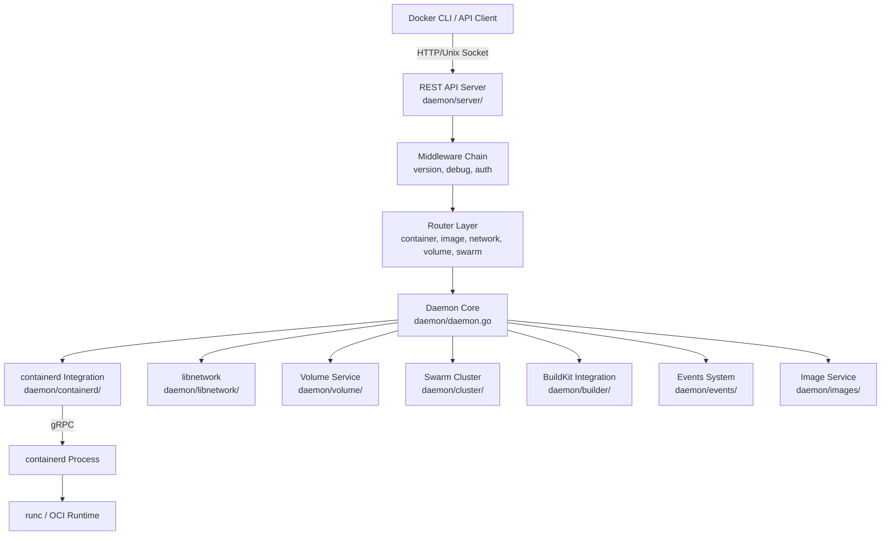
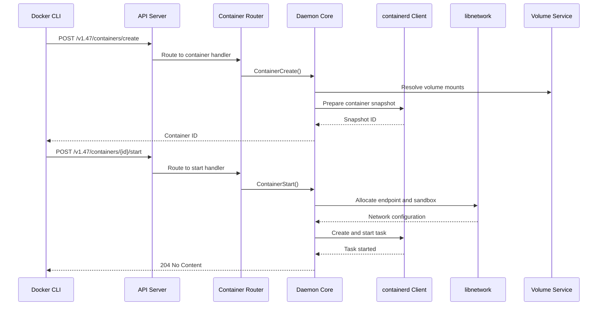
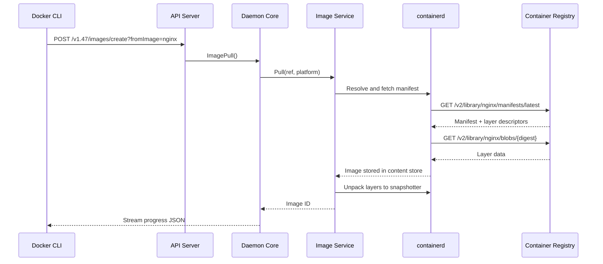
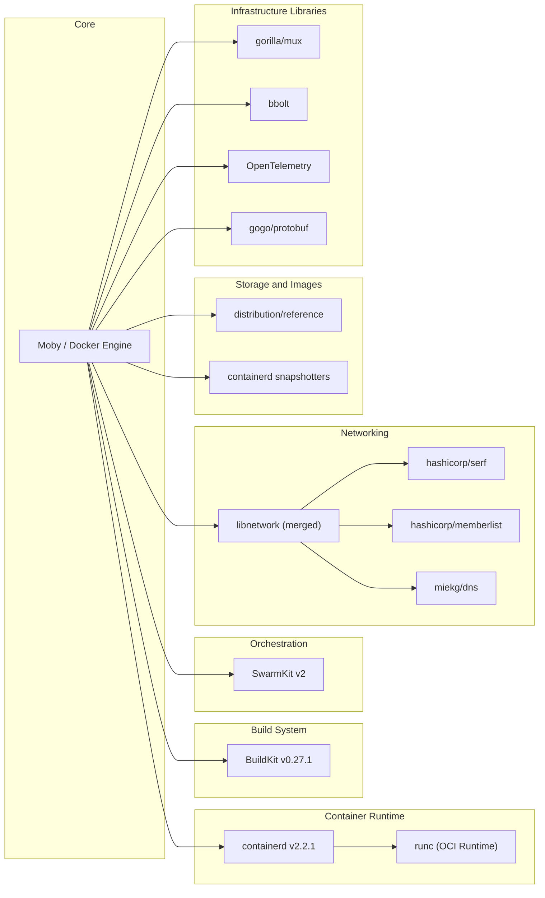

# Moby (Docker Engine)

> The Moby Project - a collaborative project for the container ecosystem to assemble container-based systems

| Metadata | |
|---|---|
| Repository | https://github.com/moby/moby |
| License | Apache License 2.0 |
| Primary Language | Go |
| Category | Container Runtime |
| Analyzed Release | `v29.2.1` (2026-02-02) |
| Stars (approx.) | 71,456 |
| Generated by | Claude Opus 4.6 (Anthropic) |
| Generated on | 2026-02-08 |

## Overview

Moby is the open-source project behind Docker Engine, providing a modular toolkit of components for assembling container-based systems. It serves as the upstream source for Docker CE and implements the core runtime that manages container lifecycle, networking, storage, and image distribution on Linux and Windows hosts.

Problems it solves:

- Eliminates the "works on my machine" problem by packaging applications with all dependencies into portable, isolated containers
- Provides a standardized API and toolchain for building, shipping, and running containers across diverse infrastructure
- Abstracts away low-level kernel features (namespaces, cgroups, union filesystems) behind a simple, declarative interface
- Enables multi-host orchestration through integrated Swarm mode for clustering and service scheduling

Positioning:

Moby sits at the center of the container ecosystem as the reference implementation of the Docker Engine. While containerd (which Moby delegates to) has become the standard low-level container runtime adopted by Kubernetes and other orchestrators, Moby provides the higher-level developer experience layer including the Docker API, image build pipeline (via BuildKit), networking (via libnetwork), and Swarm orchestration. Competing container engines include Podman (daemonless, rootless-first) and CRI-O (Kubernetes-focused), but Moby remains the most widely deployed container engine for development and production workloads.

## Architecture Overview

Moby follows a layered client-server architecture with the `dockerd` daemon at its center. The daemon exposes a versioned REST API over Unix sockets or TCP, receives requests through a router/middleware chain, and delegates work to specialized subsystems: containerd for runtime operations, BuildKit for image builds, libnetwork for networking, and SwarmKit for cluster orchestration.

## Core Components

### Daemon Core (`daemon/daemon.go`)

- Responsibility: Central orchestrator for all Docker operations, holding references to every subsystem and coordinating their interactions
- Key files: `daemon/daemon.go`, `daemon/daemon_unix.go`, `daemon/start.go`, `daemon/create.go`, `daemon/delete.go`, `daemon/container.go`
- Design patterns: Facade pattern (single entry point for all subsystem operations), Atomic configuration (thread-safe config via `atomic.Pointer[configStore]`)

The `Daemon` struct is the heart of the Docker Engine. It maintains references to the container store, image service, network controller, volume service, events system, containerd client, cluster provider, and plugin manager. Key fields include `containers` (a `container.Store`), `netController` (a `*libnetwork.Controller`), `volumes` (a `*volumesservice.VolumesService`), `imageService` (an `ImageService` interface), and `containerdClient` (a `*containerd.Client`). Configuration is managed through an `atomic.Pointer[configStore]` to allow safe hot-reloading without restarts. The daemon initializes all subsystems during startup via `NewDaemon()` and orchestrates container lifecycle operations (create, start, stop, delete) by composing calls across subsystems.

### API Server and Router (`daemon/server/`)

- Responsibility: Expose the Docker Engine API as a versioned REST interface, route requests to appropriate handlers, and apply cross-cutting concerns via middleware
- Key files: `daemon/server/server.go`, `daemon/server/router/router.go`, `daemon/server/router/container/container_routes.go`, `daemon/server/middleware.go`, `daemon/server/middleware/version.go`
- Design patterns: Router pattern (gorilla/mux based routing), Middleware chain, Backend interface segregation

The API server is built on `gorilla/mux` and implements a `Server` struct with a middleware chain. Each resource domain (container, image, network, volume, swarm, build, plugin, system) has its own router that implements the `router.Router` interface, returning a set of `Route` objects. Each route specifies an HTTP method, path, and handler function of type `httputils.APIFunc`. The `CreateMux()` method registers all routes with both versioned (`/v{version}/...`) and unversioned paths. Middleware handles API version negotiation, debug logging, CORS, and experimental feature gating. Backend interfaces (in `daemon/server/backend/`, `daemon/server/imagebackend/`, etc.) decouple the API handlers from the daemon implementation, enabling testability.

### containerd Integration (`daemon/containerd/`)

- Responsibility: Bridge between Docker's high-level container and image operations and containerd's low-level runtime and content management
- Key files: `daemon/containerd/image.go`, `daemon/containerd/image_builder.go`, `daemon/containerd/image_list.go`, `daemon/containerd/image_delete.go`, `daemon/containerd/handlers.go`, `daemon/containerd/cache.go`
- Design patterns: Adapter pattern (adapting containerd APIs to Docker semantics), Strategy pattern (pluggable snapshotters via `daemon/snapshotter/`)

Docker delegates all container runtime operations to containerd via gRPC. The `daemon/containerd/` package implements the `ImageService` interface using containerd's content store and image APIs. It handles image pull, push, list, inspect, delete, import, export, and commit operations. The `daemon/internal/libcontainerd/` package provides the lower-level client that manages container lifecycle through containerd's task and process APIs. Docker uses containerd namespaces (typically `moby`) to isolate its containers from other containerd clients. The snapshotter abstraction (`daemon/snapshotter/`) allows pluggable filesystem backends (overlayfs, btrfs, zfs, etc.) for layer management.

### libnetwork - Networking (`daemon/libnetwork/`)

- Responsibility: Implement the Container Network Model (CNM), managing network creation, endpoint attachment, IP address allocation, and network driver orchestration
- Key files: `daemon/libnetwork/controller.go`, `daemon/libnetwork/agent.go`, `daemon/libnetwork/config/`, `daemon/libnetwork/cnmallocator/`, `daemon/libnetwork/datastore/`
- Design patterns: Driver/plugin model, Container Network Model (CNM) with Sandbox-Endpoint-Network abstractions

libnetwork (merged into the main repository since Docker 22.06) implements the Container Network Model with three core abstractions: Sandbox (a container's network namespace containing interfaces, routing, and DNS), Endpoint (a virtual network interface connecting a Sandbox to a Network), and Network (a group of endpoints that can communicate). The `Controller` is the central object that manages networks and drivers. Built-in drivers include bridge, host, overlay (for multi-host), macvlan, and null. IPAM (IP Address Management) is pluggable with a default driver and support for external IPAM. The overlay driver uses VXLAN for multi-host networking with peer discovery via gossip protocol (using `hashicorp/serf` and `hashicorp/memberlist`).

### Swarm Cluster Orchestration (`daemon/cluster/`)

- Responsibility: Integrate SwarmKit for multi-node cluster management, service scheduling, secret management, and distributed state coordination
- Key files: `daemon/cluster/cluster.go`, `daemon/cluster/swarm.go`, `daemon/cluster/services.go`, `daemon/cluster/nodes.go`, `daemon/cluster/secrets.go`, `daemon/cluster/executor/`
- Design patterns: Provider pattern (cluster.Provider interface), Raft consensus for distributed state, Reconciliation loop (desired state vs actual state)

The cluster subsystem embeds SwarmKit (`github.com/moby/swarmkit/v2`) to provide native orchestration. Manager nodes run an Orchestrator (ensuring correct task counts), Allocator (assigning resources like IPs), Scheduler (placing tasks on nodes), and Dispatcher (communicating with worker agents). Consensus is maintained via Raft protocol across manager nodes. The `executor/` package bridges SwarmKit's generic task execution with Docker's container runtime. Services, secrets, configs, and network definitions are all managed as Swarm objects with declarative desired-state reconciliation.

### Image Build System (`daemon/builder/`)

- Responsibility: Integrate BuildKit for concurrent, cache-efficient image builds from Dockerfiles
- Key files: `daemon/builder/`, `daemon/build.go`, `daemon/containerd/image_builder.go`
- Design patterns: Builder pattern, Callback hooks (ImageExportedByBuildkit, ImageNamedByBuildkit)

Since Docker Engine 23.0, BuildKit (`github.com/moby/buildkit`) is the default build backend. The build system operates as a separate process/service that the daemon communicates with. The `daemon/build.go` file provides callback hooks (`ImageExportedByBuildkit`, `ImageNamedByBuildkit`) that BuildKit invokes when images are created or tagged, ensuring the daemon's event system stays in sync. BuildKit provides concurrent build graph execution, efficient layer caching, multi-stage build support, and Dockerfile frontend extensibility. The integration allows builds to share the daemon's content store and image service rather than requiring separate storage.

### Volume Service (`daemon/volume/`)

- Responsibility: Manage persistent data volumes with pluggable storage drivers
- Key files: `daemon/volume/service/`, `daemon/volumes.go`, `daemon/volumes_unix.go`
- Design patterns: Plugin/driver model, Service layer abstraction

The volume service manages the lifecycle of data volumes (create, remove, list, inspect, prune) and supports both the built-in `local` driver (which creates directories on the host filesystem) and third-party volume plugins. The `VolumesService` provides the business logic layer that the API router calls through its backend interface. Volume mounts are resolved during container creation and passed to containerd for binding into the container's filesystem namespace.

## Data Flow

### Container Creation and Start

### Image Pull

## Key Design Decisions

### 1. Delegation to containerd for Runtime Operations

- Choice: All low-level container lifecycle management (create, start, stop, kill, exec) is delegated to containerd via gRPC, rather than directly calling runc or managing cgroups/namespaces
- Rationale: Decouples the high-level Docker UX from low-level runtime concerns. Allows Docker daemon restarts without killing running containers (containerd maintains state). Enables sharing the runtime with Kubernetes and other orchestrators. Containerd handles shim processes, OCI runtime invocation, and container state persistence
- Trade-offs: Adds operational complexity (two daemons to manage). Introduces gRPC serialization overhead for every runtime call. Version compatibility between dockerd and containerd must be maintained. Debugging requires understanding the boundary between the two processes

### 2. Merged libnetwork into Main Repository

- Choice: libnetwork was merged from a separate repository (`moby/libnetwork`) into `daemon/libnetwork/` within the main Moby repo starting with Docker 22.06
- Rationale: Simplifies development workflow by eliminating cross-repo dependency management. Makes it easier to make atomic changes that span networking and daemon code. Reduces CI complexity and version skew issues. The Container Network Model (CNM) with its driver-based architecture (bridge, overlay, macvlan, host) is preserved within the merged codebase
- Trade-offs: Increases main repository size and build times. Makes it harder for external projects to consume libnetwork independently. Tighter coupling between networking and daemon code can make the codebase harder to navigate

### 3. BuildKit as External Build Engine

- Choice: Image building is delegated to BuildKit (`moby/buildkit`), a separate project with its own daemon process, rather than maintaining the legacy builder within dockerd
- Rationale: BuildKit provides concurrent build graph execution, fine-grained caching with content-addressable storage, multi-platform builds, and extensible frontends. Separating the build engine allows independent release cycles and lets BuildKit serve multiple clients (Docker CLI, buildctl, CI systems)
- Trade-offs: Requires coordinating between two projects for build features. The daemon needs callback hooks (`ImageExportedByBuildkit`, `ImageNamedByBuildkit` in `daemon/build.go`) to stay synchronized with BuildKit's actions. Users must understand which features come from BuildKit vs the daemon

### 4. Versioned REST API with Middleware Chain

- Choice: The API is versioned in the URL path (`/v1.47/containers/json`) with a middleware chain handling cross-cutting concerns (version negotiation, debug logging, authentication)
- Rationale: URL versioning enables backward compatibility across Docker CLI and API client versions. The middleware pattern (`daemon/server/middleware/`) cleanly separates concerns like version checking, CORS, and experimental feature gating from business logic. Backend interfaces (`daemon/server/backend/`) decouple API handlers from daemon internals
- Trade-offs: Maintaining multiple API versions adds code complexity. The versioning scheme requires careful deprecation management. Each middleware adds latency to every request

### 5. Atomic Configuration with Hot Reload

- Choice: Daemon configuration is stored in an `atomic.Pointer[configStore]` allowing lock-free reads and safe hot-reloading via SIGHUP without daemon restart
- Rationale: Production systems cannot afford downtime for configuration changes. The atomic pointer pattern in `daemon/daemon.go` ensures that all concurrent operations see a consistent configuration snapshot. The config pointer is passed down the call stack like a `context.Context` to maintain consistency within a single operation
- Trade-offs: Not all configuration options can be changed at runtime (some require daemon restart). The immutable snapshot pattern means configuration is eventually consistent across concurrent operations. Requires discipline to propagate the config pointer rather than re-reading it mid-operation

## Dependencies

## Testing Strategy

Moby employs a multi-tier testing strategy spanning unit tests, API integration tests, and platform-specific CI pipelines.

Unit tests: Standard Go `testing` package with `gotest.tools/assert` for assertions. Unit tests are co-located with the packages they test (e.g., `daemon/container_operations_test.go`, `daemon/delete_test.go`). They test individual functions in isolation and are expected to run fast without external dependencies. The `hack/test/unit` script orchestrates unit test execution.

Integration tests: Located in the `integration/` directory, organized by resource type (`integration/container/`, `integration/image/`, `integration/volume/`, etc.). These tests spin up a real daemon and make HTTP requests to the API, verifying both the response and the daemon's state. The legacy `integration-cli/` test suite is deprecated and no new tests are accepted there. New integration tests must be added under `integration/`.

CI/CD: GitHub Actions workflows defined in `.github/workflows/` including `ci.yml`, `test.yml`, `buildkit.yml`, `windows-2022.yml`, `windows-2025.yml`, `arm64.yml`, and `vm.yml`. The CI pipeline runs unit tests, integration tests, BuildKit integration tests, code validation (linting via `.golangci.yml`), and platform-specific tests across Linux, Windows, and ARM64. The `hack/make.sh` script serves as the primary build and test orchestrator used both locally and in CI.

## Key Takeaways

1. Layered delegation enables independent evolution: By delegating container runtime to containerd, builds to BuildKit, and orchestration to SwarmKit, Moby allows each subsystem to evolve, release, and scale independently. This pattern is valuable for any large system where different components have different release cadences or different consumers. The key insight is defining clean gRPC or API boundaries between layers so that upgrading one layer does not require changes to others.

2. Backend interfaces decouple API from implementation: The API server uses segregated backend interfaces (`daemon/server/backend/`, `daemon/server/imagebackend/`, `daemon/server/networkbackend/`) rather than directly calling the daemon. This makes API handlers independently testable with mock backends, allows the daemon implementation to change without modifying API code, and enables clear documentation of what each API endpoint requires. This is a broadly applicable pattern for any project with a public API surface.

3. Atomic configuration for zero-downtime operations: The `atomic.Pointer[configStore]` pattern provides lock-free configuration reads while supporting hot-reload via SIGHUP. By treating configuration as an immutable snapshot passed through the call stack, the system avoids inconsistencies from mid-operation config changes. This approach is directly applicable to any long-running server process that needs runtime reconfigurability without restarts.

4. Merging critical dependencies reduces coordination overhead: The decision to merge libnetwork into the main repository reflects a pragmatic trade-off between modularity and development velocity. When a component is tightly coupled to the main project and rarely consumed independently, the overhead of cross-repository coordination (version pinning, CI synchronization, API compatibility) often outweighs the architectural purity of separation. This is a recurring pattern in large Go projects.

5. Driver and plugin architecture enables extensibility without core changes: Both networking (bridge, overlay, macvlan drivers) and storage (overlayfs, btrfs, zfs snapshotters) use a plugin/driver model where the core defines an interface and implementations are registered at startup. The `daemon/graphdriver/register/` package demonstrates the register-on-import pattern common in Go. This extensibility model lets third parties add functionality without modifying core code, a pattern essential for ecosystem growth.

## References

- [Moby Project Official Site](https://mobyproject.org/)
- [Docker Engine Documentation](https://docs.docker.com/engine/)
- [Docker Engine API Reference](https://docs.docker.com/reference/api/engine/)
- [Moby GitHub Repository](https://github.com/moby/moby)
- [DeepWiki - moby/moby Architecture](https://deepwiki.com/moby/moby)
- [containerd Integration - DeepWiki](https://deepwiki.com/moby/moby/3.3-containerd-integration)
- [BuildKit - Concurrent Builder Toolkit](https://github.com/moby/buildkit)
- [SwarmKit - Orchestration Toolkit](https://github.com/moby/swarmkit)
- [libnetwork CNM Design](https://github.com/moby/libnetwork/blob/master/docs/design.md)
- [Moby Testing Guide](https://github.com/moby/moby/blob/master/TESTING.md)
- [Introducing the Moby Project - Docker Blog](https://www.docker.com/blog/introducing-the-moby-project/)
