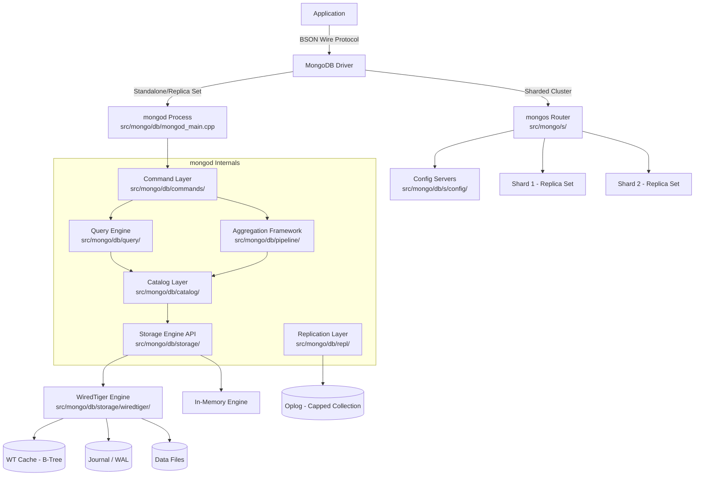
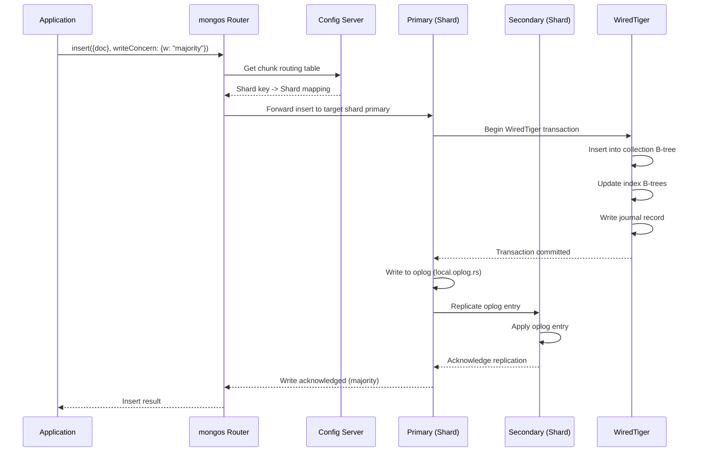
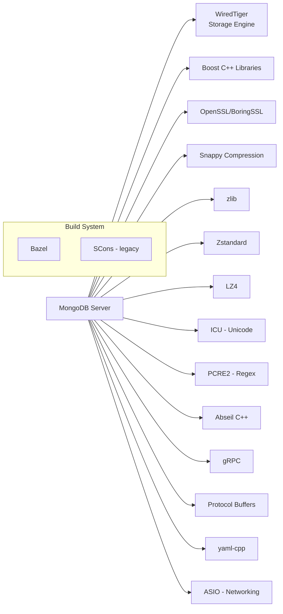

# MongoDB

> The most popular document-oriented NoSQL database, designed for scalability and developer productivity.

| Metadata | |
|---|---|
| Repository | https://github.com/mongodb/mongo |
| License | Server Side Public License (SSPL) v1 |
| Primary Language | C++ |
| Category | Database |
| Analyzed Release | `8.0` (2024-2026, latest GA series) |
| Stars (approx.) | 28,045 |
| Generated by | Claude Opus 4.6 (Anthropic) |
| Generated on | 2026-02-08 |

## Overview

MongoDB is a distributed document database that stores data in flexible, JSON-like BSON documents, allowing fields to vary across documents and data structures to evolve over time. Its architecture is built around a pluggable storage engine layer (defaulting to WiredTiger), a replica set mechanism for high availability, and a sharding framework for horizontal scalability. MongoDB supports rich query expressions, secondary indexes, aggregation pipelines, change streams, and multi-document ACID transactions.

Problems it solves:
- Eliminates the impedance mismatch between application objects and database rows by storing documents that map directly to objects in most programming languages
- Provides horizontal scalability through automatic sharding with configurable shard key strategies, enabling distribution of data and load across commodity hardware
- Delivers high availability through replica sets with automatic failover, ensuring continuous uptime for mission-critical applications

Positioning:
MongoDB occupies the dominant position in the document database market and has been the most popular NoSQL database for over a decade. It competes with relational databases (PostgreSQL, MySQL) for general-purpose workloads and with other NoSQL systems (Cassandra, DynamoDB) for high-scale distributed scenarios. The addition of multi-document ACID transactions (v4.0+), queryable encryption, and vector search has expanded its applicability into traditional RDBMS territory. MongoDB Atlas (the managed cloud offering) has become the primary revenue driver for MongoDB Inc.

## Architecture Overview

MongoDB uses a layered architecture with a document model at the top, a query and aggregation engine in the middle, and a pluggable storage engine at the bottom. For distributed deployments, a mongos router process directs queries to the appropriate shard(s), each of which is a replica set. The replication layer uses an oplog-based consensus protocol (a variant of Raft) to maintain data consistency across replica set members.

## Core Components

### mongod Server Process (`src/mongo/db/mongod_main.cpp`)
- Responsibility: The primary database server process that handles all data operations, manages storage, runs the query engine, and participates in replication.
- Key files: `mongod_main.cpp`, `mongod_main.h`, `service_entry_point_mongod.cpp`
- Design patterns: Service-oriented initialization with a dependency injection framework (`ServiceContext`); decorator pattern for attaching per-operation state.

The mongod process initializes the storage engine, starts the replication coordinator, sets up the network listener via the transport layer, and enters the main event loop. Each incoming connection is handled by a dedicated thread from a thread pool managed by `src/mongo/transport/`.

### Query Engine (`src/mongo/db/query/`)
- Responsibility: Parses query predicates, generates candidate query plans, selects the optimal plan through the query planner, and executes it.
- Key files: `canonical_query.cpp`, `query_planner.cpp`, `plan_ranker.cpp`, `sbe_stage_builder.cpp`, `classic_runtime_planner.cpp`
- Design patterns: Multi-plan evaluation (runtime plan selection by racing candidate plans); transition from classic engine to Slot-Based Execution (SBE) engine for improved performance.

MongoDB's query engine has undergone a significant transformation with the introduction of the Slot-Based Execution (SBE) engine, which replaces the classic execution engine's tree-of-stages approach with a more efficient register-machine-like model. The query planner generates candidate plans and uses a multi-plan runner to empirically choose the best one based on actual execution metrics.

### Aggregation Framework (`src/mongo/db/pipeline/`)
- Responsibility: Implements the aggregation pipeline, a data processing framework that transforms and combines documents through a sequence of stages.
- Key files: `pipeline.cpp`, `document_source.h`, `document_source_match.cpp`, `document_source_group.cpp`, `document_source_lookup.cpp`, `expression.cpp`
- Design patterns: Pipeline pattern where each stage consumes input documents and produces output documents; stages can be pushed down to the storage layer or distributed across shards.

The aggregation framework supports stages like `$match`, `$group`, `$lookup` (joins), `$unwind`, `$project`, and `$merge`. The optimizer performs stage reordering, pipeline coalescence, and pushdown to the storage engine. In sharded environments, the pipeline is split between the mongos and individual shards for distributed execution.

### WiredTiger Storage Engine (`src/mongo/db/storage/wiredtiger/`)
- Responsibility: Provides the default storage engine with document-level concurrency control, compression, and checkpoint-based durability.
- Key files: `wiredtiger_record_store.cpp`, `wiredtiger_index.cpp`, `wiredtiger_kv_engine.cpp`, `wiredtiger_session_cache.cpp`, `wiredtiger_recovery_unit.cpp`
- Design patterns: B-tree based storage with MVCC through copy-on-write page updates; checkpoint-based durability with a journal (WAL) for inter-checkpoint crash recovery.

WiredTiger stores each collection and each index as a separate B-tree table. The `_mdb_catalog` table acts as the namespace directory mapping MongoDB collections to WiredTiger tables. The engine supports document-level concurrency (as opposed to the old collection-level locking in MMAPv1), uses hazard pointers for lock-free reads, and provides snappy/zlib/zstd compression at the block level.

### Replication System (`src/mongo/db/repl/`)
- Responsibility: Maintains data consistency across replica set members through oplog-based replication with automatic leader election and failover.
- Key files: `replication_coordinator_impl.cpp`, `oplog.cpp`, `sync_source_resolver.cpp`, `bgsync.cpp`, `apply_ops.cpp`, `topology_coordinator.cpp`
- Design patterns: A Raft-inspired consensus protocol for leader election; oplog (operation log) as a capped collection for ordered replication; heartbeat-based health monitoring.

The replication coordinator manages the state machine for replica set member roles (primary, secondary, arbiter). Write operations are recorded in the oplog on the primary and asynchronously replicated to secondaries. Write concern levels allow applications to tune the durability-latency trade-off.

### Sharding Layer (`src/mongo/s/` and `src/mongo/db/s/`)
- Responsibility: Distributes data across multiple shards based on a shard key, routing queries and writes to the correct shard(s).
- Key files: `src/mongo/s/commands/`, `src/mongo/s/query/`, `src/mongo/db/s/config/configsvr_shard_collection_command.cpp`, `src/mongo/db/s/migration_source_manager.cpp`
- Design patterns: Range-based and hashed shard key partitioning; config servers store metadata (chunk boundaries, shard locations); mongos acts as a stateless routing proxy.

The sharding system uses config servers (a replica set) to store the mapping of data chunks to shards. The balancer process automatically migrates chunks between shards to maintain even data distribution. Targeted queries (those including the shard key) are routed to a single shard, while scatter-gather queries are broadcast to all shards.

## Data Flow

### Document Insert in a Sharded Cluster

## Key Design Decisions

### 1. Document Model with BSON Encoding
- Choice: Store data as flexible BSON (Binary JSON) documents rather than fixed-schema rows, with each document potentially having different fields.
- Rationale: Maps naturally to objects in programming languages, eliminating the object-relational impedance mismatch. Schema flexibility allows iterative development without costly migrations. BSON provides efficient binary encoding with typed values.
- Trade-offs: No enforced schema means application logic must handle data consistency (mitigated by schema validation since v3.6). Document size limit of 16MB. Lack of joins was historically a limitation (mitigated by `$lookup` and embedded documents).

### 2. WiredTiger as Default Storage Engine
- Choice: Replaced the original MMAPv1 engine with WiredTiger (acquired in 2014) as the default storage engine starting in MongoDB 3.2.
- Rationale: WiredTiger provides document-level concurrency control (vs. collection-level in MMAPv1), native compression, and checkpoint-based crash recovery. Its B-tree implementation with hazard pointers enables high-throughput concurrent operations.
- Trade-offs: More complex internal architecture. Memory management requires careful tuning of the WiredTiger cache size. Checkpoint operations can cause periodic latency spikes.

### 3. Oplog-Based Replication with Raft-Inspired Elections
- Choice: Use an append-only operation log (oplog) for replication rather than WAL shipping, with a Raft-inspired protocol for leader election.
- Rationale: The oplog stores idempotent operations that can be safely replayed, enabling secondary nodes to catch up from any point. The Raft-inspired protocol ensures that exactly one primary is elected and that committed writes are preserved across failovers.
- Trade-offs: Oplog size limits the replication window; lagging secondaries may need full resync if they fall too far behind. Read-your-writes consistency requires reading from the primary or using causal consistency sessions.

### 4. Slot-Based Execution (SBE) Engine
- Choice: Developing a new query execution engine (SBE) to replace the classic tree-of-stages executor, using a register-machine approach.
- Rationale: SBE reduces interpretation overhead by using a compact bytecode-like representation. It enables better CPU cache utilization and vectorized operations. Columns/slots are passed between stages rather than full BSON documents.
- Trade-offs: Gradual rollout means both classic and SBE engines coexist, increasing code complexity. Not all query shapes are supported by SBE yet, requiring fallback to the classic engine.

### 5. Pluggable Storage Engine API
- Choice: Define a clean `KVEngine` and `RecordStore` interface that allows different storage engine implementations.
- Rationale: Decouples the query layer from storage, allowing optimization of each independently. Enables specialized engines (in-memory, encrypted) for different workloads. Made the WiredTiger transition possible without rewriting the query layer.
- Trade-offs: The abstraction layer adds some overhead. Some WiredTiger-specific optimizations are harder to expose through the generic API. The in-memory engine and encrypted engine are enterprise-only features.

## Dependencies

## Testing Strategy

MongoDB has one of the most extensive testing infrastructures in the open source database world:

- Unit Tests (`src/mongo/unittest/`): C++ unit tests using a custom testing framework. Tests are colocated with source files and built via Bazel. Individual components like the query planner, aggregation stages, and storage engine are tested in isolation.
- Integration Tests (`jstests/`): JavaScript-based tests that run against live mongod/mongos instances using the mongo shell. These cover CRUD operations, aggregation, replication, sharding, and transactions.
- Concurrency Tests (`jstests/concurrency/`): Multi-threaded JavaScript tests that stress concurrent access patterns to detect race conditions and deadlocks.
- Replication and Sharding Tests (`jstests/replsets/`, `jstests/sharding/`): End-to-end tests for distributed behaviors including failover, chunk migration, and consistency guarantees.
- Resmoke (`src/mongo/resmoke/`): The test runner framework that manages test suite execution, mongod/mongos lifecycle, and result reporting.
- Performance Tests: Benchmarks using the `sys-perf` and `microbenchmarks` suites run in Evergreen (MongoDB's CI system).
- Fuzzing: MongoDB uses libFuzzer and custom fuzzers for testing parsers, BSON handling, and network protocol code.
- Correctness: Formal TLA+ specifications exist for the replication protocol (`src/mongo/tla_plus/`), providing mathematical verification of safety properties.

## Key Takeaways

1. MongoDB's document model with BSON encoding fundamentally changed how developers think about database schema design, trading the rigid guarantees of relational schemas for flexibility and developer velocity. The progressive addition of features like schema validation, joins ($lookup), and multi-document transactions shows a convergence toward relational capabilities while preserving the document-first developer experience.

2. The WiredTiger storage engine acquisition and integration was a transformative architectural decision that elevated MongoDB from a limited storage model (MMAPv1 with collection-level locking) to a competitive, modern storage engine with document-level concurrency, compression, and proper crash recovery. The pluggable storage engine API made this transition possible without disrupting the upper layers.

3. MongoDB's sharding architecture, with its stateless mongos routers, config servers, and automatic balancing, represents one of the most operationally mature horizontal scaling solutions in the database ecosystem. However, shard key selection remains a critical design decision that is difficult to change after deployment, making it a common source of operational challenges.

## References

- MongoDB Official Documentation: https://www.mongodb.com/docs/manual/
- WiredTiger Architecture Guide: https://source.wiredtiger.com/develop/arch-index.html
- MongoDB Internals - Collections and Indexes in WiredTiger: https://dev.to/mongodb/mongodb-internals-how-collections-and-indexes-are-stored-in-wiredtiger-2ed
- WiredTiger Storage Engine Overview: https://www.mongodb.com/docs/manual/core/wiredtiger/
- MongoDB Release Notes 8.0: https://www.mongodb.com/docs/manual/release-notes/8.0/
- MongoDB Source Code: https://github.com/mongodb/mongo
- MongoDB and WiredTiger Journey: https://medium.com/@eliehannouch800/mongodb-and-wiredtiger-a-journey-through-the-storage-engine-d3acfcf846a0
