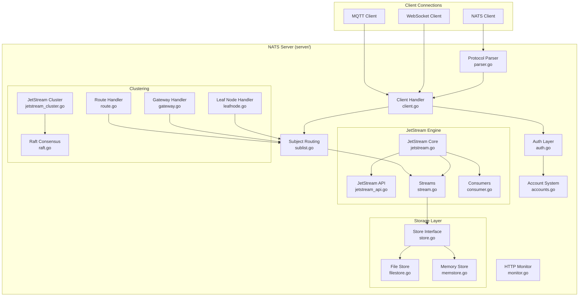
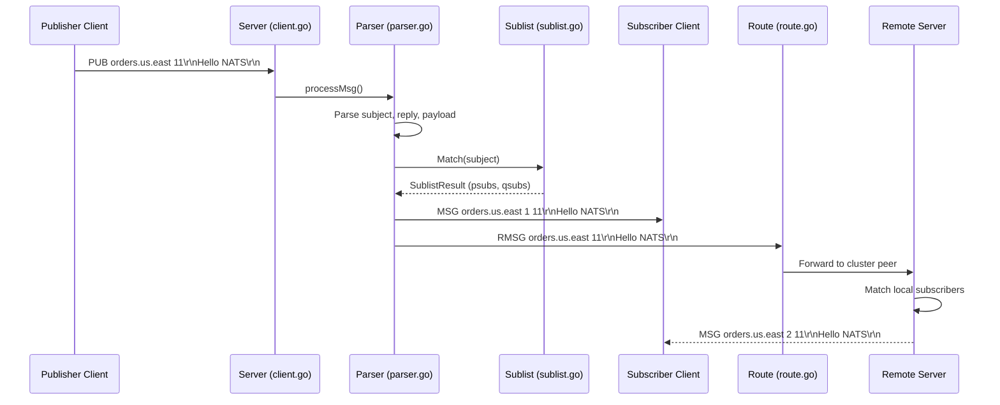
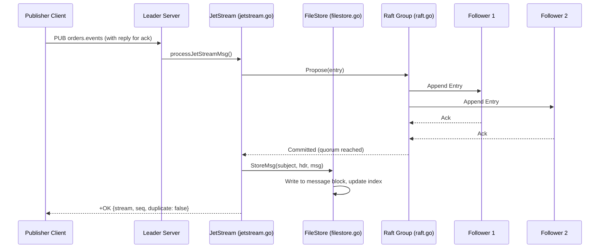
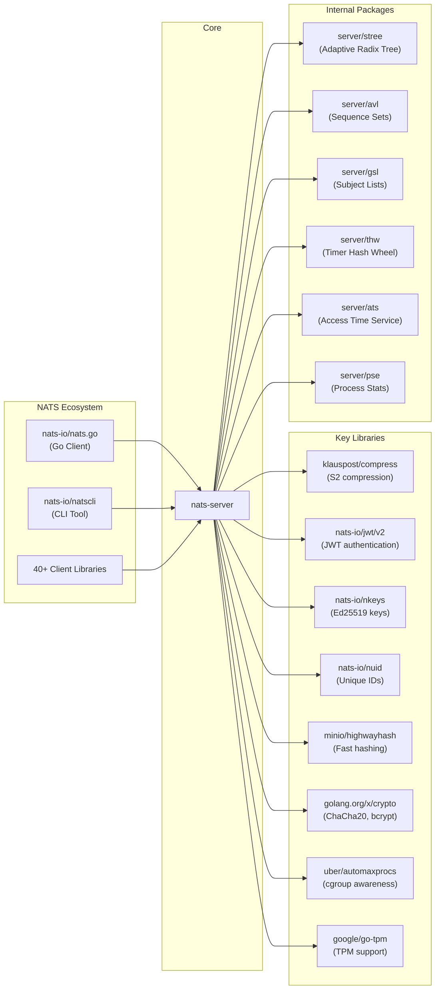

# NATS Server

> High-performance server for NATS.io, the cloud and edge native messaging system.

| Metadata | |
|---|---|
| Repository | https://github.com/nats-io/nats-server |
| License | Apache License 2.0 |
| Primary Language | Go |
| Analyzed Release | `v2.12.4` (2026-01-27) |
| Stars (approx.) | 19,109 |
| Generated by | Claude Opus 4.6 (Anthropic) |
| Generated on | 2026-02-08 |

## Overview

NATS Server is a high-performance, cloud-native messaging system that provides publish/subscribe, request/reply, and distributed queue messaging patterns. It is part of the Cloud Native Computing Foundation (CNCF) and supports over 40 client language implementations. The server is designed to be simple, secure, and scalable, operating on-premise, in the cloud, at the edge, or on resource-constrained devices like a Raspberry Pi.

Problems it solves:

- Provides a lightweight, always-available messaging infrastructure for distributed systems with at-most-once delivery semantics via Core NATS
- Delivers persistent, replicated streaming with JetStream for at-least-once and exactly-once delivery, eliminating the need for separate streaming infrastructure
- Enables multi-cluster, multi-cloud connectivity through gateways and leaf nodes, allowing global message routing with minimal configuration
- Supports multi-tenancy through an account-based security model with subject namespace isolation

Positioning:

NATS occupies a unique position among messaging systems. Compared to Apache Kafka, NATS is significantly simpler to operate and deploy (single binary, zero dependencies) while JetStream provides comparable persistence and streaming capabilities. Unlike RabbitMQ, NATS uses a text-based protocol with subject-based addressing rather than queue-based routing, making it more natural for pub/sub patterns. Redis Pub/Sub offers similar simplicity but lacks NATS's clustering, multi-tenancy, and persistence features. NATS differentiates itself through its unified approach: a single server binary provides both ephemeral messaging (Core NATS) and persistent streaming (JetStream), with built-in clustering, security, and multi-protocol support (NATS, MQTT, WebSocket).

## Architecture Overview

NATS Server is implemented as a monolithic Go binary with a layered architecture. The core layer handles TCP connection management, protocol parsing, and subject-based message routing through an efficient trie-based subscription list. Above this, JetStream provides persistent streaming with file-based and memory-based storage, while Raft consensus enables distributed replication across clustered servers. The server supports multiple connection topologies: full-mesh clustering for HA within a datacenter, gateways for inter-cluster communication, and leaf nodes for edge deployments.

## Core Components

### Server Core (`server/server.go`)

- Responsibility: Central orchestration of the NATS server lifecycle, including startup, shutdown, configuration, listener management, and coordination of all subsystems
- Key files: `server/server.go`, `server/opts.go`, `server/reload.go`, `server/signal.go`
- Design patterns: Singleton server instance, observer pattern for shutdown notifications, configuration hot-reload via signal handling

The `Server` struct is the root object that owns all server state. It manages TCP listeners for client connections, cluster routes, gateways, and leaf nodes. The `NewServer()` constructor initializes the server from `Options`, and `Run()` starts all listeners and blocks until shutdown. The server supports graceful shutdown via lame duck mode, where it stops accepting new connections while draining existing ones. Configuration can be reloaded at runtime (via `SIGHUP` or the reload signal) through `server/reload.go`, which computes diffs between old and new configurations and applies changes incrementally.

### Client Connection Handler (`server/client.go`)

- Responsibility: Managing individual client connections including protocol parsing, message processing, subscription management, and connection lifecycle
- Key files: `server/client.go`, `server/parser.go`, `server/proto.go`
- Design patterns: State machine pattern for protocol parsing, bit flags for connection state, per-connection read/write loops with goroutines

Each client connection is represented by a `client` struct that tracks connection type (CLIENT, ROUTER, GATEWAY, LEAF, SYSTEM, JETSTREAM, ACCOUNT), subscriptions, permissions, and I/O state. The protocol parser in `server/parser.go` implements a zero-allocation, byte-at-a-time state machine that processes the NATS text protocol (PUB, SUB, UNSUB, CONNECT, PING, PONG, MSG, HPUB, HMSG). The client handler uses separate goroutines for reading and writing, with dynamic buffer sizing (from 64 bytes to 64KB) to balance memory usage and throughput. Slow consumers are detected and handled through write deadline monitoring and pending byte thresholds.

### Subject-Based Routing (`server/sublist.go`)

- Responsibility: Efficient matching of published message subjects against subscriber interest, supporting wildcards (`*` for single token, `>` for multiple tokens)
- Key files: `server/sublist.go`, `server/stree/stree.go`
- Design patterns: Trie data structure for hierarchical subject matching, LRU cache for hot path optimization, adaptive radix tree (ART) for subject state tracking

The `Sublist` is the core routing engine. It organizes subscriptions in a trie where each level corresponds to a subject token separated by dots (e.g., `orders.us.east`). Wildcard nodes (`*` and `>`) are stored separately at each level for efficient matching. A fixed-size cache (1024 entries) accelerates repeated lookups on the same subjects. The `stree` package implements a memory-efficient adaptive radix tree (with node sizes of 4, 10, 16, 48, and 256) used by JetStream's file store and memory store to track per-subject state. When a message is published, the `Match()` method traverses the trie and returns both plain subscriptions and queue group subscriptions, enabling work-queue style load balancing.

### JetStream Persistence Engine (`server/jetstream.go`)

- Responsibility: Providing persistent, replicated streaming on top of Core NATS, including stream and consumer management, message storage, replay, and exactly-once delivery semantics
- Key files: `server/jetstream.go`, `server/jetstream_api.go`, `server/stream.go`, `server/consumer.go`, `server/jetstream_cluster.go`
- Design patterns: Layered architecture over Core NATS, interface-based storage abstraction (`StreamStore`, `ConsumerStore`), Raft-based replication for HA

JetStream is enabled per-server and managed through the `jetStream` struct. Streams capture messages published to matching subjects and store them according to configurable retention policies (Limits, Interest, WorkQueue). Consumers provide stateful views into streams with acknowledgment tracking, redelivery, and filtering. The JetStream API is exposed over NATS subjects (e.g., `$JS.API.STREAM.CREATE.<stream>`) making it accessible from any NATS client. In clustered mode, `jetStreamCluster` manages stream and consumer assignments across servers using a meta-group Raft node. Each stream with replicas > 1 gets its own Raft group for independent replication. The storage layer is abstracted behind the `StreamStore` interface in `server/store.go`, with two implementations: `fileStore` (disk-based with block-level organization, compression via S2, and encryption via ChaCha20-Poly1305 or AES-GCM) and `memStore` (in-memory with identical interface).

### Clustering and Federation (`server/route.go`, `server/gateway.go`, `server/leafnode.go`)

- Responsibility: Enabling multi-server and multi-cluster topologies for high availability, scalability, and geographic distribution
- Key files: `server/route.go`, `server/gateway.go`, `server/leafnode.go`, `server/raft.go`
- Design patterns: Full-mesh topology for routes, hub-and-spoke for leaf nodes, interest-mode optimization for gateways, Raft consensus for metadata and stream replication

NATS supports three types of server-to-server connections. Routes form a full-mesh cluster where every server connects to every other server; subscription interest is propagated so messages are only forwarded to servers with active subscribers (one-hop routing maximum). Gateways connect separate clusters, operating in three interest modes: Optimistic (send everything, receive "no interest" responses), Transitioning, and InterestOnly (only send when explicit interest is known). Leaf nodes create a hub-and-spoke topology where edge servers connect to a central cluster, ideal for IoT and edge computing scenarios. The `raft` module implements the Raft consensus protocol used by JetStream for leader election, log replication, and membership changes. Each Raft group uses a Write-Ahead Log (WAL) backed by either file storage or memory storage.

## Data Flow

### Message Publish and Delivery (Core NATS)

### JetStream Publish with Replication

## Key Design Decisions

### 1. Single Binary, Zero External Dependencies

- Choice: The entire NATS server, including Core NATS, JetStream persistence, Raft consensus, and multi-protocol support, is compiled into a single Go binary with no external dependencies (no ZooKeeper, no etcd, no separate storage engine)
- Rationale: Simplifies deployment and operations dramatically. A NATS cluster can be started with a single binary and a configuration file. This aligns with the project's core philosophy of simplicity and reduces operational failure modes
- Trade-offs: All features must be implemented in-process, which increases binary size and means the storage engine cannot be swapped independently. However, the binary remains small (under 20MB) and the integrated design enables tight optimization between layers

### 2. Text-Based Protocol with Zero-Allocation Parsing

- Choice: NATS uses a simple text-based protocol (PUB, SUB, MSG, etc.) parsed by a hand-written, zero-allocation state machine in `server/parser.go` rather than a binary protocol like Protocol Buffers or MessagePack
- Rationale: A text protocol is human-readable, debuggable with standard tools (telnet, netcat), and simple to implement in new client languages. The custom parser avoids heap allocations on the hot path by using scratch buffers and byte slices into the read buffer
- Trade-offs: Text protocols have higher overhead than binary protocols for large payloads, but NATS mitigates this through efficient parsing and optional S2 compression for inter-server traffic. The protocol simplicity has enabled 40+ client implementations across different languages

### 3. Subject-Based Addressing with Trie Routing

- Choice: Messages are routed based on hierarchical dot-separated subjects (e.g., `orders.us.east`) using a trie data structure with wildcard support (`*` for single token, `>` for remainder), rather than using topic queues or routing keys
- Rationale: Subject-based addressing provides a natural namespace hierarchy that maps well to organizational and service boundaries. The trie structure enables O(n) matching where n is the number of subject tokens, with caching for frequently-used subjects
- Trade-offs: Subject matching has higher per-message overhead compared to direct queue addressing, but the cache and optimized trie implementation keep this negligible for most workloads. The hierarchical namespace enables powerful multi-tenant isolation through account-based subject partitioning

### 4. Embedded Raft Consensus for JetStream

- Choice: NATS implements its own Raft consensus protocol in `server/raft.go` rather than using an external library (like etcd's Raft or HashiCorp Raft), with a two-tier group structure: a single meta-group for cluster-wide coordination and per-stream Raft groups for data replication
- Rationale: The custom implementation allows tight integration with NATS's transport layer (using NATS subjects for Raft communication), enabling Raft groups to communicate through the same infrastructure they manage. The per-stream group design allows independent scaling and failure isolation
- Trade-offs: Maintaining a custom Raft implementation requires significant engineering effort and careful correctness validation. The project has invested in Antithesis-based testing (visible in the `internal/antithesis` package) and extensive cluster test suites (multiple `jetstream_cluster_*_test.go` files) to ensure correctness

### 5. Interface-Based Storage Abstraction

- Choice: JetStream's storage is abstracted behind Go interfaces (`StreamStore`, `ConsumerStore` in `server/store.go`) with two built-in implementations: `fileStore` (disk-backed with block-based layout, encryption, and compression) and `memStore` (in-memory)
- Rationale: The interface allows streams to choose between durability and performance at creation time. The file store uses a block-based architecture where messages are grouped into fixed-size blocks with separate index files, enabling efficient sequential access and garbage collection
- Trade-offs: The abstraction adds a layer of indirection, but Go's interface dispatch is efficient. The file store's block-based design optimizes for sequential write patterns (append-only within blocks) at the cost of random access performance, which is acceptable for streaming workloads

## Dependencies

## Testing Strategy

The NATS server has an extensive test suite with thousands of test cases covering unit tests, integration tests, cluster tests, and fuzz tests. The test files are co-located with source files following Go conventions (e.g., `server/server_test.go`, `server/client_test.go`).

Unit tests: Individual components like the Sublist, parser, file store, and memory store each have dedicated test files. The store tests verify correctness of message storage, retrieval, compaction, and encryption. Parser fuzz tests (`server/parser_fuzz_test.go`, `server/subject_fuzz_test.go`) use Go's built-in fuzzing to discover edge cases in protocol parsing.

Integration tests: JetStream cluster tests are split across multiple files (`jetstream_cluster_1_test.go` through `jetstream_cluster_4_test.go`) to parallelize test execution. These tests spin up multi-node clusters in-process and verify stream replication, leader election, consumer behavior, and failure recovery. The `server/test/` directory contains additional integration tests. The project also uses Antithesis SDK (`internal/antithesis`) for deterministic simulation testing of distributed behaviors.

CI/CD: GitHub Actions runs the full test suite on every push and pull request via `.github/workflows/tests.yaml`. Tests run on multiple platforms and Go versions. Code coverage is tracked via Coveralls. The project maintains a high bar for test coverage, with dedicated "norace" test files (`norace_1_test.go`, `norace_2_test.go`) for tests that cannot run with the race detector due to timing sensitivity.

## Key Takeaways

1. Simplicity as architecture: NATS demonstrates that a messaging system can be both high-performance and operationally simple. By compiling everything into a single binary with no external dependencies, NATS eliminates an entire class of operational failures (dependency version mismatches, external service outages, configuration drift). This principle of "radical simplicity" is applicable to any infrastructure project.

2. Layered persistence on top of messaging: JetStream's design of building persistent streaming as a layer above Core NATS (using NATS subjects for its own API and Raft communication) is an elegant example of dogfooding. The persistence layer uses the same transport it provides, which means improvements to Core NATS automatically benefit JetStream. This pattern of building higher-level abstractions on top of your own primitives creates a virtuous cycle of improvement.

3. Custom data structures for domain-specific performance: Rather than relying on generic data structures, NATS implements specialized structures throughout: the `Sublist` trie for subject matching, the adaptive radix tree (`stree`) for subject state tracking, the `avl` package for sequence sets, and the timer hash wheel (`thw`) for TTL management. Each is optimized for its specific access pattern. This investment in custom data structures is a recurring pattern in high-performance systems.

4. Interest-based message propagation: NATS's approach of only forwarding messages to servers that have active subscribers (rather than broadcasting everything) is a fundamental scalability mechanism. This is implemented differently at each topology level - route subscriptions for clusters, interest modes for gateways, and spoke/hub roles for leaf nodes. This principle of "don't send what nobody wants" is widely applicable to distributed system design.

5. Per-stream Raft groups for independent scaling: Rather than using a single consensus group for all state (like etcd), JetStream creates independent Raft groups per stream. This allows streams to have different replication factors, fail independently, and distribute leadership across the cluster. This fine-grained consensus approach trades increased resource usage for better fault isolation and scalability.

## References

- [NATS Official Documentation](https://docs.nats.io/)
- [NATS Architecture Design Document](https://github.com/nats-io/nats-general/blob/main/architecture/ARCHITECTURE.md)
- [JetStream Documentation](https://docs.nats.io/nats-concepts/jetstream)
- [JetStream Model Deep Dive](https://docs.nats.io/using-nats/developer/develop_jetstream/model_deep_dive)
- [NATS Server Go Package Documentation](https://pkg.go.dev/github.com/nats-io/nats-server/v2/server)
- [NATS JetStream Internals Discussion](https://github.com/nats-io/nats-server/discussions/3955)
- [NATS Protocol Specification](https://docs.nats.io/reference/reference-protocols/nats-protocol)
- [Trail of Bits Security Audit (April 2025)](https://github.com/trailofbits/publications/blob/master/reviews/2025-04-ostif-nats-securityreview.pdf)
