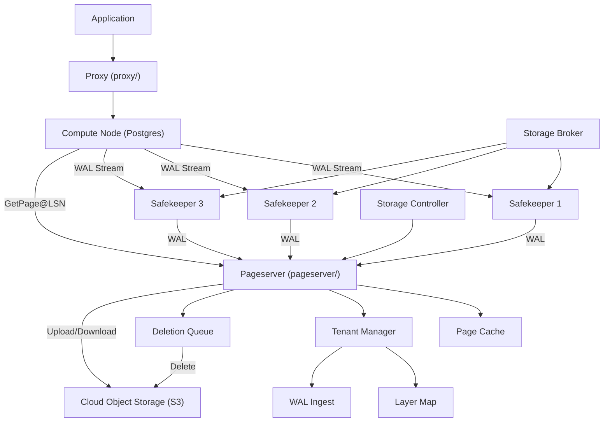
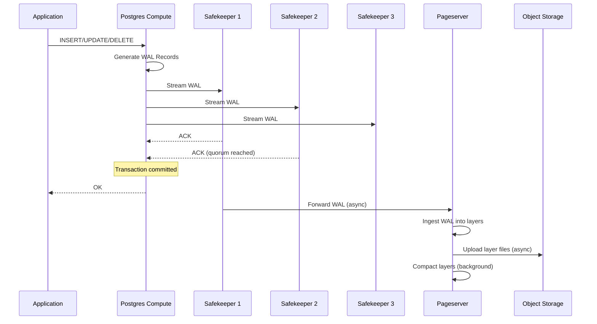
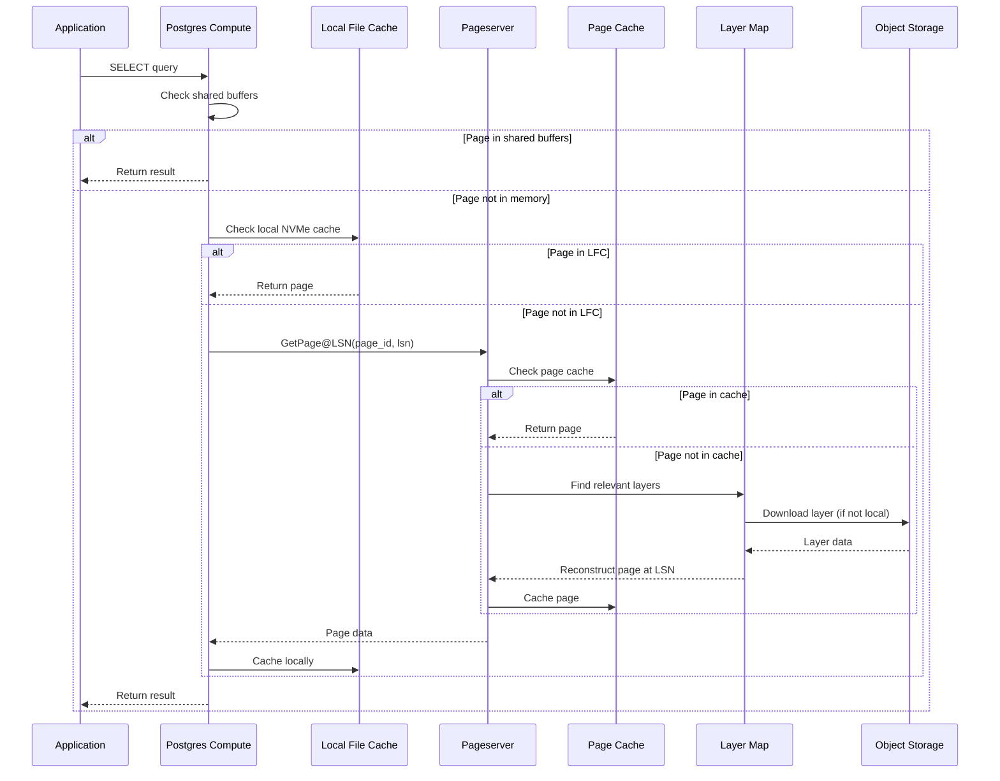
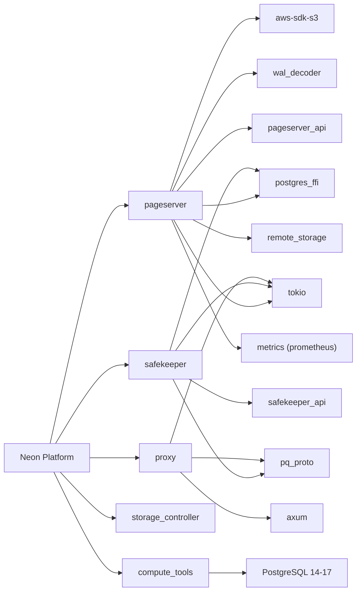

# Neon

> Serverless Postgres with separated storage and compute offering autoscaling, branching, and scale to zero

| Metadata | |
|---|---|
| Repository | https://github.com/neondatabase/neon |
| License | Apache 2.0 |
| Primary Language | Rust |
| Category | Database |
| Analyzed Release | `release-proxy-8853` (2025-07-29) |
| Stars (approx.) | 20,897 |
| Generated by | Claude Opus 4.6 (Anthropic) |
| Generated on | 2026-02-08 |

## Overview

Neon is a serverless PostgreSQL platform that fundamentally re-architects Postgres by separating storage from compute. Instead of Postgres writing data pages to local disk, Neon replaces the storage layer with a distributed, cloud-native storage system while keeping the full Postgres compute engine unchanged. This separation enables instant database branching (like git branches for data), autoscaling compute from zero, and virtually unlimited storage via cloud object stores like S3. Neon is written primarily in Rust and operates as a multi-component distributed system.

Problems it solves:
- Eliminates idle resource costs by enabling Postgres compute to scale to zero when not in use
- Provides instant database branching for development, testing, and CI/CD pipelines using copy-on-write semantics
- Decouples storage from compute so each can scale independently
- Removes manual storage provisioning with bottomless storage backed by object storage (S3)
- Reduces recovery time by maintaining page versions rather than replaying the entire WAL

Positioning:
Neon pioneers the storage-compute separation pattern for PostgreSQL, competing with managed Postgres services like Amazon RDS/Aurora, Google AlloyDB, and Supabase. Its primary differentiators are the open-source storage engine, instant branching, and true scale-to-zero capability. Unlike Aurora which is proprietary, Neon's architecture is fully open source. Unlike Supabase which wraps standard Postgres, Neon fundamentally changes the storage layer while maintaining full Postgres compatibility.

## Architecture Overview

Neon's architecture consists of four major components: Compute nodes (standard Postgres instances), Safekeepers (WAL durability via Paxos consensus), Pageservers (page materialization and caching), and cloud object storage (S3 for long-term durability). WAL flows from compute through safekeepers to pageservers, which materialize pages on demand and upload layer files to S3.

## Core Components

### Pageserver (`pageserver/src/`)
- Responsibility: The central storage engine that ingests WAL records from safekeepers, materializes pages on demand for compute nodes, manages tenant data, performs compaction, and uploads/downloads layer files from object storage. It implements the custom Neon storage format with image layers and delta layers.
- Key files: `lib.rs` (module declarations and constants like `STORAGE_FORMAT_VERSION = 3`), `page_service.rs` (handles GetPage@LSN requests from compute), `walingest.rs` (WAL ingestion pipeline), `tenant.rs` (tenant lifecycle), `tenant/mgr.rs` (tenant manager), `tenant/layer_map.rs` (tracks active layers), `page_cache.rs` (in-memory page cache), `tenant/ephemeral_file.rs` (temporary files for ingestion), `tenant/disk_btree.rs` (on-disk B-tree for layer indexing).
- Design patterns: Layer-based storage (image layers for base pages, delta layers for WAL), LSN-addressed page retrieval, copy-on-write for branching, background task management via `task_mgr.rs`.

### Safekeeper (`safekeeper/src/`)
- Responsibility: Provides durable WAL storage using a Paxos-based consensus protocol. A transaction is committed only after a quorum (typically 2 of 3) of safekeepers acknowledge the WAL record. Safekeepers hold WAL temporarily until it is consumed by the pageserver and uploaded to S3.
- Key files: `safekeeper.rs` (core Paxos logic), `receive_wal.rs` (WAL reception from compute), `send_wal.rs` (WAL forwarding to pageserver), `send_interpreted_wal.rs` (interpreted WAL streaming), `timeline.rs` (per-timeline state management), `timeline_manager.rs` (lifecycle management), `control_file.rs` (persistent metadata), `state.rs` (safekeeper state machine), `timelines_global_map.rs` (global timeline registry).
- Design patterns: Paxos consensus for WAL durability, timeline-based isolation (each database branch has its own timeline), WAL segmentation and garbage collection via `remove_wal.rs`.

### Proxy (`proxy/src/`)
- Responsibility: Connection routing and authentication layer that sits between applications and compute nodes. Handles TLS termination, SNI-based routing, JWT authentication, connection pooling, and compute node wake-up for scale-to-zero.
- Key files: `bin/proxy.rs` (main proxy binary), `auth/` (authentication backends including `backend/classic.rs`, `backend/jwt.rs`, `backend/console_redirect.rs`), `compute/mod.rs` (compute node management), `cache/` (connection and project info caching), `cancellation.rs` (query cancellation forwarding), `console_redirect_proxy.rs`.
- Design patterns: Reverse proxy pattern, SNI-based routing for multi-tenant connection multiplexing, lazy compute activation (scale-to-zero).

### Storage Controller (`storage_controller/src/`)
- Responsibility: Orchestrates pageserver operations across a fleet of pageservers. Manages tenant placement, shard splits, tenant migrations between pageservers, and pageserver health monitoring.
- Key files: Located in `storage_controller/src/` with client code in `storage_controller/client/`.
- Design patterns: Control plane pattern, eventual consistency for tenant placement, shard-based horizontal scaling of pageservers.

### Storage Broker (`storage_broker/src/`)
- Responsibility: Facilitates communication between safekeepers and pageservers. Broadcasts timeline-related information so pageservers know which safekeepers to connect to for WAL streaming.
- Key files: Located in `storage_broker/src/`.
- Design patterns: Pub/sub broker pattern for discovery and coordination between storage components.

### Compute Tools (`compute_tools/`)
- Responsibility: Manages the lifecycle of Postgres compute nodes including startup configuration, extension installation, and integration with the Neon storage layer through custom Postgres extensions.
- Key files: Located in `compute_tools/` with compute node Dockerfile in `compute/compute-node.Dockerfile`.
- Design patterns: Sidecar pattern for compute node management, custom Postgres extensions for storage integration.

### Shared Libraries (`libs/`)
- Responsibility: Common libraries shared across all components including `pageserver_api` (page server protocol definitions), `safekeeper_api` (safekeeper protocol), `postgres_ffi` (Postgres FFI bindings for WAL parsing), `wal_decoder` (WAL record decoding), `remote_storage` (S3 abstraction), `utils` (common utilities), `pq_proto` (Postgres protocol), `metrics` (observability).
- Key files: `libs/pageserver_api/src/` (key.rs for page addressing, shard.rs for sharding, pagestream_api.rs for the GetPage protocol), `libs/postgres_ffi/` (Postgres binary format bindings), `libs/remote_storage/` (cloud storage abstraction).
- Design patterns: Shared library pattern for protocol definitions, FFI bindings for Postgres integration.

## Data Flow

### Write Path (Transaction Commit)

### Read Path (Page Fetch)

## Key Design Decisions

### 1. Separation of Storage and Compute
- Choice: Replace Postgres's local storage layer with a network-attached custom storage system while keeping the Postgres compute engine completely unmodified.
- Rationale: Enables independent scaling of compute and storage. Compute can scale to zero when idle (no storage to maintain). Storage can grow indefinitely via object storage. Multiple compute nodes can share the same storage for read replicas.
- Trade-offs: Network latency for page fetches adds overhead compared to local NVMe. The local file cache (LFC) and page cache mitigate this, but cold-start reads are slower. The architecture is more complex with multiple distributed components.

### 2. WAL-Based Page Versioning with Layered Storage
- Choice: Store data as a combination of image layers (full page snapshots) and delta layers (WAL-derived changes), materializing any page version by combining base images with deltas up to the requested LSN.
- Rationale: Enables instant branching (branches share image layers via copy-on-write), point-in-time recovery (any LSN can be materialized), and efficient storage (only changes are stored between compaction cycles).
- Trade-offs: Page reconstruction can require reading multiple layers and applying deltas, which is slower than direct page reads. Compaction is critical to keep reconstruction cost bounded. The layer map and compaction logic in `tenant/layer_map.rs` and `pageserver/compaction/` add significant complexity.

### 3. Paxos Consensus for WAL Durability
- Choice: Use a Paxos-based protocol across 3 safekeepers for WAL durability, rather than relying on synchronous replication to replicas.
- Rationale: Provides strong durability guarantees (no data loss if 1 of 3 safekeepers fails) while keeping WAL acknowledgment fast (only need 2 of 3). Decouples durability from compute replication.
- Trade-offs: Three safekeepers add operational complexity and cost. The Paxos implementation in `safekeeper/src/safekeeper.rs` must handle leader election, split-brain scenarios, and catch-up.

### 4. Proxy Layer for Connection Routing and Scale-to-Zero
- Choice: All connections pass through a proxy that handles authentication, routing, and on-demand compute activation.
- Rationale: The proxy enables scale-to-zero by waking up compute nodes on first connection. It also provides a stable endpoint while compute nodes may be created, destroyed, or migrated. SNI-based routing enables multi-tenant multiplexing.
- Trade-offs: Adds latency for connection establishment (especially cold start when compute must be activated). The proxy becomes a critical path component that must be highly available.

### 5. Tenant and Timeline Abstraction
- Choice: Organize all data around tenants (corresponding to Neon projects) and timelines (corresponding to branches), with each timeline having its own LSN sequence.
- Rationale: Maps directly to the branching model where creating a branch creates a new timeline that shares ancestor data. Enables per-tenant isolation for multi-tenant deployments.
- Trade-offs: The tenant/timeline hierarchy adds complexity to the storage controller and pageserver. Garbage collection must track which layers are shared across timelines and cannot be deleted until all referencing timelines are removed.

## Dependencies

## Testing Strategy

Neon has a multi-layered testing approach:

- Unit Tests: Rust unit tests within each crate (e.g., `pageserver/src/tenant/disk_btree_test_data.rs`, `libs/pageserver_api/src/config/tests.rs`, `libs/consumption_metrics/src/metrics/tests.rs`).
- Integration Tests: End-to-end tests that spin up the full stack (compute, safekeeper, pageserver) and exercise real Postgres queries through the Neon storage layer.
- Simulation Tests: The `libs/desim/` crate provides a discrete event simulation framework with `executor.rs`, `network.rs`, `world.rs` for testing distributed protocols without real I/O.
- WAL Decoder Tests: `libs/postgres_ffi/benches/waldecoder.rs` benchmarks WAL decoding performance.
- Reliable Copy Tests: `libs/desim/tests/reliable_copy_test.rs` tests data reliability under simulated failures.
- Storage Scrubber: `storage_scrubber/` validates the integrity of data in object storage.
- PostgreSQL Backend Tests: `libs/postgres_backend/tests/simple_select.rs` tests the Postgres protocol implementation.
- The project uses `cargo test` with the standard Rust testing framework, plus Python-based integration tests for full-stack scenarios.

## Key Takeaways

1. Neon's storage-compute separation for Postgres is architecturally groundbreaking. By replacing only the storage layer while keeping Postgres's compute engine unmodified, Neon achieves full SQL compatibility while enabling cloud-native capabilities (branching, scale-to-zero, bottomless storage) that are impossible with traditional Postgres.

2. The layered storage model (image layers + delta layers) with LSN-addressed page materialization is the key innovation that enables instant branching. Branches share parent layers and only store divergent data, similar to how container image layers work. This is managed by the layer map in `tenant/layer_map.rs` with coverage tracking in `historic_layer_coverage.rs`.

3. The three-tier read path (shared buffers, local file cache, pageserver with S3 backend) demonstrates careful performance engineering. While network-attached storage adds latency, the multi-level caching ensures that hot data is served locally. The pageserver's page cache and the compute's local NVMe cache together minimize the cold-read penalty.

## References

- Repository: https://github.com/neondatabase/neon
- Architecture Overview: https://neon.com/docs/introduction/architecture-overview
- Architecture Decisions Blog: https://neon.com/blog/architecture-decisions-in-neon
- Pageserver Storage Design: https://github.com/neondatabase/neon/blob/main/docs/pageserver-storage.md
- DeepWiki Analysis: https://deepwiki.com/neondatabase/neon
- Neon Storage: https://neon.com/storage
