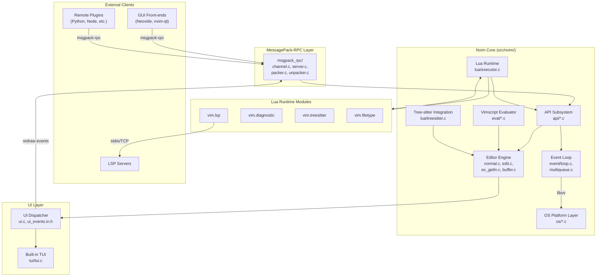
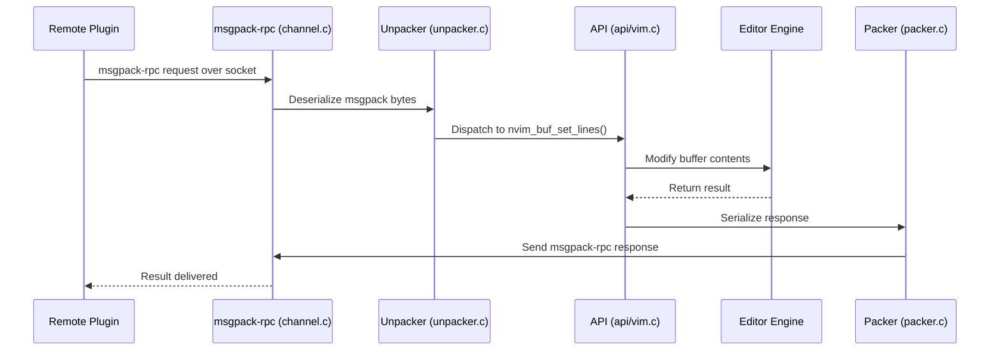
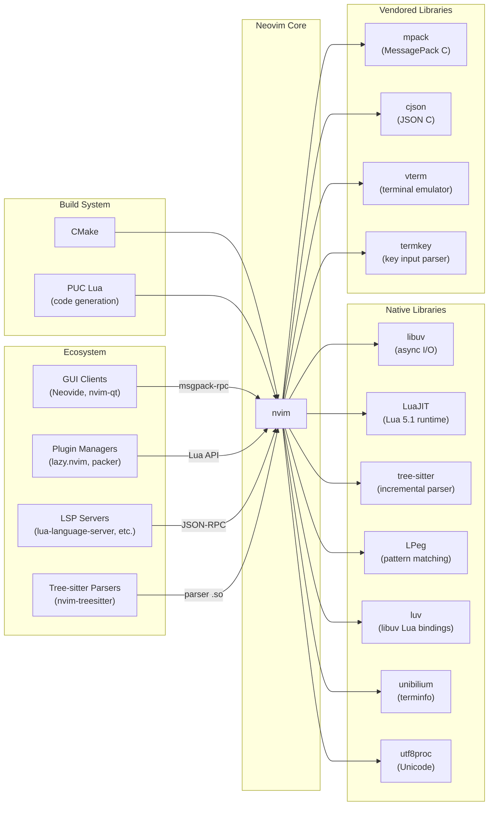

# Neovim

> Vim-fork focused on extensibility and usability

| Metadata | |
|---|---|
| Repository | https://github.com/neovim/neovim |
| License | Apache 2.0 (contributions since b17d96; Vim license for earlier code) |
| Primary Language | C (core), Lua (runtime/plugins), Vim Script (legacy) |
| Analyzed Release | `v0.11.6` (2026-01-26) |
| Stars (approx.) | 96,300 |
| Generated by | Claude Opus 4.6 (Anthropic) |
| Generated on | 2026-02-08 |

## Overview

Neovim is an aggressive refactor of Vim that decouples the editor core from its terminal UI, exposes a first-class MessagePack-RPC API, and embeds LuaJIT as the primary extension language. The project replaces Vim's monolithic architecture with a layered, event-driven design built on libuv, enabling asynchronous I/O, remote UIs, and modern language-server integration.

Problems it solves:

- Vim's tightly coupled TUI makes it impossible to build rich graphical or web-based front-ends without patching the core
- Vim's synchronous, single-threaded execution model blocks the editor during long-running operations such as linting, formatting, and code completion
- Extending Vim requires Vimscript, a language with poor tooling, limited data structures, and no standard library; Neovim provides Lua with full access to the editor API
- Vim's codebase accumulated decades of platform-specific ifdefs and global state, making contributions and maintenance difficult

Positioning:

Neovim occupies a unique niche between traditional terminal editors (Vim, Emacs) and modern GUI editors (VS Code, Zed). It retains full Vim compatibility for keybindings and plugins while offering a structured API that GUI front-ends (Neovide, nvim-qt, FirNvim) can consume over RPC. Compared to Vim, Neovim prioritizes API-first design, built-in LSP, and Tree-sitter integration. Compared to VS Code, it offers lower resource usage, terminal-native operation, and deeper composability through its modal editing paradigm.

## Architecture Overview

Neovim is an input-driven pushdown automaton wrapped in a libuv event loop. The core is written in C and organized into subsystems (API, event loop, TUI, Lua runtime, msgpack-rpc, Vimscript evaluator, OS platform layer) that communicate through an internal multi-queue event system. External processes and GUIs interact with the editor exclusively through the MessagePack-RPC protocol, while in-process Lua code accesses the same API surface directly through C function bindings.



## Core Components

### Event Loop and Multi-Queue System (`src/nvim/event/`)

- Responsibility: Drives all asynchronous I/O, timers, job control, and deferred event processing through a single libuv-based event loop
- Key files: `event/loop.c`, `event/loop.h`, `event/multiqueue.c`, `event/multiqueue.h`, `event/stream.c`, `event/rstream.c`, `event/wstream.c`, `event/libuv_proc.c`
- Design patterns: Reactor pattern (libuv event loop), Priority queue hierarchy (fast_events, events, thread_events), Child queue pattern for process isolation

The `Loop` structure wraps a `uv_loop_t` and exposes three `MultiQueue` instances: `fast_events` for latency-critical callbacks that run at every `os_breakcheck`, `events` for normal deferred work, and `thread_events` for cross-thread communication. The `loop_poll_events()` function checks `Loop.uv` and `Loop.fast_events` whenever Nvim is idle. Each spawned process gets its own child queue via `multiqueue_new_child(main_loop.events)`, which automatically routes process events back to the main loop. The `state_enter()` function in `state.c` implements the top-level program loop as a pushdown automaton, where each editor mode (normal, insert, command-line, terminal) registers check and execute callbacks on a `VimState` structure.

### API Subsystem (`src/nvim/api/`)

- Responsibility: Exposes a stable, versioned, language-agnostic API surface for controlling every aspect of the editor
- Key files: `api/vim.c`, `api/buffer.c`, `api/window.c`, `api/tabpage.c`, `api/ui.c`, `api/ui_events.in.h`, `api/extmark.c`, `api/command.c`, `api/options.c`
- Design patterns: Code generation (Lua scripts generate C dispatch tables and metadata from annotated function signatures), Facade pattern (single entry point for all editor operations), RPC bridge pattern

API functions are declared with special annotations in C source files. At build time, `src/gen/gen_api_ui_events.lua` and related generator scripts parse these annotations to produce dispatch tables, type-checking wrappers, and machine-readable metadata accessible via `api_info()`. Functions can be marked as `api-fast` (safe to call from Lua callbacks without triggering `os_breakcheck`). UI events are defined in `api/ui_events.in.h` and auto-generated into wrappers that both the built-in TUI and remote UIs consume. The API is versioned via `NVIM_API_LEVEL`, which is bumped when new functions or events are added, ensuring client compatibility.

### MessagePack-RPC Layer (`src/nvim/msgpack_rpc/`)

- Responsibility: Implements the MessagePack-RPC protocol for bidirectional communication between Nvim and external processes
- Key files: `msgpack_rpc/channel.c`, `msgpack_rpc/channel.h`, `msgpack_rpc/server.c`, `msgpack_rpc/packer.c`, `msgpack_rpc/unpacker.c`
- Design patterns: Channel abstraction (stdin/stdout, TCP, Unix socket, named pipe), Serialization/deserialization pipeline, Request-response with notification support

Channels wrap libuv streams and handle the full msgpack-rpc lifecycle: connection setup, message framing, request/response correlation, and notification dispatch. The `server.c` module listens on Unix sockets or TCP ports (controlled by `$NVIM_LISTEN_ADDRESS` or `--listen`). The unpacker deserializes incoming msgpack bytes into Nvim's internal `Object` type hierarchy, while the packer serializes outgoing responses. Responses are processed in reverse order of requests to handle nested RPC calls correctly. This layer is what enables the "Nvim everywhere" vision: any language with a msgpack library can be an Nvim client.

### Lua Runtime (`src/nvim/lua/` and `runtime/lua/vim/`)

- Responsibility: Embeds LuaJIT as the primary extension and configuration language, providing the `vim.*` namespace and all built-in Lua modules
- Key files: `lua/executor.c` (C-side Lua state management), `lua/converter.c` (type conversion between C and Lua), `lua/treesitter.c` (Tree-sitter bindings), `runtime/lua/vim/_core/` (eager-loaded core modules), `runtime/lua/vim/lsp.lua`, `runtime/lua/vim/treesitter.lua`, `runtime/lua/vim/diagnostic.lua`, `runtime/lua/vim/filetype.lua`
- Design patterns: Bridge pattern (C-to-Lua type conversion), Lazy module loading, Namespace hierarchy (`vim.*`, `vim.lsp.*`, `vim.treesitter.*`)

The Lua subsystem is initialized in `lua/executor.c`, which creates the LuaJIT state and registers all `vim.*` functions as C closures. Type conversion between Nvim's internal C types and Lua values is handled by `lua/converter.c`. The runtime Lua modules in `runtime/lua/vim/` are lazy-loaded on first access. Critical modules in `runtime/lua/vim/_core/` are compiled into the binary so they remain available even if `VIMRUNTIME` is invalid. The built-in LSP client (`vim.lsp`) communicates with language servers over stdio or TCP, leveraging the event loop for non-blocking operation. The Tree-sitter integration (`vim.treesitter`) provides incremental parsing, syntax highlighting, code folding, and structural text objects.

### Editor Engine (`src/nvim/`)

- Responsibility: Implements the core editing logic including modal input handling, buffer management, window layout, undo/redo, and screen drawing
- Key files: `main.c` (entry point), `state.c` (state machine), `normal.c` (normal mode), `edit.c` (insert mode), `ex_getln.c` (command-line mode), `buffer.c` (buffer management), `memline.c` (text storage as a tree of line segments), `drawscreen.c` (screen rendering), `terminal.c` (terminal emulator), `undo.c`, `change.c`
- Design patterns: State machine / pushdown automaton (modal editing), Observer pattern (autocommands/events), Memento pattern (undo tree)

The editor is structured as an input-driven state machine. `main()` calls `normal_enter()` which invokes `state_enter()` with callbacks for `normal_check()` and `normal_execute()`. Each mode follows this pattern: command-line mode uses `command_line_{enter,check,execute}()`, insert mode uses `insert_{enter,check,execute}()`, and terminal mode uses `terminal_{enter,execute}()`. Buffer text is stored as a B-tree of line segments in `memline.c`, with the core lookup performed by `ml_find_line()`. Editor events (autocommands) are defined in `src/nvim/auevents.lua` and dispatched through `autocmd.c`. Screen updates are deferred until a command sequence completes, then `update_screen()` calls `win_update()` per window and `win_line()` per line.

### TUI - Terminal User Interface (`src/nvim/tui/`)

- Responsibility: Renders the editor UI in the terminal, handling terminal capabilities, input parsing, and screen output
- Key files: `tui/tui.c`, `tui/tui.h`, `tui/input.c`, `tui/terminfo.c`, `tui/terminfo_builtin.h`, `tui/termkey/` (forked termkey library)
- Design patterns: Abstract UI interface (TUI is just one implementation of the UI protocol), Terminfo abstraction for portability

The TUI is architecturally a UI client that happens to run in the same process. It consumes the same UI event stream as remote GUIs, which means it can be disabled entirely when Nvim is used headlessly or with an external front-end. Terminal capabilities are resolved via terminfo with a built-in fallback database (`terminfo_builtin.h`). Input parsing is handled by the forked termkey library in `tui/termkey/`, which decodes terminal escape sequences into key events. This design ensures the TUI never bypasses the API layer, maintaining the principle that all UIs are equal.

## Data Flow

### User Types a Key in Normal Mode (Local TUI)

```mermaid
sequenceDiagram
    participant User
    participant TUI as TUI (tui/tui.c)
    participant Input as Input Parser (tui/input.c)
    participant Loop as Event Loop (event/loop.c)
    participant State as State Machine (state.c)
    participant Normal as Normal Mode (normal.c)
    participant Buffer as Buffer (memline.c)
    participant UI as UI Dispatcher (ui.c)

    User->>TUI: Keystroke (terminal escape sequence)
    TUI->>Input: Parse escape sequence via termkey
    Input->>Loop: Enqueue key event
    Loop->>State: state_enter() dispatches event
    State->>Normal: normal_execute(key)
    Normal->>Buffer: Modify text (e.g., delete word)
    Buffer-->>Normal: Updated buffer state
    Normal->>UI: update_screen()
    UI->>TUI: Emit redraw UI events
    TUI-->>User: Rendered terminal output
```

### Remote Plugin Calls API via RPC



### LSP Completion Flow

```mermaid
sequenceDiagram
    participant User
    participant Editor as Editor Engine
    participant LuaRT as Lua Runtime
    participant LSP as vim.lsp (lsp.lua)
    participant Loop as Event Loop
    participant Server as LSP Server (external)

    User->>Editor: Type character in insert mode
    Editor->>LuaRT: Trigger InsertCharPre / TextChangedI
    LuaRT->>LSP: on_change callback
    LSP->>Loop: Send textDocument/completion request (async)
    Loop->>Server: JSON-RPC over stdio
    Server-->>Loop: Completion response
    Loop->>LSP: Invoke response handler
    LSP->>Editor: nvim_buf_set_extmark() for virtual text
    Editor-->>User: Display completion menu
```

## Key Design Decisions

### 1. Decoupled UI via MessagePack-RPC Protocol

- Choice: All UI rendering is done through an abstract event protocol, making the built-in TUI just one of many possible front-ends
- Rationale: Vim's terminal rendering was deeply intertwined with its core logic, making it impossible to build GUIs without forking the entire project. By defining a UI event protocol (`redraw` notifications with semantic events like `grid_line`, `msg_show`, `cmdline_show`), Neovim allows any process to be a front-end
- Trade-offs: The abstraction adds serialization overhead for every screen update. Complex UI features (floating windows, external cmdline) require careful protocol design and versioning. The built-in TUI must re-serialize events it could theoretically access directly

### 2. LuaJIT as First-Class Extension Language

- Choice: Embed LuaJIT (Lua 5.1 compatible) as the primary scripting language, with full access to the C API through the `vim.*` namespace
- Rationale: Vimscript is slow, poorly documented, and lacks modern language features. Lua is fast (especially with JIT compilation), has a minimal C embedding API, a large ecosystem, and is easy to learn. LuaJIT's FFI also enables direct access to C libraries
- Trade-offs: Vimscript must still be supported for backward compatibility, creating two parallel scripting paths. LuaJIT is stuck at Lua 5.1 semantics (no goto in base spec, different scoping rules than Lua 5.4). The Lua API surface is large and must be kept stable

### 3. libuv-Based Asynchronous Event Loop

- Choice: Replace Vim's platform-specific I/O with libuv for all asynchronous operations including file I/O, process spawning, timers, and network communication
- Rationale: Vim used a patchwork of platform-specific code (select/poll/kqueue) and blocking I/O. libuv provides a battle-tested, cross-platform abstraction that enables non-blocking I/O across Windows, macOS, and Linux with a single codebase
- Trade-offs: Adds a hard dependency on libuv. The event-driven model requires all code to be reentrant-safe or explicitly guard against re-entrancy. The state machine must be carefully designed to avoid processing events at unsafe times (hence the `api-fast` distinction)

### 4. Build-Time Code Generation from Lua Metadata

- Choice: Define commands, options, events, API functions, and UI events as Lua data files that are processed by generator scripts at build time to produce C dispatch tables, documentation, and metadata
- Rationale: Manually maintaining dispatch tables, documentation, and type-checking code for hundreds of API functions and options leads to inconsistencies. Code generation from a single source of truth ensures the API metadata, documentation, and implementation stay in sync
- Trade-offs: Build system complexity increases significantly. Developers must understand the code generation pipeline to add new API functions or options. Debugging generated code is harder than debugging hand-written code

### 5. Tree-sitter for Syntax and Structural Editing

- Choice: Integrate Tree-sitter as the primary mechanism for syntax highlighting, code folding, indentation, and structural text objects, replacing regex-based syntax files
- Rationale: Regex-based syntax highlighting is slow, fragile, and cannot represent the hierarchical structure of code. Tree-sitter provides incremental parsing (only re-parsing changed regions), concrete syntax trees, and a standardized grammar format shared across editors
- Trade-offs: Requires grammar files for each language (maintained as separate repositories). The Tree-sitter C library is an additional native dependency. Not all languages have high-quality grammars, so regex-based fallbacks must be maintained

## Dependencies



## Testing Strategy

Neovim uses a comprehensive, multi-layered test strategy built on the Busted Lua test runner, orchestrated through CMake. Each test spawns a fresh Nvim process (startup takes 10-30ms) that is discarded after the test, ensuring complete isolation.

Unit tests: Located in `test/unit/`, unit tests compile Nvim source files as a shared library and load them via LuaJIT FFI, allowing direct testing of internal C functions without starting a full editor instance. This enables testing of low-level data structures, parsing logic, and utility functions in isolation.

Integration tests: Located in `test/functional/`, these tests drive a real Nvim instance over RPC using the msgpack-rpc protocol. They test the full editor stack from API calls to screen output. The framework provides `screen:expect()` for declarative screen-state assertions that automatically wait for asynchronous updates, and `t.eq()` for value assertions. This is where the majority of tests live.

Legacy tests: Located in `test/old/testdir/`, these are tests inherited from Vim that verify backward compatibility. They use Vim's original test framework and are gradually being migrated to the functional test suite.

Benchmarks: Located in `test/benchmark/`, these measure performance of critical operations.

CI/CD: Neovim uses GitHub Actions for CI across Linux, macOS, and Windows. The CI matrix includes builds with different compilers (GCC, Clang, MSVC), sanitizers (ASan, UBSan), Coverity static analysis, and code coverage. Linting is performed by `clint.py` for C code and `stylua` for Lua code.

## Key Takeaways

1. API-first architecture enables ecosystem diversity: By designing the editor around a formal, versioned API rather than ad-hoc function calls, Neovim created a thriving ecosystem of GUIs, plugins, and language clients across dozens of programming languages. This is a transferable pattern: any application that might need multiple front-ends or integration points benefits from defining its core functionality as a stable, documented API from the start rather than retrofitting one later.

2. Decoupling UI from logic through protocol design: The decision to make the built-in TUI consume the same event stream as remote GUIs ensures that the UI protocol is always complete and correct. When internal components must use the same interface as external ones, the abstraction cannot leak. This "eat your own dog food" approach to protocol design is valuable for any system with pluggable interfaces.

3. Code generation from declarative metadata reduces maintenance burden: Neovim defines its commands, options, API functions, and UI events as Lua data files that are processed at build time. This single-source-of-truth approach eliminates entire categories of bugs (missing dispatch entries, stale documentation, type mismatches) and is applicable to any project with large, repetitive boilerplate that must stay consistent across multiple layers.

4. Incremental modernization of legacy codebases: Neovim demonstrates that a decades-old C codebase can be incrementally modernized without a full rewrite. By introducing a new extension language (Lua), a new I/O layer (libuv), and a new parsing system (Tree-sitter) while maintaining backward compatibility with Vim plugins and keybindings, the project shows that strategic refactoring at architectural boundaries is more sustainable than ground-up rewrites.

5. Event-driven state machines scale to complex interactive applications: The pushdown automaton model where each editor mode is a state with check/execute callbacks, combined with a priority-queue event loop, provides a clean way to handle arbitrarily complex interactive behavior while supporting asynchronous operations. This pattern is applicable to any application that must respond to multiple input sources with complex stateful behavior.

## References

- [Neovim Official Documentation](https://neovim.io/doc/)
- [Neovim Architecture Documentation (dev_arch.txt)](https://neovim.io/doc/user/dev_arch.html)
- [Neovim Developer Documentation (dev.txt)](https://neovim.io/doc/user/dev.html)
- [Neovim API Reference](https://neovim.io/doc/user/api.html)
- [Neovim Lua Guide](https://neovim.io/doc/user/lua.html)
- [Neovim Wiki - Introduction](https://github.com/neovim/neovim/wiki/Introduction)
- [Neovim DeepWiki](https://deepwiki.com/neovim/neovim)
- [DESOSA 2017 - Neovim Software Architecture](https://delftswa.gitbooks.io/desosa-2017/content/neovim/chapter.html)
- [Neovim GitHub Repository](https://github.com/neovim/neovim)
