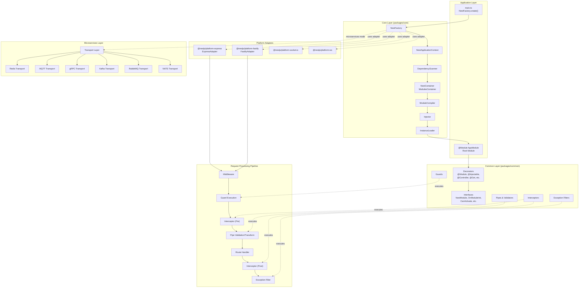
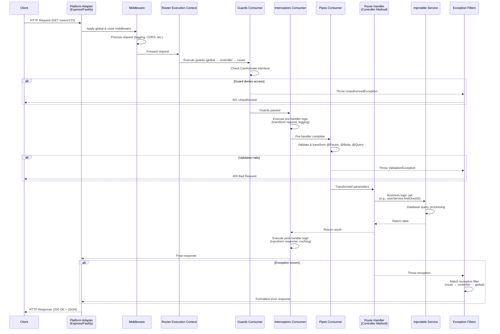
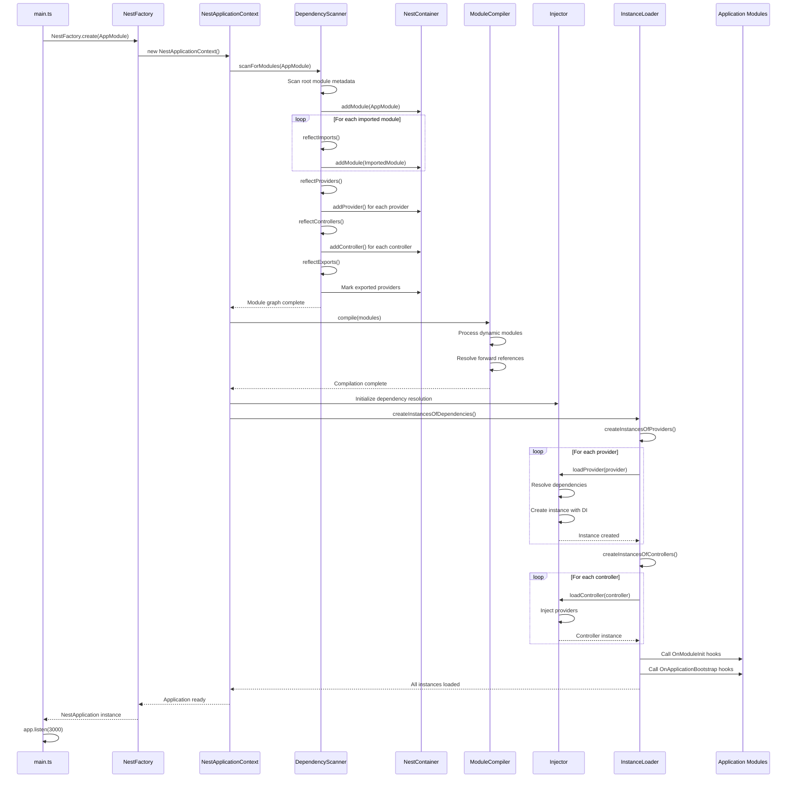
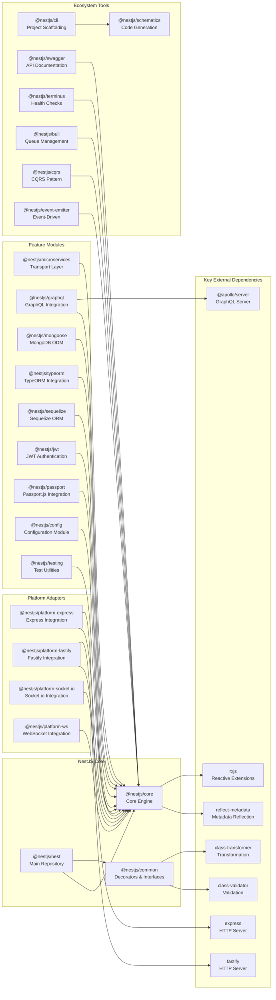

# NestJS

> A progressive Node.js framework for building efficient, scalable, and enterprise-grade server-side applications with TypeScript/JavaScript

| Metadata | |
|---|---|
| Repository | https://github.com/nestjs/nest |
| License | MIT License |
| Primary Language | TypeScript |
| Category | Web Framework |
| Analyzed Release | `v11.1.13` (2026-02-03) |
| Stars (approx.) | 74,489 |
| Generated by | Claude Sonnet 4.5 (Anthropic) |
| Generated on | 2026-02-08 |

## Overview

NestJS is an open-source server-side framework that provides an application architecture out of the box, enabling developers to create highly testable, scalable, loosely coupled, and easily maintainable applications. Built with TypeScript and heavily inspired by Angular, it combines elements of Object-Oriented Programming (OOP), Functional Programming (FP), and Functional Reactive Programming (FRP).

Problems it solves:

- Lack of standardized architecture in Node.js applications, leading to inconsistent project structures and maintenance challenges across teams
- Difficulty in achieving dependency injection and inversion of control in JavaScript/TypeScript without extensive boilerplate
- Complex integration of multiple transport layers (HTTP, WebSocket, microservices) and platforms (Express, Fastify) with unified interfaces
- Enterprise-grade application development requiring modular design, testability, and scalability in the Node.js ecosystem

Positioning:

NestJS has established itself as the leading enterprise Node.js framework, particularly for teams familiar with Angular's architecture. It serves as a production-ready alternative to vanilla Express or Fastify, offering opinionated structure without sacrificing flexibility. As of 2026, it has become the de facto standard for building scalable Node.js backends, with widespread adoption in microservices architectures and GraphQL APIs.

## Architecture Overview

NestJS employs a modular, layered architecture built around three core concepts: Modules, Controllers, and Providers. At startup, the IoC container scans metadata from decorators, constructs a dependency graph, and instantiates all components with proper dependency injection. The framework abstracts platform-specific implementations through adapters, enabling seamless switching between Express and Fastify or different microservice transporters.

## Core Components

### NestFactory and Application Context (`packages/core/nest-factory.ts`, `packages/core/nest-application-context.ts`)

- Responsibility: Application bootstrapping, platform adapter selection, and global configuration
- Key files: `packages/core/nest-factory.ts`, `packages/core/nest-application-context.ts`, `packages/core/nest-application.ts`
- Design patterns: Abstract Factory pattern, Adapter pattern

The NestFactory serves as the entry point for creating NestJS applications. It provides static methods like `create()`, `createMicroservice()`, and `createApplicationContext()` that initialize the application with the appropriate platform adapter (Express or Fastify for HTTP, or various transporters for microservices). The factory instantiates the NestApplicationContext, which orchestrates the dependency scanning, module compilation, and instance loading phases. It imports key components including ModuleCompiler, NestContainer, Injector, and InstanceLinksHost to coordinate the initialization process.

### Dependency Scanner and Container (`packages/core/scanner.ts`, `packages/core/injector/container.ts`)

- Responsibility: Module discovery, metadata extraction, and dependency graph construction
- Key files: `packages/core/scanner.ts`, `packages/core/injector/container.ts`, `packages/core/injector/modules-container.ts`
- Design patterns: Registry pattern, Dependency Graph pattern

The DependencyScanner scans the application starting from the root module, recursively discovering all modules, controllers, and providers through decorator metadata. It executes four key reflection operations: reflectImports, reflectProviders, reflectControllers, and reflectExports. The NestContainer serves as the top-level registry, holding all modules in a ModulesContainer (implemented as a Map) and coordinating their interactions through methods like `addModule()`, `addProvider()`, and `bindGlobalScope()`. This component leverages the reflect-metadata library to read metadata attached by decorators at runtime.

### Injector and Instance Loader (`packages/core/injector/injector.ts`, `packages/core/injector/instance-loader.ts`)

- Responsibility: Dependency resolution, instance creation, and lifecycle management
- Key files: `packages/core/injector/injector.ts`, `packages/core/injector/instance-loader.ts`, `packages/core/injector/instance-wrapper.ts`, `packages/core/injector/module.ts`
- Design patterns: Dependency Injection pattern, Singleton pattern, Factory pattern

The Injector is the core of NestJS's IoC container, responsible for resolving dependencies and creating instances with proper injection. It manages three types of providers: class providers, value providers, and factory providers. The InstanceLoader coordinates the creation of all instances during application startup by calling `createInstancesOfProviders()`, `createInstancesOfControllers()`, and `createInstancesOfInjectables()` in sequence. Each provider is wrapped in an InstanceWrapper that manages its lifecycle, scope (singleton, request, or transient), and initialization state. The injector supports circular dependency detection and resolution through forward references.

### Module Compiler (`packages/core/injector/compiler.ts`)

- Responsibility: Dynamic module compilation and metadata resolution
- Key files: `packages/core/injector/compiler.ts`, `packages/core/injector/module.ts`
- Design patterns: Compiler pattern, Builder pattern

The ModuleCompiler processes both static and dynamic modules, resolving module metadata and handling dynamic module factories. Dynamic modules are created by methods that return a DynamicModule object (with module, providers, exports properties), allowing runtime configuration. The compiler ensures all module dependencies are properly registered and compiled before instantiation begins, enabling conditional module loading and configuration based on environment or runtime conditions.

### Decorators and Metadata (`packages/common/decorators/`)

- Responsibility: Metadata attachment for dependency injection and routing configuration
- Key files: `packages/common/decorators/core/injectable.decorator.ts`, `packages/common/decorators/core/module.decorator.ts`, `packages/common/decorators/core/controller.decorator.ts`, `packages/common/decorators/http/request-mapping.decorator.ts`
- Design patterns: Decorator pattern, Metadata reflection

NestJS decorators are the primary mechanism for defining application structure and behavior. Key decorators include @Module() for defining module boundaries, @Injectable() for marking providers as injectable, @Controller() for defining route controllers, and HTTP method decorators (@Get(), @Post(), etc.) for route handlers. These decorators use reflect-metadata to attach type information and configuration metadata to classes, methods, and parameters. The metadata is later read by the scanner and injector during application initialization. Parameter decorators like @Param(), @Body(), @Query() leverage the create-route-param-metadata utility to extract request data and pass it to route handlers.

### Request Processing Pipeline (`packages/core/router/`, `packages/core/middleware/`, `packages/core/guards/`, `packages/core/interceptors/`, `packages/core/pipes/`)

- Responsibility: HTTP request routing and processing through middleware, guards, interceptors, pipes, and filters
- Key files: `packages/core/router/router-execution-context.ts`, `packages/core/guards/guards-consumer.ts`, `packages/core/interceptors/interceptors-consumer.ts`, `packages/core/pipes/pipes-consumer.ts`
- Design patterns: Chain of Responsibility pattern, Strategy pattern

When an HTTP request arrives, it flows through a well-defined pipeline: Middleware → Guards → Interceptors (pre-handler) → Pipes → Route Handler → Interceptors (post-handler) → Exception Filters. Middleware functions run first and can modify the request/response objects. Guards determine if the request should be handled (authorization/authentication). Interceptors can transform the request before and the response after handler execution. Pipes validate and transform input data. Exception filters catch and handle errors. This pipeline architecture is implemented through consumer classes (GuardsConsumer, InterceptorsConsumer, PipesConsumer) that apply each layer in the correct order, with each component defined by an interface (CanActivate, NestInterceptor, PipeTransform, ExceptionFilter).

### Platform Adapters (`packages/platform-express/`, `packages/platform-fastify/`)

- Responsibility: Abstraction layer over HTTP server implementations
- Key files: `packages/platform-express/adapters/express-adapter.ts`, `packages/platform-fastify/adapters/fastify-adapter.ts`, `packages/core/adapters/http-adapter.ts`
- Design patterns: Adapter pattern, Bridge pattern

NestJS implements the adapter pattern to abstract underlying HTTP server libraries. The AbstractHttpAdapter defines a common interface that all concrete adapters must implement, providing methods for route registration, middleware application, and server lifecycle management. ExpressAdapter and FastifyAdapter are the two main implementations, wrapping Express and Fastify respectively. This abstraction allows developers to switch between platforms with minimal code changes (typically only in main.ts) while maintaining compatibility with the NestJS programming model. The adapter pattern also enables platform-specific optimizations and features to be leveraged without affecting application code.

### Microservices Transport Layer (`packages/microservices/`)

- Responsibility: Message-based communication across different transport protocols
- Key files: `packages/microservices/server/server.ts`, `packages/microservices/client/client-proxy.ts`, `packages/microservices/ctx-host/base-rpc.context.ts`
- Design patterns: Strategy pattern, Proxy pattern

NestJS microservices support six built-in transport implementations: Redis, MQTT, NATS, RabbitMQ, Kafka, and gRPC. Each transport is implemented as a strategy conforming to the Server interface for message consumption and ClientProxy interface for message production. The framework supports both request-response and event-based message patterns. The transport layer enables applications to switch between protocols with configuration changes rather than code changes. Microservice controllers use @MessagePattern() and @EventPattern() decorators instead of HTTP route decorators, with the same dependency injection and lifecycle hooks available in HTTP applications.

### Testing Module (`packages/testing/`)

- Responsibility: Test harness for unit and integration testing
- Key files: `packages/testing/testing-module.ts`, `packages/testing/test.ts`
- Design patterns: Builder pattern, Dependency Injection

The TestingModule provides a complete testing environment that mimics the production application structure. Test.createTestingModule() allows developers to define a test module with the same structure as application modules but with the ability to override providers with mocks using overrideProvider(). This enables isolated unit testing of services and controllers by mocking dependencies. The testing module supports all injection scopes and lifecycle hooks, making it suitable for both unit and integration testing. It integrates seamlessly with Jest and other testing frameworks.

## Data Flow

### HTTP Request Lifecycle

### Application Initialization Flow

## Key Design Decisions

### 1. Decorator-Based Metadata Architecture with reflect-metadata

- Choice: Using TypeScript decorators combined with reflect-metadata library for dependency injection and configuration
- Rationale: Provides a clean, declarative syntax similar to Angular, reducing boilerplate while maintaining type safety. Decorators enable metadata attachment at design time that can be read at runtime by the IoC container. This approach allows the framework to scan and understand the application structure without requiring explicit registration calls
- Trade-offs: Requires enabling experimental decorators in TypeScript (experimentalDecorators: true). Creates tight coupling to the reflect-metadata library. Increases the learning curve for developers unfamiliar with decorator syntax. Metadata is not visible at compile time, making some errors appear only at runtime during initialization

### 2. Platform-Agnostic Adapter Pattern

- Choice: Abstracting HTTP server implementations (Express, Fastify) behind the AbstractHttpAdapter interface
- Rationale: Enables developers to switch between Express and Fastify (or implement custom adapters) without changing application code. Express is the default due to its mature ecosystem and middleware availability, but Fastify support provides up to 2x performance improvements for performance-critical applications. The adapter pattern future-proofs the framework against changes in underlying HTTP libraries
- Trade-offs: Some platform-specific features require adapter-specific code. Performance overhead from the abstraction layer (though minimal). Lowest common denominator approach means not all platform features are exposed through the abstraction. Maintaining multiple adapters increases framework maintenance burden

### 3. Modular Architecture with Hierarchical Dependency Injection

- Choice: Organizing applications into modules with scoped providers and explicit import/export relationships
- Rationale: Prevents dependency sprawl in large applications by enforcing clear boundaries. Modules can be lazy-loaded or conditionally registered. The hierarchical structure mirrors domain-driven design principles, making the codebase more maintainable. Explicit exports prevent accidental tight coupling between modules. This architecture scales from small applications to large monorepos with multiple microservices
- Trade-offs: Requires understanding of module system and provider scoping. Initial setup involves more boilerplate compared to plain Express. Circular dependencies between modules must be carefully managed with forward references. Global providers break module encapsulation but are sometimes necessary

### 4. Request Processing Pipeline (Middleware → Guards → Interceptors → Pipes → Filters)

- Choice: Implementing a fixed execution order for request processing components with specific responsibilities for each layer
- Rationale: Provides separation of concerns with each layer handling a specific aspect of request processing. Middleware handles cross-cutting concerns, Guards handle authorization, Interceptors transform requests/responses, Pipes validate/transform input, and Filters handle exceptions. The fixed order ensures predictable behavior and makes it easier to reason about request flow. This layered approach is familiar to developers from other frameworks (ASP.NET, Spring)
- Trade-offs: Fixed execution order may not suit all use cases (though composition provides flexibility). Multiple execution points (global, controller, route) add complexity. Performance overhead from executing multiple layers, even if some do nothing. Developers must understand which layer is appropriate for each concern

### 5. Compile-Time Dependency Injection Container

- Choice: Building the dependency graph at application startup rather than runtime per-request resolution
- Rationale: Startup-time DI provides better performance by avoiding dependency resolution on every request. Circular dependencies and missing dependencies are detected early during initialization rather than in production. Enables singleton, request-scoped, and transient providers with different lifecycle management. The container can be inspected and debugged before handling requests. This approach follows Spring Framework's model rather than runtime DI frameworks
- Trade-offs: Slower startup time for large applications with many providers. Startup errors can be less clear than runtime errors. Circular dependencies require explicit forward references. Dynamic provider registration after initialization is complex. Memory footprint includes all providers even if some are rarely used

### 6. Unified Microservices Abstraction

- Choice: Providing a common programming model for HTTP, WebSocket, and microservice transports (Redis, gRPC, Kafka, MQTT, NATS, RabbitMQ)
- Rationale: Developers can write application logic once and switch transports through configuration. Message patterns (@MessagePattern, @EventPattern) work consistently across all transports. This enables gradual migration from monolith to microservices or between microservice communication protocols. The abstraction reduces vendor lock-in and makes it easier to adopt new transport protocols. Testing is simplified since the same mocking strategies work across transports
- Trade-offs: Lowest common denominator approach means some transport-specific features require breaking the abstraction. Protocol overhead from the abstraction layer. Learning curve for developers who need to understand both HTTP and message-based communication. Some transports have better support than others, leading to inconsistent feature availability

## Dependencies

## Testing Strategy

NestJS employs a comprehensive testing strategy with first-class support for unit, integration, and end-to-end testing built directly into the framework.

Unit tests: The TestingModule provides isolated testing environments where individual services, controllers, or other providers can be tested with mocked dependencies. The overrideProvider() method allows replacing real dependencies with mocks or stubs. Unit tests are typically placed alongside source files with a .spec.ts extension. NestJS uses Jest as the default test runner, leveraging its mocking capabilities for dependency isolation. Each component can be tested independently by creating a minimal testing module containing only the component under test and its mocked dependencies.

Integration tests: Integration testing in NestJS involves testing modules with real dependencies rather than mocks, verifying that components interact correctly. Test.createTestingModule() can compile entire modules with all their providers, controllers, and dependencies. Database integration tests typically use in-memory databases or test database instances. The testing module supports all lifecycle hooks (OnModuleInit, OnApplicationBootstrap) ensuring the test environment matches production behavior. Integration tests verify module composition, provider exports/imports, and cross-module communication.

E2E tests: End-to-end tests in NestJS test the entire application stack from HTTP request to response, simulating real user scenarios. E2E tests are placed in a separate test directory and use supertest library to make HTTP requests. A full application instance is created with NestFactory.create() in test mode, allowing testing of the complete request pipeline including middleware, guards, interceptors, pipes, and exception filters. E2E tests verify authentication flows, API contracts, error handling, and integration with external services.

CI/CD: The NestJS repository uses GitHub Actions for continuous integration. The CI pipeline runs unit tests, integration tests (requiring Docker for databases), linter checks, and build verification across multiple Node.js versions. Code formatting is enforced through Prettier with npm run format. The build system uses npm scripts for compilation, with npm run build compiling packages and moving them to sample directories for testing. The project follows conventional commit message format for automated changelog generation.

## Key Takeaways

1. Decorator-driven architecture: Using TypeScript decorators with reflect-metadata for dependency injection and routing creates a declarative, Angular-like programming model. This approach reduces boilerplate and enables powerful abstractions, but requires understanding the metadata reflection system. Applicable to any TypeScript framework requiring dependency injection or metadata-driven configuration.

2. Platform abstraction through adapters: The AbstractHttpAdapter pattern enables framework-agnostic application code while supporting multiple underlying implementations (Express, Fastify). This demonstrates how to build portable abstractions over third-party libraries without sacrificing platform-specific optimizations. The pattern is broadly applicable to any framework that needs to support multiple backends.

3. Modular architecture with scoped dependencies: The module system with explicit imports/exports enforces architectural boundaries and prevents dependency sprawl in large applications. This hierarchical structure combined with provider scoping creates maintainable, testable codebases. The concept applies to any large application requiring clear domain boundaries and controlled dependency access.

4. Request processing pipeline with separation of concerns: The fixed execution order (Middleware → Guards → Interceptors → Pipes → Filters) with specific responsibilities creates predictable, maintainable request handling. This pattern separates authentication, authorization, validation, transformation, and error handling into distinct layers. Applicable to any web framework requiring structured request processing.

5. Compile-time dependency resolution: Building the dependency graph at startup rather than per-request provides better performance and earlier error detection. The IoC container's ability to manage singleton, request-scoped, and transient providers with different lifecycles demonstrates sophisticated dependency management. This approach is valuable for any framework prioritizing startup-time validation over runtime flexibility.

6. Unified programming model across transports: Using the same decorators and patterns for HTTP, WebSocket, and microservices (gRPC, Kafka, Redis) reduces cognitive load and enables protocol switching through configuration. This abstraction demonstrates how to create transport-agnostic application logic. Applicable to any distributed system requiring consistent programming models across different communication patterns.

## References

- [NestJS Official Documentation](https://docs.nestjs.com/)
- [NestJS GitHub Repository](https://github.com/nestjs/nest)
- [A Guide on Dependency Injection in NestJS](https://www.digitalocean.com/community/tutorials/a-guide-on-dependency-injection-in-nestjs)
- [NestJS Metadata Deep Dive](https://trilon.io/blog/nestjs-metadata-deep-dive)
- [Request Lifecycle - NestJS FAQ](https://docs.nestjs.com/faq/request-lifecycle)
- [Deep Dive into NestJS Decorators](https://dev.to/tejastn10/deep-dive-into-nestjs-decorators-internals-usage-and-custom-implementations-4eha)
- [Understanding Inversion of Control (IoC) in NestJS](https://thismajid.medium.com/understanding-inversion-of-control-ioc-and-its-implementation-in-nestjs-765dcc1d6445)
- [What Is NestJS? A Practical 2026 Guide](https://thelinuxcode.com/what-is-nestjs-a-practical-2026-guide-to-building-scalable-nodejs-backends/)
- [Performance (Fastify) - NestJS Documentation](https://docs.nestjs.com/techniques/performance)
- [Choosing the Right Microservices Communication Protocol in NestJS](https://medium.com/@piash.tanjin/choosing-the-right-microservices-communication-protocol-in-nestjs-a-practical-guide-fc017cf2fa88)
