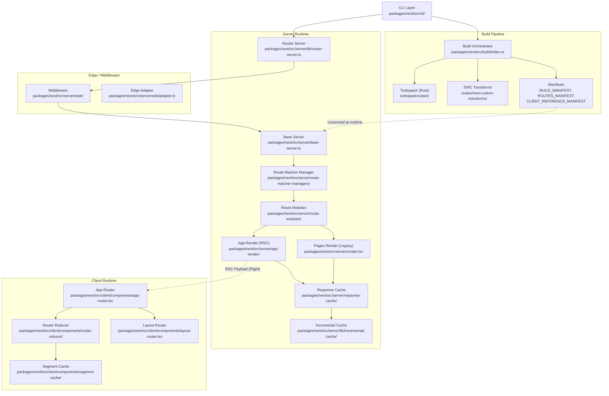
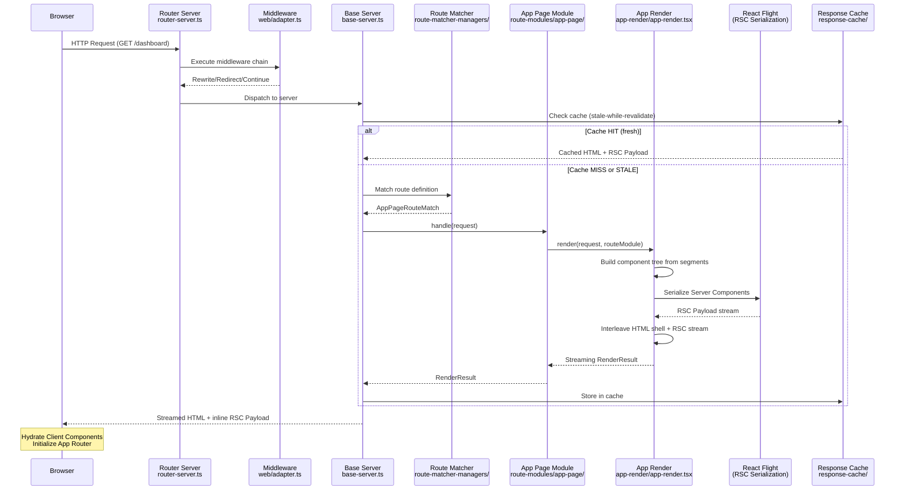
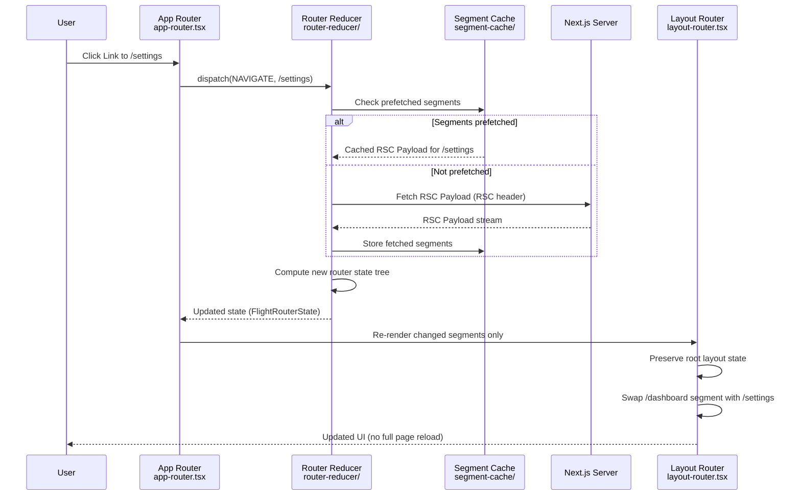
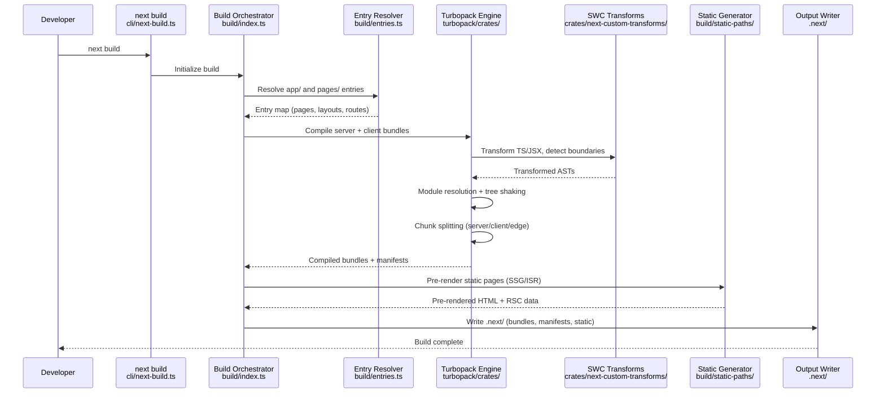
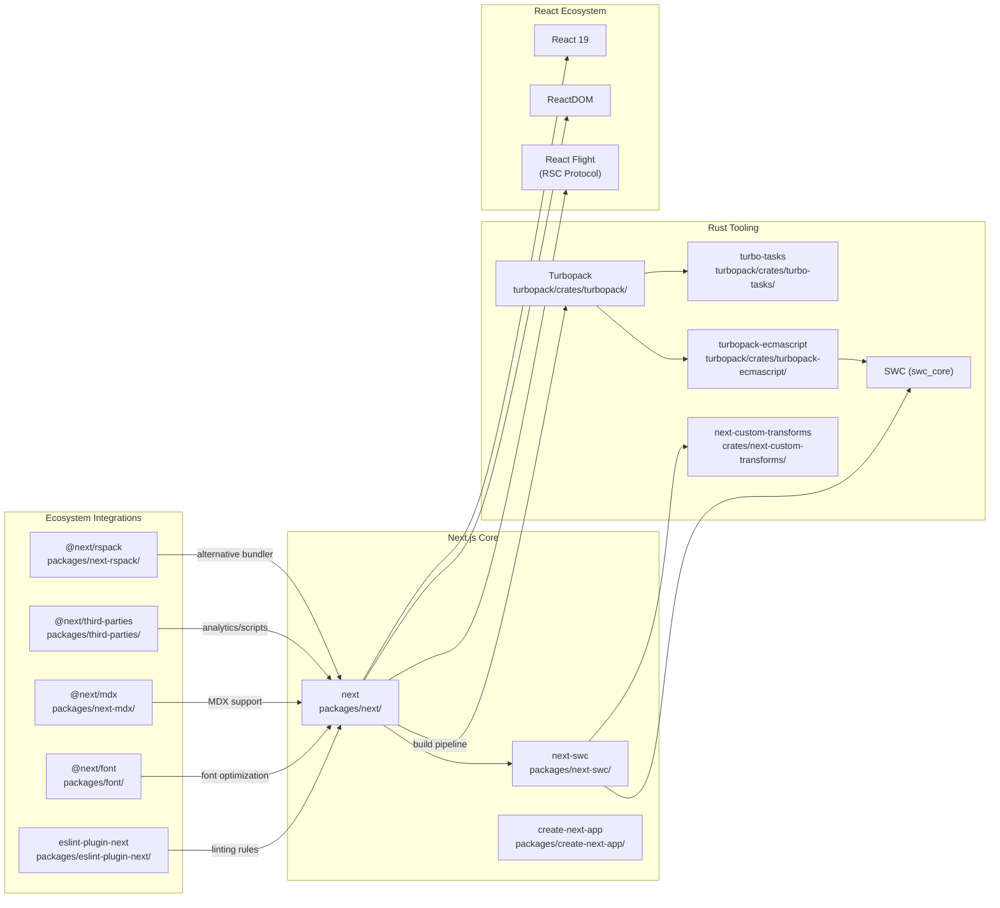

# Next.js

> The React Framework for full-stack web applications, extending React with server-side rendering, file-system routing, and Rust-based tooling for the fastest builds.

| Metadata | |
|---|---|
| Repository | https://github.com/vercel/next.js |
| License | MIT |
| Primary Language | JavaScript / TypeScript / Rust |
| Category | Web Framework |
| Analyzed Release | `v16.1.6` (2026-01-27) |
| Stars (approx.) | 137,600 |
| Generated by | Claude Opus 4.6 (Anthropic) |
| Generated on | 2026-02-08 |

## Overview

Next.js is a full-stack React framework built by Vercel that provides server-side rendering, static site generation, incremental static regeneration, and a file-system based router (App Router). It integrates Turbopack, a Rust-based incremental bundler, as its default development and production build tool since v16. The framework operates as a monorepo containing over 50 Rust crates for Turbopack and numerous JavaScript/TypeScript packages forming the core runtime, CLI, build pipeline, and client-side navigation layer.

Problems it solves:

- Eliminates the complexity of configuring SSR, SSG, ISR, and streaming for React applications by providing a unified framework with sensible defaults
- Replaces slow JavaScript-based bundlers (webpack) with Turbopack, a Rust-based incremental bundler achieving up to 10x faster HMR and 2-5x faster production builds
- Bridges the server-client boundary through React Server Components (RSC) and Server Functions, enabling developers to colocate server and client logic within a single component tree
- Provides a file-system based routing convention (App Router) that maps directory structures to URL routes with built-in support for layouts, loading states, error boundaries, and parallel routes

Positioning:

Next.js occupies the dominant position among React meta-frameworks, competing directly with Remix (now React Router framework mode), Gatsby, and Astro. Compared to Remix, Next.js offers deeper Vercel platform integration and a more opinionated caching/rendering pipeline. Unlike Gatsby which focuses on static sites, Next.js provides a spectrum of rendering strategies (SSR, SSG, ISR, Streaming, PPR) selectable per-route. The Turbopack integration positions it against Vite-based frameworks on build performance. Its monorepo design with Rust crates (`turbopack/crates/`) represents a significant investment in native tooling that competitors have not matched.

## Architecture Overview

Next.js is structured as a layered architecture with three primary execution environments: the build pipeline (Turbopack/webpack compilation), the server runtime (Node.js or Edge), and the client runtime (browser). The build layer transforms source files into optimized bundles and manifests. The server layer handles incoming HTTP requests, resolves routes through a matcher system, and renders pages via the App Render pipeline (RSC) or the Pages Render pipeline (legacy). The client layer manages navigation, hydration, and the Router Cache for seamless single-page-app transitions.

## Core Components

### CLI and Entry Points (`packages/next/src/cli/`)

- Responsibility: Parse command-line arguments and dispatch to the appropriate subsystem (dev, build, start, export, info, telemetry, test, typegen)
- Key files: `packages/next/src/cli/next-dev.ts`, `packages/next/src/cli/next-build.ts`, `packages/next/src/cli/next-start.ts`
- Design patterns: Command pattern with each subcommand isolated into its own module

The CLI layer serves as the primary entry point for developers. `next dev` bootstraps the development server with Hot Module Replacement via Turbopack, `next build` triggers the full production compilation pipeline, and `next start` launches the production Node.js server. Each CLI command initializes the appropriate configuration from `next.config.ts` / `next.config.js` via the config loader at `packages/next/src/server/config.ts`, which validates against a schema defined in `packages/next/src/server/config-schema.ts`.

### Build Pipeline (`packages/next/src/build/`)

- Responsibility: Compile application source code into optimized bundles, generate routing manifests, perform static analysis, and produce pre-rendered pages
- Key files: `packages/next/src/build/index.ts`, `packages/next/src/build/compiler.ts`, `packages/next/src/build/entries.ts`, `packages/next/src/build/webpack-config.ts`, `packages/next/src/build/turbopack-build/`
- Design patterns: Pipeline pattern with sequential compilation phases; Strategy pattern for selecting Turbopack vs. webpack vs. Rspack backend

The build orchestrator (`index.ts`) coordinates the entire compilation process: collecting entry points from the file system, running SWC transforms for TypeScript/JSX transpilation, bundling with Turbopack (default since v16) or webpack, generating manifests (`BUILD_MANIFEST`, `ROUTES_MANIFEST`, `CLIENT_REFERENCE_MANIFEST`, `SERVER_REFERENCE_MANIFEST`), and executing static generation for pages that can be pre-rendered. The `entries.ts` file resolves all page and layout entry points from the `app/` and `pages/` directories. The `file-classifier.ts` determines whether a file is a Server Component, Client Component, or middleware.

### Turbopack Engine (`turbopack/crates/`)

- Responsibility: Provide a high-performance incremental bundling engine written in Rust, managing module resolution, transformation, chunking, and caching
- Key files: `turbopack/crates/turbopack-core/` (core abstractions), `turbopack/crates/turbo-tasks/` (incremental computation engine), `turbopack/crates/turbopack-ecmascript/` (JS/TS module handling), `turbopack/crates/turbo-tasks-fs/` (file system watching), `turbopack/crates/turbo-persistence/` (disk cache)
- Design patterns: Incremental computation with memoized "Value Cells"; unified dependency graph across server/client/edge environments; parallel execution across CPU cores

Turbopack is the Rust-based incremental bundler at the heart of Next.js. The `turbo-tasks` crate implements the foundational incremental computation framework where every piece of work (file reads, AST parsing, module resolution, code generation) is represented as a "task" whose output is a "Value Cell" that is automatically invalidated and recomputed when its inputs change. The `turbopack-core` crate defines the abstract module graph, chunk graph, and asset pipeline. The `turbopack-ecmascript` crate handles JavaScript and TypeScript module parsing, tree-shaking, and code generation. The `turbo-tasks-fs` crate provides file system watching with change detection. This architecture enables Turbopack to parallelize work across all CPU cores (unlike webpack where only SWC transforms are parallelized) and to perform minimal recomputation on file changes, yielding up to 10x faster Fast Refresh.

### SWC Custom Transforms (`crates/next-custom-transforms/`)

- Responsibility: Implement Next.js-specific code transformations as SWC compiler plugins (written in Rust)
- Key files: `crates/next-custom-transforms/`, `crates/next-napi-bindings/` (Node.js N-API bridge to Rust)
- Design patterns: Visitor pattern for AST traversations; FFI bridge pattern via N-API bindings

Next.js extends SWC (the Rust-based JavaScript/TypeScript compiler) with custom transforms for server/client component boundary detection, Server Functions (server actions) extraction, metadata route generation, and `next/dynamic` import transformation. The `next-napi-bindings` crate exposes these Rust transforms to the Node.js build process via N-API, allowing the JavaScript-based build orchestrator to invoke Rust transforms without spawning separate processes.

### Router Server (`packages/next/src/server/lib/router-server.ts`)

- Responsibility: Accept incoming HTTP connections, run middleware/proxy, and dispatch requests to the appropriate Next.js server instance
- Key files: `packages/next/src/server/lib/router-server.ts`, `packages/next/src/server/lib/router-utils/resolve-routes.ts`, `packages/next/src/server/lib/router-utils/proxy-request.ts`
- Design patterns: Chain of Responsibility for request processing; Proxy pattern for middleware execution

The Router Server is the outermost HTTP handler in Next.js. It receives raw HTTP requests, applies middleware (executed in the Edge Runtime sandbox or, in v16, via the new `proxy.ts` running on Node.js), resolves the route using filesystem-based matchers, and delegates to the appropriate `BaseServer` method. Route resolution consults the `ROUTES_MANIFEST` for rewrites, redirects, headers, and dynamic routes. In development mode, `setup-dev-bundler.ts` integrates with Turbopack's HMR server to handle on-demand compilation.

### Base Server and Route Modules (`packages/next/src/server/base-server.ts`, `packages/next/src/server/route-modules/`)

- Responsibility: Core request handling logic shared between Node.js and Edge runtimes; modular route handlers for each route type
- Key files: `packages/next/src/server/base-server.ts`, `packages/next/src/server/next-server.ts`, `packages/next/src/server/route-modules/app-page/`, `packages/next/src/server/route-modules/app-route/`, `packages/next/src/server/route-modules/pages/`, `packages/next/src/server/route-modules/pages-api/`
- Design patterns: Template Method pattern (BaseServer defines the skeleton, NextServer and WebServer override specifics); Strategy pattern via RouteModule subtypes

`BaseServer` is the abstract foundation that defines the request lifecycle: parsing the URL, checking the response cache, loading components, rendering, and sending the response. `NextServer` extends it for the Node.js runtime while the Web/Edge server extends it for the Edge Runtime. The `route-modules/` directory contains four distinct module types: `app-page` (App Router pages with RSC), `app-route` (App Router API route handlers), `pages` (Pages Router pages with `getServerSideProps`/`getStaticProps`), and `pages-api` (Pages Router API routes). Each module type implements its own `render()` and `handle()` methods, encapsulating the differences between rendering strategies.

### App Render Pipeline (`packages/next/src/server/app-render/`)

- Responsibility: Render App Router pages using React Server Components, streaming HTML and RSC Payload to the client
- Key files: `packages/next/src/server/app-render/app-render.tsx`, `packages/next/src/server/app-render/create-component-tree.tsx`, `packages/next/src/server/app-render/use-flight-response.tsx`, `packages/next/src/server/app-render/work-async-storage.external.ts`
- Design patterns: React Flight protocol for RSC serialization; AsyncLocalStorage for per-request context (work storage, action storage, dynamic access storage); Streaming with Suspense boundaries

This is the heart of the App Router rendering engine. `app-render.tsx` orchestrates the full server-side rendering pipeline: it constructs the component tree from the matched route segments (`create-component-tree.tsx`), renders Server Components into RSC Payload using React Flight (`use-flight-response.tsx`), interleaves with HTML streaming for the initial shell, and handles dynamic rendering decisions (static vs. dynamic at the segment level). The `work-async-storage` and `work-unit-async-storage` modules use Node.js AsyncLocalStorage to maintain per-request context (cookies, headers, cache directives) across the async component tree without prop drilling. The `dynamic-rendering.ts` module determines whether a route or segment requires dynamic rendering based on the usage of `cookies()`, `headers()`, `searchParams`, or `unstable_noStore`.

### Response Cache and Incremental Cache (`packages/next/src/server/response-cache/`, `packages/next/src/server/lib/incremental-cache/`)

- Responsibility: Cache rendered responses (HTML and RSC Payload) and manage incremental static regeneration (ISR) with stale-while-revalidate semantics
- Key files: `packages/next/src/server/response-cache/index.ts`, `packages/next/src/server/lib/incremental-cache/index.ts`, `packages/next/src/server/lib/incremental-cache/file-system-cache.ts`, `packages/next/src/server/lib/cache-handlers/`
- Design patterns: Cache-Aside with stale-while-revalidate; Decorator pattern for layered caching (memory -> filesystem -> custom handler)

The Response Cache sits between the route modules and the client, storing rendered HTML and data payloads. For ISR routes, it implements stale-while-revalidate: serving the cached version immediately while triggering a background regeneration after the configured revalidation interval. The Incremental Cache provides the underlying storage layer with a default `file-system-cache.ts` implementation and support for custom cache handlers (e.g., Redis, DynamoDB) via the `cache-handlers/` directory. Tags-based invalidation (`tags-manifest.external.ts`) enables on-demand revalidation by cache tag. The `use-cache/` directory under `packages/next/src/server/use-cache/` implements the newer `"use cache"` directive introduced in v15/v16 for explicit component-level caching.

### Client-Side App Router (`packages/next/src/client/components/app-router.tsx`)

- Responsibility: Manage client-side navigation, prefetching, route transitions, and the in-memory Router Cache
- Key files: `packages/next/src/client/components/app-router.tsx`, `packages/next/src/client/components/app-router-instance.ts`, `packages/next/src/client/components/router-reducer/`, `packages/next/src/client/components/layout-router.tsx`, `packages/next/src/client/components/segment-cache/`
- Design patterns: Reducer pattern (React useReducer for complex state transitions); Tree reconciliation for nested layouts; Observer pattern for intersection-based prefetching

The client-side App Router manages the browser navigation experience. `app-router.tsx` wraps the entire application and holds the navigation state managed by `router-reducer/`, which processes actions like `NAVIGATE`, `SERVER_PATCH`, `PREFETCH`, and `RESTORE`. The Router Cache (stored in the reducer state) keeps previously fetched RSC Payloads indexed by route segment, enabling instant back/forward navigation without re-fetching. `layout-router.tsx` is responsible for rendering nested layouts and only updating the segments that changed during navigation, preserving the state of unchanged layout subtrees. The `segment-cache/` module implements segment-level prefetching, where hovering or intersecting with a `<Link>` triggers granular prefetching of only the data needed for the target route segments.

## Data Flow

### App Router Page Request (Server-Side Rendering with RSC)

### Client-Side Navigation (Soft Navigation)

### Production Build Pipeline

## Key Design Decisions

### 1. File-System Based Routing with Colocated Layouts

- Choice: Routes are defined by the directory structure under `app/`, where `page.tsx` defines the UI, `layout.tsx` defines shared wrapping layouts, `loading.tsx` defines Suspense fallbacks, and `error.tsx` defines error boundaries
- Rationale: Eliminates the need for a separate routing configuration file. Colocating layouts with their routes ensures that shared UI (navigation, sidebars) is defined once and automatically wraps nested routes. This maps directly to how React component trees compose, making the mental model intuitive.
- Trade-offs: Deep nesting of directories can become unwieldy for large applications. Route groups `(groupName)` mitigate this but add cognitive overhead. Dynamic routes (`[param]`) and catch-all routes (`[...slug]`) require specific naming conventions that developers must learn.

### 2. React Server Components as the Default Rendering Model

- Choice: All components in the App Router are Server Components by default. Client Components must opt in with the `"use client"` directive at the file boundary.
- Rationale: Server Components eliminate the need to ship JavaScript for UI that does not require interactivity, reducing bundle size. They can directly access backend resources (databases, file systems) without API endpoints. The RSC Payload (React Flight protocol) enables streaming and partial rendering.
- Trade-offs: The server/client boundary creates a mental model that is unfamiliar to traditional React developers. Certain patterns (hooks like `useState`, `useEffect`, browser APIs) are only available in Client Components. Serialization constraints (no functions, classes, or Dates in props crossing the boundary) add friction.

### 3. Turbopack as the Default Bundler (Replacing Webpack)

- Choice: Since v16, Turbopack is the default bundler for both development and production, replacing webpack which had been the default since Next.js inception.
- Rationale: Turbopack's Rust implementation enables true parallelism across CPU cores (webpack can only parallelize the SWC transform step). The incremental computation model (turbo-tasks) with memoized Value Cells ensures minimal recomputation on file changes, yielding 10x faster Fast Refresh. The unified graph handles server/client/edge module boundaries natively.
- Trade-offs: Webpack plugin ecosystem is not directly compatible; existing custom webpack configurations require migration. Turbopack's configuration surface is intentionally smaller, which limits customization. Debugging bundler issues requires understanding Rust tooling. The `turbopack/crates/` directory contains 50+ crates, making the bundler itself a substantial sub-project.

### 4. Layered Caching Architecture with Multiple Strategies

- Choice: Next.js implements four cache layers: Router Cache (client-side, in-memory), Full Route Cache (server-side, rendered output), Data Cache (server-side, fetch results), and Request Memoization (per-request deduplication). v16 shifted to explicit caching with `"use cache"` and `cacheLife()` directives.
- Rationale: Multiple cache layers ensure optimal performance at every stage of the request lifecycle. The shift to explicit caching in v16 (from aggressive implicit caching in v14/v15) addresses developer confusion about unexpected cached responses and provides clear, predictable caching behavior.
- Trade-offs: The multi-layered cache system is complex to reason about and debug. Cache invalidation remains the hardest problem; developers must understand tag-based revalidation (`revalidateTag`), time-based revalidation (`revalidate`), and on-demand revalidation patterns. The v14-to-v16 caching philosophy shift caused significant migration burden for existing applications.

### 5. Monorepo with Rust and TypeScript Cohabitation

- Choice: The repository houses both the TypeScript framework (`packages/next/`) and the Rust toolchain (`turbopack/crates/`, `crates/`) in a single monorepo, with N-API bindings (`crates/next-napi-bindings/`) bridging the two.
- Rationale: A single repository enables atomic changes that span both the framework and the bundler. When a new framework feature requires bundler support (e.g., Server Functions extraction, `"use cache"` directive handling), both changes land in a single commit. The N-API bridge allows the Node.js build orchestrator to invoke Rust transforms without process spawning overhead.
- Trade-offs: The repository is massive (137k+ stars, 30k+ forks, enormous CI matrix). Contributors need familiarity with both TypeScript and Rust ecosystems. Build times for the full repository are significant. The `turbopack/` directory was originally a separate repository (`vercel/turbo`) and was moved in to enable faster iteration, but this consolidation increased repository complexity.

## Dependencies

## Testing Strategy

Next.js employs an extensive multi-layered testing approach spanning unit tests, integration tests, and end-to-end tests across the entire monorepo.

Unit tests: Colocated `.test.ts` files exist throughout the codebase (e.g., `packages/next/src/server/config.test.ts`, `packages/next/src/server/lib/dedupe-fetch.test.ts`, `packages/next/src/client/flight-data-helpers.test.ts`). These test individual functions and modules in isolation. The Rust crates use standard `#[test]` annotations within each crate.

Integration tests: The `test/` directory at the repository root contains thousands of integration test suites organized by feature area (e.g., `test/e2e/app-dir/`, `test/development/`, `test/production/`). These tests spin up actual Next.js applications with specific configurations, make HTTP requests, and assert on rendered output, headers, and behavior. The testing framework uses `next-test-utils` for creating and managing test Next.js instances.

CI/CD: GitHub Actions runs an extensive CI matrix covering multiple Node.js versions, operating systems, and test shards. The test suite is sharded across dozens of parallel runners due to its size. Turbopack-specific tests run under `turbopack/crates/turbopack-tests/` with Rust's `cargo test`. The repository uses Turbo (turborepo) for task orchestration and caching across the monorepo CI pipeline.

## Key Takeaways

1. Incremental computation as a bundler foundation: Turbopack's `turbo-tasks` crate demonstrates that modeling every build operation as a memoized task with automatic dependency tracking and invalidation enables both maximum parallelism and minimal recomputation. This pattern is applicable to any system that processes a large interconnected graph of artifacts (compilers, CI pipelines, data processing frameworks).

2. Unified graph across execution environments: Turbopack uses a single module graph that spans server, client, and edge environments, with "transitions" marking boundary crossings. This avoids the traditional approach of running separate compilation passes for each target, reducing redundant work and ensuring consistency across environments. Any multi-target build system can benefit from this unified-graph-with-transitions model.

3. AsyncLocalStorage for implicit per-request context: The App Render pipeline uses Node.js AsyncLocalStorage extensively (`work-async-storage`, `action-async-storage`, `dynamic-access-async-storage`) to provide request-scoped context to deeply nested async Server Components without prop drilling. This pattern enables ergonomic APIs like `cookies()`, `headers()`, and cache directives that "just work" anywhere in the component tree, and is applicable to any Node.js server framework needing per-request state.

4. Segment-level rendering and caching granularity: Rather than caching entire pages, Next.js caches and revalidates at the route segment level (individual layouts and pages within the nested route tree). This enables partial pre-rendering (PPR) where a static shell is served instantly while dynamic segments stream in. The lesson is that fine-grained caching units aligned with the UI component tree yield better cache hit rates and more responsive user experiences than page-level caching.

5. Explicit over implicit caching defaults: The evolution from v14's aggressive implicit caching (which confused developers) to v16's explicit `"use cache"` directive demonstrates that performance optimizations which change observable behavior should be opt-in rather than opt-out. Making caching explicit reduces debugging complexity and aligns with the principle of least surprise, even at the cost of slightly more verbose code.

## References

- [Next.js Official Documentation](https://nextjs.org/docs)
- [Next.js 16 Blog Post](https://nextjs.org/blog/next-16)
- [Turbopack Architecture: Incremental Computation](https://nextjs.org/blog/turbopack-incremental-computation)
- [Turbopack API Reference](https://nextjs.org/docs/app/api-reference/turbopack)
- [Turbopack Dev is Now Stable](https://nextjs.org/blog/turbopack-for-development-stable)
- [Server and Client Components Guide](https://nextjs.org/docs/app/getting-started/server-and-client-components)
- [Next.js Caching Guide](https://nextjs.org/docs/app/guides/caching)
- [Next.js v16 Upgrade Guide](https://nextjs.org/docs/app/guides/upgrading/version-16)
- [Turbopack Moving Homes (Vercel Blog)](https://vercel.com/blog/turbopack-moving-homes)
- [Next.js 16 Release Coverage (InfoQ)](https://www.infoq.com/news/2025/12/nextjs-16-release/)
