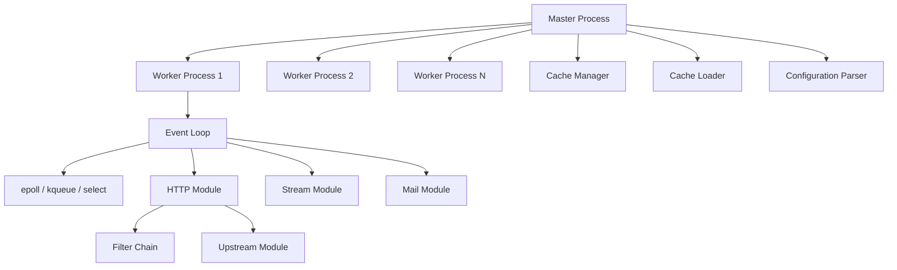
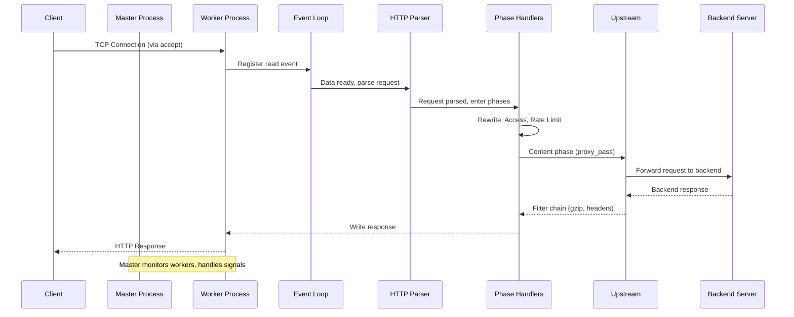
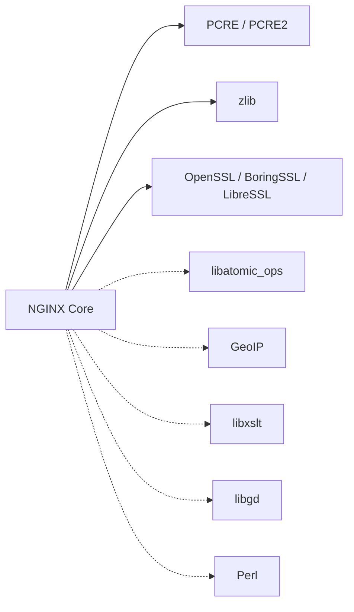

# nginx

> High-performance HTTP server, reverse proxy, and load balancer built on an event-driven, non-blocking architecture.

| Metadata | |
|---|---|
| Repository | https://github.com/nginx/nginx |
| License | BSD 2-Clause "Simplified" License |
| Primary Language | C |
| Category | Web Server |
| Analyzed Release | `release-1.28.2` (2026-02-04) |
| Stars (approx.) | 29,000+ |
| Generated by | Claude Opus 4.6 (Anthropic) |
| Generated on | 2026-02-09 |

---

## Overview

### Problem Domain

Traditional web servers like Apache used a process-per-connection or thread-per-connection model that consumed significant memory and CPU under high concurrency. As the web scaled to millions of simultaneous connections (the C10K problem and beyond), a fundamentally different architecture was needed.

### Project Positioning

NGINX (pronounced "engine-x") is a high-performance web server created by Igor Sysoev in 2004 to solve the C10K problem. It uses an event-driven, asynchronous, non-blocking architecture that allows a single worker process to handle thousands of concurrent connections with minimal memory overhead.

Beyond static file serving, NGINX functions as a reverse proxy, load balancer, HTTP cache, TLS terminator, and mail proxy. It has become the most widely deployed web server on the internet, powering a significant portion of the world's busiest websites. The project's architecture has influenced the design of many subsequent event-driven systems.

---

## Architecture Overview

---

## Core Components

### 1. Master-Worker Process Model

Responsibility: The master process manages the lifecycle of worker processes, reads configuration, binds to ports, and handles signals (reload, upgrade, shutdown). Worker processes handle all client connections independently.

Key Files:
- `src/core/nginx.c` -- Main entry point, master process loop, signal handling
- `src/core/ngx_cycle.c` -- Cycle initialization (configuration loading, module initialization, listener setup)
- `src/core/ngx_process_cycle.c` (in `src/os/`) -- Worker process spawning via `fork()`, process management
- `src/core/ngx_connection.c` -- Connection pool management
- `src/core/ngx_module.c` -- Module registration and initialization

Design Patterns:
- Master-Worker: One privileged master orchestrates N unprivileged workers
- Process Pool: Workers are pre-forked and recycled
- Shared Nothing: Each worker maintains its own event loop and connection pool, minimizing inter-process communication

Process Lifecycle:
1. Master reads configuration and validates it
2. Master binds to listening sockets
3. Master forks N worker processes (configurable via `worker_processes`)
4. Workers inherit listening sockets and enter their event loops
5. Master monitors workers and respawns on failure
6. On SIGHUP, master loads new config and gracefully replaces workers

### 2. Event-Driven Engine

Responsibility: Provides the non-blocking I/O event loop that allows each worker to handle thousands of connections concurrently using OS-specific event notification mechanisms.

Key Files:
- `src/event/ngx_event.c` -- Event module initialization and core event processing
- `src/event/ngx_event.h` -- Event structure definitions (`ngx_event_t`, `ngx_connection_t`)
- `src/event/ngx_event_accept.c` -- Connection acceptance handling
- `src/event/ngx_event_connect.c` -- Outbound connection establishment
- `src/event/ngx_event_timer.c` -- Red-black tree timer management
- `src/event/ngx_event_posted.c` -- Posted (deferred) event queue
- `src/event/modules/ngx_epoll_module.c` -- Linux epoll backend
- `src/event/modules/ngx_kqueue_module.c` -- BSD/macOS kqueue backend
- `src/event/modules/ngx_select_module.c` -- Portable select() fallback

Design Patterns:
- Reactor: Single-threaded event loop dispatches I/O events to handlers
- Strategy: Platform-specific event backends selected at compile/run time
- Observer: File descriptors register interest in events, get notified when ready

Event Loop Cycle:
1. Wait for events via epoll_wait/kevent/select
2. Process accepted connections
3. Read available data from ready connections
4. Execute request processing state machines
5. Write response data to ready connections
6. Process posted events (deferred work)
7. Expire and fire timer events
8. Return to step 1

### 3. HTTP Processing Pipeline

Responsibility: Handles HTTP request parsing, virtual host selection, location matching, content generation, and response filtering through a modular phase-based pipeline.

Key Files:
- `src/http/ngx_http.c` -- HTTP module initialization and configuration
- `src/http/ngx_http_core_module.c` -- Core HTTP module: server blocks, location matching, phase handlers
- `src/http/ngx_http_request.c` -- HTTP request parsing state machine
- `src/http/ngx_http_parse.c` -- Low-level HTTP protocol parser
- `src/http/ngx_http_header_filter_module.c` -- Response header construction
- `src/http/ngx_http_write_filter_module.c` -- Response body output
- `src/http/ngx_http_copy_filter_module.c` -- Response body copy filter
- `src/http/ngx_http_upstream.c` -- Upstream (proxy/backend) connection handling
- `src/http/ngx_http_variables.c` -- HTTP variable system

Design Patterns:
- State Machine: Request parsing uses explicit state machines for header/body parsing
- Chain of Responsibility: HTTP phases execute handlers in sequence
- Filter Chain: Response headers and body pass through ordered filter modules
- Intercepting Filter: Each filter can modify, add, or suppress content

HTTP Processing Phases (in order):
1. `NGX_HTTP_POST_READ_PHASE` -- After reading client request
2. `NGX_HTTP_SERVER_REWRITE_PHASE` -- Server-level URI rewrite
3. `NGX_HTTP_FIND_CONFIG_PHASE` -- Location block matching
4. `NGX_HTTP_REWRITE_PHASE` -- Location-level URI rewrite
5. `NGX_HTTP_POST_REWRITE_PHASE` -- Post-rewrite redirect check
6. `NGX_HTTP_PREACCESS_PHASE` -- Pre-access checks (rate limiting)
7. `NGX_HTTP_ACCESS_PHASE` -- Access control (IP, auth)
8. `NGX_HTTP_POST_ACCESS_PHASE` -- Post-access decision
9. `NGX_HTTP_PRECONTENT_PHASE` -- Pre-content (try_files)
10. `NGX_HTTP_CONTENT_PHASE` -- Content generation
11. `NGX_HTTP_LOG_PHASE` -- Request logging

### 4. Upstream and Load Balancing

Responsibility: Manages connections to backend servers for reverse proxying, with support for multiple load balancing algorithms, health checks, and connection pooling.

Key Files:
- `src/http/ngx_http_upstream.c` -- Core upstream connection management
- `src/http/ngx_http_upstream_round_robin.c` -- Round-robin load balancing (default)
- `src/http/modules/ngx_http_upstream_hash_module.c` -- Hash-based load balancing
- `src/http/modules/ngx_http_upstream_ip_hash_module.c` -- IP hash for session persistence
- `src/http/modules/ngx_http_upstream_least_conn_module.c` -- Least connections algorithm
- `src/http/modules/ngx_http_upstream_random_module.c` -- Random with two choices
- `src/http/modules/ngx_http_upstream_keepalive_module.c` -- Keepalive connection caching
- `src/http/modules/ngx_http_proxy_module.c` -- HTTP proxy implementation

Design Patterns:
- Strategy: Interchangeable load balancing algorithms
- Circuit Breaker: Failed backends are temporarily removed from the pool
- Connection Pool: Keepalive connections reused across requests

### 5. Configuration System

Responsibility: Parses the nginx.conf file into an internal representation, validates directives, and distributes configuration to modules organized in a hierarchical context structure (main, http, server, location).

Key Files:
- `src/core/ngx_conf_file.c` -- Configuration file parser
- `src/core/ngx_conf_file.h` -- Configuration data structures and directive definitions
- `src/http/ngx_http_config.h` -- HTTP-specific configuration context structures

Design Patterns:
- Hierarchical Configuration: Directives inherit from parent contexts (main > http > server > location)
- Command Pattern: Each directive has a handler function that processes its arguments

---

## Data Flow

---

## Key Design Decisions

### 1. Event-Driven Non-Blocking I/O

Choice: Use an event-driven architecture with non-blocking I/O instead of thread-per-connection.

Rationale: A single worker process can handle thousands of connections because it never blocks waiting for I/O. The OS event notification mechanism (epoll/kqueue) efficiently multiplexes I/O readiness across all connections.

Trade-offs: All code must be non-blocking, making the codebase more complex with explicit state machines. CPU-intensive operations (e.g., SSL handshakes, gzip compression) can block the event loop. Long-running operations require careful chunking or thread pool offloading.

### 2. Master-Worker Process Architecture

Choice: Use a master process that forks pre-configured worker processes, each running independently.

Rationale: Workers share listening sockets but operate independently, providing fault isolation. A crashed worker does not affect others. The master can perform graceful configuration reloads and binary upgrades without downtime.

Trade-offs: Inter-process communication is limited (shared memory zones for caching and limits). Each worker has its own memory space, so caches and connection pools are not shared by default. The number of workers must be tuned to the hardware.

### 3. Modular Phase-Based HTTP Processing

Choice: Process HTTP requests through a fixed sequence of 11 phases, each allowing module handlers to participate.

Rationale: Phases provide clear separation of concerns (rewriting, access control, content generation, logging). Modules can hook into specific phases without modifying core code. The fixed ordering ensures predictable behavior.

Trade-offs: The rigid phase ordering limits flexibility -- some use cases require processing that does not fit neatly into the phase model. Module interaction can be subtle when multiple modules register handlers in the same phase.

### 4. C-Language Implementation with Custom Allocators

Choice: Implement entirely in C with custom memory pools, string types, and data structures.

Rationale: C provides maximum performance and control over memory layout. Custom pool allocators (ngx_pool_t) reduce allocation overhead and simplify cleanup -- the entire request pool is freed at once when the request completes.

Trade-offs: Higher development complexity and risk of memory safety issues. No garbage collection. Custom data structures (ngx_array_t, ngx_list_t, ngx_rbtree_t) have a learning curve for contributors.

### 5. Filter Chain for Response Processing

Choice: Response headers and body pass through an ordered chain of filter modules before being sent to the client.

Rationale: Allows composable response transformations (gzip, chunked encoding, header manipulation, SSI, sub_filter) without modifying content generators. Each filter is a self-contained module.

Trade-offs: Filter ordering is determined at compile time by module order, which is not immediately obvious. Adding or removing filters requires recompilation. Buffer management across the filter chain adds complexity.

---

## Dependencies

NGINX has minimal required dependencies:
- PCRE/PCRE2: Regular expression support for location matching and rewrite rules
- zlib: Gzip compression for response bodies
- OpenSSL: TLS/SSL termination

Optional dependencies enable additional modules (GeoIP, XSLT, image filtering, embedded Perl).

---

## Testing Strategy

- Test Suite: NGINX uses a Perl-based test framework (`nginx-tests` repository, separate from main repo)
- Test Types: Integration tests that start NGINX instances, send HTTP requests, and verify responses
- Test Scope: HTTP protocol compliance, proxy behavior, load balancing, SSL/TLS, caching, access control, rewrite rules, upstream failover
- Platform Testing: Tests run across Linux, FreeBSD, macOS, and Windows
- Configuration Testing: Tests validate configuration parsing, error detection, and directive inheritance
- Performance Testing: Separate benchmarking infrastructure for regression detection

The test suite is maintained in a separate repository (https://github.com/nginx/nginx-tests) and contains hundreds of test scripts covering all major NGINX features.

---

## Key Takeaways

1. Event-Driven Architecture at Its Finest: NGINX's single-threaded event loop per worker process demonstrates that non-blocking I/O can achieve massive concurrency with minimal resources. A single worker can handle tens of thousands of simultaneous connections.

2. Process Isolation for Reliability: The master-worker model provides zero-downtime configuration reloads, graceful binary upgrades, and fault isolation. If a worker crashes, the master respawns it without affecting other workers or active connections.

3. Modular Design in C: Despite being written in C, NGINX achieves remarkable modularity through its phase handler system, filter chains, and module API. Over 50 HTTP modules are included, each self-contained with its own configuration directives and handlers.

4. Memory Pool Architecture: NGINX's pool-based memory allocation (ngx_pool_t) ties memory lifetime to request lifetime, eliminating most memory leak risks and reducing allocator pressure. This pattern is particularly effective for request/response processing where all allocations have a clear scope.

5. Influence on Modern Infrastructure: NGINX's architecture has influenced the design of many modern systems including Envoy, HAProxy, and Cloudflare's edge infrastructure. Its event-driven model has become the standard approach for high-performance network services.

---

## References

- NGINX Official Documentation: https://nginx.org/en/docs/
- Inside NGINX: How We Designed for Performance and Scale: https://blog.nginx.org/blog/inside-nginx-how-we-designed-for-performance-scale
- NGINX Source Code: https://github.com/nginx/nginx
- NGINX Development Guide: https://nginx.org/en/docs/dev/development_guide.html
- NGINX Architecture (The Architect's Notebook): https://thearchitectsnotebook.substack.com/p/nginx-uncovered-part-1-architecture
