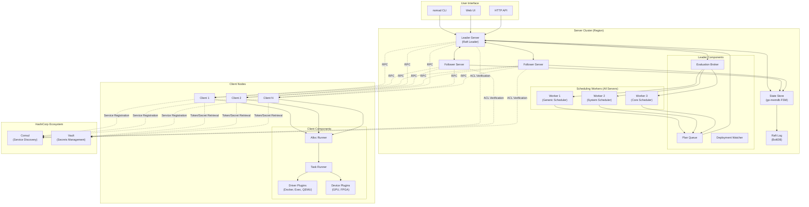
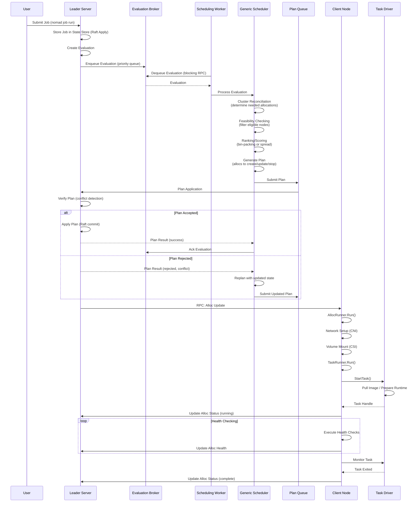
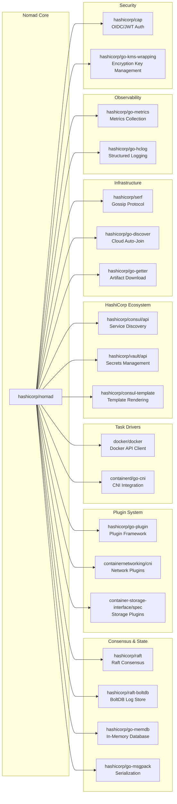

# Nomad

> A simple and flexible workload orchestrator to deploy and manage containers, non-containerized applications, and virtual machines across on-prem and clouds at scale

| Metadata | |
|---|---|
| Repository | https://github.com/hashicorp/nomad |
| License | BUSL-1.1 (Business Source License) |
| Primary Language | Go |
| Analyzed Release | `v1.10.7` (2025-12-10) |
| Stars (approx.) | 16,000+ |
| Generated by | Claude Opus 4.6 (Anthropic) |
| Generated on | 2026-02-08 |

## Overview

Nomad is a workload orchestrator developed and maintained by HashiCorp that enables organizations to deploy and manage a mix of containerized and non-containerized applications. Unlike other orchestrators that focus solely on containers, Nomad provides a unified workflow for deploying modern microservices, traditional applications, batch jobs, and virtual machines.

Problems it solves:

- Operating heterogeneous workloads (Docker containers, Java applications, executables, QEMU VMs) on a single orchestration platform without requiring containerization of legacy applications
- Managing workload orchestration at global scale across multiple regions and cloud providers without complex federation mechanisms
- Reducing operational complexity by providing orchestration, scheduling, and resource management in a single binary with no external dependencies
- Efficiently utilizing cluster resources through bin-packing algorithms that maximize resource utilization while satisfying constraints

Positioning:

Nomad positions itself as a simpler alternative to Kubernetes, particularly suited for organizations with diverse workload types or those seeking operational simplicity. It integrates seamlessly with the HashiCorp ecosystem (Consul for service discovery, Vault for secrets management, Terraform for provisioning), making it a natural choice for HashiCorp-centric infrastructure. Nomad is proven to scale to 10,000+ node clusters in production environments at companies like Roblox, Cloudflare, and Citadel.

## Architecture Overview

Nomad employs a client-server architecture with a Raft-based consensus layer for cluster coordination. Servers form a consensus group (3 or 5 nodes per region) that handles job scheduling and cluster state management, while clients execute workloads and report status. The architecture is optimistically concurrent, allowing all servers to participate in scheduling decisions in parallel, with the leader providing coordination for plan application.

## Core Components

### Server Cluster (`nomad/`)

- Responsibility: Job scheduling, cluster state management, leader election, and plan coordination
- Key files: `nomad/server.go`, `nomad/leader.go`, `nomad/plan_apply.go`, `nomad/eval_broker.go`
- Design patterns: Leader election via Raft consensus, optimistic concurrency for scheduling

The server cluster maintains cluster state through Raft consensus protocol, with 3 or 5 servers forming a quorum per region. The leader server runs exclusive components including the evaluation broker (manages pending evaluation queue), plan queue (sequences plan application), and deployment watcher (monitors rolling update progress). All servers run scheduling workers (defaulting to one per CPU core) that dequeue evaluations and generate allocation plans independently. The leader resolves plan conflicts during plan application, rejecting plans that reference stale state and allowing schedulers to retry with updated information.

State is persisted to BoltDB-backed Raft logs and reconstructed into an in-memory go-memdb state store, which serves as the finite state machine (FSM) for the Raft consensus group. This design provides fast query performance while maintaining durability through log replication.

### Scheduler Layer (`scheduler/`)

- Responsibility: Computing optimal task placements while satisfying constraints and maximizing resource utilization
- Key files: `scheduler/generic_sched.go`, `scheduler/system_sched.go`, `scheduler/reconcile/reconcile.go`, `scheduler/README.md`
- Design patterns: Strategy pattern (pluggable schedulers), iterator pattern (feasibility checking), reconciliation pattern

Nomad implements three schedulers: GenericScheduler (for service and batch jobs), SystemScheduler (for system and sysbatch jobs), and CoreScheduler (internal garbage collection and periodic job dispatch). The generic scheduler performs cluster reconciliation to determine which allocations need placement, migration, or updates, considering factors like tainted nodes, deployments, and canary placements. The scheduler then applies feasibility checking through a chain of iterators that filter nodes by eligibility, constraints, drivers, devices, volumes, and network requirements.

For service and batch jobs, surviving nodes proceed to ranking via bin-packing or spread scoring to find optimal placements. System jobs skip ranking and place on all feasible nodes. The reconciler logic categorizes allocations into buckets (migrating, lost, disconnecting, reconnecting, ignored, expiring) and applies different handling strategies per bucket, enabling complex scenarios like disconnect-tolerant scheduling.

### Client Node (`client/`)

- Responsibility: Executing workloads, managing local resources, reporting node status and allocation state
- Key files: `client/client.go`, `client/allocrunner/alloc_runner.go`, `client/allocrunner/taskrunner/task_runner.go`
- Design patterns: Hook pattern (lifecycle extension points), plugin architecture (drivers and devices)

Clients register with servers via RPC, advertising their resources (CPU, memory, disk, network) and capabilities (drivers, devices). They run two primary orchestration components: AllocRunner (manages allocation lifecycle) and TaskRunner (manages individual task lifecycle). Both implement a hook-based architecture allowing extension at lifecycle stages (prestart, poststart, prestop, poststop, etc.).

AllocRunner hooks handle allocation-level concerns like network setup (CNI plugins), volume mounting (CSI plugins), Consul service registration, health checking, and migration from previous allocations. TaskRunner hooks handle task-level concerns like artifact downloading (via go-getter), template rendering (via consul-template), identity token acquisition, and driver invocation. This separation enables clean abstractions between group-level and task-level operations.

### Task Driver Plugins (`drivers/`)

- Responsibility: Providing workload execution and resource isolation for different runtime types
- Key files: `drivers/docker/driver.go`, `drivers/exec/driver.go`, `drivers/qemu/driver.go`, `drivers/java/driver.go`
- Design patterns: Plugin architecture (go-plugin), adapter pattern (unified driver interface)

Nomad supports pluggable task drivers implementing the `drivers.DriverPlugin` interface. Built-in drivers include Docker (container orchestration), Exec (isolated fork/exec using cgroups and chroot), Raw Exec (unconstrained execution), Java (JVM applications), and QEMU (full VM virtualization). External plugins like Podman, LXC, and Firecracker extend runtime support without modifying Nomad core.

Drivers implement methods for task lifecycle (start, stop, signal), resource fingerprinting (detecting available capabilities), and stats streaming (CPU, memory metrics). The Docker driver coordinates container lifecycle, handles image pulling, manages port mapping, configures networking modes (bridge, host), and streams logs. The Exec driver provides lighter-weight isolation using Linux namespaces and cgroons without Docker daemon dependencies. This pluggable architecture allows organizations to standardize on Nomad while supporting diverse runtime requirements.

### State Store (`nomad/state/`)

- Responsibility: Maintaining consistent cluster state and providing indexed queries
- Key files: `nomad/state/state_store.go`, `nomad/state/schema.go`, `nomad/state/indexer/`
- Design patterns: In-memory database (go-memdb), indexing strategies, transaction patterns

The state store wraps go-memdb (an immutable radix tree-based in-memory database) to store all cluster objects: jobs, allocations, evaluations, nodes, deployments, ACL policies, CSI volumes, and more. It defines schemas with multiple indexes per table (primary keys, foreign keys, compound indexes) enabling efficient queries. For example, allocations are indexed by ID, job ID, node ID, evaluation ID, and deployment ID.

State mutations occur through Raft-replicated Apply operations that execute FSM transactions, ensuring all servers maintain identical state. The state store supports blocking queries (HTTP long polling), pagination for large result sets, and change stream subscriptions for event-driven workflows. Snapshotting captures state for Raft log compaction, and restore operations rebuild state during server initialization or follower catch-up.

### Evaluation Broker (`nomad/eval_broker.go`)

- Responsibility: Queueing and delivering evaluations to scheduling workers with priority ordering
- Key files: `nomad/eval_broker.go`, `nomad/blocked_evals.go`
- Design patterns: Priority queue, broker pattern, at-least-once delivery

The evaluation broker runs exclusively on the leader and manages pending evaluations across priority levels (0-100, higher is more urgent). Scheduling workers dequeue evaluations via blocking RPC calls, receiving the highest priority pending evaluation. The broker tracks in-flight evaluations (dequeued but not yet acknowledged) and nacks (failed evaluations requiring requeue) with exponential backoff.

Blocked evaluations (those that cannot make progress due to insufficient resources or quota limits) are tracked separately in the blocked evaluations tracker, which periodically re-enqueues them when cluster state changes might enable progress. The broker implements load shedding during overload conditions, preventing evaluation queue buildup that could cause cascading failures. This centralized brokering ensures fair scheduling across jobs while preventing starvation of low-priority workloads.

### Deployment Watcher (`nomad/deploymentwatcher/`)

- Responsibility: Monitoring and controlling rolling updates, handling canary deployments and auto-promotion
- Key files: `nomad/deploymentwatcher/deployment_watcher.go`, `nomad/deploymentwatcher/deployments_watcher.go`
- Design patterns: Watcher pattern, state machine for deployment progression

The deployment watcher runs on the leader and tracks active deployments (rolling updates of service jobs). For each deployment, it monitors allocation health, enforcing deployment strategy constraints like max_parallel (number of concurrent updates per task group), canary count (staged rollout size), and health_check (healthiness criteria). When canaries reach healthy state and auto_promote is enabled, the watcher automatically promotes the deployment, triggering full rollout.

The watcher handles failure scenarios: marking deployments as failed when health check deadlines expire, allocation failures exceed thresholds, or manual intervention occurs. It coordinates with the scheduler via evaluation creation, triggering new placement decisions as deployment stages progress. Multi-region deployments coordinate via a separate regional deployment tracker that waits for successful deployment in prerequisite regions before proceeding.

## Data Flow

### Job Submission and Scheduling Flow

## Key Design Decisions

### 1. Optimistic Concurrency in Scheduling

- Choice: All servers run scheduling workers that generate plans in parallel, with the leader performing conflict resolution during plan application rather than locking during planning
- Rationale: Maximizes scheduling throughput by allowing concurrent evaluation processing across all servers. In high-churn environments (thousands of allocations per second), sequential scheduling would become a bottleneck. Conflicts are rare when cluster state changes slowly relative to scheduling speed
- Trade-offs: Increases code complexity with plan conflict detection and scheduler retry logic. Schedulers may waste work if plans are rejected due to conflicts with faster schedulers. However, benchmarks show this approach achieves 3-5x higher throughput than pessimistic locking

### 2. Single Binary with No External Dependencies

- Choice: Embedding Raft consensus, state storage, and HTTP API into a single Nomad binary with no requirements for external databases, message queues, or coordination services
- Rationale: Simplifies operational complexity and reduces failure modes. Operators deploy and upgrade a single binary rather than coordinating multiple components. State is self-contained in local BoltDB files, enabling backup/restore with filesystem tools. This aligns with HashiCorp's philosophy of operational simplicity
- Trade-offs: Limits horizontal scaling of control plane read traffic (compared to externalized state stores like etcd that can run read replicas). However, Nomad mitigates this through follower forwarding and stale reads. Single binary also complicates independent component upgrades, though Nomad addresses this via rolling server upgrades

### 3. Workload Agnostic Design with Driver Plugins

- Choice: Supporting heterogeneous workloads (containers, VMs, native executables, Java apps) through pluggable driver architecture rather than focusing exclusively on containers
- Rationale: Many enterprises have mixed estates combining modern microservices with legacy applications that cannot be containerized. Requiring containerization creates adoption barriers. By abstracting task execution behind a driver interface, Nomad enables gradual modernization while providing unified orchestration
- Trade-offs: Increases testing and documentation surface area across multiple drivers. Container-specific optimizations (like image layer caching) require per-driver implementation. However, this flexibility is a key differentiator versus Kubernetes and drives adoption in traditional enterprises

### 4. Reconciliation-Based Scheduling

- Choice: Implementing scheduling as a reconciliation process that computes the difference between desired state (job specification) and observed state (current allocations), generating a plan to converge them
- Rationale: Provides a clear separation between desired state expression (jobs) and placement logic (schedulers). Reconciliation naturally handles complex scenarios like node failures, job updates, scaling, and deployments through a unified model. This approach is borrowed from Kubernetes but adapted to Nomad's simpler data model
- Trade-offs: Reconciliation can be computationally expensive for large task groups (thousands of allocations), requiring careful optimization. The reconciler's bucket-based categorization (migrating, lost, disconnecting, etc.) adds conceptual complexity. However, this design enables sophisticated features like canary deployments and disconnect-tolerant scheduling

### 5. Regional Federation via Gossip

- Choice: Supporting multi-region deployments through WAN gossip for cross-region server discovery and RPC forwarding, rather than tight consistency across regions
- Rationale: Global infrastructure spans multiple failure domains (cloud regions, data centers) that experience partial network failures. Tight consistency (global Raft) would sacrifice availability during WAN partitions. Gossip-based federation allows each region to operate independently with eventual discovery of other regions, trading consistency for availability
- Trade-offs: Cross-region job placement requires explicit region specification rather than global scheduling. No automatic workload migration across regions. Gossip-based discovery has eventual consistency delays. However, this design aligns with typical operational practices where regions are managed semi-independently

### 6. Raft for Consensus with BoltDB Backend

- Choice: Using HashiCorp's Raft library with BoltDB as the log store for leader election and state replication
- Rationale: Raft provides understandable consensus compared to Paxos variants, critical for operators troubleshooting split-brain or quorum loss. BoltDB (embedded key-value store) requires no external dependencies and provides reliable ACID transactions. This combination enables strong consistency for cluster state with operational simplicity
- Trade-offs: BoltDB file growth requires periodic compaction via snapshots. Raft quorum requirements (3 or 5 servers) limit failure tolerance compared to quorum-less designs. Raft log replay during recovery can be slow for large state. However, Nomad's snapshot mechanism and trailing log configuration mitigate these issues in practice

## Dependencies

## Testing Strategy

Nomad employs a comprehensive multi-layer testing strategy ensuring reliability at scale.

Unit tests: Each package contains extensive unit tests with table-driven test patterns common in Go. The state store has particularly thorough testing with thousands of test cases covering index consistency, transaction atomicity, and query correctness. Scheduler tests use test helpers that set up mock state stores and verify plan correctness. Driver plugins include unit tests with docker-in-docker or mock runtime implementations.

Integration tests: End-to-end tests in the `e2e/` directory spin up real Nomad clusters (servers and clients) using Terraform on cloud providers, then execute job workflows and verify expected outcomes. These tests cover multi-node scenarios, network partitions, server failures, client disconnections, and upgrade paths. Integration tests use the Nomad API client rather than internal packages, validating public interfaces.

The scheduler package includes dedicated benchmark tests (`scheduler/benchmarks/`) that measure scheduling throughput under various cluster sizes and job patterns, ensuring performance regressions are detected.

CI/CD: GitHub Actions runs unit tests on every pull request across multiple Go versions and operating systems (Linux, macOS, Windows). Long-running integration tests run nightly or on release branches. The build system uses makefiles with targets for testing (`make test`), linting (`make check`), and generating protobuf/plugin code (`make generate`). Pre-commit hooks enforce code formatting via gofmt and catch common mistakes.

## Key Takeaways

1. Optimistic concurrency for high throughput: Allowing parallel scheduling workers to generate plans concurrently with leader-based conflict resolution achieves significantly higher throughput than sequential scheduling. This pattern is applicable to any distributed system where reads vastly outnumber conflicting writes and where retrying failed operations is cheap.

2. Pluggable execution layer enables workload diversity: Abstracting task execution behind a driver plugin interface allows the orchestrator to remain workload-agnostic while supporting containers, VMs, and native processes. This design is valuable for platforms targeting enterprises with heterogeneous application estates rather than greenfield cloud-native environments.

3. Reconciliation as a unifying pattern: Framing scheduling as reconciling desired state with observed state provides a mental model that handles job updates, scaling, deployments, failures, and node maintenance through a single code path. The bucket-based categorization approach (migrating, lost, disconnecting, etc.) simplifies complex state machines.

4. Single binary philosophy: Embedding all control plane components (API, scheduler, state store, consensus) into a single binary with no external dependencies dramatically reduces operational complexity. While this limits some scaling dimensions, the simplified deployment and upgrade story often outweighs the constraints for mid-scale deployments (hundreds to low thousands of nodes).

5. Federation over global consistency: Supporting multi-region deployments through gossip-based discovery and eventual consistency rather than global Raft consensus trades immediate cross-region awareness for independent regional operation during network partitions. This design aligns with the reality of WAN failures and typical operational boundaries.

6. Hook-based lifecycle extensibility: Implementing allocation and task runners with hook extension points (prestart, poststart, prestop, poststop) provides a clean mechanism for injecting cross-cutting concerns like service registration, secret injection, and artifact downloading without cluttering core orchestration logic. This pattern is widely applicable to workflow engines and lifecycle management systems.

## References

- [Nomad Official Documentation - Architecture](https://developer.hashicorp.com/nomad/docs/architecture)
- [How Nomad Job Scheduling Works](https://developer.hashicorp.com/nomad/docs/concepts/scheduling/how-scheduling-works)
- [Consensus Protocol in Nomad](https://developer.hashicorp.com/nomad/docs/architecture/cluster/consensus)
- [Understanding Nomad Clusters: Architecture, Configuration, and the Raft Algorithm](https://devopsdaily.eu/articles/2024/understanding-nomad-clusters-architecture-configuration-and-the-raft-algorithm/)
- [Load Shedding in the Nomad Eval Broker](https://www.hashicorp.com/en/blog/load-shedding-in-the-nomad-eval-broker)
- [Configure Nomad Task Drivers](https://developer.hashicorp.com/nomad/docs/deploy/task-driver)
- [Nomad Scheduler README](https://github.com/hashicorp/nomad/blob/main/scheduler/README.md)
- [Production Reference Architecture](https://developer.hashicorp.com/nomad/docs/deploy/production/reference-architecture)
- [GitHub Repository - hashicorp/nomad](https://github.com/hashicorp/nomad)
