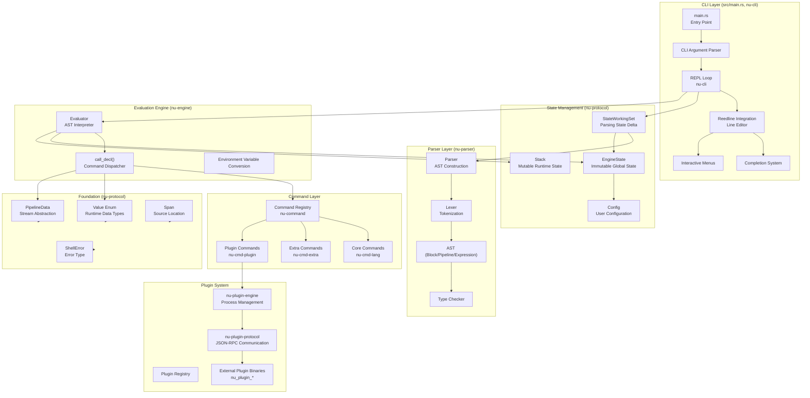
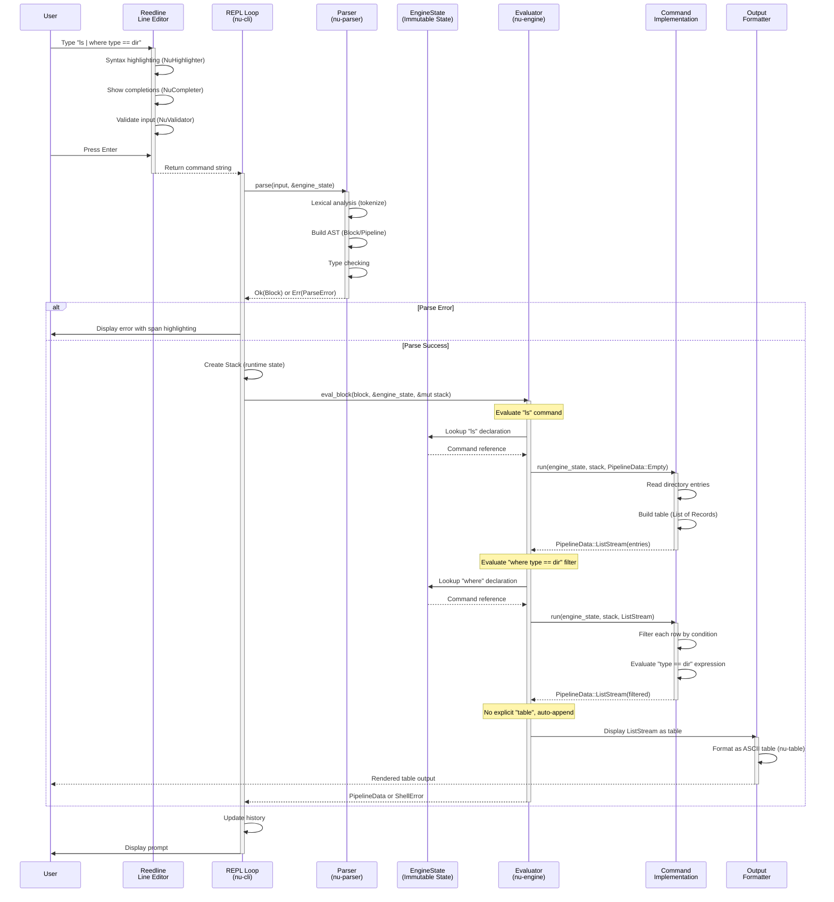
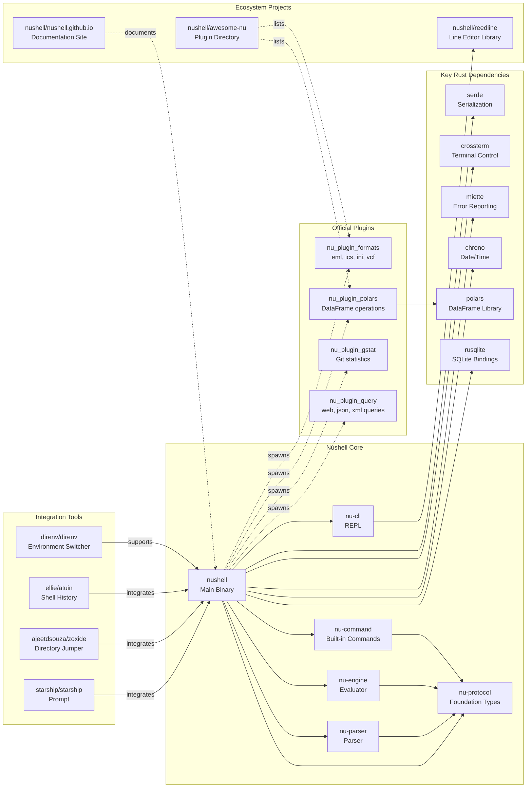

# Nushell

> A new type of shell with structured data processing and cross-platform support

| Metadata | |
|---|---|
| Repository | https://github.com/nushell/nushell |
| License | MIT License |
| Primary Language | Rust |
| Category | Editor / Terminal |
| Analyzed Release | `0.110.0` (2026-01-18) |
| Stars (approx.) | 38,000+ |
| Generated by | Claude Opus 4.6 (Anthropic) |
| Generated on | 2026-02-08 |

## Overview

Nushell (Nu) is a modern shell that treats data as structured objects rather than plain text streams. Inspired by PowerShell's object pipeline model and functional programming principles, Nu provides a cross-platform shell experience that works identically on Windows, macOS, Linux, BSD, and Android.

Problems it solves:

- Traditional Unix shells require commands to parse and format text streams, coupling output representation to presentation and making commands brittle to change
- Text-based pipelines lack type safety and structured data manipulation capabilities available in modern programming languages
- Shell scripting languages often lack modern features like immutability, type checking, and proper error handling
- Cross-platform shell scripting requires different approaches on Windows (PowerShell/CMD) vs Unix systems (bash/zsh)

Positioning:

Nushell combines PowerShell's structured data philosophy with functional programming principles and modern CLI ergonomics. Unlike PowerShell's .NET object model and Windows-centric design, Nu uses a simpler tagged union value system and prioritizes cross-platform compatibility from day one. It aims to replace traditional shells like bash for interactive use while providing a better scripting experience than traditional shell languages.

## Architecture Overview

Nushell follows a modular, layered architecture organized as a Cargo workspace with approximately 40 crates. The design separates parsing, evaluation, and command execution into distinct layers with clear dependencies flowing upward through the stack.

## Core Components

### Foundation: nu-protocol (`crates/nu-protocol`)

- Responsibility: Defines all core types and interfaces used throughout Nushell
- Key files: `crates/nu-protocol/src/value/mod.rs`, `crates/nu-protocol/src/pipeline_data.rs`, `crates/nu-protocol/src/engine/engine_state.rs`
- Design patterns: Tagged union (Value enum), Newtype pattern (Span), State pattern (EngineState/Stack separation)

The nu-protocol crate is the foundational layer that all other crates depend on. It defines the Value enum representing all runtime data types (Int, String, List, Record, etc.), each carrying a Span for error reporting. The PipelineData enum handles data flow between commands with four variants: Value (single value), ListStream (streaming sequence), ExternalStream (raw bytes from external processes), and Empty. EngineState contains immutable global state (command declarations, variables, blocks, configuration), while Stack manages mutable runtime state (variable values, environment variables). This separation enables safe concurrent parsing and evaluation.

### Parser: nu-parser (`crates/nu-parser`)

- Responsibility: Lexical analysis, parsing, and type checking of Nu code
- Key files: `crates/nu-parser/src/parser.rs`, `crates/nu-parser/src/parse_keywords.rs`, `crates/nu-parser/src/type_check.rs`
- Design patterns: Recursive descent parser, Two-phase compilation (parse + typecheck), Working set pattern (StateWorkingSet)

The parser transforms Nu source code into an Abstract Syntax Tree (AST) consisting of Blocks, Pipelines, and Expressions. Unlike traditional shells that parse and execute simultaneously, Nu strictly separates parsing from evaluation, disallowing eval-like functionality. During parsing, a StateWorkingSet accumulates changes (new declarations, variables, blocks) which are merged into EngineState via merge_delta() after successful parsing. The parser performs type checking during the parse phase, enabling early error detection and potential future optimizations. An experimental new parser (new-nu-parser) uses a flat vector of nodes indexed by NodeId instead of a tree structure for better performance and inspectability.

### Evaluation Engine: nu-engine (`crates/nu-engine`)

- Responsibility: Executes parsed AST by evaluating expressions and dispatching commands
- Key files: `crates/nu-engine/src/eval.rs`, `crates/nu-engine/src/call.rs`, `crates/nu-engine/src/closure_eval.rs`
- Design patterns: Interpreter pattern, Command pattern, Visitor pattern

The evaluation engine receives the parsed AST and executes it using the Interpreter pattern. The core call_decl() function dispatches command execution by looking up command declarations in EngineState and invoking their run() methods with the current Stack and PipelineData input. Closures capture their defining scope and can be passed as values, enabling functional programming patterns. The engine handles environment variable conversions between system (OsString) and Nu (Value) representations, pipeline data streaming, and error propagation through ShellError types.

### Command System: nu-command, nu-cmd-lang, nu-cmd-extra (`crates/nu-command`, `crates/nu-cmd-lang`, `crates/nu-cmd-extra`)

- Responsibility: Implements built-in commands that form the core Nu language and standard library
- Key files: `crates/nu-command/src/filters/`, `crates/nu-cmd-lang/src/core_commands/`, `crates/nu-cmd-extra/src/`
- Design patterns: Command pattern, Strategy pattern (per-command implementations)

Commands implement the Command trait defined in nu-protocol, providing signatures (parameter types, flags), usage documentation, and run() methods that receive PipelineData input and return PipelineData output. Commands are categorized into three types: Producers (generating data like ls, ps), Filters (transforming data like where, select, each), and Consumers (finalizing output like table, save). The nu-cmd-lang crate contains language constructs (def, let, if, for), nu-command provides core system commands, and nu-cmd-extra includes optional commands (formats, extra filters). Commands are registered in EngineState's command registry during initialization.

### Plugin System: nu-plugin, nu-plugin-protocol, nu-plugin-engine (`crates/nu-plugin`, `crates/nu-plugin-protocol`, `crates/nu-plugin-engine`)

- Responsibility: Enables extending Nu with external commands written in any language
- Key files: `crates/nu-plugin/src/protocol/mod.rs`, `crates/nu-plugin-engine/src/interface.rs`, `crates/nu-plugin-protocol/src/plugin_call.rs`
- Design patterns: Plugin pattern, JSON-RPC protocol, Process isolation

Plugins are separate executable binaries named with the nu_plugin_ prefix that communicate with Nu via JSON-RPC over stdin/stdout or local sockets. The protocol is versioned and consists of a handshake phase (Hello message, plugin metadata exchange) followed by command calls. Plugins declare their commands, signatures, and capabilities during registration. The plugin engine (nu-plugin-engine) manages plugin processes, handles protocol communication, and maintains a plugin registry file. Plugins can use either JSON or MessagePack encoding and can be written in any language (Rust, Python, Go, etc.) as long as they implement the protocol. Core plugins (nu_plugin_formats, nu_plugin_gstat, nu_plugin_polars) are officially maintained, while the ecosystem includes community plugins for various functionality.

### Interactive Shell: nu-cli (`crates/nu-cli`)

- Responsibility: Implements the REPL loop, line editing, completions, and interactive features
- Key files: `crates/nu-cli/src/repl.rs`, `crates/nu-cli/src/completions/completer.rs`, `crates/nu-cli/src/menus/`
- Design patterns: REPL pattern, Observer pattern (Reedline integration), Strategy pattern (completers)

The nu-cli crate integrates the Reedline line editor library to provide modern REPL features including syntax highlighting (NuHighlighter), input validation (NuValidator), context-aware completions (NuCompleter), and interactive menus (completion_menu, history_menu, help_menu). Reedline is initialized once at startup but reconfigured on every REPL iteration to reflect configuration changes. The completion system supports command completions, path completions, custom completions defined in user code, and directory-only completions. History management supports SQLite (with metadata and search) and PlainText (simple line storage) backends through Reedline's History trait abstraction. Keybindings support both emacs-style and vi-style modes with full customization.

## Data Flow

### Interactive Command Execution

## Key Design Decisions

### 1. Structured Data Pipeline with Value Enum

- Choice: Using a tagged union (Value enum) to represent all runtime data types, passing structured data between commands instead of text
- Rationale: Text-based pipelines require both producers and consumers to agree on text formatting, coupling representation to presentation. Structured data preserves type information, enables rich data manipulation (filtering, selecting, transforming), and allows commands to evolve their output format without breaking consumers. The Value enum provides a finite set of types (Int, Float, String, Bool, List, Record, Closure, etc.) that all commands can produce and consume
- Trade-offs: More complex implementation than text pipes. Requires serialization/deserialization at shell boundaries when interacting with external programs (handled via ExternalStream). Type system constrains what data can flow through pipelines, though the Any type provides an escape hatch

### 2. Strict Separation of Parsing and Evaluation

- Choice: Two-phase execution model where code is fully parsed and type-checked before any evaluation occurs, explicitly disallowing eval-like functionality
- Rationale: Separation enables compile-time type checking, better error messages with precise source locations (Span), potential future optimizations (IR generation), and safer execution. The StateWorkingSet/StateDelta pattern allows transactional parsing where changes are only committed to EngineState after successful parsing. This prevents partially-parsed state from affecting the running system
- Trade-offs: Cannot dynamically generate and execute code at runtime (no eval). Increases memory usage as the entire AST must be constructed before evaluation begins. Makes certain metaprogramming patterns impossible or more complex

### 3. Immutable-by-Default Variables with Functional Style

- Choice: Variables are immutable by default (let bindings), mutable variables require explicit mut keyword (mut $var = value)
- Rationale: Immutability aligns with functional programming principles, prevents accidental mutation bugs, and enables parallelization (par-each command). Encourages declarative pipelines where data flows through transformations rather than accumulating state. Simplifies reasoning about code behavior, especially in closures and nested scopes
- Trade-offs: Requires different mental model than traditional imperative shell scripting. Some algorithms naturally expressed with mutation become more verbose. Counter variables in loops need special handling. May increase memory usage as new values are created instead of mutating existing ones

### 4. Cross-Platform Design from Day One

- Choice: Prioritizing identical behavior across Windows, macOS, Linux, BSD, and Android, avoiding platform-specific features in the core language
- Rationale: Traditional Unix shell scripts fail on Windows, and PowerShell scripts are Windows-centric. Nu aims to be a universal shell where scripts work identically everywhere. Built on Rust's cross-platform abstractions (std::path::PathBuf, crossterm for terminal handling). Platform differences are abstracted behind commands (e.g., registry access only on Windows)
- Trade-offs: Cannot leverage platform-specific features as directly as native shells. Some commands have different implementations per platform but same interface. May sacrifice some platform-specific optimizations for consistency. Windows-specific features (registry, COM objects) require special handling

### 5. Plugin System with Process Isolation

- Choice: Plugins as separate executable binaries communicating via JSON-RPC over stdin/stdout, discovered by nu_plugin_ naming convention
- Rationale: Process isolation provides security boundaries and crash isolation. Language-agnostic protocol enables plugins in any language (Python, Go, JavaScript, etc.). JSON-RPC provides version negotiation and extensible protocol. Separate binaries avoid dependency conflicts and licensing issues. Plugin registry file enables persistent configuration across sessions
- Trade-offs: Process spawning overhead for plugin commands (mitigated by persistent plugin processes). Inter-process communication slower than in-process function calls. Protocol versioning complexity. Plugin discovery requires specific naming convention and PATH configuration

### 6. Reedline Integration for Modern Line Editing

- Choice: Using the dedicated Reedline library instead of traditional readline/rustyline
- Rationale: Reedline is specifically designed for Nu, providing deep integration with Nu's type system, completion system, and configuration. Supports modern features like Unicode handling, multiline editing, menu systems, syntax highlighting, and custom keybindings. Co-developed with Nu to ensure optimal compatibility. Allows Nu team to evolve line editing features without external dependencies
- Trade-offs: Another crate to maintain (though under same organization). Less mature than decades-old readline. Smaller ecosystem of existing integrations. Users familiar with readline may need to learn new keybinding conventions

## Dependencies

## Testing Strategy

Nushell employs a comprehensive multi-layered testing approach ensuring both correctness and stability.

Unit tests: Each crate contains _test.rs files with unit tests for individual components. The nu-test-support crate provides utilities like run_test() and fail_test() for testing command execution. Tests use the testdata/ directory pattern for golden file testing where expected outputs are stored and compared.

Integration tests: Located in /tests directory, integration tests verify end-to-end functionality including command execution, pipeline behavior, and REPL interaction. Tests cover command examples (example tests), ensuring documentation examples actually work. REPL-specific tests use "testbins" to simulate various interactive scenarios.

Standard library tests: The nu-std crate includes its own test suite run via `cargo run -- -c "use toolkit.nu; toolkit test stdlib"`, testing Nu-written standard library functions.

Build system: Uses cargo workspace features for dependency management and toolkit.nu (a Nu script) provides convenience commands for common development tasks (toolkit check pr, toolkit test, toolkit fmt, toolkit clippy).

CI/CD: GitHub Actions workflows run on push/PR with matrices covering Windows, macOS, and Linux. Tests include formatting checks (cargo fmt), linting (cargo clippy with strict warnings), unit tests (cargo test --workspace), and standard library tests. Nightly builds ensure continuous integration across platforms.

Git hooks: The toolkit.nu setup-git-hooks command installs pre-commit hooks that run formatting and clippy checks automatically (not available on Windows).

## Key Takeaways

1. Structured data as first-class citizen: Treating pipeline data as typed values instead of text transforms the shell from a command orchestrator into a data processing language. The Value/PipelineData abstraction is applicable to any system requiring type-safe data flow between loosely-coupled components. The key insight is defining a common type system that balances expressiveness (many types for rich operations) with simplicity (finite set of types all components understand).

2. Separation of parsing and evaluation phases: The two-phase compilation model (parse + typecheck, then eval) enables optimizations and better error reporting while preventing entire classes of runtime errors. The StateWorkingSet/StateDelta pattern provides transactional semantics for language state updates, applicable to any system where configuration or state changes should be atomic. This pattern is especially valuable in interactive systems where partial failures should not corrupt global state.

3. Immutability-by-default for safer parallelism: Making immutability the default and requiring explicit opt-in for mutation aligns language semantics with functional programming benefits. This design choice enables safe parallelization without data races (par-each command), simplifies reasoning about code, and prevents an entire class of concurrency bugs. The trade-off is acceptable because mutation is still available when needed (mut keyword), preserving expressiveness while shifting the default toward safer patterns.

4. Cross-platform abstraction over platform-specific features: Designing for cross-platform compatibility from inception, rather than retrofitting later, leads to cleaner abstractions and more portable code. Platform differences are abstracted behind uniform command interfaces rather than exposed as different command sets. This approach is valuable for any tool targeting multiple platforms, showing that consistency across platforms can be achieved without sacrificing access to platform-specific features when needed.

5. Language-agnostic plugin architecture via IPC: Using inter-process communication with a documented protocol enables extensibility without coupling to a specific language or runtime. The JSON-RPC-over-stdio approach provides process isolation (security and stability), version negotiation (protocol evolution), and language freedom (plugins in any language). This pattern is broadly applicable to any extensible application, demonstrating that clean protocol design can provide both safety and flexibility.

6. Modern line editing as a separate library: Extracting line editing functionality into a dedicated library (Reedline) allows specialized development while enabling reuse across projects. This separation of concerns ensures line editing can evolve independently, incorporate modern features (Unicode, multiline, menus), and maintain deep integration with the host application through well-defined interfaces. The co-development model (Reedline and Nu maintained by same team) shows how related projects can stay aligned without tight coupling.

## References

- [Nushell Official Documentation](https://www.nushell.sh/book/)
- [How Nushell Code Gets Run](https://www.nushell.sh/book/how_nushell_code_gets_run.html)
- [Nushell Blog](https://www.nushell.sh/blog/)
- [DeepWiki - nushell/nushell](https://deepwiki.com/nushell/nushell)
- [Execution Flow and Entry Points | DeepWiki](https://deepwiki.com/nushell/nushell/2-execution-flow-and-entry-points)
- [State Management and Data Flow | DeepWiki](https://deepwiki.com/nushell/nushell/5-state-management-and-data-flow)
- [Value Types and PipelineData | DeepWiki](https://deepwiki.com/nushell/nushell/5.2-pipeline-data-flow)
- [Pipeline Processing and Structured Data | DeepWiki](https://deepwiki.com/nushell/nushell/5.3-pipeline-processing)
- [Reedline GitHub Repository](https://github.com/nushell/reedline)
- [Nushell Plugins Documentation](https://www.nushell.sh/book/plugins.html)
- [The Case for Nushell](https://www.sophiajt.com/case-for-nushell/)
- [Comparison of Modern Shells](https://gist.github.com/pmarreck/b7bd1c270cb77005205bf91f80c4e130)
