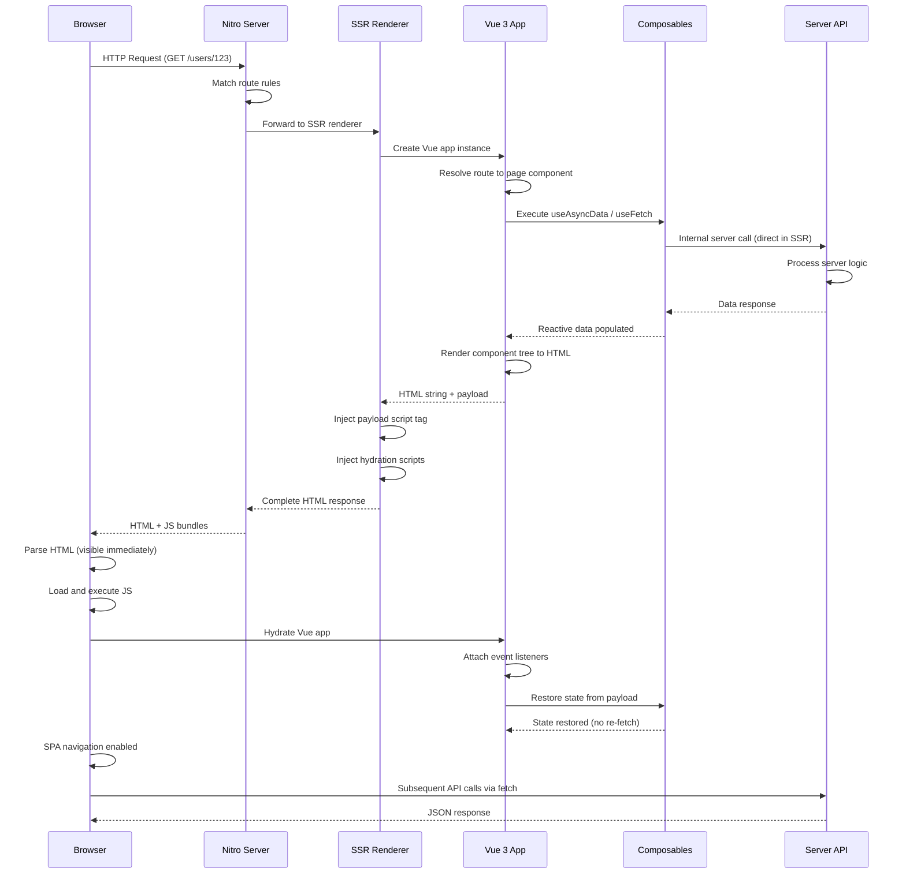

# Nuxt

> The full-stack Vue.js meta-framework for universal web applications

| Metadata | |
|---|---|
| Repository | https://github.com/nuxt/nuxt |
| License | MIT |
| Primary Language | TypeScript |
| Category | Web Framework |
| Analyzed Release | `v4.3.1` (2026-02-07) |
| Stars (approx.) | 59,000+ |
| Generated by | Claude Opus 4.6 (Anthropic) |
| Generated on | 2026-02-08 |

## Overview

Nuxt is the full-stack Vue.js meta-framework that provides an opinionated, convention-driven architecture for building universal (SSR/SSG/hybrid) web applications. Created by Sebastien and Alexandre Chopin, Nuxt was inspired by Next.js but designed specifically for the Vue ecosystem, adding auto-imports, file-based routing, server engine integration, and a powerful module system.

The core problems Nuxt solves:
- Server-Side Rendering complexity: Configuring Vue SSR from scratch is notoriously difficult. Nuxt abstracts the entire SSR pipeline, including hydration, state serialization, and server/client code splitting.
- Convention enforcement: Vue.js is a library that is intentionally unopinionated. Nuxt adds structure through directory conventions (pages/, components/, composables/, server/) that eliminate configuration decisions.
- Full-stack integration: Through Nitro (the server engine), Nuxt provides API routes, server middleware, and deployment adapters in the same project, eliminating the need for a separate backend.
- Developer experience: Auto-imports, TypeScript generation, hot module replacement, and devtools create a productive development environment.

Nuxt positions itself as the production-ready way to build Vue.js applications, comparable to Next.js for React or SvelteKit for Svelte. It handles:
- SSR (Server-Side Rendering) for SEO and initial load performance
- SSG (Static Site Generation) for JAMstack deployments
- SPA (Single Page Application) mode for traditional client-side apps
- Hybrid rendering with per-route rendering rules
- Edge rendering via Nitro's universal deployment adapters

---

## Architecture Overview

```mermaid
graph TB
    subgraph "Developer Interface"
        PAGES[pages/ - File-based Routing]
        COMPS[components/ - Auto-imported Components]
        COMPOSABLES[composables/ - Auto-imported Composables]
        SERVER[server/ - API Routes and Middleware]
        PLUGINS[plugins/ - App Plugins]
        LAYOUTS[layouts/ - Page Layouts]
        MODULES_DIR[modules/ - Local Modules]
        CONFIG[nuxt.config.ts]
    end

    subgraph "Nuxt Core - packages/nuxt"
        CORE[Core Module - core/nuxt.ts]
        BUILDER[Builder - core/builder.ts]
        SCHEMA[Schema - core/schema.ts]
        TEMPLATES[Templates - core/templates.ts]
        HOOKS[Hook System - hookable]
    end

    subgraph "Module System"
        PAGES_MOD[Pages Module]
        COMP_MOD[Components Module]
        IMPORTS_MOD[Imports Module]
        HEAD_MOD[Head Module - unhead]
        MODULES[External Modules]
    end

    subgraph "Build Pipeline"
        VITE_BUILD[Vite Builder]
        NITRO_BUILD[Nitro Builder]
        WEBPACK_BUILD[Webpack Builder - legacy]
    end

    subgraph "Runtime - App"
        VUE_APP[Vue 3 App Instance]
        ROUTER[Vue Router]
        NUXT_APP[NuxtApp - nuxt.ts]
        COMPOSABLES_RT[Runtime Composables]
        COMPONENTS_RT[Runtime Components]
        PLUGINS_RT[Plugin System]
    end

    subgraph "Server Engine - Nitro"
        NITRO[Nitro Server]
        API[API Routes - server/api/]
        MW[Server Middleware]
        RENDERER[SSR Renderer]
        PRERENDER[Pre-renderer]
    end

    subgraph "Deployment Adapters"
        NODE_DEP[Node.js]
        VERCEL_DEP[Vercel]
        CF_DEP[Cloudflare]
        NETLIFY_DEP[Netlify]
        STATIC_DEP[Static Hosting]
    end

    CONFIG --> CORE
    CORE --> BUILDER & SCHEMA & HOOKS
    CORE --> PAGES_MOD & COMP_MOD & IMPORTS_MOD & HEAD_MOD & MODULES
    PAGES & COMPS & COMPOSABLES & PLUGINS & LAYOUTS & MODULES_DIR --> CORE
    SERVER --> NITRO
    BUILDER --> VITE_BUILD & NITRO_BUILD
    VITE_BUILD --> VUE_APP
    VUE_APP --> ROUTER & NUXT_APP & COMPOSABLES_RT & COMPONENTS_RT & PLUGINS_RT
    NITRO --> API & MW & RENDERER & PRERENDER
    RENDERER --> VUE_APP
    NITRO --> NODE_DEP & VERCEL_DEP & CF_DEP & NETLIFY_DEP & STATIC_DEP
```



---

## Core Components

### 1. Nuxt Core and Hook System

Responsibility: Bootstrap the Nuxt application, merge configuration, register modules, and orchestrate the build process through a lifecycle hook system.

Key files:
- `packages/nuxt/src/core/nuxt.ts` -- Main Nuxt class creation and initialization
- `packages/nuxt/src/core/app.ts` -- App template generation
- `packages/nuxt/src/core/builder.ts` -- Build orchestration
- `packages/nuxt/src/core/schema.ts` -- Configuration schema definition and normalization
- `packages/nuxt/src/core/modules.ts` -- Module loading and execution
- `packages/nuxt/src/core/cache.ts` -- Build cache management
- `packages/nuxt/src/core/templates.ts` -- Virtual file template generation
- `packages/nuxt/src/core/server.ts` -- Dev server management

Design patterns:
- Kernel pattern: Nuxt core acts as a kernel that boots modules and manages lifecycle
- Hook/Plugin pattern: `hookable` library provides a typed event bus for inter-module communication
- Builder pattern: Configuration is progressively assembled from defaults, user config, layers, and modules
- Template pattern: Virtual files are generated from templates that modules can extend

When Nuxt starts, it:
1. Loads and normalizes `nuxt.config.ts` using the schema system
2. Resolves and applies layers (shared configurations)
3. Executes modules sequentially, each hooking into the lifecycle
4. Generates virtual files (routes, auto-imports, types) from templates
5. Starts the Vite/Webpack builder and Nitro server

The hook system is the backbone of Nuxt's extensibility. Hooks like `modules:before`, `pages:extend`, `components:extend`, `build:before`, and `app:resolve` allow modules to modify behavior at every stage.

### 2. Module System

Responsibility: Enable extensibility through reusable modules that can add routes, components, composables, server handlers, build plugins, and runtime code.

Key files:
- `packages/nuxt/src/core/modules.ts` -- Module loader and executor
- `packages/kit/src/module/define.ts` -- defineNuxtModule() helper
- `packages/kit/src/module/install.ts` -- Module installation logic
- `packages/kit/src/module/compatibility.ts` -- Version compatibility checking
- `packages/kit/src/index.ts` -- Nuxt Kit API (addPlugin, addComponent, addImports, etc.)

Design patterns:
- Plugin pattern: Modules are async functions that receive the Nuxt instance and modify it
- Dependency Injection: Nuxt Kit provides utility functions that inject behavior into the Nuxt context
- Decorator pattern: Modules decorate the base Nuxt configuration with additional capabilities

A Nuxt module is fundamentally an async function that receives inline options and the Nuxt context:

```
defineNuxtModule({
  meta: { name, configKey, compatibility },
  defaults: {},
  setup(options, nuxt) {
    // Hook into lifecycle, add components, routes, etc.
  }
})
```

The module ecosystem includes: `@nuxtjs/i18n`, `@nuxt/content`, `@nuxt/image`, `@nuxt/fonts`, `@nuxtjs/tailwindcss`, and hundreds more. Modules can hook into both build-time and runtime lifecycle events.

### 3. Auto-Import System

Responsibility: Automatically import Vue composables, Nuxt composables, components, and utilities without explicit import statements.

Key files:
- `packages/nuxt/src/imports/module.ts` -- Import scanning and registration
- `packages/nuxt/src/imports/presets.ts` -- Default import presets (Vue, Nuxt composables)
- `packages/nuxt/src/imports/transform.ts` -- Code transformation to inject imports
- `packages/nuxt/src/components/module.ts` -- Component auto-import scanning

Design patterns:
- Convention over Configuration: Files in `composables/` and `utils/` are automatically scanned
- Code Generation: TypeScript declarations are generated for auto-imported identifiers
- Transform pattern: A Vite/Webpack plugin transforms source files to inject missing imports at build time

The auto-import system scans:
- `composables/` directory for Vue composables
- `utils/` directory for utility functions
- `components/` directory for Vue components (with lazy-loading support)
- Built-in Vue APIs (ref, computed, watch, etc.)
- Built-in Nuxt composables (useAsyncData, useFetch, useState, useRoute, etc.)

TypeScript support is maintained through generated `.nuxt/imports.d.ts` and `.nuxt/components.d.ts` declaration files that provide full IDE auto-completion and type checking.

### 4. Pages and Routing

Responsibility: Generate Vue Router configuration from the file system, support dynamic routes, middleware, and route-level rendering rules.

Key files:
- `packages/nuxt/src/pages/module.ts` -- Pages module entry point
- `packages/nuxt/src/pages/plugins/page-meta.ts` -- definePageMeta extraction
- `packages/nuxt/src/pages/plugins/route-injection.ts` -- Route injection plugin
- `packages/nuxt/src/pages/route-rules.ts` -- Per-route rendering rules
- `packages/nuxt/src/pages/runtime/page.ts` -- NuxtPage runtime component
- `packages/nuxt/src/pages/runtime/composables.ts` -- Route composables
- `packages/nuxt/src/app/middleware/route-rules.ts` -- Route rule middleware

Design patterns:
- Convention over Configuration: File names map to routes (e.g., `pages/users/[id].vue` becomes `/users/:id`)
- Strategy pattern: Route rules define per-route rendering strategy (SSR, SPA, prerender, redirect)
- Decorator pattern: definePageMeta() adds metadata (layout, middleware, keepalive) to routes

Route features:
- Dynamic routes via bracket syntax: `[id]`, `[...slug]`
- Nested routes via directory structure
- Route middleware (named, anonymous, global)
- Route validation with validate() hook
- Per-route rendering rules (SSR, SPA, ISR, prerender)
- Page transitions with Vue Transition component

### 5. Nitro Server Engine

Responsibility: Provide the server runtime for SSR, API routes, server middleware, and universal deployment through adapter-based output.

Key files:
- `packages/nitro-server/src/runtime/handlers/renderer.ts` -- SSR renderer
- `packages/nitro-server/src/runtime/handlers/island.ts` -- Server island rendering
- `packages/nitro-server/src/runtime/handlers/error.ts` -- Error handling
- `packages/nuxt/src/core/server.ts` -- Nitro integration

Design patterns:
- Adapter pattern: Nitro compiles server code to platform-specific output (Node.js, Cloudflare Workers, Lambda, etc.)
- Handler pattern: Server routes are defined as event handlers using h3 (HTTP framework)
- Proxy pattern: Dev server proxies between Vite and Nitro for unified development experience

Nitro provides:
- File-based API routes (`server/api/`, `server/routes/`)
- Server middleware (`server/middleware/`)
- Server utilities (`server/utils/`)
- Storage layer (unstorage) for key-value access
- Caching layer with SWR (Stale-While-Revalidate) support
- Pre-rendering capability for static generation
- Universal deployment to 15+ platforms

---

## Data Flow



---

## Key Design Decisions

### 1. Convention-Based Directory Structure

Choice: Enforce a standard directory structure (pages/, components/, composables/, server/, layouts/, plugins/, middleware/) where file placement determines behavior.

Rationale: Eliminates configuration decisions and creates consistency across projects. New team members can understand any Nuxt project because the structure is always the same. File-based routing and auto-imports reduce boilerplate code significantly.

Trade-offs: Less flexibility for unconventional project structures. The "magic" of auto-imports and file-based routing can confuse developers unfamiliar with the conventions. Deviating from conventions requires explicit configuration.

### 2. Nitro as a Separate Universal Server Engine

Choice: Extract the server engine into Nitro, a standalone project that compiles server code to run on any platform (Node.js, Workers, Lambda, Deno, Bun, etc.).

Rationale: Decoupling the server engine from the framework enables universal deployment without framework-specific adapters. Nitro can be used independently of Nuxt. The compilation approach means server code is optimized for each target platform, and unused features are tree-shaken.

Trade-offs: Two build systems (Vite for client/SSR, Nitro for server) add complexity. Debugging can be harder because Nitro transforms server code. The abstraction layer between Nuxt and Nitro requires careful API design.

### 3. Auto-Import Everything

Choice: Automatically import Vue APIs (ref, computed), Nuxt composables (useFetch, useState), components, and utilities without explicit import statements.

Rationale: Reduces boilerplate dramatically. A Vue component file in Nuxt needs no import statements at all -- everything is available globally with full TypeScript support through generated declaration files. This makes Nuxt code significantly more concise than vanilla Vue.

Trade-offs: "Magic" imports can confuse developers coming from explicit-import ecosystems. IDE support depends on generated type files being up-to-date. Name collisions between auto-imported identifiers require manual resolution. Grep-based code navigation is harder when imports are implicit.

### 4. Layers for Shared Configuration and Code

Choice: Support extending Nuxt applications through "layers" -- reusable configuration bundles that can provide pages, components, composables, and config that merge into the consuming application.

Rationale: Layers enable monorepo architectures, white-label applications, and shared design systems. A company can create a base layer with common authentication, layouts, and utilities, then extend it for each product. Layers are more powerful than modules because they provide runtime code, not just build-time configuration.

Trade-offs: Layer merging logic is complex and can produce surprising results. Conflict resolution between layers is implicit. Testing layers in isolation requires creating test applications. The mental model of "stacking" multiple partial applications is harder to reason about than a single flat project.

### 5. Typed Configuration with Runtime Schema

Choice: Define the entire configuration schema using `unjs/untyped`, generating TypeScript types and providing runtime validation and defaults.

Rationale: The `nuxt.config.ts` file gets full TypeScript auto-completion and type checking. Modules can extend the schema to add their own configuration keys. Runtime validation catches misconfigurations early with helpful error messages.

Trade-offs: The schema system adds startup overhead. Complex generic types can slow IDE type-checking. Schema evolution across major versions requires migration tooling.

---

## Dependencies

```mermaid
graph LR
    subgraph "Core Dependencies"
        VUE[Vue 3]
        VITE_D[Vite]
        NITRO_D[Nitro - unjs/nitro]
        H3[h3 - HTTP framework]
        HOOKABLE[hookable - Hook system]
        UNHEAD[unhead - Head management]
        UNIMPORT[unimport - Auto-imports]
        UNSTORAGE[unstorage - Storage]
    end

    subgraph "Nuxt Packages"
        NUXT_CORE[packages/nuxt]
        NUXT_KIT[packages/kit]
        NUXT_SCHEMA[packages/schema]
        NUXT_NITRO[packages/nitro-server]
    end

    subgraph "UnJS Ecosystem"
        OFETCH[ofetch - Fetch wrapper]
        DEFU[defu - Deep defaults]
        PATHE[pathe - Path utilities]
        UPATH[ufo - URL utilities]
        C12[c12 - Config loader]
        JITI[jiti - Runtime TS/ESM]
    end

    subgraph "Official Modules"
        CONTENT[@nuxt/content]
        IMAGE[@nuxt/image]
        DEVTOOLS[@nuxt/devtools]
        FONTS[@nuxt/fonts]
        TEST[@nuxt/test-utils]
    end

    VUE & VITE_D & NITRO_D & H3 & HOOKABLE & UNHEAD & UNIMPORT & UNSTORAGE --> NUXT_CORE
    NUXT_KIT & NUXT_SCHEMA & NUXT_NITRO --> NUXT_CORE
    OFETCH & DEFU & PATHE & UPATH & C12 & JITI --> NUXT_CORE
    CONTENT & IMAGE & DEVTOOLS & FONTS & TEST -.->|optional| NUXT_CORE
```

Nuxt sits atop the UnJS ecosystem -- a collection of universal JavaScript utilities maintained by the Nuxt team. Key dependencies include Vue 3 as the UI framework, Vite as the build tool, Nitro/h3 as the server engine, and hookable for the event system.

---

## Testing Strategy

Nuxt uses a comprehensive testing infrastructure:

- Unit tests: Vitest for individual module functions (e.g., `packages/kit/src/ignore.test.ts`, `packages/kit/src/logger.test.ts`)
- Integration tests: `@nuxt/test-utils` provides test harness for rendering full Nuxt applications
- Fixture-based tests: Test applications in `test/fixtures/` exercise specific features
- Type tests: `packages/nuxt/test/type-tests/` verify TypeScript type inference
- Benchmark tests: Performance benchmarks for config loading and type generation (`packages/kit/test/load-nuxt-config.bench.ts`)
- E2E tests: Playwright tests for browser-level validation

The `@nuxt/test-utils` package provides:
- `setup()` -- Boot a Nuxt test server from a fixture
- `$fetch()` -- Make requests to the test server
- `renderPage()` -- Render and inspect pages
- `mockNuxtImport()` -- Mock auto-imported composables
- Component testing with `mountSuspended()`

---

## Key Takeaways

1. The meta-framework as convention enforcer -- Nuxt demonstrates the power of "convention over configuration" applied to Vue.js. By defining where files go and what they do based on directory placement, Nuxt eliminates decision fatigue and creates a shared vocabulary across the Vue ecosystem. The `pages/`, `composables/`, `server/` directory conventions are now industry patterns.

2. Universal deployment through server compilation -- Nitro's approach of compiling server code to platform-specific bundles is architecturally innovative. Rather than abstracting runtime differences behind an adapter layer (like Hono), Nitro eliminates them at build time. This produces optimized, platform-specific output while the developer writes platform-agnostic code.

3. Auto-imports as developer experience multiplier -- The auto-import system (powered by `unimport`) combined with generated TypeScript declarations shows that "magic" can be type-safe. By analyzing the file system at build time and generating declaration files, Nuxt provides the conciseness of implicit imports with the safety of explicit ones.

4. Hook system as the extensibility primitive -- The `hookable`-based hook system is the architectural backbone that enables Nuxt's 300+ module ecosystem. Every significant lifecycle event emits a hook that modules can intercept. This event-driven architecture keeps the core lean while enabling unlimited extensibility.

5. UnJS ecosystem as reusable infrastructure -- Nuxt's investment in the UnJS ecosystem (h3, nitro, ofetch, unstorage, hookable, unimport, etc.) demonstrates a strategy of building framework-agnostic utilities that benefit the broader JavaScript community while serving as Nuxt's foundation. These packages are used independently by thousands of projects outside of Nuxt.

---

## References

- [Nuxt Official Documentation](https://nuxt.com/docs)
- [GitHub Repository - nuxt/nuxt](https://github.com/nuxt/nuxt)
- [How Nuxt Works - Internals Guide](https://nuxt.com/docs/4.x/guide/going-further/internals)
- [Nuxt DeepWiki](https://deepwiki.com/nuxt/nuxt)
- [Modular Architecture in Nuxt - DEV Community](https://dev.to/jacobandrewsky/modular-architecture-in-nuxt-4jh9)
- [Nuxt Modules Author Guide](https://nuxt.com/docs/4.x/guide/modules/module-anatomy)
