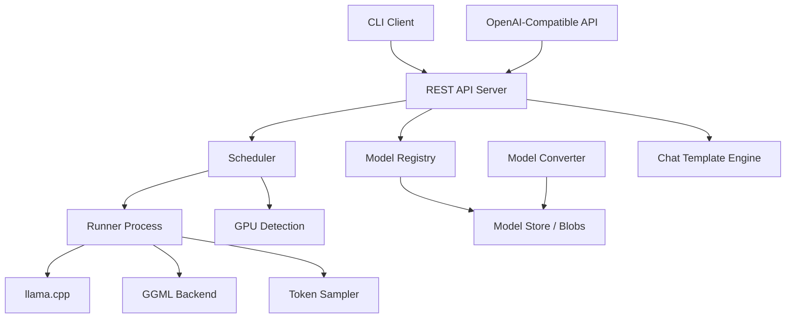
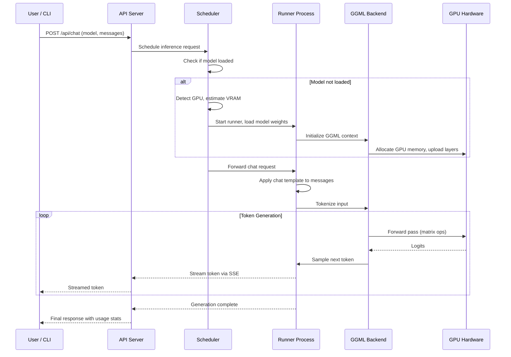
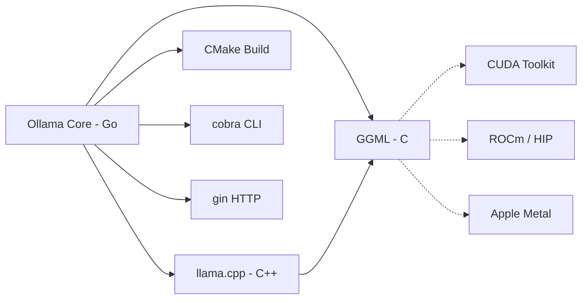

# Ollama

> Get up and running with large language models locally, providing a streamlined interface for downloading, managing, and running LLMs on personal hardware.

| Metadata | |
|---|---|
| Repository | https://github.com/ollama/ollama |
| License | MIT License |
| Primary Language | Go |
| Category | Developer Tool |
| Analyzed Release | `v0.15.6` (2026-02-07) |
| Stars (approx.) | 162,000+ |
| Generated by | Claude Opus 4.6 (Anthropic) |
| Generated on | 2026-02-09 |

---

## Overview

### Problem Domain

Running large language models locally requires navigating complex model formats, quantization schemes, hardware detection (GPU types, VRAM), runtime configuration, and inference engine setup. Developers and researchers need a simple way to download, manage, and interact with LLMs on their own machines without cloud dependencies.

### Project Positioning

Ollama is a Go-based tool that makes running LLMs locally as simple as `ollama run llama3`. It handles model management (downloading, storing, versioning via a Docker-like registry), hardware detection (NVIDIA CUDA, AMD ROCm, Apple Metal), and inference execution through integrated llama.cpp and GGML backends.

Ollama provides both a CLI and an OpenAI-compatible REST API, making it a drop-in local replacement for cloud LLM APIs. With over 162,000 GitHub stars, it has become the most popular tool for local LLM inference, supporting a growing catalog of models including Llama, Qwen, Gemma, DeepSeek, Mistral, and many others.

---

## Architecture Overview

---

## Core Components

### 1. Server and REST API

Responsibility: Provides the HTTP server that exposes endpoints for model management (pull, push, list, delete) and inference (generate, chat) with streaming support. Implements an OpenAI-compatible API layer for drop-in compatibility with existing tools.

Key Files:
- `server/` -- Main server implementation with route handlers
- `api/types.go` -- Request/response type definitions (GenerateRequest, ChatRequest, ModelResponse)
- `api/client.go` -- Go client library for the Ollama API
- `openai/` -- OpenAI API compatibility layer (translates OpenAI format to Ollama format)
- `middleware/` -- HTTP middleware (logging, authentication)

Design Patterns:
- REST API: Standard HTTP endpoints with JSON request/response
- Adapter: OpenAI compatibility layer adapts between API formats
- Streaming: Server-Sent Events for token-by-token generation responses

Key Endpoints:
- `POST /api/generate` -- Text generation with a prompt
- `POST /api/chat` -- Chat completion with message history
- `POST /api/pull` -- Download a model from the registry
- `POST /api/push` -- Push a model to the registry
- `GET /api/tags` -- List locally available models
- `DELETE /api/delete` -- Remove a local model

### 2. Model Registry and Storage

Responsibility: Manages model downloading, storage, and versioning using a Docker-inspired content-addressable blob store. Models are referenced by name and tag, with layers stored as SHA256-addressed blobs.

Key Files:
- `server/internal/registry/` -- Registry client for pulling/pushing models
- `server/internal/cache/blob/` -- Content-addressable blob storage
- `server/internal/manifest/` -- Model manifest handling (layers, config, template)
- `manifest/` -- Manifest data structures
- `fs/ggml/` -- GGML model file format parsing
- `fs/gguf/` -- GGUF model file format reading/writing

Design Patterns:
- Content-Addressable Storage: Blobs stored by SHA256 digest, enabling deduplication
- Registry Pattern: Docker-like pull/push workflow with manifest-based model composition
- Layer System: Models composed of layers (weights, template, license, parameters) that can be shared

Model Storage Layout:
- Manifests stored at `~/.ollama/models/manifests/{registry}/{namespace}/{model}/{tag}`
- Blobs stored at `~/.ollama/models/blobs/sha256-{digest}`
- Models share common layers (base weights, tokenizer) to save disk space

### 3. Scheduler and Resource Management

Responsibility: Manages the lifecycle of inference runner processes, allocating GPU/CPU resources, loading/unloading models based on available memory, and queuing requests when resources are constrained.

Key Files:
- `runner/` -- Runner process management
- `runner/ollamarunner/` -- Native Ollama runner (direct GGML backend usage)
- `runner/llamarunner/` -- llama.cpp-based runner
- `runner/common/` -- Shared runner interfaces
- `discover/gpu.go` -- GPU hardware detection
- `discover/cpu_linux.go` -- CPU capability detection (Linux)
- `llm/` -- LLM loading and inference orchestration

Design Patterns:
- Strategy: Multiple runner backends (ollamarunner, llamarunner) selected based on model and hardware
- Resource Pool: GPU memory tracked and allocated across loaded models
- Scheduler: Requests queued and routed to available runner instances

Resource Management:
- Automatic GPU detection (NVIDIA via CUDA, AMD via ROCm, Apple via Metal)
- VRAM estimation to determine model layer offloading (GPU vs CPU split)
- Idle model unloading after configurable timeout
- Concurrent model loading for multi-model serving

### 4. Inference Engine (GGML / llama.cpp Integration)

Responsibility: Executes the actual LLM inference, managing token generation, KV cache, context windowing, and hardware-accelerated matrix operations through the GGML tensor library and llama.cpp runtime.

Key Files:
- `ml/backend/ggml/` -- GGML backend integration
- `llama/` -- llama.cpp C library bindings (CGO)
- `llama/llama.cpp/` -- Vendored llama.cpp source code
- `kvcache/` -- KV cache management for context
- `sample/` -- Token sampling strategies (temperature, top-k, top-p, repeat penalty)
- `model/models/` -- Model architecture implementations (llama, gemma, qwen, deepseek2, etc.)
- `ml/nn/` -- Neural network layer primitives

Design Patterns:
- Bridge: Go code bridges to C/C++ via CGO for GGML/llama.cpp
- Builder: Model architectures construct computation graphs using GGML operations
- Strategy: Configurable sampling strategies for token generation

Supported Architectures:
- LLaMA family (llama, llama4)
- Qwen family (qwen2, qwen3, qwen25vl, qwen3vl)
- Gemma family (gemma2, gemma3, gemma3n)
- DeepSeek (deepseek2)
- Mistral (mistral3)
- BERT variants (bert, nomicbert)
- And many more via the `model/models/` directory

### 5. CLI and User Interface

Responsibility: Provides the command-line interface for interacting with Ollama, including model management, interactive chat, and system configuration.

Key Files:
- `cmd/cmd.go` -- CLI command definitions (run, pull, push, list, rm, serve, etc.)
- `cmd/interactive.go` -- Interactive chat session (REPL)
- `cmd/start.go` -- Server startup logic
- `cmd/config/` -- Configuration file management and AI tool integrations
- `template/` -- Chat template parsing and rendering (Go templates)
- `format/` -- Human-readable formatting utilities
- `app/` -- Desktop application (macOS, Windows) with system tray

Design Patterns:
- Command Pattern: Each CLI command maps to a handler function
- REPL: Interactive mode with readline support
- Observer: Progress callbacks for model download display

CLI Commands:
- `ollama run <model>` -- Download (if needed) and start interactive chat
- `ollama pull <model>` -- Download a model
- `ollama list` -- Show locally available models
- `ollama serve` -- Start the API server
- `ollama create` -- Create a custom model from a Modelfile
- `ollama rm <model>` -- Remove a local model

---

## Data Flow

---

## Key Design Decisions

### 1. Go as the Primary Language

Choice: Implement the server, CLI, and orchestration layer in Go, with C/C++ for the inference engine via CGO.

Rationale: Go provides excellent HTTP server performance, easy cross-compilation for multiple platforms (macOS, Linux, Windows), lightweight concurrency via goroutines, and a single-binary deployment model. This makes distribution simple -- users download one executable.

Trade-offs: CGO bridges between Go and C/C++ add build complexity and can complicate cross-compilation. The CGO boundary incurs some overhead. Go's type system is less expressive than Rust or C++ for low-level tensor operations.

### 2. Docker-Inspired Model Registry

Choice: Use a content-addressable blob store with manifests and tags, mirroring Docker's image distribution model.

Rationale: Developers are already familiar with Docker's pull/push workflow. Content-addressable storage enables layer sharing between models (e.g., shared base weights). Manifests allow composing models from multiple layers (weights, template, system prompt, parameters).

Trade-offs: The registry protocol and storage format are Ollama-specific, not a universal standard like GGUF alone. Model composition via Modelfiles adds a learning curve. The registry infrastructure must be maintained.

### 3. Integrated llama.cpp / GGML Backend

Choice: Vendor llama.cpp source code and compile it as part of the Ollama build, using CGO bindings for the Go-C++ interface.

Rationale: llama.cpp is the most mature and widely optimized GGUF inference engine, supporting CUDA, ROCm, Metal, and CPU with extensive quantization support. Vendoring ensures version compatibility and allows Ollama-specific modifications.

Trade-offs: Vendored code must be kept in sync with upstream llama.cpp. Build times are long due to C++ compilation. The dual runner system (llamarunner and ollamarunner) adds complexity.

### 4. Automatic Hardware Detection and Model Placement

Choice: Automatically detect available GPUs, estimate VRAM requirements, and determine optimal layer placement (GPU vs CPU offloading) without user configuration.

Rationale: Most users do not want to manually configure GPU layers, context sizes, or memory limits. Automatic detection makes the experience seamless -- `ollama run llama3` just works regardless of hardware.

Trade-offs: Automatic estimates may not be optimal for all configurations. Power users sometimes need manual overrides. Hardware detection across NVIDIA, AMD, Apple, and Intel requires platform-specific code and testing.

### 5. OpenAI-Compatible API

Choice: Provide an API endpoint (`/v1/chat/completions`) that mirrors the OpenAI API format.

Rationale: Enables drop-in replacement for cloud APIs in existing tools and applications. Libraries, agents, and UIs built for OpenAI can work with Ollama by changing only the base URL.

Trade-offs: Not all OpenAI features are supported (function calling nuances, vision model differences). Maintaining compatibility as the OpenAI API evolves requires ongoing work. Some Ollama-specific features require the native API.

---

## Dependencies

Key Dependencies:
- llama.cpp / GGML: Vendored C/C++ inference engine (compiled via CMake)
- cobra: Go CLI framework for command parsing
- gin or similar: HTTP router and server framework
- CGO: Go-C bridge for native code integration
- Platform SDKs: CUDA, ROCm, or Metal depending on target hardware

---

## Testing Strategy

- Test Location: Test files colocated with source files (`*_test.go` convention)
- Test Framework: Go standard testing package with `go test`
- Test Types:
  - Unit tests for API types, model parsing, format utilities, and configuration
  - Integration tests for server endpoints and model operations
  - Conversion tests for model format transformations (SafeTensors, PyTorch to GGUF)
  - Installation tests (`test-install.yaml` workflow) for cross-platform binary distribution
- CI Pipeline: GitHub Actions with workflows for testing (`test.yaml`), release building (`release.yaml`), and installation verification
- Model-Specific Tests: Conversion tests per model architecture (llama, qwen, gemma, etc.)
- Type Compatibility: TypeScript type definition tests ensure API compatibility with JavaScript clients

---

## Key Takeaways

1. Developer Experience as Differentiator: Ollama's success (162,000+ stars) stems from making local LLM inference as simple as `ollama run model-name`. The Docker-like workflow of pull, run, and manage is immediately familiar to developers, removing the friction that previously limited local LLM adoption.

2. Go for Infrastructure Tooling: The choice of Go provides single-binary distribution, cross-platform compilation, excellent HTTP server performance, and goroutine-based concurrency -- all critical for an infrastructure tool that needs to run on diverse hardware and serve multiple concurrent requests.

3. Layered Architecture Bridging Go and C++: The CGO bridge between Go orchestration and C++ inference allows Ollama to leverage the mature llama.cpp ecosystem while providing a modern, user-friendly interface. The dual runner system (llamarunner and ollamarunner) provides flexibility in execution strategies.

4. Content-Addressable Model Management: The Docker-inspired registry with content-addressable blobs, manifests, and layer sharing provides efficient storage and familiar workflows. Models can share common layers, reducing disk usage when multiple related models are installed.

5. Rapid Model Ecosystem Growth: The `model/models/` and `convert/` directories show support for a rapidly growing number of model architectures. The converter system transforms models from various formats (SafeTensors, PyTorch) to GGUF, making it easy to add new models as they are released by the open-source community.

---

## References

- Ollama Official Website: https://ollama.com/
- Ollama GitHub Repository: https://github.com/ollama/ollama
- Ollama API Documentation: https://github.com/ollama/ollama/blob/main/docs/api.md
- llama.cpp Integration (DeepWiki): https://deepwiki.com/ollama/ollama/5.2-llama.cpp-integration
- Ollama Architecture (Inoki): https://blog.inoki.cc/2024/04/15/Ollama/
- Ollama Internals (laiso): https://medium.com/@laiso/ollama-under-the-hood-f8ed0f14d90c
