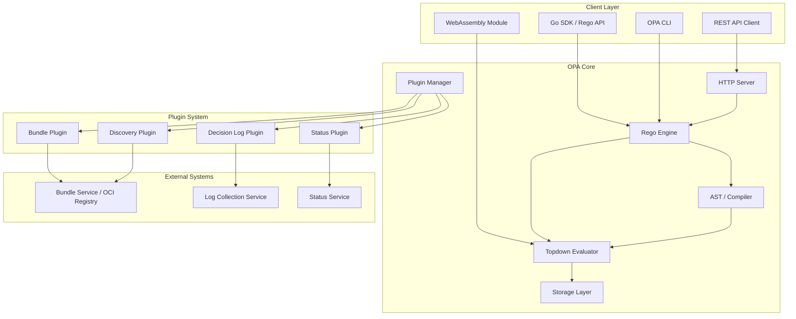
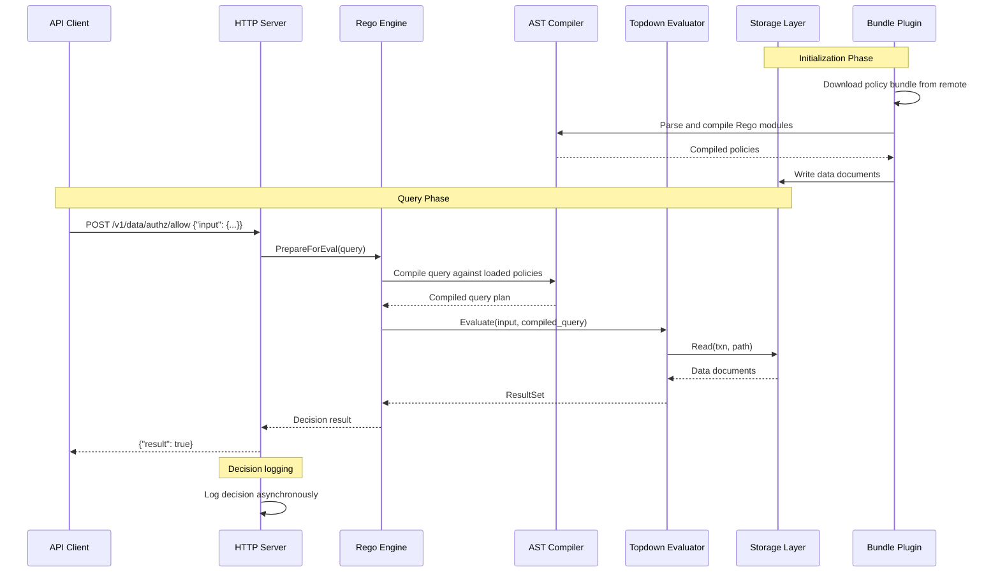
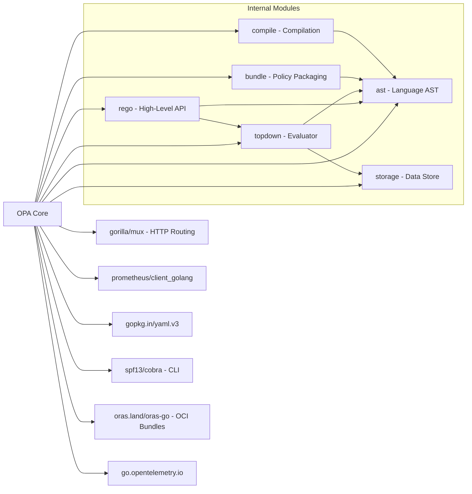

# OPA (Open Policy Agent)

> General-purpose policy engine for unified policy enforcement across the stack

| Metadata | |
|---|---|
| Repository | https://github.com/open-policy-agent/opa |
| License | Apache License 2.0 |
| Primary Language | Go |
| Category | Security |
| Analyzed Release | `v1.13.1` (2026-01-29) |
| Stars (approx.) | 11,000+ |
| Generated by | Claude Opus 4.6 (Anthropic) |
| Generated on | 2026-02-08 |

## Overview

OPA (Open Policy Agent) solves the problem of policy enforcement fragmentation across modern software stacks.
Without OPA, organizations end up with policy logic scattered across application code, infrastructure configs,
CI/CD pipelines, and cloud provider settings -- each with its own language and enforcement mechanism.

OPA positions itself as a general-purpose policy engine that decouples policy decision-making from policy
enforcement. It provides a unified framework where policies are written in a purpose-built declarative
language (Rego), and decisions are made by evaluating structured data against these policies.

The project is a CNCF Graduated project and serves as the foundation for Kubernetes admission control
(via Gatekeeper), API authorization, data filtering, and infrastructure-as-code validation across
the cloud-native ecosystem.

### Problems Solved

- Policy logic scattered across multiple systems with inconsistent semantics
- No standard language for expressing complex authorization and compliance rules
- Tight coupling between policy decisions and application code
- Lack of auditability and testability for policy logic
- No mechanism for distributing and versioning policies as artifacts

---

## Architecture Overview

---

## Core Components

### 1. Rego Language and AST

Responsibility: Provide a purpose-built policy language with parsing, compilation, type-checking,
and optimization. The AST package is the foundation upon which all policy evaluation is built.

Key Files:
- `ast/policy.go` -- Core policy AST definitions (Module, Rule, Body, Expr)
- `ast/parser.go` -- Rego language parser that produces AST nodes
- `ast/compile.go` -- Compiler that performs semantic analysis, type checking, and optimization passes
- `ast/check.go` -- Type checker for Rego expressions
- `ast/builtins.go` -- Registration and metadata for all built-in functions
- `ast/capabilities.go` -- Versioned capability sets for forward/backward compatibility
- `ast/term.go` -- Core value types (Var, Ref, Array, Object, Set, etc.)
- `ast/transform.go` -- AST transformation utilities
- `ast/index.go` -- Rule indexing for fast lookup during evaluation
- `ast/visit.go` -- Visitor pattern implementation for AST traversal

Design Patterns:
- Visitor Pattern: `ast/visit.go` enables traversal and transformation of the AST
- Builder Pattern: The compiler chains multiple analysis passes
- Interpreter Pattern: The AST directly represents the language semantics

### 2. Topdown Evaluator

Responsibility: Execute Rego policies by performing top-down evaluation of the compiled AST against
input data and the storage layer. This is the core evaluation engine that produces policy decisions.

Key Files:
- `topdown/query.go` -- Main query evaluation entry point (`NewQuery()`, `Run()`)
- `topdown/builtins.go` -- Built-in function dispatch and evaluation
- `topdown/cache.go` -- Inter-query and intra-query caching for evaluation results
- `topdown/trace.go` -- Evaluation tracing for debugging and profiling
- `topdown/instrumentation.go` -- Performance instrumentation hooks
- `topdown/cancel.go` -- Query cancellation support
- `topdown/http.go` -- Built-in HTTP client for external data fetching
- `topdown/graphql.go` -- GraphQL query validation and processing built-ins
- `topdown/print.go` -- Debug print support during evaluation

Design Patterns:
- Top-Down Evaluation: Modified Datalog-style evaluation with eager reference resolution
- Unification: Variables are bound through unification rather than explicit assignment
- Backtracking: The evaluator backtracks through rule alternatives when conditions fail
- Memoization: Results are cached to avoid redundant evaluation of shared sub-expressions

### 3. Storage Layer

Responsibility: Provide a transactional data store for policy data (base documents) that supports
reads, writes, and watches. The storage layer decouples data management from evaluation.

Key Files:
- `storage/interface.go` -- Core `Store` interface definition with `NewTransaction()`, `Read()`, `Write()` methods
- `storage/storage.go` -- Storage utilities and helpers
- `storage/inmem/` -- Default in-memory storage implementation using nested maps
- `storage/disk/` -- On-disk persistent storage implementation
- `storage/path.go` -- Hierarchical path manipulation for data access
- `storage/errors.go` -- Storage-specific error types

Design Patterns:
- Repository Pattern: Clean abstraction over different storage backends
- Transaction Pattern: All reads and writes occur within explicit transactions
- Strategy Pattern: In-memory and disk-based backends are interchangeable

### 4. HTTP Server and REST API

Responsibility: Expose OPA functionality over HTTP, providing endpoints for policy evaluation,
data management, policy upload, and health checks. This is the primary integration point for
services that use OPA as a sidecar or standalone service.

Key Files:
- `server/server.go` -- Main HTTP server implementation with routing and middleware
- `server/handlers/` -- Individual request handlers for each API endpoint
- `server/authorizer/` -- Authorization middleware for OPA's own API
- `server/identifier/` -- Request identification and correlation
- `server/buffer.go` -- Response buffering utilities
- `server/writer/` -- Custom HTTP response writers
- `server/types/` -- API request/response type definitions

Design Patterns:
- Middleware Chain: Composable middleware for authentication, authorization, logging
- Handler Pattern: Each API endpoint is a discrete handler
- Facade Pattern: Server presents a simplified interface to the complex underlying engine

### 5. Plugin System

Responsibility: Manage the lifecycle of extensible components that connect OPA to external
infrastructure -- bundle downloading, status reporting, decision logging, and service discovery.

Key Files:
- `plugins/plugins.go` -- Plugin manager that orchestrates plugin lifecycle
- `plugins/bundle/` -- Bundle plugin for downloading and activating policy/data bundles
- `plugins/status/` -- Status plugin for reporting OPA health and errors
- `plugins/logs/` -- Decision log plugin for shipping evaluation results
- `plugins/discovery/` -- Discovery plugin for bootstrapping OPA configuration
- `plugins/rest/` -- REST client used by plugins to communicate with external services
- `plugins/server/` -- Plugin server integration

Design Patterns:
- Plugin Architecture: Each plugin implements a common lifecycle interface (Start, Stop, Reconfigure)
- Observer Pattern: Plugins react to configuration changes and trigger callbacks
- Factory Pattern: Plugin instances are created from configuration specifications

---

## Data Flow

---

## Key Design Decisions

### 1. Custom Policy Language (Rego) Instead of General-Purpose Language

Choice: Design and implement a purpose-built declarative language (Rego) rather than embedding
policies in a general-purpose language like Python, JavaScript, or Go.

Rationale: A domain-specific language enables safety guarantees (guaranteed termination, no side effects),
better tooling (static analysis, type checking), and a semantics optimized for policy evaluation
(partial evaluation, rule indexing, unification).

Trade-offs:
- Pro: Guaranteed termination -- policies cannot loop forever
- Pro: Amenable to static analysis, optimization, and partial evaluation
- Pro: Can be compiled to WebAssembly for client-side evaluation
- Con: Learning curve for a new language
- Con: Ecosystem and tooling are smaller than general-purpose languages
- Con: Some policies are awkward to express declaratively

### 2. Top-Down Evaluation with Memoization

Choice: Use a modified top-down evaluation strategy (similar to Datalog) rather than bottom-up
materialization or forward chaining.

Rationale: Top-down evaluation naturally supports the query-driven pattern where clients ask specific
questions. It avoids materializing all possible facts (which could be exponential) and instead
evaluates only what is needed to answer the query.

Trade-offs:
- Pro: Efficient for targeted queries -- only evaluates relevant rules
- Pro: Natural mapping to the query API pattern
- Con: Can be slower for queries that require evaluating most of the data
- Con: Memoization adds memory overhead

### 3. Bundle-Based Policy Distribution

Choice: Package policies and data into bundles (tar.gz archives or OCI artifacts) that are
downloaded, verified, and activated atomically.

Rationale: Bundles enable GitOps workflows, atomic updates (all-or-nothing activation),
cryptographic signing and verification, and decoupled policy authoring from deployment.

Trade-offs:
- Pro: Atomic updates prevent partial policy states
- Pro: Compatible with existing artifact registries (OCI)
- Pro: Supports signing and verification for supply chain security
- Con: Eventual consistency -- changes are not instantaneous
- Con: Bundle size can grow with large data sets

### 4. Sidecar / Library / CLI Deployment Flexibility

Choice: Support OPA as a standalone daemon (sidecar), an embeddable Go library, a CLI tool,
and a WebAssembly module.

Rationale: Different use cases demand different deployment models. Microservices benefit from a
sidecar; monoliths benefit from library embedding; CI/CD pipelines use the CLI; and edge/browser
scenarios use WebAssembly.

Trade-offs:
- Pro: Maximum deployment flexibility across architectures
- Pro: Same policy language and semantics everywhere
- Con: Maintaining feature parity across all deployment modes is complex
- Con: Performance characteristics differ between modes

### 5. Transactional Storage with Pluggable Backends

Choice: Require all data access to occur within explicit transactions, with pluggable storage backends.

Rationale: Transactions ensure consistency during evaluation -- a query always sees a consistent
snapshot of data, even if bundles are being updated concurrently. Pluggable backends enable
both in-memory (fast) and disk-based (persistent) storage.

Trade-offs:
- Pro: Consistent evaluation semantics during concurrent updates
- Pro: Disk storage enables OPA to handle datasets larger than memory
- Con: Transaction overhead for read-heavy workloads
- Con: Storage interface complexity

---

## Dependencies

---

## Testing Strategy

OPA has one of the most comprehensive test suites in the CNCF ecosystem:

- Unit Tests: Every package contains extensive unit tests. The `ast/` package alone has
  `compile_test.go`, `parser_test.go`, `policy_test.go`, `parser_ext_test.go`, and many more.

- Topdown Evaluator Tests: The `topdown/` package contains test cases that exercise the evaluator
  across built-in functions, caching, cancellation, and tracing scenarios.

- Bundle Tests: `bundle/bundle_test.go` and `bundle/store_test.go` test bundle loading, signing,
  verification, and storage integration.

- CLI Tests: Each command in `cmd/` has corresponding test files (e.g., `cmd/eval_test.go`,
  `cmd/build_test.go`, `cmd/check_test.go`, `cmd/fmt_test.go`).

- Fuzzing: Fuzz tests target the parser and evaluator to discover edge cases.

- Integration Tests: End-to-end tests exercise the REST API, plugin system, and bundle workflow.

- Benchmark Tests: `cmd/bench.go` and `cmd/bench_test.go` provide performance benchmarking.

- Conformance Tests: Ensure Rego language semantics remain consistent across releases.

---

## Key Takeaways

1. OPA demonstrates that investing in a domain-specific language pays dividends when the problem
   domain is well-defined. Rego enables safety guarantees (termination, no side effects) and
   powerful optimizations (partial evaluation, WebAssembly compilation) that would be impossible
   with a general-purpose language.

2. The top-down evaluation model with memoization is a practical adaptation of academic Datalog
   techniques for real-world policy evaluation. It balances expressiveness with performance by
   lazily evaluating only what is needed to answer the query.

3. The plugin architecture (bundles, status, decision logs, discovery) cleanly separates the
   core evaluation engine from operational concerns. This enables OPA to be deployed in
   radically different environments (edge, cloud, on-premise) with the same core engine.

4. Supporting multiple deployment modes (daemon, library, CLI, WebAssembly) from a single
   codebase is a significant architectural achievement. The `rego/` package provides a clean
   high-level API that abstracts the underlying complexity for library users.

5. Bundle-based policy distribution is an important pattern for policy-as-code workflows.
   It enables GitOps, atomic updates, and cryptographic verification -- bringing software
   supply chain practices to policy management.

---

## References

- [GitHub Repository: open-policy-agent/opa](https://github.com/open-policy-agent/opa)
- [OPA Official Documentation](https://www.openpolicyagent.org/docs/latest/)
- [OPA Management APIs and Architecture](https://www.openpolicyagent.org/docs/management-introduction)
- [Topdown Package Documentation](https://pkg.go.dev/github.com/open-policy-agent/opa/topdown)
- [Wiz Academy: What is OPA](https://www.wiz.io/academy/application-security/open-policy-agent-opa)
- [Komodor: OPA Features and Use Cases](https://komodor.com/learn/open-policy-agent-opa-features-use-cases-and-how-to-get-started/)
