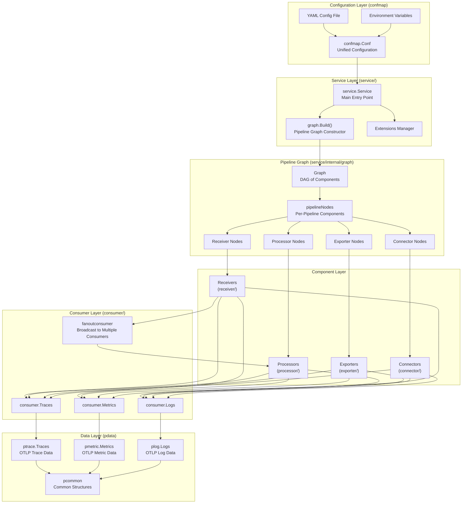
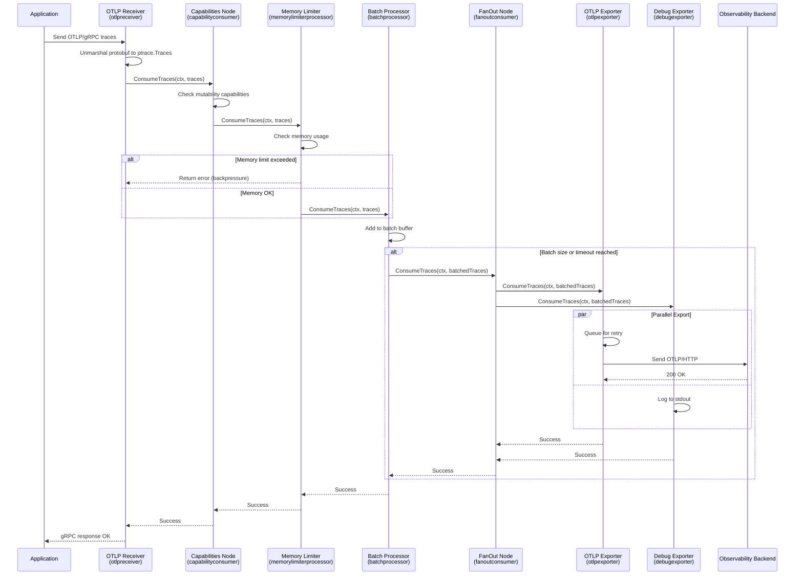
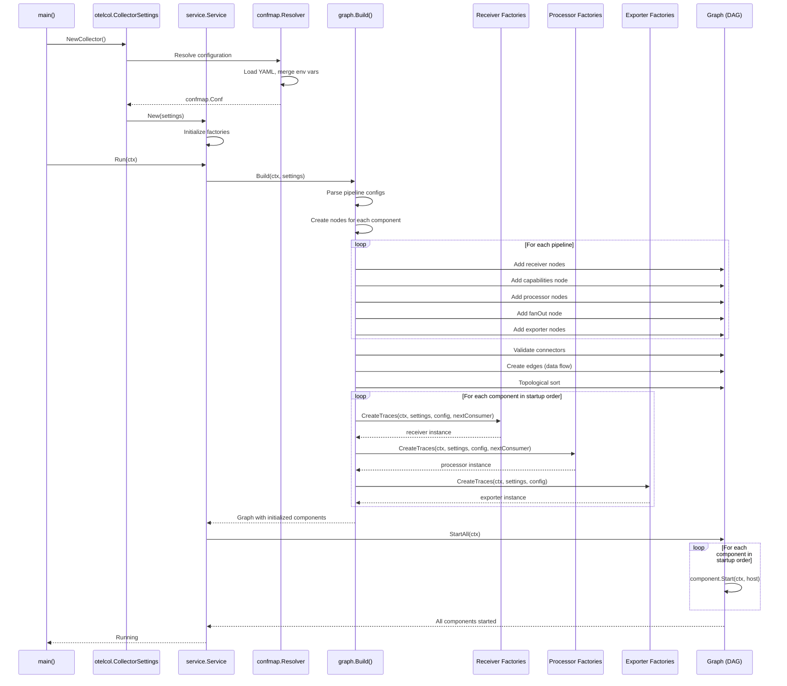
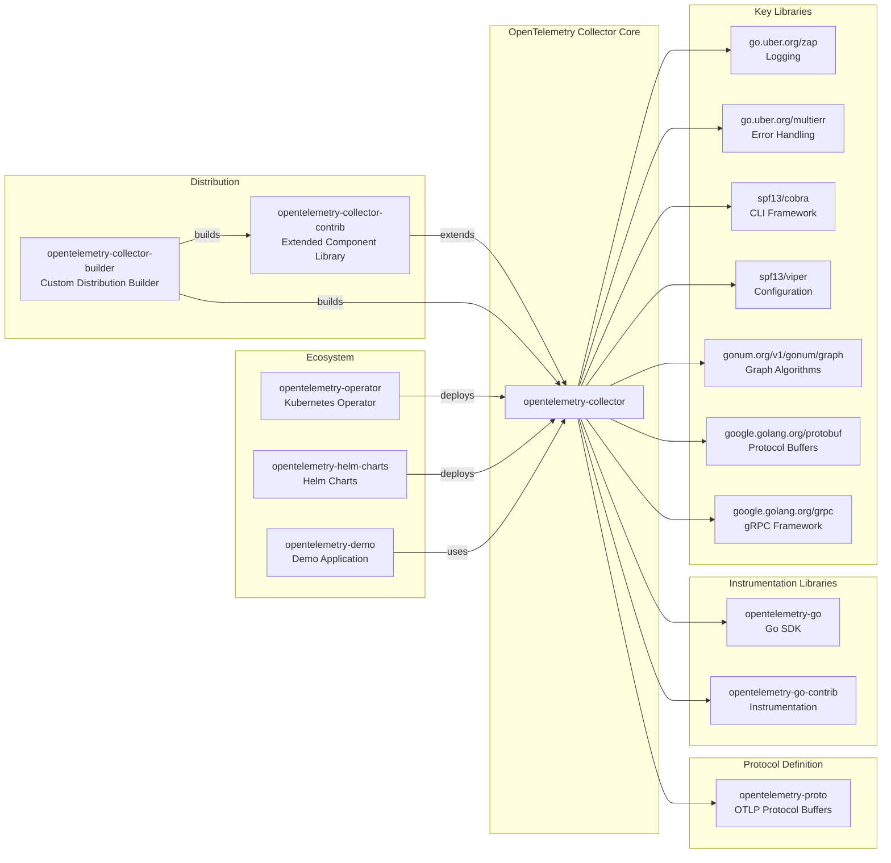

# OpenTelemetry Collector

> A vendor-agnostic implementation to receive, process, and export telemetry data (traces, metrics, and logs)

| Metadata | |
|---|---|
| Repository | https://github.com/open-telemetry/opentelemetry-collector |
| License | Apache-2.0 |
| Primary Language | Go |
| Analyzed Release | `v0.145.0` (2026-02-02) |
| Stars (approx.) | 6,590 |
| Generated by | Claude Sonnet 4.5 (Anthropic) |
| Generated on | 2026-02-08 |

## Overview

The OpenTelemetry Collector is the core component of the OpenTelemetry project, providing a unified, vendor-agnostic telemetry data pipeline. It consolidates multiple agents/collectors into a single codebase that can receive, process, and export traces, metrics, and logs to various backends.

Problems it solves:

- Eliminates the need to run and maintain multiple agents/collectors for different telemetry data formats (Jaeger, Prometheus, Zipkin, etc.)
- Provides a vendor-neutral implementation that prevents vendor lock-in for observability infrastructure
- Enables centralized telemetry processing with advanced capabilities like sampling, filtering, batching, and routing
- Supports both agent mode (deployed alongside applications) and gateway mode (centralized collection)

Positioning:

The Collector is the de facto standard for OpenTelemetry data pipelines and is widely adopted across the cloud-native ecosystem. It serves as the reference implementation for the OTLP protocol and is integrated into major observability platforms. The project maintains strict API stability guarantees and follows semantic versioning.

## Architecture Overview

The Collector employs a pipeline-based architecture where data flows through three core stages: receivers ingest telemetry from various sources, processors transform and enrich the data, and exporters send it to backends. Pipelines are assembled from components via a directed acyclic graph (DAG) constructed at runtime from YAML configuration.

## Core Components

### Service Layer (`service/service.go`)

- Responsibility: Application lifecycle management and component orchestration
- Key files: `service/service.go`, `service/telemetry/factory.go`
- Design patterns: Builder pattern, Dependency Injection

The Service struct serves as the main entry point and manages the complete lifecycle of the Collector. It coordinates the initialization, startup, and shutdown of all components including receivers, processors, exporters, connectors, and extensions. The Settings struct holds all configuration and factory instances required to build the service, with factories organized by component type (receiver.Factory, processor.Factory, etc.). The service uses the graph package to construct a directed acyclic graph of components based on pipeline configuration.

### Pipeline Graph (`service/internal/graph/graph.go`)

- Responsibility: DAG construction and validation of component connections
- Key files: `service/internal/graph/graph.go`, `service/internal/graph/receiver.go`, `service/internal/graph/processor.go`, `service/internal/graph/exporter.go`, `service/internal/graph/connector.go`
- Design patterns: Graph data structure (using gonum/graph), Topological sort for startup ordering

The graph package implements the core pipeline construction logic. The Build() function takes Settings and constructs a directed graph where nodes represent component instances and edges represent data flow. Each pipeline is represented by a pipelineNodes struct containing receivers, processors, exporters, and special nodes like capabilitiesNode and fanOutNode. The graph validates that connectors are properly connected between pipelines and uses topological sorting to determine the correct startup order. The gonum/graph library provides the underlying graph data structures and algorithms.

### Configuration Layer (`confmap/`)

- Responsibility: Configuration parsing, merging, and resolution
- Key files: `confmap/confmap.go`, `confmap/provider/`, `confmap/resolver.go`
- Design patterns: Provider pattern for pluggable configuration sources

The confmap package provides a unified configuration system that supports multiple sources (file, environment variables, etc.) through the Provider interface. Configuration values are resolved in priority order with support for variable expansion and type coercion. The Conf type wraps a map[string]any and provides methods for unmarshaling configuration into component-specific config structs. Providers can be registered to support different configuration sources like YAML files, HTTP endpoints, or cloud configuration services.

### Receiver Layer (`receiver/receiver.go`)

- Responsibility: Ingesting telemetry data from various sources
- Key files: `receiver/receiver.go`, `receiver/receiverhelper/`, specific receivers in `receiver/otlpreceiver/`
- Design patterns: Factory pattern, Strategy pattern for signal-specific creation

Receivers are the entry points for telemetry data. The Factory interface defines methods CreateTraces(), CreateMetrics(), and CreateLogs() to create signal-specific receiver instances. Each receiver implements the component.Component interface for lifecycle management and feeds data to a consumer (consumer.Traces, consumer.Metrics, or consumer.Logs). The OTLP receiver is the reference implementation supporting both gRPC and HTTP protocols. Receivers can be configured to listen on specific endpoints and support various protocols like Jaeger, Zipkin, Prometheus, etc.

### Processor Layer (`processor/processor.go`)

- Responsibility: Transforming, filtering, and enriching telemetry data
- Key files: `processor/processor.go`, `processor/processorhelper/`, `processor/batchprocessor/`, `processor/memorylimiterprocessor/`
- Design patterns: Chain of Responsibility pattern, Decorator pattern

Processors implement both component.Component and consumer interfaces (e.g., consumer.Traces), allowing them to receive data, process it, and pass it to the next consumer in the pipeline. The Factory interface provides CreateTraces(), CreateMetrics(), and CreateLogs() methods that take a next consumer parameter, enabling processor chaining. Common processors include batch (batching data for efficiency), memory_limiter (preventing OOM), and attributes (manipulating attributes). The processorhelper package provides utilities for building processors with common patterns like queuing and retry logic.

### Exporter Layer (`exporter/exporter.go`)

- Responsibility: Sending telemetry data to backends
- Key files: `exporter/exporter.go`, `exporter/exporterhelper/`, `exporter/otlpexporter/`, `exporter/otlphttpexporter/`
- Design patterns: Factory pattern, Strategy pattern for different protocols

Exporters are the terminal nodes in pipelines that send data to observability backends. They implement both component.Component and consumer interfaces, receiving data from processors or receivers. The exporterhelper package provides common functionality like retry logic, queue management, and timeout handling. The Factory interface's Create methods (CreateTraces, CreateMetrics, CreateLogs) do not take a next consumer parameter since exporters are terminal. Built-in exporters include OTLP (gRPC and HTTP), debug (logging), and nop (discarding data for testing).

### Connector Layer (`connector/connector.go`)

- Responsibility: Bridging pipelines by acting as both exporter and receiver
- Key files: `connector/connector.go`, `connector/forwardconnector/`
- Design patterns: Adapter pattern, Mediator pattern

Connectors are special components that join two pipelines, consuming data from one pipeline (acting as an exporter) and emitting data to another pipeline (acting as a receiver). They enable advanced use cases like routing, fan-out/fan-in, and signal transformation (e.g., traces to metrics). The Factory interface provides nine Create methods covering all combinations (CreateTracesToTraces, CreateTracesToMetrics, CreateTracesToLogs, etc.). The forwardconnector is a simple implementation that forwards data between pipelines of the same signal type.

### Data Model Layer (`pdata/`)

- Responsibility: In-memory representation of telemetry data
- Key files: `pdata/ptrace/`, `pdata/pmetric/`, `pdata/plog/`, `pdata/pcommon/`
- Design patterns: Immutable data structures, Wrapper pattern over OTLP protobuf

The pdata package defines the internal data model for all telemetry flowing through the Collector. It wraps OTLP protobuf structures (kept in private "orig" fields) to provide a stable API while allowing internal implementation changes. Each package (ptrace, pmetric, plog) provides signal-specific types with methods for manipulation. The pcommon package provides common structures like Map, Slice, Value, and Timestamp. The API is designed to prevent mutable data sharing through methods like MoveTo() and CopyTo(). All instances must be created via New* functions; zero-value instances are not valid and will cause panics.

### Consumer Interface (`consumer/`)

- Responsibility: Defining interfaces for data consumption between components
- Key files: `consumer/consumer.go`, `consumer/consumererror/`, `internal/fanoutconsumer/`
- Design patterns: Observer pattern, Fan-out pattern

The consumer package defines the core interfaces (consumer.Traces, consumer.Metrics, consumer.Logs) that all components implement to receive data. Each interface has a single method (ConsumeTraces, ConsumeMetrics, ConsumeLogs) that processes data in the corresponding pdata format. The Capabilities struct describes a consumer's behavior regarding data mutation. The fanoutconsumer package implements broadcasting to multiple consumers, used when multiple processors or exporters are configured in a pipeline. Error handling is managed through the consumererror package, which provides helpers for distinguishing permanent vs. retryable errors.

## Data Flow

### Typical Telemetry Processing Flow

### Pipeline Graph Construction Flow

## Key Design Decisions

### 1. Pipeline as DAG with Pluggable Components

- Choice: Implementing pipelines as directed acyclic graphs where components are nodes and data flow is represented by edges, constructed at runtime from configuration
- Rationale: Provides maximum flexibility for complex routing scenarios while maintaining type safety and preventing cycles. The DAG structure enables validation, topological ordering for startup/shutdown, and efficient fan-out to multiple exporters
- Trade-offs: Increased complexity in graph construction and validation logic. Runtime overhead of graph traversal compared to hardcoded pipelines. Requires gonum/graph dependency

### 2. Signal-Specific Factory Methods

- Choice: Each component factory has separate Create methods for traces, metrics, and logs (CreateTraces, CreateMetrics, CreateLogs) rather than a generic Create method
- Rationale: Maintains type safety at compile time and makes it explicit which signals a component supports. Allows components to return pipeline.ErrSignalNotSupported for unsupported signals. Enables signal-specific configuration and optimization
- Trade-offs: More verbose factory interfaces with up to 9 methods for connectors. Duplication in factory implementations for components supporting multiple signals. Cannot easily add new signal types without API changes

### 3. OTLP Protobuf as Internal Data Format

- Choice: Using OTLP protobuf structures wrapped in pdata packages as the internal representation for all telemetry data
- Rationale: OTLP is the OpenTelemetry standard protocol, ensuring compatibility and efficient serialization. Wrapping protobuf in pdata provides API stability independent of protobuf changes. Prevents mutable sharing bugs through controlled API design
- Trade-offs: Conversion overhead for non-OTLP formats (Jaeger, Zipkin, etc.). Memory overhead of wrapper types. All data must fit OTLP schema even if source format is richer

### 4. Consumer Chain Pattern with Capabilities

- Choice: Processors and exporters implement consumer interfaces (consumer.Traces, etc.), forming a chain where each component receives a next consumer during creation
- Rationale: Enables flexible pipeline composition where processors can be chained in any order. The Capabilities system allows components to declare whether they mutate data, enabling optimizations like zero-copy passing. Clean separation of concerns between components
- Trade-offs: Requires careful management of consumer chains during pipeline construction. Backpressure must propagate through the entire chain. Error handling complexity when any component in chain fails

### 5. Configuration via confmap Abstraction

- Choice: Abstracting configuration sources through the confmap.Provider interface rather than direct YAML parsing
- Rationale: Supports multiple configuration sources (files, environment variables, remote config servers) with a unified API. Enables dynamic configuration updates and complex merge strategies. Provider pattern allows extending configuration sources without modifying core code
- Trade-offs: Additional abstraction layer increases complexity. Configuration debugging can be harder when multiple sources are merged. Type safety is reduced compared to strongly-typed config structs

### 6. Connector Components for Inter-Pipeline Communication

- Choice: Introducing connectors as first-class components that bridge pipelines, acting as both exporter and receiver
- Rationale: Enables advanced use cases like routing traces to different backends based on attributes, generating metrics from traces, or fan-out/fan-in patterns. Maintains pipeline isolation while allowing controlled data sharing. Provides a clean abstraction for signal transformation
- Trade-offs: Increased complexity in graph construction and validation. Nine factory methods required to cover all signal combinations (traces→traces, traces→metrics, etc.). Can create performance bottlenecks if not carefully designed

## Dependencies

## Testing Strategy

The Collector employs a comprehensive multi-layered testing approach ensuring reliability and stability.

Unit tests: Each package contains extensive test coverage with _test.go files. Component tests use mocks and fakes from packages like receivertest, processortest, and exportertest. The componenttest package provides test implementations of component.Host and other core interfaces. Golden file pattern is used for validating complex data structures.

Integration tests: End-to-end tests validate complete pipeline flows using actual component implementations. The otelcoltest package provides utilities for testing full Collector configurations. Tests verify correct data flow through receivers, processors, and exporters with various configurations.

CI/CD: GitHub Actions workflows run on every PR and commit, including unit tests, integration tests, linting (golangci-lint), and dependency checks. Cross-platform testing ensures compatibility across Linux, macOS, and Windows. API compatibility is verified using the .checkapi.yaml configuration to prevent breaking changes.

Performance testing: Benchmarks measure throughput and resource consumption under various loads. Memory profiling identifies potential leaks. Load tests validate behavior under extreme conditions.

Stability guarantees: Components are marked with stability levels (development, alpha, beta, stable) documented in docs/component-stability.md. The project follows semantic versioning with strict API compatibility guarantees for stable components.

## Key Takeaways

1. DAG-based pipeline architecture: Representing pipelines as directed acyclic graphs enables complex routing and transformation scenarios while maintaining clear data flow semantics. Topological sorting ensures correct startup/shutdown order and prevents circular dependencies.

2. Signal-specific factory pattern: Explicit factory methods for each telemetry signal (traces, metrics, logs) provide compile-time type safety and clear capability declarations. This pattern scales well as new signals are added while preventing runtime type errors.

3. Consumer chain composition: The pattern of components implementing both component.Component and consumer interfaces enables flexible pipeline composition through constructor dependency injection. This is cleaner than post-construction wiring and ensures components cannot operate without a valid next consumer.

4. Wrapped protobuf data model: Wrapping OTLP protobuf in pdata packages provides API stability while enabling internal optimizations. The MoveTo/CopyTo methods enforce controlled data sharing and prevent subtle mutation bugs common in Go.

5. Configuration abstraction via confmap: The Provider pattern for configuration sources enables supporting file, environment, remote config, and future sources through a unified API. Priority-based merging and variable expansion provide powerful configuration composition.

6. Connector components for pipeline bridging: First-class support for inter-pipeline communication through connectors enables advanced patterns like routing, fan-out/fan-in, and signal transformation. This avoids the need for external routing infrastructure.

7. Capability-aware processing: The Capabilities system allows components to declare their data mutation behavior, enabling optimizations like zero-copy passing when possible. This provides performance benefits without sacrificing correctness.

8. Extensibility without core modification: The factory-based architecture and configuration system enable adding new receivers, processors, exporters, and connectors through external packages. The opentelemetry-collector-contrib repository demonstrates this pattern at scale with 100+ components.

## References

- [OpenTelemetry Collector Official Documentation](https://opentelemetry.io/docs/collector/)
- [OpenTelemetry Collector Architecture](https://opentelemetry.io/docs/collector/architecture/)
- [How to Build Advanced OpenTelemetry Collector Pipelines](https://oneuptime.com/blog/post/2026-01-07-opentelemetry-collector-pipelines/view)
- [OpenTelemetry Collector Configuration](https://opentelemetry.io/docs/collector/configuration/)
- [Collector Vision Document](https://github.com/open-telemetry/opentelemetry-collector/blob/main/docs/vision.md)
- [Component Stability Guidelines](https://github.com/open-telemetry/opentelemetry-collector/blob/main/docs/component-stability.md)
- [OpenTelemetry Protocol (OTLP) Specification](https://github.com/open-telemetry/opentelemetry-proto)
- [Building Resilient Telemetry Pipelines with OpenTelemetry Collector](https://bindplane.com/blog/how-to-build-resilient-telemetry-pipelines-with-the-opentelemetry-collector-high-availability-and-gateway-architecture)
- [OpenTelemetry Collector: Beginner's Guide to Telemetry Pipelines](https://www.dash0.com/guides/opentelemetry-collector)
- [OpenTelemetry Collector Complete Guide - SigNoz](https://signoz.io/blog/opentelemetry-collector-complete-guide/)
