# OpenTofu

> A truly open-source infrastructure as code tool for declaratively managing cloud infrastructure

| Metadata | |
|---|---|
| Repository | https://github.com/opentofu/opentofu |
| License | Mozilla Public License 2.0 |
| Primary Language | Go |
| Analyzed Release | `v1.11.4` (2026-01-21) |
| Stars (approx.) | 27,777 |
| Generated by | Claude Opus 4.6 (Anthropic) |
| Generated on | 2026-02-08 |

## Overview

OpenTofu is an open-source infrastructure as code tool that allows you to define and manage cloud infrastructure using declarative configuration files. Born as a fork of Terraform in 2023 following HashiCorp's license change from MPL 2.0 to BSL, OpenTofu is now governed by the Linux Foundation with a Technical Steering Committee drawn from multiple organizations.

Problems it solves:

- Declarative infrastructure definition across multiple cloud providers and services
- Execution planning that shows exactly what changes will be made before applying them
- Dependency resolution through resource graph analysis for parallel resource creation and modification
- State management with encryption support for secure storage of infrastructure state
- Version control and sharing of infrastructure blueprints as code

Positioning:

OpenTofu maintains CLI compatibility with Terraform while providing open governance and community-driven development. It supports the same 3,900+ providers and modules ecosystem, ensuring backward compatibility with existing Terraform configurations. Key differentiators include built-in state encryption, early variable evaluation in the terraform block, and a commitment to remaining truly open-source under MPL 2.0. OpenTofu competes with Terraform (now under BSL), Pulumi, CloudFormation, and other IaC tools, positioning itself as the open-source successor to Terraform's open-source legacy.

## Architecture Overview

OpenTofu follows a pipeline architecture where commands flow through layers: CLI parsing, backend operations, configuration loading, graph building, graph walking, and vertex execution. The core engine builds a directed acyclic graph (DAG) of resources and their dependencies, then walks this graph to execute operations in parallel while respecting dependency constraints.

## Core Components

### CLI Layer (`cmd/tofu`)

- Responsibility: Entry point and command-line argument parsing
- Key files: `cmd/tofu/main.go`, `cmd/tofu/commands.go`
- Design patterns: Command pattern (Cobra framework)

The CLI layer serves as the entry point for the tofu binary. The `commands.go` file contains the mapping between user-facing command names (plan, apply, init, destroy, etc.) and their corresponding implementation types in the `internal/command` package. Key responsibilities include parsing command-line flags, environment variables, provider discovery through `provider_source.go`, and working directory management. The CLI immediately delegates execution to the appropriate command implementation after initial bootstrapping.

### Backend Layer (`internal/backend`)

- Responsibility: State storage and operation execution
- Key files: `internal/backend/backend.go`, `internal/backend/local/local.go`
- Design patterns: Strategy pattern, Interface segregation

Backends determine where OpenTofu stores state snapshots. The `backend.Backend` interface defines core state management capabilities, while `backend.Enhanced` adds operation execution. Most backends only handle state storage and are wrapped by `local.Local` for operation execution. The local backend constructs a `tofu.Context` using the state manager, configuration loader, and operation descriptor. State managers implement `statemgr.Full` for reading, writing, locking, and persisting state snapshots. The `statemgr.Filesystem` implementation handles the local `terraform.tfstate` file, while remote backends delegate to network services.

### Configuration Loader (`internal/configs`)

- Responsibility: Parsing and loading HCL configuration files
- Key files: `internal/configs/config.go`, `internal/configs/configload/loader.go`
- Design patterns: Composite pattern (module tree), Lazy evaluation

The configuration loader recursively loads the root module and all child modules into a unified `configs.Config` tree structure. It uses the HCL library to parse OpenTofu's DSL. Portions of configuration that depend on runtime values (like resource attribute references) remain as `hcl.Body` and `hcl.Expression` objects, deferring evaluation until graph walk time. The `configload.Loader` handles module installation during `tofu init` and module location resolution during subsequent operations.

### Core Engine (`internal/tofu`)

- Responsibility: Orchestrating graph construction and execution
- Key files: `internal/tofu/context.go`, `internal/tofu/graph.go`
- Design patterns: Builder pattern (graph construction), Template method pattern

The `tofu.Context` is the central orchestrator for all OpenTofu operations. Created by backends, it holds references to provider and provisioner plugins, state, configuration, and execution settings. The Context constructs operation-specific graphs through graph builders, each composed of a sequence of `GraphTransformer` implementations. Key transformers include `ConfigTransformer` (adds resource vertices from config), `StateTransformer` (adds resource instance vertices from state), `ReferenceTransformer` (adds dependency edges), and `ProviderTransformer` (associates resources with providers). The resulting `tofu.Graph` is a directed acyclic graph (DAG) representing the operation's execution plan.

### Graph Walk Engine (`internal/dag`)

- Responsibility: Parallel execution of graph vertices respecting dependencies
- Key files: `internal/dag/graph.go`, `internal/tofu/context_walk.go`
- Design patterns: Visitor pattern, Concurrent execution

The graph walk algorithm in `dag.AcyclicGraph.Walk` traverses the graph, evaluating vertices in dependency order while maximizing parallelism. The `tofu.ContextGraphWalker` implements high-level operations during the walk. The `EnterPath` method creates a `tofu.EvalContext` for each module, providing namespace isolation. Vertices implementing `tofu.GraphNodeExecutable` expose an `Execute` method called during traversal. Thread-safe state access is ensured through `states.SyncState`, which wraps the state with mutexes for concurrent reads and writes. The default parallelism is 10, balancing CPU utilization with provider rate limiting.

### Plugin System (`internal/plugin`)

- Responsibility: Provider and provisioner plugin communication via gRPC
- Key files: `internal/plugin/grpc_provider.go`, `docs/plugin-protocol/`
- Design patterns: Plugin architecture, RPC abstraction

OpenTofu plugins are separate executable programs that expose gRPC services. OpenTofu Core launches plugin processes, performs a handshake via stdout, and connects as a gRPC client to the loopback interface. The plugin protocol is versioned using protobuf packages (tfplugin5, tfplugin6), allowing plugins to implement multiple protocol versions simultaneously. Protocol definitions in `docs/plugin-protocol/*.proto` specify RPC methods like Configure, ValidateResourceConfig, PlanResourceChange, and ApplyResourceChange. The `providers.Factory` and `provisioners.Factory` interfaces abstract plugin instantiation, enabling test doubles and mock implementations.

### State Encryption (`internal/encryption`)

- Responsibility: Encrypting and decrypting state and plan files at rest
- Key files: `internal/encryption/encryption.go`, `docs/state_encryption.md`
- Design patterns: Strategy pattern (encryption methods), Chain of responsibility (key providers)

A differentiating feature of OpenTofu, state encryption provides at-rest protection for sensitive infrastructure state. Users configure encryption in the terraform block using key providers (static, AWS KMS, etc.) and encryption methods (AES-GCM). The encryption configuration supports separate methods for state files, plan files, and remote state data sources. Key rollover is supported through fallback blocks: OpenTofu attempts decryption with the primary method first, then falls back to the old method, but always writes with the primary method. The `encryption.Encryption` interface is passed through the Context and applied during state snapshot serialization and deserialization.

### Language Evaluation (`internal/lang`)

- Responsibility: Expression evaluation and reference resolution
- Key files: `internal/lang/eval.go`, `internal/lang/scope.go`
- Design patterns: Interpreter pattern, Symbol table

Expression evaluation happens during vertex execution. The `lang.Scope` provides the evaluation context, including variable values, resource attributes, built-in functions, and module outputs. Reference analysis via `lang.References` identifies which objects an expression depends on. The scope fetches these values from state or earlier graph vertex results, builds a lookup table, and passes it to HCL's evaluation engine. Evaluation produces `cty.Value` objects, OpenTofu's dynamically-typed value representation. This architecture enables deferred evaluation, allowing expressions to reference computed attributes only available after resource creation.

## Data Flow

### Plan Operation Sequence

## Key Design Decisions

### 1. Graph-Based Execution Model

- Choice: Representing infrastructure as a directed acyclic graph (DAG) where vertices are resources and edges are dependencies
- Rationale: The graph structure naturally expresses "happens-after" relationships between resources. Walking the DAG with topological ordering guarantees that dependencies are satisfied before dependent resources are processed. Maximal parallelism is achieved by executing independent vertices concurrently
- Trade-offs: Graph construction and traversal add overhead compared to sequential execution. Complex resource dependencies can create large graphs with intricate edge relationships. Graph cycles must be detected and reported as errors since DAGs cannot contain cycles

### 2. Plugin Architecture with gRPC

- Choice: Implementing providers and provisioners as separate processes communicating via gRPC with versioned protocol buffers
- Rationale: Process isolation ensures that plugin crashes don't bring down OpenTofu Core. The gRPC boundary enables providers to be written in any language with protocol buffer support. Versioned protocols (tfplugin5, tfplugin6) allow protocol evolution while maintaining backward compatibility. Plugins can be developed, tested, and versioned independently from Core
- Trade-offs: Inter-process communication adds latency compared to in-process function calls. The plugin handshake and gRPC setup incur startup overhead. Debugging across process boundaries is more difficult. Protocol buffer schemas must be carefully versioned to avoid breaking changes

### 3. Graph Transformers for Extensibility

- Choice: Building graphs through a sequence of composable graph transformers, each implementing the `GraphTransformer` interface
- Rationale: Separating graph construction into discrete transformation steps makes the logic comprehensible and testable. Each transformer handles one concern (adding config resources, adding state instances, adding dependency edges, etc.). Different operations (plan, apply, destroy) compose different transformer sequences to create operation-specific graphs
- Trade-offs: The execution order of transformers matters, creating implicit dependencies between transformers. Understanding the complete graph construction requires tracing through 10-20 transformers. Adding new graph behavior requires careful consideration of where in the transformer sequence it belongs

### 4. Deferred Expression Evaluation

- Choice: Parsing HCL configuration at load time but deferring expression evaluation until graph walk time
- Rationale: Many configuration expressions reference attributes of other resources (e.g., `aws_instance.web.id`), which are only known after those resources are created or fetched from state. Deferring evaluation allows expressions to reference computed values. HCL's `hcl.Expression` and `hcl.Body` types provide opaque handles that can be evaluated later with appropriate variable bindings
- Trade-offs: Configuration errors in expressions are only detected at graph walk time, not at load time. The two-phase process (parse then evaluate) is more complex than immediate evaluation. Expression evaluation happens many times (once per vertex), requiring careful caching of evaluation results

### 5. State Encryption as First-Class Feature

- Choice: Building native state encryption into OpenTofu Core with support for multiple key providers and encryption methods
- Rationale: State files contain sensitive data like passwords and private keys. Users have requested state encryption for years. Baking encryption into Core ensures consistent encryption across all backends and state operations. Supporting multiple key providers (static keys, AWS KMS, etc.) accommodates different security requirements. Separate encryption configurations for state, plan, and remote state data sources provide granular control
- Trade-offs: Encryption configuration adds complexity to the terraform block. Users must manage encryption keys and disaster recovery. Performance overhead from encryption/decryption, though typically minimal. Encrypted state files are not human-readable for debugging. Key rollover requires careful coordination using fallback mechanisms

### 6. Module-Scoped Evaluation Context

- Choice: Creating a separate `EvalContext` for each module during graph walk, rather than a single global evaluation context
- Rationale: Modules provide namespace isolation - variables, locals, and resources in one module don't collide with those in another. The `EvalContext` maintains the symbol table for a module's namespace. Module-scoped contexts prevent cross-module reference bugs and enable parallel evaluation of independent modules
- Trade-offs: Context creation overhead for each module, though typically negligible. Passing data between modules requires explicit output/variable wiring, preventing convenient but dangerous implicit references. Parent modules must explicitly expose values to child modules

## Dependencies

```mermaid
graph LR
    subgraph Core["OpenTofu Core"]
        OpenTofu["opentofu/opentofu"]
    end

    subgraph Providers["Provider Ecosystem"]
        AWSProvider["opentofu/provider-aws"]
        AzureProvider["opentofu/provider-azurerm"]
        GCPProvider["opentofu/provider-google"]
        ProviderRegistry["OpenTofu Registry<br/>3,900+ Providers"]
    end

    subgraph Modules["Module Ecosystem"]
        ModuleRegistry["OpenTofu Registry<br/>Modules"]
        TerraformModules["Compatible with<br/>Terraform Modules"]
    end

    subgraph Libraries["Key Libraries"]
        HCL["hashicorp/hcl<br/>Configuration Language"]
        GoPlugin["hashicorp/go-plugin<br/>Plugin Framework"]
        Cty["zclconf/go-cty<br/>Type System"]
        Protobuf["protocolbuffers/protobuf<br/>Plugin Protocol"]
        Cobra["spf13/cobra<br/>CLI Framework"]
    end

    subgraph Ecosystem["Ecosystem Tools"]
        Env0["env0<br/>SaaS Platform"]
        Spacelift["Spacelift<br/>SaaS Platform"]
        TFLint["terraform-linters/tflint<br/>Linter (compatible)"]
        Checkov["bridgecrewio/checkov<br/>Security Scanner"]
    end

    OpenTofu --> HCL & GoPlugin & Cty & Protobuf & Cobra
    OpenTofu -.->|uses| AWSProvider & AzureProvider & GCPProvider
    OpenTofu -.->|discovers| ProviderRegistry
    OpenTofu -.->|loads| ModuleRegistry & TerraformModules
    Env0 -->|manages| OpenTofu
    Spacelift -->|manages| OpenTofu
    TFLint -->|lints| OpenTofu
    Checkov -->|scans| OpenTofu
```

## Testing Strategy

OpenTofu employs a comprehensive multi-layered testing approach to ensure reliability and correctness.

Unit tests: Each package contains extensive `_test.go` files with table-driven tests. The internal packages like `internal/tofu`, `internal/configs`, and `internal/dag` have high test coverage. Mock implementations of interfaces (like `providers.Interface`) enable isolated unit testing without external dependencies.

Integration tests: The `internal/e2e` package contains end-to-end tests that exercise complete workflows (init, plan, apply, destroy) against real provider plugins. These tests use fixture directories with actual OpenTofu configurations and verify the complete pipeline from CLI to state changes.

Provider testing: The `provider-simple` and `provider-simple-v6` packages in `internal/` serve as minimal test providers implementing both tfplugin5 and tfplugin6 protocols. These enable testing of plugin communication without dependencies on external provider implementations.

CI/CD: GitHub Actions workflows run the full test suite on every pull request and push to main. Tests run across multiple platforms (Linux, macOS, Windows) and Go versions. The build system includes linting, code generation verification (protocol buffers), and security scanning. Releases are signed and published to the OpenTofu registry.

## Key Takeaways

1. Graph-based orchestration with transformers: Expressing infrastructure operations as DAG transformations provides a powerful abstraction. The transformer pattern (where each transformer adds or modifies graph vertices and edges) enables building different graphs for different operations while keeping each transformation step focused and testable. This pattern is applicable to any system that needs to process entities with complex dependencies.

2. Plugin isolation through process boundaries: Running plugins as separate processes with gRPC communication trades performance for reliability and flexibility. This architecture prevents third-party code from crashing the core engine and enables a polyglot plugin ecosystem. The versioned protocol approach (tfplugin5, tfplugin6) shows how to evolve RPC interfaces while maintaining backward compatibility. Applicable to any system with third-party extensions.

3. Deferred evaluation for computed dependencies: The two-phase approach (parse configuration, then evaluate expressions) handles the fundamental challenge of IaC: configuration often references infrastructure that doesn't exist yet. By parsing configuration into ASTs but deferring evaluation until runtime, OpenTofu can handle expressions that reference computed attributes. This pattern applies to any declarative system where declarations reference computed values.

4. State encryption as a built-in concern: Rather than expecting users to encrypt state externally, OpenTofu bakes encryption into the state management layer. The strategy pattern (pluggable key providers and encryption methods) combined with fallback support for key rollover demonstrates how to add security as a first-class feature. The configuration-based approach (declaring encryption in the terraform block) is more maintainable than environment-based encryption.

5. Namespace isolation through scoped contexts: Creating a separate evaluation context for each module provides namespace isolation and enables parallel evaluation. The `EvalContext` acts as a symbol table for module-scoped resources, variables, and locals. This pattern is broadly applicable to any hierarchical configuration system where child scopes should be isolated from each other but have controlled access to parent scope values.

6. Operation descriptor pattern: The `backend.Operation` struct serves as a data transfer object carrying all parameters for an operation (action, workspace, variables, target resources, etc.). This pattern decouples command parsing from execution, allowing the backend layer to handle operations uniformly regardless of which command initiated them. Applicable to any system with multiple entry points executing similar workflows.

## References

- [OpenTofu Official Documentation](https://opentofu.org/docs/)
- [OpenTofu Internals](https://opentofu.org/docs/internals/)
- [OpenTofu Architecture Document](https://github.com/opentofu/opentofu/blob/main/docs/architecture.md)
- [Resource Graph Internals](https://opentofu.org/docs/internals/graph/)
- [OpenTofu Plugin Protocol](https://github.com/opentofu/opentofu/tree/main/docs/plugin-protocol)
- [State Encryption Documentation](https://github.com/opentofu/opentofu/blob/main/docs/state_encryption.md)
- [Provider Registry Protocol](https://opentofu.org/docs/internals/provider-registry-protocol/)
- [Module Registry Protocol](https://opentofu.org/docs/internals/module-registry-protocol/)
- [OpenTofu vs Terraform Comparison](https://spacelift.io/blog/opentofu-vs-terraform)
- [Building the OpenTofu Registry](https://opentofu.org/blog/building-the-opentofu-registry/)
- [Infrastructure as Code: Terraform vs OpenTofu vs Pulumi - A 2026 Comparison](https://dasroot.net/posts/2026/01/infrastructure-as-code-terraform-opentofu-pulumi-comparison-2026/)
