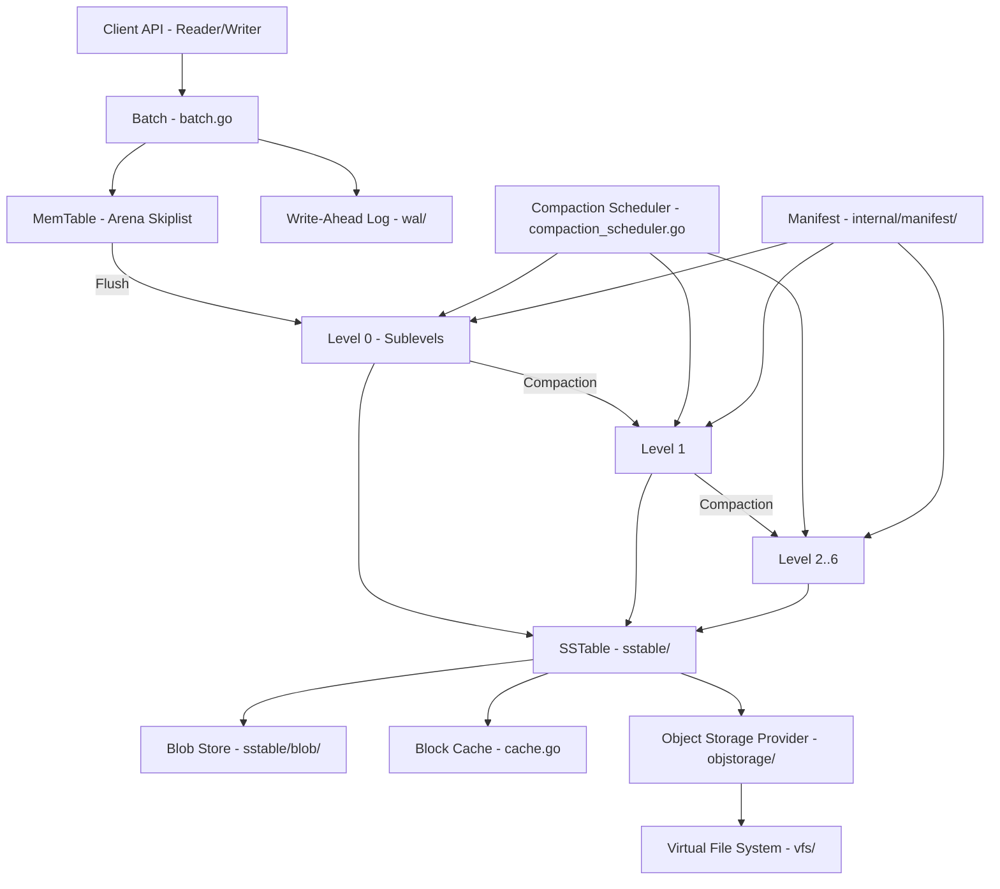
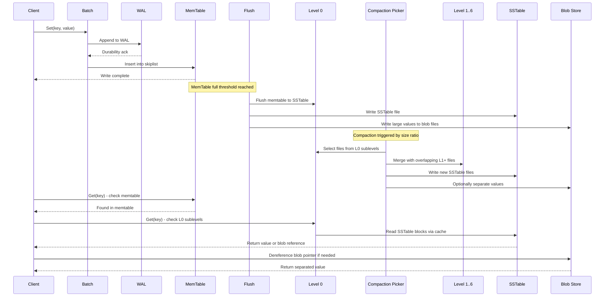
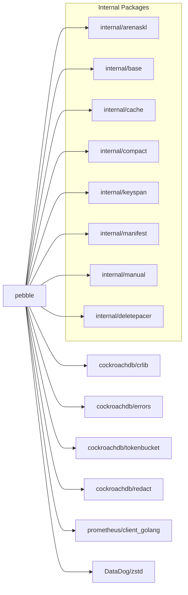

# Pebble

> LevelDB/RocksDB-inspired key-value store in Go, the primary storage engine for CockroachDB

| Metadata | |
|---|---|
| Repository | https://github.com/cockroachdb/pebble |
| License | BSD 3-Clause |
| Primary Language | Go |
| Category | Database |
| Analyzed Release | `v2.1.4` (2026-01-21) |
| Stars (approx.) | 5,000+ |
| Generated by | Claude Opus 4.6 (Anthropic) |
| Generated on | 2026-02-08 |

## Overview

Pebble is a LevelDB/RocksDB-inspired key-value store written in Go, designed and maintained by Cockroach Labs as the primary storage engine for CockroachDB. It provides an ordered key/value store built on a Log-Structured Merge-tree (LSM) architecture optimized for write-heavy workloads while maintaining competitive read performance.

Pebble differentiates itself from RocksDB through several key innovations: L0 sublevels for reduced read amplification, flush splitting for improved write throughput, copy-on-write B-trees for managing large numbers of SSTables, integrated range tombstone processing in the merging iterator, and a recently introduced value separation feature to minimize write amplification.

---

## Architecture Overview

---

## Core Components

### 1. Database Core (db.go, open.go)

The central DB struct in `db.go` is the primary entry point and orchestrates all storage operations. It implements the `Reader` interface which provides `Get` and `NewIter` methods, and the `Writer` interface for mutations. The `Open` function in `open.go` initializes the database, replays the WAL, loads the manifest, and establishes the LSM state.

Key types and constants:
- `Reader` interface: provides `Get(key []byte)` and `NewIter(o *IterOptions)` for concurrent read access
- `ErrNotFound`, `ErrClosed`, `ErrReadOnly`: sentinel error values
- `minFileCacheSize = 64`: minimum number of cached file handles
- `initialMemTableSize = 256 KB`: starting size for memtable allocation
- `maxMemTableSize` and `maxBatchSize`: bounded by uint32 for arena-based allocation

### 2. LSM Tree and Compaction (compaction.go, compaction_picker.go, compaction_scheduler.go)

The LSM tree manages data across 7 levels (L0 through L6) as defined by `NumLevels = 7` in `internal/manifest/version.go`. Level 0 uniquely allows overlapping key ranges via a sublevel mechanism that reduces read amplification during heavy write loads.

The compaction subsystem comprises several files:
- `compaction.go`: Core compaction logic with `expandedCompactionByteSizeLimit` controlling maximum compaction size (25x target file size, capped at half available disk per concurrent compaction)
- `compaction_picker.go`: Selects which levels and files to compact based on size ratios and overlap
- `compaction_scheduler.go`: Coordinates concurrent compactions using configurable concurrency ranges via `opts.CompactionConcurrencyRange()`
- `compaction_delete.go`: Handles tombstone-driven compactions
- `compaction_value_separation.go`: Implements value separation during compaction, separating large values into blob files

The `maxGrandparentOverlapBytes` function (10x target file size) limits overlap with grandparent level to control output file boundaries.

### 3. MemTable and Write-Ahead Log (internal/arenaskl/, wal/)

The memtable is implemented as an arena-backed concurrent skiplist in `internal/arenaskl/`. Key files:
- `arena.go`: Fixed-size memory arena with uint32 offsets for node allocation
- `skl.go`: Lock-free concurrent skiplist implementation
- `iterator.go` and `flush_iterator.go`: Iteration over skiplist entries

The WAL subsystem in `wal/` provides durability:
- `wal.go`: WAL interface definitions
- `failover_writer.go` and `failover_manager.go`: Failover WAL implementation for resilience across multiple storage directories
- `standalone_manager.go`: Standard single-directory WAL management
- `reader.go`: WAL replay during recovery

### 4. SSTable Layer (sstable/)

The SSTable (Sorted String Table) package handles on-disk table format:
- `block/`: Block encoding and decoding with compression support
- `colblk/`: Columnar block format for improved cache efficiency
- `colblk_writer.go`: Writer for columnar block format
- `blob/`: Blob reference storage for value-separated data
- `blob_reference_index.go`: Index mapping keys to blob file references
- `filter.go`: Bloom filter implementation for efficient key lookups
- `comparer.go`: Key comparison utilities
- `copier.go`: SSTable copying for operations like ingestion

### 5. Manifest and Version Management (internal/manifest/)

The manifest system tracks the current state of the LSM:
- `version.go`: `Version` struct holds the complete set of files across all levels plus `BlobFiles`
- `NewInitialVersion` creates empty versions with `MakeLevelMetadata` per level
- `KeyRange` and `ExtendKeyRange` compute bounds across file sets
- `SortBySmallest` orders files by their smallest key
- The manifest uses a copy-on-write B-tree for O(log n) edits in LSMs with large file counts

---

## Data Flow

---

## Key Design Decisions

### 1. L0 Sublevels for Reduced Read Amplification

Unlike traditional LSM implementations where L0 files can overlap freely, Pebble organizes L0 into sublevels where files within a sublevel do not overlap. This allows concurrent compactions from different sublevels into L1, reducing the stall time during heavy writes and improving read performance by limiting the number of files that must be checked for a point lookup in L0.

### 2. Arena-Based Concurrent Skiplist

The memtable uses a fixed-size arena (`internal/arenaskl/arena.go`) with uint32 offsets instead of Go pointers. This design avoids garbage collection pressure from millions of small allocations, provides cache-friendly memory layout, and enables lock-free concurrent access. The uint32 offsets limit memtable size to ~4GB but provide significant performance benefits.

### 3. Integrated Range Tombstone Processing

Rather than treating range deletions as a separate layer, Pebble integrates range tombstone processing directly into the `mergingIter` structure. This eliminates the need for a separate tombstone compaction phase and ensures that range deletions are efficiently applied during normal iteration, reducing both read amplification and implementation complexity.

### 4. Value Separation with Blob Files

Introduced for CockroachDB 25.3, the `compaction_value_separation.go` and `sstable/blob/` modules implement WiscKey-style value separation. Large values are stored in separate blob files while SSTables retain only key-pointer pairs. This dramatically reduces write amplification during compactions since only the small pointers are rewritten, while the large values remain untouched in blob storage.

### 5. Copy-on-Write B-Tree for File Metadata

The manifest uses a copy-on-write B-tree (rather than a sorted slice) to manage file metadata across levels. This provides O(log n) insertion and deletion of files during version edits, which is critical when the LSM contains tens of thousands of SSTables. The immutable nature of COW B-trees also enables lock-free concurrent reads of version state.

---

## Dependencies

Notable external dependencies:
- `cockroachdb/errors`: Rich error handling with stack traces and Sentry integration
- `cockroachdb/crlib/crtime`: High-resolution monotonic time
- `cockroachdb/tokenbucket`: Rate limiting for compaction I/O pacing
- `prometheus/client_golang`: Metrics exposition
- `cockroachdb/redact`: Safe redaction of sensitive values in logs

---

## Testing Strategy

Pebble employs a comprehensive multi-layered testing approach:

- Unit Tests: Each package contains extensive `_test.go` files covering individual components (e.g., `internal/arenaskl/skl_test.go` for skiplist, `wal/failover_writer_test.go` for WAL failover)
- Data-Driven Tests: The `testdata/` directories contain declarative test cases that drive table-driven tests using a custom test framework
- Metamorphic Testing: The `internal/metamorphic/` directory contains randomized tests that compare Pebble's behavior against a reference implementation to catch subtle correctness bugs
- Benchmarks: The `cmd/pebble/` binary provides YCSB-style benchmarks (`ycsb.go`), write benchmarks (`write_bench.go`), and sync benchmarks (`sync.go`)
- Fuzzing: Integration with Go's built-in fuzzing for SSTable parsing and key encoding
- Invariant Checking: The `internal/invariants/` package provides debug-mode assertions that validate LSM invariants during operation
- Integration Testing: CockroachDB's own test suite serves as extensive integration testing

---

## Key Takeaways

1. Pebble demonstrates that a Go-based storage engine can achieve performance competitive with C++ implementations like RocksDB, particularly through careful memory management (arena allocation, manual memory), avoidance of GC pressure, and lock-free concurrent data structures.

2. The L0 sublevel design is a significant innovation over traditional LSM implementations, enabling concurrent compactions from L0 to L1 and reducing both read amplification and write stalls during high-throughput workloads.

3. The modular internal architecture (separate packages for `sstable`, `wal`, `manifest`, `objstorage`, `vfs`) enables clean separation of concerns while maintaining performance. The `objstorage` and `vfs` abstractions support both local and remote storage backends.

4. Value separation (blob files) addresses one of the fundamental challenges of LSM trees -- write amplification -- by storing large values separately and only rewriting small key-pointer pairs during compaction. This is particularly important for CockroachDB's MVCC storage where historical versions amplify the data volume.

5. The WAL failover mechanism (`wal/failover_writer.go`, `wal/failover_manager.go`) is an unusual feature that allows Pebble to transparently switch between WAL storage directories, improving resilience in environments with unreliable storage devices.

---

## References

- [GitHub Repository](https://github.com/cockroachdb/pebble)
- [CockroachDB Storage Layer Architecture](https://www.cockroachlabs.com/docs/stable/architecture/storage-layer)
- [Introducing Pebble: A RocksDB-inspired key-value store written in Go](https://www.cockroachlabs.com/blog/pebble-rocksdb-kv-store/)
- [Go Package Documentation](https://pkg.go.dev/github.com/cockroachdb/pebble)
- [RocksDB Comparison](https://github.com/cockroachdb/pebble/blob/master/docs/rocksdb.md)
- [Database of Databases - Pebble](https://dbdb.io/db/pebble)
- [Introducing Value Separation for Improved Performance](https://www.cockroachlabs.com/blog/value-separation-cockroachdb-25-3-improved-performance/)
- [Concurrent Manual Compactions in Pebble](https://mufeezamjad.com/blog/pebble-concurrent-compactions)
