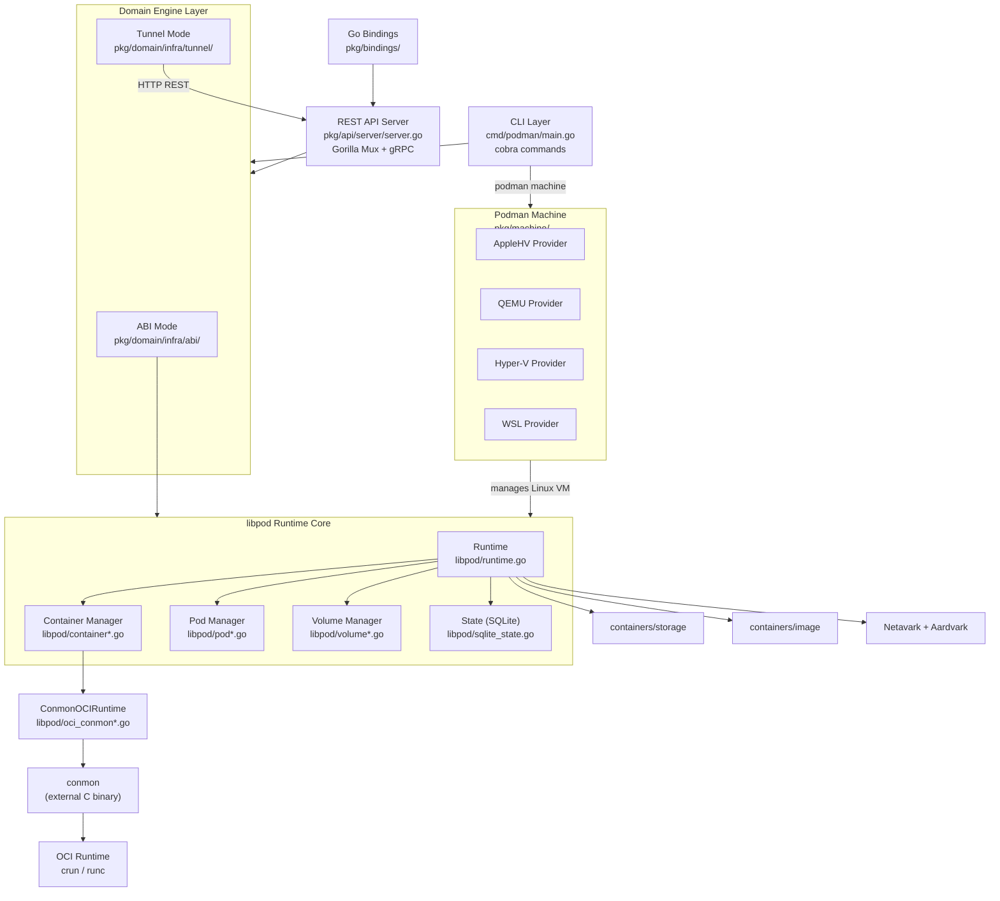
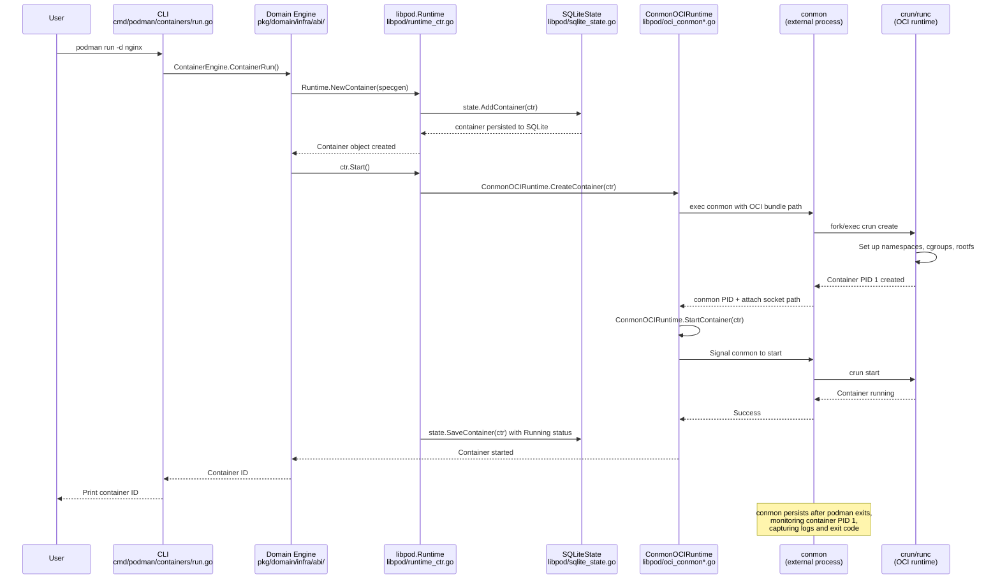
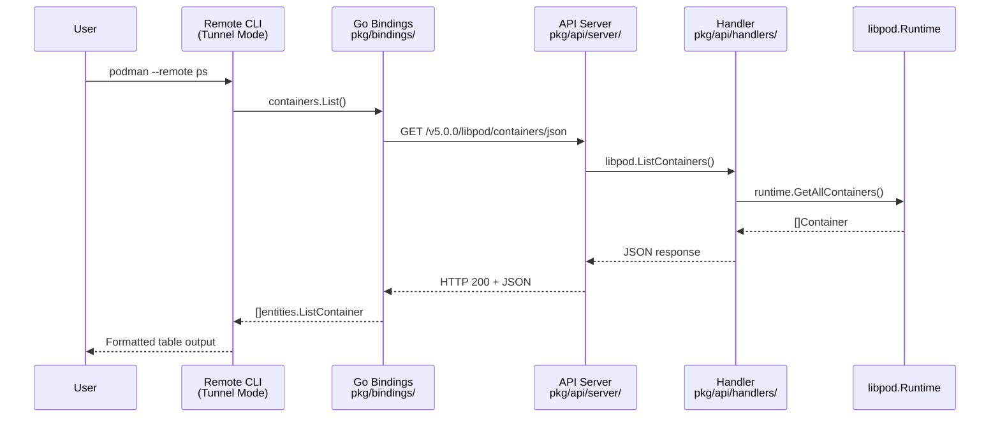
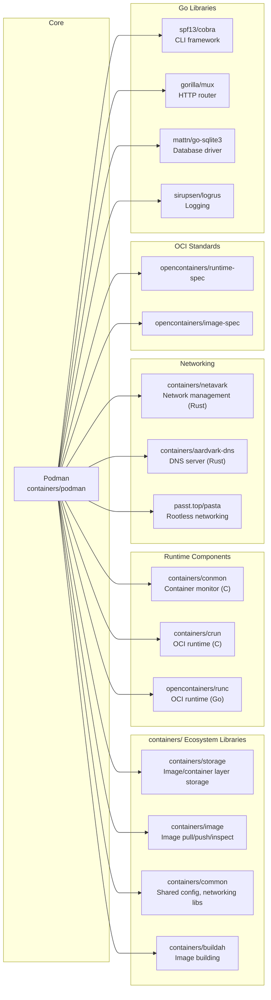

# Podman

> A daemonless tool for managing OCI containers, pods, and images with Docker-compatible CLI

| Metadata | |
|---|---|
| Repository | https://github.com/containers/podman |
| License | Apache License 2.0 |
| Primary Language | Go |
| Category | Container Runtime |
| Analyzed Release | `v5.7.1` (2025-12-10) |
| Stars (approx.) | 30,618 |
| Generated by | Claude Opus 4.6 (Anthropic) |
| Generated on | 2026-02-08 |

## Overview

Podman (POD MANager) is a tool for managing OCI-compliant containers, pods, container images, and volumes. Built on the libpod library, it provides full container lifecycle management without requiring a background daemon process, running as a standard fork-exec process model that enhances security and reduces idle resource consumption. Podman runs containers natively on Linux and supports macOS and Windows through managed virtual machines via `podman machine`.

Problems it solves:

- Eliminates the security risk of a privileged, always-running daemon (like dockerd) by using a daemonless, fork-exec architecture where each container is monitored by its own lightweight conmon process
- Enables rootless container execution without setuid binaries, allowing unprivileged users to run containers securely with user namespace isolation
- Provides native pod support (groups of containers sharing namespaces), bridging the gap between single-container tooling and Kubernetes-style workloads
- Offers a Docker-compatible CLI and REST API, enabling seamless migration from Docker workflows without requiring application changes

Positioning:

Podman sits within the broader `containers/` ecosystem alongside Buildah (image building), Skopeo (image transport), CRI-O (Kubernetes CRI), Netavark (networking), and conmon (container monitoring). While Docker relies on a monolithic daemon (dockerd) to manage all containers, Podman takes a fundamentally different approach: each container runs as a direct child process supervised by conmon rather than a central daemon. This makes Podman especially suitable for systemd-managed environments, HPC workloads, and security-sensitive deployments where running a privileged daemon is undesirable. Podman is the default container engine in RHEL, Fedora, and other Red Hat-based distributions.

## Architecture Overview

Podman follows a layered architecture with the CLI and REST API at the top, a domain engine abstraction in the middle (supporting both local ABI and remote tunnel modes), and libpod as the core runtime library at the bottom. Libpod orchestrates container lifecycle management by coordinating with external components: conmon for process monitoring, OCI runtimes (crun/runc) for container execution, containers/storage for filesystem layers, containers/image for image operations, and Netavark/Aardvark for networking. The architecture is fundamentally daemonless: the podman process can exit after launching a container, while conmon persists as a lightweight monitor for the container process.

## Core Components

### Libpod Runtime (`libpod/`)

- Responsibility: Core container runtime library providing the fundamental API for all container, pod, volume, and image lifecycle management
- Key files: `libpod/runtime.go`, `libpod/runtime_ctr.go`, `libpod/runtime_pod.go`, `libpod/runtime_volume.go`, `libpod/runtime_img.go`
- Design patterns: Functional options pattern (`RuntimeOption`), Interface-based abstraction (OCIRuntime, State), Worker pool pattern for parallel operations

The `Runtime` struct in `libpod/runtime.go` is the central orchestrator of Podman. It holds references to the state backend (SQLite), the container/image store (containers/storage), the OCI runtime implementation (ConmonOCIRuntime), the network backend (Netavark), and the lock manager. The Runtime is initialized via `NewRuntime()` with functional options, and it coordinates all high-level operations such as `NewContainer()`, `RemoveContainer()`, `NewPod()`, and `NewVolume()`. The runtime uses a worker channel (`workerChannel`) for parallel background operations like container cleanup. All state mutations go through the `State` interface, which is backed by SQLite (`SQLiteState`) for persistent state tracking of container configuration, status, and metadata.

### OCI Runtime Integration (`libpod/oci*.go`)

- Responsibility: Abstracting the OCI runtime layer and managing the conmon container monitor process
- Key files: `libpod/oci.go` (OCIRuntime interface), `libpod/oci_conmon_common.go` (ConmonOCIRuntime implementation), `libpod/oci_conmon_linux.go`, `libpod/oci_missing.go`
- Design patterns: Strategy pattern (OCIRuntime interface with multiple implementations), Process supervisor delegation (conmon)

The `OCIRuntime` interface defines the contract for container execution operations: `CreateContainer`, `StartContainer`, `KillContainer`, `StopContainer`, `DeleteContainer`, `PauseContainer`, `Attach`, `ExecContainer`, and `CheckpointContainer`. The primary implementation, `ConmonOCIRuntime`, wraps the conmon binary which in turn wraps the actual OCI runtime (crun or runc). When creating a container, `ConmonOCIRuntime` assembles the OCI runtime spec, launches conmon as a child process (which then double-forks to daemonize), and conmon in turn launches the OCI runtime to set up namespaces and execute the container's entrypoint. This three-level process hierarchy (podman -> conmon -> OCI runtime -> container PID 1) is the key enabler of Podman's daemonless design: podman can exit while conmon continues to monitor the container, record logs, hold TTY file descriptors, and capture exit codes.

### CLI and Command Registry (`cmd/podman/`)

- Responsibility: User-facing command-line interface built on Cobra, handling argument parsing, validation, and dispatching to the domain engine layer
- Key files: `cmd/podman/main.go`, `cmd/podman/root.go`, `cmd/podman/registry/registry.go`, `cmd/podman/containers/`, `cmd/podman/pods/`, `cmd/podman/images/`
- Design patterns: Command pattern (Cobra), Registry pattern for self-registering commands via Go init() functions, Build-tag separation for remote vs local builds

The CLI uses a centralized registry pattern: each subcommand package (containers, pods, images, machine, etc.) registers its commands during Go package initialization via `registry.Commands`. The `main.go` entry point calls `parseCommands()` which iterates over all registered commands, checks engine mode annotations (ABI vs Tunnel), and builds the Cobra command tree. The engine mode is critical: in ABI mode (local), commands directly invoke libpod through the `pkg/domain/infra/abi/` package; in Tunnel mode (remote), commands make HTTP requests to a Podman API service through `pkg/domain/infra/tunnel/`. This dual-mode architecture is controlled by Go build tags (`!remote` for ABI, default for tunnel), allowing a single codebase to produce both local and remote client binaries.

### REST API Server (`pkg/api/`)

- Responsibility: Providing both a Docker-compatible API and a native Podman API over HTTP/gRPC for remote container management
- Key files: `pkg/api/server/server.go`, `pkg/api/handlers/`, `pkg/api/server/register_containers.go`, `pkg/api/server/register_images.go`
- Design patterns: Router-based middleware (Gorilla Mux), Handler registration, Idle tracker for automatic shutdown

The `APIServer` struct embeds `http.Server`, a gRPC server, and a `libpod.Runtime` pointer. Routes are registered via `register_*.go` files that map HTTP endpoints to handler functions. The server supports both Docker-compatible endpoints (under `/v{version}/`) and Podman-native endpoints (under `/v{version}/libpod/`), enabling tools like Docker Compose to work against Podman without modification. The server includes an idle tracker (`pkg/api/server/idle/`) that monitors connection activity and can trigger automatic shutdown after a configurable timeout, which is important for the socket-activated systemd service model where `podman system service` starts on-demand and stops when idle.

### Podman Machine (`pkg/machine/`)

- Responsibility: Managing Linux virtual machines on non-Linux hosts (macOS, Windows) to provide a Linux environment for running containers
- Key files: `pkg/machine/config.go`, `pkg/machine/applehv/`, `pkg/machine/qemu/`, `pkg/machine/hyperv/`, `pkg/machine/wsl/`, `pkg/machine/shim/`
- Design patterns: Provider pattern (platform-specific VM backends), Ignition-based provisioning

Podman Machine abstracts VM management across platforms with provider-specific implementations: AppleHV (macOS native Virtualization.framework), QEMU (cross-platform), Hyper-V (Windows), and WSL (Windows Subsystem for Linux). Each provider implements VM lifecycle operations (init, start, stop, remove, SSH). The VM is provisioned using Ignition (or cloud-init) to configure networking, user accounts, and the Podman socket. On the host side, `gvproxy` manages port forwarding between the host and the VM. The machine subsystem integrates with the rest of Podman by exposing the VM's Podman socket as the remote connection endpoint, so commands like `podman run` transparently communicate with the Podman instance inside the VM.

## Data Flow

### Container Creation and Execution (podman run)

### Remote API Flow (podman --remote)

## Key Design Decisions

### 1. Daemonless Architecture with Conmon Process Supervisor

- Choice: Instead of a central daemon managing all containers, Podman uses a per-container conmon process that double-forks to daemonize and independently monitors each container
- Rationale: A central daemon is a single point of failure and a security liability (it typically runs as root). By delegating container monitoring to lightweight conmon processes, the podman CLI can be a short-lived process that exits after launching a container. This reduces attack surface, eliminates idle resource consumption, and integrates naturally with systemd's process management
- Trade-offs: Without a persistent daemon, there is no always-available container event bus or built-in container restart manager. Podman relies on systemd units (and Quadlet) for automatic restart and service management. State synchronization between concurrent podman invocations requires file-based locking and a shared SQLite database

### 2. Dual Engine Mode (ABI vs Tunnel)

- Choice: The same CLI codebase supports two execution modes controlled by Go build tags: ABI mode for direct local libpod calls, and Tunnel mode for remote HTTP API calls
- Rationale: This allows a single `podman` binary (with appropriate build tags) to work both locally and against remote Podman instances. The `pkg/domain/entities/` package defines engine interfaces (`ContainerEngine`, `ImageEngine`) that both modes implement, providing a clean separation between user-facing operations and their execution strategy
- Trade-offs: Every new feature must be implemented in both ABI and Tunnel paths. The build-tag approach means the remote client binary cannot fall back to local execution. Feature parity between local and remote modes requires discipline and thorough testing of both paths

### 3. SQLite for State Management

- Choice: Podman uses SQLite (via `database/sql` and `mattn/go-sqlite3`) as the backing store for all container, pod, and volume state
- Rationale: SQLite provides ACID transactions, crash recovery, and concurrent access safety without requiring a separate database server. The `SQLiteState` implementation in `libpod/sqlite_state.go` uses exclusive transaction locking and a 100-second busy timeout to handle concurrent podman invocations. This replaced the earlier BoltDB backend for better reliability and query flexibility
- Trade-offs: The CGo dependency on `mattn/go-sqlite3` increases build complexity and binary size. The exclusive transaction lock can become a bottleneck under very high concurrency. The SQLite database file requires proper filesystem permissions and can become corrupted if the storage volume has reliability issues

### 4. OCI Runtime Abstraction via Interface

- Choice: The `OCIRuntime` interface in `libpod/oci.go` abstracts all interactions with the underlying container runtime, with `ConmonOCIRuntime` as the primary implementation
- Rationale: This allows Podman to work with any OCI-compliant runtime (crun, runc, youki, kata-containers, gVisor) without changes to the core logic. The interface covers the full container lifecycle including exec sessions, attach, checkpoint/restore, and TTY resize. Runtime selection is handled via `containers.conf` configuration
- Trade-offs: The interface is large (marked `nolint:interfacebloat` in source) with 25+ methods, making it challenging to implement alternative runtime backends. Some methods like `CheckConmonRunning` leak implementation details of the conmon-based approach into the interface

### 5. Rootless-First Design with User Namespaces

- Choice: Podman was designed from the ground up to run as a non-root user, using user namespaces, slirp4netns/pasta for networking, and per-user storage
- Rationale: Running containers as root is a significant security risk. By leveraging Linux user namespaces, Podman maps the container's root user to the invoking unprivileged user on the host. Rootless networking is handled by pasta (or slirp4netns) which operates entirely in userspace without requiring elevated privileges
- Trade-offs: Rootless mode has some limitations: certain network features (like binding to privileged ports below 1024) require workarounds, NFS-backed home directories can cause issues, and performance of rootless networking is lower than root-mode bridge networking. Some advanced features like checkpoint/restore have reduced functionality in rootless mode

## Dependencies

## Testing Strategy

Podman employs a multi-layered testing strategy that covers unit tests, integration tests, end-to-end tests, and system tests across multiple platforms and configurations.

Unit tests: Go unit tests are co-located with source files throughout the codebase (e.g., `libpod/runtime_test.go`, `libpod/container_graph_test.go`, `libpod/info_test.go`). These tests validate individual functions and data structures in isolation. The `libpod/state_test.go` file tests the State interface implementations. Tests use the standard Go `testing` package.

Integration tests: The `test/apiv2/` directory contains integration tests for the REST API, validating both the Docker-compatible and Podman-native API endpoints. The `test/e2e/` directory contains comprehensive end-to-end tests using Ginkgo/Gomega that exercise the full `podman` CLI, covering containers, pods, images, volumes, networking, and machine operations. The `test/system/` directory provides Bash-based system tests that validate Podman behavior in real deployment scenarios. The `test/compose/` directory tests Docker Compose compatibility.

CI/CD: Podman uses Cirrus CI for continuous integration, running tests across multiple Linux distributions (Fedora, Ubuntu, RHEL), multiple architectures, and in both root and rootless modes. The CI pipeline includes lint checks, unit tests, integration tests, system tests, and upgrade tests (`test/upgrade/`). The `.cirrus.yml` configuration defines test matrices covering various combinations of OS, cgroup version (v1/v2), storage driver, and network backend.

## Key Takeaways

1. Daemonless design through process delegation: By delegating long-running container monitoring to a minimal C process (conmon) that double-forks and daemonizes, Podman proves that container management does not require a central daemon. This pattern of decomposing a monolithic daemon into short-lived CLI invocations plus lightweight persistent monitors is applicable to any system that manages long-running processes -- it reduces attack surface, eliminates idle resource consumption, and integrates naturally with existing init systems like systemd.

2. Interface-driven runtime abstraction enables ecosystem flexibility: The `OCIRuntime` interface cleanly separates container lifecycle semantics from execution mechanics. This allows swapping between crun (C, low memory), runc (Go, reference implementation), kata-containers (VM isolation), or gVisor (kernel emulation) without touching core logic. Any project managing heterogeneous backends benefits from defining a stable interface contract first and implementing providers behind it, even at the cost of a larger interface surface.

3. Build-tag-based dual-mode architecture: Using Go build tags to produce both a local (ABI) and remote (Tunnel) client from the same codebase, with a shared domain entity layer, is an elegant solution for CLI tools that need to work both locally and over a network. The `pkg/domain/entities/` interfaces act as a boundary that decouples the user experience from the execution strategy. This pattern is reusable for any tool that must support both direct library calls and remote API access.

4. Rootless-first as a security multiplier: By designing for rootless operation from the beginning rather than retrofitting it, Podman achieves security guarantees that are difficult to bolt on after the fact. User namespaces, per-user storage paths, and userspace networking (pasta/slirp4netns) form a coherent security model. Projects that handle privileged resources should consider rootless-first design, accepting some feature limitations in exchange for a dramatically reduced attack surface.

5. State management with embedded database: Using SQLite as an embedded state store (rather than flat files or an external database) provides ACID guarantees and crash recovery for concurrent CLI invocations that share container state. The file-locking strategy (SHM locks on Linux, file locks as fallback) combined with SQLite's built-in concurrency handling demonstrates how to safely manage shared mutable state in a daemonless architecture where multiple processes may access the same data simultaneously.

## References

- [Podman Official Documentation](https://docs.podman.io/)
- [Podman GitHub Repository](https://github.com/containers/podman)
- [How Podman Runs on Macs - Machine Architecture](https://www.redhat.com/en/blog/podman-mac-machine-architecture)
- [Conmon - Container Monitor](https://github.com/containers/conmon)
- [Introduction to crun](https://www.redhat.com/en/blog/introduction-crun)
- [Podman DeepWiki](https://deepwiki.com/containers/podman)
- [What is Podman? - Red Hat](https://www.redhat.com/en/topics/containers/what-is-podman)
- [Podman REST API Documentation](https://docs.podman.io/en/latest/_static/api.html)
- [Podman Rootless Tutorial](https://github.com/containers/podman/blob/main/docs/tutorials/rootless_tutorial.md)
- [Netavark - Container Networking](https://github.com/containers/netavark)
