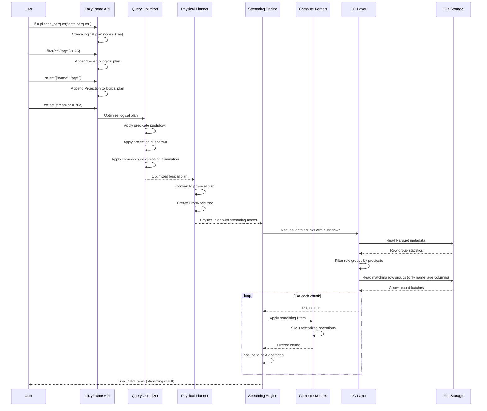
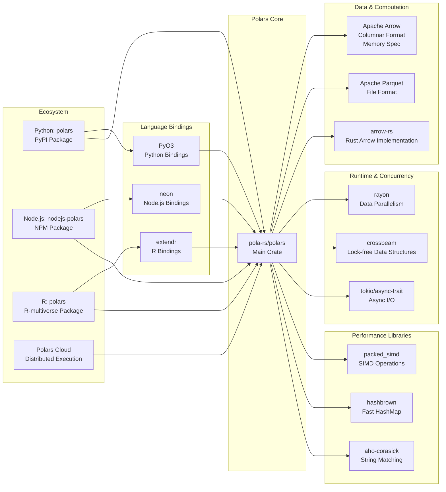

# Polars

> Extremely fast Query Engine for DataFrames, written in Rust

| Metadata | |
|---|---|
| Repository | https://github.com/pola-rs/polars |
| License | MIT |
| Primary Language | Rust |
| Category | Data Processing |
| Analyzed Release | `py-1.38.1` (2026-02-06) |
| Stars (approx.) | 37,000+ |
| Generated by | Claude Opus 4.6 (Anthropic) |
| Generated on | 2026-02-08 |

## Overview

Polars is an analytical query engine written in Rust for processing DataFrames with exceptional performance. It applies decades of database research to DataFrame operations, bringing sophisticated query optimization techniques, columnar processing, and other database innovations directly to the data processing ecosystem.

Problems it solves:

- Processing larger-than-RAM datasets efficiently through streaming execution without distributed infrastructure
- Slow data processing in traditional DataFrame libraries (5-20x faster than pandas)
- Inefficient memory usage through columnar storage based on Apache Arrow format
- Complex query optimization through lazy evaluation and automatic query planning
- Multi-language data processing needs through unified Rust core with Python, R, Node.js, and SQL frontends

Positioning:

Unlike many DataFrame libraries that evolved organically from array manipulation libraries (pandas is built on NumPy), Polars was designed from the ground up as a database-inspired query engine. It positions itself as a modern alternative that combines ease of use with database-grade performance, suitable for both local analysis and large-scale data processing. Polars is one of the best performing solutions available, as shown in PDS-H benchmarks.

## Architecture Overview

Polars employs a layered architecture separating logical query representation from physical execution. The core is built around Apache Arrow's columnar format, with specialized crates handling different aspects: core data structures (polars-core), lazy evaluation and query planning (polars-plan), multiple execution engines (polars-mem-engine for eager execution, polars-stream for streaming), and I/O operations (polars-io).

```mermaid
graph TB
    subgraph Frontends["Language Frontends"]
        Python["Python (PyO3)<br/>py-polars"]
        Rust["Rust API<br/>polars crate"]
        NodeJS["Node.js<br/>nodejs-polars"]
        R["R Language<br/>r-polars"]
        SQL["SQL Layer<br/>polars-sql"]
    end

    subgraph Planning["Query Planning Layer"]
        DSL["DSL (polars-plan/dsl)<br/>LazyFrame API"]
        LogicalPlan["Logical Plan<br/>polars-plan/plans"]
        Optimizer["Query Optimizer<br/>- Predicate Pushdown<br/>- Projection Pushdown<br/>- Type Coercion<br/>- CSE Elimination"]
        PhysicalPlan["Physical Plan<br/>PhysNode/PhysNodeKind"]
    end

    subgraph Core["Core Data Layer"]
        Schema["Schema<br/>polars-schema"]
        DataFrame["DataFrame"]
        Series["Series"]
        ChunkedArray["ChunkedArray<T><br/>polars-core"]
        Arrow["Arrow Arrays<br/>polars-arrow"]
    end

    subgraph Execution["Execution Engines"]
        MemEngine["Memory Engine<br/>polars-mem-engine<br/>Eager Execution"]
        StreamEngine["Streaming Engine<br/>polars-stream<br/>Pipeline Processing"]
        Expr["Expression Engine<br/>polars-expr"]
    end

    subgraph Compute["Compute Layer"]
        Ops["Operations<br/>polars-ops"]
        Compute["Compute Kernels<br/>polars-compute<br/>SIMD Vectorization"]
        Time["Temporal Ops<br/>polars-time"]
    end

    subgraph IO["I/O Layer"]
        IO["polars-io<br/>- CSV/JSON<br/>- Parquet<br/>- Cloud Storage"]
        Parquet["Parquet Engine<br/>polars-parquet"]
        JSON["JSON Parser<br/>polars-json"]
    end

    subgraph Storage["Storage Format"]
        Buffer["Memory Buffer<br/>polars-buffer"]
        ArrowFormat["Apache Arrow<br/>Columnar Format"]
    end

    Python --> DSL
    Rust --> DSL
    NodeJS --> DSL
    R --> DSL
    SQL --> DSL

    DSL --> LogicalPlan
    LogicalPlan --> Optimizer
    Optimizer --> PhysicalPlan

    PhysicalPlan --> MemEngine
    PhysicalPlan --> StreamEngine

    MemEngine --> Expr
    StreamEngine --> Expr
    Expr --> Ops
    Ops --> Compute

    DataFrame --> Series
    Series --> ChunkedArray
    ChunkedArray --> Arrow
    Arrow --> Buffer
    Buffer --> ArrowFormat

    Compute --> Arrow
    Time --> Compute

    IO --> Parquet
    IO --> JSON
    IO --> ArrowFormat

    MemEngine --> DataFrame
    StreamEngine --> DataFrame
```

## Core Components

### Core Data Structures (`crates/polars-core`)

- Responsibility: Fundamental data structures representing tabular data
- Key files: `crates/polars-core/src/frame/`, `crates/polars-core/src/series/`, `crates/polars-core/src/chunked_array/`
- Design patterns: Type erasure (Series wraps ChunkedArray), Builder pattern, Iterator pattern

The core data structures are DataFrame, Series, and ChunkedArray<T>. A DataFrame is a two-dimensional data structure backed by a Series vector and can be seen as an abstraction on Vec<Series>. Series provides type erasure over ChunkedArray<T> without the generic parameter T, enabling uniform column operations. ChunkedArray<T> are wrappers around Arrow arrays that can contain multiple chunks (Vec<dyn ArrowArray>), providing the root data structure for all operations. This design enables zero-copy data layout and efficient memory management through Apache Arrow's columnar format.

### Query Planning and Optimization (`crates/polars-plan`)

- Responsibility: Transforming high-level queries into optimized execution plans
- Key files: `crates/polars-plan/src/plans/`, `crates/polars-plan/src/dsl/`
- Design patterns: Visitor pattern (plan traversal), Strategy pattern (optimization rules), Builder pattern (plan construction)

The LazyFrame represents a logical execution plan that is not executed until collect() is called. The query optimizer traverses the logical plan to apply transformations such as predicate pushdown (applying filters as early as possible while reading data), projection pushdown (selecting only needed columns), type coercion, and common subexpression elimination. Following optimization, the query planner transforms the logical plan into a physical plan using PhysNode (containing output schema and PhysNodeKind operation) with approximately 40 variants representing operations like Filter, Select, GroupBy, EquiJoin, MultiScan, and InMemorySink.

### Streaming Engine (`crates/polars-stream`)

- Responsibility: Processing larger-than-RAM datasets through pipeline execution
- Key files: `crates/polars-stream/src/`
- Design patterns: Pipeline pattern, Producer-consumer pattern, Fallback pattern

From version 1.31.1, Polars features a new streaming engine that processes data in a pipelined, chunk-by-chunk manner, drastically reducing memory requirements. The streaming engine analyzes expressions for properties like input independence, element-wise operations, and length preservation. Based on these properties, operations are either kept as streaming operations, converted to Reduce for aggregations, or wrapped in InMemoryMap for unsupported operations. A critical design pattern is the fallback to the memory engine when operations cannot be streamed, ensuring compatibility while maintaining streaming performance where possible.

### Memory Engine (`crates/polars-mem-engine`)

- Responsibility: Eager execution of query plans with full materialization
- Key files: `crates/polars-mem-engine/src/`
- Design patterns: Eager evaluation, Rayon-based parallelism

The memory engine executes operations immediately, materializing results into in-memory DataFrames. It leverages Rayon for parallel execution across CPU cores and provides the traditional eager execution model where operations execute as they are called. This engine is used for eager DataFrames and as a fallback for the streaming engine when operations lack streaming implementations.

### Expression Engine (`crates/polars-expr`)

- Responsibility: Evaluating complex column expressions
- Key files: `crates/polars-expr/src/`
- Design patterns: Expression tree pattern, Visitor pattern

The expression engine provides a powerful API for transforming and combining columns. Operations like when/then/otherwise are implemented as branchless, SIMD-vectorized code. The engine supports complex expressions including aggregations, window functions, and custom user-defined functions through PyO3 extensions.

### Compute Kernels (`crates/polars-compute`)

- Responsibility: Low-level vectorized operations on Arrow arrays
- Key files: `crates/polars-compute/src/`, subdirectories for specific operations
- Design patterns: SIMD vectorization, Cache-friendly algorithms

This layer implements high-performance operations using SIMD (Single Instruction, Multiple Data) to process multiple elements simultaneously. Operations include arithmetic, comparisons, filtering, gathering, rolling windows, and unique operations. For boolean operations, efficient bitmask operations process 64+ elements at a time. The columnar format enables cache-coherent algorithms by storing data of the same type contiguously in memory.

### I/O Layer (`crates/polars-io`)

- Responsibility: Reading and writing various file formats with optimization
- Key files: `crates/polars-io/src/`, `crates/polars-parquet/`, `crates/polars-json/`
- Design patterns: Strategy pattern (format-specific readers), Streaming I/O, Lazy scanning

Polars supports CSV, JSON (including NDJSON), Parquet, Avro, Excel, Feather, Arrow IPC, and cloud storage (S3, Azure Blob, Azure File). The I/O layer integrates with the query optimizer to apply predicate and projection pushdown directly during file scanning, significantly reducing data transfer. For Parquet files, the reader first fetches metadata to determine which row groups match predicates, avoiding unnecessary I/O. Lazy scanning with scan_csv and scan_parquet defers actual reading until necessary.

## Data Flow

### Lazy Query Execution with Streaming



## Key Design Decisions

### 1. Apache Arrow Columnar Format as Foundation

- Choice: Building on Apache Arrow's columnar memory specification rather than row-based or custom formats
- Rationale: Columnar format stores data of the same type contiguously, enabling SIMD vectorized operations, minimizing memory usage through efficient compression, and providing zero-copy interoperability with other Arrow-based systems. Cache-friendly sequential memory access significantly improves performance on modern CPUs
- Trade-offs: Columnar format excels at analytical workloads (aggregations, filters on subsets of columns) but is less efficient for row-wise operations or transactional workloads. Memory overhead from chunked structure when dealing with many small arrays

### 2. Lazy Evaluation with Query Optimization

- Choice: Implementing a lazy API as the primary interface where operations build a logical plan that is optimized before execution
- Rationale: Allows Polars to analyze the entire query before execution, enabling sophisticated optimizations like predicate pushdown (applying filters during file reading), projection pushdown (reading only needed columns), operation reordering, and elimination of redundant work. Database-inspired approach brings decades of research to DataFrame operations
- Trade-offs: Added complexity in API (users must call collect()), potential confusion for users expecting eager evaluation, debugging difficulty as errors appear at collect() time. However, eager API is also available for interactive use

### 3. Rust with PyO3 for Multi-Language Support

- Choice: Writing core engine in Rust with PyO3 bindings for Python, similar bindings for Node.js and R
- Rationale: Rust provides C/C++-level performance with memory safety guarantees, eliminating entire classes of bugs. PyO3 enables zero-copy data sharing between Rust and Python, avoiding serialization overhead. Single codebase (Rust core) ensures consistent behavior across all language frontends while maintaining native performance
- Trade-offs: Rust's steep learning curve limits contributor base compared to Python-only projects. Compilation times are longer. Users must understand binding mechanisms when extending with custom functions, though pyo3-polars helper crate simplifies this

### 4. Dual Execution Engine Architecture

- Choice: Maintaining both memory engine (eager, full materialization) and streaming engine (pipelined, chunk-by-chunk processing)
- Rationale: Memory engine provides fast execution for datasets that fit in RAM and serves as fallback for operations lacking streaming implementations. Streaming engine enables processing larger-than-RAM datasets without distributed infrastructure by reducing memory footprint through pipelining. Seamless fallback ensures all operations work regardless of engine choice
- Trade-offs: Maintaining two execution engines increases codebase complexity. Not all operations have streaming implementations yet, causing automatic fallbacks that may confuse users monitoring memory usage. Need to carefully decide which operations justify streaming implementation effort

### 5. SIMD Vectorization Throughout Compute Layer

- Choice: Extensive use of SIMD instructions for low-level operations on arrays
- Rationale: Modern CPUs can process multiple data elements with single instructions. Operations like when/then/otherwise and filters are implemented as branchless SIMD-vectorized code, processing 64+ elements simultaneously. Columnar format naturally aligns with SIMD as same-type data is contiguous. Provides 30x+ performance gains over traditional row-based processing
- Trade-offs: Requires careful attention to CPU capabilities (AVX2 support), necessitating separate builds (rtcompat for older CPUs). Code complexity increases with SIMD intrinsics. Performance gains are workload-dependent, most beneficial for operations on large arrays

### 6. Expression Plugin System via PyO3

- Choice: Allowing users to write custom expressions in Rust, compiled and called from Python
- Rationale: Enables extending Polars with domain-specific operations while maintaining native performance. pyo3-polars crate simplifies creating plugins by exposing DataFrame and Series PyO3 extensions. Users can write Rust UDFs that integrate seamlessly with Polars' expression API and benefit from query optimization
- Trade-offs: Requires users to learn Rust for custom extensions, limiting accessibility. Compilation step adds friction compared to pure Python UDFs. Documentation and examples needed to make plugin development approachable

## Dependencies



## Testing Strategy

Polars employs comprehensive testing across multiple dimensions.

Unit tests: Each crate contains extensive unit tests in Rust using the standard test framework. Tests cover individual operations on ChunkedArray, Series, and DataFrame. Test data often uses small synthetic datasets to verify correctness of operations.

Integration tests: Cross-crate integration tests ensure components work together correctly. Tests verify end-to-end query execution, including plan optimization, physical execution, and result correctness. Golden file pattern is used for comparing expected outputs.

Python tests: The py-polars package contains extensive Python test suites using pytest, testing the Python API surface and verifying binding correctness. Tests compare results with pandas where applicable to ensure compatibility.

Performance benchmarks: Polars participates in PDS-H benchmarks comparing performance against pandas, DuckDB, and other DataFrame libraries. Continuous benchmarking tracks performance regressions.

CI/CD: GitHub Actions workflows run tests across multiple platforms (Linux, macOS, Windows) and Rust toolchain versions. Separate workflows handle Python, Node.js, and R bindings. Maturin is used to build Python wheels. Automated releases publish packages to crates.io, PyPI, NPM, and R-multiverse.

## Key Takeaways

1. Columnar format enables SIMD: Storing same-type data contiguously unlocks massive parallelism through SIMD instructions. This architectural choice—borrowed from database systems—is foundational to Polars' performance. Applicable to any system processing large volumes of structured data.

2. Lazy evaluation amplifies optimization opportunities: By deferring execution until collect(), Polars can analyze entire queries holistically and apply optimizations impossible with eager evaluation. The pattern of building declarative query plans enables sophisticated rewrites like pushing predicates into file readers. Broadly applicable to any computation framework.

3. Multi-engine architecture balances flexibility and performance: Maintaining both memory and streaming engines allows users to choose optimal execution strategy without changing code. Automatic fallback from streaming to memory engine ensures correctness while maximizing streaming usage. Pattern applicable to systems needing to handle both in-memory and out-of-core workloads.

4. Zero-copy bindings maximize cross-language performance: PyO3's ability to share Arrow memory between Rust and Python eliminates serialization overhead that plagues many language bridges. Combined with Rust core, provides Python's usability with C++ performance. Pattern applicable whenever combining high-level scripting languages with low-level system languages.

5. Type erasure enables uniform interfaces over generic types: Series wrapping ChunkedArray<T> provides uniform column operations without exposing generic type parameters. Enables DataFrame to store heterogeneous columns as Vec<Series> while maintaining type safety at lower levels. Fundamental pattern for building type-safe yet flexible APIs.

6. Query optimization pushdown minimizes I/O: Applying filters and projections during file scanning rather than after loading dramatically reduces data transfer and memory usage. Parquet's row group statistics enable skipping entire chunks without reading. Critical optimization for any system processing large files, especially from cloud storage where I/O is expensive.

7. Workload-specific engines outperform general solutions: Polars' focus on analytical queries (aggregations, filters, joins) over columnar data allows specialization that general-purpose engines cannot match. Explicitly not targeting transactional workloads enables optimizations that would conflict with other use cases. Demonstrates value of focused problem scope.

## References

- [Polars Official Documentation](https://docs.pola.rs/)
- [Polars GitHub Repository](https://github.com/pola-rs/polars)
- [Polars: A bird's eye view](https://pola.rs/posts/polars_birds_eye_view/)
- [The power of predicate pushdown](https://pola.rs/posts/predicate-pushdown-query-optimizer/)
- [I wrote one of the fastest DataFrame libraries](https://pola.rs/posts/i-wrote-one-of-the-fastest-dataframe-libraries/)
- [Apache Arrow Columnar Format](https://arrow.apache.org/docs/format/Columnar.html)
- [Lazy API - Polars user guide](https://docs.pola.rs/user-guide/concepts/lazy-api/)
- [Query plan - Polars user guide](https://docs.pola.rs/user-guide/lazy/query-plan/)
- [Streaming - Polars user guide](https://docs.pola.rs/user-guide/concepts/streaming/)
- [ChunkedArray Rust Documentation](https://docs.rs/polars/latest/polars/chunked_array/struct.ChunkedArray.html)
- [Python Data Processing 2026: Deep Dive into Pandas, Polars, and DuckDB](https://dev.to/dataformathub/python-data-processing-2026-deep-dive-into-pandas-polars-and-duckdb-2c1)
- [Under the Hood: What Makes Polars So Scalable and Fast?](https://endjin.com/blog/2026/01/under-the-hood-what-makes-polars-so-scalable-and-fast)
- [PyO3: Rust bindings for Python](https://github.com/PyO3/pyo3)
- [pyo3-polars: Plugins for Polars](https://github.com/pola-rs/pyo3-polars)
- [I/O Operations with Polars: Tips and Tricks](https://yusuf-jkhan1.medium.com/i-o-operations-with-polars-tips-and-tricks-7dc8946d573f)
