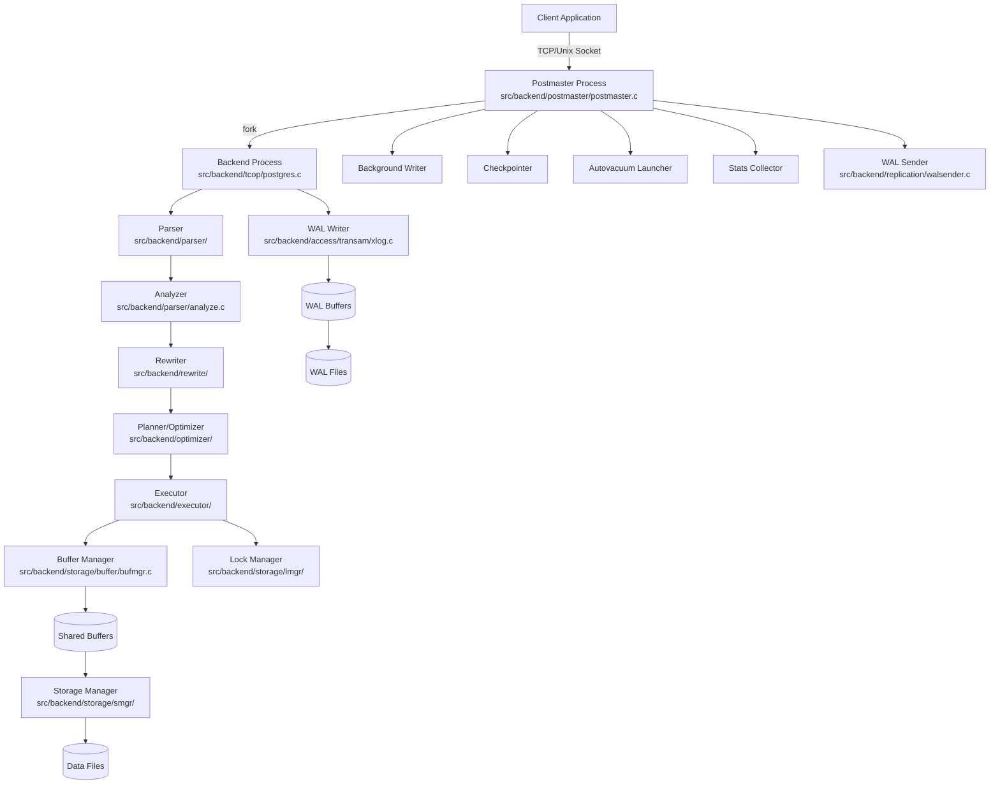
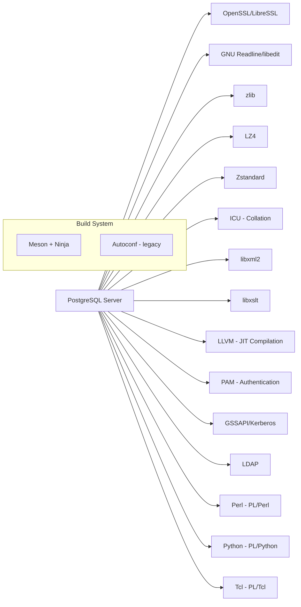

# PostgreSQL

> The world's most advanced open source relational database management system.

| Metadata | |
|---|---|
| Repository | https://github.com/postgres/postgres |
| License | PostgreSQL License (permissive, BSD-like) |
| Primary Language | C |
| Category | Database |
| Analyzed Release | `19devel` (HEAD, 2026-02-08) |
| Stars (approx.) | 19,873 |
| Generated by | Claude Opus 4.6 (Anthropic) |
| Generated on | 2026-02-08 |

## Overview

PostgreSQL is a powerful, open source object-relational database system that has earned a strong reputation for reliability, feature robustness, and performance over more than 35 years of active development. It uses a process-per-connection architecture where the postmaster daemon forks a dedicated backend process for each client connection, with shared memory segments providing inter-process communication for buffer management and lock coordination. The current development branch (19devel) continues to build on PostgreSQL 18, which was released in September 2025.

Problems it solves:
- Provides a full-featured SQL-compliant relational database with ACID transactions, MVCC concurrency, and extensible type system
- Enables complex analytical and transactional workloads through a sophisticated cost-based query optimizer with support for parallel query execution
- Offers enterprise-grade reliability with Write-Ahead Logging (WAL), point-in-time recovery, and streaming/logical replication

Positioning:
PostgreSQL is the leading open source relational database, competing with commercial systems like Oracle and SQL Server while offering comparable or superior features. It serves as the foundation for numerous cloud database offerings (Amazon RDS/Aurora, Google Cloud SQL, Azure Database for PostgreSQL) and derivative databases (Citus, TimescaleDB, YugabyteDB). Its extensibility model has made it a platform for specialized data workloads including geospatial (PostGIS), time-series, and vector search.

## Architecture Overview

PostgreSQL follows a multi-process architecture where a single postmaster process manages a pool of backend processes, each handling one client connection. All processes communicate through shared memory segments that contain the buffer pool, WAL buffers, lock tables, and process state arrays. The query processing pipeline follows a classic parse-analyze-rewrite-plan-execute flow, with a cost-based optimizer that generates execution plans using the Volcano/iterator model.



## Core Components

### Postmaster (`src/backend/postmaster/postmaster.c`)
- Responsibility: The main supervisory daemon process that listens for incoming connections, manages shared memory initialization, and forks backend processes.
- Key files: `postmaster.c`, `backend_startup.c`, `fork_process.c`
- Design patterns: Process-per-connection model with shared memory IPC; supervisor pattern for crash recovery.

The postmaster creates shared memory and semaphore pools during startup but avoids touching them directly during normal operation. When a client connects, it forks a new backend process, and if any backend crashes, the postmaster can reset shared memory and restart all backends. This isolation strategy makes the postmaster extremely resilient.

### Traffic Cop / Backend Process (`src/backend/tcop/`)
- Responsibility: The main loop for each backend process, receiving queries from clients, dispatching them through the query processing pipeline, and returning results.
- Key files: `postgres.c` (main backend loop), `pquery.c` (portal query execution), `utility.c` (utility command dispatch), `fastpath.c`
- Design patterns: State machine for protocol handling; the "traffic cop" metaphor routes queries to the appropriate subsystem.

The file `postgres.c` is described as the "main module of the postgres backend" and implements the core message loop that reads client requests, invokes the parser/planner/executor pipeline, and sends results back. It handles both simple and extended query protocols.

### Parser and Analyzer (`src/backend/parser/`)
- Responsibility: Converts raw SQL text into parse trees and then performs semantic analysis to produce query trees with resolved table/column references.
- Key files: `scan.l` (lexer), `gram.y` (Yacc grammar), `analyze.c` (semantic analysis), `parse_relation.c`, `parse_expr.c`, `parse_target.c`
- Design patterns: Two-phase parsing: first a raw parse tree from the grammar, then semantic transformation into a Query node structure.

The parser uses a standard flex/bison (lex/yacc) combination. The grammar file `gram.y` is one of the largest yacc grammars in existence, reflecting the full SQL standard plus PostgreSQL extensions. The analyzer resolves names, checks types, and transforms the raw parse tree into an internal Query representation.

### Query Optimizer (`src/backend/optimizer/`)
- Responsibility: Transforms a query tree into an optimal execution plan by considering different join orders, access methods, and parallelism opportunities.
- Key files: `optimizer/plan/planner.c` (entry point), `optimizer/path/allpaths.c` (access path generation), `optimizer/path/joinpath.c`, `optimizer/path/costsize.c` (cost estimation), `optimizer/geqo/` (genetic query optimizer for large joins)
- Design patterns: Cost-based optimization with a two-phase approach: first generate all possible access paths, then select the cheapest plan. Uses dynamic programming for join ordering, with GEQO (Genetic Query Optimizer) as fallback for queries involving many tables.

The optimizer maintains statistics in `pg_statistic` and uses them to estimate row counts and operation costs. It supports parallel query planning through `create_gather_paths()` and can push down operations to parallel workers.

### Executor (`src/backend/executor/`)
- Responsibility: Executes query plans using the Volcano/iterator model where each plan node implements open/next/close methods.
- Key files: `execMain.c` (entry point), `execProcnode.c` (node dispatch), `nodeSeqscan.c`, `nodeIndexscan.c`, `nodeHashjoin.c`, `nodeAgg.c`, `nodeSort.c`, `execParallel.c`
- Design patterns: Volcano/iterator model (pull-based, one-tuple-at-a-time); each node type in `node*.c` implements `ExecInit`, `Exec`, and `ExecEnd` functions.

The executor supports a wide variety of scan types (sequential, index, bitmap), join methods (nested loop, hash, merge), and aggregation strategies. Parallel query execution is coordinated through `execParallel.c`, which sets up shared memory and launches parallel workers.

### Storage Engine (`src/backend/storage/` and `src/backend/access/`)
- Responsibility: Manages physical data storage including the buffer pool, lock management, WAL, and table/index access methods.
- Key files: `storage/buffer/bufmgr.c` (shared buffer management), `storage/lmgr/lock.c` (lock manager), `access/heap/heapam.c` (heap access method), `access/nbtree/` (B-tree index), `access/transam/xlog.c` (WAL)
- Design patterns: Page-oriented storage with 8KB default page size; MVCC through tuple versioning with xmin/xmax transaction IDs; WAL for crash recovery using LSN-based ordering.

The buffer manager implements a clock-sweep replacement algorithm for the shared buffer pool. The heap access method stores tuples with visibility information (xmin, xmax, hint bits) enabling MVCC. The WAL subsystem ensures durability by writing change records before data pages are modified.

### Replication (`src/backend/replication/`)
- Responsibility: Provides both physical (streaming) and logical replication capabilities.
- Key files: `walsender.c`, `walreceiver.c`, `logical/logicalfuncs.c`, `logical/decode.c`, `slot.c`
- Design patterns: Streaming replication sends WAL records to standby servers; logical replication decodes WAL into logical change events using output plugins.

PostgreSQL supports synchronous and asynchronous streaming replication, logical replication with publication/subscription model, and replication slots to prevent WAL recycling before standby servers have consumed the records.

## Data Flow

### Query Execution (SELECT statement)

```mermaid
sequenceDiagram
    participant C as Client
    participant PM as Postmaster
    participant BE as Backend (postgres.c)
    participant P as Parser
    participant A as Analyzer
    participant RW as Rewriter
    participant OPT as Optimizer
    participant EX as Executor
    participant BM as Buffer Manager
    participant DISK as Storage (Heap/Index)

    C->>PM: Connection request
    PM->>BE: fork() new backend
    BE-->>C: Authentication OK

    C->>BE: SQL Query (e.g., SELECT)
    BE->>P: raw_parser(query_string)
    P-->>BE: Raw Parse Tree
    BE->>A: parse_analyze(raw_tree)
    A-->>BE: Query Tree
    BE->>RW: QueryRewrite(query)
    RW-->>BE: Rewritten Query List
    BE->>OPT: planner(query)
    OPT-->>BE: Plan Tree
    BE->>EX: ExecutorStart(plan)

    loop For each tuple
        EX->>BM: ReadBuffer(relation, block)
        BM->>DISK: smgrread() if not cached
        DISK-->>BM: Page data
        BM-->>EX: Buffer (pinned page)
        EX->>EX: HeapTupleSatisfiesMVCC()
        EX-->>C: Send tuple via libpq
    end

    EX->>BE: ExecutorEnd()
    BE-->>C: CommandComplete
```

## Key Design Decisions

### 1. Process-Per-Connection Model
- Choice: Each client connection gets a dedicated OS process via fork(), rather than using threads or an event-driven model.
- Rationale: Process isolation ensures that a crash in one backend does not affect others. The postmaster can recover by resetting shared memory. This model also simplifies the code since each backend has its own address space.
- Trade-offs: Higher memory overhead per connection compared to thread-based designs. Connection pooling (pgbouncer, pgpool) is often needed for high-concurrency workloads. The recent move toward AIO and potential future threading work aims to mitigate this.

### 2. MVCC via Tuple Versioning
- Choice: PostgreSQL implements MVCC by storing multiple physical versions of each row (tuple) with xmin/xmax transaction IDs, rather than using an undo log.
- Rationale: Readers never block writers and vice versa. Each transaction sees a consistent snapshot without acquiring locks. No undo log means simpler crash recovery.
- Trade-offs: Dead tuples accumulate and must be cleaned up by VACUUM. Table bloat can be an issue without proper autovacuum configuration. HOT (Heap Only Tuples) updates mitigate this for updates that do not change indexed columns.

### 3. Write-Ahead Logging (WAL)
- Choice: All modifications are written to a sequential WAL before being applied to data pages, following the WAL protocol where pages cannot be flushed to disk until their corresponding WAL records have been flushed.
- Rationale: Ensures crash recovery by replaying WAL from the last checkpoint. Sequential writes to WAL are much faster than random writes to data files. WAL also serves as the basis for replication.
- Trade-offs: Write amplification (data is written twice: once to WAL, once to data files). Checkpoint frequency tuning is important for recovery time vs. I/O load balance.

### 4. Cost-Based Query Optimizer
- Choice: A sophisticated cost-based optimizer that considers statistics, selectivity estimates, and I/O costs to choose between different access paths and join strategies.
- Rationale: Enables the database to automatically find efficient execution plans for complex queries without manual tuning. The dynamic programming approach finds the optimal join order for moderate numbers of tables.
- Trade-offs: Optimizer overhead for simple queries (mitigated by plan caching for prepared statements). The GEQO genetic algorithm is used as a heuristic when the number of tables exceeds `geqo_threshold` (default 12), sacrificing optimality for planning speed.

### 5. Extensibility Through Catalog-Driven Architecture
- Choice: Nearly everything in PostgreSQL is defined through system catalog tables: types, functions, operators, access methods, and even the rules for query rewriting.
- Rationale: New data types, index methods, procedural languages, and foreign data wrappers can be added without modifying the core engine. This has enabled a rich ecosystem of extensions (PostGIS, pg_vector, Citus, TimescaleDB).
- Trade-offs: Catalog lookups add overhead to query processing. The extension API surface is large and sometimes difficult to maintain backward compatibility across major versions.

## Dependencies



## Testing Strategy

PostgreSQL employs a multi-layered testing approach:

- Regression Tests (`src/test/regress/`): The primary test suite consists of SQL scripts that are run against a test database and compared with expected output files. This covers SQL features, data types, functions, and edge cases comprehensively.
- Isolation Tests (`src/test/isolation/`): Test concurrent transaction behavior and isolation levels using a special spec file format that defines multiple sessions and their interleaving.
- TAP Tests (`src/test/`): Perl-based Test Anything Protocol tests for testing client utilities, authentication, recovery, replication, and other server behaviors that cannot be tested through SQL alone.
- Module Tests (`src/test/modules/`): Tests for specific internal modules like injection points, WAL handling, and authentication methods.
- `pg_regress` harness manages test execution, database setup, and output comparison.
- The community also relies heavily on the buildfarm (a distributed CI system) that runs tests across dozens of platforms and configurations.

## Key Takeaways

1. The process-per-connection architecture with shared memory is a defining characteristic that provides exceptional fault isolation and simplicity, though it requires external connection pooling for high-concurrency workloads. PostgreSQL's approach to forking backends has proven remarkably durable over decades.

2. PostgreSQL's catalog-driven extensibility model has been its greatest strategic advantage, enabling a thriving ecosystem of extensions that effectively turn it into a platform rather than just a database. This single design decision is arguably the primary reason for PostgreSQL's dominance in the open source database space.

3. The classic query processing pipeline (parse, analyze, rewrite, plan, execute) with a cost-based optimizer and Volcano-style executor represents a textbook implementation of relational database internals. The GEQO genetic algorithm for large join optimization and the parallel query infrastructure demonstrate ongoing evolution within this proven framework.

## References

- PostgreSQL Official Documentation - Architectural Fundamentals: https://www.postgresql.org/docs/current/tutorial-arch.html
- PostgreSQL Internals Documentation: https://www.postgresql.org/docs/current/internals.html
- The Internals of PostgreSQL by Hironobu Suzuki: https://www.interdb.jp/pg/
- PostgreSQL Source Code: https://github.com/postgres/postgres
- A Tour of PostgreSQL Internals by Tom Lane: https://www.postgresql.org/files/developer/tour.pdf
- How PostgreSQL Works - Internal Architecture: https://blog.algomaster.io/p/postgresql-internal-architecture
- PostgreSQL 18 Release Notes: https://www.postgresql.org/about/news/postgresql-18-released-3142/
