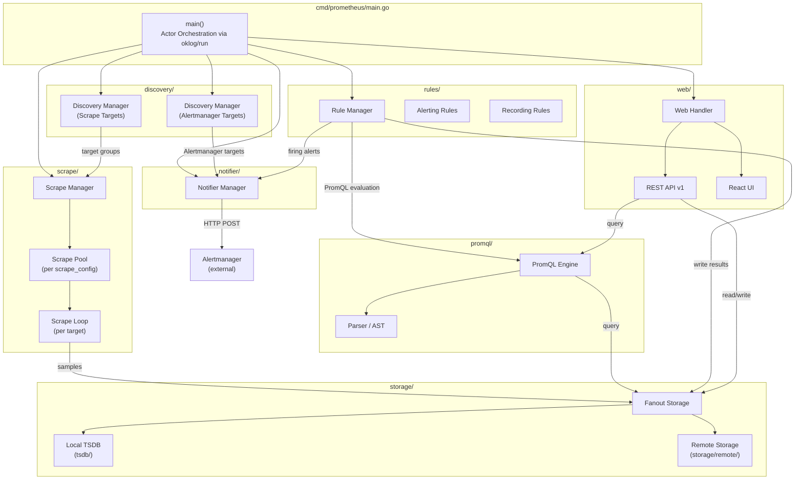
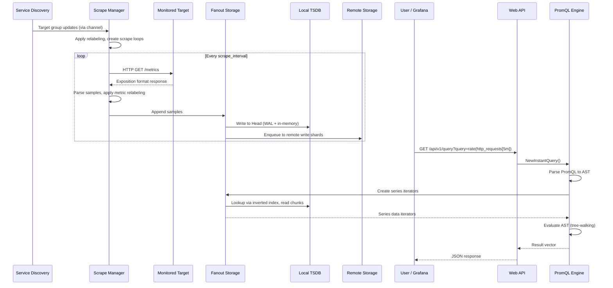
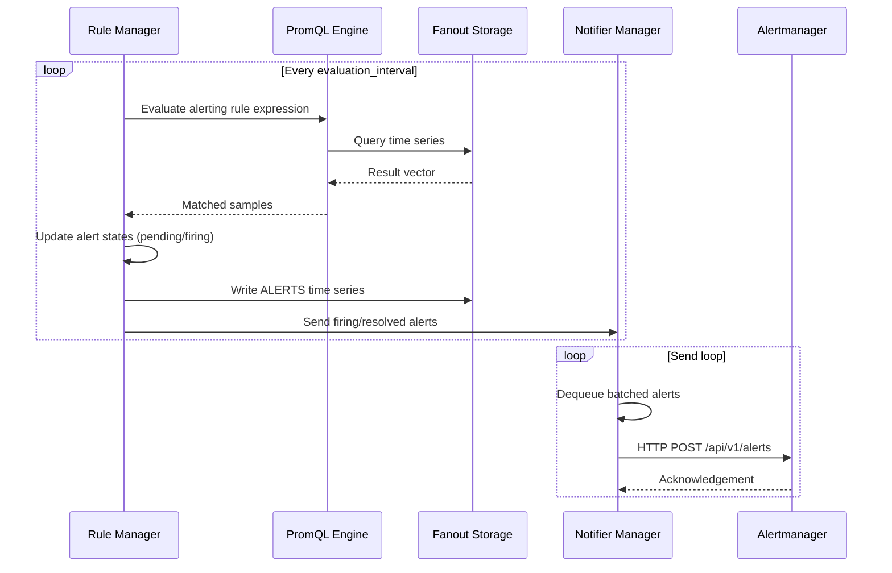
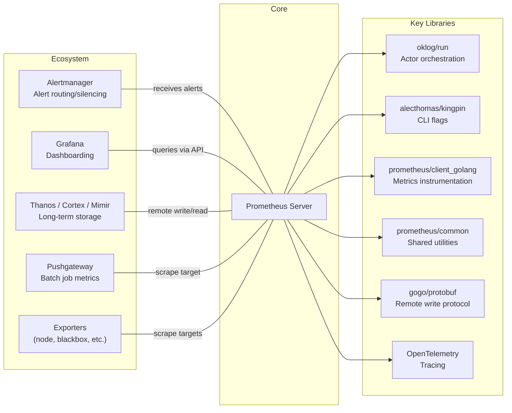

# Prometheus

> The Prometheus monitoring system and time series database

| Metadata | |
|---|---|
| Repository | https://github.com/prometheus/prometheus |
| License | Apache-2.0 |
| Primary Language | Go |
| Category | Monitoring |
| Analyzed Release | `v3.5.1` (2026-01-22) |
| Stars (approx.) | 62,600+ |
| Generated by | Claude Opus 4.6 (Anthropic) |
| Generated on | 2026-02-08 |

## Overview

Prometheus is an open-source systems and service monitoring platform, originally developed at SoundCloud and now graduated from the Cloud Native Computing Foundation (CNCF). It collects metrics from configured targets at defined intervals, evaluates rule expressions, displays results, and triggers alerts when specified conditions are observed. Its embedded time series database (TSDB) is purpose-built for high-throughput metric ingestion, efficient compression (approximately 1.37 bytes per sample), and fast label-based querying.

Problems it solves:

- Collecting and storing multi-dimensional time series data (metric name plus key/value label dimensions) from dynamic cloud-native environments
- Providing a powerful query language (PromQL) for ad-hoc analysis, dashboarding, and alerting on operational metrics
- Discovering monitoring targets automatically via service discovery integrations (Kubernetes, Consul, DNS, EC2, and 20+ more)
- Enabling reliable alerting workflows by separating metric collection from alert notification through integration with Alertmanager

Positioning:

Prometheus is the de facto standard for metrics-based monitoring in the cloud-native ecosystem. It established the pull-based metrics collection model, the multi-dimensional data model, and the PromQL query language that are now widely adopted. Compared to push-based systems like Graphite or InfluxDB, Prometheus favors a pull model for simplicity and reliability, with autonomous single-server nodes requiring no distributed storage dependency. For horizontal scaling and long-term storage, the ecosystem offers Thanos, Cortex, and Mimir as complementary projects built on Prometheus's remote write/read APIs.

## Architecture Overview

Prometheus follows an actor-based concurrency model orchestrated via `oklog/run` in `cmd/prometheus/main.go`. The main function initializes all subsystems--service discovery, scrape manager, TSDB, PromQL engine, rule manager, notifier, and web handler--connecting them through Go channels, shared interfaces, and a fanout storage abstraction that unifies local TSDB and remote storage behind the `storage.Storage` interface.

## Core Components

### TSDB - Time Series Database (`tsdb/`)

- Responsibility: Persistent storage engine for all time series data, handling ingestion, indexing, querying, compaction, and retention
- Key files: `tsdb/db.go`, `tsdb/head.go`, `tsdb/head_append.go`, `tsdb/compact.go`, `tsdb/querier.go`, `tsdb/index/`, `tsdb/chunkenc/`, `tsdb/wlog/`
- Design patterns: Write-Ahead Log (WAL) for crash recovery, LSM-tree-inspired block compaction, inverted index for label-based lookups, Gorilla-style delta-of-delta compression

The TSDB is structured around two main data regions. The Head block (`tsdb/head.go`) holds all recent in-memory data (typically covering the last 2-3 hours). Incoming samples are first written to a Write-Ahead Log (`tsdb/wlog/`) for durability, then appended to in-memory series via `headAppender` in `tsdb/head_append.go`. Each series is stored in a `memSeries` struct that maintains compressed chunks using XOR-based encoding from `tsdb/chunkenc/`. Series are organized in a `stripeSeries` hash map for concurrent access and indexed via `index.MemPostings` (an in-memory inverted index mapping label pairs to series IDs).

When the Head's time range exceeds `MinBlockDuration` (default 2 hours), data is cut into an immutable on-disk block. Each block is a self-contained directory containing a `chunks/` subdirectory with compressed sample data, an `index` file with the inverted index, a `tombstones` file for deletions, and a `meta.json` with block metadata. The `LeveledCompactor` in `tsdb/compact.go` periodically merges smaller blocks into larger ones following exponential size ranges, reducing the number of blocks and improving query performance. Retention is enforced by time (default 15 days) or size limits.

Out-of-order sample ingestion is supported via `tsdb/ooo_head.go`, which maintains a separate Write-Behind Log (WBL) and allows samples that arrive outside the normal append window to be stored correctly.

### PromQL Engine (`promql/`)

- Responsibility: Parsing and evaluating Prometheus Query Language expressions for instant and range queries
- Key files: `promql/engine.go`, `promql/functions.go`, `promql/parser/parse.go`, `promql/parser/ast.go`, `promql/parser/lex.go`
- Design patterns: Tree-walking AST evaluator, lazy iterator-based data retrieval, concurrent query tracking with semaphore-based limits

The PromQL engine operates as a library (not a standalone goroutine) called from the web API handler and the rule manager. Query processing follows a multi-phase pipeline:

1. Parsing: The `promql/parser/` package uses a hand-written lexer (`lex.go`) and a `goyacc`-generated parser (`generated_parser.y.go`) to convert PromQL strings into an Abstract Syntax Tree (AST) defined in `ast.go`.
2. Planning: The engine creates storage iterators for the required time series from the underlying `storage.Queryable` interface.
3. Evaluation: A recursive tree-walking evaluator in `engine.go` processes each AST node. Vector selectors fetch data via series iterators; functions are dispatched through `functions.go` which registers all built-in PromQL functions (rate, histogram_quantile, aggregations, etc.).
4. Result assembly: Results are returned as `promql.Vector`, `promql.Matrix`, or `promql.Scalar` types.

The engine enforces configurable concurrency limits via `ActiveQueryTracker`, query timeouts, and maximum sample counts (`--query.max-samples`) to protect against resource exhaustion. A lookback delta of 5 minutes (configurable) determines staleness behavior.

### Scrape Manager (`scrape/`)

- Responsibility: Periodically scraping HTTP endpoints to collect metric samples and forwarding them to the storage layer
- Key files: `scrape/manager.go`, `scrape/scrape.go`, `scrape/target.go`, `scrape/metrics.go`
- Design patterns: Hierarchical pool/loop architecture, consistent hashing for scrape offset distribution, target relabeling pipeline

The scrape subsystem follows a three-level hierarchy: the `Manager` maintains one `scrapePool` per `scrape_config` section, and each pool runs one `scrapeLoop` per discovered target. The scrape manager receives target group updates from the discovery manager via a synchronization channel, then applies target labels and relabeling rules to produce the final list of targets.

Each `scrapeLoop` periodically performs HTTP GET requests to the target's `/metrics` endpoint, parses the response according to the Prometheus exposition format (text or protobuf), applies metric relabeling rules, and appends the resulting samples to the `storage.Appendable` interface (which routes to the fanout storage). Target scrape timing is deterministically offset within the scrape interval using FNV hashing of the target's label set and URL, ensuring even distribution across time slots. The loop also tracks series staleness, records built-in scrape health metrics (`up`, `scrape_duration_seconds`, `scrape_samples_scraped`), and handles exemplar and native histogram ingestion.

### Service Discovery (`discovery/`)

- Responsibility: Dynamically discovering and updating the list of monitoring targets and Alertmanager instances
- Key files: `discovery/manager.go`, `discovery/discovery.go`, `discovery/registry.go`, plus provider subdirectories (`discovery/kubernetes/`, `discovery/consul/`, `discovery/dns/`, etc.)
- Design patterns: Plugin registry with interface-based extensibility, provider pooling across scrape configs, build-tag-based inclusion/exclusion

The discovery subsystem implements the `Discoverer` interface (`discovery/discovery.go`), which each service discovery provider must satisfy. Providers run as independent goroutines and emit target group updates through channels to the `discovery.Manager`. The manager aggregates updates from all providers and forwards them to consumers (scrape manager and notifier).

Prometheus ships with 20+ built-in discovery providers including Kubernetes (`discovery/kubernetes/`), Consul, DNS, EC2, Azure, GCE, file-based, and HTTP-based. Providers are registered through `discovery/registry.go` and can be selectively included or excluded at build time via Go build tags (e.g., `remove_all_sd`, `enable_kubernetes_sd`). When configuration reloads occur, the discovery manager stops all existing providers and starts new ones as defined in the updated config.

### Fanout Storage (`storage/`)

- Responsibility: Abstracting local and remote storage behind a unified interface, routing writes to all backends and merging reads
- Key files: `storage/interface.go`, `storage/fanout.go`, `storage/merge.go`, `storage/remote/storage.go`, `storage/remote/queue_manager.go`
- Design patterns: Facade pattern over multiple backends, primary/secondary distinction for read reliability, sharded queue-based remote writes

The `storage.Storage` interface (`storage/interface.go`) defines the contract for all storage backends, encompassing `Queryable`, `ChunkQueryable`, `Appendable`, and lifecycle methods. The `fanout` struct in `storage/fanout.go` implements this interface, wrapping a primary storage (local TSDB) and zero or more secondary storages (remote endpoints). For writes, the fanout duplicates samples to all backends. For reads, it merges results using `MergeQuerier` from `storage/merge.go`, treating the primary as authoritative and secondaries as best-effort (secondary errors become warnings rather than failures).

Remote write is handled by `storage/remote/queue_manager.go`, which maintains a dynamic number of write shards per remote endpoint. Shard count adapts based on an Exponentially Weighted Moving Average (EWMA) of throughput metrics, scaling up or down within configurable bounds. Each shard batches and sends samples via HTTP using Protocol Buffers (remote write v1 or v2 format). Remote read clients are created per `remote_read` configuration and their results are merged into query responses.

### Rule Manager (`rules/`)

- Responsibility: Periodically evaluating recording rules and alerting rules, writing derived time series and managing alert lifecycle
- Key files: `rules/manager.go`, `rules/group.go`, `rules/alerting.go`, `rules/recording.go`, `rules/rule.go`
- Design patterns: Group-based evaluation with configurable intervals, PromQL-driven rule evaluation via `QueryFunc`, alert state machine (inactive, pending, firing)

The `rules.Manager` organizes rules into `Group` instances, each containing a set of recording and/or alerting rules that share an evaluation interval. On each evaluation tick, the group calls `Eval()` which iterates over all rules, executing each rule's PromQL expression via the `QueryFunc` (backed by the PromQL engine) and writing results back to storage.

For alerting rules (`rules/alerting.go`), the manager tracks alert state transitions: a newly matched alert enters "pending" state and transitions to "firing" after the configured `for` duration. Firing alerts are sent to the notifier via `SendAlerts()`. The manager writes `ALERTS` and `ALERTS_FOR_STATE` time series for active alerts. Recording rules (`rules/recording.go`) simply store the query result as a new time series with a specified name and labels.

### Notifier (`notifier/`)

- Responsibility: Receiving alerts from the rule manager and reliably forwarding them to configured Alertmanager instances
- Key files: `notifier/manager.go`, `notifier/sendloop.go`, `notifier/alertmanager.go`, `notifier/alertmanagerset.go`
- Design patterns: Decoupled producer-consumer with queue buffering, dynamic Alertmanager discovery, retry with backoff

The `notifier.Manager` decouples alert generation from delivery. Alerts received via `Send()` are enqueued in an in-memory queue. The `sendLoop` goroutine in `notifier/sendloop.go` drains this queue and dispatches batches of alerts to all known Alertmanager instances via HTTP POST. The list of Alertmanager instances is dynamically updated through the notifier discovery manager, allowing Prometheus to adapt as Alertmanager replicas scale up or down.

## Data Flow

### Metric Scraping and Query Execution

### Alert Evaluation and Notification

## Key Design Decisions

### 1. Pull-Based Metrics Collection

- Choice: Prometheus actively scrapes (pulls) metrics from target HTTP endpoints rather than having targets push metrics to a central collector
- Rationale: Pull-based collection simplifies target configuration (targets only need to expose an HTTP endpoint), makes it easy to determine target health (failed scrapes indicate down targets), and allows Prometheus to control the data collection rate. Targets can be run independently without needing to know about the monitoring system.
- Trade-offs: Requires network reachability from Prometheus to all targets, which can be challenging in NAT-heavy or firewall-restricted environments. Short-lived batch jobs that may terminate before being scraped require the Pushgateway as an intermediary. Pull at fixed intervals means sub-second resolution is impractical.

### 2. Embedded Custom TSDB with Block-Based Architecture

- Choice: Prometheus embeds its own custom time series database rather than using an external database system, organizing data in time-partitioned immutable blocks with an in-memory Head for recent data
- Rationale: A purpose-built TSDB optimizes for the specific access patterns of monitoring data: append-heavy writes, time-range-bounded queries, and label-based filtering. The block architecture enables efficient compaction, clean retention enforcement (delete entire blocks), and crash recovery through WAL replay. Gorilla-inspired compression achieves approximately 1.37 bytes per sample.
- Trade-offs: Single-node storage limits horizontal scalability. Long-term storage and high-availability require external solutions (Thanos, Cortex, Mimir) via the remote write/read API. The database is tightly coupled to Prometheus and not designed as a standalone reusable library.

### 3. Multi-Dimensional Data Model with Label-Based Indexing

- Choice: Time series are identified by a metric name plus a set of arbitrary key/value label pairs, indexed via an inverted index
- Rationale: Labels enable powerful ad-hoc grouping, filtering, and aggregation in PromQL without pre-defining hierarchies. The inverted index maps each label pair to matching series, enabling efficient set intersection operations for complex label matchers. This model naturally represents the dimensionality of cloud-native workloads (instance, pod, namespace, etc.).
- Trade-offs: High-cardinality labels (e.g., user IDs, request IDs) can cause series explosion, dramatically increasing memory consumption and index size. Careful label design is required to avoid cardinality bombs.

### 4. Fanout Storage Abstraction

- Choice: A unified `storage.Storage` interface with a fanout implementation that separates local and remote storage concerns
- Rationale: The fanout pattern allows Prometheus to write to local TSDB and remote endpoints simultaneously while presenting a single interface to the query engine and rule manager. Secondary (remote) storage failures are treated as non-critical, ensuring local monitoring reliability is preserved.
- Trade-offs: Remote storage is best-effort on reads; inconsistencies between local and remote data may occur. The abstraction adds a layer of indirection that increases code complexity.

### 5. Actor-Based Concurrency Model with oklog/run

- Choice: All major subsystems (discovery, scrape, rules, notifier, web) run as independent actors coordinated via `oklog/run.Group` in `cmd/prometheus/main.go`
- Rationale: The actor model provides clean lifecycle management--if any component fails, the entire group shuts down orderly. Each actor manages its own goroutines and state, communicating via channels and shared interfaces. Configuration reloads are handled by calling `ApplyConfig()` on each component in sequence.
- Trade-offs: Debugging cross-component interactions requires understanding the channel-based communication patterns. A failure in any single actor triggers full server shutdown, which is intentionally conservative but means partial degradation is not supported.

## Dependencies

## Testing Strategy

Prometheus employs a comprehensive multi-layered testing strategy with extensive test coverage across all subsystems.

Unit tests: Every major package includes thorough unit tests alongside the source files (e.g., `tsdb/db_test.go`, `promql/engine_test.go`, `scrape/scrape_test.go`). The TSDB has dedicated benchmark tests (`tsdb/head_bench_test.go`, `tsdb/querier_bench_test.go`) for performance-critical paths. The PromQL package includes a custom testing framework (`promql/promqltest/`) that allows writing declarative test cases for query behavior using a domain-specific test syntax.

Integration tests: Integration testing is achieved through test helpers (`web/api/testhelpers/`) and end-to-end test scenarios. The `cmd/promtool` binary provides a testing command that validates rule files and runs PromQL test suites. Fuzz testing is integrated via `promql/fuzz.go` and is part of the OSS-Fuzz project for continuous fuzzing.

CI/CD: The project uses GitHub Actions (`.github/workflows/ci.yml`) for continuous integration, running tests, linting, and build verification across multiple platforms. The build system uses `promu` (Prometheus utility tool) and Makefiles for cross-compilation and Docker image creation.

## Key Takeaways

1. Interface-driven storage abstraction: The `storage.Storage` interface with its fanout implementation is an excellent example of separating concerns in a monitoring system. By abstracting local and remote storage behind a common interface, Prometheus achieves extensibility (any remote storage backend can be added) without modifying the core query or ingestion paths. This pattern is broadly applicable to any system that needs to support multiple storage backends transparently.

2. Purpose-built data structures for the access pattern: Rather than using a general-purpose database, Prometheus built a custom TSDB optimized for its specific workload: append-only writes, time-bounded range queries, and label-based filtering. The combination of an in-memory Head block, WAL for durability, immutable on-disk blocks, and Gorilla compression delivers exceptional write throughput and storage efficiency. This demonstrates that for performance-critical infrastructure, investing in a domain-specific storage engine can yield order-of-magnitude improvements.

3. Actor-based lifecycle management: The use of `oklog/run.Group` to coordinate all subsystem lifecycles is an elegant approach to managing complex multi-component applications. Each subsystem (discovery, scrape, rules, web) runs independently with clean start/stop semantics, and the group ensures orderly shutdown if any component fails. This pattern is highly reusable for any Go application with multiple long-running concurrent subsystems.

4. Configuration hot-reload architecture: Prometheus cleanly separates immutable flag-based configuration from file-based configuration that supports runtime reloading. Each subsystem implements an `ApplyConfig()` method, and the reload handler iterates through all components in a defined order. This design enables zero-downtime configuration changes for target discovery, scrape settings, alerting rules, and remote storage endpoints--a critical operational requirement for production monitoring.

5. Pluggable service discovery with build-time customization: The discovery subsystem demonstrates an effective plugin architecture: each provider implements the `Discoverer` interface and is registered via a central registry. Go build tags allow operators to strip unused providers at compile time, reducing binary size and attack surface. This pattern balances extensibility with operational control.

## References

- [Prometheus Official Documentation](https://prometheus.io/docs/)
- [Prometheus Internal Architecture (GitHub)](https://github.com/prometheus/prometheus/blob/main/documentation/internal_architecture.md)
- [TSDB README (GitHub)](https://github.com/prometheus/prometheus/blob/main/tsdb/README.md)
- [Prometheus Storage Documentation](https://prometheus.io/docs/prometheus/latest/storage/)
- [Prometheus TSDB Explained (Groundcover)](https://www.groundcover.com/learn/observability/prometheus-tsdb)
- [Prometheus Architecture and TSDB (Palark)](https://palark.com/blog/prometheus-architecture-tsdb/)
- [Service Discovery Internals (GitHub)](https://github.com/prometheus/prometheus/blob/main/discovery/README.md)
- [PromQL Documentation](https://prometheus.io/docs/prometheus/latest/querying/basics/)
