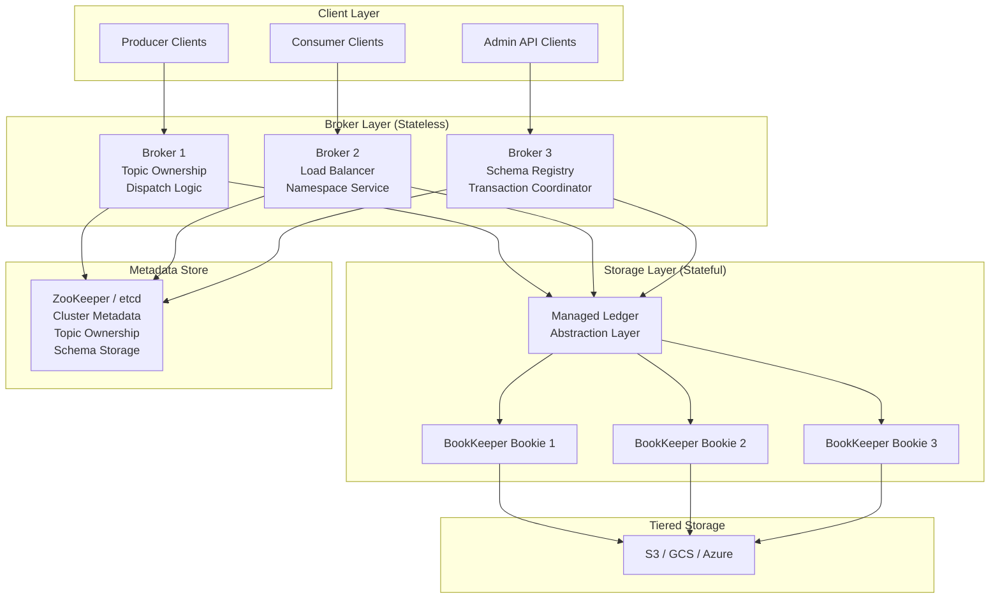
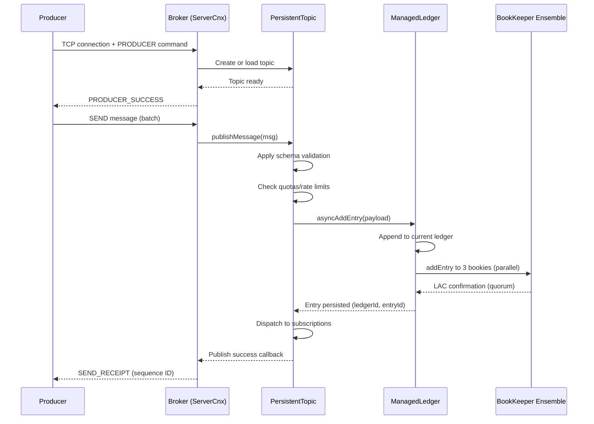
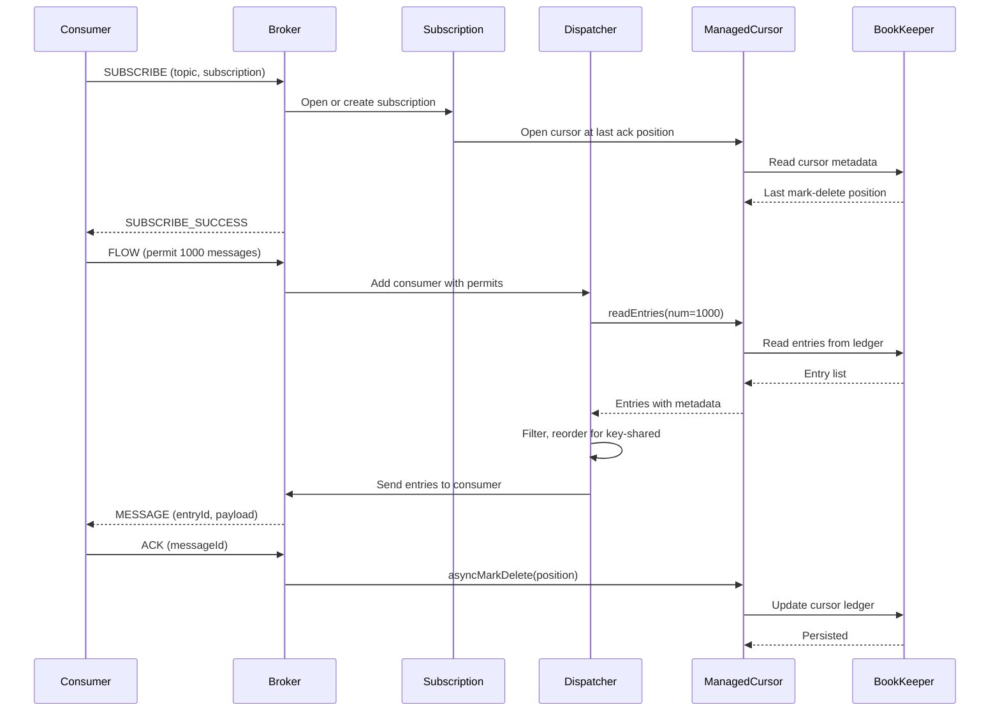
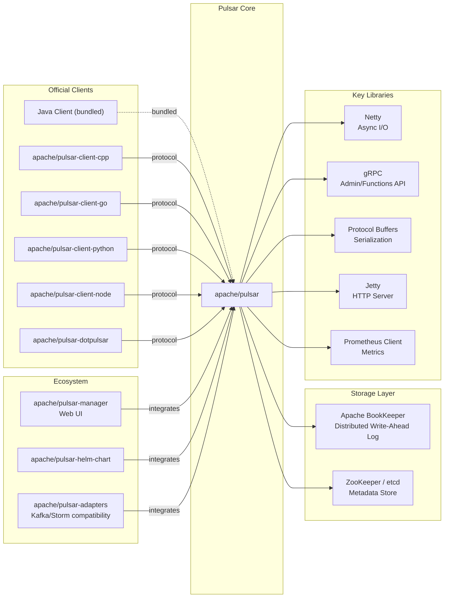

# Apache Pulsar

> A distributed pub-sub messaging platform with multi-tenancy and geo-replication built-in

| Metadata | |
|---|---|
| Repository | https://github.com/apache/pulsar |
| License | Apache-2.0 |
| Primary Language | Java |
| Analyzed Release | `v4.1.2` (2025-11-17) |
| Stars (approx.) | 15,080 |
| Generated by | Claude Sonnet 4.5 (Anthropic) |
| Generated on | 2026-02-08 |

## Overview

Apache Pulsar is a cloud-native, distributed messaging and streaming platform originally created at Yahoo! and now an Apache top-level project. Pulsar uniquely separates compute from storage, utilizing Apache BookKeeper for durable message storage while brokers handle message serving.

Problems it solves:

- Scalable pub-sub messaging that supports millions of independent topics without performance degradation
- Multi-tenancy isolation with separate authentication, authorization, and quotas per tenant
- Geo-replication across multiple data centers with strong consistency guarantees
- Unified platform combining message queuing, streaming, and event streaming use cases
- Durable message storage with low-latency access and tiered storage for cost optimization

Positioning:

Apache Pulsar competes with Apache Kafka in the distributed messaging space but differentiates through its segment-centric storage model (BookKeeper), built-in multi-tenancy, and native geo-replication. Used by companies like Yahoo!, Tencent, Verizon Media, and Splunk. StreamNative provides commercial support.

## Architecture Overview

Pulsar employs a layered architecture separating the serving layer (stateless brokers) from the storage layer (stateful BookKeeper). This design enables independent scaling and simplified operations.

## Core Components

### PulsarService (`pulsar-broker/src/main/java/org/apache/pulsar/broker/PulsarService.java`)

- Responsibility: Main broker lifecycle management and dependency injection container
- Key files: `PulsarService.java` (112KB, 3000+ lines)
- Design patterns: Service Locator, Singleton

PulsarService is the entry point for broker initialization. It coordinates startup of all major subsystems: BrokerService for topic management, NamespaceService for topic lookup, LoadManager for load balancing, ManagedLedgerFactory for storage integration, and WebService for HTTP admin API.

The class uses constructor injection and factory methods to wire dependencies. It manages the broker lifecycle through start(), close(), and shutdown hook registration. Configuration is loaded from ServiceConfiguration with support for dynamic updates.

### BrokerService (`pulsar-broker/src/main/java/org/apache/pulsar/broker/service/BrokerService.java`)

- Responsibility: Topic ownership management and producer/consumer connection handling
- Key files: `BrokerService.java` (210KB), `Topic.java`, `ServerCnx.java` (208KB)
- Design patterns: Factory pattern, Publisher-Subscriber, Command pattern

BrokerService maintains a map of owned topics (persistent and non-persistent) and manages their lifecycle. When producers/consumers connect via the binary protocol (PulsarApi.proto), ServerCnx handles protocol commands and routes them to the appropriate topic.

Topics are lazily loaded on first access and cached in ConcurrentHashMap. The service coordinates with NamespaceService for topic lookup and LoadManager for bundle ownership decisions. It implements backpressure via publish rate limiters and memory quotas.

### ManagedLedger (`managed-ledger/src/main/java/org/apache/bookkeeper/mledger/`)

- Responsibility: Abstraction layer over BookKeeper providing topic-like semantics
- Key files: `ManagedLedgerImpl.java`, `ManagedCursorImpl.java`, `OpAddEntry.java`
- Design patterns: Adapter pattern, Cursor pattern, Write-Ahead Log

ManagedLedger is Pulsar's abstraction that maps topics to multiple BookKeeper ledgers. Each topic is represented as a ManagedLedger, which internally creates a sequence of ledgers as messages are appended. When a ledger reaches size limits, a new ledger (rollover) is automatically created.

ManagedCursor tracks consumer positions within a ManagedLedger. Cursors support individual and batch acknowledgments with persistent state stored in cursor ledgers. The EntryCache provides read-through caching for recent entries.

The OpAddEntry operation implements async batching and parallel writes to BookKeeper. Metadata about ledger sequences and cursor positions is stored in ZooKeeper/etcd.

### NamespaceService (`pulsar-broker/src/main/java/org/apache/pulsar/broker/namespace/NamespaceService.java`)

- Responsibility: Topic lookup and namespace bundle assignment to brokers
- Key files: `NamespaceService.java`, `OwnershipCache.java`, `NamespaceBundle.java`
- Design patterns: Consistent hashing, Cache-aside pattern

Namespaces are divided into bundles (hash ranges of topic names), and each bundle is assigned to exactly one broker at a time. NamespaceService resolves topic lookups by hashing the topic name, determining the bundle, and returning the owning broker.

The OwnershipCache maintains local state of bundle ownership with ZooKeeper as the source of truth. When a broker acquires a bundle, it creates an ephemeral node in ZooKeeper. Bundle splits occur when a bundle grows too large, redistributing topics across new bundles.

### Client Protocol (`pulsar-common/src/main/proto/PulsarApi.proto`)

- Responsibility: Binary protocol definition for producer/consumer communication
- Key files: `PulsarApi.proto`, `ClientCnx.java`, `ProducerImpl.java`, `ConsumerImpl.java`
- Design patterns: Protocol Buffers, Async I/O (Netty)

Pulsar uses Protocol Buffers for serialization with a custom framing protocol over TCP. The protocol supports commands like PRODUCER, SEND, SUBSCRIBE, FLOW (backpressure), ACK, and SEEK. Messages include metadata (sequence ID, publish time, schema) and payload.

ClientCnx manages the connection lifecycle with automatic reconnection and broker redirection handling. The client maintains separate connections for each topic to maximize parallelism. Batching and chunking are handled transparently.

### Functions Runtime (`pulsar-functions/`)

- Responsibility: Serverless compute framework for stream processing
- Key files: `pulsar-functions/runtime/`, `FunctionRuntimeManager.java`
- Design patterns: Process-based isolation, Thread-based isolation, Kubernetes deployment

Pulsar Functions allow users to deploy lightweight compute on topics without external stream processors. Functions can run in-process (threads), out-of-process (separate JVM), or in Kubernetes pods. The runtime manages function lifecycle, metrics collection, and state storage.

## Data Flow

### Message Publishing Flow

### Message Consumption Flow

## Key Design Decisions

### 1. Separation of Compute and Storage

- Choice: Brokers (stateless compute) are separate from BookKeeper (stateful storage)
- Rationale: Independent scaling of serving capacity and storage capacity. Brokers can be added/removed without data rebalancing. Topic ownership can be transferred between brokers without data movement
- Trade-offs: Additional network hops between brokers and bookies increase latency compared to local storage. Requires running two separate distributed systems (Pulsar brokers + BookKeeper cluster)

### 2. Segment-Centric Storage (Managed Ledger)

- Choice: Topics are stored as a sequence of immutable ledgers rather than a single append log
- Rationale: Enables deletion of old ledgers without compaction overhead. Supports tiered storage offload by moving complete ledgers to S3/GCS. Simplifies parallelization during catch-up reads (read from multiple ledgers concurrently)
- Trade-offs: Metadata overhead for tracking ledger sequences. Rollover operations introduce minor write latency spikes. More complex than single-log model

### 3. Multi-Tenancy via Namespace Bundles

- Choice: Hierarchical naming (tenant/namespace/topic) with bundle-based assignment
- Rationale: Enables resource isolation at tenant and namespace levels. Bundle splits allow fine-grained load balancing. Quotas and policies can be applied per namespace
- Trade-offs: Bundle management complexity. Uneven bundle sizes require splits and rebalancing. Namespace hierarchy requires careful capacity planning

### 4. BookKeeper for Durable Storage

- Choice: Using BookKeeper as the storage layer instead of custom storage
- Rationale: BookKeeper provides enterprise-grade durability via quorum writes. Ensemble changes handle bookie failures transparently. Striping across bookies maximizes write throughput. Mature, battle-tested system from Yahoo!
- Trade-offs: BookKeeper adds operational complexity. Write amplification (3x by default for replication). Cannot leverage LSM-tree optimizations common in modern storage engines

### 5. Schema Registry Integration

- Choice: Built-in schema registry with enforced schema evolution
- Rationale: Prevents incompatible schema changes that break consumers. Supports Avro, Protobuf, and JSON schemas. Schema is versioned and stored per topic in ZooKeeper
- Trade-offs: Schema validation adds CPU overhead. Schema storage in ZooKeeper limits scalability for extremely large numbers of topics

## Dependencies

## Testing Strategy

Pulsar employs comprehensive testing across unit, integration, and system levels.

Unit tests: Each module has extensive JUnit tests. MockBookKeeper and MockZooKeeper enable fast unit testing without external dependencies. Test coverage focuses on edge cases like ledger rollover, cursor recovery, and quota enforcement.

Integration tests: The `tests` directory contains integration test modules that spin up embedded ZooKeeper, BookKeeper, and Pulsar clusters. Tests verify end-to-end flows including producer/consumer operations, geo-replication, schema evolution, and failover scenarios.

System tests: Separate test infrastructure repository (apache/pulsar-test-infra) runs large-scale chaos tests and performance benchmarks. Tests use real multi-node clusters with failure injection.

CI/CD: GitHub Actions runs CI pipelines with matrix testing across Java 17/21. Automated builds produce Docker images and binary distributions. Release process includes signature verification and checksum validation.

## Key Takeaways

1. Compute-storage separation: Decoupling stateless serving (brokers) from stateful storage (BookKeeper) enables independent scaling and simplified operations. This architecture pattern is increasingly common in cloud-native systems (e.g., Snowflake, TiDB)

2. Segment-centric storage model: Representing topics as sequences of immutable ledgers rather than a single log simplifies tiered storage, deletion, and parallel reads. Applicable to any log-structured storage system requiring lifecycle management

3. Multi-tenancy as a first-class concept: Hierarchical naming (tenant/namespace/topic) combined with bundle-based load balancing enables secure multi-tenant operation. Resource isolation prevents noisy neighbor problems

4. Cursor abstraction for subscriptions: ManagedCursor provides a clean abstraction for consumer position tracking with persistent state. Supports multiple subscription modes (exclusive, shared, key-shared, failover) without changing storage layer

5. Schema enforcement prevents evolution issues: Built-in schema registry with compatibility checks prevents common production issues from incompatible schema changes. Trade-off between safety and operational overhead

6. Layered protocol design: Separation of concerns between binary protocol (PulsarApi.proto), managed ledger interface, and BookKeeper API enables independent evolution of each layer. Protocol versioning supports backward compatibility

## References

- [Apache Pulsar Official Documentation](https://pulsar.apache.org/docs/)
- [Architecture Overview](https://pulsar.apache.org/docs/4.0.x/concepts-architecture-overview/)
- [Multi-Tenancy](https://pulsar.apache.org/docs/4.0.x/concepts-multi-tenancy/)
- [BookKeeper Documentation](https://bookkeeper.apache.org/docs/latest/overview/)
- [Pulsar GitHub Repository](https://github.com/apache/pulsar)
- [StreamNative Blog - Pulsar Architecture](https://streamnative.io/team/architecture)
