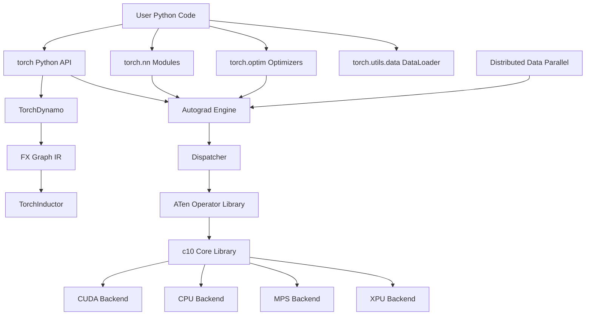
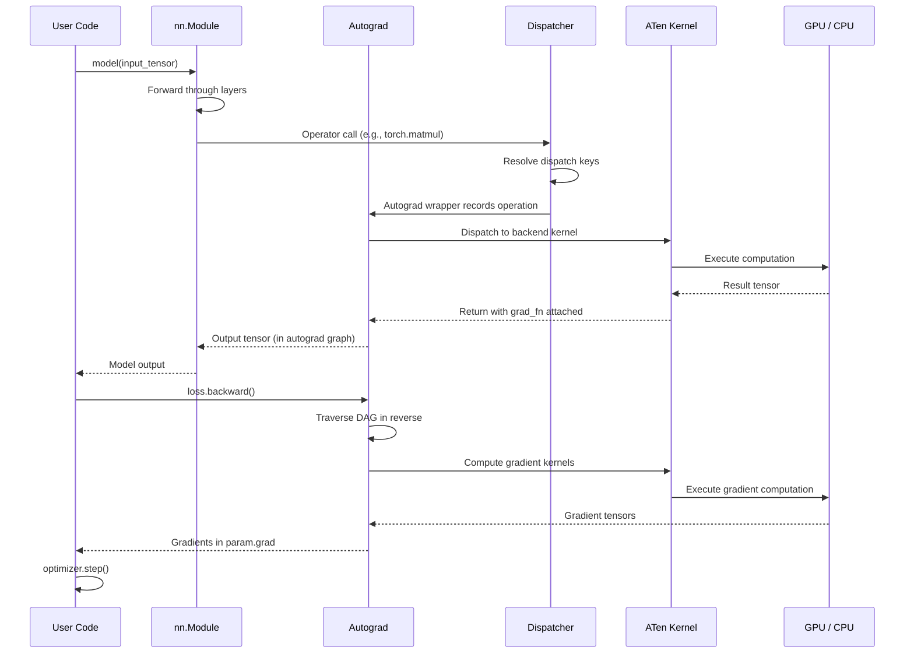
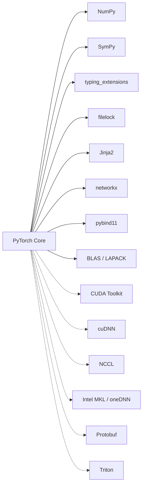

# PyTorch

> Tensors and dynamic neural networks in Python with strong GPU acceleration, providing a flexible deep learning framework with an imperative programming model.

| Metadata | |
|---|---|
| Repository | https://github.com/pytorch/pytorch |
| License | Modified BSD License |
| Primary Language | Python |
| Category | Data Processing |
| Analyzed Release | `v2.10.0` (2026-01-21) |
| Stars (approx.) | 97,000+ |
| Generated by | Claude Opus 4.6 (Anthropic) |
| Generated on | 2026-02-09 |

---

## Overview

### Problem Domain

Deep learning research and production require a framework that can express complex neural network architectures, compute gradients automatically, leverage GPU hardware, and scale from prototyping to deployment. Researchers need flexibility and debuggability; production engineers need performance and portability.

### Project Positioning

PyTorch is a deep learning framework that provides tensor computation with GPU acceleration and automatic differentiation through a tape-based autograd system. Unlike graph-first frameworks (the original TensorFlow), PyTorch uses an eager execution model where operations execute immediately, making debugging and experimentation natural.

PyTorch has become the dominant framework in deep learning research and has expanded into production deployment via TorchScript, torch.compile (TorchDynamo + TorchInductor), and the ONNX ecosystem. It provides a Python-first interface backed by a high-performance C++ core (ATen/c10), supporting CPUs, NVIDIA GPUs (CUDA), AMD GPUs (ROCm), Apple Silicon (MPS), and Intel accelerators (XPU).

---

## Architecture Overview

---

## Core Components

### 1. Tensor and c10 Core Library

Responsibility: Provides the fundamental tensor data structure, storage management, device abstraction, and data type system that underpins all PyTorch operations.

Key Files:
- `c10/core/TensorImpl.h` -- Core tensor implementation (metadata: sizes, strides, dtype, device)
- `c10/core/Storage.h` -- Reference-counted data storage
- `c10/core/Device.h` -- Device abstraction (CPU, CUDA, MPS, XPU)
- `c10/core/ScalarType.h` -- Data type definitions (float32, float16, bfloat16, int64, etc.)
- `c10/core/DispatchKey.h` -- Dispatch key system for operator routing
- `torch/_tensor.py` -- Python Tensor class wrapping C++ TensorImpl
- `torch/__init__.py` -- Top-level Python API: `torch.tensor()`, `torch.zeros()`, `torch.randn()`

Design Patterns:
- Pimpl (Pointer to Implementation): Python Tensor wraps C++ TensorImpl via pybind11
- Copy-on-Write: Storage can be shared between tensors via views
- Type Erasure: TensorImpl stores dtype and device generically; dispatch resolves concrete implementations

Tensor Representation:
- Fixed-layout struct with sizes, strides, storage offset, and storage pointer
- Views (reshape, slice, transpose) share storage with the original tensor
- Metadata allows strided access patterns without copying data

### 2. Autograd Engine

Responsibility: Automatically computes gradients of scalar-valued functions with respect to tensor inputs by recording operations in a directed acyclic graph (DAG) and executing backward passes using the chain rule.

Key Files:
- `torch/autograd/__init__.py` -- Public API: `torch.autograd.backward()`, `torch.autograd.grad()`
- `torch/autograd/function.py` -- Custom autograd Function base class (forward/backward)
- `torch/autograd/graph.py` -- Autograd graph utilities and hooks
- `torch/csrc/autograd/engine.cpp` -- C++ backward pass execution engine
- `torch/csrc/autograd/function.h` -- Node (gradient function) base class
- `torch/csrc/autograd/variable.h` -- Variable/Tensor autograd metadata (AutogradMeta)
- `tools/autograd/derivatives.yaml` -- Derivative formulas for all operators

Design Patterns:
- Tape-Based Recording: Operations are recorded as they execute (no upfront graph construction)
- DAG Traversal: Backward pass topologically sorts the graph and applies chain rule
- Visitor: Gradient functions (Nodes) implement a common interface traversed by the engine

Forward/Backward:
1. During forward: each operation creates a Node with its gradient function and links it to input nodes
2. During backward: the engine traverses nodes in reverse topological order, accumulating gradients
3. Leaf tensors (with `requires_grad=True`) store their accumulated gradients in `.grad`

### 3. Operator Dispatcher

Responsibility: Routes operator calls to the correct kernel implementation based on tensor device, dtype, and active dispatch keys (autograd, autocast, functionalization, etc.).

Key Files:
- `c10/core/DispatchKey.h` -- Dispatch key definitions and ordering
- `c10/core/impl/OperatorEntry.h` -- Operator registration and dispatch table
- `torch/_ops.py` -- Python operator access (`torch.ops.aten.*`)
- `torch/library.py` -- Operator registration API (`torch.library`)
- `aten/src/ATen/Dispatch.h` -- AT_DISPATCH_ALL_TYPES macro for dtype dispatch

Design Patterns:
- Multiple Dispatch: Operators dispatch based on device, dtype, and active transforms
- Registry: Operators self-register via static initialization or `torch.library`
- Decorator Stack: Dispatch keys form a stack -- autograd wraps the kernel, autocast wraps autograd, etc.

Dispatch Key Stack (outermost to innermost):
- Functionalize, Autocast, Autograd, BatchedTensor, FuncTorch (vmap)
- Backend keys: CPU, CUDA, MPS, XPU
- Each key can intercept and transform the operation before delegating inward

### 4. torch.nn and Optimizer Modules

Responsibility: Provides pre-built neural network layers (Linear, Conv2d, Transformer, etc.) and optimization algorithms (SGD, Adam, AdamW, etc.) that compose into trainable models.

Key Files:
- `torch/nn/modules/module.py` -- Base Module class with parameter management, forward hooks, state dict
- `torch/nn/modules/linear.py` -- Linear (fully connected) layer
- `torch/nn/modules/conv.py` -- Convolutional layers (Conv1d, Conv2d, Conv3d)
- `torch/nn/modules/transformer.py` -- Transformer encoder/decoder
- `torch/nn/modules/loss.py` -- Loss functions (CrossEntropyLoss, MSELoss)
- `torch/nn/functional.py` -- Functional versions of all nn operations
- `torch/optim/adam.py` -- Adam optimizer
- `torch/optim/sgd.py` -- SGD optimizer
- `torch/optim/lr_scheduler.py` -- Learning rate schedulers

Design Patterns:
- Composite: Modules contain sub-modules forming a tree structure
- Strategy: Optimizers are interchangeable with a common step() interface
- Observer: Forward/backward hooks allow monitoring and modification of intermediate values

### 5. TorchDynamo and TorchInductor (torch.compile)

Responsibility: Captures Python-level PyTorch programs as FX graphs at runtime and compiles them into optimized kernels for the target hardware, providing significant performance improvements without requiring code changes.

Key Files:
- `torch/_dynamo/` -- TorchDynamo: Python bytecode analysis and graph capture
- `torch/_inductor/` -- TorchInductor: FX graph to optimized kernel code generation
- `torch/fx/` -- FX intermediate representation for computation graphs
- `torch/_compile.py` -- `torch.compile()` entry point
- `torch/compiler/` -- Compiler infrastructure and backends
- `torch/_inductor/codegen/` -- Code generation for Triton (GPU), C++ (CPU)

Design Patterns:
- JIT Compilation: Graphs captured at first execution, compiled, and cached
- IR Lowering: Python -> FX Graph -> Loop-level IR -> Triton/C++ kernels
- Guard System: Dynamo installs guards to detect when recompilation is needed

---

## Data Flow

---

## Key Design Decisions

### 1. Eager Execution by Default

Choice: Execute operations immediately as Python calls them, rather than building a computation graph first.

Rationale: Eager execution aligns with Python's imperative programming model. Developers can use standard Python control flow (if/else, loops), print intermediate values, and use debuggers naturally. This dramatically improves the research iteration cycle.

Trade-offs: Eager execution incurs Python interpreter overhead for each operation. Optimization opportunities (operator fusion, memory planning) are harder without a complete graph. The torch.compile system was introduced to regain graph-level optimizations when needed.

### 2. C++/Python Dual Architecture

Choice: Implement core tensor operations and autograd in C++ (ATen/c10) with Python bindings via pybind11.

Rationale: Performance-critical operations (tensor math, autograd engine, memory management) run at native speed. Python provides the user-facing API, ecosystem integration, and rapid prototyping. The C++ core also enables deployment without Python (LibTorch).

Trade-offs: Build system complexity is very high (CMake + setuptools + custom codegen). Debugging across the Python/C++ boundary is challenging. Contributing requires knowledge of both languages and the binding layer.

### 3. Operator Dispatcher with Extensible Dispatch Keys

Choice: Route all operator calls through a central dispatcher that supports multiple composable dispatch keys.

Rationale: The dispatcher allows features like autograd, autocast (mixed precision), batching (vmap), and functionalization to be implemented as dispatch key interceptors without modifying individual operator kernels. New backends and transforms can be added without touching existing code.

Trade-offs: The dispatcher adds indirection and complexity. Understanding the dispatch key ordering and interaction requires deep framework knowledge. Performance overhead is mitigated by torch.compile, which eliminates dispatch for compiled regions.

### 4. torch.compile as the Performance Story

Choice: Introduce TorchDynamo (Python bytecode capture) + TorchInductor (code generation) as an opt-in compilation system accessed via `torch.compile()`.

Rationale: Instead of requiring users to rewrite code for a graph mode (like TorchScript), torch.compile works on existing eager PyTorch code. Dynamo analyzes Python bytecodes to extract computation graphs, and Inductor generates optimized kernels.

Trade-offs: Graph breaks (unsupported Python operations) can fragment compilation and reduce benefit. Compilation adds startup time. Some dynamic patterns are inherently difficult to capture. Maintaining compatibility across Python versions adds engineering burden.

### 5. Distributed Training as a First-Class Concern

Choice: Build distributed training primitives (DDP, FSDP, tensor parallelism) into the core framework.

Rationale: Modern model training requires multi-GPU and multi-node scaling. Having distributed primitives in the core ensures they work with autograd, torch.compile, and the optimizer ecosystem.

Trade-offs: Distributed training adds significant complexity to the codebase. The interaction between distributed strategies, autograd, and compilation creates a large combinatorial testing surface. Multiple APIs (DDP, FSDP, DTensor) can confuse users about which to use.

---

## Dependencies

PyTorch's Python dependencies are relatively modest, but the native build pulls in numerous C/C++ libraries depending on the target platform and hardware acceleration needs.

---

## Testing Strategy

- Test Location: `test/` directory with hundreds of test files organized by component
- Test Framework: Python unittest with custom test infrastructure (`torch.testing._internal`)
- Test Types:
  - Unit tests for individual operators and autograd functions
  - Integration tests for nn.Module composition, training loops, and distributed training
  - Operator correctness tests comparing against reference implementations
  - Backward compatibility tests for serialization format
  - Performance regression tests via dedicated benchmarking infrastructure
- Device Matrix: Tests run on CPU, CUDA (multiple architectures), MPS, and XPU
- dtype Matrix: Tests verify correctness across float32, float64, float16, bfloat16, and integer types
- CI Infrastructure: Extensive CI running on Linux, macOS, and Windows with GPU hardware via GitHub Actions and custom runners
- Code Generation Testing: Auto-generated operator tests from `native_functions.yaml`
- torch.compile Testing: TorchDynamo and Inductor have dedicated test suites verifying graph capture and compilation correctness

---

## Key Takeaways

1. Eager-First Design Wins Research: PyTorch's decision to prioritize eager execution over graph construction was pivotal in winning the research community. The ability to use Python debuggers, print statements, and standard control flow made it dramatically more accessible than graph-first alternatives.

2. Layered C++/Python Architecture: The separation between the C++ core (c10/ATen) and the Python API layer allows PyTorch to deliver both native performance and Python ergonomics. The dispatcher provides a clean extension point for adding new backends and transforms.

3. Compilation Without Rewriting: torch.compile (TorchDynamo + TorchInductor) represents a novel approach to bridging the eager-vs-graph divide. Users get graph-level optimizations on their existing eager code without rewriting for a graph mode.

4. Scale of the Project: With over 97,000 stars, hundreds of active contributors, and a codebase spanning Python, C++, CUDA, and auto-generated code, PyTorch is one of the largest and most complex open-source projects. Its build system, testing infrastructure, and CI pipeline are engineering achievements in their own right.

5. Ecosystem Integration: PyTorch's design as a low-level tensor computation library with autograd has enabled a rich ecosystem (Hugging Face Transformers, Lightning, torchvision, torchaudio) to build on top of it, amplifying its impact far beyond the core framework.

---

## References

- PyTorch Official Documentation: https://pytorch.org/docs/stable/
- PyTorch Internals (Edward Z. Yang): https://blog.ezyang.com/2019/05/pytorch-internals/
- PyTorch Autograd Overview: https://pytorch.org/blog/overview-of-pytorch-autograd-engine/
- PyTorch Source Code: https://github.com/pytorch/pytorch
- torch.compile Documentation: https://pytorch.org/docs/stable/torch.compiler.html
- PyTorch Distributed Overview: https://pytorch.org/docs/stable/distributed.html
