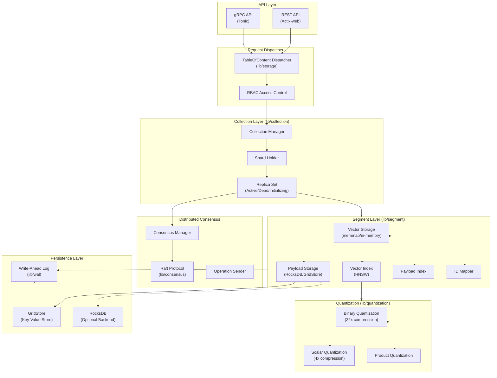
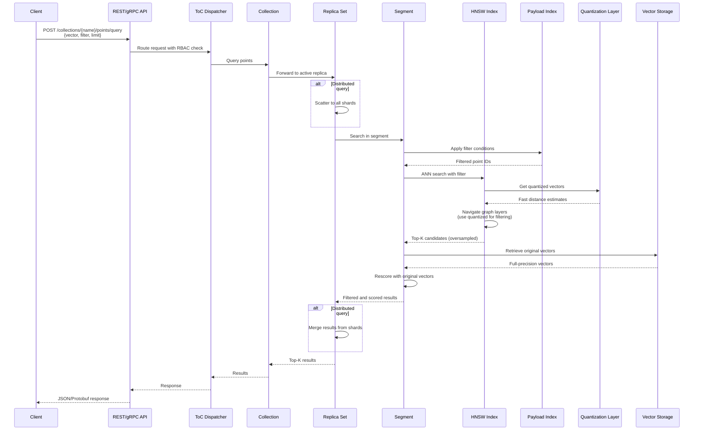
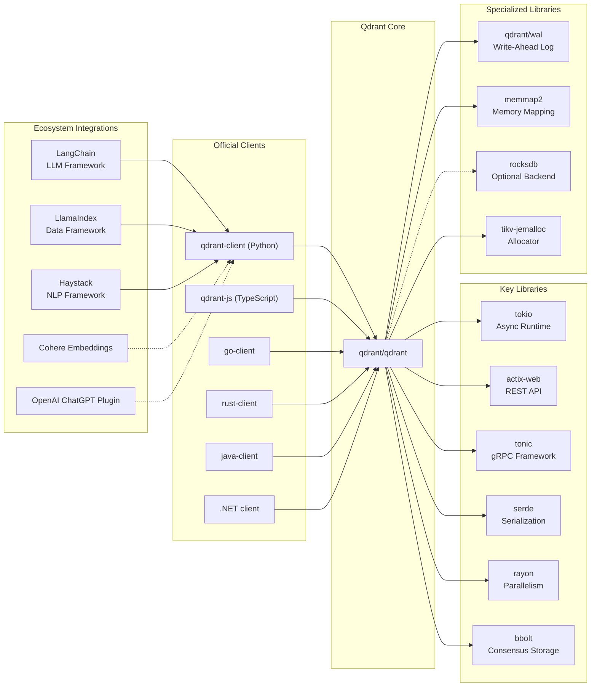

# Qdrant

> High-performance, massive-scale Vector Database and Vector Search Engine for the next generation of AI

| Metadata | |
|---|---|
| Repository | https://github.com/qdrant/qdrant |
| License | Apache-2.0 |
| Primary Language | Rust |
| Category | Database |
| Analyzed Release | `v1.16.3` (2025-12-19) |
| Stars (approx.) | 28,600+ |
| Generated by | Claude Opus 4.6 (Anthropic) |
| Generated on | 2026-02-08 |

## Overview

Qdrant (read: quadrant) is a vector similarity search engine and vector database written in Rust. It provides a production-ready service with a convenient API to store, search, and manage points (vectors with additional payload). Qdrant is tailored for extended filtering support, making it useful for neural-network or semantic-based matching, faceted search, and recommendation systems.

Problems it solves:

- Efficient similarity search at massive scale with sub-millisecond latency for high-dimensional vectors
- Advanced filtering combining vector similarity with structured payload queries (keyword matching, ranges, geo-locations)
- Memory-efficient vector storage through multiple quantization techniques (binary, scalar, product)
- Production-ready distributed deployment with horizontal scaling via sharding and replication

Positioning:

Qdrant distinguishes itself from alternatives like Pinecone, Weaviate, and Milvus through its Rust-based implementation providing high performance and reliability, unique extended filtering capabilities that allow complex payload queries during vector search, and flexible deployment options including in-memory, on-disk, and fully managed cloud. It is widely adopted in RAG (Retrieval-Augmented Generation) systems, semantic search applications, and recommendation engines.

## Architecture Overview

Qdrant employs a layered architecture with clear separation between API layer, collection management, distributed consensus, and storage engine. The system is built around the concept of segments (independent storage units) organized into shards managed by replica sets for high availability.

## Core Components

### API Layer (`lib/api`)

- Responsibility: Expose REST and gRPC interfaces for vector operations and cluster management
- Key files: `lib/api/src/rest/`, `lib/api/src/grpc/`
- Design patterns: Protocol Buffers (gRPC), OpenAPI 3.0 specification (REST)

The API layer provides dual interfaces: REST API built with Actix-web for ease of integration and gRPC for high-performance production workloads. The gRPC interface uses Tonic and Protocol Buffers with a comprehensive service definition covering collections, points, snapshots, and cluster operations. The REST API is fully documented with OpenAPI 3.0 specifications, enabling automatic client generation for various programming languages.

Both interfaces converge at the dispatcher layer, which routes requests through RBAC (Role-Based Access Control) introduced in version 1.9.0 and then to the appropriate collection or cluster operation.

### Collection Manager (`lib/collection`)

- Responsibility: Manage collections, shards, replica sets, and coordinate distributed operations
- Key files: `lib/collection/src/collection/mod.rs`, `lib/collection/src/shards/`
- Design patterns: Shard-based partitioning, Replica Set pattern, State machine for shard lifecycle

The Collection is the top-level data structure representing a named set of points with a specific vector configuration. Each collection contains a ShardHolder that manages multiple ShardReplicaSet instances. The replica set implements a state machine with states including Active, Dead, Initializing, and Listener.

Collections support sophisticated sharding strategies: hash-based sharding for automatic distribution and custom shard keys for multi-tenant deployments (introduced in version 1.7). The collection manager coordinates shard transfers during rebalancing operations and handles peer failures through replica promotion.

Transfer tasks are managed through TransferTasksPool with support for streaming and WAL-based transfer methods, enabling zero-downtime resharding operations.

### Segment Engine (`lib/segment`)

- Responsibility: Store and index vectors and payloads within a single segment
- Key files: `lib/segment/src/segment/`, `lib/segment/src/index/hnsw_index/`, `lib/segment/src/vector_storage/`
- Design patterns: Composite pattern (segment = vector storage + payload storage + indexes), Strategy pattern (multiple storage backends)

A Segment is the fundamental storage unit containing vector storage, payload storage, HNSW index, payload index, and ID mapper. Segments are immutable after optimization, enabling efficient caching and concurrent access.

The segment supports multiple storage modes: in-memory storage for maximum performance, memmap storage for large datasets exceeding RAM capacity, and on-disk storage with inline optimization placing vector copies within the HNSW index file for reduced I/O operations (3-4x storage increase but faster searches).

The ID mapper translates external UUIDs to internal sequential point IDs, enabling efficient array-based indexing. Payload storage uses either GridStore (Qdrant's custom key-value store optimized for small payloads) or RocksDB for larger datasets.

### HNSW Vector Index (`lib/segment/src/index/hnsw_index/`)

- Responsibility: Hierarchical Navigable Small World graph index for approximate nearest neighbor search
- Key files: `lib/segment/src/index/hnsw_index/hnsw.rs`, `lib/segment/src/index/hnsw_index/graph_links.rs`
- Design patterns: Hierarchical graph structure, SIMD-accelerated distance calculations

Qdrant implements a custom HNSW (Hierarchical Navigable Small World) index optimized for Rust and production workloads. The HNSWIndex struct holds hierarchical graph layers where each point has bidirectional links to M neighbors (M0 for layer 0, M for higher layers).

Graph links support three storage formats: Plain (uncompressed u32 arrays), Compressed (bit-packed for reduced storage), and Custom. The graph structure is self-referential and implements careful locking strategies to enable concurrent reads during index construction.

The index leverages SIMD (Single Instruction Multiple Data) instructions for x86-x64 AVX and ARM Neon architectures, accelerating distance calculations by processing multiple vector components simultaneously. Entry points are cached for faster search initialization, and the build process is parallelized using Rayon with heuristics to determine optimal thread count.

The HNSW index supports on-disk storage through memmap, and when combined with inline storage, it embeds full-precision vectors directly in the graph file to minimize I/O operations during search.

### Quantization Engine (`lib/quantization`)

- Responsibility: Compress vectors to reduce memory usage while maintaining search quality
- Key files: `lib/quantization/src/`, specific implementations per quantization type
- Design patterns: Strategy pattern (multiple quantization algorithms), Hybrid storage (quantized for search, original for rescore)

Qdrant provides three quantization methods addressing different memory-speed-accuracy tradeoffs:

Binary Quantization converts each dimension to a single bit (value > 0 → 1, value ≤ 0 → 0), achieving 32x compression. Distance calculations use bitwise operations (Hamming distance via XOR + popcount), delivering up to 40x speedup. This method requires centered vector distributions and is ideal for models like OpenAI text-embedding-3 or Cohere Embed v3.

Scalar Quantization maps float32 dimensions (4 bytes) to int8 (1 byte) through learned range mapping, achieving 4x compression. It provides universal applicability with good accuracy preservation and is recommended as the default quantization method.

Product Quantization divides vectors into subvectors and uses learned codebooks for compression, offering configurable compression ratios.

The quantization system implements a hybrid storage strategy: quantized vectors in RAM for fast filtering, original vectors on disk for high-fidelity rescoring. Oversampling parameters control the ratio of candidates retrieved using quantized vectors versus rescored using full precision.

### Distributed Consensus (`lib/consensus`, `src/consensus`)

- Responsibility: Maintain cluster topology and collection configuration consistency via Raft
- Key files: `src/consensus/`, `lib/storage/src/content_manager/consensus_manager.rs`
- Design patterns: Raft consensus protocol, Operation log replication

Qdrant uses the Raft consensus protocol to ensure consistency across distributed deployments. Raft manages cluster membership, collection metadata, and shard assignments but does not replicate vector data (handled separately by replica sets).

The ConsensusManager coordinates Raft operations with the TableOfContent (ToC), which maintains the authoritative state of all collections. Operations are submitted through OperationSender and replicated to the majority of nodes before acknowledgment.

Qdrant requires at least 3 nodes for production deployments to maintain quorum during single-node failures. Raft ensures that as long as more than 50% of nodes are online and no single shard is fully hosted on offline nodes, all operations remain unaffected.

The consensus layer also manages shard transfer orchestration, ensuring that resharding operations maintain consistency guarantees even during network partitions.

### Write-Ahead Log (`lib/wal`)

- Responsibility: Durably persist operations before applying to in-memory structures
- Key files: `lib/wal/src/`, integrated throughout segment and collection layers
- Design patterns: Sequential log, Append-only writes, Crash recovery

All data changes in Qdrant follow a two-stage process: first written to the Write-Ahead Log (WAL), then applied to in-memory segments. The WAL assigns sequential numbers to operations, ensuring total ordering and durability guarantees.

Each shard maintains its own WAL with default capacity of 32 MB (configurable via wal_capacity_mb). Operations are OperationWithClockTag entries containing both the operation data and vector clock information for distributed conflict resolution.

During recovery from crashes or restarts, Qdrant replays operations from the WAL to reconstruct in-memory state. Recovery points track the progress of WAL consumption across replicas, enabling efficient shard transfers and incremental synchronization.

The WAL enables streaming transfers where a source shard continuously sends WAL entries to the target shard, minimizing downtime during resharding operations.

## Data Flow

### Vector Search with Filtering

## Key Design Decisions

### 1. Rust Implementation

- Choice: Build the entire system in Rust rather than Python/C++ hybrid or Go
- Rationale: Memory safety without garbage collection ensures predictable latency for vector search. Zero-cost abstractions enable high-level code without performance penalties. Strong type system catches distributed system bugs at compile time. Ecosystem provides excellent async runtime (Tokio), web frameworks (Actix, Tonic), and SIMD libraries
- Trade-offs: Steeper learning curve for contributors compared to Python. Longer compile times during development. Smaller ecosystem compared to C++ for certain ML operations (mitigated by optional GPU support)

### 2. Segment-Based Storage Architecture

- Choice: Divide collection data into independent segments with separate vector storage, payload storage, and indexes
- Rationale: Segments enable incremental optimization where large segments are created through merging without blocking writes. Immutable optimized segments support concurrent reads without locking. Segment isolation enables parallel index construction and segment-level caching. Per-segment design simplifies backup and recovery operations
- Trade-offs: Search must query multiple segments and merge results (overhead for small segments). Optimizer must balance segment count versus segment size. More complex than monolithic index structures

### 3. Hybrid HNSW + Extended Filtering

- Choice: Integrate payload filtering directly into HNSW graph traversal rather than post-filtering
- Rationale: Post-filtering on vector search results fails when most top-K vectors do not match the filter, requiring deep search or iteration. Qdrant extends the HNSW graph with payload index awareness, allowing graph traversal to skip nodes not matching the filter. This "filter-then-search" approach maintains high recall even with selective filters
- Trade-offs: More complex indexing logic and higher memory overhead for payload indexes. Filter selectivity impacts performance (very selective filters may degrade to linear scan). Requires careful index selection for filtered fields

### 4. Multiple Quantization Strategies

- Choice: Implement binary, scalar, and product quantization with hybrid storage (quantized for search, original for rescore)
- Rationale: Different embedding models and use cases benefit from different quantization methods. Binary quantization excels for centered distributions, scalar provides universal applicability, and product offers configurable compression. Hybrid storage ensures accuracy is maintained through rescoring while enabling memory savings
- Trade-offs: Increased storage requirements for dual representation (mitigated by storing originals on disk). Additional complexity in index building and search logic. Oversampling parameter tuning required for optimal accuracy/speed tradeoff

### 5. Raft for Metadata, Replica Sets for Data

- Choice: Use Raft consensus only for cluster topology and collection configuration, not for vector data replication
- Rationale: Vector data is high-volume and would overwhelm a traditional consensus log. Raft ensures consistency of metadata (collection schemas, shard assignments, cluster membership). Data replication uses dedicated replica sets with WAL streaming, optimized for high throughput
- Trade-offs: Two-tier consistency model increases complexity. Requires careful coordination between Raft state and replica state. Potential for split-brain scenarios if not handled correctly (mitigated by replica state machines)

### 6. Custom GridStore Key-Value Store

- Choice: Develop a custom key-value store (GridStore) for payload storage instead of solely relying on RocksDB
- Rationale: RocksDB optimizations target large-scale workloads but introduce overhead for small payloads typical in vector search. GridStore is optimized for Qdrant's access patterns with lower overhead, faster iteration, and better integration with memmap storage. Remains compatible with RocksDB for users requiring its features
- Trade-offs: Maintenance burden of custom storage engine. GridStore lacks some advanced RocksDB features (complex transactions, column families). Dual codebase increases testing surface

### 7. Async I/O with io_uring

- Choice: Leverage Linux io_uring for asynchronous disk operations in storage layer
- Rationale: io_uring provides superior performance for async I/O compared to traditional epoll/select, especially for network-attached storage. Maximizes disk throughput utilization when vectors are stored on disk. Reduces latency variance for mixed read/write workloads
- Trade-offs: Linux-specific optimization (fallback to standard async I/O on other platforms). Requires Linux kernel 5.1+ for full feature support. Additional complexity in I/O error handling

## Dependencies

## Testing Strategy

Qdrant employs a comprehensive multi-layered testing approach ensuring reliability at scale.

Unit tests: Each library module (`lib/segment`, `lib/collection`, `lib/quantization`, etc.) contains extensive unit tests in `tests/` subdirectories and inline tests. Tests leverage the `proptest` framework for property-based testing, especially for HNSW graph invariants and quantization accuracy bounds. Fixtures in `testdata/` directories enable golden file testing for serialization formats.

Integration tests: The `tests/` directory contains end-to-end integration tests covering collection operations, distributed consensus scenarios, and shard transfer workflows. Tests use `sealed_test` for isolated test execution with temporary directories. Docker-based cluster tests verify multi-node scenarios including network partitions and leader elections.

Benchmarks: Criterion-based benchmarks in `benches/` directories measure performance of critical paths including HNSW search, quantization encoding/decoding, and segment merging. Continuous benchmarking tracks performance regressions across releases.

CI/CD: GitHub Actions workflows (`rust.yml`) run on every commit covering: linting with Clippy, formatting with rustfmt, unit and integration tests across Linux/macOS/Windows, build verification for Docker images, and security audit with cargo-audit. Release process includes: automated changelog generation, multi-architecture Docker builds (amd64, arm64), Debian package creation, and signature verification via GPG.

## Key Takeaways

1. Segment isolation enables scalability: Dividing data into independent, immutable segments allows Qdrant to scale horizontally while enabling concurrent operations, incremental optimization, and efficient caching. This pattern is applicable to any system requiring high-throughput writes with periodic compaction.

2. Filter-aware vector search: Integrating filtering directly into HNSW graph traversal rather than post-filtering maintains high recall even with selective filters. This design decision addresses a fundamental limitation of traditional vector databases where filters are applied after vector search, often requiring expensive iterations.

3. Quantization as a first-class feature: Supporting multiple quantization strategies with hybrid storage (quantized for search, original for rescore) balances memory efficiency with accuracy. The oversampling mechanism provides a tunable knob for the accuracy-speed tradeoff without requiring data re-ingestion.

4. Two-tier consistency model: Using Raft for metadata consistency while implementing separate replica sets for data replication optimizes for the different characteristics of low-volume control plane operations versus high-volume data plane operations. This separation is crucial for vector databases where data volume far exceeds metadata volume.

5. Rust for production vector databases: Rust's memory safety guarantees, zero-cost abstractions, and excellent concurrency primitives make it ideal for building high-performance vector databases. The lack of garbage collection ensures predictable latency, critical for real-time search workloads.

6. Custom storage engines for specialized workloads: While mature storage engines like RocksDB are valuable, domain-specific optimizations (like GridStore for small payloads) can provide significant performance improvements. The tradeoff is maintenance burden versus performance gains for the specific access patterns.

7. SIMD acceleration for vector operations: Leveraging CPU SIMD instructions (AVX, Neon) for distance calculations and quantized vector comparisons delivers substantial performance improvements. This hardware-aware optimization is essential for competitive vector search performance.

## References

- [Qdrant Official Documentation](https://qdrant.tech/documentation/)
- [Qdrant Internals Article](https://qdrant.tech/articles/qdrant-internals/)
- [Binary Quantization - Vector Search, 40x Faster](https://qdrant.tech/articles/binary-quantization/)
- [Scalar Quantization: Background, Practices & More](https://qdrant.tech/articles/scalar-quantization/)
- [Distributed Deployment Guide](https://qdrant.tech/documentation/guides/distributed_deployment/)
- [Storage Architecture Documentation](https://qdrant.tech/documentation/concepts/storage/)
- [Introducing GridStore: Qdrant's Custom Key-Value Store](https://qdrant.tech/articles/gridstore-key-value-storage/)
- [Quantization Guide](https://qdrant.tech/documentation/guides/quantization/)
- [GitHub - qdrant/wal: Write Ahead Logging for Rust](https://github.com/qdrant/wal)
- [DeepWiki - qdrant/qdrant](https://deepwiki.com/qdrant/qdrant)
